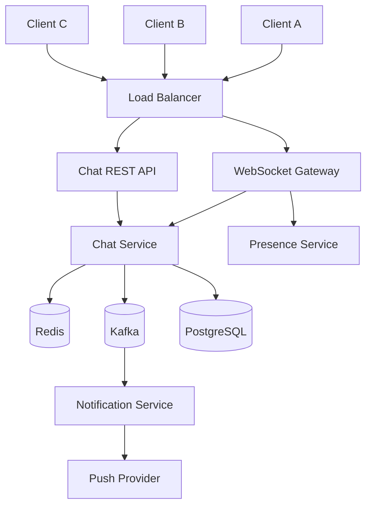
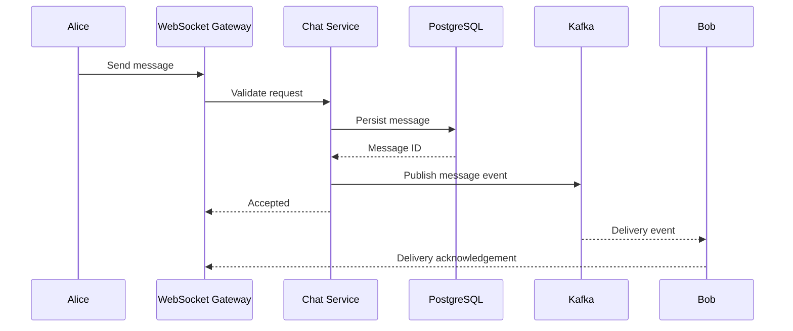
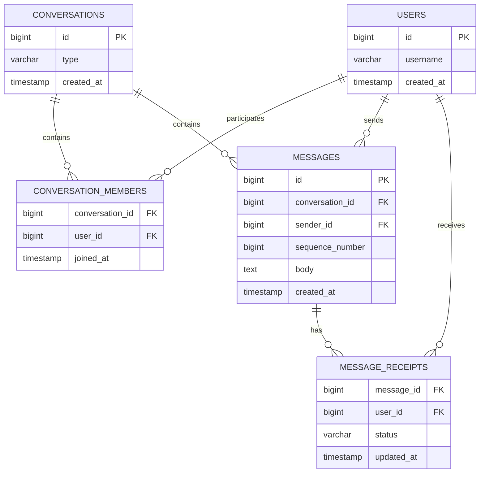
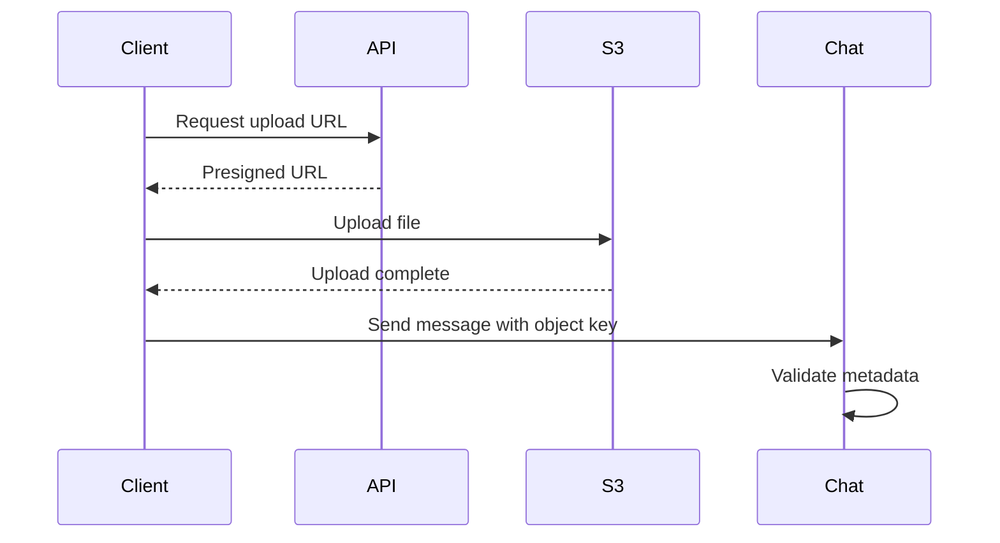
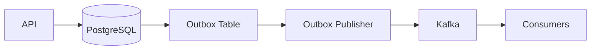

# 04- Chat Application

## Overview

A chat application is a distributed, stateful communication system where users exchange messages with low latency while the platform manages presence, delivery, ordering, persistence, notifications, and synchronization across multiple devices.

A production chat system must solve several problems simultaneously:

- Real-time message delivery
- Durable message storage
- Conversation membership
- Message ordering
- Online/offline presence
- Delivery and read receipts
- Multi-device synchronization
- Push notifications
- Connection management
- Horizontal scaling
- Failure recovery
- Abuse prevention
- Observability

The core architectural challenge is that chat combines **real-time communication** with **durable distributed state**.

A simplified architecture is:

```text
                    Clients
                       |
                       v
              Load Balancer / Gateway
                       |
             +---------+---------+
             |                   |
             v                   v
      WebSocket Gateway      REST API
             |                   |
             +---------+---------+
                       |
                       v
                Chat Services
                 /    |    \
                /     |     \
               v      v      v
           Redis    Kafka   PostgreSQL
             |        |        |
             |        |        |
          Presence   Events   Messages
             |
             v
      Notification Service
             |
             v
      Push Notification
```

The exact architecture depends on scale, consistency requirements, message types, and product requirements. A small internal chat application can use a substantially simpler design than a global messaging platform.

## Requirements

A typical one-to-one and group chat system should support:

### Functional Requirements

- User-to-user messaging
- Group conversations
- Conversation creation
- Message history
- Message timestamps
- Delivery status
- Read status
- Online/offline presence
- Typing indicators
- Multiple devices per user
- Push notifications
- Message deletion or retention policies
- Optional attachments
- Optional message search

### Non-Functional Requirements

The system should provide:

- Low message delivery latency
- Durable message storage
- High availability
- Horizontal scalability
- Per-conversation ordering
- Reliable synchronization after reconnect
- Fault isolation
- Secure authentication and authorization
- Observable message delivery

## Scope Decisions

Before designing the architecture, establish what the system does not need to support.

For example:

| Capability | Scope |
|---|---|
| 1-to-1 chat | Required |
| Group chat | Required |
| Message history | Required |
| Delivery receipts | Required |
| Read receipts | Required |
| Typing indicators | Optional |
| Voice/video calls | Out of scope |
| End-to-end encryption | Separate design concern |
| Message search | Optional |
| File attachments | Optional |
| Message reactions | Optional |

This prevents the design from becoming unnecessarily complex.

## Capacity Assumptions

System design decisions depend heavily on traffic assumptions.

Example interview assumptions:

```text
Registered users       = 100 million
Daily active users     = 20 million
Concurrent users       = 2 million
Messages/user/day      = 50
Average message size   = 1 KB
Peak multiplier        = 5x
```

Estimated daily messages:

```text
20 million × 50
= 1 billion messages/day
```

Average message rate:

```text
1,000,000,000 / 86,400
≈ 11,574 messages/second
```

If peak traffic is 5× average:

```text
≈ 58,000 messages/second
```

The exact numbers are less important than demonstrating the reasoning process.

## Traffic Characteristics

Chat traffic is different from traditional REST APIs.

A REST API often looks like:

```text
Request -> Response -> Connection ends
```

Chat involves:

```text
Long-lived connection
        |
        +--> message
        +--> message
        +--> typing event
        +--> presence event
        +--> receipt
        +--> message
```

This changes the infrastructure requirements significantly.

## Connection Management

WebSockets are commonly used for real-time bidirectional communication.

The client establishes a persistent connection:

```text
Client
   |
   | HTTP Upgrade
   v
WebSocket Gateway
   |
   | persistent TCP connection
   |
   +---- message
   +---- message
   +---- event
```

The server can send events without waiting for another client request.

### Why WebSockets?

They provide:

- Bidirectional communication
- Low message overhead after connection establishment
- Server-initiated events
- Persistent connections

They are suitable for:

- Chat messages
- Typing indicators
- Presence
- Delivery receipts
- Read receipts

### Alternatives

| Technology | Communication | Typical Chat Use |
|---|---|---|
| REST | Request/response | History, authentication, management APIs |
| WebSocket | Bidirectional | Real-time messaging |
| SSE | Server -> client | Notifications, one-way events |
| gRPC streaming | Bidirectional | Internal service communication |
| Long polling | Request/response | Legacy compatibility |

For browser-based chat, WebSockets are generally the natural real-time transport.

## High-Level Architecture



The responsibilities should be separated conceptually even if some are initially implemented in the same service.

## Core Components

| Component | Responsibility |
|---|---|
| API Gateway | Authentication, routing, edge controls |
| WebSocket Gateway | Persistent client connections |
| Chat Service | Message validation and business rules |
| Conversation Service | Membership and conversation metadata |
| Presence Service | Online/offline state |
| Message Store | Durable message persistence |
| Redis | Presence, connection routing, ephemeral state |
| Kafka | Durable event streaming and asynchronous processing |
| Notification Service | Push notification orchestration |
| PostgreSQL | Users, conversations, memberships, messages |
| Object Storage | Attachments |
| Observability Stack | Metrics, logs, traces |

## Message Flow

Consider:

```text
Alice -> Bob
```

A message might flow as follows:



A production implementation may optimize this path, but the key invariant is:

> A message should become durable before the system treats it as safely accepted.

## Message Lifecycle

A message can move through states:

```text
CREATED
   |
   v
PERSISTED
   |
   v
DISPATCHED
   |
   v
DELIVERED
   |
   v
READ
```

Failure paths may include:

```text
PERSISTED
   |
   +---- recipient offline
   |
   v
QUEUED / PENDING

PERSISTED
   |
   +---- delivery failure
   |
   v
RETRY
```

The exact state model depends on product semantics.

## Message Data Model

A relational model might contain:

```text
users
conversations
conversation_members
messages
message_receipts
devices
```

Example schema:



## Conversation Model

A conversation usually has:

```text
Conversation
    |
    +-- members
    +-- metadata
    +-- messages
```

For a direct message:

```text
Conversation 100
    |
    +-- Alice
    +-- Bob
```

For a group:

```text
Conversation 200
    |
    +-- Alice
    +-- Bob
    +-- Carol
    +-- David
```

Using a conversation identifier rather than modeling every direct message as a unique pair simplifies:

- Message storage
- Group chat
- Membership
- Permissions
- Read state
- Message history

## Message Schema

A practical message record might contain:

```text
message_id
conversation_id
sender_id
client_message_id
sequence_number
body
message_type
created_at
edited_at
deleted_at
```

The `client_message_id` is particularly useful for idempotency.

Example:

```json
{
  "client_message_id": "01JABC123",
  "conversation_id": "conv-123",
  "type": "text",
  "body": "Hello"
}
```

If the client retries the same message because of a network timeout, the server can detect the duplicate.

## Idempotency

Mobile networks are unreliable.

The client may send:

```text
POST message
      |
      v
Server persists message
      |
      X
Response lost
      |
      v
Client retries
```

Without idempotency:

```text
Hello
Hello
```

may be stored twice.

With a client-generated unique identifier:

```text
client_message_id = abc123
```

the server can enforce:

```text
UNIQUE(sender_id, client_message_id)
```

This makes retries safe.

## Message Ordering

Ordering is one of the hardest parts of chat system design.

Suppose:

```text
Message A
Message B
Message C
```

are sent in that order.

Network delivery can produce:

```text
B
A
C
```

The system therefore needs an ordering model.

A common requirement is:

> Messages within the same conversation should have a deterministic order.

Global ordering across the entire system is usually unnecessary and expensive.

## Per-Conversation Ordering

Assign a monotonically increasing sequence number per conversation:

```text
conversation = 123

message A -> sequence 1001
message B -> sequence 1002
message C -> sequence 1003
```

Clients can use this sequence to detect missing messages.

```text
1001
1002
1004
```

indicates:

```text
1003 missing
```

The client can request it from the server.

## Why Not Global Ordering?

A global sequence such as:

```text
1
2
3
4
...
```

requires coordination across the entire system.

At high scale, this becomes unnecessary contention.

Instead:

```text
Conversation A:
1, 2, 3

Conversation B:
1, 2, 3

Conversation C:
1, 2, 3
```

provides sufficient ordering semantics for most chat systems.

## Ordering vs Timestamp

Timestamps are not reliable ordering mechanisms.

Two messages can have:

```text
created_at(A) = 12:00:00.100
created_at(B) = 12:00:00.099
```

because of clock differences or network timing.

Use explicit sequence numbers when deterministic ordering matters.

Timestamps remain useful for display and auditing.

## Message IDs

A message ID should be globally unique.

Possible approaches include:

- UUID
- UUIDv7
- Snowflake-style IDs
- Database-generated IDs

Time-sortable identifiers such as UUIDv7 can be useful because they provide uniqueness while preserving approximate chronological ordering.

Do not rely on the message ID alone for per-conversation ordering unless its semantics explicitly guarantee the required ordering.

## Ordering Under Concurrent Sends

Suppose Alice and Bob send simultaneously:

```text
Alice -> A
Bob   -> B
```

There may be no universally meaningful "true" order.

The system should define deterministic semantics.

For example:

```text
Server-assigned sequence number
```

determines the canonical order.

The important requirement is consistency:

```text
All clients eventually see:
A, B
```

rather than:

```text
Alice sees A, B
Bob sees B, A
```

## Kafka Partitioning

Kafka can help preserve ordering.

Use:

```text
partition key = conversation_id
```

Then all messages for the same conversation go to the same partition.

```text
Conversation 100
      |
      v
Kafka Partition 7

Conversation 200
      |
      v
Kafka Partition 3
```

Kafka preserves message order within a partition.

It does **not** provide global ordering across all partitions.

## Kafka Ordering Limitation

If:

```text
conversation A -> partition 1
conversation B -> partition 2
```

Kafka cannot guarantee an ordering relationship between A and B.

That is normally desirable because those conversations are independent.

The design should align partitioning with the required ordering boundary.

## Message Persistence

PostgreSQL is a reasonable choice for many chat systems.

Messages are durable business data and often require:

- Transactions
- Queryability
- Indexing
- Referential integrity
- Operational tooling

A basic query might be:

```sql
SELECT
    id,
    sender_id,
    body,
    created_at,
    sequence_number
FROM messages
WHERE conversation_id = $1
  AND sequence_number < $2
ORDER BY sequence_number DESC
LIMIT 50;
```

The critical index is typically aligned with the access pattern:

```sql
CREATE INDEX idx_messages_conversation_sequence
ON messages (conversation_id, sequence_number DESC);
```

## Pagination

Never load an entire conversation history.

Use cursor-based pagination.

Example:

```http
GET /conversations/123/messages?before=10500&limit=50
```

The server returns:

```text
messages 10451-10500
```

The client can request older messages using:

```text
before=10451
```

Cursor pagination is generally more stable than large `OFFSET` queries for high-volume message tables.

## Why Offset Pagination Is Problematic

This query:

```sql
SELECT *
FROM messages
WHERE conversation_id = 123
ORDER BY sequence_number DESC
LIMIT 50 OFFSET 100000;
```

can become increasingly expensive as the offset grows.

Cursor-based pagination uses the index directly:

```sql
SELECT *
FROM messages
WHERE conversation_id = $1
  AND sequence_number < $2
ORDER BY sequence_number DESC
LIMIT 50;
```

This is much more scalable for deep history.

## Message Storage Growth

Chat systems generate large amounts of data.

A simple estimate:

```text
1 billion messages/day
× 1 KB
≈ 1 TB/day
```

This excludes:

- Indexes
- Metadata
- Replication
- Backups
- Attachments
- Storage overhead

Long-term retention therefore requires explicit storage planning.

## Message Partitioning

Large message tables can be partitioned by:

- Time
- Conversation hash
- Tenant
- Region

For example:

```text
messages_2026_01
messages_2026_02
messages_2026_03
```

Time partitioning can simplify:

- Retention
- Archival
- Maintenance
- Large-scale deletion

However, partitioning adds operational complexity and should be driven by actual table size and access patterns.

## Read Replicas

Message history is often read-heavy.

A possible architecture is:

```text
Write
  |
  v
Primary PostgreSQL
  |
  +----> Read Replica 1
  |
  +----> Read Replica 2
```

However, replicas introduce replication lag.

Immediately after sending a message, a user may query a replica that does not yet contain it.

For recent-message reads, consider:

- Reading from primary
- Session-aware routing
- Read-your-writes mechanisms
- Caching
- Waiting for a known replication position

## Redis Usage

Redis is useful for ephemeral state such as:

- Presence
- WebSocket connection metadata
- Short-lived delivery state
- Typing indicators
- Rate limiting
- Caching conversation metadata

Redis should generally not be the authoritative long-term message store unless the product explicitly accepts the durability trade-offs.

A useful separation is:

```text
PostgreSQL -> durable state
Redis      -> ephemeral / fast state
Kafka      -> event stream
```

## Presence

Presence answers:

```text
Is Alice online?
```

A simplistic implementation is:

```text
presence:user:123 = online
TTL = 30 seconds
```

The client sends heartbeats:

```text
heartbeat every 10 seconds
```

The server refreshes the TTL.

If the heartbeat stops:

```text
TTL expires
    |
    v
User considered offline
```

This is more reliable than relying only on disconnect events.

## Presence Is Eventually Consistent

A user's device may disconnect unexpectedly.

The server may not immediately know.

Therefore presence should usually be treated as:

```text
best-effort / eventually consistent
```

rather than transactional truth.

Displaying:

```text
online
```

for a few seconds after a network failure is generally acceptable.

## Multiple Devices

A user may have:

```text
Phone
Laptop
Tablet
Browser
```

Each device can maintain its own WebSocket connection.

Model:

```text
User 123
   |
   +-- Device A -> Connection A
   +-- Device B -> Connection B
   +-- Device C -> Connection C
```

A message may need to be delivered to all active devices.

## Connection Registry

A distributed connection registry might store:

```text
user_id -> device_id -> gateway_id
```

For example:

```text
user:123
    |
    +-- phone -> ws-gateway-7
    +-- laptop -> ws-gateway-2
```

Redis is commonly suitable for this ephemeral mapping.

## Why Connection Routing Matters

Suppose Bob is connected to:

```text
WebSocket Gateway 7
```

but Alice's message is received by:

```text
WebSocket Gateway 2
```

Gateway 2 needs a way to route the message to Gateway 7.

A distributed event system can provide this:

```text
Gateway 2
   |
   v
Kafka / PubSub
   |
   v
Gateway 7
   |
   v
Bob
```

The connection registry tells the system where Bob currently has active connections.

## WebSocket Gateway Scaling

WebSocket connections are long-lived.

Suppose:

```text
1 gateway = 100,000 connections
```

and the system requires:

```text
2 million connections
```

then approximately:

```text
20 gateways
```

are needed, before accounting for redundancy and capacity headroom.

The exact capacity depends on:

- Memory per connection
- TLS overhead
- Event frequency
- CPU
- Network bandwidth
- Kernel limits
- Runtime characteristics

Benchmark the actual gateway implementation.

## Load Balancing WebSockets

A load balancer must support long-lived WebSocket connections.

Once the connection is established:

```text
Client
   |
   v
Load Balancer
   |
   v
Gateway 7
```

the connection remains associated with Gateway 7.

The client does not necessarily need sticky sessions if the application has a distributed connection registry and message routing mechanism.

Sticky sessions can simplify some architectures but introduce:

- Uneven load
- More difficult failover
- Connection concentration

Prefer stateless routing where practical.

## Connection Failure

If a WebSocket gateway crashes:

```text
Gateway 7
    X
```

clients connected to it disconnect.

The client should:

1. Detect disconnection.
2. Reconnect.
3. Authenticate again.
4. Identify the last received sequence.
5. Request missed messages.
6. Resume normal delivery.

This is why durable storage and sequence numbers matter.

## Reconnection Synchronization

Suppose the client last received:

```text
sequence = 100
```

The server has:

```text
100
101
102
103
```

After reconnect:

```http
GET /conversations/123/messages?after=100
```

The server returns:

```text
101
102
103
```

The client then resumes real-time delivery.

This pattern is much more reliable than attempting to guarantee that every WebSocket packet survives network failures.

## At-Least-Once Delivery

A practical chat system often provides:

```text
at-least-once delivery
```

rather than exactly-once delivery.

This means a message may be delivered more than once, but should not be permanently lost.

The client or server uses message IDs to deduplicate.

Exactly-once delivery across:

```text
client
+
network
+
gateway
+
Kafka
+
database
```

is significantly more complex and often unnecessary.

## Delivery Semantics

| Semantic | Meaning |
|---|---|
| At-most-once | Message may be lost, but not duplicated |
| At-least-once | Message should not be lost but may duplicate |
| Exactly-once | Message processed exactly once |

For chat, at-least-once with idempotency is usually a practical engineering choice.

## Delivery Receipts

A message can have states:

```text
SENT
DELIVERED
READ
```

For example:

```text
Alice sends message
      |
      v
Persisted -> SENT
      |
      v
Bob's gateway receives -> DELIVERED
      |
      v
Bob opens conversation -> READ
```

These states should not be confused.

A `DELIVERED` event generally means the recipient device or gateway has acknowledged receipt, not necessarily that the user saw the message.

## Read Receipts

Read state can be modeled efficiently using a conversation-level cursor.

Instead of storing:

```text
every message read individually
```

store:

```text
user 123
conversation 456
last_read_sequence = 10500
```

Then:

```text
messages <= 10500
```

are considered read.

This is much more efficient than creating one row per read event.

## Typing Indicators

Typing events are ephemeral.

They generally should not be persisted to PostgreSQL.

Use:

```text
WebSocket
    |
    v
Gateway
    |
    v
Pub/Sub
    |
    v
Other participants
```

A typing event might look like:

```json
{
  "type": "typing",
  "conversation_id": "conv-123",
  "user_id": "user-456"
}
```

Typing indicators should have short TTLs and should not be treated as durable business state.

## Push Notifications

If the recipient is offline:

```text
Alice
  |
  v
Chat Service
  |
  v
Bob offline
  |
  v
Notification Service
  |
  +--> APNs
  |
  +--> FCM
```

The push notification should generally contain minimal sensitive content.

The client can then synchronize message state from the server.

## Notification Ordering

Push notifications are not a reliable message transport.

A push provider may:

- Delay notifications
- Collapse notifications
- Deliver them out of order
- Fail temporarily

Therefore:

```text
Push notification
```

should be treated as a wake-up or notification mechanism.

The authoritative message state remains on the backend.

## Attachments

Large files should not flow through the chat service.

Prefer:

```text
Client
   |
   | request upload URL
   v
Chat API
   |
   v
Object Storage
```

For example:

```text
AWS S3
```

using a presigned URL.

Flow:



This prevents the chat service from becoming a file-transfer bottleneck.

## Security

Chat systems handle private user data and therefore require strong authorization.

Every message operation should verify:

```text
Authenticated user
        +
Conversation membership
        +
Resource authorization
```

Do not rely on the client to provide a valid `conversation_id`.

For example:

```http
GET /conversations/999/messages
```

must verify that the authenticated user belongs to conversation `999`.

## WebSocket Authentication

WebSocket connections should be authenticated during connection establishment.

Possible mechanisms include:

- Secure session cookies
- Short-lived access tokens
- Connection-specific authentication

Do not put long-lived secrets into URLs because URLs can appear in logs and monitoring systems.

Use:

```text
WSS
```

for encrypted WebSocket traffic.

## Authorization on Every Message

Authenticating a WebSocket connection once does not automatically authorize every operation.

The server must validate:

```text
User -> conversation
User -> message
User -> attachment
User -> group membership
```

For example, after joining a group, a user may later be removed.

The authorization model must account for membership changes.

## Message Privacy

Avoid logging full message bodies in application logs.

Logs should generally contain:

```text
message_id
conversation_id
sender_id
event_type
request_id
timestamp
```

rather than:

```text
"body": "private user message"
```

This reduces privacy exposure.

## Abuse Protection

Chat systems can be abused for:

- Spam
- Phishing
- Harassment
- Automated messaging
- Credential attacks
- Malicious attachments

Controls may include:

- Rate limiting
- Message quotas
- Spam detection
- Content moderation
- Attachment validation
- User blocking
- Abuse reporting

Rate limits should exist at multiple dimensions:

```text
IP
User
Conversation
Recipient
Device
```

where appropriate.

## Multi-Region Architecture

Global chat systems may require multi-region deployment.

A simplified design:

```text
                 Global DNS
                     |
          +----------+----------+
          |                     |
          v                     v
       Region A              Region B
          |                     |
      Chat Stack             Chat Stack
          |                     |
       Storage               Storage
```

The key question is:

> Which region is authoritative for a conversation?

One strategy is conversation affinity:

```text
conversation_id
      |
      v
home region
```

All writes for that conversation are routed to the same region.

This simplifies ordering.

## Multi-Region Ordering

Global ordering is expensive.

Instead, define:

```text
Per-conversation ordering
```

and assign each conversation an authoritative write region.

For example:

```text
Conversation 100 -> ap-south-1
Conversation 200 -> us-east-1
Conversation 300 -> eu-west-1
```

Cross-region users still communicate, but the conversation's canonical write path remains deterministic.

## Cross-Region Latency

If Alice is in India and the conversation is hosted in the US:

```text
Alice
  |
  | high latency
  v
US conversation region
```

This increases write latency.

Possible strategies include:

- Conversation migration
- Regional ownership
- Multi-region replication
- Local edge gateways
- Asynchronous cross-region delivery

The correct choice depends on the product's latency requirements.

## Database Scaling

A large chat system may evolve from:

```text
Single PostgreSQL
```

to:

```text
Primary
   |
   +-- Read replicas
```

and eventually to:

```text
Conversation-sharded storage
```

Possible shard key:

```text
hash(conversation_id)
```

This keeps messages from one conversation together.

That is valuable because most message-history queries are scoped to one conversation.

## Sharding Trade-Offs

| Strategy | Advantage | Limitation |
|---|---|---|
| Single database | Simple | Limited scale |
| Read replicas | Scales reads | Replication lag |
| Time partitioning | Easier retention | More partitions |
| Conversation sharding | Local conversation access | Rebalancing complexity |
| Tenant sharding | Tenant isolation | Uneven tenant sizes |

Do not shard solely because "large systems should shard."

Shard when measured workload and storage requirements justify it.

## Kafka in the Architecture

Kafka is useful for asynchronous events:

```text
Message persisted
       |
       v
Kafka
  |
  +--> Notification Service
  +--> Analytics
  +--> Moderation
  +--> Search Indexer
  +--> Audit Pipeline
```

This decouples the message write path from secondary processing.

The synchronous path should remain small.

For example:

```text
Validate
  |
Persist
  |
Publish
```

while expensive secondary operations happen asynchronously.

## Kafka and Database Consistency

Writing to PostgreSQL and Kafka independently creates a consistency problem.

Bad pattern:

```text
DB commit succeeds
Kafka publish fails
```

Now the message exists but downstream consumers never receive the event.

Or:

```text
Kafka publish succeeds
DB commit fails
```

Now consumers see an event for data that does not exist.

The transactional outbox pattern addresses this.

## Transactional Outbox

Store the message and event in the same database transaction:

```text
Transaction
   |
   +-- messages
   |
   +-- outbox_events
```

Then a background publisher sends outbox events to Kafka.



This provides reliable event publication without requiring a distributed transaction between PostgreSQL and Kafka.

## Cache Strategy

Conversation metadata can be cached:

```text
conversation:{id}
members:{conversation_id}
```

However, message history should generally be treated as durable data rather than relying entirely on cache.

Cache invalidation is especially important when:

- Membership changes
- User leaves a conversation
- Permissions change
- Conversation is deleted

Authorization must never depend solely on stale cache state.

## Failure Scenarios

A senior-level design should explicitly consider failure.

### WebSocket Gateway Failure

```text
Gateway crashes
    |
    v
Clients reconnect
    |
    v
Fetch messages after last sequence
```

### Redis Failure

Potential impact:

- Presence unavailable
- Connection routing degraded
- Ephemeral features degraded

The durable message database should remain authoritative.

### Kafka Failure

The system should avoid losing accepted messages.

Transactional outbox events can remain pending until Kafka recovers.

### Database Failure

The service may:

- Fail writes
- Route reads to replicas
- Recover from failover

The product should clearly define whether temporary write unavailability is acceptable.

## Observability

Important metrics include:

### WebSocket Metrics

```text
active_connections
connection_rate
disconnect_rate
connection_duration
messages_per_connection
```

### Message Metrics

```text
messages_received
messages_persisted
messages_delivered
messages_failed
delivery_latency
read_latency
```

### Infrastructure Metrics

```text
Redis latency
Kafka consumer lag
Kafka throughput
Database CPU
Database connections
Database replication lag
```

### Business Metrics

```text
active conversations
daily active chat users
messages/user/day
delivery success rate
notification success rate
```

## Distributed Tracing

A message should ideally be traceable across:

```text
Client request
    |
    v
WebSocket Gateway
    |
    v
Chat Service
    |
    v
PostgreSQL
    |
    v
Outbox
    |
    v
Kafka
    |
    v
Notification Service
```

Use a correlation identifier such as:

```text
trace_id
message_id
conversation_id
```

Be careful not to expose sensitive identifiers in traces or logs.

## Service-Level Objectives

Example SLOs might include:

| Metric | Example Target |
|---|---:|
| Message persistence availability | 99.99% |
| Real-time delivery availability | 99.99% |
| p95 message delivery latency | < 500 ms |
| p99 message delivery latency | < 2 s |
| Message loss | 0 accepted-message loss |
| Presence freshness | < 30 s |

These are illustrative targets, not universal requirements.

## Cost Considerations

The largest costs can include:

- WebSocket gateway compute
- Network bandwidth
- PostgreSQL storage
- PostgreSQL replicas
- Kafka
- Redis
- Push notifications
- Object storage
- Cross-region traffic
- Backups

Message payload size matters.

If the system sends:

```text
1 billion messages/day
× 1 KB
```

that is already approximately:

```text
1 TB/day
```

before replication and infrastructure overhead.

Compression can help for suitable payloads, but CPU and latency costs must be measured.

## Disaster Recovery

Durable chat messages require strong backup and recovery strategies.

Consider:

```text
PostgreSQL backups
+
Point-in-time recovery
+
Cross-region replicas
+
Object-storage durability
+
Kafka retention
```

Define:

```text
RPO = acceptable data loss
RTO = acceptable recovery time
```

For example:

```text
RPO = < 1 minute
RTO = < 15 minutes
```

if the product requires near-continuous messaging.

The values must be determined from business requirements.

## Common Mistakes

### Treating WebSockets as the Source of Truth

A WebSocket connection is a transport channel, not durable storage.

Persist messages independently.

### Assuming WebSocket Delivery Is Reliable

Connections can disappear at any time.

Use:

```text
message IDs
+
sequence numbers
+
reconnect synchronization
```

### Using Redis as the Only Message Store

Redis is excellent for ephemeral state but should not automatically become the authoritative durable message store.

### Using Timestamps for Ordering

Clock differences and concurrent requests make timestamps insufficient for canonical ordering.

Use explicit sequence semantics.

### Using Global Message Ordering

Global ordering creates unnecessary coordination.

Order messages at the smallest required scope, usually the conversation.

### Storing Typing Indicators Permanently

Typing events are ephemeral and high-volume.

Do not persist them like normal messages.

### Sending Files Through the Chat Service

Large files consume application bandwidth and resources.

Use object storage with presigned uploads.

### No Idempotency

Network retries can duplicate messages.

Use client-generated IDs and server-side uniqueness constraints.

### Assuming Kafka Provides Exactly-Once End-to-End Delivery

Kafka's delivery guarantees do not automatically produce exactly-once behavior across databases, WebSockets, and external systems.

Design explicit idempotency and event-processing semantics.

### Ignoring Offline Users

A real chat system must support:

```text
offline
    |
    v
message persisted
    |
    v
notification
    |
    v
reconnect
    |
    v
synchronization
```

## Interview Traps

### "Use WebSockets and Redis; problem solved."

This does not address:

- Durability
- Ordering
- Reconnection
- Idempotency
- Multi-device delivery
- Offline users
- Kafka failures
- Database scaling

### "Kafka guarantees ordering."

Kafka guarantees ordering within a partition, not across all partitions.

Partition by `conversation_id` when conversation-level ordering is required.

### "Exactly-once delivery is required."

Exactly-once semantics across a distributed network are expensive and often unnecessary.

At-least-once delivery plus idempotency is usually more practical.

### "Presence must be strongly consistent."

Presence is normally ephemeral and eventually consistent.

A small delay in changing:

```text
online -> offline
```

is usually acceptable.

### "Every read receipt needs a database row."

For high-scale chat, a per-user conversation cursor is often more efficient:

```text
last_read_sequence
```

### "WebSocket connections require sticky sessions."

Sticky sessions can simplify routing, but they are not inherently required. A distributed connection registry and event routing layer can allow more flexible scaling and failover.

## Production Design Principles

A robust chat architecture should follow these principles:

### Separate Durable and Ephemeral State

```text
PostgreSQL
    -> messages, conversations, memberships

Redis
    -> presence, connections, ephemeral state

Kafka
    -> asynchronous events
```

### Keep the Synchronous Path Small

Prefer:

```text
Authenticate
Validate
Persist
Acknowledge
```

over:

```text
Authenticate
Validate
Persist
Moderate
Index
Notify
Analytics
Search
Transform
Acknowledge
```

Secondary work should generally be asynchronous.

### Design for Reconnection

Assume:

```text
connections fail
packets disappear
clients retry
devices switch networks
```

A robust synchronization protocol is more important than pretending the network is reliable.

### Define Ordering Explicitly

State exactly what must be ordered:

```text
Per conversation
```

rather than vaguely requiring:

```text
Global ordering
```

### Make Writes Idempotent

Use:

```text
client_message_id
+
database uniqueness constraint
```

to safely handle retries.

### Prefer Backpressure Over Unlimited Buffering

Every queue should have:

- Maximum capacity
- Consumer limits
- Monitoring
- Failure handling
- Retention policy

Unlimited buffering simply moves the failure point.

## Reference Technology Stack

A Python-oriented implementation might use:

| Concern | Technology |
|---|---|
| HTTP APIs | FastAPI / Django REST Framework |
| Real-time transport | WebSockets |
| Reverse proxy | Nginx |
| Load balancing | AWS ALB / API Gateway |
| Durable database | PostgreSQL |
| Cache / presence | Redis |
| Event streaming | Kafka |
| Background workers | Celery |
| Object storage | Amazon S3 |
| Containers | Docker |
| Orchestration | Kubernetes / ECS |
| CI/CD | GitHub Actions |
| Observability | OpenTelemetry + metrics/logging stack |

The technologies are interchangeable. The architecture should be driven by requirements rather than by selecting tools first.

## Simplified Django/FastAPI Boundary

A practical architecture could separate:

```text
                 Client
                   |
                   v
              Nginx / ALB
                /     \
               v       v
          REST API   WebSocket
               \       /
                v     v
                Chat Service
                    |
          +---------+---------+
          |         |         |
          v         v         v
      PostgreSQL  Redis     Kafka
                              |
                              v
                    Notification Service
```

Django or FastAPI can expose REST endpoints while a dedicated WebSocket layer handles long-lived connections.

The exact split depends on team expertise, scale, and operational complexity.

## Key Takeaways

- **Chat systems combine real-time transport with durable distributed state; WebSockets handle live delivery, while PostgreSQL or another durable store remains the source of truth for messages.**
- **Design ordering at the smallest required scope, typically per conversation, using sequence numbers and Kafka partitioning by `conversation_id` where event-stream ordering is required.**
- **Assume connections and networks fail; idempotent message writes, at-least-once delivery, reconnect synchronization, and durable message history are fundamental reliability mechanisms.**
- **Use Redis for high-speed ephemeral state such as presence and connection routing, Kafka for asynchronous event distribution, and object storage for large attachments rather than forcing everything through the chat service.**
- **At scale, focus on connection management, partitioning, backpressure, multi-device synchronization, observability, security, and failure isolation rather than simply adding more WebSocket servers.**