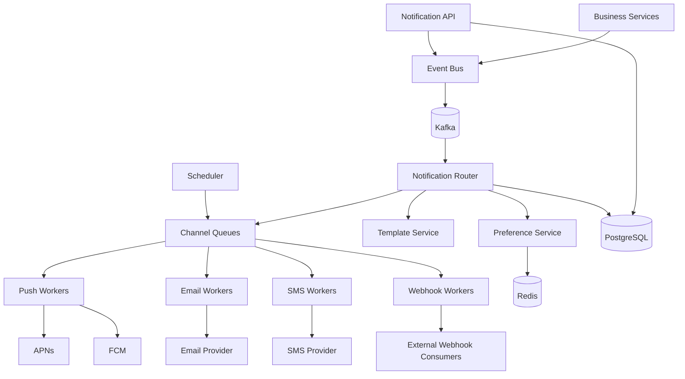
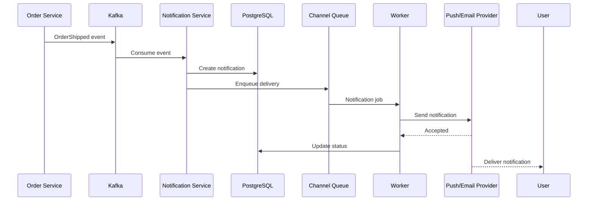
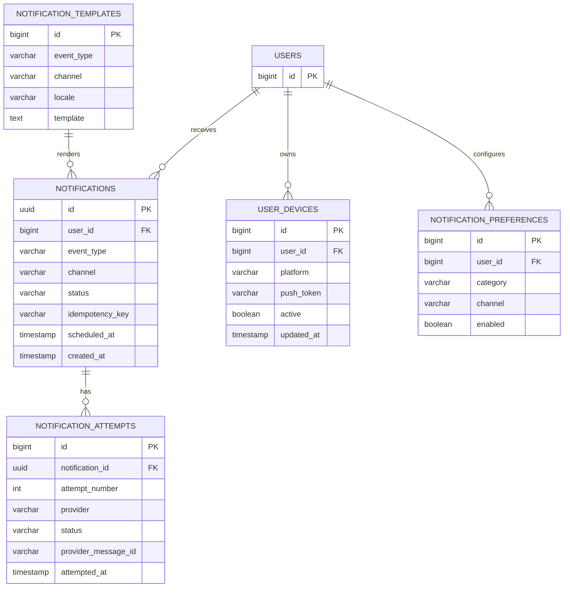
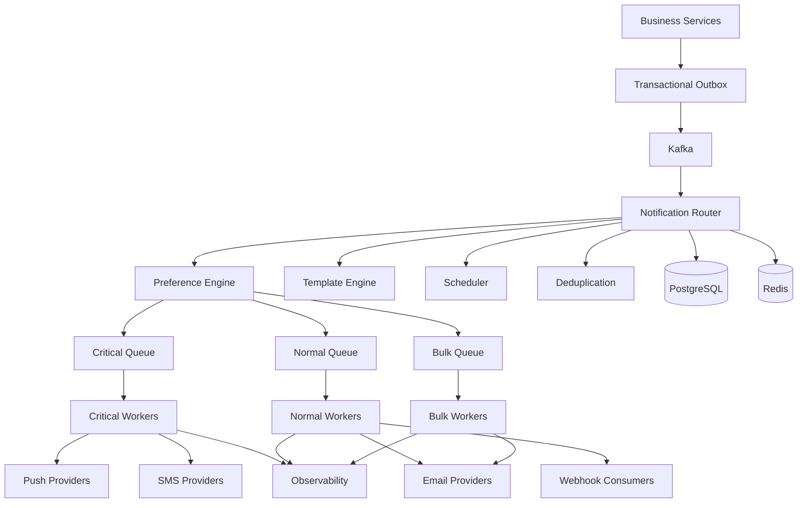

# 05- Notification System

## Overview

A notification system delivers time-sensitive information to users through one or more channels such as push notifications, email, SMS, in-app notifications, and webhooks.

At small scale, notification delivery can be implemented directly inside an application request. At production scale, this approach creates latency, reliability, and availability problems because external providers are slow, rate-limited, and independently failure-prone.

A production notification system therefore separates:

```text
Business Event
      |
      v
Notification Decision
      |
      v
Durable Event / Queue
      |
      v
Notification Workers
      |
      +----> Push
      +----> Email
      +----> SMS
      +----> In-App
      +----> Webhook
```

The central architectural principle is:

> Business services should generate notification-worthy events without becoming tightly coupled to notification providers.

A notification system must solve several distributed-systems problems:

- Reliable event ingestion
- Notification preference management
- Template rendering
- Multi-channel delivery
- Provider failures
- Retries
- Rate limiting
- Deduplication
- Idempotency
- Scheduling
- Fan-out
- User preferences
- Delivery tracking
- Observability
- Cost control
- Abuse prevention

## Requirements

A production notification platform commonly supports the following.

### Functional Requirements

- Send notifications triggered by application events.
- Support multiple delivery channels.
- Respect user notification preferences.
- Support immediate and scheduled notifications.
- Retry transient provider failures.
- Track notification lifecycle.
- Support templates and localization.
- Prevent accidental duplicate delivery.
- Support user-specific and system-wide rate limits.
- Provide delivery status.
- Support provider fallback where appropriate.

### Non-Functional Requirements

The system should provide:

- High availability
- Durable notification requests
- Low latency for real-time notifications
- Horizontal scalability
- Provider failure isolation
- At-least-once event processing
- Idempotent processing
- Operational visibility
- Controlled delivery costs

## Notification Channels

Common channels include:

| Channel | Latency | Typical Use | Reliability Characteristics |
|---|---|---|---|
| In-app | Very low | Activity, alerts | Requires active application |
| WebSocket | Very low | Real-time events | Connection-dependent |
| Push | Low | Mobile alerts | Provider/device dependent |
| Email | Seconds to minutes | Transactional communication | Provider dependent |
| SMS | Seconds to minutes | OTP, critical alerts | Expensive |
| Webhook | Low | Service integration | Consumer dependent |

A notification platform should not assume every notification belongs on every channel.

For example:

```text
Password reset
    -> Email
    -> Optional SMS

New chat message
    -> Push
    -> In-app

Marketing campaign
    -> Email
    -> Push
```

## Notification vs Message

A notification is not necessarily the source of truth.

For example:

```text
Order Service
     |
     v
Order #123 shipped
     |
     v
Notification Service
     |
     v
"Your order has shipped"
```

The notification references the underlying business state.

The notification itself should not become the authoritative representation of the order.

## High-Level Architecture



The architecture can initially be much smaller. The important design boundary is separating business logic from notification delivery.

## Event-Driven Architecture

The preferred integration model is event-driven.

For example:

```text
Order Service
     |
     | OrderShipped
     v
Kafka
     |
     v
Notification Service
```

The order service does not need to know:

- Which email provider is used
- Which push provider is used
- How retries work
- How templates are rendered
- Whether the user disabled marketing notifications

This reduces coupling.

## Why Asynchronous Processing Matters

Consider an API request:

```text
POST /orders
```

A poor implementation might perform:

```text
Create order
   |
Send email
   |
Send push
   |
Send SMS
   |
Return response
```

The request now depends on several external systems.

A better design is:

```text
Create order
   |
Persist event
   |
Return response
   |
   +--> Notification processing asynchronously
```

This keeps external provider latency outside the critical request path.

## Notification Request Lifecycle

A notification can move through:

```text
REQUESTED
    |
    v
ACCEPTED
    |
    v
QUEUED
    |
    v
PROCESSING
    |
    +------> RETRYING
    |           |
    |           v
    |        PROCESSING
    |
    v
SENT
    |
    v
DELIVERED
```

Terminal failure:

```text
PROCESSING
    |
    v
FAILED
```

The exact state model depends on whether the provider supplies delivery acknowledgements.

## Event Flow

A typical flow looks like:



The provider's acceptance is not necessarily equivalent to end-user delivery.

## Notification Data Model

A relational model can contain:

```text
notifications
notification_attempts
notification_preferences
notification_templates
user_devices
scheduled_notifications
```

Example:



## Notification Identity

Every notification should have a stable identifier.

For example:

```text
notification_id = 019abc...
```

A separate idempotency key can identify the business operation:

```text
order:123:shipment-confirmed
```

This distinction is useful because:

```text
notification_id
```

identifies a particular notification record, while:

```text
idempotency_key
```

prevents the same business event from creating duplicate notifications.

## Idempotency

Distributed systems naturally produce retries and duplicate events.

For example:

```text
Order Service
     |
     v
Kafka
     |
     v
Notification Service
     |
     X consumer crashes
     |
     v
Kafka redelivers event
```

Without idempotency:

```text
Email sent
Email sent again
```

A database uniqueness constraint can protect notification creation:

```sql
CREATE UNIQUE INDEX uq_notification_idempotency
ON notifications (idempotency_key);
```

The application should treat duplicate insertion as an already-processed event rather than as a fatal error.

## Delivery Semantics

Notification systems typically use:

```text
At-least-once processing
+
Idempotent delivery logic
```

Exactly-once processing is difficult when external providers are involved.

Consider:

```text
Worker -> Provider
          |
          v
       Accepted
          |
          X
Worker crashes before saving status
```

After restart, the worker cannot always know whether the provider already accepted the notification.

Therefore external provider APIs should be used with provider-supported idempotency where available.

## Retry Strategy

Not every failure should be retried.

### Transient Failures

Examples:

- Network timeout
- HTTP 429
- HTTP 500
- Temporary provider outage

These are usually retryable.

### Permanent Failures

Examples:

- Invalid email address
- Invalid device token
- Unauthorized API credentials
- Unsupported destination

These should generally fail without repeated retries.

## Exponential Backoff

A common strategy is:

```text
Attempt 1 -> immediately
Attempt 2 -> 1 second
Attempt 3 -> 2 seconds
Attempt 4 -> 4 seconds
Attempt 5 -> 8 seconds
```

With jitter:

```text
delay = min(max_delay, base * 2^attempt) + random_jitter
```

Jitter prevents thousands of workers from retrying simultaneously after a provider outage.

## Dead Letter Queue

Messages that cannot be successfully processed after the retry policy should move to a dead letter queue.

```text
Notification Queue
       |
       v
Worker
       |
       +--> Success
       |
       +--> Retry
       |
       +--> Dead Letter Queue
```

A DLQ should be monitored and operationally actionable.

Do not treat it as a place where failed notifications disappear.

## Provider Rate Limits

Providers commonly impose limits.

For example:

```text
Email provider
10,000 requests/minute
```

If the internal queue suddenly contains:

```text
100,000 notifications
```

workers cannot blindly send everything immediately.

Use:

- Worker concurrency limits
- Token-bucket rate limiting
- Provider-specific queues
- Backpressure
- Retry-after handling

## Multi-Provider Strategy

A notification platform may use multiple providers.

For example:

```text
Email
  |
  +--> Provider A
  |
  +--> Provider B
```

Benefits include:

- Provider outage resilience
- Capacity management
- Regional routing
- Cost optimization

However, provider failover creates complexity.

A notification may be accepted by Provider A but the application may fail to receive the response.

Blindly sending it to Provider B can create duplicates.

Provider failover therefore needs idempotency and clear delivery semantics.

## Provider Abstraction

Application code should not depend directly on provider SDKs.

Define an internal interface:

```python
from dataclasses import dataclass
from typing import Protocol


@dataclass(frozen=True)
class NotificationRequest:
    recipient: str
    subject: str
    body: str
    idempotency_key: str


@dataclass(frozen=True)
class DeliveryResult:
    provider_message_id: str
    accepted: bool


class EmailProvider(Protocol):
    def send(self, request: NotificationRequest) -> DeliveryResult:
        ...
```

Provider implementations can then be isolated:

```text
EmailProvider
    |
    +-- SESProvider
    +-- SendGridProvider
    +-- OtherProvider
```

This improves testing and provider migration.

## Channel-Specific Workers

Avoid one generic worker that handles every provider.

Prefer:

```text
notification.email
notification.push
notification.sms
notification.webhook
```

Each worker can have its own:

- Concurrency
- Rate limits
- Retry policy
- Timeout
- Provider configuration
- Failure handling

For example:

```text
Email
  -> high throughput
  -> longer retry window

SMS
  -> expensive
  -> stricter rate limits

Push
  -> high throughput
  -> short latency requirement
```

## Notification Preferences

Users often need controls such as:

```text
Security alerts
Order updates
Marketing
Product announcements
Chat notifications
```

Preferences should be evaluated before sending.

Example:

```text
OrderShipped
     |
     v
User Preferences
     |
     +-- Email enabled
     +-- Push enabled
     +-- SMS disabled
```

The router generates only the permitted channel deliveries.

## Preference Categories

Do not treat all notifications equally.

A useful classification is:

| Category | User Can Disable? | Example |
|---|---|---|
| Security | Usually no | Password changed |
| Transactional | Usually configurable | Order shipped |
| Marketing | Yes | Promotional campaign |
| Social | Usually yes | New follower |
| Operational | Depends | Service alert |

The exact policy is product-specific and may also be governed by legal requirements.

## Preference Race Conditions

Consider:

```text
User disables email
       |
       X
Notification worker already queued email
       |
       v
Email sent
```

There is no universal way to guarantee that an already-started delivery is canceled.

A practical approach is:

- Evaluate preferences as late as reasonably possible.
- Recheck preferences before provider submission for important categories.
- Define explicit semantics for queued notifications.
- Cancel scheduled notifications when preferences change where appropriate.

## Templates

Templates should be separated from business logic.

For example:

```text
event:
OrderShipped

locale:
en-IN

channel:
email

template:
"Your order {{ order_id }} has shipped."
```

The business service should publish structured data:

```json
{
  "event_type": "order.shipped",
  "order_id": "ORD-12345",
  "user_id": "user-456",
  "tracking_number": "TRK-789"
}
```

The notification service determines how that event is presented.

## Template Rendering

Template rendering should validate required variables.

For example:

```text
Template:
Your order {{ order_id }} has shipped.

Required:
order_id
```

If `order_id` is missing, fail before calling the external provider.

This prevents sending malformed notifications.

## Localization

Templates should be selected using:

```text
user locale
+
notification category
+
channel
```

For example:

```text
en-IN
bn-IN
hi-IN
en-US
```

Do not embed localization logic throughout application services.

## Scheduled Notifications

Some notifications should be sent later:

```text
Send reminder at 09:00 tomorrow
```

A scheduling component can persist:

```text
scheduled_at
status
notification_id
```

and enqueue due notifications.

For large workloads, avoid polling a huge table with expensive queries.

Use indexed time-based queries or dedicated scheduling infrastructure.

## Delayed Delivery

A simple model:

```text
scheduled_notifications
        |
        v
Scheduler
        |
        v
Notification Queue
        |
        v
Worker
```

The scheduler should be horizontally scalable without producing duplicate jobs.

Use leases, database locking, or a queue system with appropriate delayed-message semantics.

## Fan-Out

Some events produce many notifications.

Example:

```text
New post
   |
   v
1 million followers
   |
   v
1 million notifications
```

This is a fan-out problem.

Do not synchronously create and send one million notifications inside the original request.

Instead:

```text
Event
 |
 v
Fan-Out Service
 |
 +--> batches
 +--> queues
 +--> workers
```

## Fan-Out on Write

With fan-out on write:

```text
New event
   |
   v
Generate recipient notifications
```

Advantages:

- Fast recipient reads
- Simple delivery pipeline

Limitations:

- Expensive for users with millions of followers
- Large write amplification

Suitable when recipient sets are manageable.

## Fan-Out on Read

With fan-out on read:

```text
Store event once
      |
      v
Generate relevant notifications when user reads
```

Advantages:

- Lower write amplification
- Efficient for huge audiences

Limitations:

- More expensive reads
- More complex ranking and filtering
- Not ideal for immediate delivery

The correct strategy depends on traffic distribution.

## Hot Users and Celebrity Problem

Suppose one user has:

```text
50 million followers
```

A single event can create a massive workload.

Naive fan-out causes:

```text
1 event
    |
    +--> 50 million database writes
```

Possible strategies include:

- Hybrid fan-out
- Batch processing
- Delayed delivery
- Fan-out on read for large audiences
- Priority queues
- Recipient segmentation

Do not assume uniform fan-out.

## Priority Queues

Not all notifications have equal importance.

Example:

```text
Priority 1
Security alert

Priority 2
Transactional event

Priority 3
Social notification

Priority 4
Marketing
```

Separate queues can prevent low-priority traffic from delaying critical notifications.

```text
Critical Queue
     |
     v
High-priority Workers

Normal Queue
     |
     v
Normal Workers

Bulk Queue
     |
     v
Bulk Workers
```

## Backpressure

If providers slow down:

```text
Producer rate > Consumer rate
```

the queue grows.

A production system should define:

- Queue capacity
- Maximum age
- Worker scaling policy
- Rejection/degradation policy
- Alert thresholds

Possible behavior:

```text
Critical notifications -> continue
Normal notifications   -> queue
Marketing notifications -> throttle
```

This prevents a marketing campaign from consuming the entire notification infrastructure.

## Redis Usage

Redis can be useful for:

- Rate limiting
- Deduplication windows
- Short-lived locks
- Preference caching
- Provider quotas
- Scheduling metadata
- Device-token caching

Example rate-limit key:

```text
notification:rate:user:123
```

Redis should not automatically become the durable notification database.

Durable lifecycle and audit information belongs in persistent storage.

## Kafka vs Celery

Both can be useful, but they solve different problems.

| Concern | Kafka | Celery |
|---|---|---|
| Event streaming | Excellent | Not primary purpose |
| Durable event log | Excellent | Limited |
| Consumer groups | Native | Worker queues |
| Replay | Strong | Limited |
| Background jobs | Possible | Excellent |
| Python integration | Good | Excellent |
| Task scheduling | Not primary | Strong |
| Event-driven architecture | Strong | Moderate |
| Large event streams | Strong | Not ideal |

A Python backend might use:

```text
Kafka
  -> business events

Celery
  -> notification jobs
```

or use Kafka directly for the complete event-processing pipeline.

The choice depends on existing infrastructure and operational requirements.

## Transactional Outbox

A business service should avoid:

```text
Database transaction
     |
     X
Kafka publish
```

as two unrelated operations.

For example:

```text
Order committed
Kafka publish failed
```

The notification event is lost.

Use an outbox:

```text
Transaction
    |
    +-- orders
    |
    +-- outbox_events
```

Then:

```text
Outbox Publisher
      |
      v
Kafka
```

This makes event publication recoverable.

## Notification Database

PostgreSQL can store:

```text
notification_id
user_id
event_type
channel
status
scheduled_at
attempt_count
provider
provider_message_id
created_at
updated_at
```

Indexes should match actual queries.

Example:

```sql
CREATE INDEX idx_notifications_status_scheduled
ON notifications (status, scheduled_at);
```

For large systems, consider partitioning historical notification records by time.

## Delivery History

Delivery attempts should be recorded separately when detailed auditing is required.

Example:

```text
notification
    |
    +-- attempt 1 -> timeout
    +-- attempt 2 -> 429
    +-- attempt 3 -> accepted
```

This makes provider behavior observable without overwriting historical attempts.

## API Design

An internal notification API might expose:

```http
POST /v1/notifications
```

Request:

```json
{
  "user_id": "user-123",
  "event_type": "order.shipped",
  "data": {
    "order_id": "ORD-12345",
    "tracking_number": "TRK-789"
  },
  "channels": ["push", "email"],
  "idempotency_key": "order:ORD-12345:shipped"
}
```

Response:

```json
{
  "notification_id": "019abc123",
  "status": "accepted"
}
```

The API should normally acknowledge acceptance into the notification pipeline rather than pretending the provider has already delivered the message.

## API Idempotency

For externally callable notification APIs, support:

```http
Idempotency-Key: order:ORD-12345:shipped
```

The server stores the key and associated result.

A retry:

```text
same idempotency key
```

should return the original result rather than creating a second notification.

## Authentication and Authorization

Internal notification APIs should require service authentication.

Possible mechanisms include:

- IAM-based authentication
- mTLS
- Signed service credentials
- Short-lived service tokens

A service should not be allowed to arbitrarily send security notifications on behalf of another service.

Authorization should define:

```text
Which service
    |
    +--> Which event types
    |
    +--> Which recipients
    |
    +--> Which channels
```

## Provider Credentials

Provider credentials must not be hardcoded.

Use:

- AWS Secrets Manager
- Kubernetes Secrets with appropriate encryption and access controls
- Environment-injected secrets
- IAM roles where supported

Rotate credentials without requiring unnecessary application downtime.

## Webhook Notifications

Webhooks are notifications delivered to external services.

Example:

```text
Order Service
     |
     v
Notification Platform
     |
     v
Customer Webhook
```

Webhook delivery requires additional concerns:

- Signing
- Replay protection
- Retries
- Timeouts
- Consumer rate limits
- Duplicate delivery
- Endpoint verification

Use HMAC signatures:

```text
signature = HMAC(secret, request_body)
```

Consumers should verify signatures before processing.

## Webhook Retry Policy

A webhook endpoint returning:

```text
500
```

should normally be retried.

A response such as:

```text
400
```

may represent a permanent request problem and may not be retryable.

Define retry behavior explicitly rather than retrying every failure.

## Webhook Security

Protect against:

- Spoofed requests
- Replay attacks
- SSRF
- Endpoint abuse
- Credential leakage

Webhook URLs may contain secrets. Treat them as sensitive credentials.

Do not allow arbitrary internal destinations without validation because a webhook delivery system can become an SSRF vector.

## Push Notifications

Push notifications typically use platform providers.

For mobile systems:

```text
Android -> FCM
iOS     -> APNs
```

The application stores device tokens:

```text
user_id
device_id
platform
push_token
last_seen
active
```

Tokens can become invalid and should be deactivated when providers report permanent token failures.

## Email Delivery

Email delivery often has different operational characteristics from push.

Important concerns include:

- Provider throttling
- Bounce handling
- Complaint handling
- Suppression lists
- SPF/DKIM/DMARC
- Domain reputation
- Template rendering
- Unsubscribe requirements

Transactional and marketing email should generally have separate policies and, where appropriate, separate sending identities.

## SMS Delivery

SMS is expensive and often tightly regulated.

Use it selectively for:

- OTP
- Security alerts
- Critical transactional messages

Do not use SMS as the default channel for every notification.

Rate-limit aggressively to prevent abuse and unexpected costs.

## Security Considerations

A notification system can become a privacy and security boundary.

Protect:

- User identifiers
- Email addresses
- Phone numbers
- Push tokens
- Message content
- Provider credentials
- Webhook secrets
- Notification history

Apply least-privilege access.

Avoid storing unnecessary sensitive content in notification records.

## Data Retention

Not every notification needs indefinite retention.

Define retention policies:

```text
Delivery metadata -> 90 days
Audit/security events -> longer
Marketing events -> business-specific
Provider payloads -> minimal retention
```

Retention reduces:

- Storage cost
- Privacy exposure
- Operational complexity

## Observability

Important metrics include:

### Queue Metrics

```text
queue_depth
oldest_message_age
enqueue_rate
dequeue_rate
dead_letter_count
```

### Delivery Metrics

```text
delivery_attempts
delivery_success_rate
delivery_failure_rate
retry_rate
provider_latency
```

### Channel Metrics

```text
email_success_rate
push_success_rate
sms_success_rate
webhook_success_rate
```

### Business Metrics

```text
notifications_per_user
notification_opt_out_rate
campaign_delivery_rate
```

## Provider Monitoring

Track provider-specific metrics:

```text
Provider A
    |
    +-- latency
    +-- 429 rate
    +-- 5xx rate
    +-- acceptance rate

Provider B
    |
    +-- latency
    +-- 429 rate
    +-- 5xx rate
    +-- acceptance rate
```

This makes provider degradation visible before it becomes a platform-wide incident.

## Distributed Tracing

A notification should be traceable from the originating business event:

```text
Order Service
    |
    v
Kafka
    |
    v
Notification Service
    |
    v
Worker
    |
    v
Provider
```

Useful identifiers include:

```text
trace_id
notification_id
event_id
idempotency_key
provider_message_id
```

Do not put notification content or secrets into tracing attributes.

## Service-Level Objectives

Example targets:

| SLO | Example |
|---|---:|
| Notification API availability | 99.99% |
| Critical notification acceptance | 99.99% |
| p95 enqueue latency | < 100 ms |
| p95 push dispatch latency | < 500 ms |
| Critical notification loss | 0 |
| Queue processing availability | 99.99% |

Actual targets should be based on product requirements.

## Disaster Recovery

Durable notification state should be backed up.

Consider:

```text
PostgreSQL
    |
    +-- Point-in-time recovery
    +-- Backups
    +-- Cross-region replication

Kafka
    |
    +-- Replication
    +-- Retention

Object Storage
    |
    +-- Versioning
    +-- Lifecycle policies
```

Define:

```text
RPO
RTO
```

for notification state and event infrastructure.

For non-critical marketing notifications, recovery requirements may be less strict than for security alerts.

## High Availability

Avoid a single notification worker pool.

Use:

```text
Load Balancer
      |
      +---- Worker Pool A
      |
      +---- Worker Pool B
      |
      +---- Worker Pool C
```

Run workers across:

- Multiple availability zones
- Multiple nodes
- Multiple failure domains

Provider dependencies should also have explicit timeout and retry policies.

## Timeout Configuration

External providers must never be called without timeouts.

For example:

```python
import httpx


async def send_notification(url: str, payload: dict, token: str) -> None:
    timeout = httpx.Timeout(
        connect=2.0,
        read=5.0,
        write=5.0,
        pool=2.0,
    )

    async with httpx.AsyncClient(timeout=timeout) as client:
        response = await client.post(
            url,
            json=payload,
            headers={"Authorization": f"Bearer {token}"},
        )
        response.raise_for_status()
```

Without timeouts, worker threads or async tasks can remain occupied indefinitely during provider failures.

## Circuit Breakers

If a provider is repeatedly failing:

```text
Provider
   |
   X
   X
   X
```

continuing to send requests can make the situation worse.

A circuit breaker can transition:

```text
CLOSED
   |
   | repeated failures
   v
OPEN
   |
   | cooldown
   v
HALF-OPEN
   |
   +--> success -> CLOSED
   |
   +--> failure -> OPEN
```

This protects workers and reduces unnecessary load on a failing dependency.

## Cost Control

Notification cost can grow rapidly.

Major cost drivers include:

- SMS
- Email volume
- Push infrastructure
- Kafka throughput
- Database storage
- Cross-region traffic
- Provider failover
- Large campaigns

Track cost by:

```text
channel
provider
tenant
campaign
notification category
region
```

A rate limit is also a cost-control mechanism.

## Common Mistakes

### Sending Notifications Synchronously

This increases API latency and makes business requests dependent on provider availability.

Use asynchronous processing.

### No Idempotency

Duplicate events and retries can produce duplicate emails, SMS messages, or push notifications.

Use stable idempotency keys.

### Retrying Permanent Errors

Retrying invalid addresses or invalid tokens wastes resources and can trigger provider penalties.

Classify failures.

### One Queue for Everything

A large marketing campaign can starve security alerts.

Use priority or channel-specific queues.

### No Dead Letter Queue

Without a DLQ, permanently failing notifications may disappear or retry forever.

### Treating Provider Acceptance as Delivery

Provider acceptance only proves that the provider accepted the request.

Track downstream delivery status when the provider exposes it.

### Ignoring Provider Rate Limits

Unlimited concurrency can produce HTTP 429 responses and cascading retries.

### Storing Provider Payloads Indefinitely

Provider payloads may contain sensitive information.

Store only what is operationally necessary.

### No Preference Enforcement

Sending marketing notifications after a user opts out creates product, compliance, and trust problems.

### Using Redis as the Only Durable Store

Redis is useful for fast ephemeral state but should not automatically become the notification system's source of truth.

## Interview Traps

### "Use Kafka and the notification system is solved."

Kafka provides event distribution, not:

- Preference management
- Template rendering
- Provider integration
- Rate limiting
- Retry classification
- Delivery tracking
- Idempotency

### "Exactly once means no duplicates."

External provider calls can still produce ambiguous outcomes.

Use idempotency at every boundary where duplicates matter.

### "Just retry every failed request."

Retries can amplify outages.

Classify errors and use exponential backoff with jitter.

### "One worker pool is enough."

Different channels have different:

- Latency requirements
- Cost
- Provider limits
- Failure modes

Isolation is important.

### "Push notifications are reliable delivery."

Push providers are not a durable message transport.

The backend remains authoritative.

### "Database + Kafka is atomic."

Independent writes can diverge.

Use an outbox pattern where reliable event publication matters.

## Production Architecture

A mature notification platform can evolve toward:



This architecture provides independent scaling and failure isolation.

## Practical Python Service Boundaries

A Python implementation might use:

```text
notification-service/
├── api/
│   ├── routes.py
│   └── schemas.py
├── application/
│   ├── router.py
│   ├── preferences.py
│   └── templates.py
├── domain/
│   └── models.py
├── infrastructure/
│   ├── postgres.py
│   ├── redis.py
│   ├── kafka.py
│   └── providers/
├── workers/
│   ├── email.py
│   ├── push.py
│   ├── sms.py
│   └── webhook.py
└── main.py
```

FastAPI is suitable for synchronous APIs, while workers can use Celery, Kafka consumers, or another background processing mechanism.

## Deployment

Containerize workers independently from the API.

For example:

```text
notification-api
notification-router
email-worker
push-worker
sms-worker
webhook-worker
scheduler
outbox-publisher
```

Each workload can scale independently.

In Kubernetes, autoscaling signals might include:

```text
CPU
+
queue depth
+
queue message age
+
provider latency
```

Queue depth alone is insufficient because a small queue with very slow processing can still violate latency SLOs.

## Scaling Strategy

Scale based on the bottleneck.

### API

Scale on:

```text
request rate
CPU
latency
```

### Workers

Scale on:

```text
queue depth
message age
processing latency
```

### Kafka Consumers

Scale based on:

```text
consumer lag
partition count
processing capacity
```

### PostgreSQL

Scale through:

```text
indexes
query optimization
connection pooling
read replicas
partitioning
sharding
```

Do not scale every component horizontally without understanding its actual constraint.

## Backpressure Strategy

A mature platform should define behavior when capacity is exceeded.

For example:

```text
Provider degraded
       |
       v
Critical notifications
       |
       +--> continue

Normal notifications
       |
       +--> queue

Marketing notifications
       |
       +--> throttle
```

This prioritizes business-critical communication.

## Reliability Model

A robust notification platform generally follows:

```text
Durable event
     |
     v
Idempotent notification creation
     |
     v
Durable queue
     |
     v
Bounded worker
     |
     v
Timeout
     |
     v
Retry with jitter
     |
     +----> DLQ after exhaustion
     |
     v
Provider
```

Every boundary has explicit failure semantics.

## Key Takeaways

- **Treat notification delivery as an asynchronous distributed system; business services should publish durable events instead of synchronously calling external providers.**
- **Use idempotency, retries with exponential backoff and jitter, dead-letter queues, and explicit failure classification to make delivery reliable without creating retry storms.**
- **Separate channels and priority classes because email, push, SMS, and webhooks have different latency, cost, rate-limit, and failure characteristics.**
- **Keep PostgreSQL as the durable source of notification state, use Kafka or queues for asynchronous processing, and use Redis for fast ephemeral state such as rate limits and cached preferences.**
- **Design for provider outages, backpressure, fan-out, user preferences, observability, security, and cost from the beginning rather than treating them as secondary concerns.**