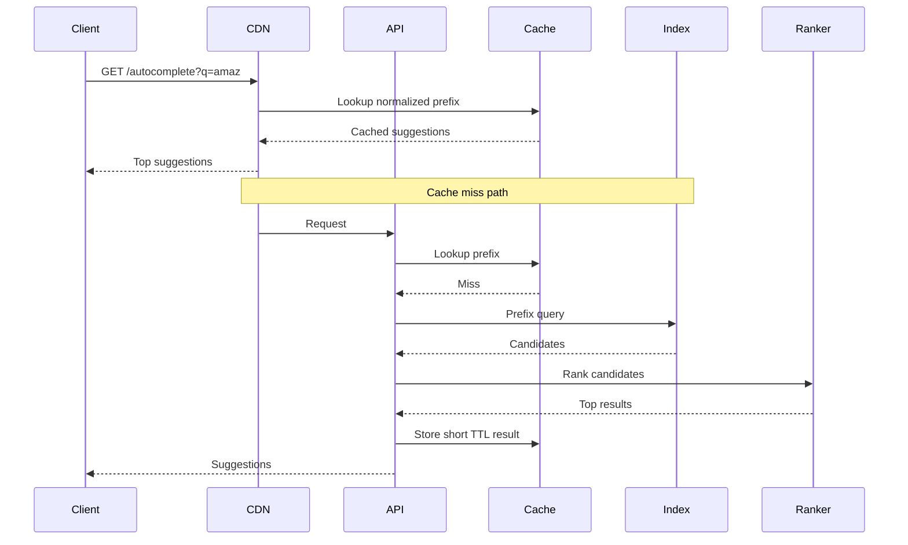
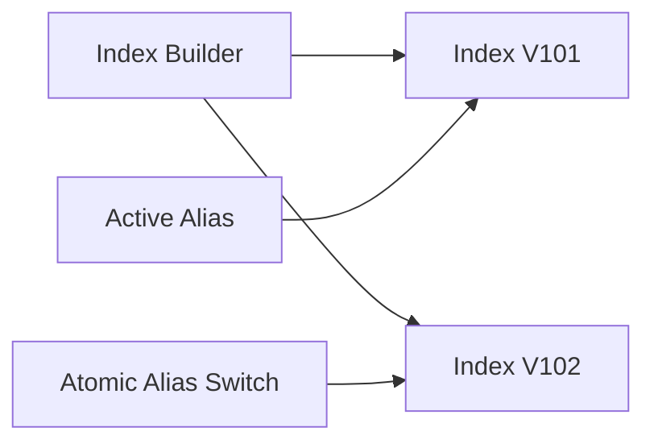
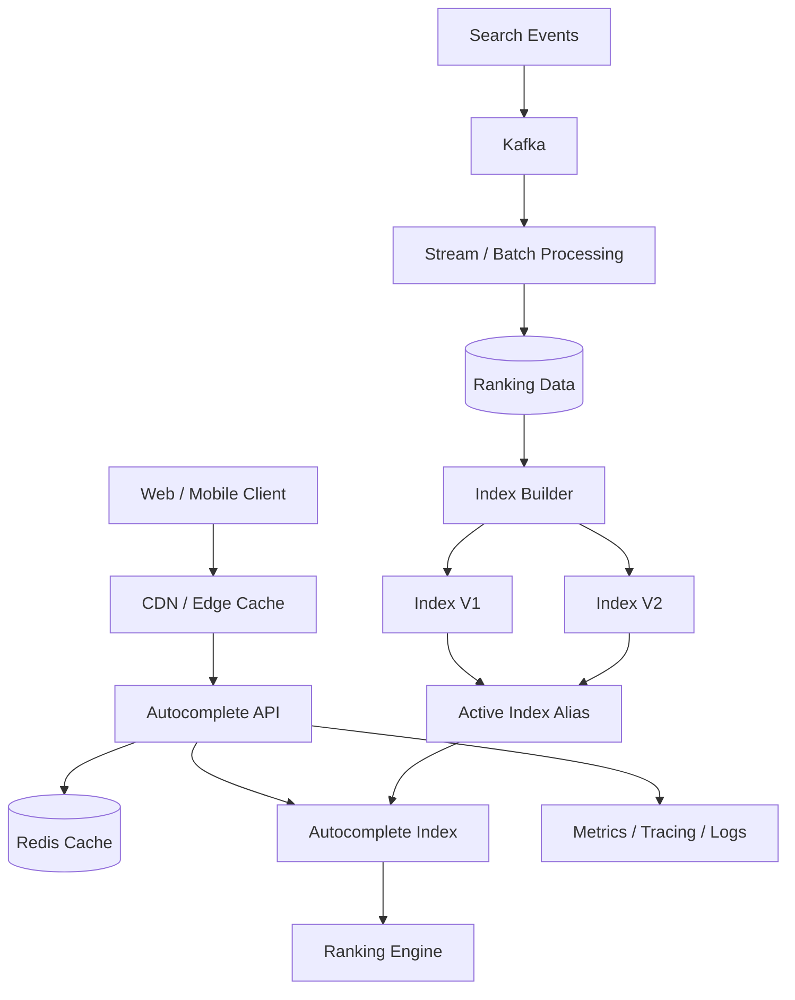

# 06- Search Autocomplete

## Overview

Search autocomplete, also called typeahead or search suggestions, returns likely queries while a user is typing.

For example:

```text
User types: "amaz"

Suggestions:
Amazon
Amazon Prime
Amazon Web Services
Amazon India
Amazon jobs
```

Unlike a conventional search system, autocomplete is optimized primarily for:

- Very low latency
- Prefix matching
- High read throughput
- Frequent repeated queries
- Predictable response sizes
- Fast updates to popular suggestions

The fundamental architecture is usually:

```text
Client
  |
  | "amaz"
  v
API / Edge
  |
  v
Autocomplete Service
  |
  +----> Cache
  |
  +----> Search Index / Trie
  |
  +----> Ranking Data
```

A production design must answer several questions:

- How are suggestions stored?
- How are prefixes indexed?
- How are suggestions ranked?
- How frequently is the index updated?
- How is stale data handled?
- How is latency kept below the user's perception threshold?
- How does the system handle millions of queries per second?
- How are abusive or pathological queries controlled?
- How are personalized suggestions combined with global suggestions?

## Requirements

### Functional Requirements

The system should:

- Accept a partial query.
- Return a small list of suggestions.
- Match suggestions by prefix.
- Rank suggestions by relevance.
- Support popular and trending suggestions.
- Optionally support personalization.
- Support multiple languages where required.
- Remove or suppress invalid suggestions.
- Support updates to the suggestion corpus.

Example API:

```http
GET /v1/autocomplete?q=amaz&limit=10
```

Response:

```json
{
  "query": "amaz",
  "suggestions": [
    "Amazon",
    "Amazon Prime",
    "Amazon Web Services",
    "Amazon India"
  ]
}
```

### Non-Functional Requirements

A production system typically targets:

| Requirement | Example Target |
|---|---:|
| API availability | 99.99% |
| p95 latency | < 50 ms |
| p99 latency | < 100 ms |
| Suggestions returned | 5–10 |
| Read throughput | Millions of requests/sec |
| Result size | Small and bounded |
| Availability during index updates | Required |
| Stale suggestions | Usually acceptable for short periods |

The exact targets depend on product requirements.

## Why Autocomplete Is Different From Search

A normal search system may perform:

```text
Query
  |
  v
Parse
  |
  v
Tokenize
  |
  v
Search
  |
  v
Rank
  |
  v
Return results
```

Autocomplete is usually much more constrained:

```text
Prefix
  |
  v
Prefix lookup
  |
  v
Retrieve top candidates
  |
  v
Return immediately
```

The user is typing continuously, so every keystroke can generate another request.

For:

```text
a
am
ama
amaz
amazo
amazon
```

the backend may receive six requests for one user interaction.

This makes request volume much higher than the number of completed searches.

## Core Data Model

At its simplest, an autocomplete entry contains:

```text
suggestion
popularity
language
status
updated_at
```

Example:

```text
Amazon
popularity = 982341
language = en
status = active
```

A more production-oriented representation may include:

```text
suggestion_id
text
normalized_text
language
category
popularity_score
trending_score
quality_score
status
updated_at
```

## Prefix Matching

The central operation is:

```text
prefix -> matching suggestions
```

For:

```text
pre
```

possible matches are:

```text
prepare
premium
presentation
prescription
previous
```

The system must efficiently retrieve these candidates without scanning the entire dataset.

A naive relational query:

```sql
SELECT text
FROM suggestions
WHERE text LIKE 'ama%'
ORDER BY popularity_score DESC
LIMIT 10;
```

can work for small datasets with the right index, but it becomes increasingly constrained as:

- Dataset size increases
- Query volume increases
- Ranking becomes more complex
- Prefix matching becomes multilingual
- Personalization is introduced

## Trie

A trie is a tree structure optimized for prefix lookups.

For:

```text
car
cat
cart
dog
```

the structure conceptually looks like:

```text
root
 |
 +-- c
 |    |
 |    +-- a
 |         |
 |         +-- r
 |         |    |
 |         |    +-- t
 |         |
 |         +-- t
 |
 +-- d
      |
      +-- o
           |
           +-- g
```

Searching for:

```text
car
```

means traversing:

```text
c -> a -> r
```

The lookup cost is primarily related to prefix length rather than total dataset size.

### Advantages

- Excellent prefix lookup performance
- Predictable lookup behavior
- Natural prefix representation
- Suitable for in-memory serving

### Limitations

- Can consume substantial memory
- Updating large tries can be expensive
- Distributed synchronization is more complex
- Ranking metadata increases memory usage

## Compressed Trie

A standard trie can contain many nodes.

A compressed trie, such as a radix tree, combines paths that do not branch.

Conceptually:

```text
Standard Trie

a
 |
m
 |
a
 |
z
 |
o
 |
n
```

can be represented more compactly as:

```text
amazon
```

Compressed prefix structures reduce memory overhead while preserving efficient prefix lookup.

## Search Index

A search engine can also provide autocomplete functionality.

Common architectures use:

- Elasticsearch/OpenSearch
- Solr
- Specialized autocomplete indexes
- Redis-based structures
- Custom in-memory indexes

Search engines are attractive when the system already operates a search platform.

They provide:

- Distributed indexing
- Replication
- Persistence
- Ranking
- Fuzzy matching
- Language analyzers
- Operational tooling

However, using a general-purpose search engine only for simple prefix lookup can introduce unnecessary operational overhead.

## Redis-Based Design

Redis can support autocomplete using sorted sets.

For example:

```text
autocomplete:global
```

could contain:

```text
Amazon       -> score
Amazon Prime -> score
Amazon Web Services -> score
```

Sorted sets are useful when ranking is central to the design.

However, Redis alone does not automatically provide an optimal arbitrary prefix-search engine. The data structure and key strategy must be designed around the actual lookup pattern.

For very high-performance systems, precomputed prefix buckets may be used:

```text
prefix:a
prefix:am
prefix:ama
prefix:amaz
```

Each bucket contains the top suggestions for that prefix.

## Precomputed Prefixes

Suppose:

```text
Amazon
```

is an indexed suggestion.

The system can precompute:

```text
a
am
ama
amaz
amazo
amazon
```

and associate each prefix with candidate suggestions.

Conceptually:

```text
prefix:a
    -> Amazon
    -> Apple
    -> Airbnb

prefix:am
    -> Amazon
    -> American Airlines

prefix:ama
    -> Amazon
    -> Amazon Prime
```

At query time:

```text
GET prefix:amaz
```

becomes extremely cheap.

### Advantages

- Very fast reads
- Simple query path
- Predictable latency
- Easy caching

### Limitations

- Storage amplification
- Expensive updates
- Large prefixes can produce many index entries
- Rebuilding the entire index can be expensive

This is often a good trade-off for read-heavy autocomplete workloads.

## Ranking

Finding matching suggestions is only half the problem.

For:

```text
ama
```

the system may have thousands of candidates.

Returning the first ten alphabetically is rarely useful.

Ranking can use:

```text
score =
    popularity
    + recency
    + trend
    + quality
    + personalization
```

A simplified model:

```text
final_score =
    0.60 * popularity
  + 0.20 * trend
  + 0.15 * quality
  + 0.05 * personalization
```

The exact formula should be based on measured product behavior rather than arbitrary weights.

## Popularity Score

Popularity can be calculated from:

- Number of searches
- Number of successful searches
- Number of clicks
- Number of conversions
- Historical frequency

For example:

```text
"amazon"
search_count = 10,000,000
click_count = 8,000,000
```

may rank above:

```text
"amazon prime student discount"
search_count = 15,000
```

for a generic prefix.

## Trending Score

Popularity alone can become stale.

A query may suddenly become popular because of:

- Breaking news
- Product launches
- Sports events
- Seasonal events
- Viral content

A trending score can use time decay.

For example:

```text
score(t) = popularity * decay(t)
```

A simple exponential decay model is:

```text
score(t) = popularity * e^(-lambda * age)
```

The exact implementation should be tuned using actual traffic.

## Personalized Ranking

Global ranking may not be enough.

For example:

```text
User A types:
"aws"

Likely:
AWS console
AWS Lambda
AWS S3
```

Another user may frequently search:

```text
AWS certification
AWS jobs
AWS architecture
```

Personalization can combine:

```text
Global candidates
+
User history
+
Context
```

A typical ranking pipeline:

```text
Prefix
  |
  +--> Global candidates
  |
  +--> User candidates
  |
  +--> Trending candidates
          |
          v
      Ranker
          |
          v
     Top 10 results
```

Personalization should not dominate global relevance.

It can also introduce privacy and security considerations.

## Query Normalization

Autocomplete should normalize input consistently.

Possible transformations include:

```text
" Amazon "
    ->
"amazon"
```

Depending on product requirements:

- Trim whitespace
- Normalize case
- Normalize Unicode
- Normalize punctuation
- Remove unsupported control characters

Do not blindly lowercase all languages without understanding locale-specific behavior.

## Unicode and Internationalization

Autocomplete becomes substantially more complex when supporting:

- Hindi
- Bengali
- Arabic
- Japanese
- Chinese
- Korean
- Accented Latin characters

Unicode normalization may be necessary.

For example:

```text
é
```

can have different Unicode representations.

Normalize data during ingestion and query processing consistently.

## Fuzzy Matching

Prefix matching:

```text
ama
```

does not match:

```text
amzon
```

Fuzzy autocomplete can tolerate typos.

For example:

```text
amzon
```

could return:

```text
amazon
```

Fuzzy matching is useful but expensive.

Do not enable expensive fuzzy search for every query without measuring its impact.

A common strategy is:

```text
1. Exact prefix lookup
2. If insufficient results:
       fuzzy fallback
```

This keeps the common path fast.

## Request Lifecycle

A production request may follow:



The exact placement of CDN caching depends on whether results are personalized.

## Caching

Autocomplete is highly cacheable because many users type the same prefixes.

For example:

```text
autocomplete:amaz
```

can be cached.

A short TTL such as:

```text
30 seconds
```

or:

```text
5 minutes
```

may be sufficient depending on freshness requirements.

### Cache Key

A global cache key might be:

```text
autocomplete:v1:en:amaz
```

A personalized cache key might include:

```text
autocomplete:v1:user:123:en:amaz
```

Personalized caching dramatically increases cache cardinality.

Avoid adding unnecessary dimensions to cache keys.

## Client-Side Caching

The client can cache recent prefixes:

```text
"a"
"am"
"ama"
"amaz"
```

Because prefixes are related, the client can reduce network traffic.

For example:

```text
User types "amaz"
```

and the client already has:

```text
"ama"
```

It may locally filter the previous result set before making another request.

This reduces API load and improves perceived latency.

## Debouncing

The client should not send a request for every keystroke immediately.

Instead:

```text
User types
    |
    v
Debounce 50–150 ms
    |
    v
Send request
```

Example JavaScript:

```javascript
let timer;

function autocomplete(query) {
    clearTimeout(timer);

    timer = setTimeout(async () => {
        if (query.trim().length < 2) {
            return;
        }

        const response = await fetch(
            `/v1/autocomplete?q=${encodeURIComponent(query)}`
        );

        const data = await response.json();
        renderSuggestions(data.suggestions);
    }, 100);
}
```

Debouncing is a client optimization, not a substitute for server-side rate limiting.

## Minimum Query Length

Many systems require:

```text
minimum query length = 2 or 3
```

A query for:

```text
a
```

may match an enormous candidate set and produce little useful information.

This also reduces backend load.

## Request Cancellation

If a user types quickly:

```text
ama
amaz
amazo
amazon
```

responses may arrive out of order.

For example:

```text
Response for "amazon"
arrives first

Response for "ama"
arrives later
```

The UI must not overwrite newer results with stale responses.

Use request cancellation or query-version checks.

## API Contract

Example endpoint:

```http
GET /v1/autocomplete?q=amaz&limit=10&locale=en-IN
```

Response:

```json
{
  "query": "amaz",
  "suggestions": [
    {
      "text": "Amazon",
      "score": 0.98
    },
    {
      "text": "Amazon Prime",
      "score": 0.91
    },
    {
      "text": "Amazon Web Services",
      "score": 0.87
    }
  ]
}
```

Do not expose internal ranking scores unless clients genuinely need them.

A simpler public API is often preferable:

```json
{
  "suggestions": [
    "Amazon",
    "Amazon Prime",
    "Amazon Web Services"
  ]
}
```

## FastAPI Example

A simple API boundary can look like:

```python
from fastapi import FastAPI, Query
from pydantic import BaseModel, Field

app = FastAPI()


class SuggestionResponse(BaseModel):
    suggestions: list[str]


@app.get("/v1/autocomplete", response_model=SuggestionResponse)
async def autocomplete(
    q: str = Query(min_length=2, max_length=100),
    limit: int = Query(default=10, ge=1, le=20),
) -> SuggestionResponse:
    normalized = q.strip().lower()

    suggestions = await lookup_suggestions(
        normalized,
        limit=limit,
    )

    return SuggestionResponse(suggestions=suggestions)
```

The actual lookup implementation should be backed by an appropriate index rather than a Python list in memory.

## Ranking Service

For more advanced systems, ranking can be separated:

```text
Autocomplete API
      |
      v
Candidate Retrieval
      |
      v
Ranking Service
      |
      v
Top K
```

Candidate retrieval should be cheap.

Ranking should operate on a bounded candidate set.

Do not retrieve millions of candidates and then send all of them to a complex ranking model.

A better architecture is:

```text
10 million suggestions
        |
        v
Prefix index
        |
        v
100 candidates
        |
        v
Ranking
        |
        v
10 results
```

## Candidate Generation

Candidate generation can combine several sources:

```text
Global popular
Global trending
Personal history
Recent searches
Editorial suggestions
```

For:

```text
amaz
```

the system may generate:

```text
Candidate Set A:
Amazon
Amazon Prime

Candidate Set B:
Amazon Web Services

Candidate Set C:
Amazon jobs
```

Then deduplicate and rank.

## Deduplication

Multiple sources may produce the same suggestion.

For example:

```text
Global:
Amazon

Trending:
Amazon

Personal:
Amazon
```

The ranking layer should deduplicate before returning results.

A stable normalized representation is useful:

```text
normalized_text = normalize(text)
```

## Offline vs Online Processing

Autocomplete data can be processed offline.

A common architecture is:

```text
Search Logs
    |
    v
Kafka / Data Lake
    |
    v
Aggregation Jobs
    |
    v
Ranking Calculation
    |
    v
Index Builder
    |
    v
Autocomplete Index
```

The serving path then becomes extremely lightweight:

```text
Request
  |
  v
Index lookup
  |
  v
Top K
```

This is often preferable to calculating popularity on every request.

## Batch Index Generation

Suppose search logs contain:

```text
query
timestamp
user_id
result_clicked
```

A batch job can compute:

```text
query_frequency
click_through_rate
trend_score
quality_score
```

Then produce a new index.

This separates:

```text
heavy computation
```

from:

```text
latency-sensitive serving
```

## Online Updates

Some systems need near-real-time updates.

For example:

```text
Breaking event
    |
    v
Search spike
    |
    v
Trending score update
    |
    v
Index update
```

Kafka can stream search events to a ranking pipeline.

A hybrid design is common:

```text
Batch ranking
+
Real-time trend adjustments
```

## Index Versioning

Never rebuild a production index in place if it can cause inconsistent reads.

Prefer versioned indexes:

```text
autocomplete-v101
autocomplete-v102
```

Then switch an alias:

```text
active -> autocomplete-v102
```

This enables:

- Atomic cutover
- Easy rollback
- Consistent reads
- Safer deployments

## Blue-Green Index Deployment



The old index can remain available until the new index has been validated.

## Index Validation

Before activation, validate:

- Document count
- Prefix coverage
- Ranking distribution
- Invalid entries
- Duplicate entries
- Language coverage
- Index health
- Memory usage

A bad index can affect every autocomplete request immediately.

## Memory Considerations

Autocomplete is frequently memory-sensitive.

A naive trie can consume significant RAM.

For a large corpus:

```text
10 million suggestions
```

the memory footprint can become substantial.

Compression techniques include:

- Radix trees
- Finite-state structures
- Prefix sharing
- Compact serialized indexes
- Memory-mapped files

Do not assume that adding RAM is the only scaling strategy.

## Horizontal Scaling

The serving layer should be stateless:

```text
                Load Balancer
                     |
          +----------+----------+
          |          |          |
          v          v          v
       API-1      API-2      API-3
          |          |          |
          +----------+----------+
                     |
                 Shared Index
```

If the index is stored locally in each instance:

```text
API-1 -> Index V102
API-2 -> Index V102
API-3 -> Index V102
```

the deployment system must ensure consistent index versions.

If the index is remote:

```text
API -> Search Cluster
```

index consistency is handled centrally, but network latency becomes part of the request path.

## Replication

Autocomplete reads are usually much higher than writes.

Therefore read replicas are useful for search indexes.

For example:

```text
Index Primary
    |
    +--> Replica 1
    +--> Replica 2
    +--> Replica 3
```

Serving traffic from replicas reduces pressure on the indexing path.

## Availability Strategy

Autocomplete is often a non-critical feature compared with core application functionality.

A graceful degradation strategy is valuable.

If the autocomplete service fails:

```text
Autocomplete unavailable
        |
        v
User can still submit full search
```

The UI should not block the primary search workflow.

## Failure Modes

| Failure | Impact | Mitigation |
|---|---|---|
| Cache unavailable | Increased index traffic | Shared index capacity |
| Search index unavailable | Suggestions unavailable | Replicas/fallback |
| Ranking service unavailable | Reduced relevance | Default ranking |
| Kafka unavailable | Stale index updates | Durable queue/retention |
| Index build failure | Stale suggestions | Keep previous version |
| Redis unavailable | Cache miss | Direct index lookup |
| API overload | Increased latency | Rate limits/autoscaling |

## Rate Limiting

Autocomplete can generate huge request volumes.

Rate-limit by:

```text
IP
user
API key
tenant
device
```

A Redis-backed token bucket or sliding-window implementation is common.

For example:

```text
autocomplete:user:123
```

with:

```text
100 requests / minute
```

The exact limits should account for legitimate typing behavior.

## Abuse Prevention

Autocomplete endpoints are attractive to automated clients because they are inexpensive and high-volume.

Protect against:

- Scraping
- Credential-free query abuse
- Query enumeration
- Bot traffic
- Expensive wildcard/fuzzy queries
- Excessive long prefixes

Use:

- Authentication where appropriate
- Rate limiting
- WAF rules
- Query length limits
- Request budgets
- Abuse monitoring

## Security and Privacy

Search history may contain sensitive information.

Avoid exposing personalized suggestions to the wrong user.

For example:

```text
User A's search history
```

must never become part of:

```text
Global autocomplete results
```

unless explicitly aggregated and privacy-reviewed.

Be careful with:

- User-specific caches
- Shared CDN caches
- Logs
- Analytics pipelines
- Debugging tools

A personalized response must never be accidentally cached under a global key.

## Cache Poisoning Risk

Consider:

```text
GET /autocomplete?q=secret
```

If a personalized result is cached using only:

```text
autocomplete:secret
```

another user may receive it.

Cache keys must include every dimension that changes the result.

## Logging

Log operational metadata such as:

```text
query_length
normalized_prefix
latency
cache_hit
result_count
index_version
```

Avoid logging sensitive raw queries unless there is a legitimate requirement.

If raw queries are needed for analytics, define retention and access controls.

## Monitoring

Important metrics include:

### Latency

```text
autocomplete_request_latency_ms
cache_lookup_latency_ms
index_lookup_latency_ms
ranking_latency_ms
```

Track:

```text
p50
p95
p99
```

### Cache

```text
cache_hit_rate
cache_miss_rate
cache_evictions
```

### Index

```text
index_version
index_size
index_load_time
index_memory_usage
index_query_latency
```

### Ranking

```text
candidate_count
ranking_latency
zero_result_rate
```

### Product Metrics

```text
suggestion_click_rate
search_completion_rate
query_abandonment_rate
```

## SLOs

Example:

```text
Availability:
99.99%

p95:
< 50 ms

p99:
< 100 ms

Zero-result rate:
< 1%

Cache hit rate:
> 80%
```

The cache-hit target is an optimization metric rather than an availability SLO.

## Cost Considerations

Major cost drivers include:

- Search cluster size
- Memory
- Replicas
- Cross-AZ traffic
- CDN requests
- Redis capacity
- Index rebuild compute
- Data processing

Autocomplete has a useful optimization characteristic:

> Spending more compute during offline indexing can reduce expensive online request processing.

Move expensive work out of the request path whenever freshness requirements permit.

## Disaster Recovery

The canonical suggestion dataset should be recoverable independently of the serving index.

For example:

```text
Search Events
     |
     v
Object Storage / Data Lake
     |
     v
Index Builder
     |
     v
New Autocomplete Index
```

If the serving cluster is lost, the index can be reconstructed.

Maintain:

- Versioned source data
- Index build artifacts where useful
- Configuration
- Ranking parameters
- Deployment metadata

## Operational Best Practices

- Keep the serving path simple.
- Bound the number of returned candidates.
- Use short query limits.
- Normalize queries consistently.
- Cache high-frequency prefixes.
- Separate candidate generation from ranking.
- Keep expensive processing offline.
- Version indexes.
- Use atomic index activation.
- Keep the previous index available for rollback.
- Monitor queue lag and index freshness.
- Rate-limit aggressively enough to protect capacity.
- Design graceful degradation.
- Keep personalized and global caches separate.
- Treat user search data as potentially sensitive.

## Common Mistakes and Pitfalls

### Querying PostgreSQL With Unbounded Prefix Searches

A query such as:

```sql
SELECT *
FROM suggestions
WHERE text LIKE '%ama%';
```

cannot use a normal B-tree prefix strategy effectively and can become expensive.

For true autocomplete, prefer:

```text
text LIKE 'ama%'
```

with appropriate indexing for simple workloads, or use a dedicated prefix/search index for larger systems.

### Returning Too Many Suggestions

Returning:

```text
1000 suggestions
```

increases:

- Network payload
- Serialization cost
- Ranking cost
- Client rendering work

Autocomplete should normally return a small top-K set.

### Performing Fuzzy Search on Every Request

Fuzzy matching can be significantly more expensive than prefix lookup.

Use exact prefix matching as the fast path and fuzzy matching selectively.

### Rebuilding the Active Index In Place

A partial rebuild can expose inconsistent data.

Use versioned indexes and atomic activation.

### Ignoring Out-of-Order Responses

Fast typing can create overlapping requests.

The client must ensure stale responses cannot overwrite newer results.

### Using Only Popularity

Pure popularity creates stale or globally biased suggestions.

Combine popularity with recency, trend, quality, and optionally personalization.

### Ignoring Cache Cardinality

Personalized cache keys can explode the number of entries.

Measure memory usage and use bounded TTLs.

### Treating Autocomplete as Critical Path Infrastructure

If autocomplete is unavailable, users should generally still be able to perform a full search.

Graceful degradation reduces overall system coupling.

## Interview Discussion Points

A strong system-design answer should explicitly discuss:

### How do you achieve low latency?

Use:

```text
Client debounce
+
CDN/cache
+
In-memory prefix index
+
Bounded candidate retrieval
+
Simple ranking
```

### How do you handle millions of requests per second?

Use:

```text
Stateless API instances
+
Caching
+
Read replicas
+
Horizontally scalable index
+
Rate limiting
```

### How do you update suggestions without downtime?

Use:

```text
Build new index
     |
Validate
     |
Activate atomically
     |
Retain previous version
```

### How do you rank results?

Separate:

```text
Candidate generation
```

from:

```text
Ranking
```

and combine signals such as popularity, trend, quality, and personalization.

### How do you handle stale data?

Accept bounded staleness where product requirements permit it and continuously rebuild or update the index.

### What happens when the search cluster fails?

Autocomplete can degrade gracefully while the primary search operation remains available.

## Reference Architecture

A production-oriented design can look like:



The serving path should remain:

```text
Request
  |
  v
Cache
  |
  +--> Hit -> Return
  |
  +--> Miss
         |
         v
      Prefix Index
         |
         v
      Candidate Set
         |
         v
        Rank
         |
         v
       Top K
```

The indexing path is intentionally separated:

```text
Search Events
      |
      v
Analytics
      |
      v
Ranking Data
      |
      v
Index Builder
      |
      v
Versioned Index
      |
      v
Atomic Activation
```

This separation is one of the most important architectural decisions in a large-scale autocomplete system.

## Key Takeaways

- **Optimize autocomplete for extremely low-latency prefix retrieval; use tries, compressed prefix structures, search indexes, or precomputed prefix buckets instead of scanning the full suggestion corpus.**
- **Separate candidate generation from ranking so expensive relevance logic operates on a small bounded candidate set rather than the entire dataset.**
- **Push popularity, trend analysis, and index construction into offline or streaming pipelines so the online request path remains lightweight and predictable.**
- **Use client debouncing, caching, rate limiting, horizontal scaling, and graceful degradation to handle the very high request volume generated by continuous typing.**
- **Version autocomplete indexes and activate them atomically; keep the previous version available so failed builds or corrupted indexes can be rolled back safely.**