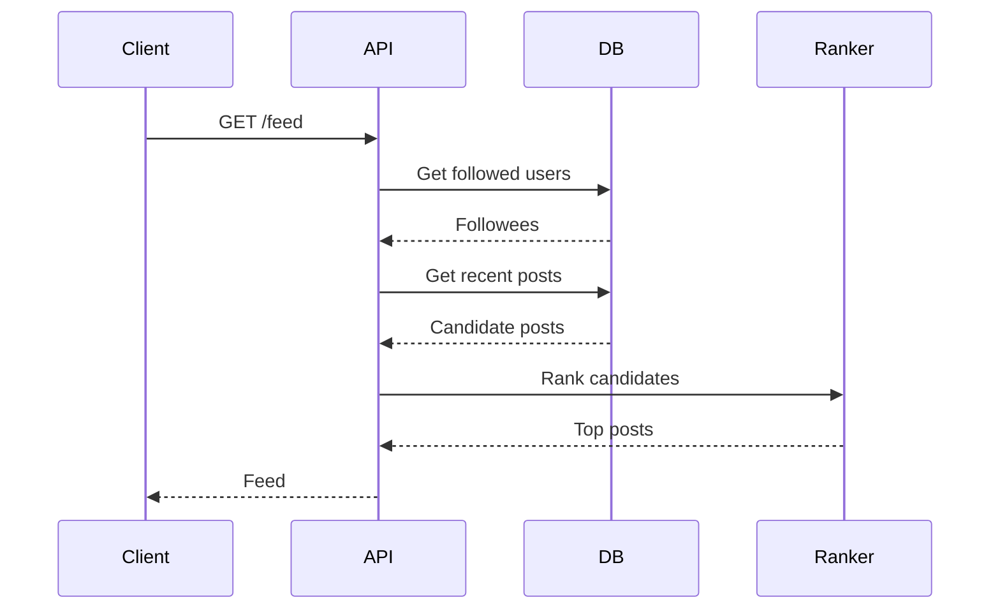
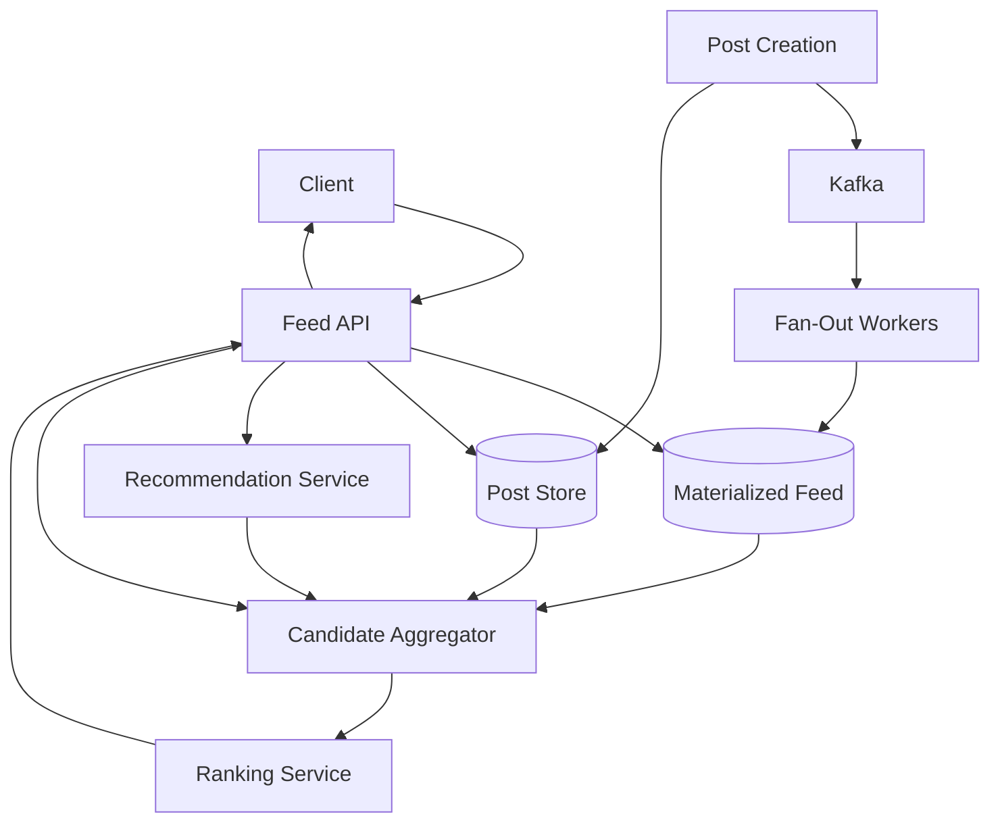
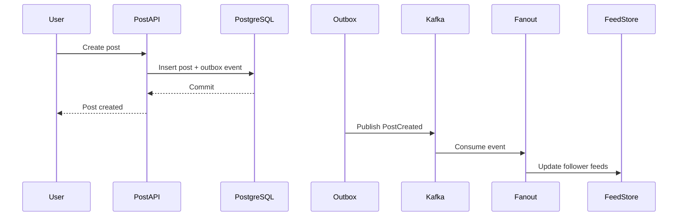
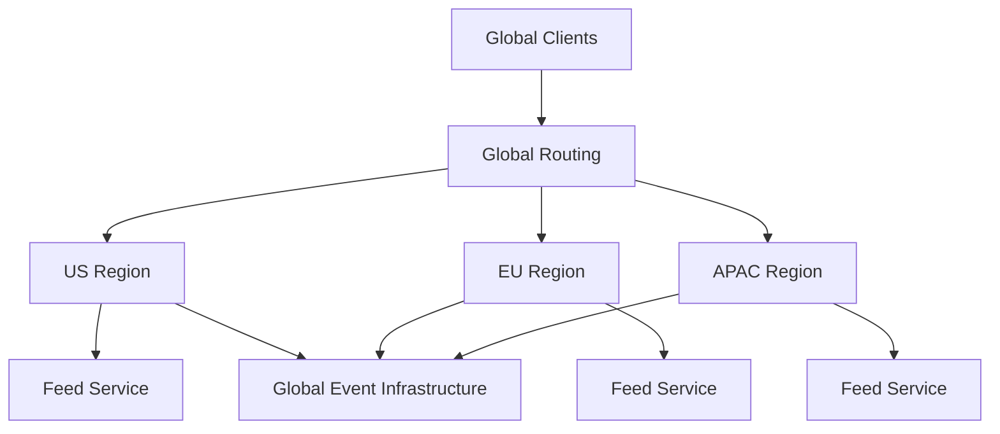
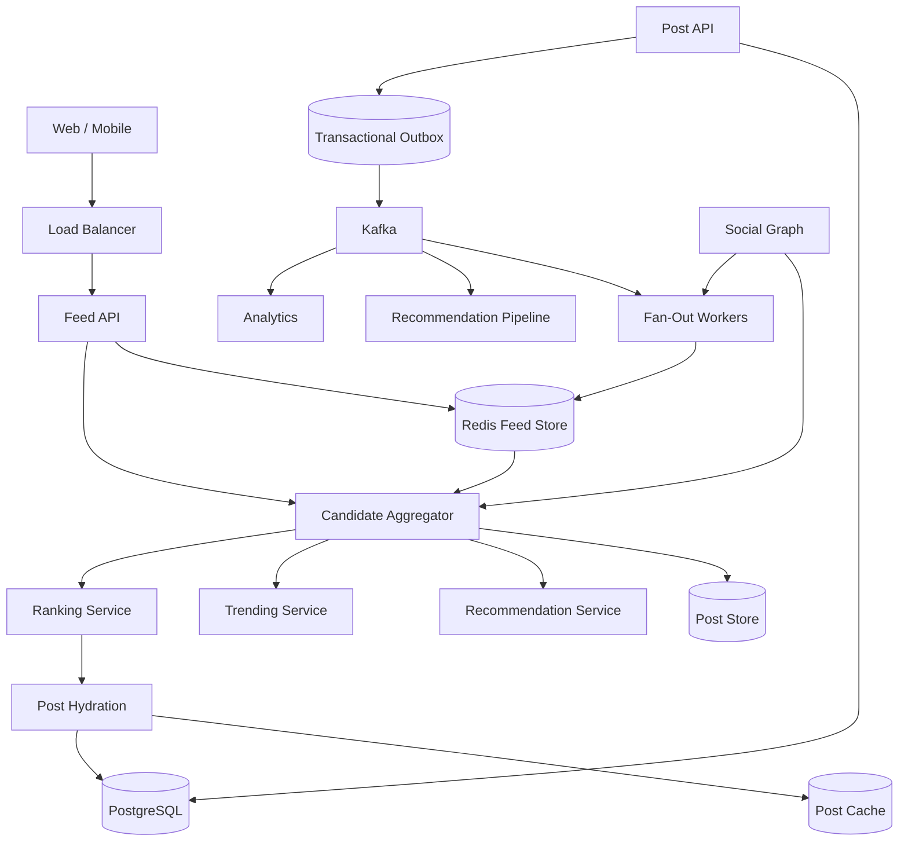

# 07- News Feed

## Overview

A news feed is a read-heavy distributed system that continuously produces a personalized or ranked stream of content for users.

Typical examples include:

- Social media timelines
- Professional-network feeds
- News aggregation
- Activity feeds
- Content recommendation feeds
- Following/follower timelines

The core system-design challenge is not simply storing posts. It is efficiently answering:

```text
"What content should this user see, in what order, right now?"
```

At small scale, this can be implemented with a relational database query:

```sql
SELECT *
FROM posts
WHERE author_id IN (...)
ORDER BY created_at DESC
LIMIT 50;
```

At large scale, this approach becomes expensive because a user may follow thousands of accounts, some accounts may have millions of followers, and feed requests can arrive at very high read rates.

A production architecture usually separates:

```text
Content creation
      |
      v
Event distribution
      |
      v
Feed generation
      |
      v
Feed storage/cache
      |
      v
Low-latency feed reads
```

The central architectural decision is whether feed entries are generated when content is created, when the user requests the feed, or through a hybrid of both.

## Requirements

### Functional Requirements

A typical news feed should support:

- Creating posts.
- Following and unfollowing users.
- Reading a personalized feed.
- Pagination through older content.
- Ranking posts.
- Supporting deleted or hidden content.
- Supporting privacy and visibility rules.
- Optionally supporting likes, comments, shares, and engagement counts.
- Optionally supporting media attachments.

Example API:

```http
GET /v1/feed?limit=20&cursor=eyJ0cyI6MT...
```

Example response:

```json
{
  "items": [
    {
      "id": "post_98231",
      "author": {
        "id": "user_42",
        "name": "Alice"
      },
      "content": "Distributed systems are mostly about trade-offs.",
      "created_at": "2026-08-23T10:30:00Z"
    }
  ],
  "next_cursor": "eyJ0cyI6MT..."
}
```

### Non-Functional Requirements

A production system commonly targets:

| Requirement | Example Target |
|---|---:|
| Availability | 99.99% |
| Feed read p95 | < 200 ms |
| Feed read p99 | < 500 ms |
| Initial page size | 20–50 items |
| Read throughput | Millions of requests/sec |
| Pagination | Cursor-based |
| Feed freshness | Seconds to minutes depending on design |
| Data durability | High |
| Personalization | Optional but extensible |

These numbers are illustrative. Real targets should be derived from product requirements and measured workload.

## Core Data Model

A simplified relational model contains:

```text
User
----
id
name
created_at

Post
----
id
author_id
content
created_at
visibility
status

Follow
------
follower_id
followee_id
created_at
```

For PostgreSQL:

```sql
CREATE TABLE posts (
    id BIGSERIAL PRIMARY KEY,
    author_id BIGINT NOT NULL,
    content TEXT NOT NULL,
    visibility VARCHAR(32) NOT NULL DEFAULT 'public',
    status VARCHAR(32) NOT NULL DEFAULT 'active',
    created_at TIMESTAMPTZ NOT NULL DEFAULT NOW()
);

CREATE INDEX idx_posts_author_created
ON posts (author_id, created_at DESC);

CREATE TABLE follows (
    follower_id BIGINT NOT NULL,
    followee_id BIGINT NOT NULL,
    created_at TIMESTAMPTZ NOT NULL DEFAULT NOW(),
    PRIMARY KEY (follower_id, followee_id)
);

CREATE INDEX idx_follows_followee
ON follows (followee_id);
```

The exact schema depends on the product and scale.

## The Fundamental Read Problem

Suppose a user follows:

```text
1,000 users
```

A naive feed query must find recent posts from all 1,000 authors.

Conceptually:

```text
User
 |
 +--> Followee 1 --> Posts
 +--> Followee 2 --> Posts
 +--> Followee 3 --> Posts
 ...
 +--> Followee 1000 --> Posts
```

The database then needs to merge and sort these streams.

At large scale, this creates pressure on:

- Database CPU
- Index lookups
- Network traffic
- Sorting
- Query latency
- Connection pools

The problem becomes significantly worse when millions of users request feeds concurrently.

## Feed Generation Strategies

There are three fundamental approaches:

| Strategy | Feed generated | Main advantage | Main problem |
|---|---|---|---|
| Fan-out on read | During request | Cheap writes | Expensive reads |
| Fan-out on write | During post creation | Very fast reads | Expensive writes |
| Hybrid | Both | Handles different user types | More complexity |

Choosing between them is one of the most important news-feed system-design decisions.

## Fan-Out on Read

With fan-out on read, the system stores posts normally.

When a user requests their feed:

```text
User requests feed
       |
       v
Fetch followees
       |
       v
Fetch recent posts
       |
       v
Merge
       |
       v
Rank
       |
       v
Return
```

Example:



### Advantages

- Simple write path
- No feed materialization required
- New posts are immediately discoverable
- Storage overhead is relatively low

### Limitations

- Expensive reads
- Large fan-out relationships increase query cost
- Ranking can become expensive
- High read traffic directly affects the database

### When It Works

Fan-out on read works well when:

- User count is small or moderate.
- Users follow relatively few accounts.
- Read volume is manageable.
- Feed freshness is more important than extremely low latency.
- The ranking pipeline is simple.

## Fan-Out on Write

With fan-out on write, a post creation event causes the system to insert the post into followers' feed stores.

For:

```text
Alice creates post
```

and:

```text
Alice -> 10,000 followers
```

the system creates approximately:

```text
10,000 feed entries
```

Conceptually:

```text
                 Post Created
                      |
                      v
                    Kafka
                      |
                      v
               Fan-Out Workers
              /       |       \
             v        v        v
         User A    User B    User C
          Feed      Feed      Feed
```

### Advantages

- Extremely fast feed reads
- Simple feed retrieval
- Ranking can happen during materialization
- Database queries are small and predictable

### Limitations

- Expensive writes
- Large users can create enormous fan-out workloads
- More storage is required
- Follow/unfollow operations become more complex
- Failed fan-out operations require retry mechanisms

## Feed Materialization

A materialized feed might contain:

```text
feed:user:123
```

with entries such as:

```text
post_901
post_854
post_812
post_790
```

Redis sorted sets are particularly useful when ordering by score:

```text
ZADD feed:user:123 1755945000 post_901
```

The score can represent:

```text
ranking_score
```

or a timestamp for chronological feeds.

Retrieval:

```text
ZREVRANGE feed:user:123 0 19
```

The application then fetches the corresponding post objects.

## Redis Feed Storage

A common architecture is:

```text
Redis
 |
 +-- feed:user:100
 +-- feed:user:101
 +-- feed:user:102
```

Each feed contains a bounded number of post IDs.

Do not keep an unlimited number of feed entries.

For example:

```text
Keep latest 500–5,000 IDs per user
```

depending on product requirements.

Older content can be retrieved from a durable store if required.

## Why Bounded Feeds Matter

Suppose:

```text
10 million users
```

each have:

```text
10,000 feed entries
```

That represents:

```text
100 billion feed references
```

Even if each reference is relatively small, the memory and storage footprint becomes substantial.

A bounded materialized feed reduces this cost.

## The Celebrity Problem

Fan-out on write has a major scalability problem.

Suppose:

```text
User A
Followers = 50 million
```

If User A publishes a post, naive fan-out attempts:

```text
50 million feed writes
```

for one post.

This can overload:

- Kafka
- Fan-out workers
- Redis
- Databases
- Network bandwidth

This is commonly called the **celebrity problem** or **hot-key/fan-out problem**.

## Hybrid Fan-Out

A practical large-scale architecture uses both strategies.

Normal users:

```text
Fan-out on write
```

Very high-follower accounts:

```text
Fan-out on read
```

For example:

```text
Normal author
     |
     v
Post event
     |
     v
Fan-out to followers
```

But:

```text
Celebrity author
     |
     v
Store post normally
     |
     v
Merge during feed read
```

The feed service combines both sources:

```text
Materialized Feed
       +
Celebrity Posts
       +
Personalized Recommendations
       |
       v
Candidate Merge
       |
       v
Ranking
       |
       v
Top K
```

This is usually more scalable than choosing one strategy globally.

## Hybrid Feed Architecture



## Feed Request Lifecycle

A production feed request can look like:

```text
Client
  |
  v
Load Balancer
  |
  v
Feed API
  |
  +--> Redis Feed
  |
  +--> Recommendation Service
  |
  +--> Candidate Sources
          |
          v
      Candidate Merge
          |
          v
        Ranker
          |
          v
       Top K
          |
          v
       Hydrate
          |
          v
       Response
```

The order of operations matters.

Do not hydrate thousands of posts from PostgreSQL before deciding which posts are actually needed.

Prefer:

```text
Candidate IDs
    |
    v
Filter
    |
    v
Rank
    |
    v
Top K
    |
    v
Hydrate only selected posts
```

## Candidate Generation

A feed should not necessarily rank every post in the system.

Instead, generate a bounded candidate set from multiple sources:

```text
Following feed
Recommended content
Trending content
Sponsored content
Recently engaged authors
```

For example:

```text
Following candidates:      500
Recommendation candidates: 200
Trending candidates:        50
--------------------------------
Total:                      750
```

The ranking system can then operate on these candidates.

## Ranking

Chronological order is simple:

```text
ORDER BY created_at DESC
```

But modern feeds frequently use ranking signals such as:

- Recency
- Author affinity
- Engagement probability
- Content quality
- User interests
- Previous interactions
- Social graph distance
- Content diversity
- Negative feedback
- Freshness
- Business rules

A conceptual scoring model:

```text
score =
    recency_score
    + author_affinity
    + engagement_score
    + content_quality
    + personalization
```

A production ranking model may be considerably more sophisticated.

The important architecture principle is:

> Candidate retrieval and ranking should be separate concerns.

## Ranking Example

Suppose the user follows three authors:

```text
Alice
Bob
Charlie
```

Candidate posts:

| Post | Author | Age | Engagement | Affinity |
|---|---|---:|---:|---:|
| P1 | Alice | 5 min | High | High |
| P2 | Bob | 2 min | Low | Medium |
| P3 | Charlie | 20 min | High | Low |
| P4 | Alice | 30 min | Medium | High |

A ranking system may choose:

```text
P1
P4
P3
P2
```

rather than simply sorting by creation time.

## Feed Storage vs Post Storage

Do not confuse feed entries with posts.

### Post Store

Contains the canonical object:

```text
post_id
author_id
content
media
created_at
visibility
```

### Feed Store

Contains references:

```text
user_id
post_id
ranking_score
```

This separation is important because copying the entire post into every follower's feed would dramatically increase storage and update costs.

Prefer:

```text
Feed -> Post ID
```

rather than:

```text
Feed -> Full Post Object
```

## Data Hydration

Suppose the feed contains:

```text
post_1
post_2
post_3
...
```

The service retrieves the canonical posts in batches.

Avoid:

```text
SELECT ... WHERE id = ?
```

for every post.

Use batch retrieval:

```sql
SELECT *
FROM posts
WHERE id IN (...);
```

or an equivalent cache/database batch operation.

For very large systems, post objects may be cached separately.

## Cache Architecture

A multi-level cache may look like:

```text
Client
  |
  v
CDN
  |
  v
Feed API
  |
  +--> User Feed Cache
  |
  +--> Post Cache
  |
  +--> Author Cache
  |
  v
Durable Stores
```

Different objects have different cache lifetimes.

For example:

| Data | Typical Cache Strategy |
|---|---|
| Feed IDs | Short/medium TTL or explicit updates |
| Post object | Longer TTL |
| User profile | Longer TTL |
| Engagement counts | Short TTL or asynchronous updates |
| Recommendation results | Short TTL |

## Cache Invalidation

Feed systems should avoid relying solely on TTL-based invalidation.

For example, when a post is deleted:

```text
Post deleted
    |
    +--> Mark canonical post deleted
    |
    +--> Remove/ignore feed references
```

The feed service should verify content status during hydration or maintain an efficient deletion propagation mechanism.

A deleted post should not remain visible indefinitely simply because a Redis feed entry has not expired.

## Consistency Model

News feeds commonly favor **eventual consistency**.

Example:

```text
User creates post
      |
      v
Post Store updated
      |
      v
Kafka event
      |
      v
Fan-out
      |
      v
Follower feed updated
```

There may be a short delay between:

```text
post creation
```

and:

```text
post appearing in every follower's feed
```

For most social feeds, this is acceptable.

The system should define an explicit freshness expectation, such as:

```text
99% of feed entries become visible within 5 seconds.
```

## Strong Consistency vs Eventual Consistency

| Requirement | Strong Consistency | Eventual Consistency |
|---|---|---|
| Feed freshness | Immediate | Delayed |
| Complexity | Higher | Lower |
| Scalability | More difficult | Easier |
| Typical social feed | Usually unnecessary | Common |
| Financial transactions | Often required | Usually inappropriate |

Do not introduce strong consistency merely because it sounds more correct.

## Kafka for Feed Events

Kafka is useful for distributing feed-related events.

Example:

```text
PostCreated
PostDeleted
UserFollowed
UserUnfollowed
PostUpdated
```

A topic might be:

```text
post-events
```

Consumers can include:

```text
Fan-out Service
Recommendation Pipeline
Search Indexer
Notification Service
Analytics
Moderation
```

This decouples post creation from downstream processing.

## Event Flow



## Transactional Outbox

Publishing directly to Kafka after committing the database can create a failure window.

Bad sequence:

```text
1. Write post to PostgreSQL
2. Commit
3. Publish Kafka event
4. Kafka publish fails
```

Now the post exists but downstream consumers never receive the event.

The transactional outbox pattern solves this by storing the event in the same database transaction:

```text
BEGIN

INSERT post

INSERT outbox_event

COMMIT
```

A separate publisher reads the outbox and publishes to Kafka.

This provides reliable event propagation without requiring distributed transactions.

## Idempotency

Kafka consumers may process an event more than once.

For example:

```text
PostCreated(post_id=123)
```

may be delivered twice.

Fan-out processing should therefore be idempotent.

A feed insertion can use a deterministic key:

```text
(user_id, post_id)
```

or equivalent deduplication logic.

The goal is:

```text
process once
```

from the application's perspective, even if the message is delivered multiple times.

## Follow and Unfollow

Following creates a graph relationship:

```text
follower -> followee
```

When a user follows someone, the system has choices.

### Backfill Existing Content

The system can immediately add recent posts from the followed account into the follower's feed.

```text
Follow
 |
 v
Fetch recent posts
 |
 v
Insert feed references
```

This improves the first feed response but creates additional work.

### Lazy Backfill

Alternatively, the feed service can include the new author's posts during subsequent reads.

This reduces write amplification but increases read complexity.

The right approach depends on expected follow frequency and freshness requirements.

## Unfollow Handling

Removing every feed entry synchronously can be expensive.

Instead, maintain:

```text
Follow graph
```

as the authoritative source.

During feed assembly:

```text
feed entry
   |
   v
is author still followed?
   |
   +-- no --> discard
   |
   +-- yes -> keep
```

For large systems, asynchronous cleanup can remove stale feed entries later.

## Pagination

Offset pagination is problematic for changing feeds.

Avoid:

```http
GET /feed?offset=1000
```

because:

- Large offsets can become expensive.
- New posts shift positions.
- Items can be duplicated or skipped.

Prefer cursor-based pagination.

Example:

```http
GET /v1/feed?limit=20&cursor=eyJzY29yZSI6MTc1NTk0...
```

The cursor can encode:

```text
last_score
last_post_id
```

A stable tie-breaker is important.

## Cursor Example

Suppose posts are ordered by:

```text
score DESC
post_id DESC
```

The next query can use:

```sql
WHERE
    score < :last_score
    OR (
        score = :last_score
        AND post_id < :last_post_id
    )
ORDER BY score DESC, post_id DESC
LIMIT 20;
```

This avoids ambiguous pagination when multiple posts have the same score.

## Deep Pagination

Users may scroll indefinitely.

Do not assume the entire historical feed must remain materialized in Redis.

A practical architecture is:

```text
Recent feed
    |
    v
Redis / Materialized Store

Older feed
    |
    v
Durable store / historical query
```

This reduces memory usage while preserving access to older content.

## Hot Users and Hot Keys

Some users may receive extremely high traffic.

For example:

```text
Celebrity profile
```

may be requested millions of times.

Avoid a single cache key becoming a bottleneck where possible.

Strategies include:

- Local caching
- CDN caching for public content
- Replicated caches
- Key partitioning
- Read replicas
- Precomputed content

For personalized feeds, CDN caching is less effective because the response varies by user.

## Database Partitioning

At large scale, posts may be partitioned by:

- Author
- Time
- Geographic region
- Hash of post ID

Time-based partitioning can help with retention and archival:

```text
posts_2026_08
posts_2026_09
```

But partitioning is not a universal performance solution.

Choose partition keys based on access patterns and operational requirements.

## Sharding

When a single PostgreSQL cluster cannot support the workload, horizontal partitioning or sharding may be required.

A possible logical strategy:

```text
Shard = hash(user_id)
```

This can distribute:

```text
User
Follow graph
Feed metadata
```

across shards.

However, cross-shard feed queries become more complex.

A senior-level design should identify the shard key early and evaluate:

- Query locality
- Hot partitions
- Rebalancing
- Cross-shard operations
- Operational complexity

## Multi-Region Architecture

A global social platform may use multiple regions:



The design must decide:

- Where user data is authoritative
- How feed events replicate
- Whether users can be served from any region
- How cross-region follower relationships work
- What consistency guarantees are required

Do not add active-active multi-region architecture unless the availability, latency, or regulatory requirements justify its complexity.

## Reliability

A feed service should tolerate downstream failures.

For example:

```text
Recommendation service unavailable
        |
        v
Use following feed only
```

Or:

```text
Redis unavailable
        |
        v
Fallback to durable feed store
```

Or:

```text
Ranking service unavailable
        |
        v
Use chronological fallback
```

A good degradation hierarchy is:

```text
Personalized ranked feed
        |
        v
Ranked following feed
        |
        v
Chronological following feed
        |
        v
Minimal recent-content feed
```

The application should continue serving useful content whenever possible.

## Backpressure

Fan-out workers can fall behind during traffic spikes.

Monitor:

```text
Kafka consumer lag
```

and implement:

- Autoscaling
- Bounded worker concurrency
- Retry policies
- Dead-letter queues where appropriate
- Rate-controlled downstream writes

Do not allow unlimited retries to amplify an existing outage.

## Retry Strategy

A feed fan-out operation may fail because:

- Redis is unavailable.
- Network request times out.
- Database is overloaded.
- A downstream service returns an error.

Use exponential backoff with jitter:

```text
1s
2s
4s
8s
...
```

with a maximum retry count.

Do not retry permanent errors indefinitely.

## Dead-Letter Handling

Messages that repeatedly fail should be isolated.

```text
Kafka
  |
  v
Fanout Worker
  |
  +--> Success
  |
  +--> Retry
          |
          v
      Dead Letter
```

Dead-letter queues should be monitored and operationally actionable.

## Monitoring

Important infrastructure metrics include:

### Feed API

```text
request_rate
p50_latency
p95_latency
p99_latency
error_rate
timeout_rate
```

### Feed Generation

```text
fanout_events/sec
fanout_latency
fanout_failures
consumer_lag
retry_count
dead_letter_count
```

### Cache

```text
feed_cache_hit_rate
post_cache_hit_rate
evictions
memory_usage
hot_keys
```

### Database

```text
query_latency
connection_pool_usage
CPU
IOPS
replication_lag
slow_queries
```

### Product Metrics

```text
feed_impression_rate
engagement_rate
click_through_rate
scroll_depth
post_interaction_rate
```

Technical metrics tell you whether the system is healthy. Product metrics tell you whether the feed is useful.

## Observability

A feed request may cross multiple services:

```text
API
 -> Feed Store
 -> Recommendation
 -> Ranking
 -> Post Store
```

Distributed tracing should propagate a request ID or trace context across services.

Useful spans include:

```text
feed.request
feed.candidate_generation
feed.redis_lookup
feed.ranking
feed.post_hydration
```

This helps identify whether latency comes from:

- Cache
- Database
- Ranking
- Network
- Serialization

## Security

A feed system must enforce visibility rules.

Potential rules include:

- Public posts
- Followers-only posts
- Private accounts
- Blocked users
- Muted users
- Deleted posts
- Moderated content

Never assume that materializing a post into a user's feed means the user is permanently authorized to view it.

Authorization must remain enforceable when content visibility changes.

## Blocking and Muting

Suppose:

```text
Alice blocks Bob
```

Bob's posts should disappear from Alice's feed.

A synchronous deletion of every feed reference may be expensive.

A scalable strategy is:

```text
Block relationship
      |
      v
Authoritative graph
      |
      v
Feed filtering
      |
      v
Asynchronous cleanup
```

The system can later remove stale references from materialized feeds.

## Content Moderation

Posts may be removed after they have already been faned out.

Therefore:

```text
Feed entry
    |
    v
Post status
    |
    +--> active -> render
    |
    +--> removed -> suppress
```

Moderation events should propagate asynchronously.

Do not assume that a feed cache is authoritative for content visibility.

## Media

Images and videos should not normally be stored directly inside the feed service.

Instead:

```text
Post
 |
 +--> Metadata
 |
 +--> Object Storage
```

For example:

```text
S3
 |
 +--> Original media
 +--> Processed thumbnails
 +--> Video variants
```

The feed contains references to media rather than large binary objects.

This keeps feed responses and storage operations manageable.

## API Design

Example:

```http
GET /v1/feed?limit=20
```

Response:

```json
{
  "items": [
    {
      "id": "post_123",
      "author_id": "user_42",
      "content": "System design requires explicit trade-offs.",
      "created_at": "2026-08-23T10:30:00Z"
    }
  ],
  "next_cursor": "eyJzY29yZSI6MTc1NTk0..."
}
```

For mutations:

```http
POST /v1/posts
POST /v1/users/{id}/follow
DELETE /v1/users/{id}/follow
```

The API layer should remain independent from internal feed-storage implementation.

## Python Service Boundaries

A backend implementation might separate responsibilities:

```text
feed-api
post-service
social-graph-service
fanout-service
ranking-service
notification-service
```

A Django or FastAPI service can expose REST APIs externally, while gRPC can be used for low-latency internal communication where appropriate.

Do not split every database table into a separate microservice.

Service boundaries should reflect business ownership and operational requirements.

## Example Feed Service Structure

```text
feed-service/
├── app/
│   ├── api/
│   │   └── feed.py
│   ├── domain/
│   │   ├── models.py
│   │   └── ranking.py
│   ├── repositories/
│   │   ├── feed_repository.py
│   │   └── post_repository.py
│   ├── services/
│   │   └── feed_service.py
│   └── main.py
├── tests/
├── Dockerfile
└── pyproject.toml
```

The exact project structure is implementation-specific. The architectural principle is to keep API, domain logic, storage, and event processing concerns separated.

## Cost Considerations

Major cost drivers include:

- Redis memory
- Kafka throughput
- Database storage
- Database IOPS
- Feed fan-out writes
- Ranking compute
- Recommendation infrastructure
- Cross-region traffic
- Object storage and media delivery

Fan-out on write can reduce read cost while increasing write cost.

Fan-out on read does the opposite.

Therefore:

> Feed architecture is fundamentally a workload trade-off.

## Capacity Planning

Suppose:

```text
100 million users
```

and:

```text
10 million daily active users
```

with:

```text
20 feed requests/user/day
```

Then:

```text
10M × 20
= 200M feed requests/day
```

Average request rate:

```text
200M / 86,400
≈ 2,315 requests/sec
```

But average throughput is not enough.

If peak traffic is 10× average:

```text
≈ 23,000 requests/sec
```

The architecture must be designed around peak and burst behavior.

Similarly, fan-out capacity must account for:

```text
posts/sec
×
average followers/post
```

and the heavy-tail distribution caused by high-follower users.

## Capacity Planning Example

Suppose:

```text
100 posts/sec
```

and the average author has:

```text
1,000 followers
```

A naive fan-out model produces:

```text
100 × 1,000
= 100,000 feed writes/sec
```

If a celebrity publishes with:

```text
10 million followers
```

a single event creates:

```text
10 million writes
```

This illustrates why average fan-out alone is insufficient for capacity planning.

Always model the tail.

## Disaster Recovery

Canonical content should remain recoverable even if the feed materialization layer is lost.

For example:

```text
Post Store
Follow Graph
Event History
      |
      v
Rebuild Pipeline
      |
      v
Feed Store
```

Feed caches and materialized feeds can often be treated as reconstructible data.

This is an important distinction:

```text
Canonical data
    !=
Derived feed data
```

If Redis is lost, the system should have a path to reconstruct the feed.

## Data Retention

Feed entries do not necessarily require the same retention policy as posts.

For example:

```text
Posts:
Years

Materialized feed entries:
Days/weeks
```

Older feed references can be rebuilt from canonical posts and social-graph data.

Retention policies can substantially reduce storage cost.

## Common Mistakes and Pitfalls

### Using Fan-Out on Write for Every User

This fails when users have extremely large follower counts.

Use a hybrid strategy with special handling for high-follower accounts.

### Using Fan-Out on Read for Everything

This creates expensive feed requests when users follow many accounts.

Materialize recent feed entries where read volume justifies it.

### Storing Full Posts in Every Feed

This causes massive storage duplication and complicates updates.

Store references and hydrate canonical objects.

### Using Offset Pagination

Changing feeds make offset pagination unstable.

Use cursor-based pagination with deterministic ordering.

### Ranking Too Many Candidates

Ranking millions of posts per request is impossible at high traffic.

Use candidate generation followed by bounded ranking.

### Ignoring Eventual Consistency

Fan-out through Kafka is asynchronous.

Define explicit freshness expectations instead of promising immediate global visibility.

### Ignoring Duplicate Events

Kafka consumers can process duplicate events.

Design feed updates to be idempotent.

### Ignoring the Celebrity Problem

Average follower counts hide the heavy tail.

Always model high-follower accounts separately.

### Treating Redis as the Source of Truth

Redis is often a derived feed store or cache.

Canonical posts and social relationships should have durable storage.

### Deleting Feed Entries Synchronously

Blocking a user request while removing millions of references can cause severe latency problems.

Prefer authoritative filtering plus asynchronous cleanup.

### Overusing Microservices

A feed does not automatically require ten microservices.

Start with clear domain boundaries and introduce independent services where scale, ownership, deployment, or reliability requirements justify them.

## Production Recommendations

A production-ready news feed should generally:

- Use PostgreSQL or another durable store for canonical posts and relationships.
- Use Redis or another low-latency store for recent materialized feed data where appropriate.
- Use Kafka or equivalent event infrastructure for asynchronous feed processing at scale.
- Use hybrid fan-out to handle high-follower accounts.
- Keep feed entries as lightweight references rather than duplicated content.
- Use cursor-based pagination.
- Bound materialized feed size.
- Separate candidate generation from ranking.
- Batch post hydration.
- Make consumers idempotent.
- Use transactional outbox where reliable database-to-event propagation is required.
- Design explicit fallback behavior.
- Monitor fan-out lag and feed freshness.
- Treat feed data as potentially stale and derived.
- Enforce visibility and authorization independently of feed materialization.
- Keep media in object storage rather than inside feed infrastructure.
- Design for peak traffic and heavy-tail follower distributions.

## Reference Architecture



The architecture separates the system into three major paths.

### Write Path

```text
Client
  |
  v
Post API
  |
  v
Post Store
  |
  v
Outbox
  |
  v
Kafka
  |
  v
Fan-Out Workers
  |
  v
Materialized Feeds
```

### Read Path

```text
Client
  |
  v
Feed API
  |
  v
Candidate Generation
  |
  +--> Materialized Feed
  +--> Recommendations
  +--> Trending
  |
  v
Ranking
  |
  v
Post Hydration
  |
  v
Client
```

### Recovery Path

```text
Canonical Posts
      +
Follow Graph
      +
Event History
      |
      v
Rebuild Pipeline
      |
      v
Materialized Feed
```

This distinction allows the system to treat feed materialization as derived data rather than the authoritative representation of the user's content.

## Interview Questions

### Why not query all followed users' posts directly?

Because read amplification becomes expensive as the number of followees and feed requests increases. Materializing recent feed references shifts work from read time to asynchronous write time.

### Why not always use fan-out on write?

High-follower users can generate enormous write amplification. A single post from a user with millions of followers can overwhelm the fan-out infrastructure.

### Why use Kafka?

Kafka decouples post creation from downstream consumers such as fan-out, recommendations, analytics, search, and notifications. It also provides buffering and replay capabilities.

### Why use Redis?

Redis provides low-latency access to recent materialized feed entries and is well suited to bounded per-user feed structures.

### What if Redis fails?

The system should degrade to a durable store or reconstruct recent feed candidates where possible. Redis should not be the only copy of canonical data.

### How do you handle deleted posts?

Mark the canonical post unavailable and suppress it during feed hydration. Asynchronous cleanup can remove stale references from materialized feeds.

### How do you handle a celebrity post?

Avoid synchronously writing millions of feed entries. Store the post normally and merge high-follower authors' content during feed reads.

### How do you paginate a ranked feed?

Use a cursor containing the last ranking score and a deterministic tie-breaker such as post ID.

### How do you prevent duplicate feed entries?

Use deterministic feed-entry keys or idempotent upsert operations such as:

```text
(user_id, post_id)
```

### What is the biggest architectural trade-off?

The central trade-off is:

```text
Read complexity
vs
Write amplification
```

Fan-out on read favors simpler writes and more expensive reads.

Fan-out on write favors expensive asynchronous writes and extremely cheap reads.

Hybrid architectures attempt to optimize both sides based on workload characteristics.

## Key Takeaways

- **The fundamental news-feed trade-off is fan-out on read versus fan-out on write; large systems commonly use a hybrid model to handle both normal users and high-follower accounts.**
- **Treat posts and social relationships as canonical data while keeping materialized feed entries as derived, bounded references that can be rebuilt.**
- **Separate candidate generation from ranking, then hydrate only the final top-K posts to keep feed latency and compute costs predictable.**
- **Use asynchronous events, idempotent consumers, transactional outbox patterns, cursor pagination, caching, and graceful degradation to build a reliable production feed.**
- **Capacity planning must account for peak traffic and heavy-tail follower distributions, especially the celebrity problem where a single post can generate millions of potential feed writes.**