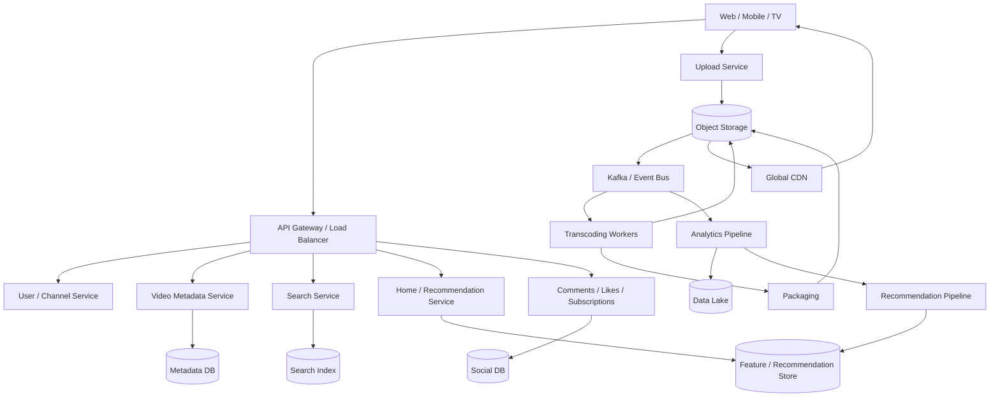
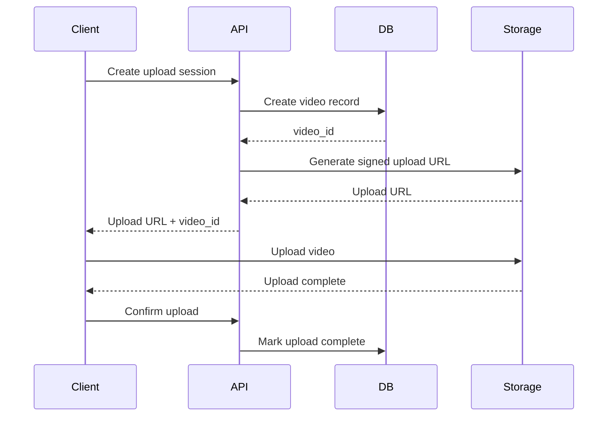
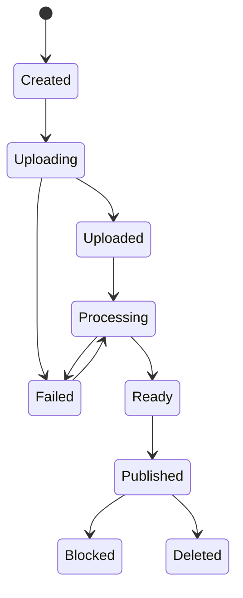
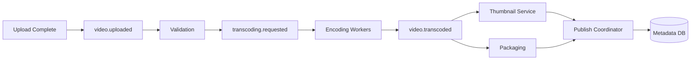
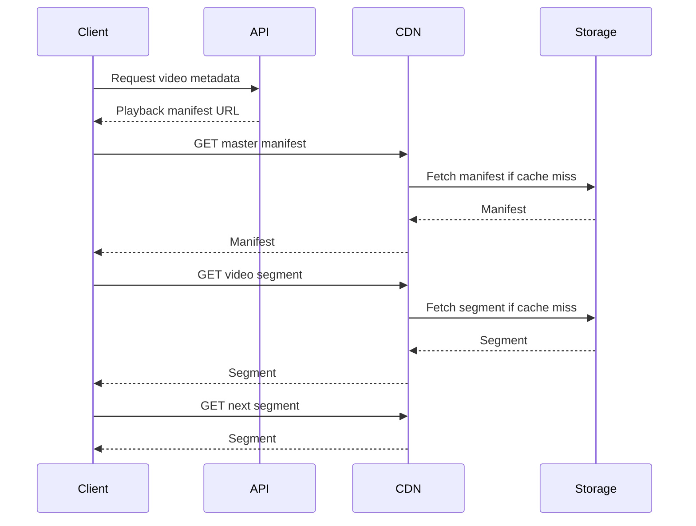
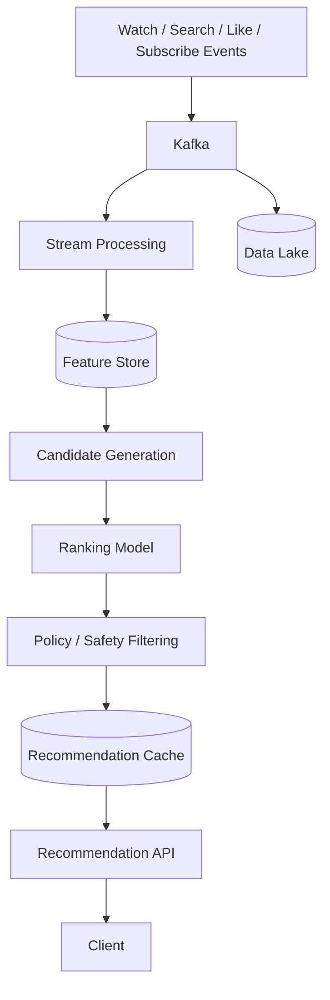
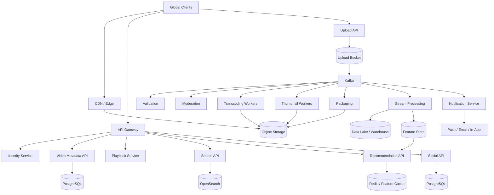

# 08- YouTube

## Overview

YouTube is a large-scale video platform with several fundamentally different workloads:

- Video upload
- Video storage
- Video transcoding
- Video delivery
- Metadata management
- Search
- Recommendations
- Subscriptions
- Comments and likes
- View counting
- Notifications
- Content moderation
- Copyright detection
- Analytics

The difficult part of designing a YouTube-like system is not storing video files. The main challenges are:

- Video files are extremely large.
- Upload traffic is bursty.
- A single video can become extremely popular.
- Video playback requires low-latency, high-throughput delivery.
- The same source video must be transcoded into multiple resolutions and codecs.
- Global users require geographically distributed delivery.
- Recommendations require large-scale event processing.
- Metadata and social interactions have very different consistency and scaling requirements.

A useful architectural separation is:

```text
                         YouTube Platform
                                |
        +-----------------------+-----------------------+
        |                       |                       |
        v                       v                       v
   Control Plane           Media Pipeline          Discovery
        |                       |                       |
   Metadata API             Upload                  Search
   Users                    Transcoding             Recommendations
   Channels                 Packaging               Trending
   Comments                 Storage                  Home Feed
   Subscriptions            CDN Delivery
```

The media path should be treated differently from the metadata path.

A PostgreSQL database should not be responsible for serving video bytes. Likewise, an object store should not be responsible for maintaining subscription relationships or recommendation state.

## Requirements

### Functional Requirements

A YouTube-like platform should support:

- User registration and authentication.
- Channel creation.
- Video upload.
- Resumable uploads.
- Video processing.
- Multiple video resolutions.
- Adaptive bitrate playback.
- Video metadata.
- Thumbnails.
- Video search.
- Video recommendations.
- Likes and dislikes or equivalent reactions.
- Comments.
- Subscriptions.
- Watch history.
- Notifications.
- View counting.
- Content moderation.
- Copyright detection.
- Video deletion.
- Privacy controls.
- Live streaming as an optional extension.

### Non-Functional Requirements

Example targets:

| Requirement | Example Target |
|---|---:|
| Availability | 99.99%+ |
| API p95 latency | < 200 ms |
| Metadata API p99 | < 500 ms |
| Playback startup | < 2–3 seconds |
| Upload resumability | Required |
| Video durability | Extremely high |
| Global delivery | Required |
| Feed freshness | Seconds to minutes |
| Recommendation latency | Low |
| Playback scalability | Millions of concurrent viewers |

These are architectural targets rather than universal requirements. Actual values should be derived from expected workload.

## Scale Assumptions

Consider an illustrative platform with:

```text
500 million registered users
100 million daily active users
20 million daily video views
1 million new videos/day
```

Suppose an average uploaded source video is:

```text
500 MB
```

Raw daily upload volume:

```text
1 million × 500 MB
= 500 TB/day
```

This is before transcoded variants.

If each source produces:

```text
240p
360p
480p
720p
1080p
1440p
2160p
```

the total storage requirement can become several times larger depending on codec, bitrate, retention policy, and encoding strategy.

This immediately demonstrates why ordinary application servers and relational databases are not suitable for the media layer.

## High-Level Architecture



The architecture can be divided into:

```text
Control Plane
Media Plane
Data Plane
Analytics Plane
```

## Control Plane

The control plane handles relatively small metadata and application operations:

```text
Users
Channels
Video metadata
Subscriptions
Comments
Likes
Privacy
Playlists
Permissions
```

Typical technologies:

- Django
- FastAPI
- PostgreSQL
- Redis
- Kafka
- Elasticsearch/OpenSearch

The control plane should not transport large video files.

## Media Plane

The media plane handles:

```text
Upload
Storage
Transcoding
Encoding
Packaging
Thumbnail generation
CDN delivery
```

Typical technologies:

- Amazon S3 or equivalent object storage
- CDN
- GPU/CPU encoding workers
- FFmpeg
- HLS/DASH packaging
- Kafka or equivalent event infrastructure

## Upload Architecture

A common mistake is:

```text
Client
  |
  v
Django API
  |
  v
Upload 2 GB video
```

This makes the application server unnecessarily responsible for:

- Large bandwidth consumption
- Connection management
- Long-running requests
- Upload retries
- Temporary storage
- Network failures

Instead, use direct-to-object-storage uploads.

```text
Client
   |
   v
Upload API
   |
   v
Generate signed upload URL
   |
   v
Client
   |
   v
Object Storage
```

The API handles authorization and metadata, while object storage handles the actual bytes.

## Direct Upload Flow



The client can then upload directly to object storage.

## Resumable Uploads

Large uploads can fail because of:

- Network interruption
- Mobile connectivity changes
- Client crashes
- Browser termination
- Timeouts

A production system should support resumable uploads.

Instead of:

```text
Upload entire 4 GB file
```

use chunks:

```text
Video
 |
 +--> Chunk 1
 +--> Chunk 2
 +--> Chunk 3
 +--> ...
 +--> Chunk N
```

If chunk 17 fails, the client retries chunk 17 rather than restarting the entire upload.

Object-storage multipart upload APIs are well suited for this architecture.

## Upload State Machine

A video can have states such as:



The state should be stored in durable metadata storage.

Example:

```text
video.status =
    created
    uploading
    uploaded
    processing
    ready
    published
    blocked
    deleted
```

Do not infer processing state solely from object-storage files.

## Video Metadata

A video record may contain:

```text
video_id
channel_id
title
description
visibility
status
duration
created_at
published_at
thumbnail_key
source_object_key
processing_version
```

Example PostgreSQL schema:

```sql
CREATE TABLE videos (
    id UUID PRIMARY KEY,
    channel_id UUID NOT NULL,
    title VARCHAR(500) NOT NULL,
    description TEXT,
    visibility VARCHAR(32) NOT NULL DEFAULT 'private',
    status VARCHAR(32) NOT NULL,
    duration_seconds INTEGER,
    source_object_key TEXT,
    thumbnail_object_key TEXT,
    created_at TIMESTAMPTZ NOT NULL DEFAULT NOW(),
    published_at TIMESTAMPTZ
);

CREATE INDEX idx_videos_channel_created
ON videos (channel_id, created_at DESC);

CREATE INDEX idx_videos_published
ON videos (published_at DESC)
WHERE status = 'published';
```

The database stores metadata, not the video bytes.

## Object Storage

Object storage is appropriate because video data is:

- Large
- Durable
- Mostly immutable
- Sequentially read
- Accessed by many geographically distributed clients
- Well suited to lifecycle policies

Example layout:

```text
videos/
  source/
    {video_id}/original.mp4

  encoded/
    {video_id}/360p/
    {video_id}/720p/
    {video_id}/1080p/

  thumbnails/
    {video_id}/default.jpg
    {video_id}/hq.jpg

  manifests/
    {video_id}/master.m3u8
```

The exact object layout depends on the storage and CDN architecture.

## Why Object Storage Instead of PostgreSQL?

Storing videos inside PostgreSQL creates several problems:

- Database storage becomes enormous.
- Backups become expensive.
- Replication becomes expensive.
- Database I/O competes with transactional queries.
- CDN integration becomes less direct.
- Database scaling becomes coupled to media volume.

A better separation is:

```text
PostgreSQL
    |
    +--> Metadata

Object Storage
    |
    +--> Video bytes
    +--> Images
    +--> Encoded variants
```

## Video Processing Pipeline

Once a video is uploaded:

```text
Upload complete
      |
      v
Event
      |
      v
Validation
      |
      v
Virus / malware scanning
      |
      v
Content moderation
      |
      v
Transcoding
      |
      v
Thumbnail generation
      |
      v
Packaging
      |
      v
Quality validation
      |
      v
Publish
```

Each stage should be independently scalable.

## Event-Driven Processing

Kafka is useful for decoupling processing stages.

Example topics:

```text
video.uploaded
video.transcoding.requested
video.transcoded
video.thumbnail.generated
video.moderation.completed
video.published
video.deleted
```

A simplified flow:



This architecture provides:

- Loose coupling
- Independent scaling
- Retryability
- Backpressure
- Replayability
- Better fault isolation

## Transcoding

A source video may arrive as:

```text
4K H.264
```

The platform may need:

```text
240p
360p
480p
720p
1080p
1440p
2160p
```

and potentially multiple codecs:

```text
H.264
VP9
AV1
```

The purpose is to support different:

- Device capabilities
- Network speeds
- Screen sizes
- Bandwidth constraints
- Browser/platform capabilities

## Encoding Matrix

An encoding pipeline may produce:

| Resolution | Typical Use |
|---|---|
| 240p | Very low bandwidth |
| 360p | Mobile / low bandwidth |
| 480p | SD |
| 720p | HD |
| 1080p | Full HD |
| 1440p | QHD |
| 2160p | 4K |

The exact bitrate and codec should be selected based on content type and quality targets.

## Adaptive Bitrate Streaming

A player should not download a single giant MP4 file and hope the network remains stable.

Instead, the video is split into segments.

For example:

```text
Master Manifest
      |
      +--> 360p
      |      |
      |      +--> Segment 1
      |      +--> Segment 2
      |      +--> Segment 3
      |
      +--> 720p
      |      |
      |      +--> Segment 1
      |      +--> Segment 2
      |      +--> Segment 3
      |
      +--> 1080p
             |
             +--> Segment 1
             +--> Segment 2
             +--> Segment 3
```

The player can switch quality dynamically.

## HLS and MPEG-DASH

Two common streaming protocols are:

| Protocol | Characteristics |
|---|---|
| HLS | Widely supported, HTTP-based |
| MPEG-DASH | Standardized adaptive streaming format |

Both can work with CDN delivery.

The important design principle is:

```text
Video
  -> Segments
  -> Manifests
  -> CDN
  -> Player
```

## Playback Flow



The application API should not proxy every video segment.

## CDN

The CDN is one of the most important components in a video platform.

Without a CDN:

```text
Millions of users
       |
       v
Origin Storage
```

With a CDN:

```text
Users
 |
 +--> Edge POP
 |
 +--> Edge POP
 |
 +--> Edge POP
        |
        v
    Object Storage
```

Popular videos become highly cacheable.

If a video segment is cached at an edge location, subsequent users can receive it without reaching the origin.

## CDN Cache Strategy

Video segments are generally immutable.

Therefore, cache keys can include:

```text
video_id
resolution
codec
segment_number
```

Example:

```text
/videos/abc123/1080p/segment-0042.m4s
```

Use long cache lifetimes for immutable media objects.

Do not use aggressive caching for mutable authorization metadata without considering security implications.

## Signed URLs and Access Control

Private or restricted videos require authorization.

A common pattern is:

```text
Client
  |
  v
API
  |
  v
Authorize user
  |
  v
Generate signed CDN URL
  |
  v
Client
  |
  v
CDN
```

The CDN validates the signed URL before serving content.

This avoids sending every segment request through the application API.

## Why Not Authenticate Every Segment Through Django?

Suppose a 20-minute video has hundreds of segments.

If every segment request goes through Django:

```text
Player
  |
  +--> Django
  +--> Django
  +--> Django
  +--> ...
```

application servers become a bottleneck.

Instead:

```text
Django/FastAPI
    |
    v
Authorize playback
    |
    v
Signed CDN URL
    |
    v
CDN handles segments
```

## Security

Important security controls include:

- Signed upload URLs
- Signed playback URLs
- Authentication
- Authorization
- Rate limiting
- Malware scanning
- Content moderation
- Copyright detection
- Encryption at rest
- TLS in transit
- Object-storage bucket policies
- Least-privilege IAM
- Abuse detection

Object-storage buckets should generally not be publicly writable.

## Video Privacy

Typical visibility states:

```text
public
unlisted
private
members-only
blocked
```

Authorization must be enforced before issuing playback credentials.

Do not rely solely on an obscure object-storage key as a security mechanism.

## Thumbnail Generation

A thumbnail can be generated automatically from the uploaded video.

Example:

```text
Video
  |
  v
Decoder
  |
  v
Frame extraction
  |
  v
Image processing
  |
  v
Object Storage
```

Multiple thumbnails can be generated:

```text
default
high-resolution
mobile
preview
```

Thumbnail selection can also become part of recommendation optimization.

## Search

Search should generally be separated from the transactional database.

The PostgreSQL database is authoritative, while a search engine maintains an index.

```text
Video Metadata
      |
      v
Kafka
      |
      v
Search Indexer
      |
      v
OpenSearch / Elasticsearch
```

A search document might contain:

```json
{
  "video_id": "video_123",
  "title": "Distributed Systems Explained",
  "description": "Architecture patterns...",
  "channel_name": "Engineering Academy",
  "tags": ["distributed-systems", "architecture"],
  "published_at": "2026-08-23T10:00:00Z"
}
```

## Search Ranking

Search ranking can use:

- Text relevance
- Freshness
- View count
- Engagement
- Channel authority
- Query-video similarity
- Personalization
- Language
- Region

Do not use database `LIKE '%query%'` as the primary search architecture for a global video platform.

## Recommendations

Recommendations are one of the hardest parts of the system.

A simplified pipeline is:

```text
User Activity
      |
      v
Event Stream
      |
      v
Feature Processing
      |
      v
Candidate Generation
      |
      v
Ranking
      |
      v
Policy / Filtering
      |
      v
Recommended Videos
```

## Recommendation Signals

Possible signals include:

- Watch history
- Watch duration
- Completion rate
- Likes
- Dislikes
- Shares
- Comments
- Subscriptions
- Search history
- Topic affinity
- Language
- Device
- Region
- Time of day
- Recent activity

Not every signal should be treated equally.

For example, watching 95% of a video may be a stronger positive signal than simply opening it.

## Candidate Generation

A recommendation system should not score every video.

Suppose the platform contains:

```text
1 billion videos
```

A request might generate:

```text
10,000 candidates
```

and then reduce them:

```text
10,000 candidates
       |
       v
Filtering
       |
       v
2,000 candidates
       |
       v
Ranking
       |
       v
100 candidates
       |
       v
Top 20
```

This is much more scalable.

## Recommendation Architecture



## Event Tracking

Video interactions produce enormous event volume.

Typical events:

```text
video_started
video_paused
video_completed
video_seeked
video_liked
video_disliked
video_shared
video_added_to_playlist
video_subscribed
search_performed
```

Do not synchronously write every watch event into PostgreSQL.

Instead:

```text
Client
  |
  v
Event Collector
  |
  v
Kafka
  |
  +--> Analytics
  +--> Recommendation
  +--> Fraud Detection
  +--> Metrics
```

## View Counting

View counting is more complex than:

```sql
UPDATE videos
SET views = views + 1;
```

A user may:

- Refresh the page.
- Open multiple tabs.
- Seek around.
- Use bots.
- Repeatedly replay content.

The platform may therefore define a view according to product-specific rules.

A scalable architecture is:

```text
Playback Event
      |
      v
Kafka
      |
      v
Aggregation
      |
      v
Redis / Stream Processor
      |
      v
Periodic Durable Update
```

The displayed count can be eventually consistent.

## Counter Design

For extremely popular videos, a single database row can become a hot row.

Instead of:

```text
video_123 -> views = 1,234,567
```

being updated on every event, distribute increments:

```text
video_123:shard_0
video_123:shard_1
video_123:shard_2
...
video_123:shard_N
```

Then periodically aggregate them.

This reduces write contention.

## Likes and Reactions

A reaction system typically needs:

```text
user_id
video_id
reaction
created_at
```

Use a uniqueness constraint:

```sql
CREATE UNIQUE INDEX idx_video_reaction_unique
ON video_reactions (video_id, user_id);
```

This prevents duplicate reactions at the database level.

Counters can be maintained asynchronously or through carefully controlled atomic operations.

## Comments

Comments are a separate high-write workload.

A simplified model:

```text
Comment
-------
id
video_id
user_id
parent_id
body
created_at
status
```

`parent_id` enables threaded replies.

For high comment volume:

```text
Comment API
    |
    v
Comment DB
    |
    v
Kafka
    |
    +--> Moderation
    +--> Notifications
    +--> Analytics
```

## Subscription System

A subscription relationship is:

```text
subscriber -> channel
```

Example schema:

```sql
CREATE TABLE subscriptions (
    subscriber_id UUID NOT NULL,
    channel_id UUID NOT NULL,
    created_at TIMESTAMPTZ NOT NULL DEFAULT NOW(),
    PRIMARY KEY (subscriber_id, channel_id)
);

CREATE INDEX idx_subscriptions_channel
ON subscriptions (channel_id);
```

The second index is important when finding subscribers to notify after a new upload.

## Notifications

When a subscribed channel publishes:

```text
New Video
   |
   v
Kafka
   |
   v
Notification Service
   |
   +--> Push
   +--> Email
   +--> In-app
```

Do not synchronously send notifications during the video publishing request.

Notification delivery is asynchronous and should have:

- Retry handling
- Rate limiting
- User preferences
- Deduplication
- Provider fallback

## Watch History

Watch history is high-volume and user-specific.

A simplified structure:

```text
user_id
video_id
position_seconds
watched_at
```

Recent history can be stored in Redis while durable history is written asynchronously.

This data is also valuable for recommendations.

## Playlists

A playlist can contain:

```text
playlist_id
owner_id
title
visibility
```

and:

```text
playlist_items
----------------
playlist_id
video_id
position
created_at
```

The `position` field should support efficient reordering without rewriting thousands of rows where possible.

## Trending

Trending content can be calculated using:

- View velocity
- Engagement velocity
- Geographic popularity
- Topic
- Recency
- Creator diversity

A video with:

```text
1 million views over 30 days
```

may be less interesting than:

```text
500,000 views in the last hour
```

Therefore, trending systems should consider velocity rather than only absolute counts.

## Content Moderation

Uploaded videos may need automated and human moderation.

A pipeline can include:

```text
Upload
  |
  v
Malware Scan
  |
  v
Frame Extraction
  |
  +--> Vision Moderation
  |
  +--> Audio Transcription
  |
  +--> Text Moderation
  |
  +--> Copyright Detection
  |
  v
Policy Decision
```

Potential outcomes:

```text
approved
restricted
age_restricted
blocked
manual_review
```

Moderation should be asynchronous because processing a large video can take significant time.

## Copyright Detection

Copyright detection can compare:

```text
Audio fingerprints
Video fingerprints
Metadata
Known copyrighted content
```

The pipeline may operate on extracted:

- Audio fingerprints
- Video frames
- Feature embeddings

A simplified architecture:

```text
Uploaded Video
      |
      v
Fingerprint Generator
      |
      v
Fingerprint Index
      |
      v
Similarity Search
      |
      v
Policy Engine
```

This is a separate specialized system and should not be coupled tightly to the core video API.

## Failure Handling

A large video-processing pipeline must expect failures.

Examples:

```text
Upload succeeded
Transcoding failed
```

or:

```text
1080p encoding succeeded
720p encoding failed
```

The system should track per-stage state rather than only:

```text
processing = true
```

For example:

```json
{
  "video_id": "video_123",
  "processing": {
    "validation": "completed",
    "moderation": "completed",
    "240p": "completed",
    "360p": "completed",
    "720p": "completed",
    "1080p": "failed"
  }
}
```

This enables targeted retries.

## Idempotent Processing

Transcoding workers may receive duplicate jobs.

A worker should be able to safely process:

```text
video_123 + 1080p + encoder_v4
```

multiple times without corrupting the final state.

Use deterministic output paths or processing job identifiers.

Example:

```text
encoded/{video_id}/{codec}/{resolution}/
```

If the output already exists and is valid, the worker can avoid unnecessary work.

## Job Queues

Long-running processing should not execute inside HTTP requests.

Bad:

```python
@app.post("/videos")
def process_video():
    transcode_video()
    generate_thumbnail()
    return {"status": "done"}
```

Better:

```text
HTTP API
   |
   v
Create metadata
   |
   v
Queue event
   |
   v
Return quickly

Workers
   |
   +--> Transcoding
   +--> Thumbnail generation
   +--> Moderation
```

Celery can work for task orchestration in smaller Python deployments, while Kafka or cloud-native event infrastructure is often more appropriate for high-throughput distributed event pipelines.

## Backpressure

Video processing can generate substantial compute demand.

Suppose:

```text
Upload rate = 1,000 videos/min
```

and:

```text
Average processing time = 10 minutes
```

The processing system must be able to absorb bursts without allowing upload requests to become coupled to transcoding capacity.

Kafka or a queue acts as a buffer:

```text
Uploaders
    |
    v
Event Queue
    |
    +--> Worker Pool
    +--> Worker Pool
    +--> Worker Pool
```

Autoscaling should be based on queue depth, processing latency, and worker utilization.

## GPU vs CPU Encoding

Encoding workloads may use:

| Approach | Advantage | Limitation |
|---|---|---|
| CPU | Flexible, mature | High compute cost |
| GPU | High throughput | Hardware cost / codec constraints |
| Dedicated encoding service | Operational simplicity | Vendor cost |
| Hybrid | Flexible workload placement | More complexity |

GPU acceleration is not automatically better for every codec or quality target.

Benchmark the actual encoding workload.

## Storage Lifecycle

Video storage costs can be significant.

Lifecycle policies can move older content to cheaper storage tiers.

For example:

```text
Hot content
    |
    v
Standard storage

Older content
    |
    v
Infrequent-access storage

Archived content
    |
    v
Archive tier
```

However, frequently accessed videos should remain in storage tiers appropriate for their access pattern.

Do not blindly archive content that is still popular.

## Replication and Durability

Canonical video objects should be highly durable.

Possible strategies include:

- Object-storage replication
- Cross-region replication
- Versioning
- Lifecycle policies
- Backup metadata
- Separate disaster-recovery region

Metadata and media have different recovery strategies.

For example:

```text
PostgreSQL
    |
    +--> Point-in-time recovery
    +--> Replicas
    +--> Backups

Object Storage
    |
    +--> Versioning
    +--> Replication
    +--> Lifecycle policies
```

## Multi-Region Delivery

The media path should generally be globally distributed.

```text
                     Global Users
                          |
                          v
                       CDN
                /        |        \
               v         v         v
             Asia      Europe    America
                \        |        /
                 \       |       /
                  v      v      v
                  Object Storage
```

The CDN handles edge delivery while object storage remains the origin.

The control plane may use a different multi-region architecture.

## Multi-Region Metadata

Metadata can be more difficult than media because it is mutable.

Possible strategies:

### Single-Region Primary

```text
All writes
    |
    v
Primary Region
    |
    +--> Read replicas
```

Advantages:

- Simple consistency model
- Easier operations

Limitations:

- Cross-region write latency
- Regional failure requires failover

### Multi-Region Writes

```text
Region A <----> Region B <----> Region C
```

Advantages:

- Lower local write latency
- Better regional availability

Limitations:

- Conflict resolution
- Replication complexity
- More difficult consistency guarantees

Do not choose active-active metadata writes merely because the application is global.

## Caching

Common cacheable objects include:

```text
Video metadata
Channel profiles
Recommendation results
Search results
Popular video metadata
```

Redis can provide low-latency application caching.

Example:

```python
import json

cached = redis_client.get(f"video:{video_id}")

if cached:
    return json.loads(cached)

video = repository.get(video_id)

redis_client.setex(
    f"video:{video_id}",
    300,
    json.dumps(video),
)

return video
```

Cache invalidation should be driven by known mutations where practical rather than relying exclusively on short TTLs.

## API Rate Limiting

Public APIs should enforce rate limits.

Examples:

```text
POST /videos
POST /comments
POST /likes
POST /subscriptions
GET /search
```

Rate limits can be applied by:

```text
user_id
IP address
API key
device
channel
```

Redis is commonly used for distributed rate limiting.

Abuse-sensitive endpoints should have stricter controls than read-only metadata endpoints.

## Observability

Important metrics include:

### Upload

```text
upload_success_rate
upload_failure_rate
upload_duration
multipart_retry_rate
```

### Processing

```text
queue_depth
consumer_lag
transcoding_duration
transcoding_failure_rate
processing_latency
```

### Playback

```text
startup_latency
buffering_ratio
rebuffer_rate
playback_error_rate
CDN_hit_rate
```

### API

```text
request_rate
p50_latency
p95_latency
p99_latency
error_rate
timeout_rate
```

### Recommendation

```text
candidate_generation_latency
ranking_latency
recommendation_ctr
watch_time
```

Playback-specific metrics are particularly important because an API can have excellent latency while the actual user experience is poor due to buffering or CDN problems.

## Distributed Tracing

A request may cross:

```text
API Gateway
  -> Video Service
  -> Metadata DB
  -> Recommendation Service
  -> Redis
```

Use distributed tracing to propagate trace context.

Example logical spans:

```text
video.metadata
recommendation.candidates
recommendation.ranking
metadata.redis
metadata.postgres
```

For video processing, job IDs should provide correlation across asynchronous boundaries.

Example:

```text
video_id
processing_job_id
trace_id
```

## Security Considerations

### Upload Security

Validate:

- File type
- File size
- Container format
- Codec
- Metadata
- User permissions

Do not trust:

```text
Content-Type: video/mp4
```

alone.

The actual file should be inspected.

### Object Storage Security

Use:

- Private buckets
- IAM policies
- Short-lived signed URLs
- Encryption
- Bucket policies
- Access logging where required

### API Security

Use:

- TLS
- Authentication
- Authorization
- Rate limiting
- Input validation
- Abuse detection
- Audit logging

### Content Access

Private videos should never become publicly accessible merely because their storage object key is known.

## Reliability and Graceful Degradation

The platform should degrade independently.

If recommendations fail:

```text
Recommendation Service
        |
        X
        |
        v
Fallback to subscriptions / trending
```

If search is unavailable:

```text
Search
  |
  X
  |
  v
Return temporary error
```

Do not block video playback because the recommendation service is unavailable.

If one transcoded representation fails:

```text
1080p failed
```

the platform may still publish:

```text
360p
720p
```

depending on product requirements.

## Disaster Recovery

The system should distinguish between:

```text
Canonical data
Derived data
Cache data
```

### Canonical

- Video metadata
- User accounts
- Channels
- Subscriptions
- Original video objects

### Derived

- Encoded representations
- Search indexes
- Recommendation features
- Aggregated counters

### Cache

- Redis entries
- CDN cache

Derived and cache data can often be rebuilt.

Canonical data requires stronger disaster-recovery guarantees.

## Disaster Recovery Strategy

```text
Primary Region
      |
      +--> Metadata backups
      +--> Object replication
      +--> Event retention
      |
      v
Secondary Region
      |
      v
Recovery Pipeline
```

Kafka retention can also help replay events to rebuild downstream systems.

Define explicit:

```text
RPO = acceptable data loss
RTO = acceptable recovery time
```

For example:

```text
Metadata RPO: minutes
Metadata RTO: < 1 hour
```

Actual values should follow business requirements.

## Cost Considerations

Major cost drivers include:

- Object storage
- CDN bandwidth
- Video transcoding
- GPU compute
- Database infrastructure
- Kafka/event infrastructure
- Search clusters
- Recommendation infrastructure
- Cross-region replication
- Data transfer
- Logging and analytics

CDN bandwidth and video transcoding can dominate costs.

A useful optimization principle is:

```text
Optimize bytes delivered
before optimizing tiny API operations.
```

For example:

- Efficient codecs
- Adaptive bitrate
- Appropriate segment sizes
- CDN caching
- Compression
- Lifecycle policies

can produce significant savings.

## Capacity Planning

Suppose:

```text
20 million video views/day
```

Average requests:

```text
20M / 86,400
≈ 231 views/sec
```

At a 20× peak:

```text
≈ 4,620 video starts/sec
```

But a video playback consists of many segment requests.

If each playback downloads:

```text
300 segments
```

then segment request volume is approximately:

```text
4,620 × 300
≈ 1.39 million segment requests/sec
```

This illustrates why the CDN must handle the majority of media traffic.

The API server should handle:

```text
Playback authorization
Metadata
Recommendations
```

while the CDN handles:

```text
Video segments
```

## Bandwidth Estimation

Suppose:

```text
Average delivered bitrate = 3 Mbps
Concurrent viewers = 1 million
```

Approximate outbound bandwidth:

```text
3 Mbps × 1,000,000
= 3 Tbps
```

This is why direct origin delivery is impractical.

The CDN absorbs most of this traffic.

The architecture must therefore optimize:

```text
CDN hit ratio
edge distribution
origin shielding
segment caching
```

## Hot Video Problem

Suppose a creator publishes a video that becomes viral.

Millions of users request the same segments.

Without caching:

```text
Millions of requests
       |
       v
Object Storage
```

With CDN:

```text
Millions of users
       |
       v
CDN Edge
       |
       +--> Cache Hit
       |
       v
Origin only on cache miss
```

The CDN transforms a massive repeated-read workload into a much smaller origin workload.

## Cache Stampede

A popular object can cause a cache stampede when many requests miss simultaneously.

Mitigation strategies include:

- Request coalescing
- Origin shielding
- Cache warming
- Long TTLs for immutable segments
- Jittered expiration
- Stale-while-revalidate where appropriate

Video segments are particularly suitable for long-lived caching because they are normally immutable.

## Database Strategy

Different workloads may use different storage technologies.

| Workload | Suitable Storage |
|---|---|
| User/channel metadata | PostgreSQL |
| Video metadata | PostgreSQL |
| Subscriptions | PostgreSQL / distributed relational DB |
| Comments | PostgreSQL / distributed DB |
| Feed/recommendation cache | Redis |
| Search | OpenSearch / Elasticsearch |
| Video objects | Object storage |
| Event stream | Kafka |
| Analytics | Data lake / warehouse |
| Feature storage | Feature store / key-value database |

Do not force every workload into PostgreSQL.

## Microservice Boundaries

A possible service decomposition:

```text
API Gateway
    |
    +--> Identity Service
    +--> Channel Service
    +--> Video Metadata Service
    +--> Upload Service
    +--> Playback Service
    +--> Search Service
    +--> Recommendation Service
    +--> Social Service
    +--> Notification Service
    +--> Moderation Service
    +--> Analytics Pipeline
```

However, these boundaries should evolve based on:

- Team ownership
- Scaling requirements
- Deployment independence
- Failure isolation
- Data ownership
- Domain boundaries

Do not create a microservice solely because a component has a different name.

## Django and FastAPI

Django is suitable for metadata-heavy services where:

- ORM capabilities are valuable.
- Admin interfaces are useful.
- Authentication and CRUD workflows dominate.

FastAPI can be useful for:

- High-throughput APIs
- Lightweight internal services
- Recommendation APIs
- Specialized inference endpoints

Neither framework should directly stream massive video files from application workers when object storage and CDN infrastructure can handle that workload more efficiently.

## gRPC

gRPC can be useful for internal service-to-service calls such as:

```text
Playback Service
      |
      v
Authorization Service

Recommendation Service
      |
      v
Feature Service

Video Service
      |
      v
Moderation Service
```

REST remains appropriate for public APIs.

The choice should be based on latency, interface contracts, streaming requirements, ecosystem, and operational complexity.

## Kafka and Event-Driven Architecture

Kafka can connect independent workloads:

```text
                    Kafka
                      |
      +---------------+----------------+
      |               |                |
      v               v                v
Transcoding      Recommendations    Analytics
      |               |                |
      v               v                v
Storage          Feature Store      Data Lake
```

This prevents the upload API from becoming responsible for the entire downstream processing pipeline.

## Common Mistakes and Pitfalls

### Sending Video Through Django or FastAPI

This consumes application-server bandwidth and worker capacity.

Use direct object-storage uploads and CDN delivery.

### Storing Videos in PostgreSQL

Large binary data makes database operations, replication, and backups unnecessarily expensive.

Use object storage for media.

### Serving Videos Directly From Object Storage

This bypasses edge caching and can create excessive origin traffic.

Use a CDN.

### Using One MP4 Per Video

A single file does not adapt efficiently to changing network conditions.

Use adaptive bitrate streaming.

### Transcoding Inside HTTP Requests

Transcoding is long-running and failure-prone.

Use asynchronous workers.

### Treating Kafka as a Database

Kafka is an event log, not a replacement for canonical transactional storage.

Persist authoritative metadata in appropriate databases.

### Updating View Counts Synchronously

A popular video can turn one database row into a hot write point.

Aggregate view events asynchronously.

### Running Search Queries Directly Against PostgreSQL

Text search at large scale should use a search-oriented index.

Keep PostgreSQL authoritative and asynchronously update the search index.

### Making Recommendations Synchronous With Playback

Recommendation failures should not prevent video playback.

Use independent services and fallback strategies.

### Ignoring CDN Cache Hit Rate

A CDN is only useful if content is cacheable and requests are routed appropriately.

Monitor cache hit ratio and origin traffic.

### Ignoring Encoding Explosion

Supporting many combinations of:

```text
resolution × codec × audio track × HDR format
```

can dramatically increase compute and storage requirements.

Define an encoding policy based on actual device and user demand.

### Assuming All Videos Need Every Resolution

A short low-resolution video may not justify generating every possible representation.

Encoding policy can be adaptive.

### Ignoring Viral Content

Average traffic hides extreme popularity.

Capacity planning must account for hot videos and traffic spikes.

### Treating Derived Data as Canonical

Search indexes, recommendation caches, and feed data should generally be rebuildable.

Keep canonical data durable.

## Production Architecture

A mature architecture separates the platform into independent paths.

### Upload Path

```text
Client
  |
  v
Upload API
  |
  v
Signed URL
  |
  v
Object Storage
  |
  v
Kafka
```

### Processing Path

```text
Kafka
  |
  v
Validation
  |
  v
Moderation
  |
  v
Transcoding
  |
  v
Packaging
  |
  v
Object Storage
```

### Playback Path

```text
Client
  |
  v
Playback API
  |
  v
Authorization
  |
  v
Signed CDN URL
  |
  v
CDN
  |
  v
Object Storage
```

### Discovery Path

```text
User Activity
  |
  v
Kafka
  |
  v
Feature Processing
  |
  +--> Search
  +--> Recommendations
  +--> Trending
```

### Social Path

```text
Likes
Comments
Subscriptions
Playlists
Watch History
       |
       v
Transactional Stores
       |
       v
Kafka
       |
       +--> Notifications
       +--> Analytics
       +--> Recommendations
```

## Reference Architecture



## Interview Questions

### How would you store videos?

Store video bytes in object storage such as Amazon S3 and keep metadata in a relational or distributed database.

### How would users upload multi-gigabyte videos?

Use direct-to-object-storage multipart or resumable uploads. The application server should issue short-lived upload credentials rather than proxying the file.

### How would you process uploaded videos?

Use an asynchronous event-driven pipeline:

```text
Upload
  -> Validation
  -> Moderation
  -> Transcoding
  -> Packaging
  -> Thumbnail
  -> Publish
```

### Why do we need transcoding?

Different users have different bandwidth, devices, resolutions, and codec support. Multiple representations enable adaptive playback.

### How do you serve video globally?

Use object storage as origin and a global CDN for edge delivery.

### Why not send every video request through the API?

Video segment traffic can be orders of magnitude larger than API traffic. Application servers should handle authorization and metadata while the CDN handles media delivery.

### How does adaptive bitrate streaming work?

The player retrieves a manifest describing multiple representations and downloads small segments. It switches representations based on bandwidth, buffer state, and device capability.

### How would you design recommendations?

Separate candidate generation from ranking:

```text
User Events
    |
    v
Features
    |
    v
Candidates
    |
    v
Ranking
    |
    v
Policy Filtering
    |
    v
Top K
```

### How would you count views?

Collect playback events asynchronously, aggregate them, apply fraud/business rules, and periodically update durable counters.

### How would you prevent a viral video from overwhelming storage?

Use CDN caching. Popular immutable segments should be served from edge locations rather than repeatedly fetched from object storage.

### How would you handle a failed transcoding job?

Track processing state per representation, retry idempotently, isolate permanent failures, and allow successful representations to remain available when product requirements permit.

### Why use Kafka?

Kafka decouples high-volume events from downstream consumers such as transcoding, analytics, recommendations, moderation, and notifications.

### What happens if the recommendation system fails?

Playback should continue independently. Fall back to subscriptions, trending content, or another deterministic feed.

### How would you make the system multi-region?

Keep media globally distributed through CDN and object storage replication. Metadata requires an explicit consistency and write-authority strategy, such as a primary region with failover or carefully designed multi-region writes.

### What is the biggest bottleneck?

For video platforms, media bandwidth and transcoding are major infrastructure concerns. At global scale, CDN capacity, origin traffic, storage, encoding compute, and recommendation infrastructure can dominate the architecture.

### What is the most important architectural separation?

Separate:

```text
Metadata
Media
Events
Search
Recommendations
Analytics
```

Each has different access patterns, consistency requirements, scaling characteristics, and failure modes.

## Key Takeaways

- **Separate the control plane from the media plane: keep metadata in databases while storing video bytes in object storage and delivering them through a CDN.**
- **Use direct resumable uploads, asynchronous transcoding, adaptive bitrate streaming, and event-driven processing to handle large media workloads reliably.**
- **Treat CDN delivery as a first-class scalability mechanism; application servers should authorize playback and serve metadata, not proxy every video segment.**
- **Build recommendations, search, analytics, moderation, and view aggregation as independent event-driven workloads so failures and scaling requirements do not affect core playback.**
- **Design for viral traffic, encoding/storage explosion, hot counters, multi-region delivery, and graceful degradation rather than optimizing only for average workload.**