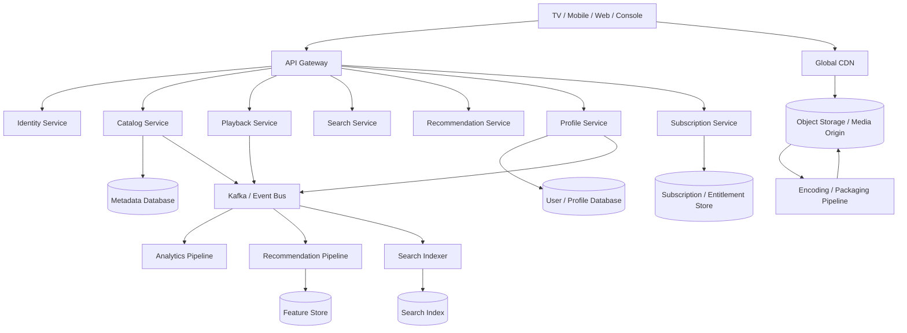
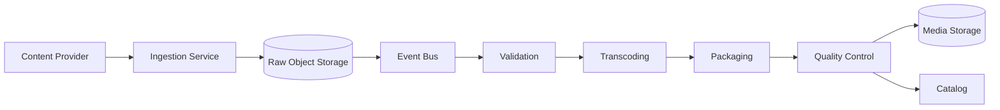
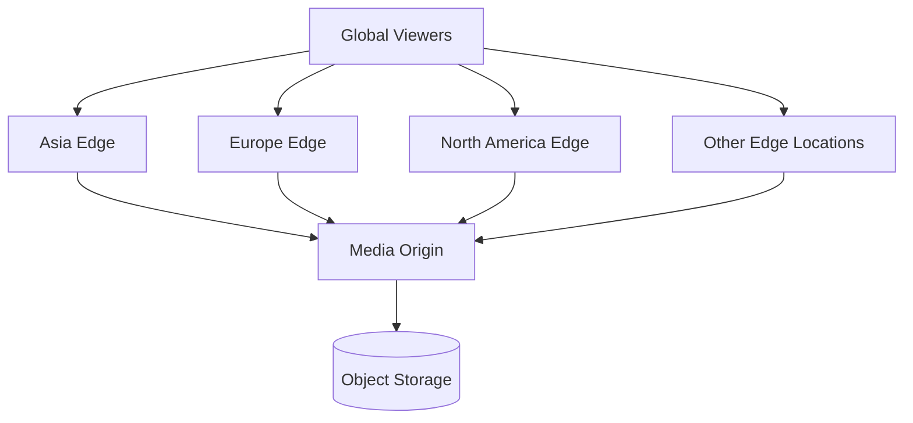
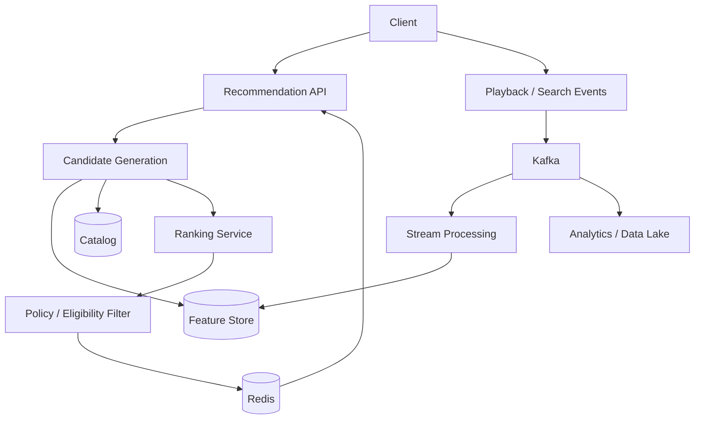
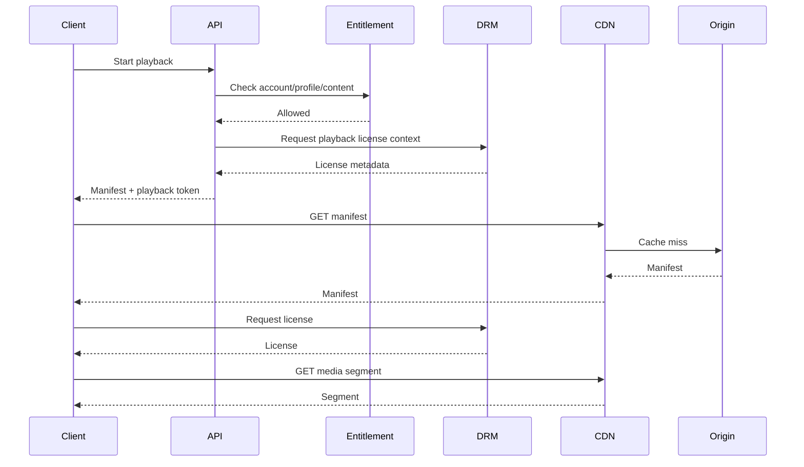
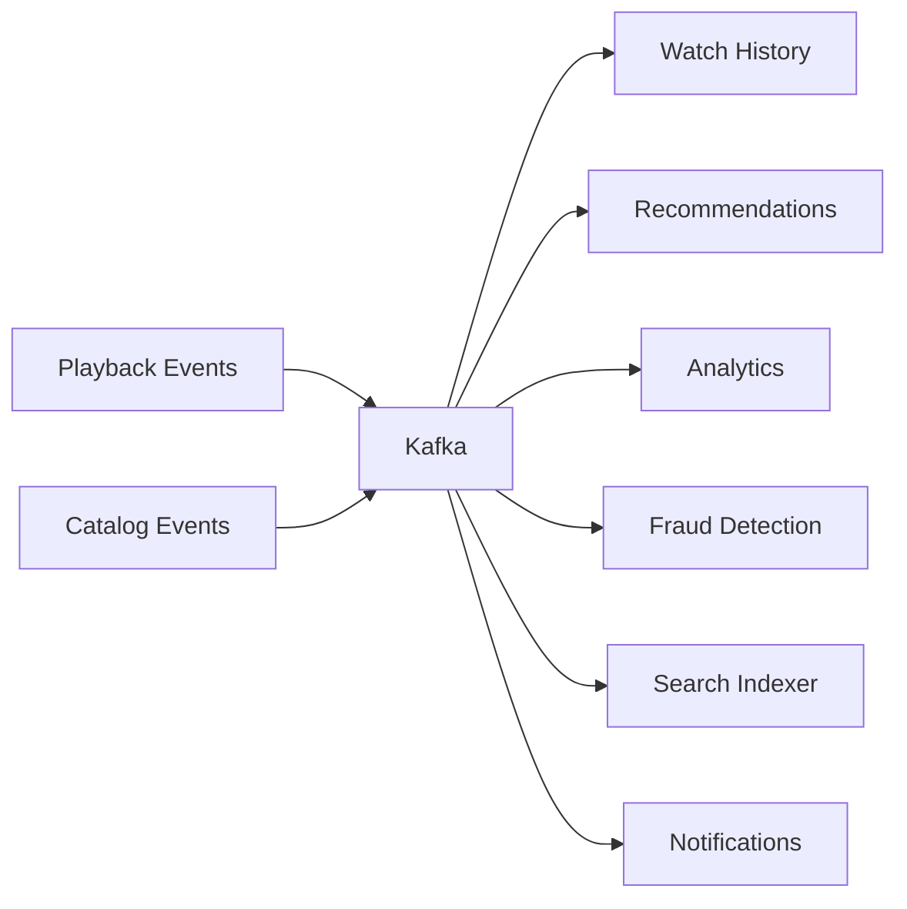
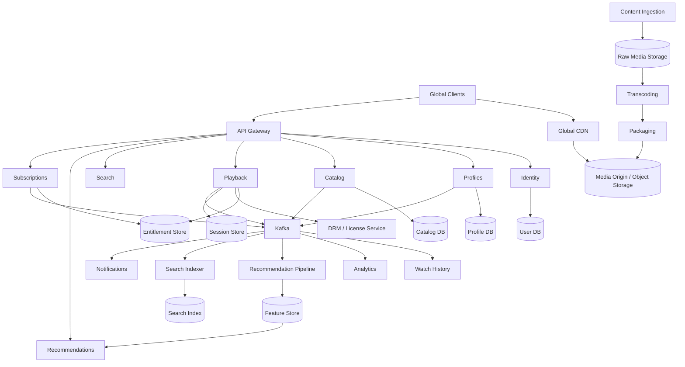

# 09- Netflix

## Overview

Designing a Netflix-like platform is primarily a distributed media-delivery and content-distribution problem.

The system must support:

- Large-scale video ingestion.
- Video transcoding and packaging.
- Global content delivery.
- Adaptive bitrate streaming.
- Content metadata and catalog management.
- Personalized recommendations.
- Search and discovery.
- User profiles and watch history.
- Playback authorization.
- Subscriptions and entitlements.
- Concurrent viewing across devices.
- Content availability by region.
- DRM and content protection.
- Offline downloads.
- Operational analytics and observability.

The most important architectural distinction is between the **control plane** and the **media plane**.

The control plane manages relatively small, transactional data:

```text
Users
Profiles
Subscriptions
Content metadata
Entitlements
Watch history
Recommendations
Search
Playback authorization
```

The media plane handles enormous data volumes:

```text
Video files
Encoded representations
Manifests
Segments
CDN delivery
```

A simplified architecture is:



The API tier should not proxy every video byte. The CDN should serve media segments directly to clients after the control plane authorizes playback.

## Requirements

### Functional Requirements

A Netflix-like platform should support:

- User authentication.
- Multiple profiles per account.
- Content browsing.
- Movies and TV shows.
- Seasons and episodes.
- Genres and categories.
- Search.
- Personalized recommendations.
- Continue Watching.
- Watch history.
- Watchlists.
- Playback.
- Adaptive bitrate streaming.
- Subtitles and audio tracks.
- Regional content restrictions.
- Subscription plans.
- Device authorization.
- Concurrent-stream limits.
- Offline downloads.
- Content ratings and maturity restrictions.
- Content availability windows.

### Non-Functional Requirements

Typical requirements include:

| Requirement | Example Target |
|---|---:|
| Availability | 99.99%+ |
| API p95 latency | < 200 ms |
| Playback startup | < 2–3 seconds |
| CDN availability | 99.99%+ |
| Global delivery | Required |
| Recommendation latency | < 100–200 ms |
| Search latency | < 200 ms |
| Playback error rate | Extremely low |
| Content durability | Very high |
| Horizontal scalability | Required |

The exact targets should be established from business requirements rather than assumed universally.

## Scale Assumptions

Consider an illustrative system:

```text
300 million accounts
150 million daily active users
50 million concurrent viewers at peak
100,000 content titles
Millions of playback sessions per day
Global users
```

The most important traffic characteristic is that **video bandwidth is vastly larger than API traffic**.

For example, assume:

```text
10 million concurrent viewers
Average bitrate = 5 Mbps
```

Then approximate outbound media bandwidth is:

```text
10,000,000 × 5 Mbps
= 50 Tbps
```

This cannot be handled efficiently by ordinary application servers.

The architecture therefore needs:

```text
Application APIs
        |
        v
Authorization / Metadata

CDN
        |
        v
Video delivery
```

## Core Architecture

A production-oriented design can be divided into several domains:

| Domain | Responsibility |
|---|---|
| Identity | Authentication and account identity |
| Profiles | User profiles and preferences |
| Catalog | Titles, seasons, episodes, metadata |
| Entitlements | Subscription and playback permissions |
| Playback | Session authorization and manifests |
| Media Pipeline | Encoding and packaging |
| CDN | Global media delivery |
| Search | Text and discovery |
| Recommendation | Personalized content ranking |
| Watch History | Playback progress and history |
| Billing | Subscription lifecycle |
| Notifications | Email, push, and in-app messaging |
| Analytics | Behavioral and operational events |

The boundaries should reflect ownership, scaling, and failure isolation rather than simply creating one service per database table.

## Control Plane

The control plane contains APIs and services responsible for decisions.

Examples:

```text
Can this user watch this title?
Which profile is active?
What content should appear on the home page?
What language should be selected?
Which subscription does the account have?
What is the user's watch progress?
```

A typical request path is:

```text
Client
  |
  v
API Gateway
  |
  v
Authentication
  |
  v
Authorization
  |
  v
Domain Service
  |
  +--> Cache
  |
  +--> Database
  |
  v
Response
```

The control plane should remain lightweight enough that it does not become part of the high-bandwidth media path.

## Media Plane

The media plane handles:

```text
Source video
    |
    v
Transcoding
    |
    v
Packaging
    |
    v
Object Storage
    |
    v
CDN
    |
    v
Client
```

Once a video is encoded and packaged, the media artifacts are generally immutable.

That makes them excellent CDN cache candidates.

## Content Ingestion

A content provider uploads a master video file.

The ingestion system should validate:

- File format.
- Codec.
- Audio tracks.
- Subtitle tracks.
- Resolution.
- Duration.
- Corrupted media.
- Metadata.
- Content identifiers.

A simplified ingestion flow:



The ingestion API should not synchronously wait for transcoding.

## Transcoding

A source video may be delivered as a high-quality master:

```text
4K / high bitrate / mezzanine format
```

The platform can produce multiple representations:

```text
480p
720p
1080p
1440p
2160p
```

and multiple codecs where appropriate:

```text
H.264
VP9
AV1
```

Encoding decisions depend on:

- Device compatibility.
- Network conditions.
- Quality requirements.
- Storage cost.
- CDN bandwidth.
- Codec support.
- CPU/GPU cost.

Supporting every resolution and codec combination can cause an encoding explosion.

## Encoding Pipeline

```text
Master Video
    |
    +--> 480p / H.264
    +--> 720p / H.264
    +--> 1080p / H.264
    +--> 1080p / VP9
    +--> 1080p / AV1
    +--> 2160p / H.265/AV1
```

Each representation should be independently tracked.

For example:

```json
{
  "title_id": "title_123",
  "processing": {
    "480p_h264": "ready",
    "720p_h264": "ready",
    "1080p_h264": "ready",
    "1080p_av1": "processing",
    "2160p_av1": "failed"
  }
}
```

This enables targeted retries rather than restarting the entire pipeline.

## Adaptive Bitrate Streaming

A client should not download one large video file.

Instead, content is divided into segments:

```text
Master Manifest
       |
       +--> 480p
       |     |
       |     +--> segment 1
       |     +--> segment 2
       |     +--> segment 3
       |
       +--> 720p
       |     |
       |     +--> segment 1
       |     +--> segment 2
       |     +--> segment 3
       |
       +--> 1080p
             |
             +--> segment 1
             +--> segment 2
             +--> segment 3
```

The client selects the appropriate representation based on:

- Available bandwidth.
- Buffer health.
- Device capability.
- Screen resolution.
- Decoder support.

This allows playback quality to change without restarting the video.

## HLS and MPEG-DASH

Common HTTP adaptive streaming protocols include:

| Technology | Purpose |
|---|---|
| HLS | HTTP-based adaptive streaming |
| MPEG-DASH | Standards-based adaptive streaming |

The player typically retrieves:

```text
Master manifest
      |
      v
Variant manifest
      |
      v
Media segments
```

The CDN serves the manifests and segments.

## CDN Architecture

Global media delivery should use a CDN.



The objective is:

```text
Viewer
  |
  v
Nearest Edge
  |
  +--> Cache Hit -> Media delivered
  |
  +--> Cache Miss -> Origin
```

The origin should not receive every request.

## Why CDN Is Critical

Suppose a popular title receives:

```text
5 million concurrent viewers
```

If every segment request reaches the origin, the origin becomes a bottleneck.

With a CDN:

```text
5 million viewers
       |
       v
Thousands of edge cache locations
       |
       v
Small number of origin requests
```

This dramatically reduces:

- Origin bandwidth.
- Origin CPU.
- Storage request volume.
- Latency.
- Cross-region traffic.

## Cache Strategy

Media segments are usually immutable.

Therefore, they can use long cache lifetimes.

For example:

```text
/videos/title-123/1080p/segment-000123.m4s
```

If the object is immutable, the URL itself can act as a versioned cache key.

A new encoding version should generate a new path or object identifier rather than mutating an existing cached object.

## Cache Invalidation

Avoid relying heavily on cache invalidation for immutable media.

Prefer:

```text
New media version
      |
      v
New object key
      |
      v
New CDN cache key
```

This is safer than overwriting:

```text
/videos/title-123/1080p/segment-1.m4s
```

while expecting every CDN edge to immediately forget the old object.

## Playback Authorization

The application should authorize a playback session before issuing media access credentials.

```text
Client
  |
  v
Playback API
  |
  +--> Authenticate
  |
  +--> Check subscription
  |
  +--> Check region
  |
  +--> Check profile restrictions
  |
  +--> Check device/session limits
  |
  v
Signed playback URL/token
  |
  v
CDN
```

The CDN then serves media directly.

## Why Not Authenticate Every Segment?

A two-hour video can generate hundreds or thousands of segment requests.

If every request goes through Django/FastAPI:

```text
Player
  |
  +--> API
  +--> API
  +--> API
  +--> API
  +--> ...
```

The API tier becomes coupled to media bandwidth.

Instead:

```text
API
 |
 +--> Authorize session
 |
 +--> Issue token
 |
 v
CDN
 |
 +--> segment
 +--> segment
 +--> segment
```

The application remains responsible for authorization while the CDN handles bulk media delivery.

## DRM and Content Protection

Premium video platforms require stronger content protection than ordinary signed URLs.

A simplified flow is:

```text
Client
  |
  v
Playback API
  |
  v
Entitlement Check
  |
  v
License Service
  |
  v
DRM License
  |
  v
Encrypted Media
```

Common DRM ecosystems include:

- Widevine.
- FairPlay.
- PlayReady.

DRM protects the content key and controls playback in supported environments.

Signed URLs alone are not equivalent to DRM.

## Encryption

Media should be encrypted:

```text
Client <---- TLS ----> CDN
CDN    <---- TLS ----> Origin
Origin <---- encrypted storage ----> Object Store
```

At rest, use managed encryption where possible.

For high-value content, encryption keys should be managed through a dedicated key-management system with appropriate access controls.

## Catalog Model

Netflix-like content is hierarchical.

A simplified model is:

```text
Title
 |
 +--> Movie
 |
 +--> Series
        |
        +--> Season 1
        |      |
        |      +--> Episode 1
        |      +--> Episode 2
        |
        +--> Season 2
               |
               +--> Episode 1
```

A relational model might contain:

```text
titles
seasons
episodes
genres
cast_members
content_regions
audio_tracks
subtitle_tracks
```

Example:

```sql
CREATE TABLE titles (
    id UUID PRIMARY KEY,
    title_type VARCHAR(32) NOT NULL,
    name VARCHAR(500) NOT NULL,
    description TEXT,
    release_year INTEGER,
    maturity_rating VARCHAR(32),
    created_at TIMESTAMPTZ NOT NULL DEFAULT NOW()
);

CREATE TABLE seasons (
    id UUID PRIMARY KEY,
    title_id UUID NOT NULL REFERENCES titles(id),
    season_number INTEGER NOT NULL,
    UNIQUE (title_id, season_number)
);

CREATE TABLE episodes (
    id UUID PRIMARY KEY,
    season_id UUID NOT NULL REFERENCES seasons(id),
    episode_number INTEGER NOT NULL,
    name VARCHAR(500) NOT NULL,
    duration_seconds INTEGER,
    UNIQUE (season_id, episode_number)
);
```

The exact schema should reflect the product's catalog requirements.

## Regional Availability

Content rights are often region-specific.

A title might be:

```text
Available:
India
United Kingdom
Germany

Unavailable:
United States
Canada
Australia
```

The entitlement layer must therefore consider:

```text
user
subscription
region
device
content rights
availability window
```

A playback authorization decision can be modeled as:

```text
ALLOW if:

subscription_active
AND content_available_in_region
AND profile_allows_content
AND device_allowed
AND concurrency_limit_not_exceeded
AND content_not_expired
```

This decision should be centralized enough to avoid inconsistent authorization logic across clients.

## Subscription and Entitlements

Subscription data is different from content metadata.

Example:

```text
Account
  |
  +--> Subscription
  |       |
  |       +--> Plan
  |
  +--> Profiles
```

A plan may define:

```text
maximum resolution
simultaneous streams
offline downloads
supported devices
```

The entitlement service converts subscription state into playback permissions.

## Concurrent Stream Limits

Suppose a plan allows:

```text
4 simultaneous streams
```

The platform needs to track active sessions.

A simple design:

```text
Playback Start
      |
      v
Session Store
      |
      v
Count active sessions
      |
      +--> Under limit -> Allow
      |
      +--> At limit -> Reject
```

Redis can maintain short-lived session state.

Use heartbeats or lease expiration to prevent abandoned sessions from consuming capacity indefinitely.

Example:

```text
session:{account_id}:{device_id}
TTL = 60 seconds
```

The client periodically refreshes the lease while playing.

## Profiles

One account can have multiple profiles.

Example:

```text
Account
 |
 +--> Adult Profile
 +--> Child Profile
 +--> Guest Profile
```

Profile-specific data includes:

- Language.
- Maturity settings.
- Watch history.
- Recommendations.
- Continue Watching.
- Watchlist.

This means personalization should generally be associated with the **profile**, not merely the account.

## Watch History

Playback events can generate:

```text
playback_started
playback_progress
playback_paused
playback_stopped
playback_completed
```

Do not synchronously write every playback progress event into PostgreSQL.

Instead:

```text
Client
  |
  v
Event Collector
  |
  v
Kafka
  |
  +--> Watch History
  +--> Recommendations
  +--> Analytics
  +--> Fraud Detection
```

Recent progress can be maintained in Redis or a low-latency key-value store and asynchronously persisted.

## Continue Watching

A user may have:

```text
Episode 5
position = 1,243 seconds
```

The Continue Watching API should retrieve this data efficiently.

A cache-oriented model:

```text
continue:{profile_id}
```

can contain recently watched items.

Example:

```json
{
  "title_id": "title_123",
  "episode_id": "episode_7",
  "position_seconds": 1243,
  "duration_seconds": 3200,
  "updated_at": "2026-08-23T10:20:00Z"
}
```

The system should avoid returning stale progress after a newer event has already been processed.

## Recommendation System

Personalized recommendations are one of the most challenging parts of the architecture.

A useful high-level pipeline is:

```text
User Events
    |
    v
Feature Generation
    |
    v
Candidate Generation
    |
    v
Ranking
    |
    v
Business / Safety Filtering
    |
    v
Top N Recommendations
```

## Recommendation Signals

Signals may include:

- Watch history.
- Watch completion.
- Rewatch behavior.
- Search history.
- Ratings or reactions.
- Genre preferences.
- Language.
- Device.
- Time of day.
- Region.
- Similar user behavior.
- Recently released content.
- Trending content.

Watch duration is often more informative than simply recording that a title was opened.

## Candidate Generation

Do not score the entire catalog.

Suppose:

```text
100,000 titles
```

Candidate generators may produce:

```text
Recently watched related titles
Popular in user's region
Titles similar to watched content
Trending titles
New releases
Titles from preferred genres
```

These candidates might produce:

```text
100,000 titles
       |
       v
Candidate generation
       |
       v
5,000 candidates
       |
       v
Ranking
       |
       v
100 candidates
       |
       v
Policy filtering
       |
       v
20 displayed titles
```

This keeps ranking computationally manageable.

## Recommendation Architecture



## Recommendation Caching

Recommendations can often be cached per profile.

Example:

```text
recommendations:{profile_id}
```

However, caching must balance freshness and computational cost.

A typical strategy is:

```text
Precompute recommendations
        +
Request-time filtering
        +
Short TTL
```

This avoids running an expensive ranking pipeline for every page request.

## Search

Search should use a dedicated search engine rather than querying PostgreSQL for every request.

```text
Catalog DB
    |
    v
Change Event
    |
    v
Indexer
    |
    v
Search Index
```

A search document may include:

```json
{
  "title_id": "title_123",
  "name": "Distributed Systems",
  "description": "A technical series...",
  "genres": ["Technology", "Documentary"],
  "actors": ["..."],
  "release_year": 2026,
  "regions": ["IN", "GB", "DE"]
}
```

## Search Ranking

Search ranking can combine:

```text
Text relevance
+
Popularity
+
Freshness
+
User personalization
+
Regional availability
```

Search results must also respect entitlement and regional restrictions.

Do not index restricted content into a globally visible result set without enforcing authorization at query or response time.

## Home Page

A home page might contain:

```text
Continue Watching
Trending
Because You Watched X
Popular in Your Country
New Releases
Top Picks for You
My List
```

These rows are effectively multiple recommendation problems.

A scalable architecture can precompute row membership and perform lightweight request-time filtering.

## My List

A watchlist is a transactional relationship:

```text
profile_id
title_id
created_at
```

Use a uniqueness constraint:

```sql
CREATE TABLE watchlist (
    profile_id UUID NOT NULL,
    title_id UUID NOT NULL,
    created_at TIMESTAMPTZ NOT NULL DEFAULT NOW(),
    PRIMARY KEY (profile_id, title_id)
);
```

This prevents duplicate entries.

## Notifications

Notifications may include:

```text
New season available
New episode available
Recommended title
Subscription event
Account security event
```

Publishing content should not synchronously send notifications.

Use an event:

```text
title.published
      |
      v
Kafka
      |
      v
Notification Service
      |
      +--> Push
      +--> Email
      +--> In-App
```

The service should support:

- Retry.
- Deduplication.
- User preferences.
- Provider failure handling.
- Rate limiting.

## Offline Downloads

Offline playback introduces another architecture.

```text
Client
  |
  v
Download Authorization
  |
  v
Signed Download Credentials
  |
  v
CDN
  |
  v
Encrypted Media
  |
  v
Device Secure Storage
```

Offline content may require:

- Expiration.
- DRM licenses.
- Device registration.
- Download limits.
- Periodic entitlement checks.

The client should not receive unrestricted permanent access to the original media.

## Playback Session

A playback session may contain:

```text
session_id
profile_id
account_id
title_id
device_id
region
started_at
last_heartbeat
drm_context
```

The playback service can validate:

```text
Authentication
Subscription
Region
Maturity restrictions
Device
Concurrent stream limit
Content availability
```

Only after these checks should the service issue playback credentials.

## Playback Flow



## Request Routing

A typical public API can be fronted by:

```text
Route 53
   |
   v
CloudFront / CDN
   |
   v
Load Balancer
   |
   v
API Gateway / Nginx
   |
   +--> Django
   +--> FastAPI
```

The exact topology depends on cloud architecture and service boundaries.

The key principle is that media traffic and API traffic should have independent scaling paths.

## Database Strategy

Different workloads should use different storage models.

| Workload | Suitable Technology |
|---|---|
| Account metadata | PostgreSQL |
| Catalog metadata | PostgreSQL |
| Subscriptions | PostgreSQL |
| Watchlist | PostgreSQL |
| Watch progress | Redis + durable store |
| Recommendations | Redis / feature store |
| Search | OpenSearch / Elasticsearch |
| Events | Kafka |
| Video media | Object storage |
| CDN delivery | CloudFront / CDN |
| Analytics | Data lake / warehouse |

The relational database remains the source of truth for transactional data.

## Database Scaling

For read-heavy metadata workloads:

```text
Application
    |
    +--> Read Replica
    +--> Read Replica
    +--> Read Replica
```

Writes go to the primary.

Reads can use replicas where eventual consistency is acceptable.

However, blindly routing every read to replicas can create problems if the application requires read-after-write consistency.

For example:

```text
User adds title to My List
        |
        v
Primary DB

Immediate GET /my-list
        |
        v
Replica
```

If replication has lag, the newly added title might not appear immediately.

Use primary reads or consistency-aware routing where necessary.

## Caching

Redis is useful for:

```text
Catalog metadata
Popular titles
Profile configuration
Recommendations
Continue Watching
Playback session state
Rate limits
Feature data
```

A cache-aside pattern:

```python
import json

cache_key = f"title:{title_id}"

cached = redis_client.get(cache_key)

if cached:
    return json.loads(cached)

title = repository.get_title(title_id)

redis_client.setex(
    cache_key,
    300,
    json.dumps(title),
)

return title
```

Cache invalidation should be explicit for frequently mutated data.

## Rate Limiting

Rate limiting should protect:

```text
Login
Search
Playback authorization
Watchlist mutations
Recommendation APIs
Device registration
Download authorization
```

Possible dimensions:

```text
IP
Account
Profile
Device
API key
```

Redis can implement distributed token-bucket or sliding-window rate limiting.

## Event-Driven Architecture

Kafka can connect independent workloads:



This provides:

- Loose coupling.
- Independent scaling.
- Replayability.
- Backpressure.
- Fault isolation.

Consumers should be idempotent because duplicate event delivery can occur.

## Idempotency

Consider an event:

```text
title.published
```

The notification service may receive it twice.

Without idempotency:

```text
Push notification
Push notification
```

Use an event identifier:

```json
{
  "event_id": "evt_123",
  "event_type": "title.published",
  "title_id": "title_123"
}
```

The consumer can maintain processed-event state.

Idempotency is especially important in:

- Payments.
- Notifications.
- Watch history updates.
- Subscription processing.
- Catalog indexing.

## Observability

Important metrics include:

### API

```text
request_rate
p50_latency
p95_latency
p99_latency
error_rate
timeout_rate
```

### Playback

```text
startup_latency
rebuffer_ratio
playback_failure_rate
manifest_error_rate
segment_error_rate
concurrent_streams
```

### CDN

```text
cache_hit_ratio
origin_request_rate
origin_bandwidth
edge_latency
4xx_rate
5xx_rate
```

### Transcoding

```text
queue_depth
processing_latency
worker_utilization
encoding_failure_rate
```

### Recommendations

```text
candidate_latency
ranking_latency
cache_hit_rate
click_through_rate
watch_time
```

Playback Quality of Experience is a critical business and engineering metric.

An API can report:

```text
99.99% availability
```

while users still experience poor playback because:

```text
rebuffering
CDN errors
slow startup
manifest failures
```

Therefore, system health must include user-facing media metrics.

## Distributed Tracing

A request may cross multiple services:

```text
API Gateway
   |
   v
Playback Service
   |
   +--> Entitlement
   |
   +--> Profile
   |
   +--> Subscription
   |
   +--> DRM
```

Propagate trace context across service boundaries.

For asynchronous workflows, correlate:

```text
trace_id
event_id
session_id
profile_id
title_id
```

This makes production debugging significantly easier.

## Security Considerations

### Authentication

Use secure authentication mechanisms and short-lived access tokens where appropriate.

Protect:

- Account credentials.
- Session tokens.
- Device credentials.
- Playback credentials.

### Authorization

Do not confuse authentication with authorization.

The user may be authenticated but still not be allowed to play a title because of:

- Subscription.
- Region.
- Profile restrictions.
- Device restrictions.
- Availability window.

### Object Storage

Media origins should not be publicly writable.

Prefer:

```text
Private Bucket
    |
    v
CDN
    |
    v
Authorized Client
```

Use least-privilege IAM policies.

### Signed URLs

Signed URLs should have:

- Short expiration.
- Restricted paths.
- Appropriate audience.
- Cryptographically secure signatures.

### DRM

For premium media, signed URLs alone are insufficient to prevent content extraction.

Use DRM where the business and content licensing requirements demand it.

## Reliability

Each major subsystem should fail independently.

If recommendations fail:

```text
Recommendation Service
        X
        |
        v
Fallback recommendations
```

If search fails:

```text
Search
  X
  |
  v
Temporary failure / fallback UI
```

If one CDN region has problems:

```text
Client
  |
  v
Alternative edge / routing path
```

Playback should not depend synchronously on non-critical systems.

## Graceful Degradation

Possible fallbacks:

| Failed Component | Fallback |
|---|---|
| Recommendations | Trending / popular |
| Search | Cached results / temporary error |
| Watch history | Cached progress |
| Analytics | Queue events for later processing |
| Notification provider | Secondary provider |
| CDN edge | Alternate edge/origin |
| Metadata cache | Database |
| Redis | Durable store for critical data |

Critical user flows should have fewer synchronous dependencies.

## Disaster Recovery

Separate data into:

### Canonical Data

```text
Accounts
Subscriptions
Catalog
Entitlements
Watchlist
Original media
```

### Derived Data

```text
Search index
Recommendation features
Aggregated analytics
Caches
Precomputed rows
```

Derived data should generally be rebuildable.

For example:

```text
PostgreSQL
   |
   +--> Backup
   +--> Replica

Object Storage
   |
   +--> Replication
   +--> Versioning

Kafka
   |
   +--> Retained events
```

The system should explicitly define:

```text
RPO
RTO
```

For example:

```text
Catalog RPO: < 5 minutes
Catalog RTO: < 1 hour
```

Actual targets should follow business requirements.

## Multi-Region Architecture

Media delivery is naturally global:

```text
                     Global Users
                          |
                         CDN
             /             |             \
            v              v              v
         Asia           Europe       North America
            \              |              /
             \             |             /
                  Media Origin
```

Metadata is more difficult.

A conservative strategy is:

```text
Global Clients
      |
      v
Nearest Region
      |
      v
Primary Metadata Region
```

with read replicas or regional caches.

Active-active writes introduce:

- Conflict resolution.
- Replication lag.
- More complex failover.
- Data ownership issues.
- Operational complexity.

Do not choose active-active writes unless the business actually requires them.

## Cost Considerations

Major cost drivers include:

- CDN bandwidth.
- Object storage.
- Transcoding.
- GPU/CPU compute.
- Database infrastructure.
- Search infrastructure.
- Kafka.
- Analytics.
- Cross-region replication.
- DRM/license infrastructure.
- Logging and observability.

The largest optimization opportunities often come from:

```text
Reduce delivered bytes
       |
       +--> Better codecs
       +--> Adaptive bitrate
       +--> CDN caching
       +--> Efficient segment sizes
       +--> Appropriate encoding ladders
```

A small reduction in average bitrate can produce substantial savings at global scale.

## Capacity Planning

Assume:

```text
10 million concurrent viewers
Average bitrate = 5 Mbps
```

Media bandwidth:

```text
10M × 5 Mbps
= 50 Tbps
```

The CDN must therefore absorb extremely high traffic.

Now assume each viewer requests:

```text
1 segment every 4 seconds
```

Then:

```text
10M / 4
= 2.5 million segment requests/sec
```

The architecture must support enormous request rates even though the control-plane API request rate may be much smaller.

This is one of the most important distinctions in media system design:

```text
API QPS != Media QPS != Media Bandwidth
```

All three must be capacity-planned independently.

## Hot Content

A newly released popular title may generate an extreme access spike.

Without caching:

```text
Millions of users
       |
       v
Origin
```

With CDN:

```text
Millions of users
       |
       v
Edge caches
       |
       v
Origin
```

For immutable segments, long cache lifetimes and cache-key versioning provide excellent scalability.

## Cache Stampede

If a popular object expires simultaneously across many nodes:

```text
Cache Miss
Cache Miss
Cache Miss
...
```

many requests can hit the origin simultaneously.

Mitigation strategies include:

- Request coalescing.
- Origin shielding.
- Cache warming.
- Jittered TTLs.
- Stale-while-revalidate.
- Long-lived immutable media objects.

## Production Failure Scenarios

### CDN Failure

Use alternate origins, routing policies, or multiple CDN strategies where justified by availability requirements.

### Kafka Consumer Lag

Monitor:

```text
consumer_lag
queue_depth
processing_latency
```

Scale consumers horizontally.

### Recommendation Failure

Use cached or deterministic fallback content.

### Database Failure

Use replicas, automated failover, backups, and connection management.

### Redis Failure

Critical state should not exist only in Redis unless losing it is explicitly acceptable.

### Transcoding Failure

Retry jobs with bounded backoff and dead-letter handling.

### Search Index Failure

The catalog database remains authoritative. Search indexes should be rebuildable.

## Common Mistakes and Pitfalls

### Treating Netflix as a CRUD Application

The primary difficulty is not CRUD.

The difficult workloads are:

```text
Media delivery
Encoding
CDN distribution
Recommendations
Playback authorization
Global scale
```

### Sending Video Through Application Servers

This couples API capacity to media bandwidth.

Use object storage and CDN delivery.

### Storing Media in PostgreSQL

Relational databases should store metadata, not enormous media objects at this scale.

### Using a Single Video File

A single MP4 cannot efficiently adapt to changing network conditions.

Use segmented adaptive streaming.

### Making Playback Depend on Recommendations

A recommendation failure should never prevent playback.

Keep critical playback dependencies minimal.

### Synchronously Recording Playback Events

High-frequency playback events can overwhelm transactional databases.

Use Kafka or another event pipeline.

### Using One Global Database Without Considering Consistency

Global users do not automatically require global writes.

Choose consistency and topology based on actual product requirements.

### Ignoring Regional Rights

Content availability is often a business constraint as much as a technical one.

Authorization must incorporate region and entitlement.

### Ignoring Device Constraints

A plan may have:

```text
Maximum resolution
Maximum concurrent streams
Supported devices
```

These must be enforced consistently.

### Treating DRM as Authentication

Authentication answers:

```text
Who is the user?
```

DRM protects:

```text
How is premium media cryptographically protected?
```

They solve different problems.

### Building Recommendations With Only One Model

Production recommendation systems commonly combine multiple candidate sources and ranking stages.

A single monolithic recommendation query is difficult to scale and evolve.

### Creating Too Many Microservices

A service boundary should have a reason:

- Independent scaling.
- Independent ownership.
- Fault isolation.
- Data ownership.
- Deployment independence.

Microservices without these benefits increase operational complexity.

## Django and FastAPI

Django can be appropriate for:

- Catalog administration.
- Account management.
- Subscription workflows.
- Internal management systems.
- CRUD-heavy services.

FastAPI can be useful for:

- High-throughput APIs.
- Playback APIs.
- Recommendation endpoints.
- Internal ML/inference services.
- Lightweight service-to-service APIs.

Neither framework should be responsible for delivering the majority of video bytes.

The application tier should primarily provide:

```text
Metadata
Authorization
Control operations
Recommendation results
Search results
Playback credentials
```

## gRPC

gRPC can be useful for internal communication:

```text
Playback Service
       |
       v
Entitlement Service

Recommendation Service
       |
       v
Feature Service

Catalog Service
       |
       v
Metadata Service
```

Advantages include:

- Strong contracts.
- Efficient binary serialization.
- HTTP/2.
- Streaming support.
- Generated clients.

REST remains a practical choice for public client-facing APIs.

## Kafka

Kafka is appropriate for high-volume events such as:

```text
playback.started
playback.progress
playback.completed
search.performed
title.published
subscription.changed
profile.updated
```

Consumers can independently process these events:

```text
Kafka
 |
 +--> Watch History
 +--> Recommendations
 +--> Analytics
 +--> Fraud
 +--> Search
 +--> Notifications
```

Use idempotent consumers and define event schemas carefully.

## Reference Architecture



## Interview Questions

### How would you design Netflix?

Start by separating:

```text
Control plane
Media plane
Data/analytics plane
```

Then design:

```text
Catalog
Upload/ingestion
Transcoding
CDN
Playback authorization
Subscriptions
Recommendations
Search
Watch history
```

### Where would you store videos?

Object storage, not PostgreSQL.

### How would you serve videos globally?

Use a CDN in front of object storage or a media origin.

### Why use adaptive bitrate streaming?

It allows the client to dynamically switch video quality based on bandwidth and buffer state.

### Why can't the API server serve every video segment?

Media bandwidth and request volume can be orders of magnitude larger than API traffic.

### How would you authorize playback?

Validate authentication, subscription, region, profile restrictions, device policy, and concurrent-session limits, then issue short-lived playback credentials.

### How would you implement recommendations?

Use:

```text
Event collection
     |
     v
Feature generation
     |
     v
Candidate generation
     |
     v
Ranking
     |
     v
Filtering
```

Cache or precompute where possible.

### How would you support multiple profiles?

Associate watch history, recommendations, preferences, and Continue Watching with `profile_id`, not only `account_id`.

### How would you implement Continue Watching?

Capture playback progress asynchronously and maintain a low-latency recent-state store, with durable persistence for recovery.

### How would you handle regional licensing?

Maintain content availability by region and evaluate it during playback authorization.

### How would you prevent concurrent-stream abuse?

Maintain short-lived playback sessions and enforce plan-specific concurrency limits using a strongly consistent or carefully designed distributed session mechanism.

### How would you handle a viral title?

Use CDN caching, immutable segment URLs, origin shielding, capacity planning, and independent scaling of the media path.

### What happens if Kafka is unavailable?

Critical synchronous operations should not unnecessarily depend on Kafka. Producers can buffer where appropriate, retry, or use durable transactional paths depending on the event's importance.

### What happens if recommendations fail?

Playback continues. The client receives cached, trending, or deterministic fallback content.

### What is the difference between authentication, entitlement, and DRM?

```text
Authentication
    -> Who is the user?

Entitlement
    -> Is this user allowed to access this content?

DRM
    -> How is the content cryptographically protected during playback?
```

### How would you design multi-region support?

Keep media globally distributed through CDN and replicated storage. Choose metadata topology based on consistency and write requirements rather than assuming active-active writes are always necessary.

### What are the biggest scalability challenges?

The major challenges are:

- Global media bandwidth.
- CDN capacity.
- Encoding compute.
- Storage volume.
- Recommendation computation.
- Playback-event volume.
- Hot content.
- Regional availability.
- Subscription and entitlement consistency.

## Key Takeaways

- **Separate the control plane from the media plane: APIs manage metadata and authorization while object storage and CDNs handle high-volume video delivery.**
- **Use adaptive bitrate streaming, immutable media segments, CDN caching, and direct media delivery to scale playback globally.**
- **Treat playback authorization, subscriptions, regional rights, device limits, and DRM as distinct but coordinated concerns.**
- **Build recommendations, watch history, search, analytics, and notifications around asynchronous event streams rather than coupling them directly to playback requests.**
- **Design for global scale and failure isolation: media, metadata, recommendations, databases, Kafka, and CDN infrastructure must scale and degrade independently.**