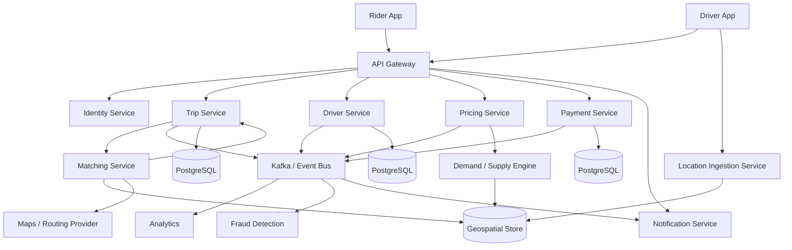
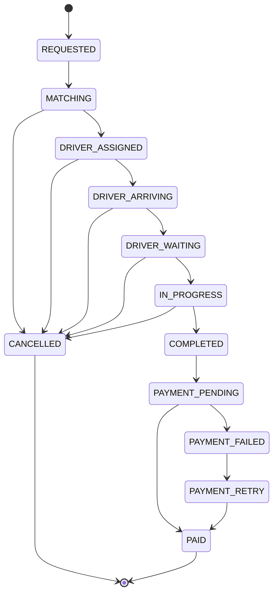
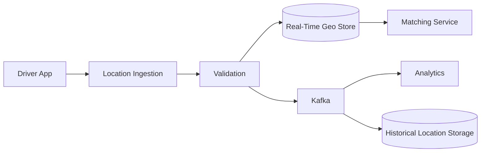
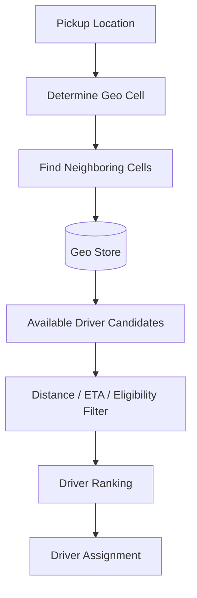
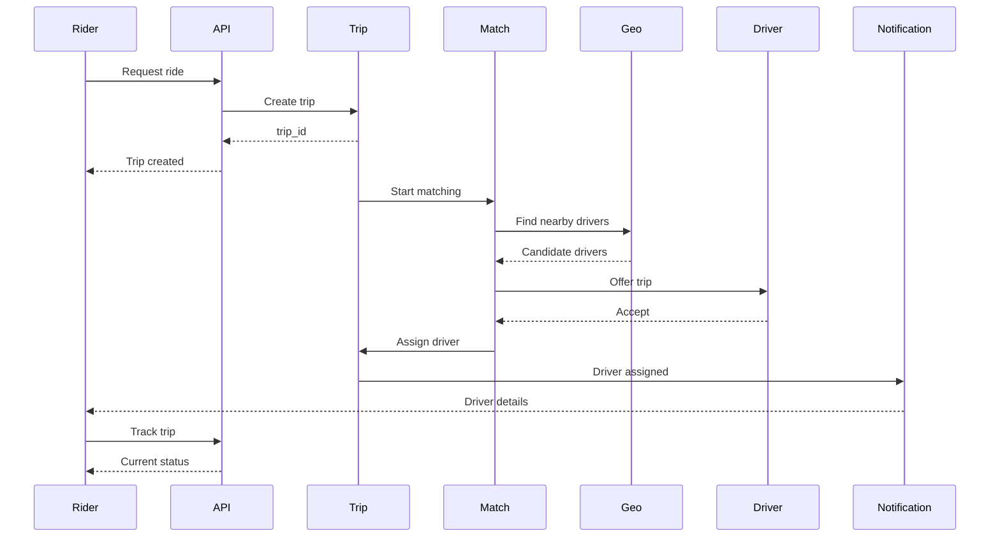
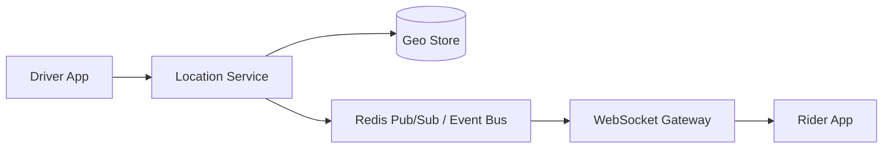
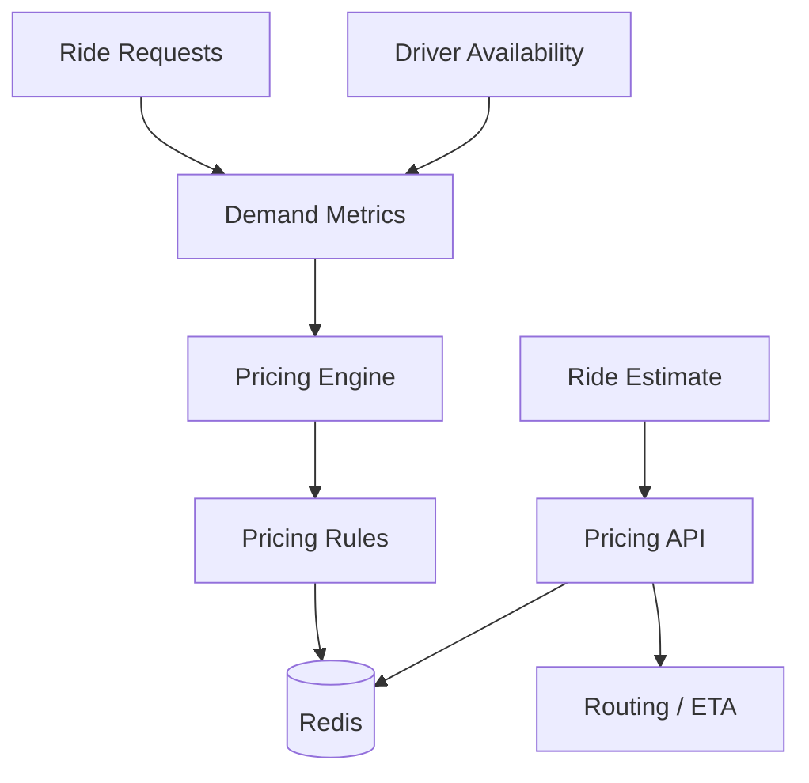
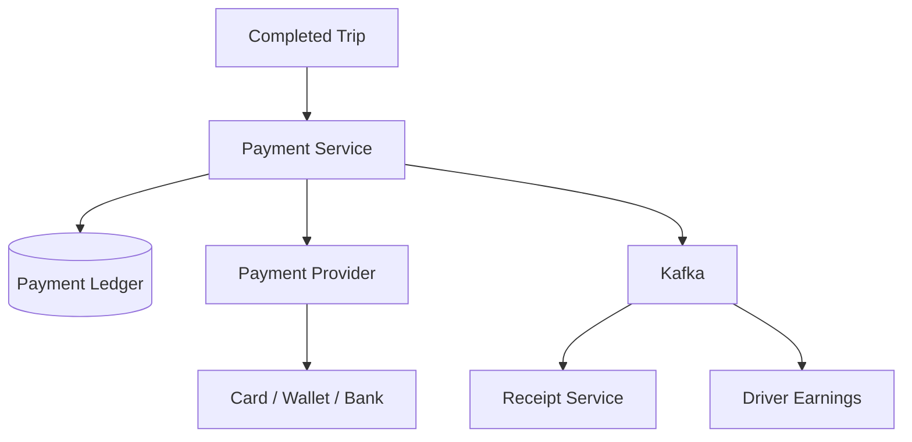
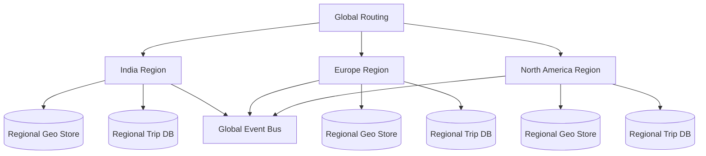
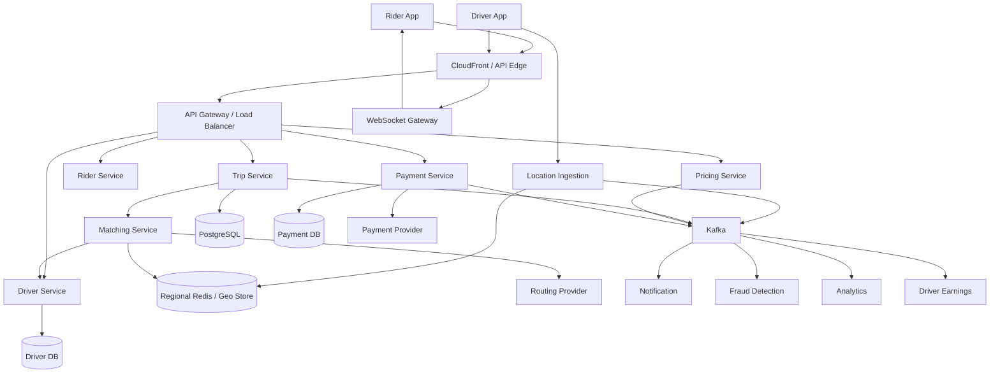

# 10- Uber

## Overview

Designing an Uber-like platform is fundamentally a **real-time distributed systems problem**.

Unlike conventional CRUD applications, the core workload is highly dynamic:

- Riders continuously request trips.
- Drivers continuously change location and availability.
- The system must match riders with suitable drivers.
- Location data changes every few seconds.
- Pricing may change with demand and supply.
- Trips transition through multiple states.
- Payments must be reliable and idempotent.
- Notifications must reach users with low latency.
- Maps and routing introduce external service dependencies.
- The system must operate across geographic regions.
- Peak demand can be highly localized.

The most important architectural characteristic is that Uber-like systems contain two fundamentally different workloads:

```text
Control Plane
    |
    +--> Users
    +--> Drivers
    +--> Trips
    +--> Payments
    +--> Pricing
    +--> Notifications
    +--> Ratings

Real-Time Location Plane
    |
    +--> Driver locations
    +--> Geospatial indexing
    +--> Driver availability
    +--> Matching
```

Location data should not be treated like ordinary relational CRUD data. It requires specialized storage, partitioning, expiration, and geospatial querying.

A simplified architecture is:



The key engineering challenge is to keep **real-time location and matching fast** while keeping **trip, payment, and financial data strongly consistent**.

## Requirements

### Functional Requirements

The system should support:

- Rider registration and authentication.
- Driver registration and onboarding.
- Driver availability.
- Driver location updates.
- Ride requests.
- Driver matching.
- Trip acceptance and rejection.
- Trip cancellation.
- Trip lifecycle management.
- Real-time driver tracking.
- Estimated arrival time.
- Route calculation.
- Fare estimation.
- Dynamic pricing.
- Payment processing.
- Receipts.
- Driver earnings.
- Ratings and reviews.
- Notifications.
- Trip history.
- Fraud detection.
- Driver incentives.

### Non-Functional Requirements

Typical targets might include:

| Requirement | Example Target |
|---|---:|
| API availability | 99.99%+ |
| Ride request p95 | < 300 ms excluding external routing |
| Driver location ingestion | < 1–5 seconds freshness |
| Matching latency | < 1–2 seconds |
| Payment correctness | Exactly-once business effect |
| Location scalability | Millions of updates/minute |
| Horizontal scalability | Required |
| Regional isolation | Required |
| Disaster recovery | Required |

These are illustrative targets. Production targets should be derived from business requirements and observed workloads.

## Scale Assumptions

Consider an illustrative global system:

```text
100 million registered riders
10 million registered drivers
10 million daily active riders
1 million active drivers during peak periods
100,000+ ride requests/sec globally during extreme peaks
Millions of location updates/minute
```

The exact numbers are less important than recognizing that the workload is **geographically distributed and highly bursty**.

A driver may send a location update every few seconds.

For example:

```text
1 million active drivers
1 location update / 3 seconds
```

Approximate location event rate:

```text
1,000,000 / 3
≈ 333,000 location updates/sec
```

This traffic should not be written directly into PostgreSQL.

The architecture needs a dedicated location ingestion and geospatial storage path.

## Core Architecture

A production architecture can be divided into these domains:

| Domain | Responsibility |
|---|---|
| Identity | Authentication and account identity |
| Rider | Rider profile and preferences |
| Driver | Driver profile, onboarding, and availability |
| Location | Driver location ingestion |
| Geospatial | Nearby-driver lookup |
| Trip | Trip lifecycle and state |
| Matching | Driver-rider assignment |
| Pricing | Fare and surge calculation |
| Routing | ETA and route calculation |
| Payment | Authorization, capture, refunds |
| Notification | Push, SMS, email |
| Rating | Rider and driver ratings |
| Fraud | Abuse and anomaly detection |
| Analytics | Operational and business analytics |

Service boundaries should follow domain ownership and scaling requirements rather than simply creating one service for every entity.

## Rider Request Flow

A rider typically performs:

```text
Open app
   |
   v
Request current location
   |
   v
Select destination
   |
   v
Get fare estimate
   |
   v
Confirm ride
   |
   v
Create trip
   |
   v
Find nearby drivers
   |
   v
Match driver
   |
   v
Driver accepts
   |
   v
Trip starts
   |
   v
Trip completes
   |
   v
Payment
   |
   v
Receipt
```

The ride request itself should be a durable state transition.

## Trip State Machine

A trip should be modeled explicitly as a state machine.



The actual state machine may vary by product, but explicit states prevent invalid transitions.

For example:

```text
COMPLETED -> DRIVER_ASSIGNED
```

should never be allowed.

## Trip State Transitions

Represent state transitions as guarded operations.

```python
ALLOWED_TRANSITIONS = {
    "REQUESTED": {"MATCHING", "CANCELLED"},
    "MATCHING": {"DRIVER_ASSIGNED", "CANCELLED"},
    "DRIVER_ASSIGNED": {"DRIVER_ARRIVING", "CANCELLED"},
    "DRIVER_ARRIVING": {"DRIVER_WAITING", "CANCELLED"},
    "DRIVER_WAITING": {"IN_PROGRESS", "CANCELLED"},
    "IN_PROGRESS": {"COMPLETED", "CANCELLED"},
    "COMPLETED": {"PAYMENT_PENDING"},
    "PAYMENT_PENDING": {"PAID", "PAYMENT_FAILED"},
    "PAYMENT_FAILED": {"PAYMENT_RETRY"},
    "PAYMENT_RETRY": {"PAID"},
}
```

A production implementation should also use database constraints, transactions, optimistic concurrency, or another mechanism to prevent concurrent requests from applying conflicting transitions.

## Data Model

A simplified relational model might include:

```text
riders
drivers
vehicles
trips
trip_events
payments
ratings
driver_documents
```

Example trip table:

```sql
CREATE TABLE trips (
    id UUID PRIMARY KEY,
    rider_id UUID NOT NULL,
    driver_id UUID,
    status VARCHAR(32) NOT NULL,
    pickup_latitude DOUBLE PRECISION NOT NULL,
    pickup_longitude DOUBLE PRECISION NOT NULL,
    destination_latitude DOUBLE PRECISION NOT NULL,
    destination_longitude DOUBLE PRECISION NOT NULL,
    estimated_fare NUMERIC(12, 2),
    final_fare NUMERIC(12, 2),
    requested_at TIMESTAMPTZ NOT NULL DEFAULT NOW(),
    accepted_at TIMESTAMPTZ,
    started_at TIMESTAMPTZ,
    completed_at TIMESTAMPTZ
);
```

For production systems, money should use an appropriate decimal representation and explicit currency handling.

## Trip Events

A trip history should not rely exclusively on the current trip row.

A useful event model is:

```text
trip.created
trip.matching_started
trip.driver_assigned
trip.driver_arrived
trip.started
trip.completed
trip.cancelled
payment.authorized
payment.captured
```

This enables:

- Auditing.
- Debugging.
- Analytics.
- State reconstruction.
- Event-driven processing.

Example event:

```json
{
  "event_id": "evt_8f23",
  "event_type": "trip.driver_assigned",
  "trip_id": "trip_123",
  "driver_id": "driver_456",
  "occurred_at": "2026-08-23T14:20:15Z",
  "version": 4
}
```

The event should include enough information for consumers to process it safely.

## Driver Availability

A driver can be represented as:

```text
OFFLINE
AVAILABLE
RESERVED
ON_TRIP
```

Availability is fundamentally different from driver profile data.

Profile data:

```text
name
license
vehicle
rating
documents
```

changes relatively infrequently.

Availability:

```text
available = true
```

can change every few seconds.

These workloads should therefore have different storage and scaling characteristics.

## Driver Location

Driver location is ephemeral.

The system primarily needs:

```text
driver_id
latitude
longitude
timestamp
availability
```

The latest location can be stored in a low-latency distributed store.

Possible technologies include:

- Redis with geospatial indexes.
- DynamoDB with appropriate geographic partitioning.
- Specialized geospatial databases.
- In-memory regional stores.

PostgreSQL/PostGIS can be excellent for many geospatial workloads, but at extreme global update rates, a dedicated real-time location path may be necessary.

## Location Ingestion

The driver application periodically sends:

```json
{
  "driver_id": "driver_123",
  "latitude": 22.5726,
  "longitude": 88.3639,
  "accuracy_meters": 8,
  "heading": 120,
  "speed_mps": 9.2,
  "timestamp": "2026-08-23T14:20:15Z"
}
```

The ingestion service should:

1. Authenticate the driver.
2. Validate the coordinates.
3. Validate timestamp freshness.
4. Reject impossible location jumps.
5. Update the latest location.
6. Publish relevant events asynchronously.

It should not synchronously perform expensive downstream processing for every update.

## Location Data Lifecycle



The latest location and historical location data have different retention requirements.

For example:

```text
Latest location:
TTL / overwrite

Historical telemetry:
Object storage / data lake
```

Do not retain every high-frequency location update forever in an expensive transactional database.

## Geospatial Search

Matching requires a query such as:

```text
Find available drivers within 3 km of pickup point.
```

This is not an ordinary SQL query.

A naive approach would be:

```sql
SELECT *
FROM drivers
WHERE available = TRUE;
```

followed by calculating distance for every driver.

At scale, this is unacceptable.

The system needs a spatial index.

## Geohashing

Geohashing converts latitude/longitude into a spatial cell.

Conceptually:

```text
World
 |
 +--> Region
       |
       +--> Cell
             |
             +--> Smaller Cell
```

Nearby coordinates tend to map to nearby cells.

A matching query can then search:

```text
Current cell
+
Adjacent cells
```

rather than scanning every driver.

## Geospatial Matching



The candidate set should be geographically constrained before expensive ranking.

## Matching Service

The matching service determines which driver should receive a ride request.

A simplified algorithm:

```text
1. Determine pickup coordinates.
2. Find nearby available drivers.
3. Filter stale locations.
4. Filter incompatible vehicle types.
5. Estimate ETA.
6. Rank candidates.
7. Reserve a driver.
8. Send offer.
9. Wait for acceptance.
10. Retry if rejected or timed out.
```

The key difficulty is that multiple riders may attempt to reserve the same driver simultaneously.

## Driver Reservation

Suppose:

```text
Rider A -> Driver X
Rider B -> Driver X
```

Both matching requests may observe:

```text
Driver X = AVAILABLE
```

Without atomic reservation:

```text
Rider A -> assigned
Rider B -> assigned
```

The same driver is now assigned to two trips.

The system therefore needs an atomic state transition:

```text
AVAILABLE
    |
    | compare-and-set
    v
RESERVED
```

Redis or a database with conditional updates can be used depending on the architecture.

## Atomic Reservation

Conceptually:

```text
SET driver:{id}:state RESERVED NX EX 15
```

The exact Redis command and data model should be designed carefully, but the principle is:

```text
Reserve only if currently available.
```

The reservation must expire if the driver does not accept.

## Matching Race Conditions

A robust design must handle:

```text
Two riders choose same driver
Driver goes offline during matching
Driver accepts another trip
Location becomes stale
Driver rejects offer
Rider cancels during matching
Network response is delayed
Matching service retries
```

Distributed locking alone does not solve all of these problems.

The authoritative trip/driver state transition should still be validated before assignment.

## Driver Ranking

The nearest driver is not necessarily the best driver.

Candidate ranking can consider:

- Estimated pickup time.
- Distance.
- Driver availability.
- Vehicle type.
- Driver preferences.
- Rider-selected service.
- Driver acceptance probability.
- Historical reliability.
- Cancellation probability.
- Geographic balancing.

A simplified score might be:

```text
score =
    w1 * ETA
  + w2 * distance
  + w3 * cancellation_risk
  + w4 * driver_utilization
```

The weights should be determined from product and operational requirements.

## ETA Calculation

Distance alone is insufficient.

Two drivers may be:

```text
Driver A: 1.5 km away
Driver B: 2.0 km away
```

but Driver B may have a much faster route.

The system should use routing data to estimate:

```text
travel time
traffic
road restrictions
turn penalties
```

External map providers may be used initially.

At large scale, route computation can become expensive, so the system may use:

- Cached route estimates.
- Approximate distance filters.
- Regional routing infrastructure.
- Batch route computation.
- Hierarchical matching.

## Matching Optimization

Do not call a routing provider for every driver candidate.

Instead:

```text
Geo search
   |
   v
100 candidates
   |
   v
Cheap distance filter
   |
   v
10 candidates
   |
   v
ETA calculation
   |
   v
Top 3 candidates
```

This dramatically reduces external API calls.

## Ride Request API

A simplified API might look like:

```http
POST /v1/trips
Content-Type: application/json
Authorization: Bearer <token>
Idempotency-Key: 8b5f6c1e-...
```

```json
{
  "pickup": {
    "latitude": 22.5726,
    "longitude": 88.3639
  },
  "destination": {
    "latitude": 22.5636,
    "longitude": 88.3516
  },
  "service_type": "standard"
}
```

The server should create a durable trip request before beginning asynchronous matching.

## Idempotency

Mobile networks are unreliable.

The rider may tap the button once while the request is sent twice:

```text
POST /trips
POST /trips
```

Without idempotency:

```text
Trip A
Trip B
```

The system should support an idempotency key:

```text
Idempotency-Key: abc123
```

The service can associate:

```text
abc123 -> trip_123
```

and return the original result for retries.

Idempotency is essential for:

- Ride creation.
- Payment operations.
- Cancellation.
- Driver acceptance.
- Refunds.

## Matching Flow



The exact notification path may use WebSockets, push notifications, or both.

## Real-Time Updates

During an active trip, the rider wants:

```text
Driver location
ETA
Trip status
```

Polling every second is inefficient.

Better options include:

- WebSockets.
- Server-Sent Events.
- Push notifications for coarse-grained events.
- Mobile-specific real-time channels.

A common architecture is:

```text
Driver App
    |
    v
Location Ingestion
    |
    v
Real-Time Store
    |
    v
WebSocket Gateway
    |
    v
Rider App
```

## WebSocket Architecture



At large scale, WebSocket connections should be distributed across multiple gateway instances.

The gateway should not own the source of truth for trip state.

## Connection Management

A WebSocket gateway may maintain:

```text
connection_id
user_id
trip_id
region
last_seen
```

Redis or another distributed mechanism can help route events to the correct gateway instance.

However, Redis Pub/Sub alone does not provide durable event delivery.

For critical events, use a durable event mechanism and treat WebSocket delivery as a real-time projection.

## Dynamic Pricing

Ride prices can change based on:

```text
Demand
Supply
Traffic
Time
Weather
Events
Airport congestion
Geographic zone
```

The central concept is:

```text
Demand / Supply Ratio
```

For example:

```text
zone = downtown
active ride requests = 900
available drivers = 300

demand / supply = 3.0
```

The pricing engine may increase the fare multiplier.

The actual algorithm must be constrained by business rules and regulatory requirements.

## Surge Zones

Divide geographic regions into cells:

```text
+-------+-------+-------+
|       |       |       |
|  A    |  B    |  C    |
|       |       |       |
+-------+-------+-------+
|       |       |       |
|  D    |  E    |  F    |
|       |       |       |
+-------+-------+-------+
```

For each cell, maintain:

```text
requests per minute
available drivers
active trips
average wait time
```

The pricing service can calculate zone-level demand pressure.

## Pricing Architecture



Pricing should have a deterministic calculation for a given pricing version.

For example:

```text
pricing_version = 42
zone = zone_123
service = standard
```

The resulting estimate can be audited later.

## Fare Estimation

A simplified fare may contain:

```text
base fare
+ distance charge
+ time charge
+ surge multiplier
+ tolls
+ fees
- discounts
```

Example:

```text
base = $2.00
distance = $8.00
time = $4.00
surge = 1.5x
fees = $2.00
```

Do not rely on floating-point arithmetic for monetary values.

Use decimal arithmetic or integer minor units.

For example:

```python
from decimal import Decimal

base = Decimal("2.00")
distance = Decimal("8.00")
time = Decimal("4.00")
fees = Decimal("2.00")
surge = Decimal("1.5")

subtotal = base + distance + time
total = subtotal * surge + fees
```

## Fare Estimate vs Final Fare

An estimate is not necessarily the final charge.

The final fare may depend on:

```text
Actual distance
Actual duration
Tolls
Waiting time
Cancellation policy
Promotions
Surge policy
```

Persist the pricing inputs used to calculate the final amount so that disputes can be investigated.

## Payment Architecture

Payment is a critical transactional domain.



The payment provider should not be the only source of truth.

Maintain an internal payment record or ledger for reconciliation.

## Payment States

```text
CREATED
AUTHORIZED
CAPTURE_PENDING
CAPTURED
FAILED
REFUND_PENDING
REFUNDED
```

Payment transitions must be idempotent.

If a provider sends:

```text
payment.captured
```

twice, the system must not credit the driver twice.

## Payment Webhooks

Payment providers commonly send asynchronous webhooks.

```text
Payment Provider
      |
      v
Webhook API
      |
      v
Validate Signature
      |
      v
Persist Event
      |
      v
Process Idempotently
```

Never trust a payment webhook without verifying its authenticity.

## Payment Ledger

For financial systems, a ledger is preferable to simply storing:

```text
trip.final_fare = 25.00
```

A ledger can record:

```text
Rider charge
Platform fee
Driver earnings
Tax
Promotion
Refund
Adjustment
```

This creates an auditable financial trail.

## Driver Earnings

After trip completion:

```text
Trip Fare
   |
   +--> Taxes / fees
   |
   +--> Platform commission
   |
   +--> Driver earnings
```

Earnings should be calculated deterministically and persisted.

Do not recalculate historical earnings using today's pricing configuration.

Persist the relevant:

```text
pricing_version
commission_version
tax_version
```

## Notifications

Important events include:

```text
driver_assigned
driver_arriving
driver_arrived
trip_started
trip_completed
payment_failed
receipt_created
```

Use asynchronous delivery:

```text
Trip Event
   |
   v
Kafka
   |
   v
Notification Service
   |
   +--> Push
   +--> SMS
   +--> Email
```

Notifications should be retryable and idempotent.

## Ratings

After completion:

```text
Rider -> Driver rating
Driver -> Rider rating
```

A rating record might contain:

```text
trip_id
rater_id
subject_id
rating
comment
created_at
```

Enforce one rating per rater per trip:

```sql
CREATE UNIQUE INDEX one_rating_per_trip_rater
ON ratings (trip_id, rater_id);
```

## Fraud Detection

Fraud scenarios include:

- Fake GPS.
- Account sharing.
- Payment fraud.
- Driver-rider collusion.
- Excessive cancellations.
- Synthetic accounts.
- Promotion abuse.
- Impossible travel speeds.

Events can flow into a fraud pipeline:

```text
Trips
Payments
Locations
Accounts
Promotions
   |
   v
Kafka
   |
   v
Fraud Detection
   |
   +--> Rules
   +--> ML Models
   |
   v
Risk Score
```

Fraud decisions should not unnecessarily block critical paths unless confidence is high.

## Security Considerations

### Authentication

Protect:

- Rider accounts.
- Driver accounts.
- Access tokens.
- Refresh tokens.
- Device credentials.

### Authorization

Drivers must only access trips assigned to them.

Riders must only access their own trip history.

Administrative operations require stronger authorization and auditing.

### Location Privacy

Location data is highly sensitive operational data.

Apply:

- Encryption in transit.
- Encryption at rest.
- Least-privilege access.
- Strict retention policies.
- Audit logging.
- Access controls.
- Data minimization.

Do not expose exact driver coordinates unnecessarily.

### API Security

Protect endpoints with:

- Authentication.
- Authorization.
- Rate limiting.
- Input validation.
- Idempotency.
- Request size limits.
- Abuse detection.

### Secrets

Do not store:

```text
payment keys
API tokens
database passwords
```

inside source code.

Use a managed secrets system.

## Scalability

### Horizontal Scaling

Services should scale independently:

```text
Location Service      -> many instances
Matching Service      -> many instances
Trip Service           -> many instances
Payment Service        -> moderate
Notification Service  -> many workers
```

The scaling characteristics differ significantly.

### Geographic Partitioning

A global system should partition traffic geographically:

```text
India
Europe
North America
Asia Pacific
```

A ride request should normally be processed in the region responsible for that geographic area.

This reduces:

- Network latency.
- Cross-region traffic.
- Matching complexity.
- Failure blast radius.

## Regional Architecture



The degree of regional independence depends on the product's requirements.

## Data Consistency

Different data has different consistency requirements.

| Data | Consistency Requirement |
|---|---|
| Driver profile | Moderate |
| Driver location | Eventual / latest-value |
| Driver availability | Strong coordination |
| Trip state | Strong |
| Payment state | Strong |
| Ratings | Moderate |
| Analytics | Eventual |
| Recommendations | Eventual |
| Notifications | At-least-once + idempotency |

Trying to make every subsystem strongly consistent increases latency and operational complexity.

## Caching

Redis can be useful for:

```text
Driver latest location
Driver availability
Active trip state projections
Fare estimates
Rate limiting
Session state
Hot configuration
```

Do not use Redis as the only source of truth for financial or critical transactional state unless the data-loss semantics are explicitly acceptable.

## Cache Invalidation

For short-lived location data:

```text
driver:{id}:location
TTL = 10–30 seconds
```

For longer-lived metadata:

```text
driver:{id}:profile
TTL = several minutes
```

The exact TTL should be determined by freshness requirements.

Stale driver locations are dangerous because matching decisions depend on them.

## Kafka and Event-Driven Architecture

Kafka can carry:

```text
driver.location.updated
driver.availability.changed
trip.created
trip.assigned
trip.started
trip.completed
trip.cancelled
payment.authorized
payment.captured
rating.created
```

Consumers may include:

```text
Analytics
Fraud
Notifications
Driver Earnings
Recommendations
Operations
```

High-frequency location events may require special treatment.

Publishing every location update to every consumer can be unnecessarily expensive.

Possible strategies include:

- Sampling.
- Aggregation.
- Regional topics.
- Separate hot-path and analytics streams.
- Time-windowed aggregation.

## Service-to-Service Communication

Public client APIs can use REST.

Internal low-latency calls can use gRPC:

```text
Matching
   |
   +--> Driver Service
   |
   +--> Pricing
   |
   +--> Routing
```

Asynchronous workflows should use Kafka or another durable messaging system.

A useful rule is:

```text
Synchronous request/response -> REST / gRPC

Asynchronous event propagation -> Kafka

Real-time client updates -> WebSocket / push
```

## Failure Isolation

### Matching Failure

The rider should see:

```text
Matching in progress
```

rather than creating an invalid trip.

### Pricing Failure

Use a previously calculated estimate only if the business permits it; otherwise reject pricing explicitly rather than silently charging an incorrect amount.

### Maps Failure

Use cached or approximate estimates where safe.

### Payment Failure

Keep the trip completed but mark:

```text
PAYMENT_FAILED
```

and retry or recover asynchronously.

### Notification Failure

The trip itself should continue.

### Location Failure

A stale driver location should cause the driver to be removed from matching candidates.

## Stale Location Handling

Suppose:

```text
Driver last update = 90 seconds ago
```

The driver should not be treated as currently available simply because:

```text
available = true
```

Matching should consider:

```text
available = true
AND
location_timestamp > now - freshness_window
```

This is a critical production detail.

## Backpressure

A traffic spike can produce:

```text
Ride requests
     |
     v
Matching queue
     |
     v
Workers
```

If demand exceeds matching capacity:

- Queue work.
- Apply admission control.
- Scale workers.
- Prioritize requests.
- Protect databases.
- Avoid retry storms.

Unbounded retries can turn a partial outage into a complete outage.

## Retry Strategy

Retries should use:

```text
Exponential backoff
+
Jitter
+
Maximum attempts
+
Dead-letter handling
```

Do not retry every failure.

For example:

```text
HTTP 500 -> potentially retry
HTTP 429 -> retry after server guidance
HTTP 400 -> do not retry
Invalid authentication -> do not retry
```

## Observability

### Ride Metrics

```text
ride_request_rate
matching_success_rate
matching_latency
driver_acceptance_rate
driver_cancellation_rate
rider_cancellation_rate
average_pickup_time
trip_completion_rate
```

### Location Metrics

```text
location_updates_per_second
stale_location_rate
location_processing_latency
geo_store_latency
```

### Matching Metrics

```text
candidate_count
matching_latency
assignment_success_rate
reservation_conflict_rate
driver_offer_timeout_rate
```

### Pricing Metrics

```text
estimate_latency
surge_multiplier
pricing_error_rate
```

### Payment Metrics

```text
authorization_success_rate
capture_success_rate
payment_failure_rate
refund_failure_rate
reconciliation_gap
```

## Distributed Tracing

A ride can cross many services:

```text
API Gateway
    |
    v
Trip Service
    |
    +--> Pricing
    |
    +--> Matching
            |
            +--> Geo Store
            +--> Driver Service
            +--> Routing
    |
    +--> Notification
```

Trace propagation should allow engineers to correlate:

```text
trace_id
trip_id
driver_id
rider_id
event_id
payment_id
```

This is essential when debugging race conditions and delayed state transitions.

## Disaster Recovery

Separate critical and derived data.

### Critical

```text
Accounts
Trips
Payments
Driver profiles
Entitlements
Financial ledger
```

### Rebuildable

```text
Caches
Search indexes
Recommendation features
Analytics aggregates
Real-time projections
```

For critical data:

```text
Primary DB
   |
   +--> Replication
   +--> Backups
   +--> Point-in-time recovery
```

Define:

```text
RPO
RTO
```

for each major data domain.

## Multi-Region Failure

A regional outage should ideally not affect unrelated regions.

For example:

```text
India Region X
      |
      X

Europe Region
      |
      v
Still operating
```

Regional partitioning reduces the blast radius.

However, cross-region dependencies such as:

```text
global identity
global payments
global configuration
```

must also be designed for failure.

## Cost Considerations

Major cost drivers include:

- Location ingestion.
- Geospatial infrastructure.
- Kafka.
- Databases.
- Maps/routing APIs.
- Push/SMS providers.
- Payment processing.
- Cross-region networking.
- Observability.
- Real-time infrastructure.

Maps APIs can become particularly expensive because naive matching implementations may call routing services for too many candidates.

A major optimization is:

```text
Geo filter
    |
    v
Cheap distance calculation
    |
    v
Small candidate set
    |
    v
Expensive ETA calculation
```

## Capacity Planning

Assume:

```text
1 million active drivers
1 update every 3 seconds
```

Location traffic:

```text
~333,000 updates/sec
```

If each update is approximately:

```text
500 bytes
```

raw application payload volume is approximately:

```text
333,000 × 500
≈ 166 MB/sec
```

This excludes protocol overhead, replication, serialization, storage, and downstream processing.

The important point is that location traffic can become a substantial distributed-systems workload independently of ride requests.

## Hotspot Problem

Geographic traffic is not uniformly distributed.

During a major event:

```text
City Center
   |
   +--> Massive ride demand
   +--> Massive driver movement
```

A single geographic partition can become a hotspot.

Mitigation strategies include:

- Smaller geographic cells.
- Dynamic partitioning.
- Regional worker pools.
- Load-aware routing.
- Partition replication.
- Independent scaling for high-demand zones.

## Common Mistakes and Pitfalls

### Writing Every Location Update to PostgreSQL

This creates unnecessary write pressure and storage growth.

Use a real-time geospatial store for the latest location and asynchronously archive historical telemetry.

### Selecting the Nearest Driver Only

Distance is not equivalent to ETA.

Traffic, road topology, direction, and vehicle constraints matter.

### Calling Maps APIs for Every Driver

This can create enormous latency and cost.

Use cheap geographic filtering before expensive routing calculations.

### Not Handling Driver Reservation Races

Two riders can attempt to assign the same driver simultaneously.

Use atomic reservation and authoritative state validation.

### Treating Location as Strongly Consistent Data

A few seconds of location staleness can be acceptable in many cases.

Do not introduce expensive strong consistency where latest-value semantics are sufficient.

### Using Redis as the Source of Truth for Trips

Redis is excellent for hot state but should not replace durable transactional storage for critical trip data unless the loss semantics are explicitly acceptable.

### Creating Trips Without Idempotency

Mobile retries can create duplicate rides.

Use idempotency keys.

### Charging Payments Without Idempotency

Payment retries can cause duplicate charges.

Use idempotent payment operations and reconcile against the payment provider.

### Making Notifications Synchronous

A push notification outage should never prevent a trip from completing.

Use asynchronous event processing.

### Ignoring Stale Drivers

A driver marked available may have lost connectivity.

Use location freshness as part of matching eligibility.

### Overusing Microservices

Splitting:

```text
Trip
Trip Status
Trip History
Trip Cancellation
Trip Assignment
```

into separate services can create unnecessary network calls and distributed transactions.

Use meaningful domain boundaries.

### Using One Global Matching Service

Global matching creates unnecessary latency and increases blast radius.

Matching should usually be geographically partitioned.

### Ignoring Event Ordering

Trip events may arrive out of order.

Consumers should use:

```text
event version
sequence number
event timestamp
```

where appropriate.

Do not assume network arrival order equals business order.

## Django and FastAPI

Django is well suited for:

- Rider and driver management.
- Administrative interfaces.
- Account management.
- Transactional APIs.
- Back-office workflows.
- PostgreSQL-backed domain services.

FastAPI can be useful for:

- High-throughput APIs.
- Location ingestion.
- Matching APIs.
- Pricing services.
- Lightweight internal services.

Neither framework solves the distributed coordination problem by itself.

The architecture matters more than framework selection.

## Python Location Ingestion

A simplified FastAPI endpoint might look like:

```python
from datetime import datetime, timezone

from fastapi import FastAPI, HTTPException
from pydantic import BaseModel, Field

app = FastAPI()


class LocationUpdate(BaseModel):
    latitude: float = Field(ge=-90, le=90)
    longitude: float = Field(ge=-180, le=180)
    timestamp: datetime


@app.post("/v1/drivers/{driver_id}/location", status_code=202)
async def update_location(driver_id: str, update: LocationUpdate) -> dict:
    now = datetime.now(timezone.utc)

    if update.timestamp < now.replace(microsecond=0):
        age_seconds = (now - update.timestamp).total_seconds()

        if age_seconds > 30:
            raise HTTPException(
                status_code=409,
                detail="Location update is stale",
            )

    # Production implementation:
    # - authenticate driver
    # - update regional geo store
    # - publish event asynchronously
    # - avoid blocking on analytics consumers

    return {
        "driver_id": driver_id,
        "accepted": True,
    }
```

The endpoint should return quickly and avoid performing expensive matching, analytics, or routing work inline.

## AWS Architecture

A cloud deployment could use:

| Requirement | AWS Technology |
|---|---|
| DNS | Route 53 |
| API edge | CloudFront / API Gateway |
| Load balancing | Application Load Balancer |
| Application compute | ECS / EKS |
| Transactional DB | Aurora PostgreSQL |
| Cache | ElastiCache Redis |
| Object storage | S3 |
| Event streaming | Amazon MSK / Kafka |
| Secrets | Secrets Manager |
| Encryption | KMS |
| Metrics | CloudWatch |
| Tracing | OpenTelemetry / X-Ray-compatible tooling |
| Analytics | S3 + analytics services |
| Notifications | SNS / third-party providers |

The exact services depend on operational requirements and team expertise.

## Reference Architecture



## Interview Questions

### How would you design Uber?

Start with:

```text
Trip management
+
Driver location
+
Geospatial search
+
Matching
+
Pricing
+
Payment
+
Real-time updates
```

Then identify which components require strong consistency and which can use eventual consistency.

### How would you find nearby drivers?

Use a geospatial index such as Redis GEO, PostGIS, or another spatial data store.

Search the pickup cell and neighboring cells, then filter and rank candidates.

### How would you prevent two riders from getting the same driver?

Use atomic driver reservation and validate the authoritative driver/trip state before assignment.

### Why not store all driver locations in PostgreSQL?

Location updates are high-frequency, ephemeral, and geographically distributed. A dedicated real-time location path scales better.

### How would you handle millions of location updates?

Use horizontally scalable ingestion, regional partitioning, an in-memory/geospatial store for latest state, and asynchronous streaming for historical analytics.

### How would you calculate ETA?

First perform inexpensive geographic filtering, then calculate ETA for a small candidate set using routing data.

### How would you prevent duplicate ride requests?

Use client-provided idempotency keys and persist the mapping between the key and the created trip.

### How would you handle driver location becoming stale?

Set a freshness threshold and remove stale drivers from matching eligibility.

### How would you implement surge pricing?

Partition geographic areas into cells and continuously calculate demand/supply metrics. Pricing should produce a versioned and auditable result.

### How would you design payment processing?

Use an internal payment state machine and ledger, integrate with an external payment provider, process webhooks idempotently, and reconcile provider state.

### How would you support real-time driver tracking?

Use location ingestion plus a real-time gateway such as WebSockets. Keep the authoritative state outside the WebSocket connection itself.

### How would you handle a city-wide demand spike?

Scale by geographic partition, increase matching capacity for hot zones, protect downstream dependencies with backpressure, and avoid expensive routing calls for every candidate.

### What data should be strongly consistent?

At minimum:

```text
Trip state
Driver assignment
Payment state
Financial ledger
```

Location, analytics, recommendations, and many derived views can tolerate eventual consistency.

### How would you design for regional failure?

Partition traffic geographically, isolate regional data and compute, replicate critical data according to RPO/RTO requirements, and minimize synchronous cross-region dependencies.

### What happens if the payment provider is unavailable?

Do not lose the completed trip. Record the payment as pending or failed according to the business state machine and retry asynchronously.

### What happens if the notification service fails?

The trip continues. Notifications are retried asynchronously.

### Why use Kafka?

Kafka decouples high-volume event producers from independent consumers such as analytics, fraud, notifications, and driver earnings.

### Why use gRPC?

gRPC is useful for low-latency internal service communication with strong contracts, while REST remains practical for public APIs.

### What are the hardest problems in this system?

The major challenges are:

- Real-time location ingestion.
- Geospatial indexing.
- Distributed driver reservation.
- Matching under race conditions.
- Dynamic pricing.
- Real-time updates.
- Payment correctness.
- Geographic partitioning.
- Hotspot management.
- Failure isolation.

## Key Takeaways

- **Separate high-frequency location workloads from durable transactional data: use regional geospatial stores for current driver state and PostgreSQL for trips, payments, and other critical records.**
- **Driver matching is a distributed coordination problem: combine geospatial filtering, ETA-aware ranking, atomic reservation, stale-location detection, and authoritative state validation.**
- **Treat trip and payment state machines as strongly consistent domains while allowing location, analytics, recommendations, and derived data to use eventual consistency.**
- **Partition the system geographically to reduce latency and blast radius, and scale hot zones independently during localized demand spikes.**
- **Use Kafka for asynchronous domain events, WebSockets for real-time client projections, and idempotency throughout ride creation, assignment, payment, and event processing.**