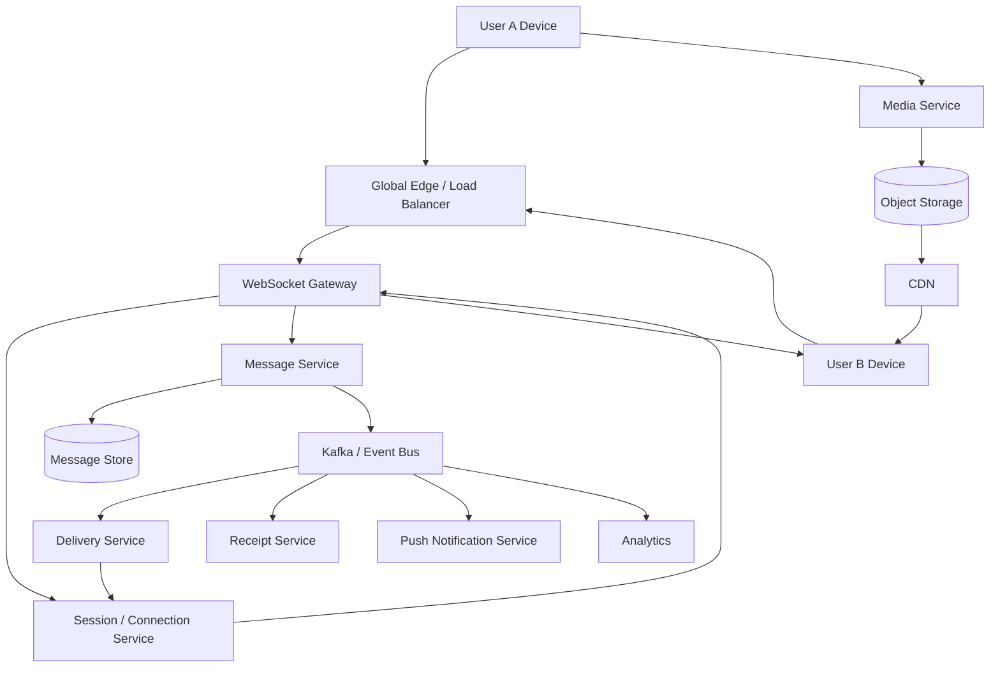
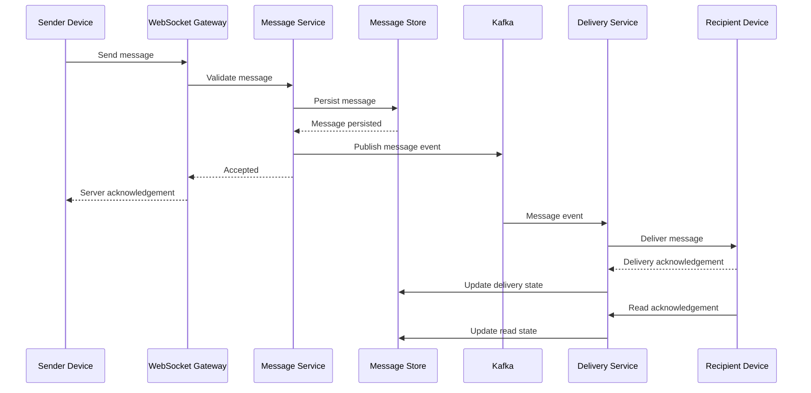
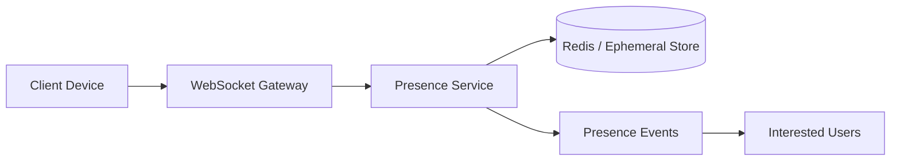
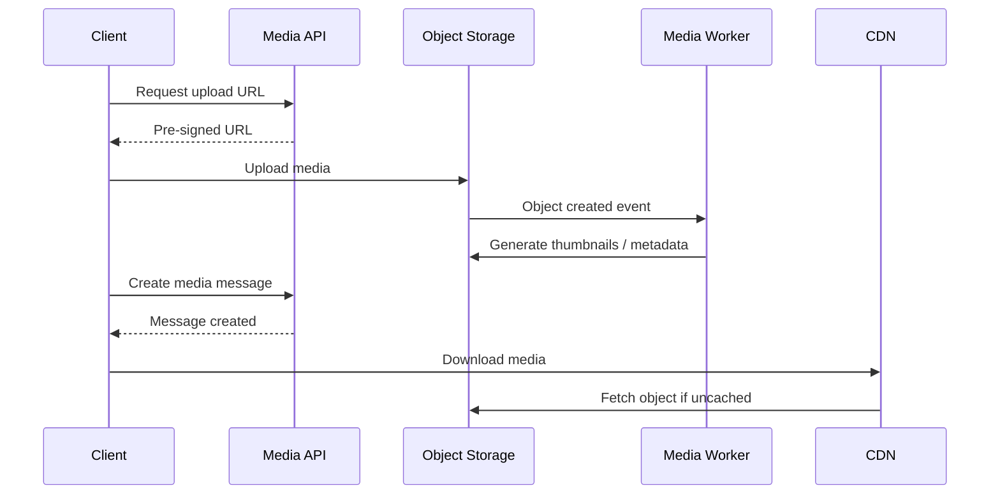
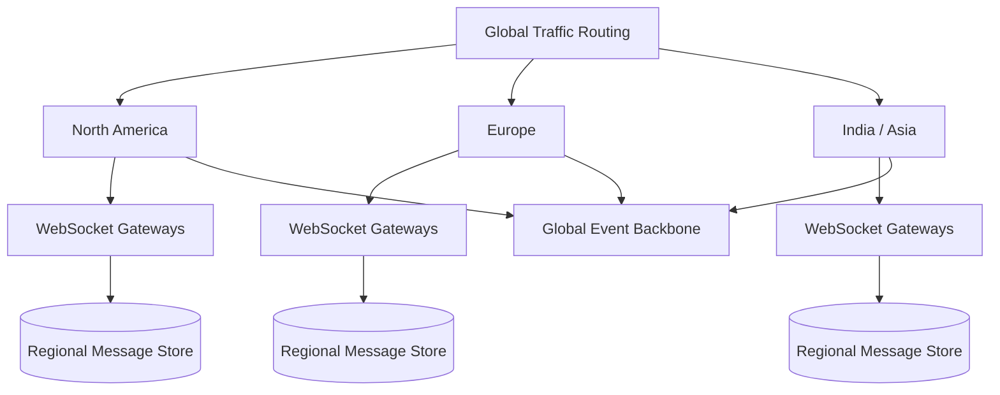

# 11- WhatsApp

## Overview

Designing a WhatsApp-like system is a distributed messaging problem centered around **low-latency delivery, durable message storage, connection management, ordering, presence, offline delivery, and multi-device synchronization**.

The core challenge is not simply sending a message from one user to another. A production messaging platform must handle:

- Millions of concurrent WebSocket connections.
- High message throughput.
- Users frequently going offline.
- Messages that must survive temporary outages.
- Multiple devices per user.
- Conversation history.
- Message ordering.
- Delivery and read receipts.
- Presence and typing indicators.
- Media uploads and downloads.
- Push notifications.
- Group conversations.
- Abuse prevention.
- End-to-end encryption.
- Regional failures and network partitions.

A useful architectural separation is:

```text
Messaging Plane
    |
    +--> Message ingestion
    +--> Message routing
    +--> Message persistence
    +--> Delivery
    +--> Acknowledgements

Real-Time Connection Plane
    |
    +--> WebSocket connections
    +--> Presence
    +--> Typing indicators
    +--> Online delivery

Media Plane
    |
    +--> Upload
    +--> Object storage
    +--> CDN
    +--> Thumbnail generation

Control Plane
    |
    +--> Identity
    +--> Contacts
    +--> Devices
    +--> Conversations
    +--> Settings
```

The most important architectural principle is:

> **Do not make the user's WebSocket connection the source of truth for messages.**

A WebSocket is a delivery channel. The durable message store and message-processing pipeline determine whether a message exists and what its state is.

A simplified architecture is:



## Requirements

### Functional Requirements

The system should support:

- User registration and authentication.
- One-to-one conversations.
- Group conversations.
- Sending text messages.
- Receiving messages in real time.
- Offline message delivery.
- Message history.
- Delivery receipts.
- Read receipts.
- Typing indicators.
- Online/offline presence.
- Last-seen information.
- Push notifications.
- Media messages.
- Multiple devices per user.
- Message deletion.
- Message retry.
- Message search.
- Blocking and reporting.
- Conversation synchronization.

Optional advanced capabilities include:

- Voice calls.
- Video calls.
- Stories/status.
- Communities.
- Broadcast lists.
- Reactions.
- Message editing.
- Disappearing messages.
- End-to-end encrypted backups.

### Non-Functional Requirements

Illustrative targets:

| Requirement | Example Target |
|---|---:|
| Message send API p95 | < 200 ms |
| Online delivery | < 1 second under normal conditions |
| WebSocket availability | 99.99%+ |
| Message durability | Very high |
| Concurrent connections | Millions+ |
| Message ordering | Per conversation |
| Horizontal scalability | Required |
| Regional isolation | Required |
| Offline delivery | Required |
| Duplicate business effects | Prevented through idempotency |

The exact targets depend on the product's scale and business requirements.

## Scale Assumptions

Consider an illustrative global deployment:

```text
2 billion registered users
500 million daily active users
100 million concurrently connected devices
100 billion messages/day
```

Average message rate:

```text
100,000,000,000 / 86,400
≈ 1.16 million messages/sec
```

Peak traffic could be several times higher than the average.

This means the architecture cannot rely on:

```text
One application server
One PostgreSQL database
One WebSocket server
One global queue
```

The system must be horizontally scalable and geographically partitioned.

## Core Architecture

The system can be divided into the following services:

| Service | Responsibility |
|---|---|
| Identity Service | Authentication and account identity |
| User Service | Profile and account metadata |
| Device Service | Device registration and encryption metadata |
| Conversation Service | Chats and group membership |
| Message Service | Message ingestion and persistence |
| Delivery Service | Message routing and delivery |
| Connection Service | WebSocket connection tracking |
| Presence Service | Online/offline state |
| Receipt Service | Delivered/read state |
| Notification Service | Push notifications |
| Media Service | Media metadata and upload coordination |
| Search Service | Message search where supported |
| Abuse/Fraud Service | Spam and abuse detection |
| Key Service | Cryptographic key management |
| Sync Service | Multi-device synchronization |

These do not necessarily need to be separate deployable services from day one.

Service boundaries should follow ownership, scaling characteristics, and failure isolation.

## Message Lifecycle

A message should move through a durable lifecycle:

```text
User types message
      |
      v
Client generates message_id
      |
      v
WebSocket / Message API
      |
      v
Authenticate + validate
      |
      v
Persist message
      |
      v
Publish message event
      |
      v
Determine recipient devices
      |
      v
Deliver to connected devices
      |
      v
Wait for acknowledgement
      |
      v
Mark delivered
      |
      v
Recipient opens conversation
      |
      v
Read acknowledgement
      |
      v
Mark read
```

A simplified sequence is:



The important ordering is:

```text
Persist before acknowledging durable acceptance.
```

Otherwise the server can tell the sender that a message was accepted and then lose it.

## Message Identity

Every message should have a globally unique identifier.

For example:

```json
{
  "message_id": "01J9F7X6K8D9...",
  "conversation_id": "conv_123",
  "sender_id": "user_456",
  "client_sequence": 183,
  "created_at": "2026-08-23T15:20:00Z",
  "type": "text",
  "body": "Hello"
}
```

The `message_id` should be generated client-side or at ingestion and remain stable across retries.

This allows:

```text
Client sends message
        |
        X network timeout
        |
Client retries same message_id
```

The server can recognize that the message already exists.

## Idempotency

Mobile networks frequently produce:

- Request retries.
- Connection reconnects.
- Duplicate TCP/application deliveries.
- Delayed acknowledgements.
- Duplicate WebSocket frames.

Without idempotency:

```text
message_id = abc123

Request 1 -> insert message
Request 2 -> insert message again
```

The user sees duplicate messages.

Enforce uniqueness:

```sql
CREATE UNIQUE INDEX messages_message_id_unique
ON messages (message_id);
```

The application should return the existing message when a duplicate request arrives.

## Message Storage

A traditional relational model might look like:

```sql
CREATE TABLE messages (
    message_id UUID PRIMARY KEY,
    conversation_id UUID NOT NULL,
    sender_id UUID NOT NULL,
    sequence_number BIGINT NOT NULL,
    message_type VARCHAR(32) NOT NULL,
    ciphertext BYTEA NOT NULL,
    created_at TIMESTAMPTZ NOT NULL,
    expires_at TIMESTAMPTZ
);
```

A unique conversation sequence can be useful for ordering:

```sql
CREATE UNIQUE INDEX conversation_sequence_unique
ON messages (conversation_id, sequence_number);
```

At very large scale, a distributed database may be more appropriate than a single PostgreSQL cluster.

Possible technologies include:

- Cassandra-compatible databases.
- DynamoDB.
- ScyllaDB.
- Distributed SQL databases.
- Sharded PostgreSQL.

The correct choice depends on access patterns and consistency requirements.

## Access Pattern First

The dominant query is usually:

```text
Give me the latest messages for conversation X.
```

Therefore the primary partitioning key should support:

```text
conversation_id
```

For example:

```text
Partition:
conversation_id

Sort:
sequence_number
```

This makes:

```text
SELECT latest N messages
```

efficient.

Do not design the database around:

```text
Find every message sent by every user
```

if that is not a primary operational access pattern.

## Message Partitioning

A common distributed storage model is:

```text
conversation_id
        |
        v
Partition
        |
        +--> message 100
        +--> message 101
        +--> message 102
        +--> message 103
```

However, very large group conversations can become hot partitions.

A production system may need:

- Conversation sharding.
- Time-based buckets.
- Message sequence ranges.
- Adaptive partitioning.

## Hot Conversation Problem

Consider a huge group:

```text
10 million members
```

If every message is written to one physical partition, that partition becomes a bottleneck.

Potential solutions include:

```text
conversation_id + time_bucket
```

or:

```text
conversation_id + shard_id
```

The system must preserve logical ordering even if physical storage is distributed.

## Message Ordering

Ordering is one of the most common interview traps.

Suppose:

```text
User A sends:

M1 = "Hello"
M2 = "How are you?"
```

Network conditions can cause:

```text
M2 arrives before M1
```

Therefore server arrival order is not necessarily client creation order.

### Required Ordering

A practical guarantee is usually:

> Messages are ordered within a conversation.

Global ordering across the entire system is unnecessary and extremely expensive.

### Sequence Numbers

The system can assign:

```text
conversation sequence:

1001
1002
1003
1004
```

The recipient can detect gaps:

```text
1001
1002
1004

Missing:
1003
```

and request synchronization.

## Sequence Number Generation

A naive centralized counter creates a bottleneck.

Possible approaches include:

- Database sequence.
- Per-conversation transactional counter.
- Partition-local sequencing.
- Logical timestamps.
- Hybrid logical clocks.

The design must balance:

```text
Ordering guarantees
+
Throughput
+
Availability
+
Cross-region latency
```

## Multi-Device Support

Modern messaging systems cannot assume:

```text
One user = one device
```

A user may have:

```text
Phone
Laptop
Tablet
Web browser
```

Therefore the delivery target is:

```text
User
 |
 +--> Device A
 +--> Device B
 +--> Device C
```

Each device needs its own:

```text
device_id
connection_id
last_sync_position
push token
encryption state
```

## Device Synchronization

Suppose the user sends a message from:

```text
Phone
```

The message may need to synchronize to:

```text
Laptop
Tablet
Web
```

A useful model is:

```text
Message Event
     |
     +--> Device A
     +--> Device B
     +--> Device C
```

Each device maintains a synchronization cursor.

Example:

```text
device_A last_sequence = 1000
device_B last_sequence = 995
device_C last_sequence = 1000
```

Device B needs:

```text
996 ... 1000
```

## Synchronization API

A conceptual API:

```http
GET /v1/conversations/{conversation_id}/messages?after=995&limit=100
```

Response:

```json
{
  "messages": [
    {
      "message_id": "m996",
      "sequence": 996
    },
    {
      "message_id": "m997",
      "sequence": 997
    }
  ],
  "next_cursor": "997",
  "has_more": true
}
```

Cursor-based pagination is preferable to offset pagination for large message histories.

## Offline Delivery

If the recipient is offline:

```text
Sender
  |
  v
Message Store
  |
  v
Recipient Offline
```

The message remains durable.

When the recipient reconnects:

```text
Reconnect
   |
   v
Authenticate
   |
   v
Send sync cursor
   |
   v
Fetch missing messages
   |
   v
Deliver
   |
   v
Acknowledge
```

The system should not require the message producer to remain connected.

## Delivery Semantics

A messaging system commonly provides:

```text
At-least-once delivery
+
Idempotent processing
```

rather than attempting true end-to-end exactly-once delivery.

Why?

Because distributed systems can encounter:

```text
network timeout
consumer crash
connection loss
ack lost
retry
```

Suppose:

```text
Server -> Client: message
Client receives message
Client sends ACK
Network drops
Server does not receive ACK
Server retries message
```

The client may see the message twice unless the client deduplicates by `message_id`.

Therefore:

```text
At-least-once transport
+
message_id deduplication
```

is a practical design.

## Delivery Receipts

A message may have states:

```text
SENT
DELIVERED
READ
```

Example:

```text
Sender
  |
  | message
  v
Server
  |
  | delivered
  v
Recipient Device
  |
  | read
  v
Server
  |
  v
Sender
```

These are application-level states, not merely TCP delivery states.

## Receipt Storage

A naive schema:

```text
message_id
user_id
status
```

can become expensive for large groups.

For one-to-one conversations, this is straightforward.

For groups with thousands or millions of participants, storing every receipt can become enormous.

Possible strategies include:

- Per-device acknowledgement.
- Per-user acknowledgement.
- Conversation read cursor.
- Compact receipt aggregation.
- Store only meaningful state transitions.

## Read Cursor

Instead of recording:

```text
user X read message 100
user X read message 101
user X read message 102
```

store:

```text
conversation_id
user_id
last_read_sequence = 102
```

Then:

```text
messages <= 102
```

are considered read for that user.

This is significantly more efficient.

## Presence

Presence represents:

```text
online
offline
last_seen
```

Presence is inherently ephemeral.

A user may be:

```text
online
```

for a few seconds and then disappear due to network failure.

Do not treat presence as strongly consistent transactional state.

## Heartbeats

A WebSocket connection can send periodic heartbeats:

```text
Client -> Server: ping
Server -> Client: pong
```

or application-level heartbeats.

The presence service can maintain:

```text
user_id
device_id
last_heartbeat
region
gateway_id
```

If:

```text
now - last_heartbeat > timeout
```

the device can be considered offline.

## Presence Architecture



Presence should not be broadcast globally.

If one user has 10,000 contacts, sending every presence change to every contact can create unnecessary traffic.

Use subscription rules and fanout controls.

## Typing Indicators

Typing indicators are ephemeral and should generally not be persisted.

Example:

```json
{
  "type": "typing.started",
  "conversation_id": "conv_123",
  "user_id": "user_456"
}
```

The event can expire automatically.

A practical flow is:

```text
User starts typing
      |
      v
Typing event
      |
      v
WebSocket gateway
      |
      v
Recipient devices
```

Do not write every keystroke to a database.

## WebSocket Architecture

WebSocket gateways manage large numbers of long-lived connections.

A gateway may maintain:

```text
connection_id
user_id
device_id
region
last_heartbeat
subscriptions
```

But the gateway should remain stateless from the application's perspective.

If a gateway crashes:

```text
Client reconnects
   |
   v
New gateway
   |
   v
Sync missing messages
```

The durable message store makes recovery possible.

## Connection Routing

Suppose:

```text
User B's device
```

is connected to:

```text
Gateway 27
```

but the message arrives at:

```text
Gateway 4
```

Gateway 4 needs to know where User B is connected.

A distributed connection registry can maintain:

```text
user_id
device_id
gateway_id
connection_id
```

For example:

```text
user_123
   |
   +--> device_phone -> gateway_27
   +--> device_laptop -> gateway_18
```

## WebSocket Gateway Scaling

A single gateway should not become responsible for all users.

Use:

```text
Load Balancer
     |
     +--> Gateway 1
     +--> Gateway 2
     +--> Gateway 3
     +--> Gateway N
```

Each gateway maintains only its local socket connections.

Cross-gateway communication can use:

- Redis Pub/Sub for ephemeral delivery.
- Kafka for durable events.
- NATS or another messaging system.
- Internal routing services.

The choice depends on delivery guarantees.

## Push Notifications

If the recipient is offline:

```text
Message Service
     |
     v
Delivery Service
     |
     v
Recipient offline
     |
     v
Push Notification Service
     |
     +--> Apple Push Notification service
     +--> Firebase Cloud Messaging
```

The push notification should generally contain minimal sensitive content.

The device can then synchronize the actual message securely.

## Push vs WebSocket

| Requirement | WebSocket | Push Notification |
|---|---|---|
| Online message delivery | Excellent | Not primary |
| Offline wake-up | Poor | Excellent |
| Low latency | Excellent | Variable |
| Persistent connection | Yes | No |
| Background delivery | Limited by platform | Excellent |
| Message source of truth | No | No |

Use both.

## Media Architecture

Large media should not flow through application servers.

Instead:

```text
Client
  |
  | request upload URL
  v
Media Service
  |
  v
Pre-signed URL
  |
  v
Object Storage
```

The client uploads directly to object storage.

Example:



This avoids using API servers as file transfer proxies.

## Media Metadata

A message can contain:

```json
{
  "message_id": "m123",
  "type": "image",
  "media": {
    "object_key": "media/2026/08/23/abc.jpg",
    "mime_type": "image/jpeg",
    "size_bytes": 245678,
    "width": 1920,
    "height": 1080,
    "checksum": "..."
  }
}
```

Store media itself in object storage rather than PostgreSQL.

## CDN

Media downloads should use a CDN:

```text
User
 |
 v
CDN
 |
 +--> Cache hit -> return
 |
 +--> Cache miss
        |
        v
     Object Store
```

Benefits include:

- Lower latency.
- Lower origin bandwidth.
- Reduced application load.
- Better global distribution.

## Encryption

A production messaging system should distinguish:

```text
Transport encryption
+
Server-side storage encryption
+
End-to-end encryption
```

### Transport Encryption

Use TLS:

```text
Client <---- TLS ----> Server
```

This prevents network intermediaries from reading traffic.

### Storage Encryption

Encrypt stored data using platform or application-level encryption.

### End-to-End Encryption

With E2EE:

```text
Sender device
     |
     | encrypted message
     v
Server
     |
     | encrypted message
     v
Recipient device
```

The server should not possess the keys required to decrypt message contents.

This significantly changes the architecture.

## E2EE Implications

End-to-end encryption affects:

- Message storage.
- Search.
- Backup.
- Multi-device synchronization.
- Abuse detection.
- Message indexing.
- Server-side content processing.

The server can still manage:

```text
message_id
conversation_id
sender
recipient
timestamps
delivery state
ciphertext
```

but should not require plaintext message contents.

## Encryption Keys

A multi-device architecture may require:

```text
User identity key
Device identity keys
Signed prekeys
One-time prekeys
Session keys
```

The exact protocol should use a well-reviewed cryptographic protocol rather than custom encryption.

Do not design proprietary cryptography for production messaging systems.

## Multi-Device Encryption

Suppose:

```text
User A:
    phone
    laptop

User B:
    phone
    tablet
```

The message may need to be encrypted for multiple recipient devices.

Conceptually:

```text
Sender
   |
   +--> encrypted for User B phone
   |
   +--> encrypted for User B tablet
```

The server routes ciphertext but should not need access to plaintext.

## Group Messaging

Groups change the scaling problem.

A message may need to reach:

```text
100 users
10,000 users
1,000,000 users
```

Naive fanout:

```text
1 message
    |
    +--> write 1 million copies
```

can be extremely expensive.

## Fanout Strategies

### Fanout on Write

When a message arrives:

```text
Message
   |
   +--> recipient inbox A
   +--> recipient inbox B
   +--> recipient inbox C
```

Advantages:

- Fast reads.
- Simple recipient retrieval.

Limitations:

- Expensive for huge groups.
- Large write amplification.

### Fanout on Read

Store one message:

```text
Conversation
   |
   +--> messages
```

Recipients read messages when opening the conversation.

Advantages:

- Lower write amplification.
- Better for huge groups.

Limitations:

- More work during reads.
- Potentially more expensive read path.

### Hybrid

Use:

```text
Fanout on write
```

for small groups and:

```text
Fanout on read
```

for large groups.

The threshold should be determined through capacity testing.

## Group Membership

A group might contain:

```text
conversation_id
member_id
role
joined_at
left_at
```

Use efficient membership queries.

For example:

```sql
CREATE TABLE conversation_members (
    conversation_id UUID NOT NULL,
    user_id UUID NOT NULL,
    role VARCHAR(32) NOT NULL,
    joined_at TIMESTAMPTZ NOT NULL,
    left_at TIMESTAMPTZ,
    PRIMARY KEY (conversation_id, user_id)
);
```

For very large groups, membership data may require specialized partitioning and caching.

## Message Search

End-to-end encryption complicates server-side search.

Without E2EE, a search system could index:

```text
message_id
conversation_id
sender_id
plaintext
```

using Elasticsearch/OpenSearch.

With E2EE:

```text
Server cannot inspect plaintext
```

so search must be performed client-side or through specialized privacy-preserving mechanisms.

Client-side search may maintain:

```text
local encrypted message database
+
local search index
```

## Message Deletion

Deletion semantics need to be explicit.

Possible types:

```text
Delete locally
Delete for everyone
Expire after time
Administrative removal
```

For "delete for everyone":

```text
Message
   |
   v
Tombstone event
   |
   +--> Device A
   +--> Device B
   +--> Device C
```

A tombstone is often preferable to physically deleting the original record immediately because devices may synchronize later.

## Message Editing

An edited message can be represented as:

```text
message.created
message.edited
```

rather than mutating history without trace.

Example:

```json
{
  "message_id": "m123",
  "version": 3,
  "type": "message.edited",
  "edited_at": "2026-08-23T15:30:00Z"
}
```

This can simplify synchronization and auditing.

## Expiring Messages

For disappearing messages:

```text
created_at + retention_period
```

determines expiration.

Storage cleanup should happen asynchronously.

Do not block message delivery on deletion processing.

## Event-Driven Architecture

Kafka can distribute durable domain events:

```text
message.created
message.delivered
message.read
conversation.created
member.added
member.removed
device.registered
```

Consumers can include:

```text
Delivery
Notifications
Analytics
Fraud
Moderation
Search
Sync
```

The event bus should not become the only message store.

Kafka provides event streaming, not necessarily the optimal long-term query store for conversation history.

## Event Ordering

Kafka ordering is generally guaranteed within a partition.

Therefore choose partition keys carefully.

For conversation events:

```text
partition_key = conversation_id
```

This can preserve ordering for events belonging to the same conversation.

However, large conversations can become hot partitions.

A production design may need a more sophisticated partitioning strategy.

## Backpressure

Messaging systems must survive traffic spikes.

For example:

```text
Normal:
500k messages/sec

Spike:
5M messages/sec
```

If consumers process only:

```text
1M messages/sec
```

the queue grows.

This is acceptable if:

```text
queue retention
+
storage
+
consumer recovery rate
```

are sufficient.

The alternative is cascading failure.

## Retry Strategy

Retries should be bounded.

Use:

```text
Exponential backoff
+
Jitter
+
Maximum attempts
+
Dead-letter queue
```

Example:

```text
Attempt 1 -> immediate
Attempt 2 -> 1s
Attempt 3 -> 2s
Attempt 4 -> 4s
Attempt 5 -> 8s
```

The exact policy depends on the dependency.

Do not retry permanent errors.

## Connection Failure

Suppose a gateway crashes while the user is connected.

```text
Gateway 12
    X
```

The client should:

1. Detect connection loss.
2. Reconnect.
3. Authenticate.
4. Identify device.
5. Send last synchronization cursor.
6. Fetch missing messages.
7. Resume real-time delivery.

This makes reconnection deterministic rather than relying on the server to remember everything.

## Reconnection Storms

A large outage can cause millions of clients to reconnect simultaneously.

This is a classic **thundering herd** problem.

Mitigation:

- Exponential backoff.
- Randomized jitter.
- Connection admission control.
- Regional load balancing.
- Connection rate limits.
- Progressive recovery.

Do not have every mobile device reconnect immediately after a network event.

## Rate Limiting

Rate limits should apply at multiple levels:

```text
IP
User
Device
Conversation
API endpoint
Authentication attempt
Message type
```

Example:

```text
Normal user:
100 messages/minute

New account:
lower limit

Known trusted user:
higher limit
```

Limits should be adaptive where abuse patterns justify it.

## Abuse Prevention

Messaging platforms are attractive targets for:

- Spam.
- Phishing.
- Automated account creation.
- Bulk messaging.
- Malicious media.
- Account takeover.

Defenses include:

- Rate limiting.
- Device reputation.
- Account reputation.
- CAPTCHA or challenge flows where appropriate.
- Contact-based abuse reporting.
- Anomaly detection.
- Message sending limits.
- Block lists.
- Fraud detection.

E2EE limits server-side content inspection, so abuse detection must also consider metadata and user reports without undermining encryption guarantees.

## Security Considerations

### Authentication

Protect:

- Account credentials.
- Session tokens.
- Device registration.
- Recovery mechanisms.

### Authorization

A user must only access:

- Their conversations.
- Their messages.
- Their devices.
- Authorized media.

### Device Security

A stolen session token can be more dangerous than a password.

Use:

- Device-specific credentials.
- Secure token storage.
- Token rotation.
- Revocation.
- Device management.

### Location and Metadata

Even encrypted messaging systems expose some metadata to the service unless specifically designed otherwise.

Potential metadata includes:

```text
sender
recipient
timestamps
IP information
device information
delivery status
```

Minimize unnecessary retention.

## Database Strategy

A practical architecture may use multiple storage technologies:

| Data | Storage |
|---|---|
| Users | PostgreSQL / distributed SQL |
| Conversations | PostgreSQL / distributed SQL |
| Message history | Cassandra / DynamoDB / ScyllaDB / sharded SQL |
| Latest presence | Redis |
| Connection registry | Redis |
| Events | Kafka |
| Media | S3-compatible object storage |
| Media delivery | CDN |
| Search | OpenSearch where compatible |
| Analytics | Data lake / warehouse |

There is no requirement to use one database for the entire system.

## PostgreSQL vs Distributed Message Store

PostgreSQL is excellent for:

- Strong transactions.
- User data.
- Conversation metadata.
- Membership.
- Administrative workflows.

A distributed message store becomes attractive when:

```text
message volume
+
global distribution
+
high write throughput
+
large history
```

exceed the practical limits of a single relational architecture.

A common mistake is choosing a distributed database before understanding access patterns.

## Caching

Redis can cache:

```text
User profile
Conversation metadata
Presence
Connection mappings
Recent message metadata
Rate limits
Device sessions
```

But cache entries should be disposable.

The durable database remains authoritative for critical state.

## Cache Failure

If Redis becomes unavailable:

```text
Do not lose messages.
```

Instead:

- Fall back to authoritative storage where practical.
- Rebuild ephemeral state.
- Degrade presence.
- Re-establish connection mappings.
- Protect the database from a cache stampede.

## Cache Stampede

Suppose:

```text
Popular conversation metadata
```

expires simultaneously across many gateways.

Thousands of requests hit PostgreSQL.

Mitigations include:

- TTL jitter.
- Request coalescing.
- Stale-while-revalidate.
- Background refresh.
- Local caching.

## Observability

### Messaging Metrics

```text
messages_ingested_per_second
message_persistence_latency
message_delivery_latency
message_duplicate_rate
message_retry_rate
message_failure_rate
```

### WebSocket Metrics

```text
active_connections
connections_per_gateway
connection_rate
disconnect_rate
reconnect_rate
heartbeat_failures
```

### Delivery Metrics

```text
online_delivery_rate
offline_queue_depth
delivery_latency
acknowledgement_latency
push_notification_rate
```

### Kafka Metrics

```text
consumer_lag
producer_error_rate
broker_throughput
partition_hotspots
under_replicated_partitions
```

### Storage Metrics

```text
write_latency
read_latency
partition_size
hot_partition_rate
replication_lag
storage_growth
```

## Distributed Tracing

A single message may cross:

```text
WebSocket Gateway
      |
      v
Message Service
      |
      v
Message Store
      |
      v
Kafka
      |
      v
Delivery Service
      |
      v
Connection Gateway
      |
      v
Recipient Device
```

Trace propagation should allow correlation using:

```text
trace_id
message_id
conversation_id
sender_id
recipient_id
device_id
```

This makes message-delivery failures significantly easier to diagnose.

## Logging

Avoid logging plaintext message contents, especially when end-to-end encryption is part of the security model.

Prefer structured metadata:

```json
{
  "event": "message.delivery.failed",
  "message_id": "m123",
  "conversation_id": "conv456",
  "recipient_device": "device789",
  "reason": "connection_unavailable",
  "retry_count": 2
}
```

Logs should not contain:

- Encryption keys.
- Authentication tokens.
- Full message bodies.
- Sensitive personal data.

## Disaster Recovery

Critical data includes:

```text
User identity
Conversation metadata
Message history
Device metadata
Encryption metadata
```

Backups should support:

- Point-in-time recovery.
- Regional recovery.
- Integrity validation.
- Restoration testing.

Define explicit:

```text
RPO
RTO
```

for each data domain.

## Regional Architecture

A global deployment can partition users and connections geographically:



The actual consistency model must be carefully designed.

A globally distributed conversation cannot simply assume that all writes are local without conflict handling.

## Cross-Region Messaging

Suppose:

```text
Sender -> India
Recipient -> Europe
```

A message may be accepted in the sender's region and then replicated to the recipient's region.

Possible flow:

```text
India
  |
  v
Message Store
  |
  v
Global Event Bus
  |
  v
Europe
  |
  v
Recipient Gateway
```

The design should avoid making every message depend synchronously on cross-region communication.

## Active-Active Architecture

An active-active system allows multiple regions to process traffic simultaneously.

Advantages:

- Lower latency.
- Better regional availability.
- Better utilization.

Challenges:

- Conflict resolution.
- Global ordering.
- Duplicate events.
- Data replication.
- Operational complexity.

For messaging, per-conversation ownership can simplify consistency.

For example:

```text
conversation_id
       |
       v
deterministic home region
```

Messages for the conversation can be serialized through that region.

The trade-off is additional latency for participants far from the conversation's assigned region.

## Strong vs Eventual Consistency

| Data | Recommended Model |
|---|---|
| Message existence | Strong durability |
| Conversation membership | Strong |
| Message ordering | Strong per conversation |
| Presence | Eventual |
| Typing indicator | Ephemeral |
| Delivery receipt | Eventual propagation |
| Read receipt | Eventual propagation |
| Analytics | Eventual |
| Search index | Eventual |
| Push notification | At-least-once |
| Encryption metadata | Strong correctness |

The correct model should be selected based on business semantics rather than applying strong consistency everywhere.

## Cost Considerations

Major cost drivers include:

- Persistent message storage.
- Kafka infrastructure.
- WebSocket gateways.
- Network bandwidth.
- Cross-region replication.
- Push notification infrastructure.
- Media storage.
- CDN traffic.
- Observability.
- Search indexing.
- Backups.

Media bandwidth can exceed text-message bandwidth by several orders of magnitude.

Therefore media should be isolated from the core messaging path.

## AWS Reference Architecture

A possible AWS deployment:

| Requirement | AWS Technology |
|---|---|
| DNS | Route 53 |
| Global edge | CloudFront |
| Load balancing | Application Load Balancer |
| Compute | EKS / ECS |
| Transactional data | Aurora PostgreSQL |
| Distributed messages | DynamoDB / managed distributed store |
| Cache | ElastiCache Redis |
| Events | Amazon MSK / Kafka |
| Media | S3 |
| Media delivery | CloudFront |
| Secrets | Secrets Manager |
| Encryption | KMS |
| Monitoring | CloudWatch |
| Tracing | OpenTelemetry |
| Analytics | S3 + data warehouse/analytics services |

The specific choices depend on expected scale and operational requirements.

## Failure Scenarios

### Message Service Failure

A message already persisted should remain recoverable.

Kafka or another durable event mechanism can allow downstream processing to resume.

### WebSocket Gateway Failure

Clients reconnect and synchronize from the message store.

### Kafka Consumer Failure

Messages remain in Kafka until consumers recover, subject to retention.

### Redis Failure

Presence and connection mappings may temporarily degrade.

Messages must remain durable elsewhere.

### Database Failure

Use replication, failover, backups, and point-in-time recovery.

### Push Provider Failure

Keep the message durable and retry notification delivery.

### Region Failure

Route new traffic to another healthy region where the data architecture supports it.

## Common Mistakes and Pitfalls

### Treating WebSocket as the Message Store

WebSocket connections are ephemeral.

A gateway restart should not lose messages.

### Using One PostgreSQL Database for Everything

PostgreSQL is powerful, but billions of high-throughput messages and global traffic may require sharding or distributed storage.

### Requiring Global Ordering

Global ordering provides little product value and introduces enormous distributed coordination overhead.

Per-conversation ordering is usually the useful guarantee.

### Using Offset Pagination

For large conversations:

```text
OFFSET 1000000
```

can become increasingly expensive.

Use cursor-based pagination.

### Assuming Exactly-Once Delivery

Network failures make true exactly-once delivery difficult.

Use:

```text
At-least-once delivery
+
Idempotency
+
Deduplication
```

### Broadcasting Presence Globally

Presence is high-churn ephemeral data.

Only notify interested users.

### Persisting Typing Events

Typing indicators are transient.

Persisting every typing event creates unnecessary load.

### Storing Media in the Database

Large binary data should generally use object storage and CDN delivery.

### Sending Media Through API Servers

This consumes application bandwidth and worker capacity.

Use direct object-storage uploads.

### Ignoring Multi-Device State

A user is not a single connection.

Track devices independently.

### Ignoring Offline Users

A recipient may be offline for hours or days.

Messages must remain durable until synchronization.

### Using Redis as the Only Message Store

Redis is excellent for ephemeral state but should not be the sole durable message store unless its durability and failure semantics are explicitly designed for that role.

### Using Kafka as the Message Database

Kafka is excellent for event streaming but is not automatically the optimal user-facing conversation history store.

### Ignoring Hot Partitions

A large group or extremely active conversation can overload a single partition.

Monitor partition skew and design for hot-key mitigation.

### Ignoring Reconnection Storms

After an outage, millions of devices may reconnect simultaneously.

Use exponential backoff and jitter.

### Logging Plaintext Messages

This can create serious privacy and security exposure.

Log identifiers and metadata instead.

### Building Custom Cryptography

Cryptography should use established, independently reviewed protocols.

Do not invent a proprietary encryption scheme.

## Django and FastAPI

Django is appropriate for:

- Account management.
- User administration.
- Conversation metadata.
- Group membership.
- Back-office tooling.
- Transactional APIs.

FastAPI is useful for:

- High-throughput HTTP services.
- Message ingestion.
- Device APIs.
- Lightweight internal services.
- WebSocket-related application endpoints.

Neither framework solves:

- Global connection management.
- Message ordering.
- Distributed storage.
- Cross-region replication.
- Delivery guarantees.
- End-to-end encryption.

Those are system architecture concerns.

## FastAPI Message Endpoint

A simplified HTTP fallback or message ingestion endpoint:

```python
from datetime import datetime, timezone
from uuid import UUID

from fastapi import FastAPI, Header, HTTPException
from pydantic import BaseModel, Field

app = FastAPI()


class MessageRequest(BaseModel):
    message_id: UUID
    conversation_id: UUID
    ciphertext: str = Field(min_length=1, max_length=100_000)
    client_created_at: datetime


@app.post("/v1/messages", status_code=202)
async def send_message(
    request: MessageRequest,
    idempotency_key: str = Header(..., alias="Idempotency-Key"),
) -> dict:
    if not idempotency_key.strip():
        raise HTTPException(
            status_code=400,
            detail="Idempotency-Key is required",
        )

    now = datetime.now(timezone.utc)

    # Production implementation should:
    # 1. Authenticate the device.
    # 2. Authorize conversation membership.
    # 3. Check idempotency_key.
    # 4. Persist message atomically.
    # 5. Publish a durable message event.
    # 6. Return the existing message for duplicate retries.

    return {
        "message_id": str(request.message_id),
        "accepted_at": now.isoformat(),
    }
```

The endpoint intentionally returns `202 Accepted` because message processing and delivery can continue asynchronously.

## Message API

A practical API surface might include:

```http
POST   /v1/messages
GET    /v1/conversations/{id}/messages
POST   /v1/messages/{id}/read
POST   /v1/messages/{id}/delivered
DELETE /v1/messages/{id}
POST   /v1/conversations
GET    /v1/conversations
POST   /v1/devices
GET    /v1/sync
```

WebSocket events can complement these APIs:

```text
message.created
message.delivered
message.read
typing.started
typing.stopped
presence.changed
conversation.updated
```

## Synchronization API

A device reconnecting after an outage can send:

```json
{
  "device_id": "device_123",
  "cursors": {
    "conv_1": 1005,
    "conv_2": 812
  }
}
```

The server can return:

```json
{
  "changes": [
    {
      "conversation_id": "conv_1",
      "sequence": 1006,
      "message_id": "msg_1006"
    }
  ],
  "next_cursor": "sync_456"
}
```

A production sync protocol should be carefully designed for:

- Pagination.
- Partial failure.
- Duplicate delivery.
- Deleted messages.
- Membership changes.
- Device revocation.
- Encryption metadata.
- Ordering.

## Interview Questions

### How would you design WhatsApp?

Start with:

```text
Identity
+
Devices
+
Conversations
+
Message ingestion
+
Durable message storage
+
WebSocket gateways
+
Delivery
+
Offline synchronization
+
Presence
+
Receipts
+
Media
```

Then discuss:

```text
Ordering
Idempotency
Partitioning
Multi-device synchronization
End-to-end encryption
```

### How do you guarantee message delivery?

Do not promise exactly-once transport.

Use:

```text
Durable persistence
+
At-least-once delivery
+
Message IDs
+
Idempotent consumers
+
Synchronization after reconnect
```

### How do you guarantee ordering?

Guarantee ordering within a conversation rather than globally.

Use per-conversation sequence numbers or an equivalent ordering mechanism.

### How do you handle offline users?

Persist the message independently of the recipient's connection.

When the device reconnects, synchronize messages after its last acknowledged cursor.

### How do you scale WebSockets?

Use many horizontally scalable gateways behind load balancing.

Maintain distributed connection metadata and make the durable message store the recovery source.

### How do you handle millions of concurrent connections?

Use:

- Connection-aware load balancing.
- Efficient asynchronous networking.
- Horizontally scaled gateways.
- Regional deployment.
- Backpressure.
- Connection limits.
- Reconnection jitter.

### How do you prevent duplicate messages?

Use client-generated stable message IDs and server-side uniqueness constraints.

### Why not use REST polling?

Polling introduces:

- Higher latency.
- Unnecessary requests.
- Higher bandwidth.
- More server load.

WebSockets are better for real-time bidirectional messaging.

REST can still be used for synchronization, history, and fallback operations.

### How would you implement presence?

Use ephemeral state with heartbeats and TTLs.

Do not make presence a strongly consistent transactional database operation.

### How would you handle typing indicators?

Use transient WebSocket events with short expiration semantics.

Do not persist every typing event.

### How would you scale group chats?

Use fanout-on-write for smaller groups and fanout-on-read or hybrid approaches for very large groups.

### How would you support multiple devices?

Track devices independently and maintain per-device synchronization cursors.

### What happens when a WebSocket gateway crashes?

The client reconnects to another gateway and requests missing messages using its synchronization cursor.

### How would you design message storage?

Partition by conversation or an equivalent access-pattern-oriented key, use ordered message identifiers, and shard large/hot conversations when necessary.

### How would you handle cross-region messaging?

Use regional ingestion and durable asynchronous replication while avoiding unnecessary synchronous cross-region calls.

### How does end-to-end encryption affect system design?

The server stores and routes ciphertext rather than plaintext, which changes search, moderation, indexing, backup, multi-device synchronization, and abuse-detection strategies.

### Where would Kafka be used?

Kafka can carry durable domain events for delivery, notifications, analytics, fraud detection, synchronization, and other asynchronous consumers.

### Where would Redis be used?

Redis is useful for:

```text
Presence
Connection registry
Rate limiting
Caching
Ephemeral session state
```

It should not automatically become the durable source of truth for messages.

### How would you handle a global traffic spike?

Use:

- Regional partitioning.
- Horizontal WebSocket scaling.
- Partition-aware message storage.
- Kafka buffering.
- Backpressure.
- Rate limiting.
- Adaptive capacity.
- CDN-based media delivery.

### What is the hardest part of WhatsApp system design?

The hardest parts are generally:

- Massive concurrent connections.
- Durable low-latency messaging.
- Per-conversation ordering.
- Offline synchronization.
- Multi-device consistency.
- Group fanout.
- Global distribution.
- End-to-end encryption.
- Hot partitions.
- Reconnection storms.

## Key Takeaways

- **Treat messaging as a durable distributed workflow: persist messages before acknowledging acceptance, then deliver asynchronously with at-least-once semantics and idempotent message IDs.**
- **Use per-conversation ordering rather than global ordering, and design message storage around the dominant access pattern of sequential conversation history.**
- **Separate durable messages from ephemeral WebSocket connections, presence, and typing indicators so gateway failures and reconnects do not cause data loss.**
- **Multi-device synchronization requires device-specific state and cursors; reconnecting clients should recover missed messages from durable storage rather than relying on gateway memory.**
- **At global scale, combine regional partitioning, distributed message storage, Kafka-based event processing, Redis for ephemeral state, object storage/CDN for media, and carefully designed end-to-end encryption.**