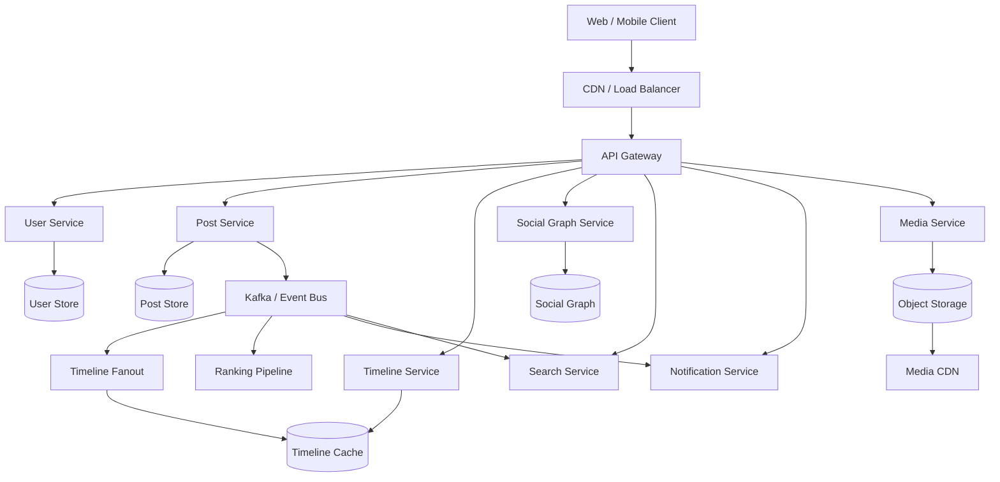
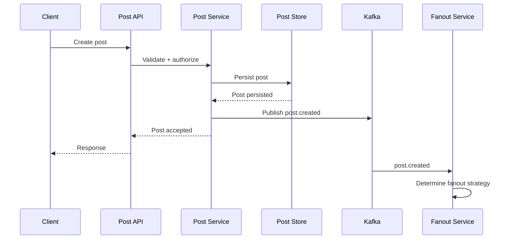
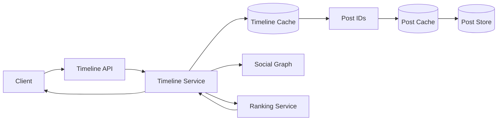
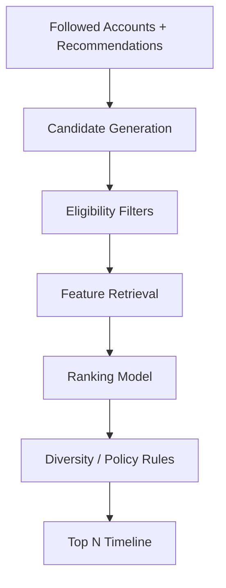
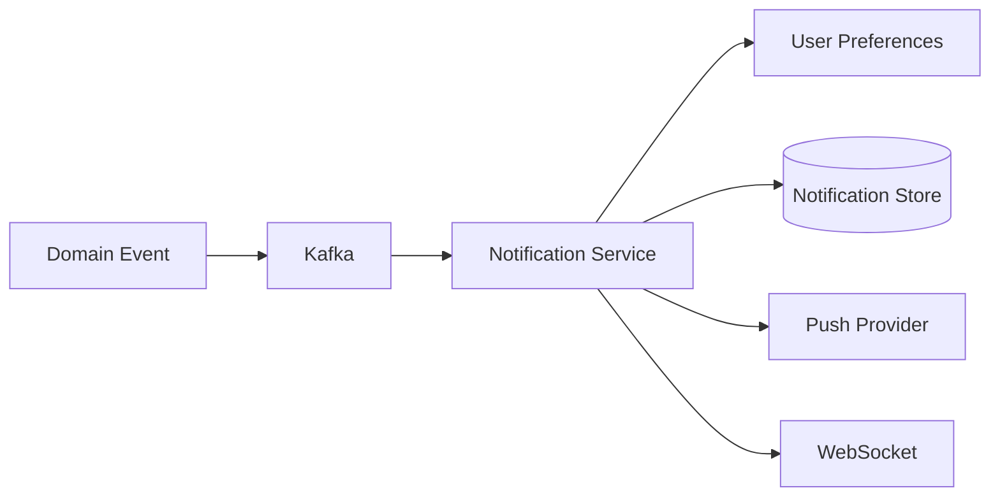
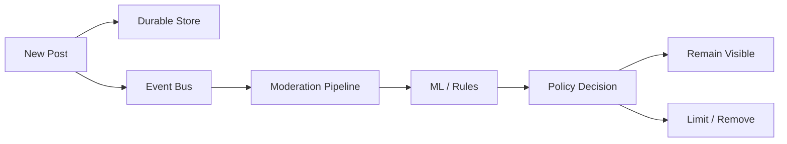
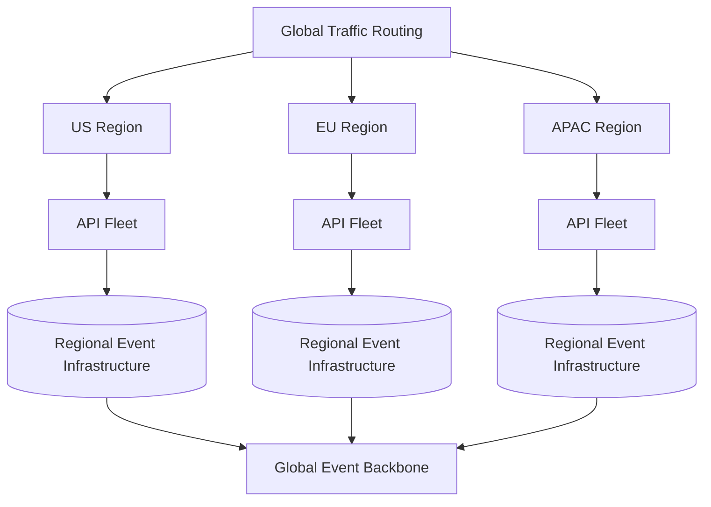

# 12- Twitter (X)

## Overview

Twitter (X) is a large-scale social graph and real-time content distribution system. Its core workload is fundamentally different from a conventional CRUD application because a small number of highly followed accounts can generate enormous fanout.

The central system-design problem is:

> How do we allow users to publish posts and retrieve a personalized, low-latency timeline while supporting hundreds of millions of users, extremely popular accounts, real-time interactions, search, notifications, media, and global traffic?

The most important architectural challenge is the **home timeline**.

A naive implementation would execute:

```text
SELECT posts
FROM posts
WHERE author_id IN (
    SELECT followed_user_id
    FROM follows
    WHERE follower_id = current_user
)
ORDER BY created_at DESC
LIMIT 50;
```

This works at small scale but becomes increasingly expensive as:

- A user follows thousands of accounts.
- Popular accounts have millions of followers.
- Timelines are requested frequently.
- Posts arrive continuously.
- Users expect near-real-time updates.

A production architecture therefore separates:

```text
Write path
    |
    +--> Post creation
    +--> Durable storage
    +--> Event publication
    +--> Timeline fanout

Read path
    |
    +--> Timeline retrieval
    +--> Ranking
    +--> Hydration
    +--> Response

Real-time path
    |
    +--> Notifications
    +--> Live timeline updates
    +--> Likes
    +--> Replies
    +--> Follows

Media path
    |
    +--> Upload
    +--> Object storage
    +--> CDN
```

A simplified architecture:



## Requirements

### Functional Requirements

The system should support:

- User registration and authentication.
- User profiles.
- Follow and unfollow.
- Create posts.
- Read home timeline.
- Read user profiles and timelines.
- Like and unlike posts.
- Reply to posts.
- Repost/retweet.
- Quote posts.
- Mentions.
- Hashtags.
- Bookmarks.
- Notifications.
- Search.
- Media attachments.
- Real-time timeline updates where appropriate.
- Blocking and muting.

Advanced functionality can include:

- Trending topics.
- Recommendations.
- Communities.
- Spaces/audio.
- Polls.
- Long-form posts.
- Algorithmic ranking.
- Personalized advertisements.

### Non-Functional Requirements

Illustrative targets:

| Requirement | Example Target |
|---|---:|
| Timeline p95 latency | < 300 ms |
| Post creation p95 | < 200 ms |
| Like operation p95 | < 200 ms |
| Timeline availability | 99.99%+ |
| Post durability | Very high |
| Global deployment | Required |
| Horizontal scalability | Required |
| Eventual consistency | Acceptable for many derived views |
| Per-user timeline ordering | Required |
| Real-time notifications | Seconds or sub-seconds |

Exact targets should be derived from product requirements and expected traffic.

## Scale Assumptions

Consider an illustrative system:

```text
500 million registered users
200 million daily active users
50 million posts/day
5 billion timeline reads/day
```

Average post rate:

```text
50,000,000 / 86,400
≈ 579 posts/sec
```

Average timeline reads:

```text
5,000,000,000 / 86,400
≈ 57,870 reads/sec
```

The important observation is:

```text
Timeline reads >> post writes
```

This strongly influences the architecture.

At peak traffic, the system may experience several times the average rate.

## Core Services

A production architecture can separate responsibilities into services:

| Service | Responsibility |
|---|---|
| Identity Service | Authentication and account identity |
| User Service | Profiles and account metadata |
| Social Graph Service | Followers and following relationships |
| Post Service | Post creation and metadata |
| Timeline Service | Home and user timeline retrieval |
| Fanout Service | Propagates posts to timelines |
| Ranking Service | Orders and scores candidate posts |
| Engagement Service | Likes, reposts, replies |
| Notification Service | User notifications |
| Search Service | Full-text and hashtag search |
| Media Service | Upload and media metadata |
| Moderation Service | Abuse and policy enforcement |
| Recommendation Service | Suggested accounts/content |
| Analytics Pipeline | Events and behavioral analytics |

These boundaries can initially be implemented as modules within fewer services. Splitting everything into microservices immediately creates unnecessary operational complexity.

## User Model

A simplified user record:

```sql
CREATE TABLE users (
    user_id UUID PRIMARY KEY,
    username VARCHAR(32) NOT NULL UNIQUE,
    display_name VARCHAR(100) NOT NULL,
    bio TEXT,
    created_at TIMESTAMPTZ NOT NULL,
    status VARCHAR(32) NOT NULL
);
```

Important indexes might include:

```sql
CREATE UNIQUE INDEX users_username_idx
ON users (username);
```

At very large scale, username lookup should be extremely fast because profile and authentication requests frequently resolve users by username.

## Social Graph

The social graph is one of the most important data structures.

A follow relationship can be represented as:

```text
follower_id
followed_id
created_at
```

Example:

```sql
CREATE TABLE follows (
    follower_id UUID NOT NULL,
    followed_id UUID NOT NULL,
    created_at TIMESTAMPTZ NOT NULL,
    PRIMARY KEY (follower_id, followed_id)
);
```

For timeline generation, two access patterns matter:

```text
Who does User A follow?
```

and:

```text
Who follows User B?
```

These are different query patterns and usually require different indexes or physical representations.

For example:

```sql
CREATE INDEX follows_by_followed_idx
ON follows (followed_id, follower_id);
```

## Social Graph at Scale

A large social graph may contain billions of edges.

A relational database can work initially, but at extreme scale the graph may require:

- Sharding.
- Distributed key-value storage.
- Specialized graph services.
- Cached adjacency lists.

The critical question is not whether the data is technically a graph.

The important question is:

> What graph queries does the application actually need?

Twitter-like systems primarily need adjacency operations:

```text
Get following(user)
Get followers(user)
Check whether A follows B
```

They generally do not require arbitrary graph traversal for the core timeline path.

## Post Model

A post may contain:

```text
post_id
author_id
text
created_at
reply_to
quoted_post_id
visibility
media references
```

Example:

```sql
CREATE TABLE posts (
    post_id UUID PRIMARY KEY,
    author_id UUID NOT NULL,
    body TEXT,
    created_at TIMESTAMPTZ NOT NULL,
    reply_to_post_id UUID,
    quoted_post_id UUID,
    visibility VARCHAR(32) NOT NULL
);
```

A production implementation may use a distributed store for high-volume post storage.

## Post IDs

Sequential database IDs can expose information about traffic volume and create contention in some distributed architectures.

Modern systems may use:

- UUIDv7.
- Snowflake-style IDs.
- Time-sortable distributed IDs.

A time-sortable ID can provide:

```text
rough chronological ordering
+
distributed generation
+
high uniqueness
```

without requiring a global database counter.

## Post Creation Flow

A simplified write path:



The post should become durable before the system relies on downstream processing.

## Home Timeline

The home timeline contains content from accounts a user follows.

For user `U`:

```text
Following(U)
    |
    +--> Account A
    +--> Account B
    +--> Account C
    +--> Account D
```

Then:

```text
Posts(A)
Posts(B)
Posts(C)
Posts(D)
```

must be combined and ranked.

At small scale:

```text
Fan-in at read time
```

is acceptable.

At large scale:

```text
Fanout on write
```

becomes important.

## Fanout on Read

With fanout-on-read:

```text
User opens timeline
       |
       v
Fetch following list
       |
       v
Fetch recent posts from each account
       |
       v
Merge
       |
       v
Rank
       |
       v
Return
```

Advantages:

- Low write amplification.
- New posts are immediately available.
- Simple post storage.

Limitations:

- Expensive reads.
- High latency for users following many accounts.
- Repeated work.
- Difficult to scale for popular users.

## Fanout on Write

With fanout-on-write:

```text
User creates post
       |
       v
Determine followers
       |
       v
Insert post reference into follower timelines
```

For example:

```text
Alice posts
   |
   +--> Bob timeline
   +--> Carol timeline
   +--> Dave timeline
   +--> Eve timeline
```

Advantages:

- Fast timeline reads.
- Predictable read latency.
- Less repeated merge work.

Limitations:

- High write amplification.
- Expensive for celebrities.
- Large follower lists create huge fanout operations.

## The Celebrity Problem

Suppose an account has:

```text
100 million followers
```

and publishes a post.

Pure fanout-on-write requires:

```text
1 post
+
100 million timeline writes
```

for one post.

If several popular accounts publish simultaneously, the system can experience massive write amplification.

This is the central reason a hybrid design is generally preferable.

## Hybrid Fanout

A practical strategy:

```text
Normal account
    |
    +--> Fanout on write

Celebrity account
    |
    +--> Do not fanout to every follower
    +--> Merge celebrity posts during read
```

Timeline generation becomes:

```text
Precomputed timeline
       +
Celebrity candidate posts
       |
       v
Ranking
       |
       v
Final timeline
```

This combines:

```text
fast reads
+
controlled write amplification
```

## Fanout Threshold

There is no universal threshold.

For example:

```text
Followers < threshold
    -> fanout on write

Followers >= threshold
    -> fanout on read
```

The threshold should be based on:

- Follower distribution.
- Post frequency.
- Storage cost.
- Queue throughput.
- Timeline read volume.
- Latency targets.

It should be configurable rather than hard-coded.

## Timeline Storage

A timeline cache might store only post IDs:

```text
timeline:user_123

[post_901, post_898, post_891, post_884]
```

Do not duplicate the entire post object into every user's timeline.

Store lightweight references:

```text
user_id
post_id
ranking_score
created_at
```

Then hydrate post data separately.

## Redis Sorted Sets

Redis sorted sets can represent ordered timeline entries:

```text
ZADD timeline:user_123 score post_901
```

The score can represent:

```text
ranking score
```

or a time-based value for chronological timelines.

Read:

```text
ZREVRANGE timeline:user_123 0 49
```

This gives the latest/highest-ranked candidate IDs.

At very large scale, a specialized distributed timeline store may be preferable.

## Timeline Hydration

After retrieving post IDs:

```text
Timeline cache
      |
      v
[post_901, post_898, post_891]
      |
      v
Post cache
      |
      v
Post objects
```

Use batch reads rather than one database request per post.

Avoid:

```text
50 posts
50 database queries
```

This is a classic N+1 problem.

Prefer:

```text
50 post IDs
      |
      v
one batch retrieval
```

## Timeline Read Flow



## Chronological Timeline

The simplest ranking strategy is:

```text
created_at DESC
```

This is easy to implement and predictable.

Advantages:

- Simple.
- Low computation.
- Easy to explain.
- Deterministic.

Limitations:

- Not personalized.
- A user can miss important posts.
- High-volume accounts dominate the feed.
- Less relevant content can appear above better content.

Chronological timelines are useful as a baseline and fallback.

## Algorithmic Timeline

An algorithmic timeline scores candidates using signals such as:

```text
Recency
Author relationship
Likes
Replies
Reposts
Click probability
Dwell time
Media type
Previous interactions
Topic affinity
Negative feedback
```

Conceptually:

```text
score(post, user)
=
w1 * recency
+
w2 * relationship
+
w3 * engagement
+
w4 * predicted_interest
-
w5 * negative_feedback
```

The actual production ranking model may be significantly more sophisticated.

## Candidate Generation

Ranking should not score every post in the entire platform.

Instead:

```text
Candidate generation
        |
        v
Thousands of candidates
        |
        v
Filtering
        |
        v
Hundreds of candidates
        |
        v
Ranking
        |
        v
Top N
```

This is a fundamental large-scale recommendation architecture.

## Timeline Pipeline



## Ranking Features

Potential features:

| Feature | Purpose |
|---|---|
| Post age | Recency |
| Author interaction frequency | Relationship strength |
| Like probability | Engagement prediction |
| Reply probability | Conversation relevance |
| Repost probability | Virality |
| Topic similarity | Interest matching |
| Author quality | Content quality |
| Negative feedback | Avoid irrelevant content |
| User mute/block state | Eligibility |

Feature computation should not block the core post-write path.

## Timeline Freshness

Users expect recent posts to appear quickly.

Fanout introduces asynchronous processing:

```text
Post created
   |
   v
Kafka
   |
   v
Fanout workers
   |
   v
Timeline cache
```

If consumers are delayed:

```text
post latency = queue delay + processing delay
```

Monitor this explicitly.

## Backpressure

Suppose:

```text
Post creation:
100k/sec

Fanout processing:
50k/sec
```

Kafka lag grows.

This is acceptable temporarily if:

```text
consumer capacity can catch up
```

Otherwise timelines become stale.

Scaling strategies include:

- More consumers.
- Better batching.
- Partition scaling.
- Adaptive fanout.
- Celebrity detection.
- Reduced writes for low-value timeline entries.

## Fanout Batching

Instead of:

```text
1 follower
1 write
```

process batches:

```text
1,000 followers
    |
    v
batch timeline update
```

This reduces network overhead and improves storage throughput.

## Social Graph Caching

Follower lists are frequently read by fanout workers.

Cache:

```text
followers:{user_id}
following:{user_id}
```

But extremely large follower sets should not necessarily be loaded entirely into memory.

Use:

- Pagination.
- Partitioned follower lists.
- Streaming fanout.
- Batched retrieval.

## Celebrity Fanout

For a celebrity:

```text
100M followers
```

do not load the entire follower set into one process.

Instead:

```text
Follower partitions

Partition 1 -> workers
Partition 2 -> workers
Partition 3 -> workers
...
Partition N -> workers
```

Workers process bounded batches.

## Real-Time Timeline Updates

For online users, a new post can optionally be pushed through:

```text
Post Event
   |
   v
Timeline Service
   |
   v
Online Connection Registry
   |
   v
WebSocket Gateway
   |
   v
Client
```

However, real-time push should not be the source of truth.

If the client misses an event:

```text
Reconnect
   |
   v
Timeline synchronization
```

recovers the missing content.

## Likes and Engagement

Likes are extremely high-volume.

A naive counter:

```text
UPDATE posts
SET likes = likes + 1
WHERE post_id = ...
```

can create contention for highly popular posts.

For a viral post:

```text
millions of updates
```

may target one row.

## Counter Strategies

Possible approaches:

- Atomic counters.
- Sharded counters.
- Event aggregation.
- Approximate counts where product semantics permit.
- Periodic materialization.

For example:

```text
post_id
shard_0 -> 120,000
shard_1 -> 118,000
shard_2 -> 122,000
...
```

Total count is aggregated from shards.

## Like Idempotency

A user should not be able to create multiple logical likes by retrying.

Use a unique constraint:

```sql
CREATE UNIQUE INDEX likes_unique
ON likes (user_id, post_id);
```

The counter can be updated independently through an event pipeline.

## Engagement Events

Instead of synchronously updating every derived counter:

```text
POST /like
    |
    +--> persist like
    |
    +--> publish like.created
```

Consumers can update:

```text
like counts
analytics
recommendations
notifications
ranking features
```

This reduces coupling.

## Replies

Replies form a conversation tree:

```text
Post
 |
 +--> Reply
       |
       +--> Reply
       |
       +--> Reply
```

Storage should support:

```text
root_post_id
parent_post_id
created_at
```

The entire conversation should not require recursive database queries on every request.

Use bounded pagination and cached conversation metadata.

## Notifications

Events can produce notifications:

```text
post liked
post reposted
post replied
mentioned
new follower
```

A typical architecture:



Notifications should be asynchronous.

A failed push notification should not cause the original like or post operation to fail.

## Notification Deduplication

A user might receive:

```text
100 likes
```

within seconds.

Sending:

```text
100 individual notifications
```

may be undesirable.

Aggregation can produce:

```text
Alice and 99 others liked your post.
```

This requires notification grouping and debounce logic.

## Search

Search requirements may include:

```text
Posts
Users
Hashtags
Topics
```

A relational `LIKE '%query%'` query is insufficient at large scale.

Use a search engine such as:

```text
OpenSearch / Elasticsearch
```

where appropriate.

Search indexing is asynchronous:

```text
Post created
   |
   v
Kafka
   |
   v
Search Indexer
   |
   v
Search Cluster
```

This introduces eventual consistency.

## Search Consistency

A newly created post may briefly be:

```text
Visible in timeline
but
not yet visible in search
```

This is generally acceptable if the product explicitly tolerates it.

Do not make post creation synchronously wait for search indexing unless strong search consistency is a hard requirement.

## Hashtags

Hashtags can be represented as:

```text
post_id
hashtag
created_at
```

For trending analysis, maintain aggregated counters:

```text
hashtag
time_bucket
count
```

For example:

```text
#python
2026-08-23T15:00
42,800
```

This supports time-window-based trend detection.

## Trending Topics

Trending is not simply:

```text
highest number of posts
```

A topic with:

```text
1 million posts/day
```

may be normal.

A topic with:

```text
10,000 posts
```

that grew from:

```text
100 posts/hour
```

may be trending.

Therefore use velocity:

```text
current activity
/
historical baseline
```

plus additional quality and abuse signals.

## Media Architecture

Images and videos should not flow through the main API servers.

Use:

```text
Client
  |
  v
Media API
  |
  v
Pre-signed upload URL
  |
  v
Object Storage
  |
  v
Media Processing
  |
  v
CDN
```

Possible storage:

```text
S3
```

Media processing can generate:

- Thumbnails.
- Multiple resolutions.
- Video segments.
- Metadata.
- Content safety signals.

## CDN

Media delivery:

```text
Client
   |
   v
CDN
   |
   +--> Cache hit
   |
   +--> Cache miss
           |
           v
       Object Storage
```

This significantly reduces origin load.

## Content Moderation

A large social platform needs asynchronous moderation pipelines.

Possible signals include:

- User reports.
- Spam detection.
- Account reputation.
- Automated classifiers.
- Malware scanning.
- Image/video analysis.
- Coordinated abuse detection.

A simplified pipeline:



Moderation should not unnecessarily block the core post-write path.

## Blocking and Muting

Blocking affects:

- Timeline eligibility.
- Replies.
- Notifications.
- Search.
- Profile visibility.
- Direct interactions.

Muting is different:

```text
User can still exist
but content is filtered from the user's experience.
```

Filtering should happen before expensive ranking whenever possible.

## Timeline Eligibility

Before ranking, remove:

```text
blocked users
muted users
deleted posts
private accounts without permission
policy-restricted content
already-seen content
```

This prevents expensive ranking work on content that cannot be shown.

## Privacy and Authorization

A post request must verify:

```text
Is the account active?
Is the user authenticated?
Can the user create this content?
Is the target conversation accessible?
Is the account rate-limited?
```

Timeline requests must enforce:

```text
block rules
mute rules
privacy settings
protected accounts
content visibility
```

Never rely solely on frontend filtering.

## Rate Limiting

Rate limits should exist at multiple levels:

```text
IP
User
Device
Endpoint
Post creation
Follow operations
Like operations
Search
Authentication
```

Example:

| Operation | Example Limit |
|---|---:|
| Post creation | 100/min |
| Follow | 50/min |
| Like | 300/min |
| Search | 60/min |
| Login | 10/min |

These are illustrative values, not universal production limits.

Use adaptive limits for suspicious behavior.

## Idempotency

Mobile clients retry requests frequently.

For mutations such as:

```text
create post
like post
follow user
```

use stable request identifiers where appropriate.

Example:

```http
POST /v1/posts
Idempotency-Key: 01J9F7X...
```

The server should prevent duplicate business operations caused by retries.

## Caching

Redis can cache:

```text
User profiles
Timeline IDs
Follower counts
Following counts
Post metadata
Popular posts
Trending topics
Rate-limit counters
```

The database remains authoritative for critical persistent state.

Use TTLs and invalidation carefully.

## Cache Invalidation

A post update may affect:

```text
Post cache
Timeline caches
Profile timeline
Search index
Notification state
Ranking features
```

Do not attempt synchronous invalidation of every derived representation.

Prefer event-driven invalidation and eventual convergence.

## Database Sharding

At large scale, data may be partitioned by:

```text
user_id
```

or:

```text
post_id
```

depending on access patterns.

For timeline workloads, user-centric data can be partitioned by user.

For post storage, time-sortable IDs can assist with distribution and ordering.

Avoid a single global database sequence if it becomes a scaling bottleneck.

## Hot Keys

Popular content can produce hot keys.

Examples:

```text
viral post
celebrity account
trending hashtag
popular timeline
```

Mitigations include:

- Local caches.
- Replicated cache entries.
- Request coalescing.
- Read replicas.
- Sharded counters.
- Precomputation.
- CDN caching.

## Read Replicas

Read-heavy systems can use:

```text
Primary
  |
  +--> Read Replica 1
  +--> Read Replica 2
  +--> Read Replica 3
```

However, replica lag creates consistency concerns.

For operations requiring immediate read-after-write behavior, route to the primary or use a consistency-aware strategy.

## Event-Driven Architecture

Kafka can distribute events such as:

```text
post.created
post.deleted
post.liked
post.reposted
post.replied
user.followed
user.unfollowed
user.blocked
user.muted
```

Consumers include:

```text
Timeline Fanout
Search Indexer
Notification Service
Recommendation System
Analytics
Moderation
Counters
```

This allows downstream systems to evolve independently.

## Event Ordering

Kafka ordering is generally guaranteed within a partition.

For post events, a possible partition key is:

```text
author_id
```

This preserves ordering of events from a given author.

For timeline-specific processing, another key such as:

```text
user_id
```

may be appropriate.

The correct key depends on the operation's consistency requirement.

## Exactly-Once Processing

Do not assume exactly-once processing across the entire distributed system.

Use:

```text
At-least-once events
+
idempotent consumers
+
deduplication
```

For example:

```text
event_id = evt_123
```

The consumer stores processed event IDs or uses an idempotent database operation.

## Failure Handling

### Timeline Service Failure

If timeline caches are unavailable:

```text
Fall back to rebuilding timeline candidates
```

where practical.

Do not lose posts because the timeline cache failed.

### Fanout Worker Failure

Kafka retains events until consumers recover, subject to retention.

### Redis Failure

Timeline caches may become unavailable.

The system should degrade gracefully and rebuild derived data.

### Search Failure

Posts should still be created.

Search can become temporarily stale.

### Notification Failure

The original user action should succeed independently.

### Media Processing Failure

The post can remain visible with a retryable media-processing state.

## Disaster Recovery

Critical durable data includes:

```text
Users
Posts
Social graph
Conversation/reply relationships
Privacy settings
```

Backups should support:

- Point-in-time recovery.
- Cross-region recovery.
- Integrity validation.
- Regular restore tests.

Define:

```text
RPO
RTO
```

for each major data domain.

Derived data such as:

```text
timeline cache
search index
ranking cache
```

can generally be rebuilt from authoritative data and events.

## Regional Architecture

A global deployment may use:



A practical system may use regional ownership for users and asynchronously replicate events globally.

## Cross-Region Consistency

Not all data requires global strong consistency.

A reasonable model:

| Data | Consistency |
|---|---|
| User identity | Strong |
| Follow relationship | Strong enough for authorization |
| Post existence | Durable |
| Timeline | Eventual |
| Search | Eventual |
| Likes | Eventual for counters |
| Notifications | Eventual |
| Trending | Eventual |
| Analytics | Eventual |
| Blocking | Strong authorization semantics |

Security-sensitive operations such as blocking and access control should not depend on stale cached state.

## Ranking System Architecture

A mature ranking system may consist of:

```text
Candidate Generation
        |
        v
Eligibility Filtering
        |
        v
Feature Retrieval
        |
        v
Lightweight Ranking
        |
        v
Heavy Ranking Model
        |
        v
Policy / Diversity
        |
        v
Final Timeline
```

This avoids executing expensive machine-learning models against enormous candidate sets.

## Feature Store

Ranking features may include:

```text
user-author interaction frequency
user-topic affinity
post engagement
author engagement rate
recent interactions
negative feedback
content freshness
```

A feature store or low-latency feature cache can provide these values.

The ranking system should degrade gracefully if feature infrastructure is unavailable.

For example:

```text
ML ranking unavailable
       |
       v
Fallback ranking
       |
       v
Chronological ordering
```

A degraded timeline is preferable to an unavailable product.

## Recommendation System

Suggested accounts can use:

```text
Common follows
Contact graph
Interest similarity
Engagement patterns
Geographic relevance
Topic affinity
```

Recommendation computation should generally be asynchronous.

Do not run expensive graph algorithms inside the request path.

## Timeline Pagination

Avoid:

```http
GET /timeline?offset=1000000
```

Use cursor-based pagination:

```http
GET /timeline?cursor=eyJ0Ijoi...
```

A cursor can encode:

```text
last_seen_score
last_seen_post_id
ranking_version
```

This makes pagination more stable under continuously changing timelines.

## Duplicate Timeline Entries

A post can enter a timeline through multiple mechanisms:

```text
Followed author
Recommended post
Repost
Quote
```

The final timeline should deduplicate using:

```text
post_id
```

before returning results.

## Timeline Consistency

Users may see slightly different timelines across devices due to:

- Eventual fanout.
- Ranking changes.
- Cache state.
- Device synchronization timing.

This is generally acceptable for a social feed.

What matters is that:

```text
posts are durable
+
deleted/private content is filtered
+
ranking converges
```

## Python Backend Implementation

A Django or FastAPI deployment can handle API workloads effectively, but the framework is only one layer of the architecture.

A practical stack might be:

```text
Nginx / Cloud Load Balancer
        |
        v
FastAPI / Django
        |
        +--> PostgreSQL
        +--> Redis
        +--> Kafka
        +--> Object Storage
```

Workers can use:

```text
Celery
```

for asynchronous tasks such as:

- Media processing.
- Notification generation.
- Small-scale fanout.
- Cleanup.
- Non-critical asynchronous workflows.

For very high-throughput event processing, Kafka consumers or dedicated stream-processing infrastructure may be preferable.

## Example Timeline API

```python
from fastapi import FastAPI, Query

app = FastAPI()


@app.get("/v1/timeline")
async def get_timeline(
    cursor: str | None = Query(default=None),
    limit: int = Query(default=50, ge=1, le=100),
) -> dict:
    # Production implementation should:
    # 1. Authenticate the user.
    # 2. Retrieve precomputed timeline candidates.
    # 3. Merge non-fanned-out candidates.
    # 4. Apply authorization and safety filters.
    # 5. Hydrate posts in batches.
    # 6. Apply ranking if required.
    # 7. Generate the next cursor.

    return {
        "items": [],
        "next_cursor": None,
    }
```

The important architectural work is not the endpoint itself. It is the candidate generation, storage, ranking, filtering, and caching pipeline behind it.

## AWS Reference Architecture

A possible AWS deployment:

| Requirement | AWS Technology |
|---|---|
| DNS | Route 53 |
| Edge | CloudFront |
| API load balancing | Application Load Balancer |
| Compute | EKS / ECS |
| Relational metadata | Aurora PostgreSQL |
| High-scale key-value data | DynamoDB |
| Cache | ElastiCache Redis |
| Event streaming | Amazon MSK / Kafka |
| Media | S3 |
| Media delivery | CloudFront |
| Search | OpenSearch Service |
| Secrets | Secrets Manager |
| Encryption | KMS |
| Monitoring | CloudWatch |
| Tracing | OpenTelemetry |

The architecture should be driven by workload characteristics rather than by choosing an AWS service for every component.

## Monitoring

### API Metrics

Track:

```text
request_rate
error_rate
p50_latency
p95_latency
p99_latency
```

### Timeline Metrics

Track:

```text
timeline_read_latency
timeline_cache_hit_rate
timeline_fanout_lag
timeline_freshness
candidate_count
ranking_latency
hydration_latency
```

### Fanout Metrics

Track:

```text
posts_processed
followers_processed
fanout_queue_depth
fanout_lag
fanout_failures
celebrity_posts
```

### Social Graph Metrics

Track:

```text
follow_requests
follow_failures
graph_lookup_latency
graph_cache_hit_rate
```

### Kafka Metrics

Track:

```text
consumer_lag
partition_skew
producer_errors
consumer_errors
throughput
under_replicated_partitions
```

### Cache Metrics

Track:

```text
hit_rate
miss_rate
evictions
memory_usage
hot_keys
latency
```

## Distributed Tracing

A request may traverse:

```text
API Gateway
    |
    v
Post Service
    |
    v
Post Store
    |
    v
Kafka
    |
    +--> Fanout
    +--> Search
    +--> Notifications
    +--> Recommendations
```

Propagate:

```text
trace_id
post_id
user_id
event_id
```

across services.

This makes asynchronous failures much easier to diagnose.

## Logging

Use structured logging:

```json
{
  "event": "timeline.fanout.completed",
  "post_id": "post_123",
  "author_id": "user_456",
  "followers_processed": 125000,
  "duration_ms": 843,
  "region": "ap-south-1"
}
```

Avoid logging:

- Access tokens.
- Passwords.
- Sensitive personal information.
- Private content unnecessarily.

## Cost Considerations

Major cost drivers include:

- Timeline storage.
- Redis memory.
- Kafka throughput.
- Database storage.
- Cross-region replication.
- CDN bandwidth.
- Media storage.
- Search infrastructure.
- Ranking infrastructure.
- Observability.

Fanout-on-write can dramatically increase storage and write costs.

Fanout-on-read increases compute and read latency.

The hybrid architecture exists largely because the cost curves differ.

## Common Mistakes and Pitfalls

### Fanout to Every Follower

This fails catastrophically for celebrity accounts.

Use hybrid fanout.

### Generate Every Timeline on Read

This creates enormous repeated computation.

Precompute timeline candidates for normal users.

### Store Full Posts in Every Timeline

This creates excessive duplication and makes edits/deletes difficult.

Store post IDs and lightweight metadata.

### Ignore Celebrity Accounts

The follower distribution is highly skewed.

A few accounts can generate disproportionate fanout traffic.

### Use One Global Database

Global latency, availability, replication, and throughput make a single database a major bottleneck.

### Use Global Ordering

Global ordering provides little value for a social feed and introduces expensive coordination.

### Update Like Counters Synchronously

Highly viral posts can create hot rows.

Use aggregation or sharded counters where necessary.

### Use Offset Pagination

Large offsets become inefficient and unstable under continuous writes.

Use cursors.

### Run Ranking Inside the Database

Complex ranking logic inside SQL can become difficult to scale and operate.

Use dedicated ranking services or precomputed features where appropriate.

### Make Search Synchronous

A search index can be eventually consistent.

Do not make post creation depend on successful indexing unless required.

### Make Notifications Synchronous

A failed notification provider should not cause a successful follow or like to fail.

### Treat Redis as Authoritative

Caches can disappear.

Derived timeline data should be rebuildable.

### Ignore Cache Stampedes

Popular users and posts can create massive synchronized cache misses.

Use TTL jitter, request coalescing, and prewarming.

### Ignore Hot Keys

Viral posts, celebrities, and trending topics can overload individual partitions or cache keys.

### Use a Single Fanout Worker

Fanout is embarrassingly parallel for many workloads.

Use partitioned workers and bounded batches.

### Ignore Eventual Consistency

Users may temporarily see stale timelines, counts, or search results.

Define which inconsistencies are acceptable.

### Ignore Deletion Propagation

Deleted posts must disappear from:

```text
Timeline
Search
Caches
Recommendations
Notifications
```

Use asynchronous invalidation and tombstone events.

### Ignore Blocking and Privacy

Filtering blocked/private content after expensive ranking is inefficient and potentially unsafe.

Apply eligibility rules early.

## Interview Traps

### Is Twitter a CRUD System?

Not at scale.

CRUD is only the API surface. The difficult problems are:

```text
Social graph
+
Timeline generation
+
Fanout
+
Ranking
+
Hot keys
+
Real-time updates
+
Massive read volume
```

### Should You Use Kafka for the Timeline?

Kafka can transport timeline events, but it should not automatically become the user-facing timeline store.

Use a query-optimized timeline store or cache.

### Why Not Fanout Everything?

Because a celebrity with tens of millions of followers can turn one post into tens of millions of writes.

### Why Not Fanout Nothing?

Because every timeline read would have to merge potentially thousands of followed accounts.

### What Is the Key Scaling Insight?

The system has:

```text
many reads
+
highly skewed follower distribution
+
real-time writes
```

Therefore the optimal architecture is usually hybrid.

### What Should Be Stored in the Timeline?

Prefer:

```text
post_id
ranking metadata
timestamp / score
```

rather than complete post objects.

### What Happens When Redis Is Lost?

Rebuild derived timelines from authoritative post and social-graph data.

### How Do You Handle a Viral Post?

Avoid synchronously updating every follower's timeline.

Use celebrity detection, deferred fanout, caching, and read-time merging.

### How Do You Handle Timeline Ranking Failure?

Use a deterministic fallback:

```text
cached ranking
        |
        v
chronological ordering
```

The product should degrade gracefully.

## Key Takeaways

- **The primary Twitter-scale challenge is timeline generation: use fanout-on-write for ordinary accounts, fanout-on-read for high-follower accounts, and combine both paths before ranking.**
- **Design around highly skewed workloads: celebrity accounts, viral posts, trending topics, and hot cache keys can dominate system capacity despite relatively modest average traffic.**
- **Separate durable post storage from derived timeline caches, search indexes, ranking features, counters, and notifications so derived systems can fail and rebuild independently.**
- **Use asynchronous event processing, idempotent consumers, cursor-based pagination, batch hydration, and distributed caching to keep timeline reads predictable at high scale.**
- **Treat ranking, moderation, recommendations, and search as downstream systems that improve the feed without becoming hard dependencies for durable post creation.**