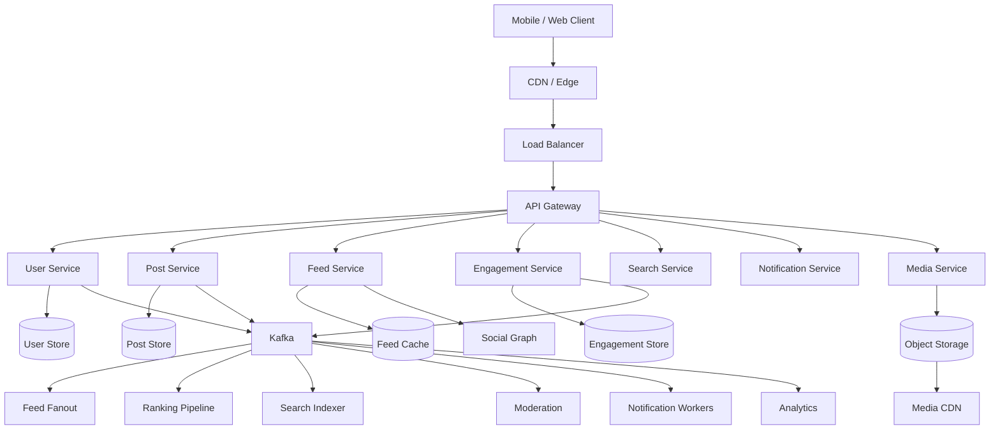
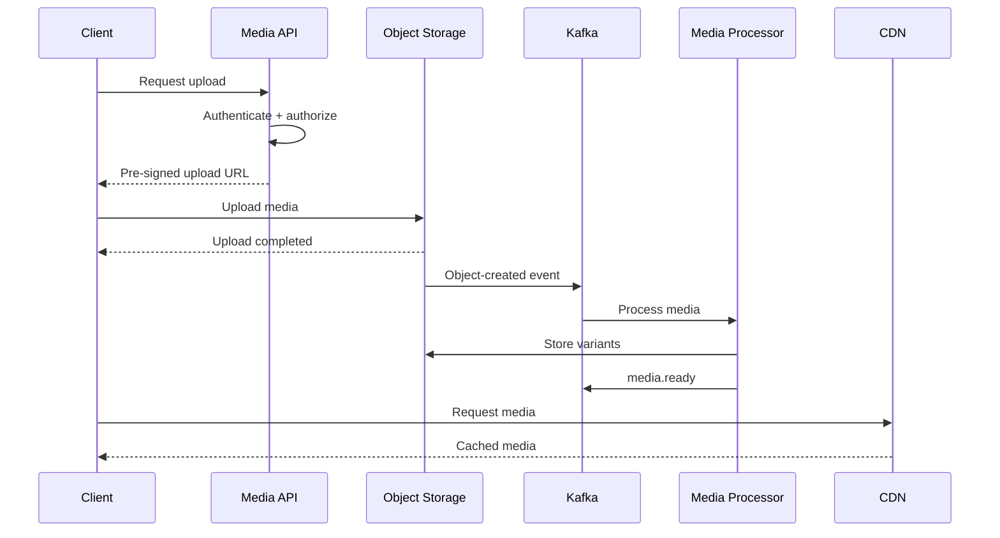
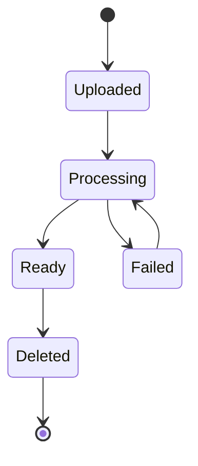
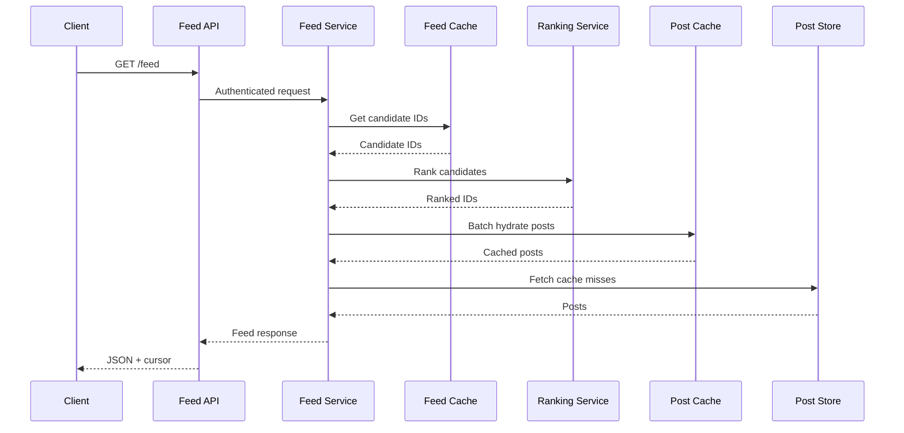
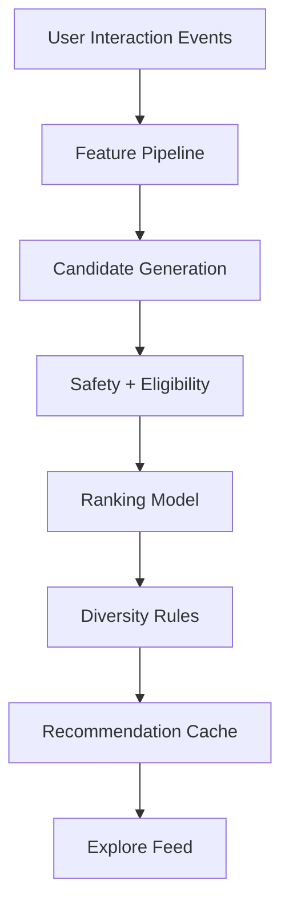
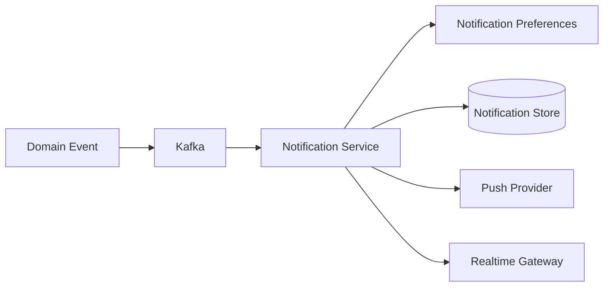
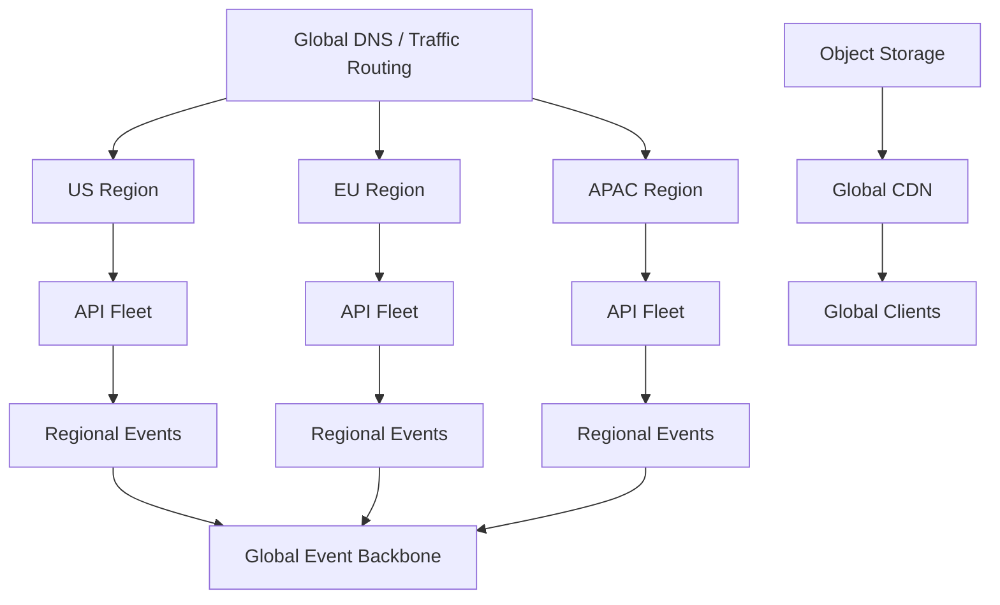

# 13- Instagram

## Overview

Instagram is a large-scale, media-centric social platform whose primary workload combines a social graph, personalized content feeds, object storage, media processing, CDN delivery, engagement, notifications, search, recommendations, and real-time interactions.

The core system-design challenge is not simply storing photos and videos. It is efficiently answering:

> How can the system allow hundreds of millions of users to upload media, follow other users, publish posts, and retrieve a personalized, low-latency feed while handling massive media bandwidth and highly skewed traffic?

A useful high-level decomposition is:

```text
                    Instagram Platform
                           |
        +------------------+------------------+
        |                  |                  |
    Write Path         Read Path         Async Path
        |                  |                  |
   Upload media       Home feed          Notifications
   Create post        Explore            Search indexing
   Follow user        Profile            Recommendations
   Like/comment       Stories            Media processing
        |                  |                  |
        +------------------+------------------+
                           |
                    Event Infrastructure
                           |
                         Kafka
```

Unlike a text-heavy social network, Instagram is particularly sensitive to:

- Object storage throughput.
- CDN cache hit ratio.
- Image and video processing.
- Feed generation.
- Recommendation latency.
- Media bandwidth.
- Storage cost.
- Hot content.
- Content moderation.
- Privacy and authorization.

The architecture should therefore separate **durable metadata**, **media storage**, **derived feed data**, and **asynchronous processing**.

## Requirements

### Functional Requirements

The system should support:

- User registration and authentication.
- User profiles.
- Follow and unfollow.
- Public and private accounts.
- Photo and video uploads.
- Multiple images in a post.
- Captions.
- Hashtags.
- Likes.
- Comments.
- Saves/bookmarks.
- Home feed.
- User profile feed.
- Explore/recommendations.
- Stories.
- Notifications.
- Search.
- Mentions.
- Blocking and muting.
- Content reporting.
- Media moderation.

Advanced features may include:

- Reels.
- Live streaming.
- Direct messaging.
- Ads.
- Shopping.
- Creator analytics.
- Personalized recommendations.

### Non-Functional Requirements

Illustrative targets:

| Requirement | Example Target |
|---|---:|
| Feed p95 latency | < 300 ms |
| Post metadata write p95 | < 200 ms |
| Media upload reliability | Very high |
| Media delivery availability | 99.99%+ |
| Feed availability | 99.99%+ |
| Search consistency | Eventual |
| Recommendation consistency | Eventual |
| Media durability | Extremely high |
| Global delivery | Required |
| Horizontal scalability | Required |

These values are architectural assumptions rather than requirements imposed by the actual Instagram platform.

## Scale Assumptions

Consider an illustrative system:

```text
500 million daily active users
100 million new posts/day
10 billion feed requests/day
20 billion media impressions/day
```

Average post creation rate:

```text
100,000,000 / 86,400
≈ 1,157 posts/sec
```

Average feed request rate:

```text
10,000,000,000 / 86,400
≈ 115,740 requests/sec
```

Peak traffic can be several times the average.

The important observation is:

```text
Media reads and feed reads
        >>
Post writes
```

The architecture must therefore optimize heavily for read scalability and media delivery.

## Core Services

A production architecture can use the following logical services:

| Service | Responsibility |
|---|---|
| Identity Service | Authentication and account identity |
| User Service | Profile and account metadata |
| Social Graph Service | Followers and following |
| Post Service | Post metadata and lifecycle |
| Media Service | Upload and media metadata |
| Feed Service | Home feed generation and retrieval |
| Ranking Service | Personalized ranking |
| Recommendation Service | Explore and suggested content |
| Engagement Service | Likes, comments, saves |
| Notification Service | User notifications |
| Search Service | Users, captions, hashtags |
| Story Service | Ephemeral content |
| Moderation Service | Spam and policy enforcement |
| Analytics Service | Behavioral and product analytics |

These are logical boundaries. A smaller implementation can combine several into a Django or FastAPI application before introducing independent services.

## High-Level Architecture



## User Data

A simplified user record:

```sql
CREATE TABLE users (
    user_id UUID PRIMARY KEY,
    username VARCHAR(32) NOT NULL UNIQUE,
    display_name VARCHAR(100) NOT NULL,
    bio TEXT,
    is_private BOOLEAN NOT NULL DEFAULT FALSE,
    status VARCHAR(32) NOT NULL,
    created_at TIMESTAMPTZ NOT NULL
);
```

The user database should primarily store metadata rather than large media objects.

Media should live in object storage.

## Social Graph

A follow relationship can be represented as:

```text
follower_id
followed_id
created_at
status
```

Example:

```sql
CREATE TABLE follows (
    follower_id UUID NOT NULL,
    followed_id UUID NOT NULL,
    created_at TIMESTAMPTZ NOT NULL,
    PRIMARY KEY (follower_id, followed_id)
);

CREATE INDEX follows_followed_idx
ON follows (followed_id, follower_id);
```

The two important access patterns are:

```text
Who does user A follow?
Who follows user B?
```

Both should be optimized independently.

## Private Accounts

Private accounts introduce authorization requirements into feed generation.

For a private account:

```text
Follow request
      |
      v
Pending
      |
      +--> Accepted
      |
      +--> Rejected
```

Only accepted followers should receive posts.

This authorization must be enforced server-side.

Never rely on:

```text
client-side filtering
```

to protect private media.

## Post Model

A post may contain:

```text
post_id
author_id
caption
created_at
visibility
location
reply metadata
```

Media should be referenced separately.

```sql
CREATE TABLE posts (
    post_id UUID PRIMARY KEY,
    author_id UUID NOT NULL,
    caption TEXT,
    visibility VARCHAR(32) NOT NULL,
    created_at TIMESTAMPTZ NOT NULL
);
```

Media relationships:

```sql
CREATE TABLE post_media (
    post_id UUID NOT NULL,
    media_id UUID NOT NULL,
    position INTEGER NOT NULL,
    PRIMARY KEY (post_id, media_id)
);
```

The database stores metadata and references rather than binary image/video data.

## Why Media Should Not Be Stored in PostgreSQL

Storing large media blobs directly in the primary relational database creates several problems:

- Database storage becomes expensive.
- Backups become significantly larger.
- Replication becomes expensive.
- Database I/O competes with transactional workloads.
- CDN integration becomes less direct.
- Large objects can increase operational complexity.

Use:

```text
PostgreSQL
    |
    +--> post metadata

Object Storage
    |
    +--> images
    +--> videos
    +--> thumbnails
```

## Media Upload Architecture

The client should generally upload directly to object storage using a short-lived pre-signed URL.



The API server does not need to stream the entire media file through its own infrastructure.

## Pre-Signed URLs

A pre-signed URL provides temporary permission to upload an object.

The API can generate:

```text
PUT /uploads/user-123/abc.jpg
```

with a short expiration.

Production controls should include:

- Short expiration.
- Restricted object key.
- Expected content type.
- Maximum upload size.
- Authentication before URL creation.
- Malware/content validation after upload.
- Server-side ownership validation.

Never allow clients to freely choose arbitrary storage paths.

## Media Processing

Uploaded media may require:

```text
Validation
    |
    +--> MIME validation
    +--> Size validation
    +--> Malware scanning
    +--> Image decoding
    +--> Metadata extraction
    +--> Content moderation
    +--> Resizing
    +--> Compression
    +--> Thumbnail generation
    +--> Video transcoding
```

For images:

```text
Original
  |
  +--> Thumbnail
  +--> Small
  +--> Medium
  +--> Large
```

For videos:

```text
Original
   |
   +--> Multiple resolutions
   +--> Multiple bitrates
   +--> Streaming segments
```

## Image Formats

A production media pipeline may generate formats appropriate for the client and browser.

Examples include:

```text
JPEG
WebP
AVIF
```

The system can select the appropriate representation based on:

- Client capabilities.
- Image dimensions.
- Network conditions.
- Device class.
- Bandwidth constraints.

## Media Metadata

A media record might contain:

```text
media_id
object_key
content_type
width
height
duration
file_size
checksum
processing_status
created_at
```

Example:

```sql
CREATE TABLE media (
    media_id UUID PRIMARY KEY,
    object_key TEXT NOT NULL UNIQUE,
    content_type VARCHAR(100) NOT NULL,
    width INTEGER,
    height INTEGER,
    duration_ms BIGINT,
    file_size BIGINT NOT NULL,
    checksum TEXT,
    processing_status VARCHAR(32) NOT NULL,
    created_at TIMESTAMPTZ NOT NULL
);
```

## Media State Machine



The post should not necessarily become permanently visible before required media validation completes.

## CDN Architecture

Media delivery should be CDN-first.

```text
Client
   |
   v
CloudFront / CDN
   |
   +--> Cache hit
   |
   +--> Cache miss
          |
          v
      Object Storage
```

Advantages:

- Lower latency.
- Reduced origin traffic.
- Lower application load.
- Better global delivery.
- Better handling of viral media.

## CDN Cache Keys

A media URL should generally identify a stable media version.

For example:

```text
/media/abc123/v3/1080.webp
```

When media is immutable, caching becomes much easier.

Prefer:

```text
immutable object
+
long cache lifetime
```

rather than repeatedly invalidating CDN entries.

## Media Immutability

A strong pattern is:

```text
media_id + version
```

instead of overwriting objects.

For example:

```text
abc123/v1/image.webp
abc123/v2/image.webp
```

This avoids stale CDN content.

## Home Feed

The home feed is the primary read-heavy workload.

A simple feed contains posts from:

```text
accounts the user follows
+
recommended content
```

The system must:

1. Generate candidates.
2. Filter inaccessible content.
3. Deduplicate.
4. Rank.
5. Hydrate metadata.
6. Return a cursor.

## Fanout on Read

With fanout-on-read:

```text
Feed request
    |
    v
Get following list
    |
    v
Fetch recent posts from followed users
    |
    v
Merge
    |
    v
Rank
    |
    v
Return
```

Advantages:

- Low write amplification.
- New posts immediately participate in feed generation.
- Simple source-of-truth model.

Limitations:

- Expensive reads.
- Large following lists increase latency.
- Repeated computation.
- Difficult to maintain predictable p99 latency.

## Fanout on Write

With fanout-on-write:

```text
Post created
    |
    v
Get followers
    |
    v
Write post reference
    |
    +--> User A feed
    +--> User B feed
    +--> User C feed
```

Advantages:

- Fast feed reads.
- Predictable query cost.
- Less repeated candidate generation.

Limitations:

- Significant write amplification.
- Expensive for users with huge follower counts.
- More complicated failure recovery.

## Hybrid Feed Architecture

A large-scale system should usually use a hybrid model.

```text
Normal creator
    |
    +--> Fanout on write

High-follower creator
    |
    +--> Keep source post
    +--> Merge during read
```

Feed generation:

```text
Precomputed candidates
        +
High-follower candidates
        +
Recommendations
        |
        v
Eligibility filtering
        |
        v
Ranking
        |
        v
Final feed
```

## The Celebrity Problem

Suppose a creator has:

```text
80 million followers
```

and publishes one post.

Pure fanout-on-write requires:

```text
80 million feed writes
```

for a single post.

This creates:

- Queue spikes.
- Storage amplification.
- Increased cache writes.
- Worker saturation.
- Potential cross-region traffic.

Celebrity detection is therefore an important part of the feed architecture.

## Feed Storage

A feed cache should store lightweight references:

```text
user_id
post_id
score
created_at
```

not complete post objects.

For example:

```text
feed:user_123

post_91
post_84
post_73
post_69
```

The actual post can then be retrieved from a cache or durable store.

## Redis Sorted Sets

A Redis sorted set can represent a chronological or ranked feed:

```text
ZADD feed:user_123 1755940000 post_91
```

Retrieve:

```text
ZREVRANGE feed:user_123 0 49
```

For very large deployments, a distributed feed store may be more appropriate than placing all feeds into one Redis cluster.

## Feed Hydration

A feed response usually needs:

```text
post metadata
author profile
media metadata
engagement counts
viewer-specific state
```

Avoid:

```text
50 posts
+
50 author queries
+
50 media queries
+
50 engagement queries
```

Instead use batched retrieval:

```text
50 post IDs
    |
    +--> batch post lookup
    +--> batch author lookup
    +--> batch media lookup
```

This avoids N+1 query patterns.

## Feed Request Lifecycle



## Feed Ranking

Chronological ordering is a useful baseline:

```text
created_at DESC
```

Algorithmic ranking can consider:

| Signal | Purpose |
|---|---|
| Recency | Freshness |
| Relationship | Creator relevance |
| Like probability | Engagement |
| Comment probability | Conversation relevance |
| Save probability | Long-term value |
| Media affinity | User preferences |
| Topic similarity | Interest |
| Negative feedback | Quality filtering |
| Creator quality | Content quality |

The ranking model should not be the only source of correctness.

Eligibility and policy filtering must happen independently.

## Candidate Generation

Do not rank every available post.

Instead:

```text
Followed creators
        |
        +--> Recent posts
        |
        +--> Recommended creators
        |
        +--> Trending content
        |
        +--> Similar interests
                |
                v
          Candidate pool
                |
                v
              Filter
                |
                v
             Ranking
                |
                v
              Top N
```

This is both computationally cheaper and operationally easier.

## Explore Feed

The Explore feed differs from the home feed.

Home feed:

```text
strong social relationship
+
personalized content
```

Explore:

```text
weak/no social relationship
+
interest similarity
+
content popularity
+
freshness
```

Candidate sources can include:

- Similar accounts.
- Similar media.
- Trending posts.
- Hashtags.
- Topics.
- Engagement patterns.
- Embedding similarity.

## Recommendation Pipeline



Recommendations should be precomputed or partially cached where possible.

Running expensive recommendation models synchronously for every request is usually impractical.

## Engagement

High-volume operations include:

```text
likes
comments
saves
shares
follows
```

A like should be idempotent.

```sql
CREATE TABLE likes (
    user_id UUID NOT NULL,
    post_id UUID NOT NULL,
    created_at TIMESTAMPTZ NOT NULL,
    PRIMARY KEY (user_id, post_id)
);
```

This prevents duplicate logical likes.

## Like Counters

Avoid updating one hot database row millions of times:

```sql
UPDATE posts
SET like_count = like_count + 1
WHERE post_id = ...;
```

For viral posts, use:

- Sharded counters.
- Event aggregation.
- Periodic materialization.
- Atomic cache counters.
- Approximate counters where acceptable.

## Comments

Comments can be stored independently:

```sql
CREATE TABLE comments (
    comment_id UUID PRIMARY KEY,
    post_id UUID NOT NULL,
    author_id UUID NOT NULL,
    parent_comment_id UUID,
    body TEXT NOT NULL,
    created_at TIMESTAMPTZ NOT NULL
);
```

Do not retrieve an entire comment tree in one query.

Use:

```text
root comments
+
pagination
+
bounded replies
```

## Comment Ranking

Comment ordering may use:

```text
recent
+
engagement
+
author relationship
+
quality
+
moderation signals
```

A chronological fallback should always exist.

## Notifications

Events can generate notifications:

```text
new follower
like
comment
mention
follow request
story interaction
```

Architecture:



Notifications should be asynchronous.

A push provider failure should not cause a like or follow request to fail.

## Notification Aggregation

A popular post can generate thousands of likes.

Instead of:

```text
1,000 notifications
```

the system can aggregate:

```text
Alice, Bob, and 998 others liked your post.
```

Aggregation reduces:

- Notification volume.
- Push traffic.
- Database writes.
- User-visible noise.

## Stories

Stories are ephemeral media objects with a limited lifetime.

A story record may contain:

```text
story_id
author_id
media_id
created_at
expires_at
```

The key architectural property is:

```text
time-bounded visibility
```

Expired stories should not require synchronous deletion from every cache.

Use TTLs and asynchronous cleanup.

## Story Feed

A simplified story feed:

```text
Followed accounts
       |
       v
Accounts with active stories
       |
       v
Rank / order
       |
       v
Story tray
```

The story tray can be aggressively cached because the candidate set changes less frequently than every feed request.

## Direct Media Delivery

Stories and feed media should use CDN URLs rather than routing binary data through Django/FastAPI.

For example:

```json
{
  "media_id": "m_123",
  "url": "https://cdn.example.com/m_123/v4/1080.webp",
  "width": 1080,
  "height": 1350
}
```

The application API returns metadata and URLs.

## Search

Search may cover:

```text
Users
Hashtags
Captions
Places
Posts
```

Use a search engine such as:

```text
OpenSearch / Elasticsearch
```

for large-scale full-text workloads.

The indexing path:

```text
Post created
     |
     v
Kafka
     |
     v
Search Indexer
     |
     v
Search Cluster
```

Search is therefore eventually consistent.

## Hashtags

A hashtag index might associate:

```text
hashtag
post_id
created_at
```

But hashtag search and trending detection are different workloads.

Search answers:

```text
Which posts contain #python?
```

Trending answers:

```text
Which topics are growing unusually quickly?
```

They should not necessarily share the same storage model.

## Trending

A useful trending signal is velocity:

```text
current activity
/
historical baseline
```

For example:

```text
#backend

Current:
20,000 mentions/hour

Baseline:
2,000 mentions/hour

Velocity:
10x
```

Additional factors should include:

- Spam filtering.
- Geographic distribution.
- User diversity.
- Content quality.
- Coordinated manipulation signals.

## Security and Privacy

Instagram-style systems contain sensitive user-generated content.

Security requirements include:

- Authentication.
- Authorization.
- Private-account enforcement.
- Object ownership validation.
- Rate limiting.
- Abuse detection.
- Malware scanning.
- Encryption in transit.
- Encryption at rest.
- Secret management.
- Audit logging.
- Secure session management.

## Media Authorization

Do not assume that an object-storage URL is automatically safe to expose.

For private media, use:

- Signed URLs.
- Short-lived access tokens.
- Authorization-aware media gateways where required.

The API should determine:

```text
Can viewer X access media Y?
```

before granting access.

## Object Storage Security

A production object-storage bucket should generally:

- Block public writes.
- Restrict public access.
- Use IAM policies.
- Encrypt objects.
- Use lifecycle policies.
- Log access where necessary.
- Restrict upload prefixes.
- Validate uploaded content.

The CDN should be the controlled delivery layer for public media.

## Rate Limiting

Rate limits should be applied to:

```text
Login
Signup
Follow
Like
Comment
Post creation
Media upload
Search
Password reset
```

Limits can be based on:

```text
user
IP
device
endpoint
account reputation
```

Use distributed rate limiting for horizontally scaled API fleets.

Redis is commonly suitable for counters and token-bucket-style implementations.

## Idempotency

Mobile networks frequently produce retries.

Mutating APIs should use idempotency where duplicate execution would be harmful.

Example:

```http
POST /v1/posts
Idempotency-Key: 01J9F7X123...
```

The service should associate the key with the resulting operation.

This is particularly useful for:

- Post creation.
- Follow requests.
- Payments if present.
- Media-processing commands.

## Event-Driven Architecture

Kafka can distribute events such as:

```text
post.created
post.deleted
media.uploaded
media.ready
user.followed
user.unfollowed
post.liked
post.commented
post.saved
story.created
story.expired
```

Consumers can include:

```text
Feed Fanout
Search Indexer
Recommendation Pipeline
Notification Service
Moderation
Analytics
Counter Aggregation
```

This decouples the write path from downstream systems.

## Event Ordering

Kafka ordering is guaranteed within a partition.

A reasonable partition key depends on the event.

For example:

```text
author_id
```

can preserve event ordering for posts from one author.

For user-specific events:

```text
user_id
```

may be more appropriate.

The partition key should follow the consistency requirement of the consumer.

## At-Least-Once Processing

Distributed event processing should generally assume retries.

Therefore:

```text
At-least-once delivery
+
idempotent consumers
+
deduplication
```

is often more practical than designing the entire platform around theoretical exactly-once behavior.

Every important event can contain:

```json
{
  "event_id": "evt_123",
  "event_type": "post.created",
  "occurred_at": "2026-08-23T10:15:00Z",
  "producer": "post-service",
  "payload": {
    "post_id": "post_123"
  }
}
```

## Feed Cache Failure

If the feed cache fails:

```text
Feed cache unavailable
        |
        v
Rebuild candidates
        |
        v
Rank
        |
        v
Serve degraded feed
```

The cache should be treated as derived state.

## Search Failure

Search failure should not prevent:

```text
post creation
```

The system should continue accepting posts while search indexing catches up.

## Recommendation Failure

If ranking or recommendation infrastructure fails:

```text
ML ranking
   |
   X
   |
   v
Chronological fallback
```

Graceful degradation is essential.

## Media Processing Failure

Media processing should use retries with bounded backoff.

For permanent failures:

```text
processing_failed
```

should be visible to the user or operational system.

Do not retry malformed media indefinitely.

## Backpressure

Media processing can experience large bursts:

```text
Celebrity uploads
        |
        v
Millions of viewers
```

Similarly, a large upload event can produce:

```text
thumbnail jobs
video transcode jobs
moderation jobs
metadata jobs
```

Use queues and worker pools to absorb bursts.

Monitor:

```text
queue depth
processing latency
oldest message age
retry rate
failure rate
```

## Database Scaling

Relational databases can initially handle:

```text
users
posts
relationships
metadata
```

At larger scale, partitioning and sharding may become necessary.

Potential strategies:

```text
user_id
author_id
post_id
time-based partitioning
```

The correct strategy depends on access patterns.

## Sharding by User

User-centric data can use:

```text
hash(user_id) % N
```

to determine a shard.

Advantages:

- Even distribution.
- Natural user ownership boundary.
- Good for profile-centric workloads.

Limitations:

- Cross-user queries become harder.
- Social graph operations may span shards.
- Rebalancing is operationally complex.

## Hot Partitions

Popularity creates uneven load.

Examples:

```text
viral post
celebrity profile
popular hashtag
trending topic
```

Hash-based partitioning can still produce hot logical keys.

Mitigations include:

- Key salting.
- Replication.
- Local caches.
- CDN caching.
- Sharded counters.
- Request coalescing.

## Cursor Pagination

Use cursor-based pagination for feeds.

Avoid:

```http
GET /feed?offset=1000000
```

Prefer:

```http
GET /feed?cursor=eyJzY29yZSI6...
```

The cursor can contain:

```text
last score
last post ID
ranking version
```

The server should treat the cursor as opaque.

## Feed Deduplication

A post may appear through:

```text
followed creator
recommended creator
repost
explore candidate
```

Deduplicate by:

```text
post_id
```

before final response generation.

## Feed Freshness

Feed data is often eventually consistent.

A new post may take:

```text
milliseconds
to
seconds
```

to appear in another user's feed depending on:

- Kafka lag.
- Fanout processing.
- Cache state.
- Ranking pipeline.
- Regional replication.

Monitor freshness as a product metric.

## Global Architecture

A multi-region deployment can use regional API fleets and global media distribution.



Media should generally be globally distributed through CDN infrastructure.

## Cross-Region Data

Not every dataset needs synchronous replication.

| Dataset | Typical Consistency |
|---|---|
| Account identity | Strong |
| Privacy state | Strong |
| Post durability | Strong |
| Feed | Eventual |
| Search | Eventual |
| Recommendations | Eventual |
| Like counts | Eventual |
| Analytics | Eventual |
| Trending | Eventual |
| Media processing status | Eventual |

Security-sensitive authorization must not rely on stale state.

## Disaster Recovery

Authoritative data includes:

```text
Users
Posts
Social graph
Privacy settings
Media metadata
```

These require robust backup and recovery strategies.

Use:

- Point-in-time recovery.
- Cross-region replication.
- Object-storage versioning where appropriate.
- Backup integrity validation.
- Regular restore testing.

Derived data can generally be rebuilt:

```text
Feed cache
Search index
Recommendation cache
Ranking features
Counters
```

Define RPO and RTO per domain.

## Observability

### API Metrics

Track:

```text
request rate
error rate
p50 latency
p95 latency
p99 latency
```

### Feed Metrics

Track:

```text
feed latency
cache hit rate
fanout lag
feed freshness
candidate count
ranking latency
hydration latency
```

### Media Metrics

Track:

```text
upload success rate
processing latency
transcoding latency
processing failure rate
CDN hit ratio
origin bandwidth
media delivery latency
```

### Kafka Metrics

Track:

```text
consumer lag
partition skew
producer errors
consumer errors
throughput
retry rate
```

### Storage Metrics

Track:

```text
database CPU
database connections
query latency
replication lag
object storage growth
cache memory
cache evictions
```

## Distributed Tracing

A request can traverse:

```text
API
 |
 +--> Feed Service
       |
       +--> Feed Cache
       +--> Ranking
       +--> Post Cache
       +--> Post Store
```

Asynchronous processing may continue through:

```text
Kafka
 |
 +--> Fanout
 +--> Search
 +--> Notifications
 +--> Moderation
 +--> Analytics
```

Propagate:

```text
trace_id
request_id
event_id
post_id
user_id
```

to correlate failures across synchronous and asynchronous systems.

## Structured Logging

Use structured logs:

```json
{
  "event": "media.processing.completed",
  "media_id": "m_123",
  "processing_time_ms": 842,
  "variants": 4,
  "status": "success",
  "region": "ap-south-1"
}
```

Never log:

- Passwords.
- Access tokens.
- Private media URLs unnecessarily.
- Sensitive user data.
- Authentication secrets.

## Cost Considerations

Major cost drivers include:

- Media storage.
- CDN bandwidth.
- Video transcoding.
- Redis memory.
- Kafka infrastructure.
- Search clusters.
- Database storage.
- Cross-region replication.
- Observability.
- Recommendation infrastructure.

Media bandwidth can dominate infrastructure cost.

Caching aggressively at the CDN layer is therefore both a performance and cost optimization.

## AWS Reference Architecture

A possible AWS implementation:

| Requirement | AWS Technology |
|---|---|
| DNS | Route 53 |
| Global edge | CloudFront |
| API load balancing | Application Load Balancer |
| Compute | EKS / ECS |
| Relational metadata | Aurora PostgreSQL |
| Distributed metadata | DynamoDB |
| Cache | ElastiCache Redis |
| Event streaming | Amazon MSK / Kafka |
| Media storage | S3 |
| Search | OpenSearch Service |
| Secrets | Secrets Manager |
| Encryption | KMS |
| Monitoring | CloudWatch |
| Tracing | OpenTelemetry |
| WAF | AWS WAF |

Do not introduce every service merely because it exists. Start with the simplest architecture that satisfies the workload and evolve based on measured bottlenecks.

## Python Backend Architecture

Django or FastAPI can provide the API layer.

For example:

```text
                    Nginx / ALB
                         |
                         v
                 Django / FastAPI
                         |
       +-----------------+----------------+
       |                 |                |
   PostgreSQL          Redis            Kafka
       |                 |                |
       |                 |          Async Workers
       |                 |                |
       |                 +--------+-------+
       |                          |
       v                          v
  Persistent Data          Feed / Notifications
```

Celery can handle moderate asynchronous workloads such as:

- Cleanup.
- Email.
- Small notification workflows.
- Background metadata processing.

Kafka consumers are generally more appropriate for high-throughput event streams such as:

```text
post.created
media.ready
post.liked
user.followed
```

## Example Feed API

```python
from fastapi import FastAPI, Query

app = FastAPI()


@app.get("/v1/feed")
async def get_feed(
    cursor: str | None = Query(default=None),
    limit: int = Query(default=30, ge=1, le=100),
) -> dict:
    # Production flow:
    # 1. Authenticate the user.
    # 2. Load precomputed candidates.
    # 3. Merge non-fanned-out candidates.
    # 4. Apply privacy, block, and moderation filters.
    # 5. Rank candidates.
    # 6. Batch hydrate post and author data.
    # 7. Return an opaque pagination cursor.

    return {
        "items": [],
        "next_cursor": None,
    }
```

The endpoint itself is simple. The scalable architecture lives behind it.

## Example Media API

```python
from datetime import datetime, timedelta, timezone
from uuid import uuid4

from fastapi import FastAPI

app = FastAPI()


@app.post("/v1/media/upload-url")
async def create_upload_url() -> dict:
    media_id = str(uuid4())
    expires_at = datetime.now(timezone.utc) + timedelta(minutes=5)

    return {
        "media_id": media_id,
        "upload_url": "https://storage.example.com/signed-upload-url",
        "expires_at": expires_at.isoformat(),
    }
```

A real implementation would generate the URL through the object-storage SDK and restrict:

- Object key.
- Content type.
- Content length.
- Expiration.
- Ownership.

## Common Mistakes and Pitfalls

### Store Images in the Database

This unnecessarily couples media bandwidth to transactional database infrastructure.

Use object storage.

### Route Media Through Django or FastAPI

Application servers should not become the media delivery layer.

Use direct object-storage uploads and CDN delivery.

### Generate Every Feed on Read

This creates repeated work and unpredictable latency.

Use precomputed candidates plus read-time merging.

### Fanout Every Post to Every Follower

Celebrity accounts can create enormous write amplification.

Use hybrid fanout.

### Store Full Media Objects in Feed Entries

This duplicates storage and complicates updates.

Store references and metadata.

### Ignore CDN Design

Without CDN caching, every image and video request can reach origin storage.

This increases latency and cost.

### Use Offset Pagination

Large offsets become inefficient and unstable for continuously changing feeds.

Use cursor pagination.

### Update Viral Counters Synchronously

A single popular post can become a hot row.

Use aggregation or sharded counters.

### Make Search Synchronous

Search indexing should normally be asynchronous.

A search outage should not prevent post creation.

### Make Recommendation Mandatory

Recommendation infrastructure can fail or become slow.

Always maintain a deterministic fallback.

### Ignore Private Accounts

Visibility is an authorization concern, not a UI feature.

Apply access checks server-side.

### Ignore Media Processing Failures

Transcoding and image processing are distributed workflows.

Use retries, dead-letter handling, and operational alerts.

### Treat CDN Cache as Source of Truth

CDN data is derived and replaceable.

Authoritative media should remain in durable object storage.

### Ignore Hot Objects

A viral image or video can become a massive hot key.

Use CDN caching and origin protection.

### Use One Global Database

Global traffic, replication, and operational failure domains make a single database increasingly problematic at scale.

### Overuse Microservices

A small Instagram clone does not need dozens of independently deployed services.

Start with logical boundaries and split services when scaling, ownership, or deployment requirements justify it.

## Interview Traps

### Is Instagram Primarily a Database Problem?

No.

The major challenges are:

```text
Media storage
+
Media processing
+
CDN delivery
+
Feed generation
+
Social graph
+
Ranking
+
Recommendation
+
Massive read traffic
```

### Why Use Object Storage?

Because large binary objects have very different operational characteristics from transactional metadata.

Object storage provides:

- High durability.
- Large capacity.
- Low-cost storage.
- Direct integration with CDN delivery.
- Independent scaling.

### Why Use a CDN?

The same media object may be viewed millions of times.

Serving it from the CDN prevents every request from reaching application infrastructure or object-storage origins.

### Why Is Fanout-on-Write Not Enough?

A creator with tens of millions of followers can make one post generate tens of millions of writes.

Use hybrid fanout.

### Why Is Fanout-on-Read Not Enough?

Users following many accounts would require expensive candidate retrieval and merging on every request.

Precompute the common case.

### Where Should Ranking Happen?

After candidate generation and eligibility filtering, not across the entire global post corpus.

### What Happens if Redis Fails?

Feed data should be rebuildable from authoritative data.

The system should degrade rather than lose posts.

### What Happens if Search Fails?

Post creation should continue. Search becomes temporarily stale.

### What Happens if Media Processing Fails?

The media remains in a retryable processing state and should not block unrelated platform operations.

### How Do You Handle a Viral Image?

Use:

```text
CDN caching
+
origin protection
+
cache prewarming where useful
+
immutable media URLs
```

### How Do You Prevent Duplicate Likes?

Use a unique `(user_id, post_id)` constraint and make event processing idempotent.

### What Is the Most Important Architectural Insight?

Separate:

```text
authoritative data
        from
derived data
        from
media delivery
        from
asynchronous processing
```

This allows each workload to scale independently.

## Key Takeaways

- **Separate post metadata from media: use databases for transactional metadata, object storage for binary content, and a CDN for global media delivery.**
- **Use hybrid feed generation: precompute candidates for normal creators while merging high-follower creator content during reads to control fanout amplification.**
- **Treat feeds, search indexes, recommendations, counters, and notifications as derived systems that can be rebuilt or eventually converge from authoritative events.**
- **Design explicitly for media-heavy and highly skewed workloads using CDN caching, asynchronous processing, batch hydration, cursor pagination, hot-key mitigation, and backpressure.**
- **Keep privacy and authorization independent from ranking and caching so private content, blocking, and account visibility remain correct even when distributed components are stale or degraded.**