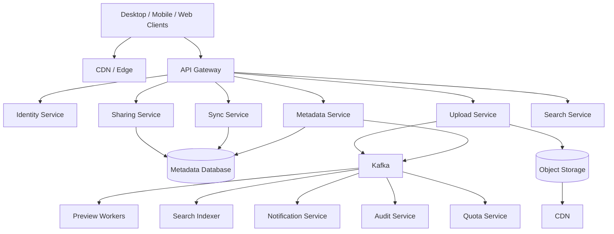
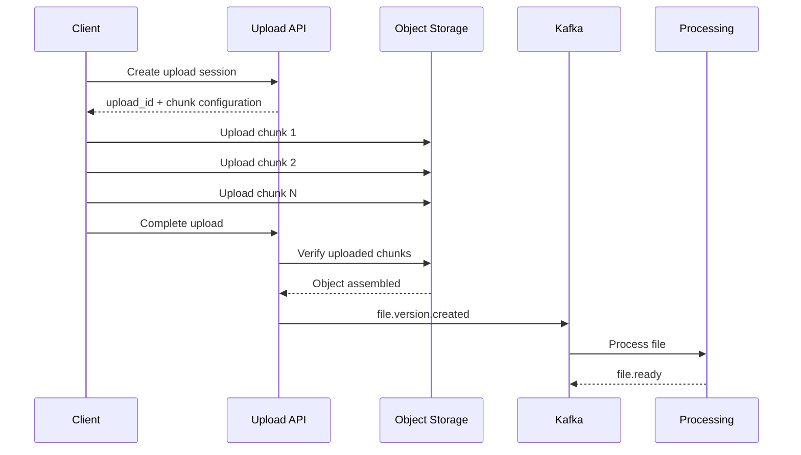
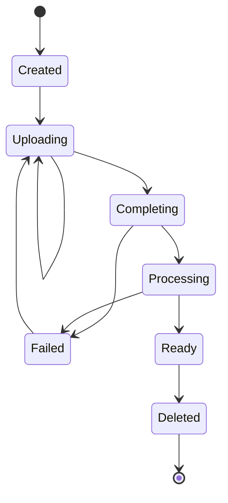
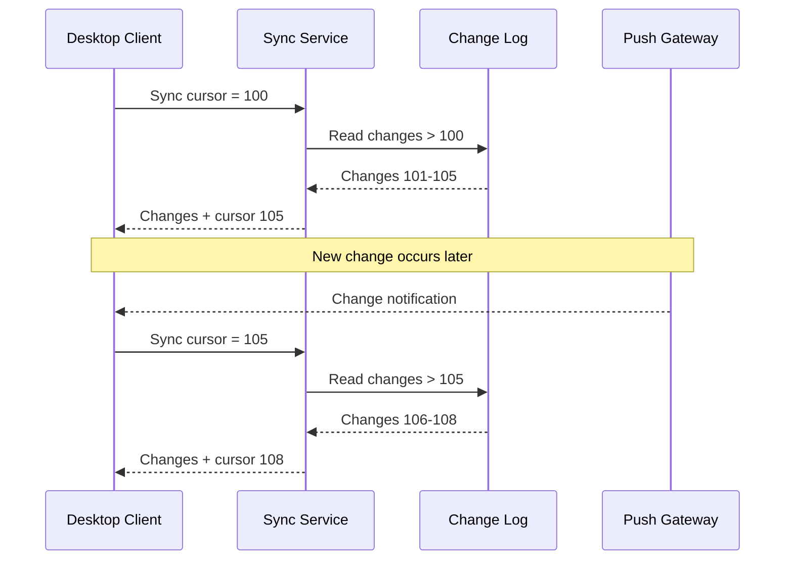
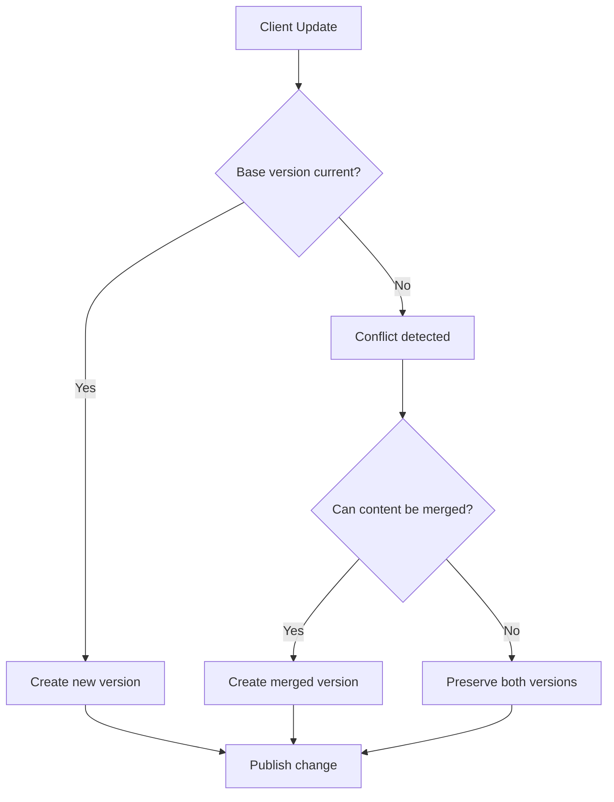
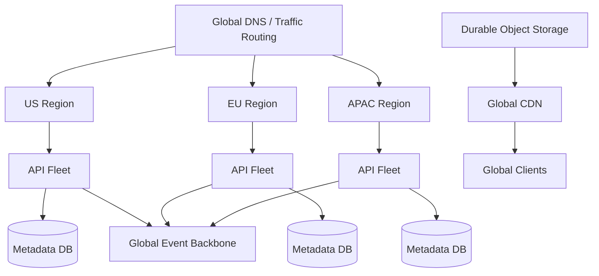

# 14- Dropbox

## Overview

Dropbox is a useful system-design case study because its core workload is fundamentally different from a typical CRUD application. The system must reliably store, synchronize, version, and distribute potentially very large files across many devices while maintaining metadata, access control, sharing, and conflict resolution.

The central design problem is:

> How do we build a globally distributed file storage and synchronization platform that can efficiently upload large files, synchronize changes across devices, preserve versions, support sharing, and remain reliable when clients and networks are unreliable?

The architecture must separate:

- File metadata from file contents.
- Small metadata operations from large binary transfers.
- Durable storage from caches.
- Synchronous user operations from asynchronous processing.
- File identity from file versions.
- File synchronization from file discovery.
- Authoritative state from derived state.

A useful high-level architecture is:

```text
                         Dropbox Clients
                    /        |        \
                   /         |         \
             Desktop      Mobile       Web
                   \         |         /
                    \        |        /
                     API / Sync Gateway
                           |
          +----------------+----------------+
          |                |                |
      Metadata          Sync Service     Sharing
          |                |                |
     Metadata DB      Change Log        Permissions
          |                |                |
          +----------------+----------------+
                           |
                      Object Storage
                           |
                         CDN
```

The most important engineering challenges are:

- Large-file uploads and downloads.
- Incremental synchronization.
- Content hashing and deduplication.
- Versioning.
- Conflict detection.
- Offline clients.
- Resumable transfers.
- Metadata consistency.
- Access control.
- Storage durability.
- High availability.
- Efficient bandwidth utilization.

## Requirements

### Functional Requirements

The system should support:

- User registration and authentication.
- File upload.
- File download.
- Folder creation.
- Folder hierarchy.
- File rename.
- File move.
- File deletion.
- File restoration.
- File version history.
- File synchronization across devices.
- Offline changes.
- Sharing files.
- Sharing folders.
- Permission management.
- Link-based sharing.
- Search.
- File previews.
- Storage quotas.
- Trash/recycle bin.
- Activity history.

Advanced functionality may include:

- Team workspaces.
- Collaborative editing.
- Comments.
- Real-time collaboration.
- Selective sync.
- Smart sync.
- Enterprise audit logs.
- Data-loss prevention.
- Legal holds.

### Non-Functional Requirements

Illustrative targets:

| Requirement | Example Target |
|---|---:|
| Metadata API p95 | < 200 ms |
| Sync notification latency | < 2 seconds |
| Small-file upload latency | < 1 second where network permits |
| Large-file transfer | Resumable |
| Metadata availability | 99.99%+ |
| File durability | Extremely high |
| Download availability | 99.99%+ |
| Horizontal scalability | Required |
| Multi-device synchronization | Required |
| Offline operation | Required |

The exact numbers should be selected from product requirements and expected workload rather than assumed universally.

## Scale Assumptions

Consider an illustrative deployment:

```text
100 million active users
50 million active devices
10 billion files
1 PB+ logical file storage
Millions of metadata operations/minute
Large-file uploads and downloads
```

The important observation is that file size is highly skewed.

A typical workload may contain:

```text
Many small files
+
Some large files
+
A small number of extremely large files
```

The architecture should therefore optimize transfer mechanisms according to object size rather than treating every file identically.

## Core Services

A production architecture can use the following logical services:

| Service | Responsibility |
|---|---|
| Identity Service | Authentication and account identity |
| Metadata Service | Files, folders, versions, ownership |
| Sync Service | Change detection and device synchronization |
| Upload Service | Upload sessions and chunk coordination |
| Download Service | Authorized download URLs |
| Storage Service | Object-storage abstraction |
| Sharing Service | Shared links and permissions |
| Search Service | Filename/content search |
| Preview Service | Thumbnail and preview generation |
| Notification Service | Device synchronization notifications |
| Version Service | Historical versions and restoration |
| Quota Service | Storage usage and limits |
| Audit Service | Security and administrative activity |

These are logical boundaries. A smaller deployment can implement several of them within a Django or FastAPI monolith before splitting them into independent services.

## High-Level Architecture



The central design principle is that the application layer should manage **metadata and control**, while object storage manages **file bytes**.

## File and Folder Metadata

A simplified file model:

```sql
CREATE TABLE files (
    file_id UUID PRIMARY KEY,
    owner_id UUID NOT NULL,
    parent_folder_id UUID,
    name VARCHAR(255) NOT NULL,
    current_version_id UUID,
    status VARCHAR(32) NOT NULL,
    created_at TIMESTAMPTZ NOT NULL,
    updated_at TIMESTAMPTZ NOT NULL
);
```

A folder can be represented similarly:

```sql
CREATE TABLE folders (
    folder_id UUID PRIMARY KEY,
    owner_id UUID NOT NULL,
    parent_folder_id UUID,
    name VARCHAR(255) NOT NULL,
    created_at TIMESTAMPTZ NOT NULL,
    updated_at TIMESTAMPTZ NOT NULL
);
```

Production schemas require additional constraints and indexes for:

- Ownership.
- Parent-child traversal.
- Name uniqueness.
- Soft deletion.
- Sharing.
- Versioning.
- Concurrent updates.

## Why Metadata and File Content Must Be Separated

A metadata database is optimized for operations such as:

```text
Get file metadata
Rename file
Move file
List folder
Check permissions
Create version
Record deletion
```

Object storage is optimized for:

```text
PUT large object
GET large object
Store huge volumes
Serve immutable objects
```

Trying to use the metadata database for both workloads creates unnecessary coupling.

The architecture should look like:

```text
                 Metadata
                    |
              PostgreSQL /
             distributed DB
                    |
                    |
File bytes ---------+
                    |
              Object Storage
```

## File Identity vs File Version

A file and a file version should not be treated as the same entity.

For example:

```text
file_id = file_123

version 1
version 2
version 3
```

The logical file remains:

```text
file_123
```

while each modification produces a new version.

A simplified version table:

```sql
CREATE TABLE file_versions (
    version_id UUID PRIMARY KEY,
    file_id UUID NOT NULL,
    content_hash VARCHAR(128) NOT NULL,
    object_key TEXT NOT NULL,
    size_bytes BIGINT NOT NULL,
    created_at TIMESTAMPTZ NOT NULL,
    created_by UUID NOT NULL
);
```

This separation makes:

- Version history.
- Restoration.
- Conflict resolution.
- Deduplication.

significantly easier.

## Content-Addressed Storage

A powerful storage technique is to identify file content using a cryptographic hash.

For example:

```text
SHA-256(file bytes)
        |
        v
9f86d081884c...
```

The object key can incorporate the content hash:

```text
objects/9f/86/9f86d081884c...
```

Advantages:

- Identical content can be deduplicated.
- Objects become naturally immutable.
- Integrity can be verified.
- Versions can reference the same underlying object.
- Cacheability improves.

The metadata layer can map:

```text
file version
      |
      v
content hash
      |
      v
object storage
```

## Deduplication

Suppose two files contain exactly the same bytes:

```text
file-A -> hash H1
file-B -> hash H1
```

Only one physical object needs to exist:

```text
H1 -> object
```

Both versions reference it.

This can substantially reduce storage usage for:

- Repeated uploads.
- Duplicate files.
- Multiple versions.
- Shared content.

However, deduplication should be designed carefully because it can expose information if attackers can determine whether a particular object already exists.

Do not expose global content existence checks to untrusted clients.

## Chunked Uploads

Large files should not be uploaded as one enormous HTTP request.

Instead:

```text
File
 |
 +--> Chunk 1
 +--> Chunk 2
 +--> Chunk 3
 +--> ...
 +--> Chunk N
```

For example:

```text
1 GB file
10 MB chunks
100 chunks
```

If chunk 73 fails, only chunk 73 needs to be retransmitted.

## Chunk Upload Lifecycle



## Resumable Uploads

The client should persist upload state:

```text
upload_id
file_id
chunk_size
uploaded_chunks
checksum
```

If the device loses connectivity:

```text
Resume upload
     |
     v
Query uploaded chunks
     |
     v
Upload missing chunks
```

This is essential for:

- Mobile networks.
- Large files.
- Unreliable connections.
- Background synchronization.

## Multipart Upload

Cloud object storage commonly supports multipart upload semantics.

Conceptually:

```text
Create multipart upload
        |
        +--> Upload part 1
        +--> Upload part 2
        +--> Upload part N
        |
        v
Complete multipart upload
```

Advantages:

- Parallel upload.
- Retry individual parts.
- Better large-file throughput.
- Reduced impact of transient failures.

Abandoned upload sessions must be cleaned up using lifecycle policies.

## Upload Integrity

The client can calculate:

```text
chunk checksum
+
whole-file checksum
```

The server/storage layer can validate these values.

This detects:

- Corruption.
- Truncated uploads.
- Incorrect chunks.
- Transfer errors.

Never assume:

```text
HTTP 200 = file integrity guaranteed
```

## Upload State Machine



Explicit states make retries and recovery much easier to reason about.

## Download Architecture

A download should usually avoid passing file bytes through the application servers.

```text
Client
   |
   v
API
   |
   +--> Authenticate
   +--> Authorize
   +--> Resolve version
   |
   v
Signed CDN / Object URL
   |
   v
Client
```

This prevents the API fleet from becoming a bandwidth bottleneck.

## Signed Download URLs

For private files, the API can issue a short-lived signed URL.

Example:

```json
{
  "file_id": "file_123",
  "version_id": "version_7",
  "download_url": "https://cdn.example.com/signed/...",
  "expires_at": "2026-08-23T15:30:00Z"
}
```

The application controls authorization while the CDN/object-storage layer handles the actual bytes.

## CDN

CDN delivery is useful for:

- Public shared links.
- File previews.
- Thumbnails.
- Frequently downloaded files.
- Static file representations.

For private content, the CDN should enforce authorization through signed URLs, signed cookies, or an equivalent access-control mechanism.

## Cacheability

Immutable versioned objects are excellent CDN candidates.

For example:

```text
/files/9f86/9f86d081.../v1.bin
```

If the content never changes, the system can use long cache lifetimes.

Instead of overwriting:

```text
/files/report.pdf
```

prefer immutable object identities.

## Synchronization

Synchronization is the central Dropbox problem.

Suppose a user has:

```text
Laptop
Desktop
Phone
```

and modifies a file on the laptop.

The system must determine:

```text
What changed?
Who needs the change?
What version is authoritative?
Did another device modify the same file?
```

A synchronization system therefore needs:

- Change tracking.
- Version identifiers.
- Device cursors.
- Conflict detection.
- Durable change logs.
- Efficient notifications.

## Change Log

A synchronization-friendly architecture can maintain a durable change log:

```text
change_id
user_id
file_id
operation
version_id
timestamp
```

Example:

```text
1001 file_123 CREATE version_1
1002 file_456 UPDATE version_3
1003 file_123 DELETE version_2
1004 file_123 UPDATE version_3
```

Clients maintain a cursor:

```text
last_seen_change_id = 1002
```

and request:

```http
GET /v1/sync?cursor=1002
```

The server returns changes after that cursor.

## Sync Cursor

The cursor should be opaque to clients.

Conceptually:

```text
Client cursor
     |
     v
Change Service
     |
     v
Changes after cursor
     |
     v
New cursor
```

Example response:

```json
{
  "changes": [
    {
      "change_id": "1003",
      "file_id": "file_123",
      "operation": "delete"
    },
    {
      "change_id": "1004",
      "file_id": "file_123",
      "operation": "update",
      "version_id": "version_3"
    }
  ],
  "next_cursor": "1004",
  "has_more": false
}
```

## Why a Change Log Is Better Than Re-Scanning Folders

Without a change log, a client might need to repeatedly ask:

```text
List all files
Compare metadata
Detect differences
```

This becomes expensive as the file tree grows.

With a change log:

```text
Only changed objects are returned.
```

This dramatically reduces:

- Database queries.
- Network traffic.
- Client CPU.
- Synchronization latency.

## Sync Notifications

Polling alone creates unnecessary load.

A better architecture combines:

```text
Long polling / WebSocket / push notification
+
durable change log
```

The notification says:

```text
Something changed.
```

The client then uses its cursor to retrieve the authoritative changes.

This is important because the notification itself should not be treated as the source of truth.

## Sync Sequence



## Offline Clients

Clients may remain offline for:

```text
minutes
hours
days
weeks
```

The server must therefore retain enough change history for clients to catch up.

If the requested cursor is too old:

```text
cursor expired
```

the server can return:

```http
409 Conflict
```

or a dedicated sync-reset response instructing the client to perform a full reconciliation.

## Full Reconciliation

A full reconciliation should not necessarily transfer file contents.

It can first synchronize metadata:

```text
Server file tree
       |
       v
Client metadata
       |
       v
Compare hashes / versions
       |
       v
Download only missing content
```

This is substantially cheaper than blindly downloading everything.

## File Hashes on the Client

The desktop client can calculate a content hash:

```text
local file
    |
    v
hash
    |
    v
metadata
```

If:

```text
local hash == server hash
```

the content does not need to be transferred.

This makes synchronization bandwidth-efficient.

## Conflict Detection

Consider:

```text
Laptop:
file.txt -> version 10

Desktop:
file.txt -> version 10
```

Both devices modify the file independently.

Laptop produces:

```text
version 11A
```

Desktop produces:

```text
version 11B
```

The server cannot blindly accept both as:

```text
version 11
```

because the versions have diverged.

## Optimistic Concurrency

A client can submit:

```text
base_version = 10
new_content = ...
```

The server checks:

```text
current_version == base_version
```

If true:

```text
accept update
```

If false:

```text
conflict
```

Example:

```http
PUT /v1/files/file_123

{
  "base_version": 10,
  "content_hash": "abc123"
}
```

If the server is already at version 11:

```text
base_version != current_version
```

and the update requires conflict handling.

## Conflict Resolution

For binary files:

```text
version 11A
version 11B
```

automatic merging is usually impossible.

The system can preserve both:

```text
file.txt
file (conflicted copy).txt
```

This is safer than silently overwriting one user's changes.

For structured documents, application-specific merge logic may be possible.

## Conflict Resolution Strategy



## File Deletion

Deletion should generally be modeled as metadata state rather than immediately destroying bytes.

For example:

```text
ACTIVE
DELETED
PURGED
```

A delete operation can create a tombstone:

```text
file_id = file_123
state = DELETED
deleted_at = ...
```

The tombstone is important for synchronization.

Without it, an offline client might incorrectly re-upload an old copy.

## Tombstones

Suppose:

```text
Server deletes file A.
```

A device that was offline still has:

```text
file A
```

When it reconnects, the server needs to communicate:

```text
file A was deleted
```

A tombstone provides that information.

Tombstones should remain available long enough for supported offline clients to observe the deletion.

## Trash and Permanent Deletion

Separate:

```text
logical deletion
```

from:

```text
physical deletion
```

A file can move through:

```text
ACTIVE
   |
   v
TRASHED
   |
   v
PURGED
```

This supports:

- Recovery.
- User expectations.
- Compliance policies.
- Delayed physical deletion.
- Background garbage collection.

## Garbage Collection

Content-addressed storage introduces an important problem.

Suppose:

```text
version 1 -> hash A
version 2 -> hash B
```

After deleting version 1:

```text
hash A
```

may no longer be referenced.

A background garbage collector can identify unreferenced objects.

However, never immediately delete an object merely because one metadata record disappeared.

Use a grace period to protect against:

- Delayed transactions.
- Replication lag.
- Restore operations.
- Race conditions.
- Incomplete metadata updates.

## Reference Counting

A storage layer can maintain:

```text
content_hash
reference_count
```

but reference counting alone can become difficult under distributed failures.

A safer design may combine:

```text
logical references
+
periodic mark-and-sweep verification
+
grace period
```

for high-value data.

## Sharing

Users can share:

- Individual files.
- Folders.
- Links.

A permission model can contain:

```text
owner
editor
viewer
commenter
```

For each resource:

```text
principal
resource
permission
```

Example:

```sql
CREATE TABLE permissions (
    resource_id UUID NOT NULL,
    principal_id UUID NOT NULL,
    permission VARCHAR(32) NOT NULL,
    created_at TIMESTAMPTZ NOT NULL,
    PRIMARY KEY (resource_id, principal_id)
);
```

Production systems need to account for inherited folder permissions.

## Folder Permission Inheritance

Consider:

```text
Shared Folder
    |
    +--> report.pdf
    +--> invoices/
          |
          +--> invoice-001.pdf
```

A permission on the folder may apply to descendants.

The authorization system therefore needs efficient inheritance evaluation.

Possible approaches include:

- Materialized permissions.
- Path-based authorization.
- Hierarchical ACLs.
- Cached authorization decisions.

The correct approach depends on scale and consistency requirements.

## Shared Links

A shared link can be represented as:

```text
token
resource_id
permission
expiration
password requirement
created_by
status
```

Example:

```text
https://files.example.com/s/7JxK2...
```

The token should be:

- High entropy.
- Non-sequential.
- Revocable.
- Expirable where required.

Do not use:

```text
/s/12345
```

where enumeration could reveal resources.

## Link Security

Depending on the product requirements, shared links may support:

- Expiration.
- Password protection.
- Download restrictions.
- Access logging.
- Revocation.
- Domain restrictions.
- User authentication.

A shared link is an authorization mechanism and must be treated accordingly.

## Search

Search should operate on metadata rather than scanning object storage.

Useful fields include:

```text
filename
folder name
owner
created_at
updated_at
file type
tags
content metadata
```

A search engine such as OpenSearch can index these fields.

The indexing pipeline:

```text
Metadata change
      |
      v
Kafka
      |
      v
Search Indexer
      |
      v
OpenSearch
```

Search is generally eventually consistent.

## File Content Search

Searching inside documents introduces another pipeline:

```text
File uploaded
    |
    v
Text extraction
    |
    v
Normalization
    |
    v
Search index
```

Different formats require different extraction engines.

This processing should be asynchronous.

## Preview Generation

Preview generation is also asynchronous.

For images:

```text
Original
   |
   +--> thumbnail
   +--> preview
```

For documents:

```text
PDF / Office document
        |
        v
Renderer
        |
        +--> preview pages
        +--> thumbnails
```

For video:

```text
Video
  |
  +--> poster image
  +--> preview stream
```

The original file should remain authoritative.

## Metadata Consistency

A critical operation is:

```text
Create file metadata
+
Store object
+
Create version
```

These operations span different systems.

Do not assume distributed transactions are available across:

```text
PostgreSQL
+
S3
+
Kafka
```

Instead use explicit workflows.

## Transactional Outbox

A useful pattern is:

```text
Database transaction
      |
      +--> file metadata
      +--> outbox event
```

After commit:

```text
Outbox
   |
   v
Kafka
```

This prevents:

```text
database committed
but event lost
```

Example:

```sql
BEGIN;

INSERT INTO file_versions (...);

INSERT INTO outbox_events (
    event_id,
    event_type,
    aggregate_id,
    payload
);

COMMIT;
```

A worker publishes the outbox event to Kafka.

## Why the Outbox Pattern Matters

Without an outbox:

```text
DB commit
   |
   v
publish Kafka
```

can fail between the two operations.

The system may then contain:

```text
file exists
but
downstream services do not know
```

The outbox makes the event durable with the state transition.

## Event Processing

Consumers should be idempotent.

For example:

```text
event_id = evt_123
```

If the consumer receives it twice:

```text
first delivery -> process
second delivery -> ignore
```

A deduplication store or unique database constraint can enforce this.

## Kafka Event Example

```json
{
  "event_id": "evt_01JXYZ",
  "event_type": "file.version.created",
  "aggregate_id": "file_123",
  "occurred_at": "2026-08-23T15:00:00Z",
  "payload": {
    "version_id": "version_7",
    "content_hash": "sha256:abc123",
    "size_bytes": 10485760
  }
}
```

Events should contain enough information for consumers without requiring excessive synchronous calls back to the producer.

## Storage Durability

File storage is user data and should have extremely strong durability guarantees.

Use:

- Redundant storage.
- Cross-zone replication.
- Versioning where appropriate.
- Backup or replication strategy.
- Integrity validation.
- Lifecycle policies.
- Recovery testing.

The metadata and content planes should have independently defined recovery objectives.

## Disaster Recovery

Authoritative state includes:

```text
Users
Files
Folders
Versions
Permissions
Sharing
Metadata
```

Derived state includes:

```text
Search indexes
Previews
Caches
Notifications
Feed-like change caches
```

The recovery strategy should distinguish these categories.

Derived state can often be rebuilt.

Authoritative state cannot.

## Recovery Objectives

Define:

```text
RPO = maximum acceptable data loss
RTO = maximum acceptable recovery time
```

For user files, the RPO should generally be extremely low.

For search:

```text
higher RPO may be acceptable
```

because the index can be reconstructed.

## Global Architecture

A multi-region design may look like:



The actual topology depends heavily on:

- Data residency.
- Regulatory requirements.
- Latency requirements.
- Cross-region replication capabilities.
- Cost.
- Failure isolation.

## Strong vs Eventual Consistency

Not every Dropbox operation requires the same consistency level.

| Workload | Consistency |
|---|---|
| File ownership | Strong |
| Permission changes | Strong |
| File version creation | Strong |
| Current file metadata | Strong |
| Sync change log | Ordered / durable |
| Search | Eventual |
| Preview generation | Eventual |
| Storage usage counters | Eventual where acceptable |
| Analytics | Eventual |
| Notifications | Eventual |
| Garbage collection | Eventual |

Authorization decisions should not rely on stale permission state.

## Caching

Redis can cache:

```text
User metadata
Folder metadata
Permission decisions
Upload session state
Hot file metadata
Shared-link metadata
```

Do not treat Redis as the authoritative file metadata store unless the entire system is explicitly designed around that consistency model.

## Cache Invalidation

For mutable metadata:

```text
Database
    |
    v
Event
    |
    v
Cache invalidation
```

For immutable content:

```text
Content-addressed object
        |
        v
Long-lived CDN cache
```

The second approach is significantly simpler.

## Hot Files

A highly shared file can become a hot object.

Without caching:

```text
Millions of clients
       |
       v
Object storage
```

With CDN:

```text
Millions of clients
       |
       v
CDN edge
       |
       +--> Cache hit
       |
       +--> Origin on miss
```

This reduces origin load dramatically.

## Rate Limiting

Rate limits should protect:

```text
Login
Upload session creation
Metadata mutation
File listing
Search
Shared-link creation
Download URL generation
API requests
```

Large file uploads should also have:

- Per-user quotas.
- Per-device limits.
- Concurrent upload limits.
- Maximum object size.

Rate limiting protects both reliability and cost.

## Storage Quotas

A quota system tracks:

```text
logical usage
physical usage
allocated capacity
```

Deduplication makes quota semantics important.

For example:

```text
Two files
same content
```

may consume:

```text
1 physical object
```

but represent:

```text
2 logical user files
```

The product must define whether quotas are based on logical or physical usage.

Usually user-visible quota should follow product semantics rather than internal deduplication details.

## Background Jobs

Asynchronous workloads include:

- Preview generation.
- Search indexing.
- Malware scanning.
- Garbage collection.
- Storage reconciliation.
- Notification delivery.
- Audit processing.
- Quota recalculation.

Celery can be suitable for moderate background workloads.

Kafka consumers are preferable when the workload requires:

- High throughput.
- Durable event streams.
- Multiple independent consumers.
- Replay.
- Ordered partition processing.

## Queue Backpressure

Suppose:

```text
10 million files uploaded
```

and preview processing capacity is lower than the arrival rate.

The queue grows:

```text
Incoming
  |
  v
Kafka
  |
  +--> Preview workers
  |
  +--> Search workers
  |
  +--> Malware workers
```

Monitor:

```text
consumer lag
queue depth
oldest event age
worker utilization
failure rate
retry count
```

Do not blindly increase worker counts if the downstream database or storage system is the actual bottleneck.

## Observability

### API Metrics

Track:

```text
request rate
error rate
p50
p95
p99
timeouts
```

### Synchronization Metrics

Track:

```text
sync latency
change-log lag
cursor failures
full reconciliation rate
conflict rate
notification latency
```

### Storage Metrics

Track:

```text
upload throughput
download throughput
storage utilization
object count
failed uploads
multipart upload failures
orphaned objects
```

### Processing Metrics

Track:

```text
preview latency
virus-scan latency
transcoding latency
search-indexing lag
Kafka consumer lag
```

### Business Metrics

Track:

```text
sync success rate
files uploaded
files downloaded
conflicts
storage growth
shared links created
active devices
```

## Distributed Tracing

A synchronization request may traverse:

```text
Client
  |
  v
API Gateway
  |
  v
Sync Service
  |
  +--> Metadata DB
  |
  +--> Change Log
  |
  +--> Permission Cache
```

An upload may traverse:

```text
Client
  |
  v
Upload API
  |
  v
Object Storage
  |
  v
Kafka
  |
  +--> Preview
  +--> Search
  +--> Malware Scan
  +--> Audit
```

Use:

```text
trace_id
request_id
event_id
file_id
version_id
upload_id
```

to correlate operations.

## Structured Logging

Example:

```json
{
  "event": "sync.completed",
  "user_id": "user_123",
  "device_id": "device_456",
  "cursor_start": "1000",
  "cursor_end": "1035",
  "changes": 35,
  "duration_ms": 82
}
```

Never log:

- Passwords.
- Authentication tokens.
- Private file contents.
- Sensitive signed URLs.
- Encryption keys.

## Security Considerations

A production file-storage platform should implement:

- TLS everywhere.
- Encryption at rest.
- Strong authentication.
- Short-lived signed URLs.
- Object ownership validation.
- Authorization checks.
- Access revocation.
- Audit logging.
- Malware scanning.
- Abuse detection.
- Rate limiting.
- Secret management.
- Key rotation.

### Path Traversal

Never trust user-provided paths.

For example:

```text
../../private/file
```

must not become a storage key directly.

Prefer generated object keys:

```text
objects/{content_hash}
```

and store user-visible names separately in metadata.

### MIME Type Validation

Do not trust only:

```http
Content-Type: image/png
```

because clients can provide incorrect MIME types.

Validate:

- File signature.
- Content structure.
- Declared MIME type.
- File extension where useful.
- Malware status.

## Common Mistakes and Pitfalls

### Store Files Directly in PostgreSQL

This couples large binary traffic to transactional infrastructure.

Use object storage.

### Upload Entire Files Through the API Server

This consumes application bandwidth and connection resources.

Use direct multipart uploads.

### No Resumable Uploads

Large uploads will fail unnecessarily on unstable networks.

Use upload sessions and chunk-level retries.

### Treat the Notification as the Source of Truth

Push notifications can be lost.

Use a durable change log and cursors.

### No Version Numbers

Without versions, conflict detection becomes unreliable.

Use explicit version identifiers or revision numbers.

### Delete Objects Immediately

Immediate physical deletion can break:

- Offline synchronization.
- Recovery.
- Concurrent operations.
- Version history.

Use tombstones and delayed garbage collection.

### Use File Paths as Object Identity

Paths change when files are renamed or moved.

Use stable IDs:

```text
file_id
version_id
content_hash
```

instead.

### Ignore Content Deduplication

Duplicate content can create significant storage waste.

Use content-addressed storage when its security and consistency implications are understood.

### Rely on Reference Counting Alone

Distributed failures can make counters inaccurate.

Use reconciliation and garbage-collection grace periods.

### Make Every Operation Synchronous

Preview generation, indexing, malware scanning, notifications, and analytics should not block core metadata operations.

### Use a Single Global Metadata Database Without a Growth Plan

Cross-region latency, failure domains, and database capacity can become major constraints.

Design partitioning and replication boundaries around actual access patterns.

### Ignore Offline Clients

Desktop and mobile clients can reconnect after long periods.

Support cursors, retained change history, tombstones, and full reconciliation.

### Use Offset Pagination for Change Logs

Offsets become expensive and unstable at large scale.

Use durable cursors.

### Allow Arbitrary Object Keys

This can create authorization and isolation problems.

Generate storage keys server-side.

### Assume Object Storage and Database Are One Transaction

They are not.

Use explicit workflows, transactional outbox patterns, reconciliation, and idempotency.

## Interview Traps

### Is Dropbox Primarily a File Upload Problem?

No.

The harder problems are:

```text
Synchronization
+
Versioning
+
Conflict resolution
+
Offline clients
+
Large-file transfer
+
Metadata consistency
+
Access control
+
Durable storage
```

### Why Use Object Storage?

Because object storage scales independently for large binary objects and provides high durability without consuming transactional database resources.

### Why Use Chunked Uploads?

A large file may fail after transferring hundreds of megabytes.

Chunking allows:

```text
retry only failed chunks
```

instead of restarting the entire transfer.

### Why Are File IDs Better Than Paths?

Paths change.

For example:

```text
/photos/2026/report.pdf
```

can become:

```text
/archive/report.pdf
```

The logical file should retain its identity.

### How Does Synchronization Work?

Use:

```text
durable change log
+
client cursor
+
push notification
+
metadata reconciliation
```

The push signal wakes the client, while the change log provides authoritative state.

### How Do You Handle Offline Devices?

Retain change history long enough for supported clients to catch up.

If the cursor is too old:

```text
full metadata reconciliation
```

can rebuild the client's local state.

### How Do You Detect Conflicts?

Use optimistic concurrency:

```text
client base_version
        vs
server current_version
```

If they differ, the update conflicts.

### How Do You Resolve Binary File Conflicts?

Do not silently overwrite.

Preserve both versions and create a conflict copy when automatic merging is impossible.

### How Do You Avoid Losing Events?

Use:

```text
database transaction
+
transactional outbox
+
Kafka
+
idempotent consumers
```

### What Happens if the Search Service Goes Down?

File operations should continue.

Search becomes stale until indexing catches up.

### What Happens if Redis Goes Down?

Redis should contain derived/cache state wherever possible.

The system should fall back to authoritative metadata stores or rebuild cache state.

### What Happens if Preview Generation Is Slow?

The file should still be stored successfully.

Preview generation is asynchronous and independently scalable.

### How Do You Handle a Viral Shared File?

Use:

```text
CDN
+
immutable object versions
+
signed URLs
+
origin protection
```

so millions of downloads do not reach the application servers.

### What Is the Most Important Architectural Boundary?

Separate:

```text
metadata
+
binary content
+
synchronization
+
derived processing
```

Each has different scaling, consistency, and failure characteristics.

## Key Takeaways

- **Separate metadata from file content: keep file state, permissions, and versions in metadata storage while storing large binary objects in durable object storage.**
- **Build synchronization around durable change logs, client cursors, version numbers, tombstones, and push notifications rather than repeatedly scanning entire file trees.**
- **Use chunked, resumable, content-addressed uploads to improve reliability, bandwidth efficiency, integrity, and deduplication for large files.**
- **Treat offline synchronization and concurrent edits as first-class distributed-system problems using optimistic concurrency, conflict preservation, idempotent processing, and explicit reconciliation.**
- **Keep expensive derived workloads such as previews, search indexing, malware scanning, notifications, and garbage collection asynchronous so core file operations remain reliable and low latency.**