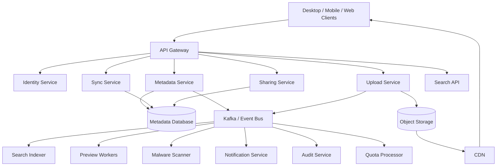
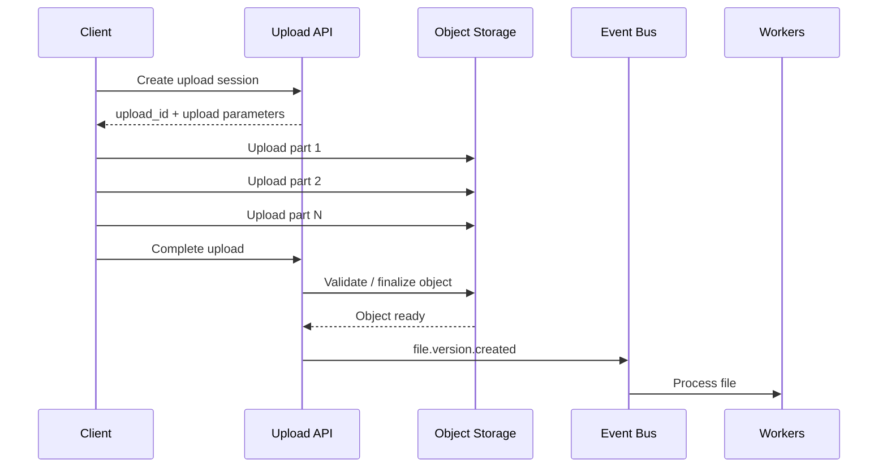
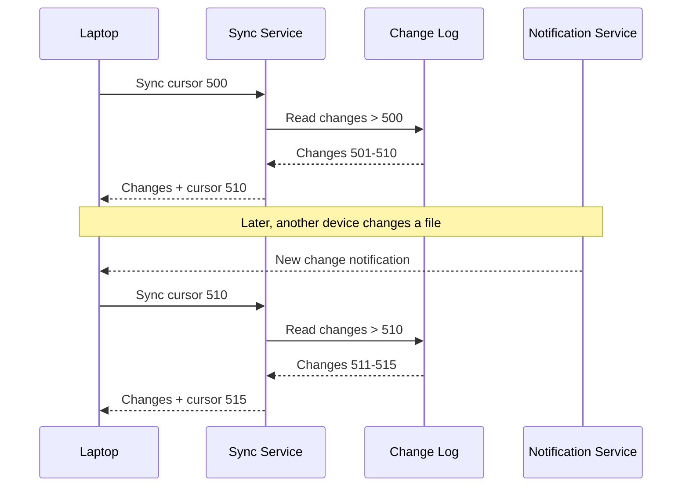
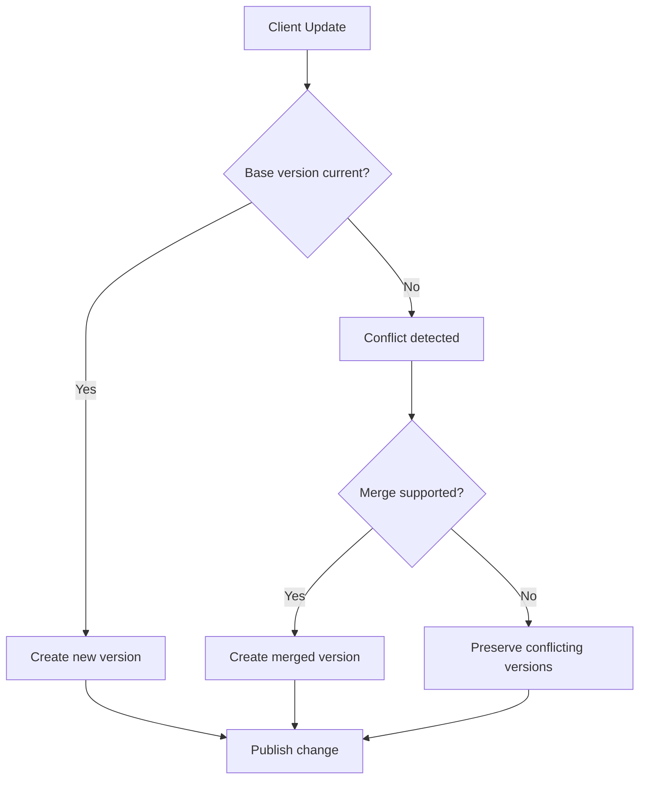
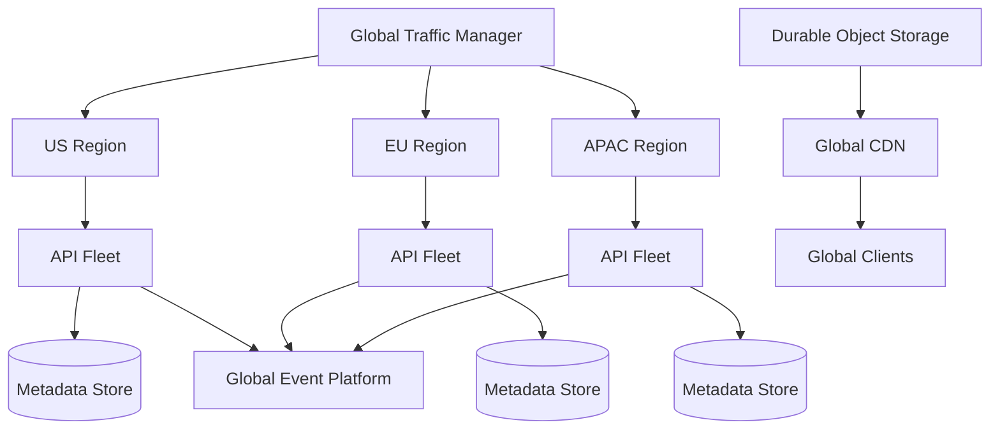

# 15- Google Drive

## Overview

Google Drive is a useful system-design case study because it combines several difficult distributed-system workloads into one platform: large-scale file storage, synchronization, hierarchical metadata, sharing, permissions, search, versioning, previews, offline clients, and collaborative editing.

The central architectural challenge is not simply storing files. A production system must coordinate:

- Large binary objects.
- Mutable metadata.
- File and folder hierarchies.
- Multiple devices per user.
- Offline modifications.
- Concurrent updates.
- Permissions and sharing.
- Version history.
- Search indexing.
- Preview generation.
- Storage quotas.
- Background processing.
- High availability and disaster recovery.

A useful mental model is to divide the platform into four planes:

| Plane | Responsibility |
|---|---|
| Control plane | Authentication, metadata, permissions, quotas |
| Data plane | File upload/download and object storage |
| Synchronization plane | Change tracking, device cursors, conflict handling |
| Derived-data plane | Search, previews, thumbnails, analytics |

The most important design principle is:

> Keep authoritative metadata and file contents separate, and make expensive derived processing asynchronous.

A simplified architecture is:

```text
                           Clients
                +------------+------------+
                |            |            |
             Desktop       Mobile       Web
                |            |            |
                +------------+------------+
                             |
                       API / Sync Gateway
                             |
          +------------------+------------------+
          |                  |                  |
      Metadata            Sync              Sharing
          |                  |                  |
      Database          Change Log         Permissions
          |                  |                  |
          +------------------+------------------+
                             |
                      Object Storage
                             |
                            CDN
                             |
                          Downloads

                             |
                           Events
                             |
          +------------------+------------------+
          |                  |                  |
       Search            Preview          Malware Scan
       Indexing          Generation
```

## Requirements

### Functional Requirements

The system should support:

- User authentication.
- File upload and download.
- Folder creation.
- Nested folders.
- File rename and move.
- File deletion.
- Trash and restoration.
- File version history.
- Multi-device synchronization.
- Offline clients.
- File and folder sharing.
- Permission management.
- Shared links.
- Search.
- File previews.
- Thumbnails.
- Storage quotas.
- Activity history.

Advanced functionality can include:

- Real-time document collaboration.
- Comments.
- Shared drives.
- Team workspaces.
- Enterprise audit logs.
- Data-loss prevention.
- Legal holds.
- Administrative controls.

### Non-Functional Requirements

Illustrative requirements:

| Requirement | Target |
|---|---:|
| Metadata API p95 | < 200 ms |
| Sync notification latency | < 2 seconds |
| Metadata availability | 99.99%+ |
| File durability | Extremely high |
| Download availability | 99.99%+ |
| Large-file support | Required |
| Resumable upload | Required |
| Multi-device sync | Required |
| Offline operation | Required |
| Horizontal scalability | Required |

The exact targets should be derived from product requirements, traffic patterns, and business SLAs.

## Scale Assumptions

For system-design estimation, consider an illustrative workload:

```text
Hundreds of millions of users
Billions of files
Millions of active devices
Petabytes of logical storage
Millions of metadata operations per minute
Large numbers of file transfers
Highly skewed file-size distribution
```

File sizes are not uniformly distributed.

A realistic workload contains:

```text
Many small files
        +
Medium documents
        +
Large media files
        +
Occasional extremely large objects
```

This means upload, download, metadata, and synchronization paths should be optimized independently.

## Core Components

| Component | Responsibility |
|---|---|
| API Gateway | Routing, authentication enforcement, rate limiting |
| Identity Service | User identity and authentication |
| Metadata Service | Files, folders, versions, ownership |
| Sync Service | Device synchronization and change cursors |
| Upload Service | Resumable and multipart uploads |
| Download Service | Authorization and signed URLs |
| Sharing Service | ACLs and shared links |
| Search Service | Metadata/content search |
| Preview Service | Thumbnails and previews |
| Quota Service | Storage usage and limits |
| Notification Service | Device wake-up notifications |
| Audit Service | Security and administrative events |
| Object Storage | Durable binary data |
| Event Platform | Asynchronous processing |

A smaller implementation can combine several logical services into a Django or FastAPI application. Service boundaries should follow scaling and ownership requirements rather than being created merely because the architecture diagram looks cleaner.

## High-Level Architecture



## Metadata and Binary Content

The metadata database should manage information such as:

```text
file_id
folder_id
owner_id
name
mime_type
size
current_version
permissions
created_at
updated_at
deleted_at
```

Object storage should contain:

```text
file bytes
```

Do not make the application database responsible for large-scale binary transfer unless there is a specific architectural reason.

The separation provides independent scaling:

```text
Metadata workload
        |
        v
PostgreSQL / distributed metadata store

Binary workload
        |
        v
Object storage / CDN
```

## File and Folder Identity

A file should have a stable identity independent of its path.

For example:

```text
file_id = file_123
```

The file may move from:

```text
Documents/report.pdf
```

to:

```text
Archive/2026/report.pdf
```

but:

```text
file_id = file_123
```

remains unchanged.

This simplifies:

- Sharing.
- Synchronization.
- Version history.
- Auditing.
- Move operations.
- Reference tracking.

Do not use the full path as the primary identity.

## Metadata Model

A simplified relational model:

```sql
CREATE TABLE files (
    file_id UUID PRIMARY KEY,
    owner_id UUID NOT NULL,
    parent_folder_id UUID,
    name VARCHAR(255) NOT NULL,
    mime_type VARCHAR(255),
    current_version_id UUID,
    status VARCHAR(32) NOT NULL,
    created_at TIMESTAMPTZ NOT NULL,
    updated_at TIMESTAMPTZ NOT NULL,
    deleted_at TIMESTAMPTZ
);

CREATE TABLE file_versions (
    version_id UUID PRIMARY KEY,
    file_id UUID NOT NULL,
    content_hash VARCHAR(128) NOT NULL,
    object_key TEXT NOT NULL,
    size_bytes BIGINT NOT NULL,
    created_by UUID NOT NULL,
    created_at TIMESTAMPTZ NOT NULL
);

CREATE TABLE folders (
    folder_id UUID PRIMARY KEY,
    owner_id UUID NOT NULL,
    parent_folder_id UUID,
    name VARCHAR(255) NOT NULL,
    created_at TIMESTAMPTZ NOT NULL,
    updated_at TIMESTAMPTZ NOT NULL
);
```

Production schemas also require carefully selected indexes for:

- Owner lookup.
- Parent-folder lookup.
- File listing.
- Version lookup.
- Deleted objects.
- Sharing.
- Synchronization.
- Tenant isolation.

## Folder Hierarchies

A Drive-like system requires hierarchical namespaces.

Consider:

```text
My Drive
├── Documents
│   ├── Reports
│   │   ├── 2025
│   │   └── 2026
│   └── Contracts
├── Photos
└── Projects
```

There are several ways to model hierarchical data.

| Approach | Advantages | Limitations |
|---|---|---|
| Adjacency list | Simple, natural relational model | Recursive queries for deep trees |
| Materialized path | Efficient subtree queries | Moves can be expensive |
| Nested sets | Efficient reads | Complex writes |
| Closure table | Powerful hierarchy queries | Additional storage |
| Document hierarchy | Flexible | More difficult relational constraints |

For most backend systems, an adjacency-list model combined with carefully designed queries and caching is a reasonable starting point.

## File Versioning

A logical file should be separated from its versions.

For example:

```text
file_123
   |
   +--> version_1
   +--> version_2
   +--> version_3
```

Each version can reference immutable content.

This provides:

- Historical recovery.
- Auditability.
- Conflict handling.
- Content deduplication.
- Safe rollback.

The current version is metadata:

```text
file_123.current_version_id = version_3
```

rather than a replacement of the historical records.

## Content-Addressed Storage

A content hash can identify immutable file content.

```text
file bytes
    |
    v
SHA-256
    |
    v
content_hash
```

The storage object can use:

```text
objects/{hash-prefix}/{hash}
```

For example:

```text
objects/9f/86/9f86d081884c...
```

Benefits include:

- Deduplication.
- Integrity validation.
- Immutable object identity.
- Efficient version references.
- Better caching.

The hash should not be exposed as a mechanism for arbitrary users to probe whether another user's content exists.

## Deduplication

Suppose:

```text
file A -> hash H1
file B -> hash H1
version C -> hash H1
```

Only one physical object may be necessary:

```text
H1 -> object
```

while multiple metadata records reference it.

Deduplication can significantly reduce physical storage, but quota semantics must be defined separately.

For example:

```text
Logical usage = what the user owns
Physical usage = what storage physically consumes
```

The product should normally expose a predictable quota model rather than leaking internal storage optimizations.

## Large File Uploads

Large files should not normally be sent through the application server in one request.

Instead:

```text
1 GB file
   |
   +--> chunk 1
   +--> chunk 2
   +--> chunk 3
   +--> ...
   +--> chunk N
```

Chunking allows:

- Parallel transfer.
- Partial retries.
- Resume after network failures.
- Better bandwidth utilization.
- Reduced application-server resource consumption.

## Resumable Upload Lifecycle



The client should persist enough state to resume:

```text
upload_id
file_id
part size
completed parts
checksums
```

## Multipart Upload

Cloud object storage commonly provides multipart upload semantics.

Conceptually:

```text
Create upload
      |
      +--> Part 1
      +--> Part 2
      +--> Part 3
      +--> ...
      |
      v
Complete upload
```

If part 73 fails:

```text
retry part 73
```

instead of restarting the entire object.

Abandoned multipart sessions should be cleaned up using lifecycle policies or explicit background cleanup.

## Upload Integrity

Use checksums to validate:

- Individual chunks.
- Final objects.
- End-to-end transfer integrity.

A production upload workflow should distinguish:

```text
transfer completed
```

from:

```text
content validated and metadata committed
```

This allows processing pipelines to operate safely.

## Direct-to-Object-Storage Uploads

A common architecture is:

```text
Client
   |
   v
API
   |
   +--> Authenticate
   +--> Authorize
   +--> Create upload session
   |
   v
Signed upload URL
   |
   v
Object Storage
```

The application server coordinates the operation without carrying the file bytes.

This reduces:

- CPU usage.
- Network bandwidth.
- Connection pressure.
- Application-server scaling requirements.

## Download Architecture

Downloads should similarly avoid passing large file contents through the API fleet.

```text
Client
  |
  v
API
  |
  +--> Authenticate
  +--> Authorize
  +--> Resolve file version
  |
  v
Signed URL
  |
  v
CDN / Object Storage
  |
  v
Client
```

The API controls access while the data plane handles the transfer.

## Signed URLs

A private file can be accessed using a short-lived signed URL.

Example:

```json
{
  "file_id": "file_123",
  "version_id": "version_9",
  "download_url": "https://cdn.example.com/private/...",
  "expires_at": "2026-08-23T16:00:00Z"
}
```

The URL should:

- Expire quickly.
- Be scoped to the intended object.
- Be generated only after authorization.
- Not expose long-lived credentials.

Revocation requirements should be considered carefully because a signed URL may remain usable until expiration.

## CDN Strategy

CDNs are especially effective for:

- Shared public content.
- Images.
- Video.
- Thumbnails.
- Document previews.
- Frequently accessed immutable versions.

Immutable versioned objects simplify caching:

```text
/object/{content_hash}
```

rather than repeatedly overwriting:

```text
/object/report.pdf
```

An immutable object can safely receive a long cache lifetime.

## Synchronization

The synchronization system is one of the hardest parts of Drive.

A user may have:

```text
Laptop
Desktop
Phone
Tablet
```

Each device may:

- Modify files.
- Create files.
- Delete files.
- Rename files.
- Move files.
- Remain offline.
- Reconnect later.

The server therefore needs an authoritative stream of changes.

## Change Log

A simplified change record:

```text
change_id
user_id
file_id
operation
version_id
timestamp
```

Example:

```text
1001  file_123  CREATE  version_1
1002  file_456  UPDATE  version_2
1003  file_123  DELETE
1004  file_789  MOVE
```

Clients maintain a cursor:

```text
last_seen_change_id = 1002
```

and request:

```http
GET /v1/sync?cursor=1002
```

## Sync Cursor

A cursor should be treated as an opaque token.

Example response:

```json
{
  "changes": [
    {
      "change_id": "1003",
      "file_id": "file_123",
      "operation": "delete"
    },
    {
      "change_id": "1004",
      "file_id": "file_789",
      "operation": "move"
    }
  ],
  "next_cursor": "1004",
  "has_more": false
}
```

The cursor lets the client continue from its previous synchronization position.

## Why Not Re-Scan the Entire Drive?

A naive client could repeatedly request:

```text
List every file
Compare local metadata
Detect differences
```

This becomes extremely expensive for users with:

```text
100,000+
```

objects.

A change log allows:

```text
Only changed objects
```

to be transmitted.

This reduces:

- Database work.
- Network traffic.
- Client CPU.
- Synchronization latency.

## Push Notifications

Push notifications should wake the client rather than carry the complete source of truth.

The flow is:

```text
Change committed
      |
      v
Change log
      |
      +--> notification
      |
      v
Client wakes up
      |
      v
Sync from cursor
```

The client should never assume:

```text
notification received = complete state
```

Notifications can be delayed, duplicated, or lost.

## Sync Architecture



## Offline Clients

Offline operation changes the consistency model.

A device may reconnect after:

```text
hours
days
weeks
```

The server therefore needs:

- Durable change history.
- Client cursors.
- Tombstones.
- Version numbers.
- Reconciliation logic.

If a cursor is older than the retained change-log window, the server can require a full metadata reconciliation.

## Full Reconciliation

A full reconciliation does not necessarily mean downloading every file.

A better process is:

```text
Server metadata
      |
      v
Client metadata
      |
      v
Compare IDs / versions / hashes
      |
      v
Identify missing or changed content
      |
      v
Transfer only required objects
```

This separates metadata synchronization from expensive content transfer.

## Tombstones

Deletion needs explicit representation.

Suppose:

```text
Server deletes file A.
```

An offline client still has:

```text
file A
```

When it reconnects, the client must learn that the file was deleted.

A tombstone can represent:

```text
file_id = file_A
state = DELETED
deleted_at = ...
```

Without tombstones, an offline device could incorrectly reintroduce deleted content.

## File Deletion Lifecycle

A robust lifecycle is:

```text
ACTIVE
   |
   v
TRASHED
   |
   v
PURGED
```

Logical deletion and physical object deletion should be separate operations.

This supports:

- Recovery.
- Version history.
- Offline synchronization.
- Delayed cleanup.
- Compliance requirements.

## Conflict Detection

Suppose:

```text
Laptop has version 10
Desktop has version 10
```

Both devices modify the file.

The laptop creates:

```text
version 11A
```

while the desktop creates:

```text
version 11B
```

The server needs to detect that both updates originated from version 10.

## Optimistic Concurrency

The client submits:

```json
{
  "file_id": "file_123",
  "base_version": 10,
  "content_hash": "sha256:abc123"
}
```

The server checks:

```text
current_version == base_version
```

If true:

```text
commit version 11
```

If false:

```text
conflict
```

This prevents one device from silently overwriting another device's update.

## Conflict Resolution

Binary files generally cannot be safely merged automatically.

The system can preserve both versions:

```text
report.pdf
report (conflicted copy).pdf
```

For structured data such as collaborative documents, domain-specific merge algorithms may be possible.

The important principle is:

> Preserve user data rather than silently discarding one concurrent update.

## Conflict Resolution Flow



## Sharing and Permissions

Drive requires authorization at multiple levels:

```text
User
Group
Folder
File
Shared link
Organization
```

A basic permission model can contain:

| Permission | Capabilities |
|---|---|
| Viewer | Read/download |
| Commenter | Read + comment |
| Editor | Modify |
| Owner | Full control |

The actual permission model can be significantly more complex.

## Access Control Model

A simplified permission record:

```sql
CREATE TABLE permissions (
    resource_id UUID NOT NULL,
    principal_id UUID NOT NULL,
    permission VARCHAR(32) NOT NULL,
    created_at TIMESTAMPTZ NOT NULL,
    PRIMARY KEY (resource_id, principal_id)
);
```

Production authorization must account for:

- Direct permissions.
- Inherited permissions.
- Group membership.
- Organization policies.
- Link sharing.
- Revocation.
- Ownership changes.

## Folder Permission Inheritance

Consider:

```text
Project/
├── report.pdf
├── invoices/
│   └── invoice.pdf
└── contracts/
    └── contract.pdf
```

A user granted access to:

```text
Project/
```

may inherit access to descendants.

Authorization systems can use:

- Hierarchical ACLs.
- Materialized permissions.
- Group membership caches.
- Path-based evaluation.
- Precomputed authorization state.

At large scale, authorization decisions may need caching, but security-sensitive permission changes must not depend on stale state longer than the product permits.

## Shared Links

A shared link can contain:

```text
token
resource_id
permission
expiration
password policy
created_by
status
```

Example:

```text
https://drive.example.com/s/8Xh2K...
```

Tokens should be:

- Cryptographically random.
- High entropy.
- Non-sequential.
- Revocable.
- Expirable when required.

Do not expose predictable identifiers such as:

```text
/s/12345
```

because they are vulnerable to enumeration.

## Search

Search should not scan object storage directly.

Metadata can be indexed into a search engine:

```text
PostgreSQL
    |
    v
Event Bus
    |
    v
Search Indexer
    |
    v
OpenSearch
```

Useful fields include:

```text
filename
mime type
owner
folder
created_at
updated_at
labels
text content
```

Search is typically eventually consistent.

## Content Search

Searching inside files requires asynchronous extraction.

```text
File upload
    |
    v
Content extraction
    |
    v
Text normalization
    |
    v
Search index
```

Different file types require different processing pipelines.

This work should not block the upload transaction.

## Preview Generation

Preview generation is another derived-data pipeline.

```text
Original file
      |
      +--> Thumbnail
      +--> Preview
      +--> Metadata extraction
```

For video:

```text
Video
  |
  +--> poster frame
  +--> preview representation
```

For documents:

```text
Document
   |
   v
Renderer
   |
   +--> page previews
   +--> thumbnail
```

The original object remains authoritative.

## Malware Scanning

Uploaded content may require malware inspection.

A secure workflow is:

```text
Upload
   |
   v
Quarantine / untrusted state
   |
   v
Malware scanner
   |
   +--> clean
   |      |
   |      v
   |    AVAILABLE
   |
   +--> malicious
          |
          v
       BLOCKED
```

Do not make uploaded content immediately downloadable if security policy requires scanning first.

## Event-Driven Processing

File changes should produce durable events.

Example:

```json
{
  "event_id": "evt_123",
  "event_type": "file.version.created",
  "aggregate_id": "file_123",
  "occurred_at": "2026-08-23T15:00:00Z",
  "payload": {
    "version_id": "version_9",
    "content_hash": "sha256:abc123",
    "size_bytes": 5242880
  }
}
```

Consumers can independently process:

```text
Search indexing
Preview generation
Malware scanning
Quota accounting
Notifications
Audit logging
```

## Transactional Outbox

The metadata transaction and event publication must be reliable.

A dangerous sequence is:

```text
Commit database
      |
      v
Publish Kafka event
```

If Kafka publication fails after the database commit:

```text
Database = updated
Kafka = missing event
```

A transactional outbox solves this.

```sql
BEGIN;

INSERT INTO file_versions (...);

INSERT INTO outbox_events (
    event_id,
    event_type,
    aggregate_id,
    payload
);

COMMIT;
```

A background publisher reads the outbox and publishes events.

This guarantees that the event is durably associated with the metadata transaction.

## Idempotent Consumers

Kafka and other distributed messaging systems can deliver messages more than once.

Consumers should therefore tolerate:

```text
event_123
event_123
```

For example:

```text
if event_id already processed:
    ignore
else:
    process
    record event_id
```

A database uniqueness constraint is often preferable to relying entirely on application-level checks.

## Queue Backpressure

Suppose uploads arrive faster than preview workers can process them:

```text
Upload rate
     |
     v
Kafka
     |
     v
Preview workers
```

If:

```text
arrival rate > processing rate
```

consumer lag grows.

Monitor:

- Consumer lag.
- Oldest event age.
- Queue depth.
- Processing latency.
- Failure rate.
- Retry count.

Increasing worker count without checking downstream bottlenecks can make the system less stable.

## Caching

Redis can cache:

- User metadata.
- Folder metadata.
- Permission decisions.
- Shared-link state.
- Upload session state.
- Frequently accessed file metadata.

Example:

```text
Client
  |
  v
Metadata API
  |
  v
Redis
  |
  +--> Cache hit
  |
  +--> Cache miss
          |
          v
      PostgreSQL
```

Redis should normally be treated as a cache or derived state rather than the only authoritative source for critical file metadata.

## Cache Invalidation

Mutable metadata requires careful invalidation:

```text
Database update
      |
      v
Event
      |
      v
Invalidate Redis
```

Immutable file versions are easier:

```text
content hash
     |
     v
immutable object
     |
     v
long CDN cache lifetime
```

Immutable data substantially reduces cache invalidation complexity.

## Hot Objects

A popular shared file may become extremely hot.

Without CDN:

```text
Millions of clients
       |
       v
Object storage
```

With CDN:

```text
Millions of clients
       |
       v
CDN
       |
       +--> Cache hit
       |
       +--> Origin on miss
```

This protects the origin and reduces transfer costs.

## Storage Quotas

Quota accounting needs a clear semantic definition.

Track:

```text
logical bytes
physical bytes
```

If two files reference the same physical content:

```text
file A -> H1
file B -> H1
```

then:

```text
logical usage = size(A) + size(B)
physical usage = size(H1)
```

The product must decide which concept controls the user's quota.

Quota updates can often be processed asynchronously, but operations that could exceed hard limits need transactional enforcement.

## Background Processing

Suitable asynchronous workloads include:

- Preview generation.
- Thumbnail generation.
- Search indexing.
- Malware scanning.
- Quota reconciliation.
- Garbage collection.
- Notifications.
- Audit processing.
- Storage reconciliation.

Celery can work well for application-centric background tasks.

Kafka is more suitable when the system needs:

- Durable event streams.
- High throughput.
- Multiple consumers.
- Replay.
- Partition-based ordering.

## Garbage Collection

Content-addressed storage introduces orphaned objects.

Suppose:

```text
version_1 -> hash A
version_2 -> hash B
```

and version 1 is permanently deleted.

If no metadata references:

```text
hash A
```

the object may eventually become garbage.

Do not immediately delete it.

Use:

```text
reference verification
+
grace period
+
background deletion
```

This protects against:

- Replication lag.
- Transaction races.
- Restore operations.
- Delayed metadata propagation.
- Distributed failures.

A periodic mark-and-sweep reconciliation process can provide stronger correctness than reference counting alone.

## Database Scaling

Metadata workloads are often more difficult than object storage.

Potential techniques include:

- Read replicas.
- Connection pooling.
- Proper indexes.
- Partitioning.
- Sharding.
- Caching.
- Request batching.
- Denormalized read models.

Partitioning should follow access patterns.

Potential partition keys include:

```text
tenant_id
user_id
organization_id
```

However, a naive user-based partition can create hot partitions for very large accounts.

## Read and Write Paths

A typical metadata read:

```text
Client
  |
  v
API Gateway
  |
  v
Metadata Service
  |
  +--> Redis
  |
  +--> Database
  |
  v
Response
```

A typical metadata write:

```text
Client
  |
  v
Metadata Service
  |
  +--> Authorization
  |
  +--> DB transaction
  |      |
  |      +--> metadata
  |      +--> outbox event
  |
  v
Commit
  |
  v
Asynchronous consumers
```

The write path should not wait for:

```text
search indexing
preview generation
analytics
notifications
```

unless the API contract explicitly requires one of them to complete first.

## Consistency Model

Different operations need different consistency guarantees.

| Operation | Recommended Model |
|---|---|
| Ownership | Strong |
| Permission changes | Strong |
| File version creation | Strong |
| Current file metadata | Strong |
| Sync cursor | Durable and ordered |
| Search | Eventual |
| Preview | Eventual |
| Analytics | Eventual |
| Notifications | Eventual |
| Garbage collection | Eventual |

Do not use eventual consistency for authorization decisions unless the security model explicitly tolerates the resulting window.

## Multi-Region Architecture

A global deployment can look like:



The exact architecture depends on:

- Data residency.
- Regulatory requirements.
- Latency.
- Cross-region replication.
- Failure isolation.
- Cost.
- Recovery objectives.

A multi-region design should not be introduced merely to reduce latency. It significantly increases operational complexity.

## Disaster Recovery

Separate authoritative data from rebuildable data.

### Authoritative

```text
Users
Files
Folders
Versions
Permissions
Sharing state
Metadata
```

### Derived

```text
Search index
Preview cache
Redis cache
Thumbnails
Analytics
Notification state
```

Derived data can often be rebuilt.

Authoritative state requires durable backups and tested recovery procedures.

## RPO and RTO

Define:

```text
RPO = maximum acceptable data loss
RTO = maximum acceptable recovery time
```

For user-created files:

```text
RPO should be extremely low
```

For search:

```text
higher RPO may be acceptable
```

because the search index can be reconstructed.

Disaster recovery must be tested through actual restore exercises rather than inferred from backup configuration.

## Security Architecture

A production Drive-like platform should use:

- TLS for network traffic.
- Encryption at rest.
- Strong authentication.
- Authorization on every protected operation.
- Short-lived signed URLs.
- Key rotation.
- Secret management.
- Audit logging.
- Malware scanning.
- Rate limiting.
- Abuse detection.
- Tenant isolation.
- Security monitoring.

### Object Storage Isolation

Clients should not receive permanent object-storage credentials.

Prefer:

```text
Client
  |
  v
Application authorization
  |
  v
Short-lived signed URL
  |
  v
Object storage
```

Object keys should also be generated by the backend.

Never construct object keys directly from untrusted paths.

## Security Boundaries

The system has several important security boundaries:

```text
User
  |
  v
API
  |
  v
Authorization
  |
  +--> Metadata
  |
  +--> Signed upload
  |
  +--> Signed download
  |
  v
Object storage
```

Authorization should occur before issuing access to private objects.

## Path Traversal

Never treat a user-provided path as a storage key.

An input such as:

```text
../../private/config
```

must not map directly into object storage.

Instead use:

```text
file_id
version_id
content_hash
```

as server-controlled identifiers.

The user-visible filename should remain metadata.

## MIME and File Validation

Do not trust only:

```http
Content-Type: image/png
```

Validate content using:

- File signatures.
- Parser validation.
- Declared MIME type.
- File extension where appropriate.
- Malware scanning.
- Size limits.

Treat uploaded files as untrusted input.

## Rate Limiting and Abuse Prevention

Protect:

```text
Authentication
Upload creation
Metadata writes
Search
Shared-link creation
Download URL generation
```

Use quotas for:

```text
Storage
Upload concurrency
Request rate
Download bandwidth
API operations
```

Abuse controls are especially important for shared links because an attacker may attempt to turn the platform into an unrestricted file-distribution service.

## Observability

### API Metrics

Track:

```text
request rate
error rate
p50
p95
p99
timeouts
5xx responses
```

### Synchronization Metrics

Track:

```text
sync latency
cursor failures
full reconciliation rate
conflict rate
notification latency
change-log lag
```

### Storage Metrics

Track:

```text
upload throughput
download throughput
object count
storage growth
failed uploads
orphaned objects
multipart failures
```

### Processing Metrics

Track:

```text
preview latency
search-indexing lag
malware-scan latency
queue depth
consumer lag
retry count
```

### Business Metrics

Track:

```text
active users
active devices
files uploaded
files downloaded
sync success rate
conflict rate
storage growth
shared links created
```

## Distributed Tracing

A metadata request may traverse:

```text
Client
  |
  v
API Gateway
  |
  v
Metadata Service
  |
  +--> Redis
  |
  +--> PostgreSQL
```

A file upload can traverse:

```text
Client
  |
  v
Upload Service
  |
  v
Object Storage
  |
  v
Kafka
  |
  +--> Search
  +--> Preview
  +--> Scanner
  +--> Quota
  +--> Audit
```

Use identifiers such as:

```text
trace_id
request_id
event_id
file_id
version_id
upload_id
device_id
```

to correlate distributed operations.

## Structured Logging

Example:

```json
{
  "event": "sync.completed",
  "user_id": "user_123",
  "device_id": "device_456",
  "cursor_start": "1000",
  "cursor_end": "1035",
  "changes": 35,
  "duration_ms": 82
}
```

Never log:

- Passwords.
- Authentication tokens.
- Private file contents.
- Encryption keys.
- Long-lived credentials.
- Sensitive signed URLs.

## High Availability

Stateless application services should run across multiple availability zones.

```text
                 Load Balancer
                       |
        +--------------+--------------+
        |              |              |
      API-1          API-2          API-3
        |              |              |
        +--------------+--------------+
                       |
                Metadata Store
                       |
              Multi-AZ replication
```

For stateful systems:

- Use replication.
- Monitor replica health.
- Automate failover where appropriate.
- Test failover.
- Avoid single-zone dependencies.

Object storage should use durable multi-zone infrastructure rather than a manually managed single-node storage cluster.

## Cost Considerations

The largest cost drivers can include:

```text
Storage
Data transfer
CDN
Metadata database
Search infrastructure
Preview processing
Cross-region replication
Backups
```

Important optimizations include:

- Deduplication.
- Lifecycle policies.
- Intelligent storage tiers.
- CDN caching.
- Compression where appropriate.
- Avoiding unnecessary cross-region traffic.
- Asynchronous processing.
- Right-sized search clusters.
- Garbage collection.

Cost should be treated as an architectural constraint rather than an afterthought.

## Operational Failure Scenarios

### Metadata Database Failure

File bytes should remain safely stored in object storage.

The application should fail gracefully rather than corrupting objects.

### Object Storage Failure

Metadata should remain intact.

Upload completion should be retried or marked as pending rather than pretending the file is available.

### Kafka Failure

Committed metadata should remain authoritative.

The transactional outbox should retain events until publication succeeds.

### Search Failure

Core file operations should continue.

Search may temporarily become stale.

### Redis Failure

The system should fall back to the authoritative metadata store wherever feasible.

### Preview Worker Failure

The file itself should remain available if product security policy allows it.

Preview processing can resume later.

### Notification Failure

Clients should still recover through cursor-based synchronization.

This is why notifications should be treated as acceleration mechanisms rather than authoritative state.

## Common Mistakes and Pitfalls

### Storing File Bytes in PostgreSQL

This couples binary transfer with transactional metadata workloads and can make database scaling significantly harder.

Use object storage for large binary content.

### Sending Large Files Through Django or FastAPI

Application servers become bandwidth bottlenecks.

Use signed direct uploads and downloads.

### No Resumable Uploads

A large transfer failure forces a full restart.

Use multipart/chunked uploads.

### Treating the Notification as the Source of Truth

Notifications can be lost or duplicated.

Use a durable change log and client cursors.

### Using File Paths as IDs

Renames and moves then become identity changes.

Use stable file IDs.

### Deleting Objects Immediately

Physical deletion can race with synchronization and recovery.

Use tombstones, trash, version retention, and delayed garbage collection.

### No Version Numbers

Concurrent updates become difficult to detect.

Use optimistic concurrency with explicit versions.

### Silently Overwriting Conflicts

This can destroy user data.

Preserve conflicting versions when automatic merging is not possible.

### Making Search Synchronous

A file upload should not wait for indexing.

Use an event-driven indexing pipeline.

### Assuming Database and Object Storage Form One Transaction

They do not.

Use explicit state machines, outbox events, retries, reconciliation, and idempotency.

### Using Redis as the Only Source of Truth

Cache failures should not result in permanent data loss.

Keep authoritative metadata in durable storage.

### Using Offset Pagination for Synchronization

Offset pagination becomes fragile when changes are inserted or removed at scale.

Use durable cursors.

### Ignoring Offline Devices

Offline clients may reconnect long after a change occurred.

Retain change history and support full reconciliation when cursors expire.

### Using Predictable Shared-Link Tokens

Sequential tokens allow enumeration attacks.

Use cryptographically random high-entropy tokens.

### Trusting User-Provided File Metadata

MIME types, extensions, and filenames are attacker-controlled input.

Validate uploaded content.

## Interview Traps

### What Is the Hardest Part of a Drive-Like System?

Not file storage.

The hardest areas are:

```text
Synchronization
+
Offline clients
+
Concurrent updates
+
Metadata consistency
+
Permissions
+
Large-scale storage
```

### Why Separate Metadata and File Storage?

Metadata needs transactional queries and consistency.

Binary objects need massive scalable storage and bandwidth.

They have fundamentally different workload characteristics.

### How Does Multi-Device Synchronization Work?

Use:

```text
durable change log
+
client cursor
+
push notification
+
metadata reconciliation
```

The notification wakes the client; the change log provides authoritative changes.

### How Do You Handle Offline Devices?

Retain changes long enough for supported clients to catch up.

If the cursor is too old:

```text
perform full metadata reconciliation
```

### How Do You Detect Concurrent Edits?

Use:

```text
base_version
```

and compare it with:

```text
current_server_version
```

A mismatch indicates a conflict.

### How Do You Avoid Losing Kafka Events?

Use:

```text
database transaction
+
transactional outbox
+
event publication
+
idempotent consumers
```

### Why Use Object Storage Instead of a Normal Filesystem?

Object storage provides:

- High durability.
- Horizontal scalability.
- Large capacity.
- Independent scaling.
- Lifecycle management.
- Integration with CDN and cloud infrastructure.

### What Happens If Search Is Down?

Search becomes stale or temporarily unavailable.

Core file operations should continue because search is derived data.

### What Happens If Redis Goes Down?

The system should fall back to the authoritative metadata store where practical and rebuild the cache.

### How Do You Handle a Highly Popular Shared File?

Use:

```text
immutable object
+
CDN
+
signed access
+
origin protection
```

The application should not serve millions of file downloads directly.

### How Do You Delete Content Safely?

Separate:

```text
logical deletion
```

from:

```text
physical deletion
```

Use tombstones and delayed garbage collection.

### How Do You Recover From a Region Failure?

The design depends on the required RPO/RTO and data-residency model, but should include:

- Replicated authoritative data.
- Durable object storage.
- Tested backups.
- Rebuildable derived data.
- Traffic failover.
- Recovery automation.

### What Is the Most Important Architectural Boundary?

Separate:

```text
metadata
+
binary storage
+
synchronization
+
derived processing
```

Each subsystem has different consistency, scaling, latency, and failure requirements.

## Key Takeaways

- **Separate metadata from binary content: keep files, folders, versions, permissions, and synchronization state in durable metadata storage while using object storage for file bytes.**
- **Build synchronization around durable change logs, opaque client cursors, tombstones, version numbers, and notifications rather than repeatedly scanning the entire Drive hierarchy.**
- **Use resumable multipart uploads, direct object-storage transfers, immutable versions, and content hashes to make large-file operations reliable and scalable.**
- **Treat permissions, offline clients, concurrent edits, and deletion as distributed-system problems requiring strong authorization, optimistic concurrency, reconciliation, and explicit lifecycle states.**
- **Keep search, previews, malware scanning, notifications, quota reconciliation, and garbage collection asynchronous so the core metadata and file-transfer paths remain reliable and low latency.**