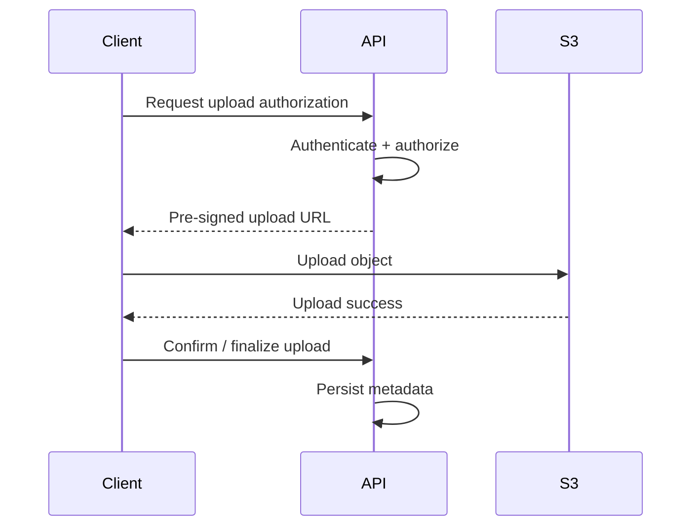
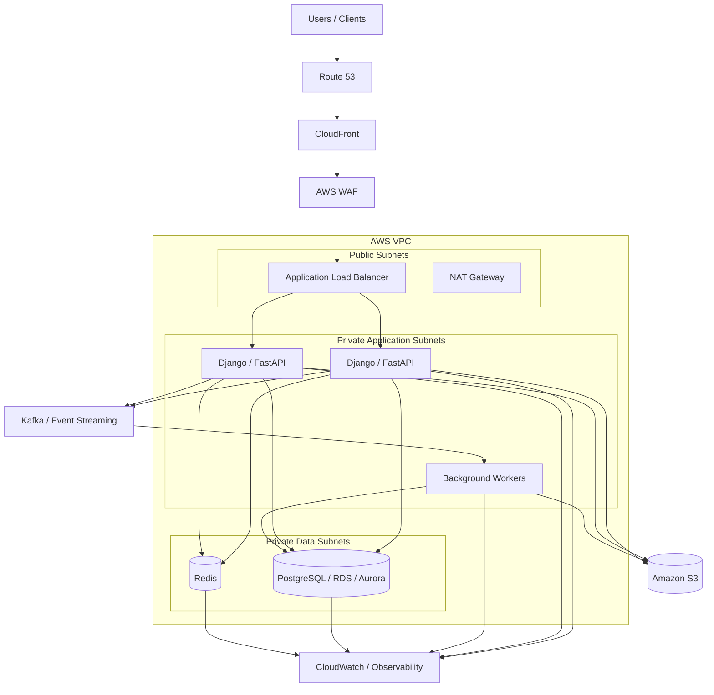

# 01- Designing on AWS

## Overview

Designing production systems on AWS is primarily an exercise in translating application requirements into a reliable set of managed infrastructure capabilities.

A strong AWS architecture is not simply a collection of AWS services. It is a set of deliberate decisions around:

- Compute
- Networking
- Data storage
- Caching
- Messaging
- Security
- Availability
- Scalability
- Observability
- Deployment
- Disaster recovery
- Cost

The architecture should begin with workload characteristics rather than service familiarity.

```text
Business Requirements
        |
        v
Functional Requirements
        |
        v
Non-Functional Requirements
        |
        v
Capacity Estimation
        |
        v
AWS Architecture
        |
        +---- Networking
        +---- Compute
        +---- Storage
        +---- Database
        +---- Cache
        +---- Messaging
        +---- Security
        +---- Observability
        |
        v
Failure Analysis
        |
        v
Cost and Operational Review
```

For backend engineers, AWS system design is especially important because application architecture and cloud architecture are tightly coupled. Decisions such as whether an API is stateless, whether work is synchronous, how files are uploaded, and where sessions are stored directly influence the AWS architecture.

## Architecture Principles

### Start With Requirements

Before selecting an AWS service, define:

- Expected traffic.
- Read/write ratio.
- Data volume.
- Latency requirements.
- Availability target.
- Durability requirements.
- Security requirements.
- Geographic distribution.
- Recovery objectives.
- Budget constraints.
- Operational requirements.

For example:

| Requirement | Architectural Impact |
|---|---|
| 10,000 RPS | Horizontal compute scaling |
| 99.99% availability | Multi-AZ architecture |
| Large file uploads | S3 instead of application servers |
| Global users | CDN and potentially multi-region architecture |
| Low-latency cache | Redis |
| Asynchronous processing | Queue/event streaming |
| Strong transactional consistency | Relational database |
| Disaster recovery | Backups, replication, or multi-region strategy |

The important question is not:

> Which AWS service should I use?

It is:

> What system property requires this service?

### Prefer Managed Services

Managed services reduce the operational burden of infrastructure.

For example:

```text
Self-managed PostgreSQL
    |
    +--> OS patching
    +--> Backup management
    +--> Replication
    +--> Failover
    +--> Monitoring
    +--> Storage management

Managed relational database
    |
    +--> AWS manages much of the infrastructure lifecycle
```

Managed services do not eliminate operational responsibility. Engineers still need to understand:

- Capacity.
- Configuration.
- Security.
- Failure behavior.
- Cost.
- Performance.
- Backup and recovery.

### Design for Failure

AWS infrastructure is designed around failure domains.

A production architecture should assume that:

- An application instance can fail.
- A container can terminate.
- A worker can crash.
- A database connection can fail.
- A cache can become unavailable.
- A queue can accumulate messages.
- An Availability Zone can become impaired.
- A deployment can introduce a defect.

The design should therefore avoid single points of failure.

## AWS Global Infrastructure

AWS infrastructure is organized into multiple geographic and failure-isolation boundaries.

```text
AWS Region
|
+-- Availability Zone A
|     |
|     +-- Compute
|     +-- Database
|     +-- Application resources
|
+-- Availability Zone B
|     |
|     +-- Compute
|     +-- Database
|     +-- Application resources
|
+-- Availability Zone C
      |
      +-- Compute
      +-- Database
      +-- Application resources
```

### Region

A Region is a geographic AWS deployment area containing multiple Availability Zones.

Choose a Region based on:

- User latency.
- Data residency.
- Regulatory requirements.
- Service availability.
- Cost.
- Disaster recovery requirements.

### Availability Zone

An Availability Zone is an isolated infrastructure location within a Region.

For high availability, distribute critical workloads across multiple Availability Zones.

### Multi-Region

Multi-region architecture is useful when requirements justify the additional complexity.

Typical reasons include:

- Global latency.
- Regulatory requirements.
- Regional disaster recovery.
- Business continuity.
- Very high availability requirements.

Multi-region should not be used merely because it sounds more resilient. It introduces substantial complexity around:

- Data replication.
- Failover.
- DNS.
- Consistency.
- Deployment.
- Observability.
- Cost.
- Operational procedures.

## Reference AWS Architecture

A typical production backend can be structured as:

```text
                         Users
                           |
                           v
                    Route 53 / DNS
                           |
                           v
                    CloudFront / CDN
                           |
                           v
                    Application Load
                       Balancer
                           |
             +-------------+-------------+
             |                           |
             v                           v
        Private Subnet              Private Subnet
             |                           |
        +----+----+                 +----+----+
        |         |                 |         |
       API-1    Worker             API-2    Worker
        |         |                 |         |
        +----+----+-----------------+----+----+
             |
      +------+-------+----------------+
      |              |                |
      v              v                v
   Redis          PostgreSQL         Kafka
      |              |                |
      |              |                +--> Consumers
      |              |
      |              +--> Read replicas
      |
      v
  Cache / Session

Application APIs
      |
      v
     S3
      |
      v
 CloudFront
```

The exact architecture depends on the workload.

## Networking Architecture

A production AWS application commonly places public-facing infrastructure separately from private application and data resources.

```text
                         Internet
                            |
                            v
                       Internet Gateway
                            |
              +-------------+-------------+
              |                           |
        Public Subnet A              Public Subnet B
              |                           |
         Load Balancer               Load Balancer
              |                           |
              +-------------+-------------+
                            |
                            v
                    Private Subnets
                            |
              +-------------+-------------+
              |                           |
          API / Workers              API / Workers
              |                           |
              +-------------+-------------+
                            |
                    Database Subnets
                            |
                         Database
```

### Public Subnets

Public subnets are generally used for resources that need direct routing to or from the internet through appropriate public networking components.

Examples include:

- Internet-facing load balancers.
- NAT gateways where architecturally appropriate.
- Certain administrative networking components.

Application servers and databases should generally remain private.

### Private Subnets

Private subnets are appropriate for:

- Django applications.
- FastAPI services.
- Background workers.
- Databases.
- Internal services.

Private does not mean completely disconnected from the network. Private workloads can use controlled egress paths such as NAT gateways or VPC endpoints.

### Database Subnets

Database resources should normally be isolated into dedicated private subnets with restrictive security controls.

A common pattern is:

```text
Internet
   |
   v
Load Balancer
   |
   v
Application
   |
   v
Database
```

rather than:

```text
Internet
   |
   v
Database
```

## VPC Design

A VPC provides an isolated networking environment for AWS resources.

A production VPC commonly contains:

- CIDR ranges.
- Public subnets.
- Private application subnets.
- Database subnets.
- Route tables.
- Internet gateway.
- NAT gateway.
- VPC endpoints where appropriate.
- Security groups.
- Network ACLs.

Example:

```text
VPC: 10.0.0.0/16

10.0.1.0/24  Public-A
10.0.2.0/24  Public-B

10.0.11.0/24 Private-App-A
10.0.12.0/24 Private-App-B

10.0.21.0/24 Private-DB-A
10.0.22.0/24 Private-DB-B
```

Avoid designing the network around a single Availability Zone.

## Security Groups

Security groups act as stateful network access controls associated with supported AWS resources.

A typical application rule might be:

```text
ALB
 |
 | TCP 443
 v
API instances
 |
 | TCP 5432
 v
PostgreSQL
```

The database should allow connections from the application security group rather than from the entire internet.

Prefer:

```text
Database SG
  inbound:
    TCP 5432
    source = Application SG
```

over:

```text
Database SG
  inbound:
    TCP 5432
    source = 0.0.0.0/0
```

The latter exposes the database unnecessarily.

## Compute Selection

AWS provides multiple compute models.

| Compute | Best Fit |
|---|---|
| EC2 | Maximum OS/infrastructure control |
| ECS | Containerized applications with managed orchestration |
| EKS | Kubernetes-based workloads |
| Lambda | Event-driven/serverless workloads |
| Batch | Large-scale batch processing |
| Fargate | Serverless container execution |

### EC2

EC2 provides virtual machines.

Use EC2 when you require:

- OS-level control.
- Specialized software.
- Custom networking.
- Existing VM-oriented workloads.
- Specific instance characteristics.

The trade-off is operational overhead.

### ECS

ECS is useful for containerized applications without requiring Kubernetes as the orchestration layer.

A typical architecture:

```text
ALB
 |
 v
ECS Service
 |
 +--> Task 1
 +--> Task 2
 +--> Task 3
```

For Django or FastAPI:

```text
Docker Image
    |
    v
ECR
    |
    v
ECS
    |
    v
Load Balancer
```

### EKS

EKS is appropriate when Kubernetes capabilities are a meaningful requirement.

Use it when you need:

- Kubernetes ecosystem compatibility.
- Kubernetes-native deployment patterns.
- Existing Kubernetes expertise.
- Complex orchestration requirements.
- Portability across Kubernetes environments.

Do not introduce Kubernetes solely because the application uses containers.

### Lambda

Lambda is useful for event-driven or short-lived workloads where server management should be minimized.

Examples:

- S3 event processing.
- Lightweight API endpoints.
- Scheduled automation.
- Queue consumers.
- Data transformations.

Lambda is less suitable when the workload requires:

- Long-running processes.
- Persistent local state.
- Specialized runtime behavior.
- Predictable long-lived connections.

## Containerized Backend Architecture

A Django or FastAPI application can use:

```text
                       Internet
                          |
                          v
                         ALB
                          |
                          v
                    ECS / EKS
                          |
               +----------+----------+
               |                     |
          API containers       Worker containers
               |                     |
               +----------+----------+
                          |
              +-----------+-----------+
              |           |           |
              v           v           v
           RDS/Aurora   Redis       Kafka
```

The application container should remain stateless.

Do not store durable application state inside the container filesystem.

## Stateless Application Design

A horizontally scalable API should avoid local state such as:

- In-memory sessions.
- Local uploaded files.
- Local queues.
- Process-specific user state.
- Persistent application data.

Instead:

```text
Application Instance
       |
       +--> PostgreSQL
       +--> Redis
       +--> S3
       +--> Kafka
```

This allows:

```text
API-1
API-2
API-3
...
API-N
```

to serve requests interchangeably.

## Database Architecture

For transactional backend applications, a relational database is often the starting point.

A typical AWS architecture is:

```text
Application
    |
    v
RDS / Aurora
    |
    +--> Primary
    |
    +--> Read Replicas
```

Use relational databases when the workload benefits from:

- ACID transactions.
- Relational modeling.
- Complex queries.
- Constraints.
- Joins.
- Strong consistency.

### Read Replicas

Read replicas can reduce load on the primary database.

For example:

```text
Write API
    |
    v
Primary
    |
    +--> Replica A
    +--> Replica B

Read API
    |
    +--> Replica A
    +--> Replica B
```

The application must account for replication lag.

Do not send immediately-consistent reads to replicas if the user must observe a just-completed write.

## Database Scaling Strategy

A practical progression is:

```text
Optimize Queries
      |
      v
Add Indexes
      |
      v
Increase Instance Capacity
      |
      v
Connection Pooling
      |
      v
Read Replicas
      |
      v
Partitioning
      |
      v
Sharding
```

Do not jump directly to sharding.

Poor SQL and missing indexes should be fixed before introducing distributed database complexity.

## Connection Management

Application servers can easily overwhelm a database by creating excessive connections.

For example:

```text
100 API instances
×
20 database connections
=
2,000 database connections
```

The database may not support that concurrency efficiently.

Use:

- Reasonable connection pools.
- Application-level connection limits.
- Database proxies where appropriate.
- Query optimization.
- Backpressure.

For Django, database connection configuration should be designed around the deployment model rather than copied blindly between environments.

## Redis

Redis is useful for low-latency, frequently accessed data.

Common use cases:

- Cache.
- Session storage.
- Rate limiting.
- Distributed locks.
- Short-lived state.
- Counters.
- Idempotency records.
- Task coordination.

Typical architecture:

```text
API
 |
 +--> Redis ---- hit ----> Response
 |
 +--> PostgreSQL -- miss --> Data
```

Redis should not automatically become the authoritative store for critical data simply because it is fast.

### Cache-Aside

```text
GET request
    |
    v
Check Redis
    |
    +---- Hit ----> Return
    |
    +---- Miss
           |
           v
       PostgreSQL
           |
           v
       Store in Redis
           |
           v
        Return
```

Define:

- TTL.
- Maximum cache size.
- Eviction behavior.
- Invalidation strategy.
- Failure behavior.

## Object Storage

S3 is the preferred architectural choice for many large binary objects.

Examples:

- Images.
- Videos.
- Documents.
- Backups.
- Build artifacts.
- Logs.
- Static assets.

Avoid:

```text
Client
  |
  v
Django
  |
  v
Local Disk
```

for durable user-generated files at scale.

Prefer:

```text
Client
  |
  v
API
  |
  v
Pre-signed URL
  |
  v
S3
```

This keeps large file transfer away from application servers.

### Pre-Signed Upload Flow



This architecture reduces application bandwidth and improves scalability.

## CDN Architecture

For globally distributed users:

```text
User
 |
 v
CloudFront
 |
 +---- Cache Hit ----> Response
 |
 +---- Cache Miss
          |
          v
       Origin
```

The origin may be:

- S3.
- Load balancer.
- Application service.

CDNs are particularly effective for:

- Images.
- Videos.
- Static assets.
- Public files.
- Cacheable API responses.

Avoid caching private or personalized data without carefully designed cache keys and authorization behavior.

## Messaging Architecture

Asynchronous processing reduces latency in synchronous API requests.

Instead of:

```text
POST /order

API
 |
 +--> Validate
 +--> DB
 +--> Send Email
 +--> Generate PDF
 +--> Call External API
 +--> Update Analytics
 |
 v
Response
```

prefer:

```text
POST /order

API
 |
 +--> DB
 |
 +--> Queue/Event
 |
 v
Fast Response

Queue
 |
 +--> Email Worker
 +--> PDF Worker
 +--> Analytics Consumer
 +--> External API Worker
```

This isolates slow and failure-prone operations.

## Kafka

Kafka is useful when the system requires durable event streams, high throughput, multiple consumers, or replay.

Example:

```text
Order Service
      |
      v
    Kafka
      |
      +--> Notification Service
      +--> Analytics Service
      +--> Billing Service
      +--> Search Service
```

Kafka should be introduced when its event-streaming properties are actually useful.

Consider:

- Partitioning.
- Consumer groups.
- Ordering.
- Retention.
- Consumer lag.
- Replay.
- Idempotent processing.

## Celery

Celery is useful for asynchronous Python application workloads.

Typical architecture:

```text
Django / FastAPI
      |
      v
   Broker
      |
      v
 Celery Workers
      |
      +--> Email
      +--> Reports
      +--> External APIs
      +--> Image processing
```

Redis can act as a broker for suitable workloads, while more demanding event-streaming architectures may require Kafka or another dedicated messaging platform.

## Service-to-Service Communication

There are two broad communication models.

### Synchronous

```text
Service A
   |
   | REST / gRPC
   v
Service B
```

Advantages:

- Simple request/response model.
- Immediate result.
- Easy to reason about.

Limitations:

- Couples service availability.
- Adds network latency.
- Can create cascading failures.

### Asynchronous

```text
Service A
   |
   v
Kafka / Queue
   |
   v
Service B
```

Advantages:

- Decoupling.
- Buffering.
- Retryability.
- Independent scaling.

Limitations:

- Eventual consistency.
- More operational complexity.
- Harder debugging.
- Requires idempotency.

## API Gateway and Load Balancing

A public API commonly follows:

```text
Client
  |
  v
Route 53
  |
  v
CloudFront / WAF
  |
  v
ALB
  |
  v
Application
```

Responsibilities should be clearly separated.

| Layer | Typical Responsibility |
|---|---|
| Route 53 | DNS |
| CloudFront | CDN / edge delivery |
| WAF | Web attack filtering |
| ALB | HTTP load balancing |
| Application | Business logic |
| Redis | Caching |
| Database | Durable transactional state |

Avoid putting arbitrary business logic into infrastructure layers.

## Security Architecture

AWS security should follow least privilege and defense-in-depth principles.

```text
Internet
   |
   v
WAF
   |
   v
Load Balancer
   |
   v
Application
   |
   +--> IAM permissions
   +--> Secrets
   +--> Database
   +--> S3
```

### IAM

IAM controls access to AWS resources.

Prefer:

```text
Application Role
    |
    +--> Read specific S3 bucket/prefix
    +--> Publish specific Kafka/Event resource
    +--> Read required secrets
```

over broad permissions such as:

```text
Action: "*"
Resource: "*"
```

Avoid embedding long-lived AWS credentials in application source code or container images.

### Secrets

Secrets should be stored in an appropriate managed secret/configuration system rather than committed to Git.

Examples:

- Database passwords.
- API credentials.
- Encryption keys.
- OAuth secrets.

Applications should obtain secrets through controlled runtime access.

### Encryption

Use encryption:

- In transit.
- At rest.
- For sensitive backups.
- For sensitive object storage.
- For database storage.

TLS should be used for external and sensitive internal communication where appropriate.

## WAF and Abuse Protection

Public APIs should be protected against:

- SQL injection.
- Cross-site scripting.
- Malicious payloads.
- Automated abuse.
- Credential attacks.
- Excessive request rates.

A layered architecture might be:

```text
Internet
   |
   v
CloudFront
   |
   v
WAF
   |
   v
ALB
   |
   v
Application
   |
   v
Rate Limiter
```

Infrastructure-level filtering and application-level authorization solve different problems and should not be confused.

## High Availability

High availability generally means eliminating single points of failure.

A typical architecture:

```text
                 Load Balancer
                /             \
               v               v
          AZ-A Application  AZ-B Application
               |               |
               +-------+-------+
                       |
                    Database
                   /        \
                  v          v
             AZ-A/Primary  AZ-B/Standby
```

Use multiple Availability Zones for critical production workloads.

However, deploying two instances in two AZs does not automatically guarantee high availability.

You must also consider:

- Database availability.
- DNS.
- Load balancer behavior.
- Deployment failures.
- Dependency failures.
- Capacity during failure.
- Recovery automation.

## Auto Scaling

Auto scaling allows compute capacity to adapt to workload.

```text
Low Traffic
    |
    v
2 instances

High Traffic
    |
    v
10 instances
```

Scale based on meaningful signals such as:

- CPU.
- Memory.
- Request count.
- Request latency.
- Queue depth.
- Custom application metrics.

CPU-only scaling is not always sufficient.

For asynchronous workers, queue depth can be a much better scaling signal.

## Backpressure

Suppose:

```text
API
 |
 | 20,000 requests/sec
 v
Queue
 |
 | 5,000 jobs/sec
 v
Workers
```

The queue grows continuously.

Eventually the system runs out of capacity.

Backpressure mechanisms include:

- Rate limiting.
- Bounded queues.
- Consumer scaling.
- Load shedding.
- Request rejection.
- Priority queues.
- Admission control.

A scalable architecture must control work entering the system, not merely add more workers.

## Reliability Patterns

### Timeouts

Every network call should have a bounded timeout.

Avoid:

```python
response = requests.get(url)
```

with an effectively unbounded wait in production-critical paths.

Use explicit connection and read timeouts.

### Retries

Retries are appropriate for transient failures.

Use:

- Exponential backoff.
- Jitter.
- Maximum retry count.
- Error classification.

Do not retry every failure.

For example:

```text
400 Bad Request
    → Do not retry

401 Unauthorized
    → Usually do not retry

404 Not Found
    → Usually do not retry

429 Too Many Requests
    → Retry according to server guidance

503 Service Unavailable
    → Potentially retry
```

### Idempotency

Retries can produce duplicate operations.

For critical APIs:

```http
POST /payments
Idempotency-Key: 7f8c2a...
```

The server can associate the key with the operation result.

This is especially important for:

- Payments.
- Orders.
- Resource creation.
- External API calls.

## Deployment Architecture

A production deployment should separate:

```text
Source Code
    |
    v
CI Pipeline
    |
    +--> Tests
    +--> Lint
    +--> Security Scan
    +--> Build
    |
    v
Container Image
    |
    v
Container Registry
    |
    v
Deployment
    |
    v
AWS Compute
```

For containerized applications:

```text
GitHub
  |
  v
GitHub Actions
  |
  v
ECR
  |
  v
ECS / EKS
```

Deployment strategies include:

| Strategy | Use Case |
|---|---|
| Rolling | Standard incremental deployments |
| Blue/Green | Fast rollback and traffic switching |
| Canary | Gradually expose new versions |
| Feature flags | Decouple code deployment from feature release |

## Zero-Downtime Deployment

A deployment should not require taking the entire service offline.

A typical rolling deployment:

```text
Version A
Version A
Version A
Version A

        ↓

Version A
Version A
Version B
Version B

        ↓

Version A
Version B
Version B
Version B

        ↓

Version B
Version B
Version B
Version B
```

Application shutdown and startup must be graceful.

The application should:

1. Stop accepting new work.
2. Finish or safely terminate in-flight work.
3. Release resources.
4. Shut down.

## Database Migration Safety

Database changes must account for mixed application versions during deployments.

Avoid:

```text
Deploy application expecting new column
before database schema supports it
```

Prefer an expand-and-contract approach:

```text
Phase 1
Add new column
        |
        v
Phase 2
Deploy application supporting old + new schema
        |
        v
Phase 3
Backfill data
        |
        v
Phase 4
Switch reads/writes
        |
        v
Phase 5
Remove old column
```

This is especially important during rolling deployments.

## Observability

A production AWS architecture should expose enough telemetry to answer:

- Is the system healthy?
- Where is latency increasing?
- Which dependency is failing?
- Are requests being throttled?
- Is the queue growing?
- Is the database saturated?
- Are deployments causing errors?

### Metrics

Useful metrics include:

```text
HTTP request count
HTTP error rate
HTTP p50/p95/p99 latency
CPU
Memory
Database connections
Database query latency
Cache hit ratio
Queue depth
Kafka consumer lag
S3 errors
Load balancer target health
```

### Logs

Logs should contain structured information such as:

```json
{
  "timestamp": "2026-08-23T12:00:00Z",
  "level": "ERROR",
  "service": "orders-api",
  "request_id": "req_123",
  "trace_id": "trace_456",
  "message": "database timeout"
}
```

Never log:

- Passwords.
- Access tokens.
- Private keys.
- Sensitive personal information unless explicitly required and protected.

### Distributed Tracing

For a request:

```text
Client
  |
  v
ALB
  |
  v
Django
  |
  +--> Redis
  |
  +--> PostgreSQL
  |
  +--> Kafka
```

distributed tracing helps identify which component contributes to latency.

## Disaster Recovery

Disaster recovery should be designed around:

- RPO — Recovery Point Objective.
- RTO — Recovery Time Objective.

### RPO

How much data can be lost?

```text
RPO = 1 hour
```

means losing up to approximately one hour of data may be acceptable.

### RTO

How quickly must the service recover?

```text
RTO = 30 minutes
```

means the recovery target is approximately 30 minutes.

### Recovery Strategies

| Strategy | Recovery | Cost | Complexity |
|---|---|---|---|
| Backup and restore | Slower | Lower | Lower |
| Pilot light | Moderate | Moderate | Moderate |
| Warm standby | Fast | Higher | Higher |
| Active-active | Very fast | Highest | Highest |

The appropriate strategy depends on business requirements.

## Backup Strategy

Backups should be:

- Automated.
- Encrypted.
- Monitored.
- Retained according to policy.
- Tested through restoration exercises.

A backup that has never been restored is not a proven recovery mechanism.

Test:

```text
Backup
  |
  v
Restore
  |
  v
Validate
  |
  v
Application Recovery Test
```

## Cost Architecture

AWS architecture should be optimized for total system cost, not simply infrastructure price.

Major cost drivers can include:

- Compute.
- Database instances.
- NAT gateways.
- Data transfer.
- Storage.
- CDN requests.
- Logs.
- Metrics.
- Kafka infrastructure.
- Load balancers.

For example, indiscriminately routing large volumes of private traffic through NAT gateways can create significant costs.

Use VPC endpoints where appropriate for supported AWS service access.

### Cost Optimization Principles

- Right-size compute.
- Use autoscaling.
- Remove unused resources.
- Set lifecycle policies for old objects.
- Compress data where appropriate.
- Avoid unnecessary cross-region traffic.
- Control log retention.
- Cache expensive reads.
- Use appropriate storage classes.
- Review database utilization.
- Monitor network transfer.

Cost optimization should not compromise required reliability or security.

## Security and Reliability Trade-offs

Architectural decisions often involve trade-offs.

| Decision | Benefit | Cost / Risk |
|---|---|---|
| Multi-AZ | Higher availability | Higher infrastructure cost |
| Multi-region | Regional resilience | High operational complexity |
| Redis cache | Lower latency | Invalidation complexity |
| Kafka | Durable event processing | Operational complexity |
| Microservices | Independent scaling | Distributed-system complexity |
| Kubernetes | Powerful orchestration | Higher operational overhead |
| CDN | Lower latency | Cache invalidation complexity |
| Read replicas | Read scaling | Replication lag |
| Serverless | Reduced infrastructure management | Runtime and platform constraints |

Senior engineering decisions explicitly acknowledge these trade-offs.

## Production Reference Architecture

A mature AWS backend can look like:



This is a reference architecture, not a mandatory architecture.

A simpler application may only need:

```text
Route 53
   |
   v
ALB
   |
   v
ECS
   |
   v
RDS
```

while a large distributed platform may require additional layers.

## Designing a Django Application on AWS

A production Django deployment can use:

```text
                         Internet
                            |
                            v
                         Route 53
                            |
                            v
                       CloudFront
                            |
                            v
                           WAF
                            |
                            v
                           ALB
                            |
             +--------------+--------------+
             |                             |
             v                             v
        Django API-A                  Django API-B
             |                             |
             +-------------+---------------+
                           |
              +------------+------------+
              |            |            |
              v            v            v
             RDS         Redis         S3
              |
              v
        Read Replicas
```

Django should remain stateless.

Avoid storing:

```text
media/
static-generated-runtime-state/
sessions/
temporary-user-files/
```

on local application disk when the application scales horizontally.

Use appropriate external services instead.

## Designing a FastAPI Application on AWS

A FastAPI service follows a similar architecture:

```text
Client
  |
  v
ALB
  |
  v
FastAPI
  |
  +--> PostgreSQL
  +--> Redis
  +--> S3
  +--> Kafka
```

For high-throughput internal communication:

```text
FastAPI Service A
       |
       v
      gRPC
       |
       v
FastAPI Service B
```

The same distributed-system principles apply regardless of framework.

## AWS Architecture by Workload

| Workload | Typical AWS Architecture |
|---|---|
| REST API | ALB + ECS/EKS + RDS |
| Static website | S3 + CloudFront |
| Image storage | S3 + CloudFront |
| Video platform | S3 + transcoding + CloudFront |
| Background jobs | ECS workers / Lambda / queue |
| Event-driven backend | Kafka / event bus + consumers |
| Serverless API | API Gateway + Lambda |
| High-read application | RDS + Redis + read replicas |
| Global application | Route 53 + CloudFront + regional services |
| Data lake | S3 + analytics services |
| Container platform | ECR + ECS/EKS |

## Common Architecture Mistakes

### Putting Everything in One Public Subnet

This increases the attack surface.

Prefer:

```text
Public:
  Load Balancer

Private:
  Application
  Workers

Private:
  Database
```

### Exposing Databases to the Internet

Never use public database access as a shortcut for application connectivity.

Use private networking and security groups.

### Using Local Disk for Persistent Application Data

Container or instance replacement can destroy local state.

Use S3 or a durable database depending on the data type.

### Making Every Operation Synchronous

Slow external calls can increase API latency and cause cascading failures.

Use asynchronous processing where immediate completion is not required.

### Overusing Microservices

Microservices introduce:

- Network calls.
- Distributed transactions.
- Observability requirements.
- Deployment complexity.
- Service discovery.
- Failure propagation.

Start with clear boundaries rather than arbitrary service decomposition.

### Overusing Kubernetes

Kubernetes is powerful but operationally expensive.

If ECS or another simpler managed compute model satisfies the requirements, it may be the better engineering choice.

### Treating Cache as the Source of Truth

A cache miss should normally be a valid operating condition.

Design the system so that the authoritative datastore remains authoritative.

### Ignoring Database Connections

Adding more application replicas can unintentionally create database overload.

Always calculate:

```text
Application replicas
×
Connections per replica
```

against database capacity.

### Ignoring Cross-AZ and Cross-Region Traffic

High availability can increase network traffic and cost.

Architecture should consider both reliability and network economics.

### Assuming Managed Means Failure-Proof

Managed services reduce operational work but do not remove:

- Quotas.
- Configuration errors.
- Authentication failures.
- Throttling.
- Dependency failures.
- Application-level bugs.

## Interview Design Workflow

For an AWS system-design interview, use a structured approach.

### Clarify Requirements

Ask:

- Who are the users?
- What operations are required?
- What is the expected traffic?
- Is the workload read-heavy?
- Is global availability required?
- What latency is acceptable?
- What availability is required?
- What data must be strongly consistent?

### Estimate Scale

Calculate:

```text
DAU
Requests/day
Average RPS
Peak RPS
Storage/day
Storage/year
Bandwidth
Database operations/sec
```

### Design the Network

Determine:

```text
Region
Availability Zones
VPC
Public/private subnets
Routing
Security groups
Internet access
Service-to-service networking
```

### Select Compute

Choose between:

```text
EC2
ECS
EKS
Lambda
```

based on operational and workload requirements.

### Select Data Stores

Determine whether the system needs:

```text
Relational database
NoSQL
Redis
Object storage
Search engine
Event stream
```

### Identify Bottlenecks

Ask:

```text
What fails first at 10× traffic?
```

Typical answers:

- Database.
- Cache hot keys.
- Queue backlog.
- Network bandwidth.
- Connection pools.
- Storage throughput.
- External dependencies.

### Design Failure Handling

For each dependency:

```text
What happens when it fails?
Can we retry?
Can we degrade?
Can we queue?
Can we fail over?
Can we recover automatically?
```

## Architecture Review Checklist

### Requirements

- [ ] Functional requirements are defined.
- [ ] Availability target is defined.
- [ ] Latency target is defined.
- [ ] RPO and RTO are defined.
- [ ] Data residency requirements are understood.

### Networking

- [ ] VPC CIDR is planned.
- [ ] Multiple Availability Zones are considered.
- [ ] Public and private subnets are separated.
- [ ] Security groups follow least privilege.
- [ ] Internet exposure is minimized.

### Compute

- [ ] Compute model matches workload.
- [ ] Applications are stateless where possible.
- [ ] Autoscaling signals are defined.
- [ ] Health checks are configured.
- [ ] Graceful shutdown is supported.

### Database

- [ ] Data model is defined.
- [ ] Indexes are reviewed.
- [ ] Connection limits are understood.
- [ ] Backups are enabled.
- [ ] Restore procedures are tested.
- [ ] Read scaling is considered where required.

### Storage

- [ ] Large files use object storage.
- [ ] Lifecycle policies are defined.
- [ ] CDN usage is evaluated.
- [ ] Encryption is enabled where appropriate.

### Messaging

- [ ] Asynchronous workloads are identified.
- [ ] Retry strategy is defined.
- [ ] Idempotency is considered.
- [ ] Dead-letter handling exists where required.
- [ ] Consumer lag is monitored.

### Security

- [ ] IAM follows least privilege.
- [ ] Secrets are externalized.
- [ ] Encryption is enabled where appropriate.
- [ ] Public endpoints are protected.
- [ ] Audit logging is considered.
- [ ] Rate limiting is implemented where required.

### Reliability

- [ ] Multiple AZs are considered.
- [ ] Timeouts are defined.
- [ ] Retry policies use backoff and jitter.
- [ ] Failure modes are documented.
- [ ] Disaster recovery is tested.

### Observability

- [ ] Metrics exist.
- [ ] Structured logs exist.
- [ ] Request correlation exists.
- [ ] Distributed tracing is considered.
- [ ] Alerts correspond to actionable failures.

### Cost

- [ ] Compute is right-sized.
- [ ] Autoscaling is configured.
- [ ] Storage lifecycle is configured.
- [ ] Data transfer costs are understood.
- [ ] Log retention is controlled.
- [ ] Expensive managed services are justified.

## Key Takeaways

- **AWS architecture should begin with workload requirements, scale, availability, consistency, security, and recovery objectives—not with a list of AWS services.**
- **Use multiple Availability Zones, stateless compute, managed data services, and automated recovery to eliminate avoidable single points of failure.**
- **Separate responsibilities clearly: load balancers handle traffic distribution, applications handle business logic, databases hold authoritative state, Redis accelerates access, and S3 handles durable objects.**
- **Scalability requires more than adding instances; design for database limits, connection pools, hot keys, queue backpressure, asynchronous processing, and failure isolation.**
- **Production AWS design is a trade-off between reliability, performance, security, operational complexity, and cost; every major architectural decision should explicitly account for all five.**