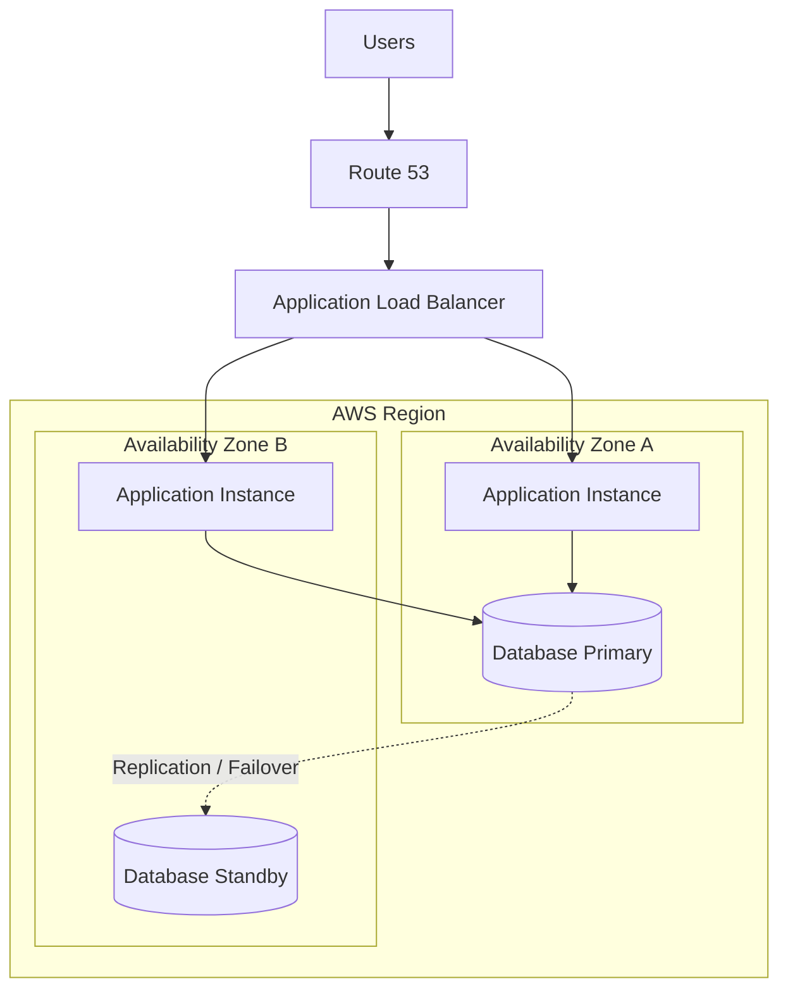

# 02- High Availability

## Overview

High availability (HA) is the ability of a system to continue serving its intended workload despite failures in infrastructure, software components, dependencies, or operational processes.

The central idea is not to prevent every failure. Failures are inevitable in distributed systems. High availability reduces the probability and duration of service disruption by removing single points of failure, distributing workloads across independent failure domains, detecting failures, and recovering automatically.

A production backend should therefore be designed around:

```text
Failure
   |
   v
Detection
   |
   v
Isolation / Failover
   |
   v
Recovery
   |
   v
Continued Service
```

High availability is different from scalability:

| Concept | Primary Goal |
|---|---|
| High Availability | Keep the system operational during failures |
| Scalability | Handle increasing workload |
| Reliability | Perform correctly and consistently |
| Durability | Prevent data loss |
| Disaster Recovery | Recover from major failures |

These properties overlap, but they are not interchangeable.

For example, adding ten API servers may improve scalability, but if all ten depend on one database with no failover, the system still has a major availability bottleneck.

## Availability Fundamentals

Availability measures the proportion of time a system is operational and accessible.

A simplified formula is:

```text
Availability =
Uptime / (Uptime + Downtime)
```

It is commonly expressed as a percentage.

| Availability | Approximate Annual Downtime |
|---|---:|
| 99% | 3.65 days |
| 99.9% | 8.76 hours |
| 99.95% | 4.38 hours |
| 99.99% | 52.56 minutes |
| 99.999% | 5.26 minutes |

The difference between 99.9% and 99.99% is significant.

A system with a 99.9% availability target can tolerate substantially more downtime than one with a 99.99% target. Therefore, an availability requirement directly influences architecture, infrastructure cost, operational complexity, and recovery strategy.

## Why High Availability Matters

A backend can fail for many reasons:

- Application crashes.
- Hardware failures.
- Container termination.
- Availability Zone failures.
- Database failures.
- Network failures.
- DNS problems.
- Deployment defects.
- Dependency outages.
- Capacity exhaustion.
- Human configuration errors.
- Security incidents.

A single-instance architecture might look like:

```text
Users
  |
  v
Application Server
  |
  v
Database
```

If the application server fails:

```text
Users
  |
  X
Application Server
  |
  v
Database
```

The entire service becomes unavailable.

A highly available architecture introduces redundancy:

```text
                 Load Balancer
                /             \
               v               v
          Application A   Application B
               |               |
               +-------+-------+
                       |
                    Database
```

If one application instance fails, traffic can continue through the other.

## The Availability Equation

For independent components arranged in sequence, system availability is approximately:

```text
A_system = A1 × A2 × A3 × ... × An
```

For example:

```text
Load Balancer = 99.99%
Application   = 99.95%
Database      = 99.99%

System ≈ 0.9999 × 0.9995 × 0.9999
       ≈ 99.93%
```

This demonstrates an important architectural principle:

> Adding dependencies can reduce end-to-end availability unless those dependencies are themselves highly available.

For redundant components operating in parallel, availability can improve.

For two equivalent independent application instances:

```text
A_instance = 99%

A_cluster = 1 - (1 - 0.99)^2
          = 99.99%
```

Real systems are more complicated because failures are often correlated. Two instances in the same Availability Zone, for example, may fail together.

## Failure Domains

A failure domain is a group of infrastructure components that can fail together.

Common failure domains include:

```text
Process
  |
  v
Container
  |
  v
Host
  |
  v
Rack
  |
  v
Availability Zone
  |
  v
Region
```

Good HA architecture distributes critical components across independent failure domains.

### Process-Level Redundancy

Multiple application workers can protect against process crashes.

```text
Host
 |
 +--> Worker 1
 +--> Worker 2
 +--> Worker 3
```

This protects against a process failure but not necessarily host failure.

### Host-Level Redundancy

```text
Host A
  |
  +--> Application

Host B
  |
  +--> Application
```

A host failure does not necessarily take down the service.

### Availability Zone Redundancy

```text
Region
|
+-- AZ-A
|    |
|    +--> Application
|
+-- AZ-B
     |
     +--> Application
```

An Availability Zone failure can therefore be tolerated.

### Region-Level Redundancy

```text
Region A
  |
  +--> Application
  +--> Database

Region B
  |
  +--> Application
  +--> Database
```

This can protect against regional failures but introduces substantially more complexity.

## Single Point of Failure

A Single Point of Failure (SPOF) is a component whose failure can make the overall system unavailable.

Common examples:

- One application server.
- One load balancer.
- One database.
- One Availability Zone.
- One Redis instance.
- One message broker.
- One DNS dependency.
- One external API.

A useful architecture review question is:

> If this component disappears right now, can users still complete their critical operation?

Apply this question recursively to every critical dependency.

## Redundancy

Redundancy means maintaining multiple components capable of performing the same critical function.

```text
                 Load Balancer
                /      |      \
               v       v       v
             API-1   API-2   API-3
```

Redundancy alone does not guarantee availability.

The system also needs:

- Health checks.
- Failure detection.
- Traffic rerouting.
- Capacity to handle failure.
- Correct state management.
- Automated recovery.

Three dead servers are still three dead servers.

## Active-Active Architecture

In an active-active architecture, multiple instances serve production traffic simultaneously.

```text
                 Load Balancer
                /             \
               v               v
          Application A   Application B
               |               |
               +-------+-------+
                       |
                    Database
```

Advantages:

- Better resource utilization.
- No idle standby capacity.
- Faster failover.
- Easier horizontal scaling.

Limitations:

- Requires stateless or carefully coordinated application design.
- Shared state becomes more difficult.
- Database contention may increase.
- Deployments require careful coordination.

Active-active is usually a strong choice for stateless HTTP APIs.

## Active-Passive Architecture

In active-passive architecture, one component serves traffic while another remains available for failover.

```text
               Traffic
                  |
                  v
             Primary
                  |
             failure
                  |
                  v
             Standby
```

Advantages:

- Simpler state management in some workloads.
- Useful for systems that cannot easily run multiple active instances.

Limitations:

- Standby resources may be underutilized.
- Failover can take longer.
- Standby environments may become stale.
- Failover procedures must be tested.

A standby system that has not been exercised may fail when it is actually needed.

## High Availability in AWS

AWS architectures commonly use multiple Availability Zones.



The exact AWS implementation depends on the service.

Examples include:

- Multi-AZ relational databases.
- Multiple ECS tasks across Availability Zones.
- EKS nodes across Availability Zones.
- Load balancers spanning Availability Zones.
- Redis deployments with replication and failover.
- S3 for highly durable object storage.

## Multi-AZ Architecture

Multi-AZ architecture distributes resources across multiple Availability Zones in the same AWS Region.

A common backend architecture is:

```text
                         Internet
                            |
                            v
                           ALB
                       /         \
                      /           \
                     v             v
                  AZ-A           AZ-B
                   |               |
                API-A           API-B
                   |               |
                   +-------+-------+
                           |
                           v
                    Multi-AZ Database
```

If AZ-A becomes unavailable:

```text
                         Internet
                            |
                            v
                           ALB
                             \
                              \
                               v
                              AZ-B
                               |
                             API-B
                               |
                               v
                         Database
```

The remaining capacity must be sufficient to handle the surviving workload.

This is a frequently missed design consideration.

If each Availability Zone normally operates at 80% utilization, losing one AZ may overload the remaining AZ.

## N+1 Capacity

N+1 capacity means the system has enough spare capacity to tolerate the loss of one component.

For example:

```text
Required capacity = 8 instances

Normal:
AZ-A = 4
AZ-B = 4

After AZ-A failure:
AZ-B must support approximately 8 instances
```

A better design might provision:

```text
AZ-A = 5
AZ-B = 5
```

and configure autoscaling to rapidly add capacity when one zone fails.

High availability therefore involves both redundancy and capacity planning.

## Load Balancer Role

A load balancer is a critical HA component because it distributes traffic among healthy backend instances.

```text
Client
  |
  v
Load Balancer
  |
  +----> Healthy API
  |
  +----> Healthy API
  |
  X----> Failed API
```

Health checks determine whether a backend should receive traffic.

A good health-check endpoint should usually verify enough of the application to establish whether it can actually serve traffic.

For example:

```http
GET /health/live
```

can indicate process health.

```http
GET /health/ready
```

can indicate readiness to receive traffic.

These should not necessarily be the same endpoint.

## Liveness vs Readiness

### Liveness

Liveness answers:

> Is the process alive?

A failed liveness check may cause the platform to restart the workload.

### Readiness

Readiness answers:

> Can this instance safely receive traffic?

An instance can be alive but not ready.

For example:

```text
Application started
      |
      v
Database connection unavailable
      |
      v
Process is alive
      |
      v
Not ready to serve requests
```

This distinction is especially important in Kubernetes and containerized systems.

## Health Check Design

A poor health check:

```python
def health():
    return {"status": "ok"}
```

may only prove that the HTTP process is responding.

A production readiness check may validate critical dependencies:

```text
Readiness
   |
   +--> Database reachable
   +--> Required configuration loaded
   +--> Critical dependency available
```

However, checking every dependency can also create problems.

If Redis is temporarily unavailable but the application can serve uncached database reads, making Redis failure cause the entire service to become unhealthy may unnecessarily remove healthy capacity.

Health checks should therefore represent actual service requirements.

## Database High Availability

The database is frequently the hardest component to make highly available because it owns durable state.

A simple architecture:

```text
Application
     |
     v
Primary Database
     |
     v
Standby Database
```

If the primary fails:

```text
Application
     |
     X
Primary
     |
     v
Standby
     |
     v
New Primary
```

The exact failover mechanism depends on the database platform.

## Synchronous vs Asynchronous Replication

### Synchronous Replication

A write is acknowledged only after the required replicas have confirmed the write.

Advantages:

- Stronger consistency.
- Lower risk of losing recently committed data.

Limitations:

- Higher write latency.
- Availability may depend on replica health.

### Asynchronous Replication

The primary acknowledges writes before replicas necessarily receive them.

Advantages:

- Lower write latency.
- Better write availability.

Limitations:

- Replica lag.
- Potential data loss during failure.

The choice depends on the application's consistency and recovery requirements.

## Database Failover

A database failover can involve:

```text
Primary Failure
      |
      v
Failure Detection
      |
      v
Select Healthy Standby
      |
      v
Promote Standby
      |
      v
Update Connection Endpoint
      |
      v
Application Reconnects
```

Applications must tolerate temporary database connectivity errors during failover.

This means connection retry behavior, timeouts, and connection pools must be designed deliberately.

## Database Connection Pools During Failover

Suppose an application maintains:

```text
200 persistent database connections
```

When the database fails over, many connections may become invalid.

The application must:

- Detect broken connections.
- Reconnect.
- Avoid retry storms.
- Respect database connection limits.
- Use bounded retry policies.

Otherwise, a failover can cause a second outage caused by connection exhaustion.

## Redis High Availability

Redis can also become a single point of failure if deployed as one instance.

A more resilient architecture can use replication and automatic failover.

```text
              Application
                  |
                  v
              Redis Primary
               /         \
              v           v
          Replica A    Replica B
```

Depending on the deployment model, a replica can be promoted if the primary fails.

Redis HA should be designed around the role Redis plays.

If Redis is only a cache:

```text
Redis Failure
    |
    v
Cache Miss
    |
    v
Database
```

The application may remain operational.

If Redis contains authoritative session, lock, or coordination state, Redis failure may have much greater impact.

## Cache Failure Strategy

A resilient cache architecture should define what happens when the cache disappears.

### Fail Open

Continue serving requests without the cache.

```text
Redis unavailable
      |
      v
Database
      |
      v
Response
```

Useful when the database can tolerate the additional load.

### Fail Closed

Reject requests because the cached state is required.

This is appropriate only when operating without the cache would violate correctness or security requirements.

The choice must be explicit.

## Messaging High Availability

A message broker can become a critical availability dependency.

For asynchronous systems:

```text
Producer
   |
   v
Message Broker
   |
   +--> Consumer A
   +--> Consumer B
   +--> Consumer C
```

If the broker fails, producers may be unable to enqueue work.

Production designs should consider:

- Broker replication.
- Durable messages.
- Consumer groups.
- Dead-letter handling.
- Retry behavior.
- Consumer lag.
- Backpressure.
- Idempotency.

Kafka, for example, distributes partitions across brokers and replicates them so that broker failures do not necessarily make the entire topic unavailable.

## Asynchronous Processing and Availability

Asynchronous processing can improve availability by isolating failures.

Consider:

```text
API
 |
 +--> Database
 |
 +--> Email Service
 |
 +--> Payment Service
 |
 +--> Analytics
```

If the API synchronously waits for every dependency, one dependency outage can make the entire request fail.

Instead:

```text
API
 |
 +--> Database
 |
 +--> Queue
       |
       +--> Email Worker
       +--> Analytics Worker
       +--> External API Worker
```

The API can continue serving requests even if downstream processing is temporarily delayed.

This creates eventual consistency and operational complexity, but it can significantly improve fault isolation.

## Failure Isolation

Failure isolation prevents one component's failure from cascading through the system.

Common techniques include:

- Timeouts.
- Circuit breakers.
- Bulkheads.
- Queues.
- Rate limiting.
- Connection limits.
- Load shedding.
- Independent worker pools.

### Bulkhead Pattern

Separate resources for independent workloads.

```text
                 API
                  |
        +---------+---------+
        |                   |
        v                   v
   Worker Pool A       Worker Pool B
      Emails              Reports
```

If report processing becomes overloaded, email processing can continue.

Without isolation:

```text
All jobs
   |
   v
Shared worker pool
   |
   X
Resource exhaustion
   |
   v
All background processing affected
```

## Circuit Breaker

A circuit breaker prevents repeated calls to an unhealthy dependency.

```text
        +----------------+
        |     CLOSED     |
        +----------------+
                |
          failures exceed
             threshold
                |
                v
        +----------------+
        |      OPEN      |
        +----------------+
                |
          wait / timeout
                |
                v
        +----------------+
        |   HALF-OPEN    |
        +----------------+
             /       \
          success    failure
            |          |
            v          v
         CLOSED       OPEN
```

A circuit breaker is useful for unstable external dependencies.

It prevents a failing dependency from consuming all application threads, connections, or worker capacity.

## Timeouts and Availability

A missing timeout can turn a dependency failure into application-wide resource exhaustion.

Consider:

```text
API
 |
 v
External Service
 |
 X
No response
 |
 v
Request waits indefinitely
```

If hundreds of requests behave this way:

```text
Requests
   |
   v
Thread / Worker exhaustion
   |
   v
API unavailable
```

Use bounded timeouts:

```text
Connection timeout
Read timeout
Write timeout
Overall request deadline
```

Timeout values should be based on actual latency requirements rather than arbitrary large numbers.

## Retry Storms

Retries can improve availability when failures are transient, but poorly designed retries can make outages worse.

Example:

```text
1000 requests
    |
    v
Dependency fails
    |
    v
1000 retries
    |
    v
Dependency receives another 1000 requests
    |
    v
Dependency becomes even less healthy
```

Use:

- Exponential backoff.
- Jitter.
- Retry budgets.
- Maximum retry counts.
- Error classification.

Avoid retrying non-transient errors.

## Graceful Degradation

A highly available system does not always need to provide every feature during a dependency failure.

For example:

```text
Normal:
Product API
 |
 +--> Database
 +--> Recommendation Engine
 +--> Analytics
 +--> Notification Service

Recommendation Engine unavailable:
 |
 +--> Product API still serves products
 +--> Recommendations omitted
 +--> Analytics queued
 +--> Notifications processed asynchronously
```

This is graceful degradation.

Critical functionality should be separated from optional functionality.

## Disaster Recovery vs High Availability

High availability and disaster recovery solve different failure classes.

| Property | High Availability | Disaster Recovery |
|---|---|---|
| Primary Goal | Continue serving | Recover after major disruption |
| Typical Failure | Instance/AZ failure | Region loss |
| Response | Automatic | Automated or manual |
| Data Replication | Often near real-time | Often replicated/backed up |
| RTO | Usually low | Depends on strategy |
| RPO | Usually low | Depends on strategy |
| Complexity | Moderate | Moderate to very high |

A multi-AZ architecture may provide HA without protecting against a complete regional outage.

## RTO and RPO

### Recovery Time Objective

RTO defines how quickly the system should recover.

```text
RTO = 15 minutes
```

means the recovery process should restore service within the defined target.

### Recovery Point Objective

RPO defines the acceptable amount of data loss.

```text
RPO = 5 minutes
```

means the system should be able to recover with no more than approximately five minutes of data loss.

These requirements drive architecture.

```text
Low RTO + Low RPO
        |
        v
More replication
More automation
More redundancy
Higher cost
Higher complexity
```

## Disaster Recovery Strategies

### Backup and Restore

```text
Primary
   |
   v
Backup Storage

Failure
   |
   v
Restore
```

Advantages:

- Low cost.
- Simple operational model.

Limitations:

- Slow recovery.
- Recovery depends on backup integrity.

### Pilot Light

Only critical infrastructure is maintained in the recovery environment.

Advantages:

- Lower cost than full standby.
- Faster recovery than backup-only.

Limitations:

- Requires deployment and scaling during recovery.

### Warm Standby

A reduced-capacity production environment is continuously running.

```text
Primary Region
   |
   v
Full Capacity

Secondary Region
   |
   v
Reduced Capacity
```

During failure, the secondary region scales up.

### Active-Active

Both regions serve production traffic.

```text
                 Global Traffic
                 /            \
                v              v
             Region A       Region B
                |              |
             Service         Service
                |              |
                +------+-------+
                       |
                    Data Layer
```

This provides fast regional failover but has significant consistency and operational complexity.

## Kubernetes High Availability

A Kubernetes deployment should distribute workloads across failure domains.

```text
                 Load Balancer
                       |
             +---------+---------+
             |                   |
             v                   v
          Node A              Node B
             |                   |
         Pod API-1           Pod API-2
```

Use mechanisms such as:

- Multiple replicas.
- Pod anti-affinity.
- Topology spread constraints.
- Pod disruption budgets.
- Readiness probes.
- Liveness probes.
- Cluster autoscaling.
- Multiple Availability Zones.

A deployment with three replicas does not provide meaningful HA if all three pods run on one node.

## Docker and Container Availability

Containers are ephemeral.

A production container should be designed so that:

```text
Container dies
     |
     v
Orchestrator replaces it
     |
     v
New container
     |
     v
Traffic resumes
```

This requires:

- Stateless application design.
- Externalized persistent state.
- Health checks.
- Graceful shutdown.
- Automated replacement.

Do not depend on a container surviving indefinitely.

## Application-Level Availability

Infrastructure redundancy is insufficient if application code contains a single logical failure point.

Examples:

- A global lock blocks every request.
- One internal service is mandatory for all operations.
- One cache key becomes a hot spot.
- A synchronous transaction spans many services.
- One worker queue processes every workload.
- One deployment migration breaks all instances.

Application architecture must therefore support failure isolation.

## Stateless APIs

Stateless APIs are easier to scale and fail over.

```text
             Load Balancer
             /     |     \
            v      v      v
          API-1  API-2  API-3
             \      |      /
              \     |     /
                Shared State
               /      |      \
            DB      Redis      S3
```

Any instance can handle any request.

This is particularly useful for:

- Django.
- FastAPI.
- REST APIs.
- gRPC services.
- Containerized microservices.

## Session Management

Local process memory creates an availability problem.

Avoid:

```text
User
 |
 v
API-1
 |
 +--> Session stored locally
```

If the next request goes to API-2:

```text
User
 |
 v
API-2
 |
 X
Session unavailable
```

Prefer shared session storage or stateless authentication where appropriate.

Possible approaches include:

- Redis-backed sessions.
- Database-backed sessions.
- Signed tokens.
- Managed identity systems.

The security and revocation implications of each approach must be considered.

## Availability and Data Consistency

Availability and consistency can conflict during network partitions.

Consider two database replicas:

```text
Region A <---- network partition ----> Region B
```

If both accept writes independently:

```text
Region A:
account.balance = 100

Region B:
account.balance = 50
```

The system now has conflicting state.

Distributed systems must define what happens during partitions.

Possible strategies include:

- Single write leader.
- Quorum writes.
- Conflict resolution.
- Eventual consistency.
- Read-only degradation.
- Region-level failover.

High availability is not simply "accept requests everywhere."

## Quorum

For replicated systems, quorum-based approaches can improve consistency.

For example:

```text
Replicas = 3
Write quorum = 2
Read quorum = 2
```

A write may require two replicas to acknowledge the operation.

The exact semantics depend on the datastore.

Quorum systems introduce trade-offs between:

- Consistency.
- Availability.
- Latency.
- Failure tolerance.

## Monitoring High Availability

Availability must be measured from the user's perspective.

Useful signals include:

```text
Availability
Error rate
Latency
Traffic
Saturation
Health-check failures
Failover events
Database replication lag
Queue depth
Consumer lag
Connection failures
```

The four golden signals are:

| Signal | Question |
|---|---|
| Latency | How long do requests take? |
| Traffic | How much demand exists? |
| Errors | How many requests fail? |
| Saturation | How close are resources to capacity? |

## Synthetic Monitoring

Infrastructure health checks are not enough.

A system can report:

```text
ALB = healthy
API = healthy
Database = healthy
```

while the actual business flow is broken.

Synthetic monitoring can periodically execute critical user journeys:

```text
Login
  |
  v
Create resource
  |
  v
Read resource
  |
  v
Delete resource
```

This detects failures that infrastructure metrics may miss.

## Alerting

Do not alert on every infrastructure event.

Prefer alerts tied to user impact or imminent risk.

Examples:

```text
High 5xx rate
High p99 latency
Database connection exhaustion
Queue backlog increasing continuously
Replication lag above threshold
Healthy capacity below required minimum
Failed deployment
Regional health degradation
```

A useful alert should answer:

> What is broken, how severe is it, and what action should the operator take?

## Chaos Engineering

Chaos engineering intentionally introduces failures to validate resilience.

Examples:

- Kill application instances.
- Terminate containers.
- Simulate database failover.
- Block network access.
- Increase dependency latency.
- Fill worker queues.
- Simulate Availability Zone failure.

Example:

```text
Normal System
     |
     v
Inject Failure
     |
     v
Observe Behavior
     |
     v
Validate Recovery
     |
     v
Improve Architecture
```

Do not begin with uncontrolled production failures.

Start with:

- Staging.
- Controlled experiments.
- Clear rollback procedures.
- Defined blast radius.
- Observability.

## Deployment Availability

Deployments themselves are a major source of downtime.

A production-safe deployment should consider:

- Rolling updates.
- Blue/green deployments.
- Canary releases.
- Health checks.
- Automatic rollback.
- Database migration compatibility.
- Graceful termination.

### Blue/Green

```text
                 Load Balancer
                  /         \
                 v           v
             Blue v1       Green v2
                 |           |
                 +-----------+

Current traffic ---> Blue

Deployment:
1. Deploy Green
2. Validate Green
3. Shift traffic
4. Monitor
5. Roll back if necessary
```

Blue/green deployments simplify rollback but require additional infrastructure capacity.

## Canary Deployment

Canary deployment sends a small percentage of traffic to the new version.

```text
                    Load Balancer
                    /          \
                   /            \
              95% v1           5% v2
```

Monitor:

- Error rate.
- Latency.
- Resource utilization.
- Business metrics.

If healthy:

```text
5% -> 25% -> 50% -> 100%
```

If unhealthy:

```text
5% -> 0%
```

This limits blast radius.

## Availability During Database Migrations

Schema changes must support old and new application versions simultaneously during rolling deployments.

Use the expand-and-contract approach:

```text
Add compatible schema
        |
        v
Deploy compatible application
        |
        v
Backfill
        |
        v
Switch application behavior
        |
        v
Remove obsolete schema
```

Avoid destructive migrations that immediately invalidate running application instances.

## Security and Availability

Security failures can become availability failures.

Examples:

- Overly restrictive security groups.
- Expired certificates.
- Expired credentials.
- Broken IAM permissions.
- WAF rules blocking legitimate users.
- Rate limits configured too aggressively.
- Secrets unavailable during deployment.

Security and availability should therefore be tested together.

A secure system that rejects every legitimate request is not operationally successful.

## Cost of High Availability

Higher availability usually requires more infrastructure.

Examples:

```text
Single instance
    |
    v
Low cost
Low resilience

Multiple AZ
    |
    v
Higher cost
Higher resilience

Multi-region active-active
    |
    v
Much higher cost
Much higher complexity
```

Do not target five-nines availability for every application.

An internal reporting tool and a payment platform have different business requirements.

Availability should be proportional to business impact.

## Common High Availability Mistakes

### Mistaking Replication for Availability

Having replicas does not guarantee failover.

You also need:

- Failure detection.
- Promotion.
- Traffic redirection.
- Application reconnection.
- Recovery testing.

### Running All Replicas in One Failure Domain

```text
AZ-A
 |
 +--> API-1
 +--> API-2
 +--> API-3
```

If AZ-A fails, all replicas disappear.

Spread workloads across independent failure domains.

### Ignoring Shared Dependencies

Three API instances do not help if all of them depend on one unavailable service.

Always map the dependency graph.

### Using an Unbounded Retry Policy

Infinite retries can turn a dependency outage into an application outage.

Use bounded retries and backoff.

### Treating Health Checks as a Checkbox

A health endpoint that always returns `200` provides little operational value.

Health checks should represent meaningful liveness and readiness semantics.

### Forgetting Capacity During Failure

An architecture may be redundant but still unable to survive a component failure because the remaining infrastructure cannot handle the workload.

Always perform failure-capacity calculations.

### Not Testing Failover

Untested failover often fails because of:

- Expired credentials.
- Incorrect DNS configuration.
- Broken connection strings.
- Stale replicas.
- Missing permissions.
- Incorrect automation.

Failover must be exercised.

### Storing State Locally

Local state makes traffic movement and instance replacement unsafe.

Use shared durable state where necessary.

### Making Every Dependency Mandatory

Optional features should not take down core functionality.

Use queues, fallbacks, cached responses, and graceful degradation where appropriate.

### Building Multi-Region Too Early

Multi-region architecture adds:

- Replication complexity.
- Conflict handling.
- Traffic management.
- Deployment complexity.
- Monitoring complexity.
- Cost.

Use it when business requirements justify it.

## Production HA Checklist

### Application

- [ ] Application instances are horizontally scalable.
- [ ] Application state is externalized.
- [ ] Graceful shutdown is implemented.
- [ ] Readiness and liveness are separated.
- [ ] Dependency timeouts are configured.
- [ ] Retry policies are bounded.
- [ ] Idempotency is implemented for retryable operations.

### Networking

- [ ] Load balancing spans multiple Availability Zones.
- [ ] Public and private networking boundaries are defined.
- [ ] Security groups follow least privilege.
- [ ] DNS failover requirements are understood.
- [ ] Network dependencies are monitored.

### Database

- [ ] Database failure mode is documented.
- [ ] Multi-AZ or equivalent HA is configured where required.
- [ ] Backups are automated.
- [ ] Restore procedures are tested.
- [ ] Replication lag is monitored.
- [ ] Connection pools tolerate failover.
- [ ] Database capacity supports failure scenarios.

### Cache

- [ ] Cache failure behavior is defined.
- [ ] Cache is not incorrectly treated as the source of truth.
- [ ] Redis HA is configured where required.
- [ ] Hot-key risks are understood.
- [ ] Cache stampede protection is considered.

### Messaging

- [ ] Broker redundancy is configured.
- [ ] Messages are durable where required.
- [ ] Consumers are idempotent.
- [ ] Retry and dead-letter strategies exist.
- [ ] Queue depth and consumer lag are monitored.

### Deployment

- [ ] Rolling, blue/green, or canary deployment is used where appropriate.
- [ ] Health checks prevent bad instances from receiving traffic.
- [ ] Automatic rollback is available where practical.
- [ ] Database migrations are backward compatible.
- [ ] Graceful termination is supported.

### Disaster Recovery

- [ ] RPO is defined.
- [ ] RTO is defined.
- [ ] Backup retention is defined.
- [ ] Restore procedures are tested.
- [ ] Regional recovery strategy is documented.
- [ ] Disaster recovery exercises are performed.

### Observability

- [ ] Availability is measured from the client perspective.
- [ ] Error rate is monitored.
- [ ] p95/p99 latency is monitored.
- [ ] Saturation is monitored.
- [ ] Failover events are observable.
- [ ] Synthetic monitoring covers critical workflows.
- [ ] Alerts are actionable.

## Interview Design Framework

When designing a highly available system in an interview, explain the reasoning rather than simply listing AWS services.

A strong sequence is:

```text
Requirements
    |
    v
Availability Target
    |
    v
Failure Domains
    |
    v
Redundancy
    |
    v
Failure Detection
    |
    v
Failover
    |
    v
Data Consistency
    |
    v
Capacity During Failure
    |
    v
Recovery
    |
    v
Monitoring
```

For each critical component, ask:

1. What happens if it fails?
2. How is the failure detected?
3. How quickly can traffic be redirected?
4. Where does state live?
5. Can the remaining infrastructure handle the workload?
6. Can the system degrade gracefully?
7. How is recovery validated?

This demonstrates much stronger system-design reasoning than simply saying "deploy everything across multiple AZs."

## High Availability vs Scalability

The two concepts should be considered together but designed independently.

```text
                    System
                       |
             +---------+---------+
             |                   |
             v                   v
        Scalability         Availability
             |                   |
        More capacity       Failure tolerance
             |                   |
        Horizontal scale    Redundancy
        Vertical scale     Failover
        Partitioning       Recovery
```

A system can be:

- Scalable but not highly available.
- Highly available but unable to scale.
- Both scalable and highly available.
- Neither.

A production architecture should define both properties explicitly.

## Key Takeaways

- **High availability is achieved through redundancy, independent failure domains, health detection, automated failover, sufficient surviving capacity, and tested recovery—not redundancy alone.**
- **Design critical workloads across Availability Zones and eliminate single points of failure at the application, database, cache, messaging, networking, and deployment layers.**
- **Timeouts, bounded retries, circuit breakers, bulkheads, queues, idempotency, and graceful degradation prevent localized failures from becoming system-wide outages.**
- **RTO, RPO, consistency requirements, and business impact determine whether multi-AZ, warm standby, or multi-region architecture is justified; higher availability always carries cost and complexity trade-offs.**
- **Treat failover as production functionality: monitor it, automate it where possible, test it regularly, and verify that the surviving system has enough capacity to continue serving users.**