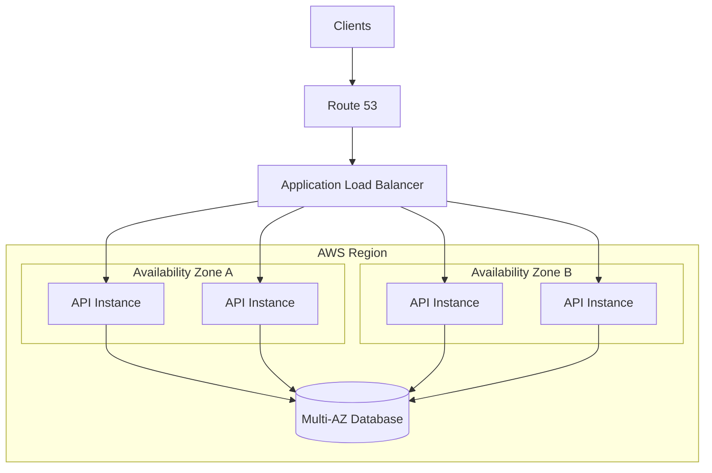

# 03- Multi-AZ vs Multi-Region

## Overview

Multi-Availability Zone (Multi-AZ) and Multi-Region architectures are two different approaches to improving availability and resilience in distributed systems.

The fundamental distinction is the failure domain they protect against:

- **Multi-AZ** protects primarily against failures affecting an Availability Zone while keeping the workload within a single AWS Region.
- **Multi-Region** protects against larger failures, including a complete regional outage, by distributing workloads across geographically separate AWS Regions.

A typical progression is:

```text
Single Instance
      |
      v
Multi-Instance
      |
      v
Multi-AZ
      |
      v
Multi-Region
```

Each step improves resilience but also increases:

- Architectural complexity
- Operational overhead
- Data consistency challenges
- Network latency
- Infrastructure cost
- Deployment complexity

Multi-Region is therefore not automatically better than Multi-AZ. The correct architecture depends on business requirements, particularly **RTO, RPO, availability targets, data consistency requirements, latency requirements, and cost constraints**.

## Availability Domains

AWS infrastructure can be understood as a hierarchy of failure domains:

```text
AWS
 |
 +-- Region
      |
      +-- Availability Zone A
      |     |
      |     +-- Data centers
      |
      +-- Availability Zone B
      |     |
      |     +-- Data centers
      |
      +-- Availability Zone C
            |
            +-- Data centers
```

An Availability Zone is designed as an isolated infrastructure location within a Region.

A Region contains multiple Availability Zones.

This distinction matters because two servers in different AZs have greater fault isolation than two servers running on the same host or within the same AZ.

## Multi-AZ Architecture

Multi-AZ means distributing application infrastructure across multiple Availability Zones within the same Region.

A typical architecture looks like:

```text
                         Users
                           |
                           v
                  Application Load Balancer
                     /               \
                    v                 v
                 AZ-A               AZ-B
                  |                   |
              API-1, API-2        API-3, API-4
                  |                   |
                  +---------+---------+
                            |
                            v
                      Multi-AZ Database
```

The primary goals are:

- Survive an Availability Zone failure.
- Remove single-AZ dependencies.
- Improve application availability.
- Reduce the blast radius of infrastructure failures.
- Allow horizontal scaling across independent failure domains.

For most production workloads, Multi-AZ should be the baseline before considering Multi-Region.

## Why Multi-AZ Exists

A single-AZ architecture has an obvious failure domain:

```text
Region
 |
 +-- AZ-A
      |
      +-- Load Balancer
      +-- Application
      +-- Database
```

If AZ-A experiences a major failure, all critical components may become unavailable.

Multi-AZ distributes those components:

```text
Region
 |
 +-- AZ-A
 |    |
 |    +-- Application
 |
 +-- AZ-B
      |
      +-- Application
```

Now the system can potentially continue serving traffic if one AZ becomes unavailable.

## Multi-AZ Application Design

A stateless API is particularly well suited to Multi-AZ deployment.



The load balancer routes requests to healthy application instances.

If one instance fails:

```text
ALB
 |
 +-- X API-1
 |
 +----> API-2
 +----> API-3
 +----> API-4
```

If an entire AZ fails:

```text
ALB
 |
 +-- X AZ-A
 |
 +----> AZ-B
          |
          +-- API-3
          +-- API-4
```

The remaining AZs must have enough capacity to absorb the additional traffic.

## Multi-AZ Database Design

The database often determines the practical availability of the entire system.

A common pattern is:

```text
             Application
                  |
                  v
             DB Endpoint
                  |
                  v
              Primary
             /       \
            /         \
         AZ-A         AZ-B
                       |
                    Standby
```

The database platform manages replication and failover according to its configured HA model.

Applications should connect through a managed database endpoint rather than hardcoding an individual database node.

During failover:

```text
Primary Database
       |
       X
       |
       v
Standby Database
       |
       v
Promoted Primary
       |
       v
Application reconnects
```

The application must tolerate transient connection failures during this process.

## Multi-AZ Capacity Planning

Redundancy without sufficient capacity does not provide meaningful availability.

Suppose an application requires:

```text
8 instances
```

A poorly designed Multi-AZ deployment might use:

```text
AZ-A = 7 instances
AZ-B = 1 instance
```

If AZ-A fails, the surviving infrastructure cannot handle normal traffic.

A better distribution might be:

```text
AZ-A = 4
AZ-B = 4
```

with autoscaling capable of rapidly adding capacity.

For stronger resilience:

```text
AZ-A = 5
AZ-B = 5
```

The system can tolerate the loss of one AZ with less immediate capacity pressure.

This is commonly called **N+1 capacity planning**.

## Multi-Region Architecture

Multi-Region distributes infrastructure across geographically separate AWS Regions.

For example:

```text
                       Global Users
                       /          \
                      v            v
                 Region A       Region B
                    |               |
                 API Stack       API Stack
                    |               |
                 Database        Database
```

A Multi-Region architecture primarily protects against failures that affect an entire Region.

Potential failure scenarios include:

- Regional infrastructure outage.
- Major networking failure.
- Regional control-plane problems.
- Large-scale operational incidents.
- Regional connectivity problems.
- Compliance or business requirements requiring geographic separation.

## Why Multi-Region Exists

Multi-AZ protects against a subset of infrastructure failures.

Multi-Region addresses a larger failure domain:

```text
Multi-AZ:

Region
 |
 +-- AZ-A
 +-- AZ-B
 +-- AZ-C

Protects against:
AZ failure
```

Whereas:

```text
Multi-Region:

Region A
 |
 +-- AZ-A
 +-- AZ-B

Region B
 |
 +-- AZ-A
 +-- AZ-B

Protects against:
AZ failure
Regional failure
```

The cost is substantially higher architectural complexity.

## Multi-Region Architecture Models

There are several common Multi-Region strategies.

| Model | Region A | Region B | Complexity | Typical Use |
|---|---|---|---|---|
| Backup and Restore | Primary | Backups only | Low | Low-criticality systems |
| Pilot Light | Primary | Minimal infrastructure | Medium | Disaster recovery |
| Warm Standby | Full | Reduced capacity | Medium-High | Faster recovery |
| Active-Passive | Active | Standby | High | Strong DR requirements |
| Active-Active | Active | Active | Very High | Extreme availability / global traffic |

The correct model depends on RTO, RPO, traffic distribution, and consistency requirements.

## Multi-Region Active-Passive

In active-passive architecture, one Region serves production traffic while another is prepared for failover.

```text
                   Global DNS
                       |
                 +-----+-----+
                 |           |
                 v           v
             Region A     Region B
              ACTIVE       STANDBY
                 |           |
              API Stack    API Stack
                 |           |
              Database     Replica
```

During a regional failure:

```text
Region A
   |
   X
   |
   v
Global DNS
   |
   v
Region B
   |
   v
Application
```

Advantages:

- Easier data consistency model than active-active.
- Lower operational complexity.
- Lower cost than fully active-active.
- Easier to reason about writes.

Limitations:

- Standby capacity may be underutilized.
- Failover requires automation.
- RTO depends on how quickly Region B can become fully operational.
- Standby environments must be continuously tested.

## Multi-Region Active-Active

Both Regions serve production traffic.

```text
                       Global Traffic
                       /            \
                      v              v
                 Region A        Region B
                    |                |
                 API A            API B
                    |                |
                 Data A          Data B
```

Advantages:

- Both Regions use production capacity.
- Regional failure can be handled quickly.
- Lower latency for geographically distributed users.
- Better global traffic distribution.

Limitations:

- Much harder data consistency model.
- Cross-region replication introduces latency.
- Concurrent writes can conflict.
- Distributed transactions become difficult.
- Operational complexity is significantly higher.

Active-active is not simply "deploy the same stack twice."

The data architecture must also support the model.

## Global Traffic Routing

Multi-Region architectures need a mechanism to direct users to an appropriate Region.

Common approaches include:

- DNS-based routing.
- Latency-based routing.
- Weighted routing.
- Geolocation routing.
- Health-check-based failover.
- Anycast or global traffic acceleration mechanisms.

A simplified DNS failover model:

```text
                  Route 53
                 /        \
                v          v
            Region A    Region B
             Primary     Standby
```

If Region A becomes unhealthy:

```text
                  Route 53
                     |
                     v
                  Region B
```

DNS-based failover has an important limitation: DNS caching and TTL behavior can affect how quickly clients observe routing changes.

## Multi-AZ vs Multi-Region

| Dimension | Multi-AZ | Multi-Region |
|---|---|---|
| Failure Domain | Availability Zone | Entire Region |
| Geographic Distance | Low | High |
| Network Latency | Low | Higher |
| Data Replication | Usually simpler | More complex |
| Consistency | Easier | Harder |
| Operational Complexity | Moderate | High |
| Cost | Moderate | High |
| RTO | Usually low | Depends on strategy |
| RPO | Usually low | Depends on replication |
| Global Traffic | Not primary goal | Common requirement |
| Disaster Recovery | Strong AZ protection | Regional disaster protection |
| Default Production Choice | Often yes | Requirement-dependent |

## Network Latency

Cross-region communication is slower than communication within the same Region.

Consider:

```text
Application
   |
   v
Same Region Database
   |
   v
Low network latency
```

versus:

```text
Application in Region A
   |
   v
Database in Region B
   |
   v
Cross-region latency
```

This matters for:

- Database writes.
- Synchronous replication.
- Distributed transactions.
- Service-to-service communication.
- Cache operations.
- User-facing APIs.

Avoid unnecessarily putting latency-sensitive synchronous dependencies across Regions.

## Data Replication

Data replication is the central challenge in Multi-Region systems.

A simplified architecture:

```text
Region A
  |
  v
Primary Data
  |
  | asynchronous replication
  v
Region B
  |
  v
Replica Data
```

With asynchronous replication:

```text
Write Region A
      |
      v
Commit locally
      |
      v
Replication
      |
      v
Region B
```

There is a period where Region B may not have the newest data.

This creates **replication lag**.

## RPO and Replication Lag

Suppose:

```text
RPO = 5 minutes
```

and replication lag is:

```text
30 seconds
```

The architecture may satisfy the RPO under normal conditions.

But if replication falls behind to:

```text
10 minutes
```

the RPO requirement is violated.

Therefore, replication lag should be monitored and treated as an operational reliability signal.

## Synchronous Cross-Region Replication

Synchronous cross-region replication attempts to ensure remote replicas acknowledge data before the write is considered complete.

This provides stronger consistency but introduces:

- Higher write latency.
- Dependence on cross-region network health.
- Reduced availability during communication failures.
- Higher infrastructure cost.

It is therefore not automatically the best choice.

For many workloads, asynchronous replication combined with explicit consistency semantics is more practical.

## Strong Consistency vs Availability

Multi-Region architecture forces explicit decisions about consistency.

Consider:

```text
Region A                 Region B
   |                        |
   v                        v
Balance = $100           Balance = $100
```

A user writes in Region A:

```text
Balance = $50
```

Before replication reaches Region B:

```text
Region A                 Region B
   |                        |
   v                        v
Balance = $50            Balance = $100
```

If Region B accepts a conflicting write, the system now has divergent state.

Possible strategies include:

- Single-region writes.
- Region-local writes with conflict resolution.
- Quorum-based writes.
- Strongly consistent distributed databases.
- Eventual consistency.
- Read-your-writes routing.

The appropriate strategy depends on the business operation.

## Single-Writer Multi-Region

A practical compromise is to keep one Region responsible for writes while maintaining another Region for reads or disaster recovery.

```text
Users
  |
  +--------> Region A
  |             |
  |             v
  |          Primary DB
  |
  +--------> Region B
                |
                v
             Read Replica
```

This reduces write conflicts but means Region B cannot necessarily accept writes independently.

It is often easier to operate than true active-active writes.

## Data Ownership

A senior-level Multi-Region design should define where authoritative data lives.

For each entity, determine:

```text
Who owns the data?
Where is it written?
Where is it replicated?
Who can modify it?
What happens during a partition?
How are conflicts resolved?
```

For example:

| Data | Primary Owner | Replication | Failure Strategy |
|---|---|---|---|
| User Profile | Region A | Region B | Failover |
| Product Catalog | Primary Region | Global replicas | Read locally |
| Analytics | Region-local | Event stream | Eventual consistency |
| Session Cache | Regional | Replicated or reconstructed | Rebuild |

## Multi-Region Caching

Caching becomes more complex when multiple Regions exist.

A possible architecture is:

```text
Region A
  |
  +--> API
  +--> Local Cache
  +--> Database

Region B
  |
  +--> API
  +--> Local Cache
  +--> Database
```

Local caches reduce latency.

However, cache invalidation becomes distributed.

If data changes in Region A:

```text
Database A
   |
   v
Cache A invalidated
   |
   v
Cache B still contains old value
```

Possible strategies include:

- Short TTLs.
- Event-driven invalidation.
- Versioned cache keys.
- Region-local cache with authoritative database.
- Cache-aside reconstruction.

Avoid assuming cache consistency automatically follows database replication.

## Messaging Across Regions

Kafka or another messaging platform can be used to propagate events.

```text
Region A
   |
   v
Kafka
   |
   +-----------> Region B
   |
   +-----------> Analytics
```

Events can replicate state asynchronously.

This can decouple services and support eventual consistency.

However, cross-region event processing requires:

- Idempotent consumers.
- Event ordering considerations.
- Duplicate handling.
- Retry strategies.
- Dead-letter handling.
- Schema compatibility.
- Monitoring of replication lag.

## Failure Scenarios

A useful design exercise is to explicitly model failures.

| Failure | Multi-AZ | Multi-Region |
|---|---|---|
| Process failure | Yes | Yes |
| Instance failure | Yes | Yes |
| Host failure | Yes | Yes |
| AZ failure | Yes | Yes |
| Database node failure | Depends on DB HA | Depends on DB HA |
| Region failure | No | Yes |
| Regional network outage | No | Potentially |
| Global DNS issue | No | No |
| Application-wide bug | Potentially | Potentially |
| Global dependency failure | Potentially | Potentially |

Multi-Region does not automatically protect against application-level failures.

A bad deployment replicated to every Region can cause a global outage:

```text
Bad Release
    |
    +--> Region A
    |
    +--> Region B
    |
    v
Global Failure
```

This is why deployment isolation matters.

## Deployment Strategy for Multi-Region

Do not necessarily deploy a new release to every Region simultaneously.

A safer approach is:

```text
Deploy Region A
      |
      v
Validate
      |
      v
Monitor
      |
      v
Deploy Region B
```

This reduces blast radius.

A more advanced approach uses:

```text
Canary
   |
   v
One AZ
   |
   v
One Region
   |
   v
Remaining Regions
```

The exact sequence depends on traffic architecture.

## Multi-Region and Kubernetes

A Kubernetes deployment can use separate clusters:

```text
Region A
 |
 +-- Kubernetes Cluster
      |
      +-- API Pods
      +-- Workers

Region B
 |
 +-- Kubernetes Cluster
      |
      +-- API Pods
      +-- Workers
```

This provides stronger isolation than attempting to treat multiple Regions as one simple cluster.

Each cluster can be independently deployed and operated.

Global traffic management then determines which cluster receives traffic.

## Multi-AZ Kubernetes

Within one Region:

```text
Kubernetes Cluster
 |
 +-- AZ-A
 |    +-- Node
 |    +-- Node
 |
 +-- AZ-B
      +-- Node
      +-- Node
```

Use:

- Multiple replicas.
- Topology spread constraints.
- Pod anti-affinity.
- Pod disruption budgets.
- Cluster autoscaling.
- Multiple node groups.
- Readiness probes.

A three-replica deployment is not sufficiently resilient if all three replicas are scheduled onto the same failure domain.

## Failure Capacity

Suppose normal traffic is:

```text
1000 requests/sec
```

and each AZ handles:

```text
500 requests/sec
```

If one AZ fails:

```text
Remaining AZ = 500 requests/sec capacity
Required = 1000 requests/sec
```

The system cannot maintain normal service.

A resilient design needs either:

- Additional provisioned capacity.
- Autoscaling that reacts quickly enough.
- Load shedding.
- Graceful degradation.
- A combination of these.

The same principle applies at the Region level.

## Cost Considerations

Multi-AZ and Multi-Region have significantly different cost profiles.

### Multi-AZ Costs

Typical additional costs include:

- Additional compute capacity.
- Additional database replicas or standby infrastructure.
- Cross-AZ data transfer.
- Load balancing.
- Additional monitoring.

### Multi-Region Costs

Additional costs can include:

- Duplicate application infrastructure.
- Duplicate databases.
- Cross-region data transfer.
- Replication.
- Global traffic management.
- Additional observability.
- Additional CI/CD infrastructure.
- Operational staffing and maintenance.

The infrastructure bill is only part of the cost.

Operational complexity has an engineering cost as well.

## When Multi-AZ Is Enough

Multi-AZ is generally appropriate when:

- Regional outages are outside the business availability requirement.
- The application is primarily regional.
- Low latency is important.
- Strong consistency is required.
- The database does not support practical multi-region writes.
- The business can tolerate regional recovery procedures.
- Cost and operational simplicity matter.

For many backend applications, this should be the default production architecture.

## When Multi-Region Is Justified

Multi-Region becomes more compelling when:

- Regional outage tolerance is a hard requirement.
- RTO is extremely low.
- Users are globally distributed.
- Regional latency matters.
- Regulatory requirements require geographic redundancy.
- Business impact from regional downtime is extremely high.
- The data platform supports the required consistency model.
- The organization can operate the additional complexity.

Do not choose Multi-Region simply because the application is "large."

## Decision Framework

A practical decision process is:

```text
Define Business Availability Requirement
              |
              v
Define RTO and RPO
              |
              v
Identify Failure Domains
              |
              v
Can Multi-AZ satisfy the requirement?
          /             \
        Yes              No
         |                |
         v                v
    Use Multi-AZ      Evaluate Multi-Region
                           |
                           v
                 Define Data Strategy
                           |
                           v
                 Define Traffic Strategy
                           |
                           v
                 Define Failover Strategy
                           |
                           v
                 Test Regional Failure
```

## Architecture Comparison

### Multi-AZ

```text
                    Users
                      |
                      v
                     ALB
                   /     \
                  v       v
               AZ-A     AZ-B
                |         |
              API-A     API-B
                \         /
                 \       /
                   DB
```

Characteristics:

- One Region.
- Multiple AZs.
- Lower latency.
- Simpler consistency model.
- Strong protection against AZ failures.

### Multi-Region Active-Passive

```text
                       Users
                         |
                         v
                    Global DNS
                    /        \
                   v          v
              Region A     Region B
               ACTIVE       STANDBY
                  |            |
                API          API
                  |            |
                DB-A         DB-B
                  |
                  +---- replication ---->
```

Characteristics:

- Regional disaster protection.
- Easier write consistency.
- Higher cost.
- Failover automation required.

### Multi-Region Active-Active

```text
                       Users
                     /       \
                    v         v
                Region A   Region B
                   |           |
                  API         API
                   |           |
                 Cache       Cache
                   |           |
                  DB-A       DB-B
                    \         /
                     \       /
                    Replication
```

Characteristics:

- Both Regions serve traffic.
- Lower global latency.
- Higher utilization.
- Difficult data consistency model.
- Highest operational complexity.

## Security Considerations

Multi-Region deployments expand the security boundary.

Every Region must have independently validated:

- IAM policies.
- Network controls.
- Security groups.
- Secrets.
- Encryption keys.
- TLS certificates.
- WAF configuration.
- Logging.
- Audit trails.
- Backup policies.

Do not assume that copying infrastructure automatically copies secure configuration.

A regional failover should not require an emergency security exception.

## Observability

A Multi-Region architecture needs region-aware observability.

Track metrics such as:

```text
Region
AZ
Service
Request rate
Error rate
p50 latency
p95 latency
p99 latency
Database replication lag
Queue lag
Cache hit rate
CPU
Memory
Connection count
Failover state
```

Dashboards should make it immediately obvious whether a problem is:

```text
Single instance
      |
      v
Single AZ
      |
      v
Single Region
      |
      v
Global
```

This greatly reduces incident diagnosis time.

## Failover Testing

A failover architecture is only credible if it has been tested.

Test scenarios such as:

- Terminating application instances.
- Removing an Availability Zone from traffic.
- Database failover.
- Redis primary failure.
- Queue broker failure.
- Regional traffic redirection.
- Replication lag.
- DNS failover.
- Expired credentials.
- Failed deployments.

A regional failover test should validate the entire chain:

```text
Failure
  |
  v
Detection
  |
  v
Traffic Routing
  |
  v
Application Startup
  |
  v
Database Connectivity
  |
  v
Cache / Queue Connectivity
  |
  v
User Request
```

Testing only DNS failover is insufficient if the application in the secondary Region cannot connect to its database.

## Common Mistakes

### Assuming Multi-AZ Means Multi-Region

It does not.

```text
Multi-AZ:
One Region + multiple AZs

Multi-Region:
Multiple Regions
```

The failure domains are different.

### Treating Multi-Region as a Simple Copy

Copying the same infrastructure into two Regions does not solve:

- Data consistency.
- Traffic routing.
- Replication.
- Conflict resolution.
- Failover.
- Secrets.
- Observability.

### Ignoring Database Architecture

Running application servers in two Regions while keeping one regional database can create a cross-region dependency that undermines the intended resilience.

### Using Active-Active Writes Without a Conflict Strategy

If two Regions can modify the same data, define exactly how conflicts are prevented or resolved.

### Ignoring DNS Propagation

DNS failover is not instantaneous from every client's perspective.

Account for:

- TTLs.
- Resolver caching.
- Client-side caching.
- Connection persistence.

### Deploying Identical Bad Releases Everywhere

A deployment pipeline can turn a local application bug into a global outage.

Use staged regional deployments and progressive delivery.

### Ignoring Replication Lag

A replica is not necessarily current.

Monitor lag and define what the application should do when the replica is behind.

### Overengineering

Multi-Region adds significant complexity.

If a Multi-AZ design satisfies the business requirement, Multi-Region may provide little additional business value.

## Interview Traps

### "Which Is Better: Multi-AZ or Multi-Region?"

Neither is universally better.

The correct answer depends on:

- Availability target.
- RTO.
- RPO.
- Geographic requirements.
- Consistency requirements.
- Cost.
- Operational maturity.

### "Does Multi-Region Guarantee Zero Downtime?"

No.

Failures can still occur at:

- Application level.
- Database level.
- DNS level.
- Deployment level.
- Dependency level.
- Global control-plane level.

### "Can I Just Replicate the Database?"

Not necessarily.

Replication strategy determines:

- Consistency.
- RPO.
- Write latency.
- Failover behavior.
- Conflict handling.

### "Should Every Service Be Multi-Region?"

Not necessarily.

A system may use different resilience strategies for different services:

```text
Critical API       -> Multi-Region
Analytics          -> Single Region
Batch Processing   -> Regional
Internal Dashboard -> Multi-AZ
```

Architecture should be driven by business criticality.

## Production Checklist

### Multi-AZ

- [ ] Application instances span multiple AZs.
- [ ] Load balancing spans multiple AZs.
- [ ] Database HA is configured.
- [ ] Cache HA is configured where required.
- [ ] Capacity can survive AZ loss.
- [ ] Readiness checks are implemented.
- [ ] Autoscaling is configured.
- [ ] Failover has been tested.

### Multi-Region

- [ ] RTO is explicitly defined.
- [ ] RPO is explicitly defined.
- [ ] Traffic failover is automated or operationally documented.
- [ ] Database replication strategy is documented.
- [ ] Replication lag is monitored.
- [ ] Data conflict strategy is defined.
- [ ] Secondary Region is continuously validated.
- [ ] Secrets and encryption configuration exist in every Region.
- [ ] CI/CD supports independent regional deployment.
- [ ] Observability covers every Region.
- [ ] Regional failover has been tested.

## Interview Design Framework

When asked to design a highly available AWS architecture, reason through the problem in this order:

```text
Business Requirements
        |
        v
Availability Target
        |
        v
RTO / RPO
        |
        v
Failure Domains
        |
        v
Multi-AZ Requirement
        |
        v
Regional Failure Requirement
        |
        v
Multi-Region Strategy
        |
        v
Data Replication
        |
        v
Traffic Routing
        |
        v
Failover
        |
        v
Observability
        |
        v
Cost
```

A strong system-design answer should explicitly explain why the architecture chooses Multi-AZ, Multi-Region, or both.

## Key Takeaways

- **Multi-AZ protects against Availability Zone failures within one Region and is the normal baseline for production workloads; Multi-Region protects against larger regional failures and introduces substantially more complexity.**
- **Multi-Region architecture is primarily a data and consistency problem, not merely an infrastructure duplication problem.**
- **RTO, RPO, consistency requirements, geographic latency, business impact, and cost should determine whether active-passive, warm standby, or active-active Multi-Region architecture is justified.**
- **A highly available architecture must include sufficient failure capacity, traffic failover, dependency recovery, observability, and tested recovery procedures—not just redundant infrastructure.**
- **Use Multi-AZ by default when it satisfies the business requirement; introduce Multi-Region only when the additional resilience or geographic capability justifies its operational and financial cost.**