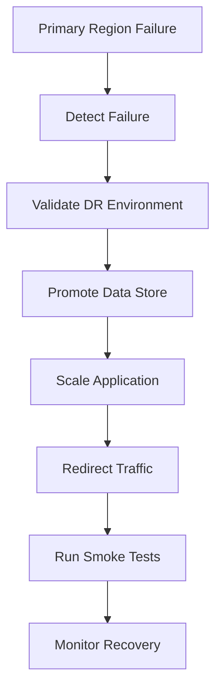
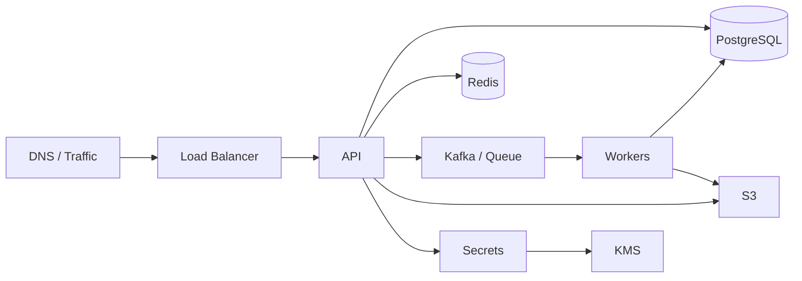
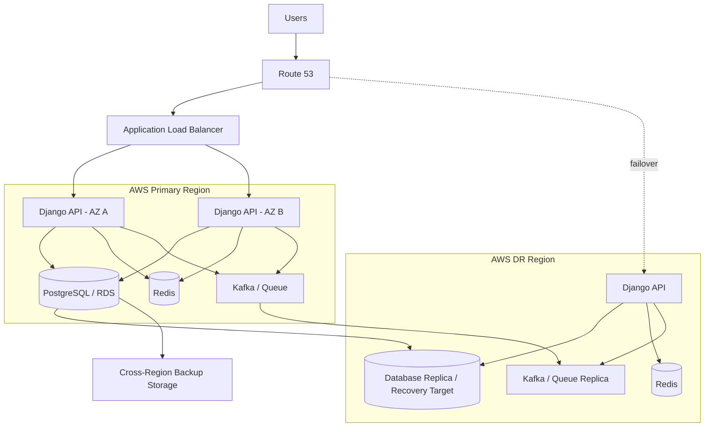

# 04- Disaster Recovery

## Overview

Disaster Recovery (DR) is the set of architectural, operational, and procedural mechanisms used to restore a system after a major failure.

High availability and disaster recovery solve related but different problems:

- **High Availability (HA)** keeps a system serving traffic during expected infrastructure failures.
- **Disaster Recovery (DR)** restores service and data after failures that exceed the normal availability design.

A production system should explicitly define:

- What failures it must survive.
- How much data loss is acceptable.
- How quickly service must be restored.
- Which components must be recovered first.
- How recovery is automated.
- How recovery is tested.
- How much the organization is willing to spend on resilience.

A useful mental model is:

```text
                    Reliability
                        |
          +-------------+-------------+
          |                           |
          v                           v
    High Availability          Disaster Recovery
          |                           |
      Stay online               Restore service
      during failures           after major failure
```

DR is therefore not simply "taking backups." A backup that cannot be restored within the required RTO is not a sufficient disaster recovery strategy.

## What Counts as a Disaster?

A disaster is any failure that exceeds the assumptions of the normal production architecture.

Examples include:

| Failure | Typical Scope | DR Relevance |
|---|---|---|
| Process crash | Instance | Usually HA |
| EC2 instance failure | Instance | Usually HA |
| AZ failure | AZ | HA / DR depending on design |
| Database primary failure | Database | Usually HA |
| Region outage | Region | Strong DR concern |
| Accidental database deletion | Data | Strong DR concern |
| Ransomware / destructive modification | Data | Strong DR concern |
| Corrupted deployment | Application | Recovery / rollback |
| Credential compromise | Security | Recovery + incident response |
| Operator error | Application/data | Recovery |
| Dependency outage | External system | Resilience + DR |
| Complete AWS account compromise | Account | Advanced DR |

The key question is not whether a failure is theoretically possible.

The key question is:

> What failure can the business tolerate, and how quickly must the system recover?

## Recovery Objectives

The two most important DR metrics are **RTO** and **RPO**.

### Recovery Time Objective

**RTO** defines the maximum acceptable time required to restore service.

```text
Failure
  |
  |<--------- RTO --------->|
  |                         |
  v                         v
Failure                 Service Restored
```

For example:

```text
RTO = 30 minutes
```

means the recovery process should restore the required service within 30 minutes.

RTO is a business requirement that becomes a technical architecture constraint.

### Recovery Point Objective

**RPO** defines the maximum acceptable amount of data loss measured in time.

```text
Last valid recovery point
          |
          |<------ RPO ------>|
          |                   |
          v                   v
     Recoverable          Failure
        data
```

For example:

```text
RPO = 5 minutes
```

means losing up to approximately five minutes of recent writes may be acceptable.

### RTO vs RPO

| Requirement | Meaning | Primary Concern |
|---|---|---|
| RTO | Maximum recovery time | How quickly service returns |
| RPO | Maximum acceptable data loss | How much recent data may be lost |

A system can have:

```text
RTO = 15 minutes
RPO = 1 hour
```

This means service must return quickly, but up to an hour of recent data loss may be acceptable.

Alternatively:

```text
RTO = 4 hours
RPO = 5 minutes
```

The system can take longer to recover but must preserve almost all recent data.

## Recovery Strategies

There are four commonly discussed AWS disaster recovery strategies:

| Strategy | Secondary Environment | Recovery Speed | Cost | Complexity |
|---|---|---:|---:|---:|
| Backup and Restore | Backups only | Slow | Low | Low |
| Pilot Light | Minimal core infrastructure | Medium | Low-Medium | Medium |
| Warm Standby | Reduced-capacity running system | Fast | Medium-High | High |
| Active-Active | Fully operational production system | Very Fast | High | Very High |

These are not rigid categories. Real systems often combine strategies.

## Backup and Restore

The simplest DR architecture stores backups and recreates infrastructure after a disaster.

```text
                    Production
                        |
                        v
                     Database
                        |
                        v
                      Backup
                        |
                        v
                  Backup Storage
                        |
                  Disaster occurs
                        |
                        v
                Restore Infrastructure
                        |
                        v
                   Restore Data
                        |
                        v
                 Resume Service
```

A typical AWS implementation might use:

- Amazon S3 for backup artifacts.
- Amazon RDS automated backups and snapshots.
- AWS Backup.
- Infrastructure as Code.
- EBS snapshots.
- Database-native backups.
- Application configuration stored outside individual instances.

### Advantages

- Lowest infrastructure cost.
- Simple architecture.
- Suitable for lower-criticality workloads.
- Easy to understand operationally.

### Limitations

- Recovery can take significant time.
- Infrastructure must be recreated.
- Large databases can take a long time to restore.
- Manual steps can increase recovery risk.

### Production Considerations

The recovery procedure should be automated as much as practical.

For example:

```text
Infrastructure as Code
        |
        v
Create VPC
        |
        v
Create Database
        |
        v
Restore Backup
        |
        v
Deploy Application
        |
        v
Run Validation
        |
        v
Route Traffic
```

If recovery requires someone to manually remember 40 undocumented commands, the real RTO is much higher than the theoretical RTO.

## Pilot Light

Pilot light keeps only the minimum infrastructure required for recovery continuously available.

```text
Primary Region
 |
 +-- Application
 +-- Database
 |
 +-- Replication
       |
       v
Secondary Region
 |
 +-- Minimal infrastructure
 +-- Replicated data
```

The secondary Region contains the core building blocks, but application capacity may not be running at production scale.

During recovery:

```text
Failure
  |
  v
Scale Secondary Region
  |
  v
Deploy / Activate Application
  |
  v
Promote Database
  |
  v
Run Validation
  |
  v
Route Traffic
```

### Advantages

- Lower cost than a full warm standby.
- Faster recovery than backup-only approaches.
- Useful when database replication is important.

### Limitations

- Recovery requires scaling and activation.
- Secondary infrastructure must remain valid.
- Configuration drift can become a problem.

## Warm Standby

Warm standby maintains a functional but reduced-capacity copy of the production environment.

```text
                 Global Traffic
                       |
                +------+------+
                |             |
                v             v
             Region A      Region B
              ACTIVE       WARM
                |             |
              API           API
                |             |
              DB            DB
```

The standby environment is continuously running.

During a disaster:

```text
Region A
   |
   X
   |
   v
Traffic Manager
   |
   v
Region B
   |
   v
Scale Application
   |
   v
Serve Production Traffic
```

### Advantages

- Faster RTO.
- Infrastructure is already deployed.
- Easier to validate continuously.
- Lower recovery uncertainty than backup-only.

### Limitations

- Higher cost.
- Requires data replication.
- Secondary capacity may still be insufficient for full production traffic.

## Active-Active

Both Regions continuously serve production traffic.

```text
                    Global Traffic
                    /            \
                   v              v
              Region A        Region B
                 |                |
               API A            API B
                 |                |
               Data A          Data B
                  \              /
                   \            /
                    Replication
```

This can provide very low recovery time because the secondary Region is already serving traffic.

However, it is significantly harder to design.

The biggest challenge is usually data ownership and consistency.

```text
User A
  |
  v
Region A
  |
  +-- Write X

User B
  |
  v
Region B
  |
  +-- Write Y
```

If both writes modify the same entity, the system needs a clearly defined conflict strategy.

## Backup Strategy

A robust backup strategy should answer:

- What is backed up?
- How frequently?
- Where is it stored?
- How long is it retained?
- Is it encrypted?
- Is it immutable?
- Can it be restored?
- How quickly can it be restored?
- Who can delete it?
- Is it protected from the production account?

A useful backup model is:

```text
Production
    |
    +----> Frequent Backup
    |
    +----> Daily Backup
    |
    +----> Long-Term Archive
    |
    +----> Cross-Region Copy
    |
    +----> Cross-Account Copy
```

## The 3-2-1 Principle

A practical backup strategy commonly follows the 3-2-1 principle:

- Keep multiple copies of important data.
- Use multiple storage media or logical storage systems.
- Keep at least one copy isolated from the primary environment.

For cloud systems, the isolation requirement can be implemented through:

- Separate AWS accounts.
- Separate Regions.
- Backup vaults.
- Restricted IAM permissions.
- Object Lock or immutable retention where appropriate.

The exact implementation should be driven by the threat model.

## Database Recovery

Databases are usually the most important component in DR.

A database recovery plan should define:

```text
Backup
  |
  v
Restore
  |
  v
Integrity Check
  |
  v
Application Compatibility
  |
  v
Traffic Restoration
```

For PostgreSQL, possible recovery mechanisms include:

- Automated backups.
- Point-in-time recovery.
- WAL archiving.
- Read replicas.
- Cross-region replication.
- Logical replication for selected architectures.

For Amazon RDS and Aurora, managed backup and replication capabilities can significantly reduce operational work.

## Point-in-Time Recovery

Point-in-time recovery allows the database to be restored to a specific time rather than only to a fixed snapshot.

For example:

```text
10:00  Valid data
10:15  Valid data
10:30  Bad deployment
10:35  Accidental DELETE
10:40  Incident detected
```

A snapshot alone may not provide the desired recovery point.

With continuous transaction log or WAL-based recovery, the database may be recoverable to a point shortly before the destructive operation.

This is particularly important for:

- Accidental deletes.
- Corrupted updates.
- Bad migrations.
- Application bugs.
- Operator errors.

## Backups Are Not Enough

Consider:

```text
Backup exists = Yes
Restore tested = No
```

The actual recovery confidence is low.

A backup may be unusable because:

- Credentials are missing.
- Encryption keys are unavailable.
- Backup metadata is corrupted.
- The restore procedure is undocumented.
- Application configuration has changed.
- Database schema is incompatible.
- Dependencies cannot be recreated.
- The restore takes longer than the RTO.

Therefore:

> A backup is an asset; a tested restore procedure is a recovery capability.

## Application Recovery

Application recovery should not depend on individual servers.

Use reproducible infrastructure:

```text
Git Repository
      |
      v
CI/CD
      |
      v
Container Image
      |
      v
Infrastructure as Code
      |
      v
AWS Environment
```

Common tools include:

- Terraform.
- AWS CloudFormation.
- AWS CDK.
- Docker.
- Kubernetes.
- GitHub Actions.
- Configuration management systems.

A production environment should be reproducible from version-controlled definitions.

## Infrastructure as Code

Infrastructure as Code is particularly valuable for DR because the recovery environment can be reconstructed consistently.

For example:

```text
Terraform
   |
   +-- VPC
   +-- Subnets
   +-- IAM
   +-- ALB
   +-- ECS/EKS
   +-- RDS
   +-- Security Groups
   +-- Monitoring
```

A DR environment should not be maintained exclusively through manual console changes.

### Configuration Drift

Suppose production has:

```text
Version A
```

but the DR environment has:

```text
Version B
```

If the DR environment has not been exercised recently, the failure may be discovered only during an incident.

Automated drift detection and periodic reconciliation reduce this risk.

## Stateless Application Recovery

Stateless applications are easier to recover.

For example:

```text
ALB
 |
 +-- API instance
 +-- API instance
 +-- API instance
```

The instances do not contain authoritative state.

State should live in external systems:

```text
API
 |
 +-- PostgreSQL
 +-- Redis
 +-- Object Storage
 +-- Kafka
```

A new application instance can therefore be created from the same image.

This architecture is highly compatible with:

- Auto Scaling.
- Kubernetes.
- ECS.
- Blue/green deployment.
- Disaster recovery automation.

## Stateful Recovery

Stateful systems require more careful planning.

Examples include:

- PostgreSQL.
- Redis.
- Kafka.
- Persistent volumes.
- Object storage.
- File systems.

For each stateful dependency, define:

| Question | Example |
|---|---|
| Source of truth | PostgreSQL |
| Backup method | Automated snapshot |
| Replication | Cross-region replica |
| Recovery point | 5 minutes |
| Recovery time | 30 minutes |
| Recovery process | Automated |
| Validation | Integrity checks |
| Ownership | Platform team |

## Redis and Disaster Recovery

Redis is often used as a cache rather than the source of truth.

If Redis contains reconstructible cache data:

```text
Database
   |
   v
Application
   |
   v
Redis
```

Redis recovery may be less critical than database recovery.

After a disaster, the cache can potentially be rebuilt:

```text
Empty Redis
    |
    v
Application reads database
    |
    v
Cache populated
```

However, Redis may contain critical state in some systems, such as:

- Distributed locks.
- Rate-limit state.
- Session state.
- Queues.
- Job metadata.

In those cases, Redis becomes part of the DR design and cannot simply be treated as disposable cache.

## Kafka and Disaster Recovery

Kafka DR requires consideration of:

- Topic replication.
- Partition ownership.
- Consumer offsets.
- Message retention.
- Cross-region replication.
- Ordering.
- Duplicate processing.
- Producer and consumer failover.

A simplified architecture is:

```text
Region A Kafka
     |
     | replication
     v
Region B Kafka
```

Consumers must be designed to tolerate replay and duplication.

For most event-driven systems:

> At-least-once delivery plus idempotent consumers is usually easier to operate than assuming exactly-once behavior across a disaster boundary.

## Object Storage Recovery

Object storage often becomes a critical DR dependency.

Important mechanisms include:

- Versioning.
- Lifecycle policies.
- Replication.
- Encryption.
- Access controls.
- Object Lock where required.
- Separate backup copies.

For example:

```text
Application
    |
    v
S3 Bucket A
    |
    | replication
    v
S3 Bucket B
```

Versioning can help recover from accidental overwrites and deletions.

## DNS and Traffic Recovery

A DR architecture must explain how users reach the recovered environment.

Possible mechanisms include:

- Route 53 health checks.
- Failover routing.
- Weighted routing.
- Latency-based routing.
- CloudFront.
- Global Accelerator.
- External DNS providers.

A simplified failover path:

```text
                    User
                      |
                      v
                 DNS / Global
                  Traffic Layer
                    /     \
                   v       v
             Region A   Region B
              ACTIVE     DR
```

Traffic should be routed only after the recovery environment passes health validation.

## Recovery Validation

Do not switch traffic merely because infrastructure is running.

Validate:

- Database connectivity.
- Schema compatibility.
- Authentication.
- Authorization.
- Cache availability.
- Message processing.
- External dependencies.
- API health.
- Background workers.
- Critical user journeys.

A health check should represent actual application readiness, not merely process existence.

Poor:

```text
HTTP 200 /health
```

Better:

```text
Application
   |
   +-- Database reachable
   +-- Required configuration loaded
   +-- Critical dependencies available
   +-- Application accepting traffic
```

Do not make readiness checks depend on every optional dependency, otherwise an unrelated degraded dependency can prevent recovery.

## Failover Automation

A production DR process should automate repetitive operations.

A simplified workflow:



Automation reduces:

- Human error.
- Recovery time.
- Dependency on individual engineers.
- Ambiguity during incidents.

Automation should still have controlled approval gates for destructive or irreversible operations.

## Disaster Recovery Runbook

A runbook should contain concrete procedures rather than vague instructions.

Weak:

```text
Restore database and redirect traffic.
```

Strong:

```text
1. Confirm primary Region is unavailable.
2. Verify the incident is not an application-level failure.
3. Confirm latest replicated database timestamp.
4. Promote the secondary database.
5. Deploy the approved application version.
6. Scale application capacity.
7. Validate authentication and critical APIs.
8. Redirect traffic.
9. Monitor error rate and latency.
10. Record actual RTO and RPO.
```

The runbook should identify:

- Commands.
- AWS resources.
- Required permissions.
- Responsible teams.
- Rollback procedure.
- Validation criteria.
- Escalation contacts.
- Expected recovery times.

## DR Testing

DR should be tested regularly.

Testing approaches include:

| Test Type | Scope | Risk |
|---|---|---|
| Tabletop Exercise | Process | Low |
| Restore Test | Backup recovery | Low-Medium |
| Component Failover | Individual dependency | Medium |
| AZ Failure Simulation | Regional infrastructure | Medium |
| Regional Failover | Full DR | High |
| Chaos Testing | Controlled failure | High |

A mature organization gradually progresses from low-risk tests to realistic regional recovery exercises.

## Restore Testing

A useful restore test looks like:

```text
Backup
  |
  v
Create Isolated Environment
  |
  v
Restore Database
  |
  v
Deploy Application
  |
  v
Run Tests
  |
  v
Measure RTO/RPO
  |
  v
Destroy Test Environment
```

Measure the actual recovery time.

Do not simply record:

```text
Backup completed successfully.
```

Record:

```text
Backup timestamp: 10:00
Failure simulation: 12:00
Restore started: 12:05
Database available: 12:18
Application available: 12:25
Traffic restored: 12:28

Observed RTO: 28 minutes
Observed RPO: 5 minutes
```

This turns DR from documentation into an engineering capability.

## Security Considerations

DR systems are attractive targets because they contain copies of production data.

Protect backups using:

- Encryption at rest.
- Encryption in transit.
- Strong IAM policies.
- Separate backup accounts.
- Restricted deletion permissions.
- MFA-protected administrative operations.
- Immutable retention where appropriate.
- Audit logging.
- Key management controls.

A compromised production account should ideally not have unrestricted ability to destroy every backup.

Consider a trust boundary such as:

```text
Production Account
        |
        | restricted backup operation
        v
Backup Account
        |
        v
Immutable Backup Storage
```

## Secrets and Encryption Keys

Recovery environments require access to secrets and encryption keys.

Do not store production credentials inside:

- Source code.
- Docker images.
- AMIs.
- Git repositories.
- Unencrypted configuration files.

Use services such as:

- AWS Secrets Manager.
- AWS Systems Manager Parameter Store.
- AWS KMS.

The DR environment must have controlled access to the required secrets.

A common failure mode is:

```text
Infrastructure restored
        |
        v
Database restored
        |
        v
Application cannot start
        |
        v
Missing secret / KMS permission
```

Secret and key recovery must therefore be part of DR testing.

## Monitoring and Alerting

Monitor DR readiness continuously.

Useful metrics include:

- Backup success rate.
- Backup age.
- Backup retention.
- Restore test results.
- Replication lag.
- Replication failures.
- DR environment health.
- Infrastructure drift.
- RTO test results.
- RPO test results.
- Secondary Region capacity.
- DNS health.
- Certificate expiration.
- KMS key availability.
- Secret availability.

A useful dashboard separates:

```text
Production Health
        |
        +-- Application
        +-- Database
        +-- Network

DR Readiness
        |
        +-- Backups
        +-- Replication
        +-- Secondary Infrastructure
        +-- Recovery Tests
        +-- Configuration
```

## Cost Considerations

DR cost generally increases as RTO decreases.

A simplified relationship is:

```text
Lower RTO
   |
   v
More continuously running infrastructure
   |
   v
Higher Cost
```

For example:

| Strategy | Relative Cost | RTO |
|---|---:|---:|
| Backup/Restore | Low | High |
| Pilot Light | Low-Medium | Medium |
| Warm Standby | Medium-High | Low |
| Active-Active | High | Very Low |

The goal is not minimum recovery time at any cost.

The goal is:

> The lowest-cost architecture that reliably satisfies the business RTO, RPO, and availability requirements.

## Disaster Recovery for Django and FastAPI

A Django or FastAPI application should be designed so application recovery is largely independent of individual servers.

A typical architecture:

```text
                 Route 53 / Global Traffic
                           |
                           v
                     Load Balancer
                           |
                           v
                  Django / FastAPI
                    /          \
                   v            v
             PostgreSQL       Redis
                   |
                   v
              Object Storage
```

The application image should be reproducible:

```dockerfile
FROM python:3.12-slim

WORKDIR /app

COPY requirements.txt .
RUN pip install --no-cache-dir -r requirements.txt

COPY . .

CMD ["gunicorn", "config.wsgi:application", "--bind", "0.0.0.0:8000"]
```

The exact runtime may differ for FastAPI, but the principle remains the same:

- Build immutable artifacts.
- Store images in a registry.
- Version deployments.
- Keep application state outside containers.
- Recreate instances rather than manually repairing them.

## Background Jobs and Celery

A DR strategy must include asynchronous workers.

For example:

```text
API
 |
 v
Redis / Kafka
 |
 v
Celery Workers
```

If the API recovers but workers do not, the system may appear healthy while background processing is broken.

Recovery should account for:

- Broker availability.
- Queue persistence.
- Worker deployment.
- Duplicate tasks.
- Task retries.
- Task idempotency.
- Dead-letter handling.

Workers should be safe to restart because disaster recovery may cause tasks to be re-delivered.

## Deployment Recovery

A DR architecture must account for bad software releases as well as infrastructure disasters.

Useful mechanisms include:

- Immutable container images.
- Versioned deployments.
- Blue/green deployments.
- Canary releases.
- Automated rollback.
- Database migration compatibility.
- Feature flags.

A common failure is:

```text
Database backup = healthy
Infrastructure = healthy
Application release = broken
```

DR cannot compensate for unsafe deployment practices.

## Database Migration Safety

Database migrations deserve special attention because schema changes can affect rollback and recovery.

Prefer backward-compatible migrations:

```text
Deploy application supporting old + new schema
              |
              v
Apply schema change
              |
              v
Migrate data
              |
              v
Enable new behavior
              |
              v
Remove old schema later
```

Avoid tightly coupling a destructive schema change with an application release when rapid rollback is required.

## Recovery Dependencies

A common DR mistake is restoring the primary application but forgetting dependencies.

A complete dependency map might look like:



Every critical dependency should have an explicit recovery strategy.

## Dependency Recovery Matrix

| Dependency | Recovery Strategy | RPO | RTO |
|---|---|---:|---:|
| PostgreSQL | Replica / PITR | 5 min | 30 min |
| Redis Cache | Rebuild | N/A | 10 min |
| Kafka | Replication | 5 min | 30 min |
| S3 | Versioning / Replication | Low | Low |
| Secrets | Cross-region / replicated | Low | Low |
| Application | Container registry + IaC | N/A | 15 min |
| DNS | Health-based routing | N/A | 5 min |

The exact values are workload-specific.

## Disaster Recovery Anti-Patterns

### Backup Without Restore Testing

```text
Backup success
    !=
Recovery success
```

### Manual Recovery Only

Manual procedures are vulnerable to:

- Human error.
- Missing credentials.
- Forgotten steps.
- Incident pressure.
- Staff availability.

### DR Environment Never Tested

An unused standby environment gradually develops:

- Configuration drift.
- Expired certificates.
- Broken IAM permissions.
- Missing secrets.
- Incompatible application versions.

### Same Failure Domain

Storing production data and backups in the same failure domain weakens disaster recovery.

### No RTO/RPO

Without explicit targets, architecture decisions become arbitrary.

### DR Only for Infrastructure

Application bugs, data corruption, bad deployments, and operator mistakes also require recovery mechanisms.

## Interview Traps

### "Is a Database Backup a Disaster Recovery Strategy?"

Not by itself.

You need:

```text
Backup
+
Restore Procedure
+
Infrastructure Recovery
+
Application Recovery
+
Validation
+
Traffic Recovery
```

### "Which DR Strategy Is Best?"

There is no universally best strategy.

The correct answer depends on:

- RTO.
- RPO.
- Budget.
- Business criticality.
- Data size.
- Geographic requirements.
- Operational maturity.

### "Can We Have Zero RPO?"

Potentially, but it usually requires stronger replication guarantees and introduces significant cost and complexity.

The important question is whether the business actually requires it.

### "Can Active-Active Eliminate DR?"

No.

Active-active improves availability but does not eliminate:

- Data corruption.
- Bad deployments.
- Application bugs.
- Security incidents.
- Global configuration mistakes.

You still need backups and recovery mechanisms.

### "Is Multi-Region Always Required?"

No.

A well-designed Multi-AZ architecture with robust backups may satisfy the business requirement.

## Production DR Checklist

### Requirements

- [ ] Business-critical services are identified.
- [ ] RTO is defined for each critical service.
- [ ] RPO is defined for each critical data set.
- [ ] Acceptable downtime is documented.
- [ ] Acceptable data loss is documented.

### Infrastructure

- [ ] Infrastructure is defined as code.
- [ ] Application artifacts are reproducible.
- [ ] DR infrastructure can be recreated.
- [ ] Configuration drift is monitored.
- [ ] Network dependencies are documented.

### Data

- [ ] Database backups are enabled.
- [ ] Point-in-time recovery is configured where required.
- [ ] Backups are encrypted.
- [ ] Backups are protected from production-account deletion.
- [ ] Cross-region copies exist where required.
- [ ] Restore tests are performed.

### Application

- [ ] Application images are versioned.
- [ ] Deployment is automated.
- [ ] Rollback is documented.
- [ ] Database migrations are recovery-safe.
- [ ] Background workers are recoverable.
- [ ] Application dependencies are documented.

### Security

- [ ] Backup access uses least privilege.
- [ ] Encryption keys are recoverable.
- [ ] Secrets are available to the DR environment.
- [ ] Administrative operations are audited.
- [ ] Backup deletion is protected.

### Operations

- [ ] DR runbooks exist.
- [ ] Recovery procedures have owners.
- [ ] Restore tests are scheduled.
- [ ] Regional failover is tested where required.
- [ ] Actual RTO and RPO are measured.
- [ ] DR documentation is updated after infrastructure changes.

## Practical DR Design Example

Consider a Django REST API deployed on AWS.

Requirements:

```text
RTO = 30 minutes
RPO = 5 minutes
```

A reasonable architecture could be:



The recovery procedure could be:

```text
1. Detect primary-region failure.
2. Confirm the failure exceeds normal HA recovery.
3. Validate latest database replication point.
4. Promote or restore the DR database.
5. Deploy the approved application image.
6. Scale DR application capacity.
7. Restore required secrets and configuration.
8. Validate database connectivity.
9. Validate authentication and critical APIs.
10. Validate background processing.
11. Redirect traffic.
12. Monitor error rate, latency, and data consistency.
13. Record observed RTO and RPO.
```

This is a complete recovery workflow rather than simply "restore the backup."

## Key Takeaways

- **Disaster Recovery is an end-to-end recovery capability covering data, infrastructure, applications, dependencies, traffic, security, and operational procedures—not merely backups.**
- **RTO determines how quickly service must return, while RPO determines how much recent data loss the business can tolerate; these requirements should drive the DR architecture.**
- **Backup and restore, pilot light, warm standby, and active-active provide progressively faster recovery at increasing infrastructure and operational cost.**
- **A DR strategy is only credible when restore and failover procedures are regularly tested, measured, automated where practical, and protected against configuration drift and security failures.**
- **Production DR must account for application releases, database migrations, asynchronous workers, caches, queues, secrets, encryption keys, and external dependencies in addition to the primary database and compute infrastructure.**