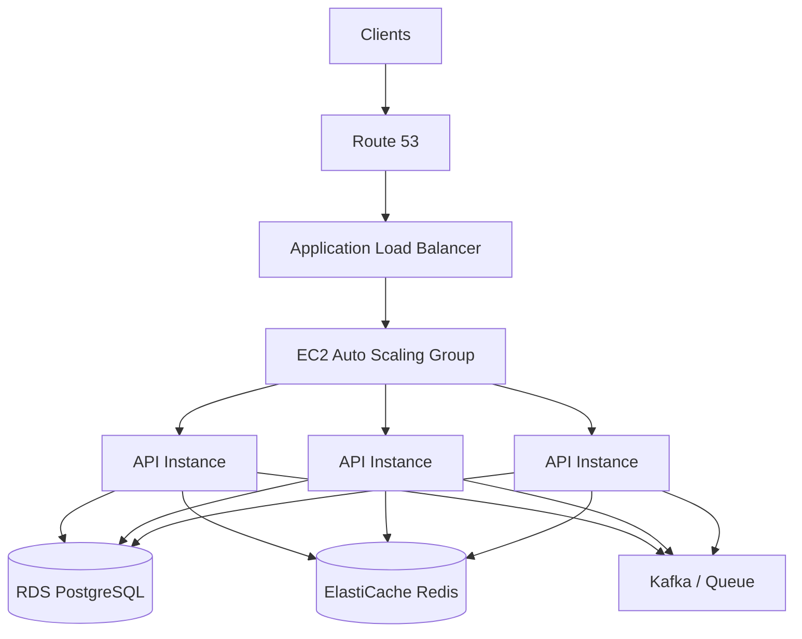
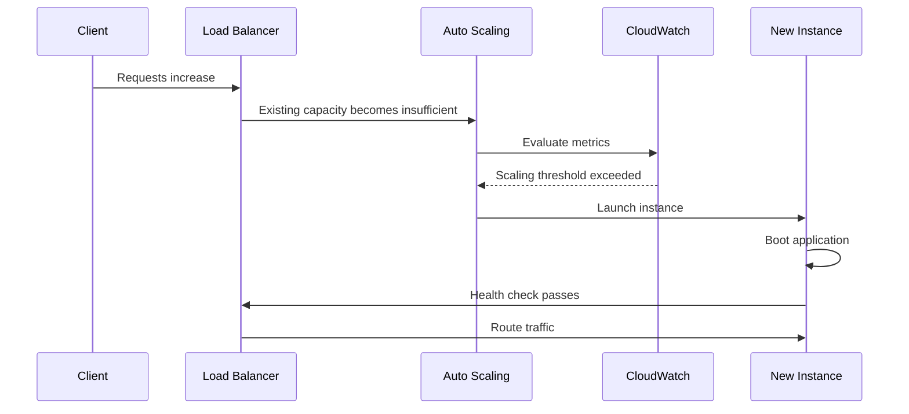

# 05- Auto Scaling

## Overview

Auto Scaling is the capability to dynamically adjust compute capacity based on workload demand, system health, or predefined operational rules.

In a production backend system, traffic is rarely constant:

```text
Requests
  ^
  |                    /\ 
  |          /\       /  \
  |    /\   /  \_____/    \__
  |___/  \_/                 \____
  +---------------------------------> Time
```

A fixed-capacity deployment must either:

- Provision enough capacity for peak traffic and waste resources during normal periods.
- Provision for normal traffic and risk overload during traffic spikes.

Auto Scaling attempts to match capacity to demand:

```text
Low Traffic      -> Fewer Instances
Normal Traffic   -> Normal Capacity
High Traffic     -> More Instances
Traffic Drops    -> Scale In
```

For backend engineers, Auto Scaling is not simply "add more EC2 instances." A complete design must consider:

- How demand is measured.
- What metric triggers scaling.
- How quickly capacity becomes available.
- How quickly instances can be removed.
- Whether the application is stateless.
- How load balancing interacts with scaling.
- Whether downstream systems can handle the increased load.
- How deployments interact with scaling.
- How scaling behaves during failures.
- How scaling affects cost.

On AWS, common mechanisms include:

- EC2 Auto Scaling Groups.
- Application Load Balancers.
- ECS Service Auto Scaling.
- EKS Horizontal Pod Autoscaler.
- AWS Lambda concurrency scaling.
- Target tracking policies.
- Step scaling.
- Scheduled scaling.
- Predictive scaling.

## Why Auto Scaling Exists

The fundamental problem is capacity planning.

Suppose an API normally receives:

```text
100 requests/second
```

but occasionally receives:

```text
5,000 requests/second
```

If one application instance can safely process:

```text
250 requests/second
```

then normal traffic requires approximately:

```text
100 / 250 = 0.4
```

so one instance may be sufficient.

Peak traffic requires:

```text
5,000 / 250 = 20 instances
```

Running 20 instances permanently would waste substantial capacity.

Auto Scaling allows the system to operate closer to:

```text
Normal:
1–3 instances

Peak:
20+ instances
```

while maintaining safety margins.

## Horizontal vs Vertical Scaling

Auto Scaling generally refers to **horizontal scaling**, but understanding the difference is important.

| Scaling Type | Mechanism | Example | Limitation |
|---|---|---|---|
| Vertical | Increase machine size | 2 vCPU → 8 vCPU | Hardware limit |
| Horizontal | Add instances | 2 → 20 instances | Requires distributed design |
| Scale In | Remove capacity | 20 → 5 instances | Must avoid premature termination |
| Elastic Scaling | Automatically change capacity | 5 → 20 → 5 | Requires good policies |

### Vertical Scaling

```text
Instance
  |
  +-- 2 vCPU
  +-- 4 GB RAM

       |
       v

Instance
  |
  +-- 8 vCPU
  +-- 32 GB RAM
```

Vertical scaling is useful when:

- The workload is difficult to distribute.
- A database needs more resources.
- An application is not horizontally scalable.

However, vertical scaling eventually hits machine limits and often requires downtime or migration.

### Horizontal Scaling

```text
              Load Balancer
              /     |      \
             v      v       v
           API-1  API-2   API-3
```

Horizontal scaling is generally preferred for stateless web applications.

## Stateless Applications and Auto Scaling

Auto Scaling works best when application instances are disposable.

A stateless API should not depend on local instance state:

```text
Bad:

User
 |
 v
API Instance
 |
 +-- Local Session
 +-- Local Uploaded Files
 +-- Local Application State
```

Instead:

```text
User
 |
 v
Load Balancer
 |
 +----> API-1
 +----> API-2
 +----> API-3
          |
          +----> PostgreSQL
          +----> Redis
          +----> S3
```

This allows an instance to be terminated and replaced without losing authoritative state.

For Django and FastAPI services, this means:

- Store sessions externally when required.
- Store uploaded files in object storage.
- Store persistent data in a database.
- Store distributed cache state in Redis.
- Avoid relying on local disk.
- Avoid process-local state for cross-request coordination.

## Auto Scaling Architecture

A typical AWS API architecture looks like:



The Auto Scaling Group manages compute capacity while the load balancer distributes requests.

## Request Lifecycle During Scale Out

Consider a sudden traffic increase.



The critical point is that a newly launched instance should not receive production traffic until it is actually ready.

## Auto Scaling Group

An EC2 Auto Scaling Group maintains a desired number of instances.

Important parameters include:

| Parameter | Meaning |
|---|---|
| Minimum Capacity | Lowest number of instances |
| Desired Capacity | Target number of instances |
| Maximum Capacity | Upper scaling limit |
| Launch Template | Defines how instances are created |
| Health Check | Determines instance health |
| Availability Zones | Failure domains used by the group |

For example:

```text
min = 2
desired = 4
max = 20
```

The group attempts to maintain approximately four healthy instances while remaining within the configured limits.

## Minimum Capacity

Minimum capacity protects against scaling too far down.

For a production API:

```text
min = 2
```

may provide basic redundancy.

Running:

```text
min = 1
```

creates a single-instance failure risk.

Minimum capacity should reflect:

- Availability requirements.
- AZ distribution.
- Startup time.
- Baseline traffic.
- Dependency capacity.
- Cost constraints.

## Desired Capacity

Desired capacity represents the normal operating target.

For example:

```text
min     = 2
desired = 4
max     = 20
```

During normal operation:

```text
4 instances
```

During a spike:

```text
4 -> 8 -> 12 -> 20
```

During scale-in:

```text
20 -> 15 -> 10 -> 4
```

The actual behavior depends on the scaling policy.

## Maximum Capacity

Maximum capacity is a safety boundary.

It prevents an uncontrolled scaling event from creating an unlimited number of instances.

For example:

```text
max = 50
```

If a bug causes CPU utilization to remain at 100%, the system cannot automatically create thousands of instances.

However, a maximum that is too low can cause legitimate traffic to remain overloaded.

Therefore:

> Maximum capacity is both a scalability limit and a safety mechanism.

## Scaling Metrics

Auto Scaling requires a signal representing workload or resource pressure.

Common metrics include:

| Metric | Useful For |
|---|---|
| CPU Utilization | CPU-bound applications |
| Memory Utilization | Memory-bound applications |
| Requests per Target | Web APIs |
| Request Count | Load-balanced services |
| Latency | User-facing performance |
| Queue Depth | Asynchronous workers |
| Kafka Lag | Stream consumers |
| Active Connections | Connection-heavy workloads |
| Custom Business Metric | Workload-specific scaling |

CPU is easy to understand but is not always the best scaling metric.

## CPU-Based Scaling

Suppose:

```text
Target CPU = 60%
```

The system may scale out when average CPU utilization rises above the target.

This works well for CPU-bound applications.

Example:

```text
CPU
 ^
 |                ______
 |              /
 |            /
 |___________/____________
             ^
          Scale Out
```

### Advantages

- Simple.
- Widely available.
- Easy to monitor.

### Limitations

CPU may remain low while:

- Database connections are exhausted.
- Requests are waiting on I/O.
- External APIs are slow.
- Queue depth is increasing.
- Application latency is increasing.

Therefore, CPU should not automatically be assumed to represent user demand.

## Request-Based Scaling

For APIs behind a load balancer, **requests per target** can be a better metric.

Suppose each instance should handle:

```text
500 requests/second
```

and total traffic is:

```text
2,000 requests/second
```

Then approximately:

```text
2,000 / 500 = 4 instances
```

are required.

This directly connects scaling to workload.

## Queue-Based Scaling

For asynchronous systems, queue depth is often more meaningful.

```text
Producer
   |
   v
Kafka / SQS
   |
   v
Workers
```

Suppose:

```text
Queue depth = 100
```

and then:

```text
Queue depth = 100,000
```

Adding API servers will not necessarily solve the problem.

The worker fleet needs to scale:

```text
Queue
 |
 +--> Worker 1
 +--> Worker 2
 +--> Worker 3
 +--> ...
```

The scaling signal may be:

```text
messages per worker
```

or:

```text
queue depth / target processing capacity
```

## Latency-Based Scaling

Latency can be a useful user-centric metric.

For example:

```text
p95 latency target = 300 ms
```

If p95 latency rises significantly, the system may scale out.

However, latency is often a consequence rather than a direct capacity signal.

High latency could be caused by:

- Database contention.
- Network problems.
- External dependencies.
- Lock contention.
- Garbage collection.
- Inefficient queries.

Blindly scaling application instances may make these problems worse.

## Target Tracking

Target tracking maintains a metric near a desired target.

For example:

```text
Target:
CPU = 60%
```

The system adjusts capacity to move utilization toward the target.

Conceptually:

```text
CPU > 60%
   |
   v
Scale Out

CPU < 60%
   |
   v
Scale In
```

Target tracking is often a strong default for straightforward workloads.

## Step Scaling

Step scaling uses different capacity adjustments depending on how far the metric has moved.

Example:

| CPU | Scaling Action |
|---:|---:|
| 60–70% | +2 |
| 70–80% | +4 |
| 80–90% | +8 |
| >90% | +12 |

This allows more aggressive reactions to severe load.

It is useful when the relationship between demand and required capacity is nonlinear.

## Scheduled Scaling

Scheduled scaling is useful when traffic follows predictable patterns.

Example:

```text
08:00 -> Scale to 10
18:00 -> Scale to 4
```

Common use cases:

- Business-hour traffic.
- Daily batch workloads.
- Known marketing campaigns.
- Scheduled events.

Scheduled scaling can complement reactive scaling.

## Predictive Scaling

Predictive scaling uses historical workload patterns to anticipate future demand.

Instead of waiting for:

```text
Traffic increases
      |
      v
Metric increases
      |
      v
Scale out
```

the system can provision capacity before an expected traffic increase.

This is useful for predictable workloads but should not replace reactive safety mechanisms.

## Scale-Out vs Scale-In

Scale-out and scale-in should not necessarily use symmetric behavior.

### Scale Out

Scale out should generally be fast enough to protect users.

```text
High Load
   |
   v
Add Capacity Quickly
```

### Scale In

Scale-in should generally be conservative.

```text
Lower Load
   |
   v
Wait
   |
   v
Confirm sustained decrease
   |
   v
Remove Capacity
```

Aggressive scale-in can cause oscillation.

## Scaling Oscillation

A poorly configured system may repeatedly scale:

```text
4 -> 10 -> 4 -> 10 -> 4 -> 10
```

This is called **thrashing** or scaling oscillation.

It can happen when:

- Scale-out is too aggressive.
- Scale-in is too aggressive.
- Metrics fluctuate rapidly.
- Cooldowns are poorly configured.
- Startup latency is ignored.

Use:

- Appropriate stabilization periods.
- Different scale-out and scale-in behavior.
- Target tracking where appropriate.
- Minimum capacity safeguards.

## Instance Warm-Up

A critical production consideration is instance startup time.

Suppose:

```text
Traffic spike
   |
   v
Scale-out decision
   |
   v
Instance launch
   |
   v
OS boot
   |
   v
Docker startup
   |
   v
Django/FastAPI startup
   |
   v
Health checks
   |
   v
Traffic
```

If this takes 90 seconds, scaling cannot instantly solve a spike.

This leads to an important design principle:

> Auto Scaling is not instantaneous capacity. Scaling latency must be included in capacity planning.

## Warm Pools

If application startup is expensive, a warm pool can reduce instance activation time.

Instead of creating every instance from scratch:

```text
Launch
  |
  v
OS Boot
  |
  v
Application Startup
```

some capacity can be prepared in advance.

This is useful for workloads with:

- Large container images.
- Slow application startup.
- Heavy initialization.
- Runtime compilation.
- Large dependency trees.

## Health Checks

Auto Scaling depends heavily on health checks.

There are typically two different questions:

```text
Is the machine alive?
```

and:

```text
Can this instance safely receive production traffic?
```

These are not equivalent.

A process may be running while:

- Database connectivity is broken.
- Application startup is incomplete.
- Required configuration is missing.
- The application is deadlocked.

Use load balancer health checks and application readiness checks appropriately.

## Graceful Shutdown

Scale-in can terminate an instance while requests are still executing.

A production application should support graceful shutdown.

A good lifecycle is:

```text
Termination Signal
       |
       v
Stop accepting new work
       |
       v
Wait for active requests
       |
       v
Finish background-safe operations
       |
       v
Close connections
       |
       v
Terminate
```

For Python applications, the process manager and application server should be configured to handle termination signals correctly.

For asynchronous workers, tasks should be idempotent and safely retryable.

## Connection Management

Auto Scaling can create a hidden database problem.

Suppose:

```text
1 API instance -> 20 DB connections
```

At:

```text
50 API instances
```

the application may create:

```text
50 × 20 = 1,000 connections
```

If PostgreSQL or RDS supports only a fraction of that, scaling the application can overload the database.

Therefore:

> Application scalability is constrained by downstream dependency capacity.

This is one of the most important Auto Scaling design considerations.

## Database Connection Pooling

Connection pooling can reduce connection overhead, but it does not eliminate database capacity constraints.

A common architecture is:

```text
API Instances
  |  |  |  |
  v  v  v  v
Connection Pool
      |
      v
 PostgreSQL
```

For large fleets, a database proxy or centralized connection management layer can help control database connections.

The exact approach depends on the database and deployment architecture.

## Cache Scaling

Redis can also become a bottleneck.

Suppose Auto Scaling increases:

```text
5 API instances
```

to:

```text
50 API instances
```

The request volume against Redis may increase by an order of magnitude.

Monitor:

- CPU.
- Memory.
- Network throughput.
- Connections.
- Command latency.
- Evictions.
- Hot keys.

Scaling the API without scaling its dependencies can simply move the bottleneck.

## Load Balancer Interaction

The load balancer is responsible for distributing requests across available instances.

During scale-out:

```text
New Instance
    |
    v
Health Check
    |
    v
Healthy
    |
    v
Load Balancer
    |
    v
Traffic
```

During scale-in:

```text
Instance Selected
      |
      v
Connection Draining
      |
      v
Existing Requests Finish
      |
      v
Instance Terminated
```

Connection draining is important to avoid terminating active requests.

## Availability Zone Distribution

Production Auto Scaling Groups should normally span multiple Availability Zones.

```text
                 Load Balancer
                 /           \
                v             v
             AZ-A           AZ-B
           API-1 API-2     API-3 API-4
```

This protects against an individual AZ failure.

A good design should also avoid putting all desired capacity into one AZ.

## Capacity Distribution

Suppose:

```text
desired = 6
```

Across two AZs:

```text
AZ-A -> 3
AZ-B -> 3
```

If AZ-A fails:

```text
Remaining capacity = 3
```

Whether this is sufficient depends on the workload.

For stronger resilience, maintain enough spare capacity in surviving AZs to absorb a failure.

This leads to:

> HA capacity planning must consider failure scenarios, not just normal traffic.

## Scaling and Kubernetes

Kubernetes provides several scaling mechanisms.

### Horizontal Pod Autoscaler

HPA adjusts pod replicas based on metrics.

```text
Deployment
    |
    v
HPA
    |
    +----> Pod
    +----> Pod
    +----> Pod
    +----> ...
```

Example:

```yaml
apiVersion: autoscaling/v2
kind: HorizontalPodAutoscaler
metadata:
  name: api
spec:
  scaleTargetRef:
    apiVersion: apps/v1
    kind: Deployment
    name: api
  minReplicas: 3
  maxReplicas: 20
  metrics:
    - type: Resource
      resource:
        name: cpu
        target:
          type: Utilization
          averageUtilization: 60
```

HPA scales pods, not necessarily the underlying nodes.

If there is no available node capacity, Kubernetes may need the Cluster Autoscaler or another node provisioning mechanism.

```text
HPA
 |
 v
More Pods
 |
 v
No Node Capacity
 |
 v
Cluster Autoscaler
 |
 v
More Nodes
```

This creates two scaling layers:

```text
Pod Scaling
    +
Node Scaling
```

Both need to be considered.

## ECS Service Auto Scaling

For ECS, Service Auto Scaling adjusts the desired task count.

```text
ECS Service
    |
    +-- Task
    +-- Task
    +-- Task
```

Scaling policies can use:

- CPU.
- Memory.
- Request count per target.
- Custom CloudWatch metrics.

The same architectural principles apply:

- Tasks should be disposable.
- Health checks must be correct.
- Downstream capacity must scale.
- Startup time matters.

## Lambda Auto Scaling

AWS Lambda scales execution environments automatically based on incoming events and invocation demand.

This removes much of the infrastructure scaling work, but does not eliminate capacity considerations.

Important limits include:

- Concurrency.
- Reserved concurrency.
- Provisioned concurrency.
- Downstream database connections.
- Event source throughput.
- Account and service quotas.

A Lambda API can therefore still overwhelm a database if concurrency is unrestricted.

## Scaling and Queues

Queues can act as shock absorbers.

Instead of:

```text
Request
  |
  v
Expensive Processing
```

use:

```text
Request
  |
  v
Queue
  |
  v
Worker Fleet
```

The API remains responsive while workers scale according to queue depth.

This is especially useful for:

- Email processing.
- Image processing.
- Report generation.
- Video processing.
- Data imports.
- Notifications.

## Backpressure

Auto Scaling does not mean unlimited capacity.

When downstream systems are saturated, the system needs backpressure.

For example:

```text
Traffic
   |
   v
API
   |
   v
Queue
   |
   v
Database
```

If database capacity is exhausted, continuously adding API instances can worsen the problem.

Possible controls include:

- Rate limiting.
- Queue limits.
- Concurrency limits.
- Circuit breakers.
- Load shedding.
- Request prioritization.
- Bounded worker pools.

## Load Shedding

During extreme overload, rejecting some work can protect the system.

For example:

```text
Normal Load
    |
    v
Accept Requests

Extreme Load
    |
    v
Reject Low-Priority Requests
    |
    v
Protect Critical Operations
```

Returning a controlled `429 Too Many Requests` or `503 Service Unavailable` can be preferable to allowing the entire system to collapse.

## Scaling Policies and Cost

Auto Scaling is also a cost optimization mechanism.

Suppose:

```text
Peak: 20 instances
Average: 5 instances
```

Running 20 instances continuously is expensive.

With Auto Scaling:

```text
Normal -> 5
Peak   -> 20
```

capacity follows demand more closely.

However, excessive scaling can increase cost through:

- Frequent instance launches.
- Excessive data transfer.
- Increased database usage.
- Redis scaling.
- Additional load balancer traffic.
- Increased logging.
- More container registry pulls.

Cost should therefore be monitored across the entire architecture.

## Observability

Scaling decisions are only as good as the metrics behind them.

Monitor:

### Application Metrics

- Request rate.
- Error rate.
- p50 latency.
- p95 latency.
- p99 latency.
- Active requests.
- Queue time.

### Infrastructure Metrics

- CPU.
- Memory.
- Network.
- Disk I/O.
- Instance count.
- Container count.

### Dependency Metrics

- Database CPU.
- Database connections.
- Database latency.
- Redis memory.
- Redis latency.
- Kafka lag.
- External API latency.

### Scaling Metrics

- Scale-out events.
- Scale-in events.
- Desired capacity.
- Actual capacity.
- Instance launch duration.
- Instance termination count.
- Failed health checks.

A useful operational dashboard connects demand, capacity, and user experience:

```text
Traffic
  |
  +--> Instances
  |
  +--> CPU / Memory
  |
  +--> Latency
  |
  +--> Errors
  |
  +--> Database Load
  |
  +--> Scaling Events
```

## Common Auto Scaling Mistakes

### Scaling Only on CPU

CPU may not represent application pressure.

Use workload-specific metrics where appropriate.

### Maximum Capacity Too Low

If:

```text
max = 5
```

but peak demand requires:

```text
20
```

Auto Scaling cannot solve the capacity problem.

### Maximum Capacity Too High

An unhealthy scaling policy can create a large and expensive fleet.

Use maximum capacity as a deliberate safety boundary.

### Scaling Too Slowly

If the application takes five minutes to start, a sudden traffic spike may cause severe latency before capacity becomes available.

Optimize startup time and maintain sufficient baseline capacity.

### Scaling Too Quickly

Aggressive scale-out can create:

- Cost spikes.
- Database overload.
- Cache overload.
- Network pressure.

### Aggressive Scale-In

Removing instances too quickly can cause:

- Request termination.
- Connection churn.
- Cache churn.
- Repeated scale-out/scale-in cycles.

### Ignoring Downstream Dependencies

This is one of the most serious mistakes.

```text
API capacity ↑
    |
    v
DB connections ↑
    |
    v
Database overloaded
```

### Storing State Locally

An instance can disappear at any time.

Do not rely on local disk or process memory for durable state.

### Missing Graceful Shutdown

Instances may be terminated while requests or jobs are still executing.

### Incorrect Health Checks

A process-level health check may report healthy while the application cannot actually serve requests.

## Advanced Scaling Considerations

### Capacity per Instance

Instead of asking:

> How many instances should I run?

ask:

> How much useful work can one healthy instance safely perform?

For example:

```text
One instance:
500 requests/sec
at:
CPU < 60%
p95 latency < 250 ms
```

This provides a measurable capacity model.

### Headroom

Do not operate continuously at the maximum safe utilization.

If an instance can safely process:

```text
500 requests/sec
```

and traffic is:

```text
480 requests/sec
```

the system has little room for bursts.

A safer target might be:

```text
350–400 requests/sec
```

per instance.

Headroom absorbs:

- Traffic bursts.
- Instance failures.
- Deployment transitions.
- Dependency latency.
- Scaling delays.

### Failure-Aware Scaling

Suppose:

```text
10 instances
5 per AZ
```

If one AZ fails:

```text
5 instances remain
```

If peak load requires:

```text
8 instances
```

the remaining capacity is insufficient.

The architecture therefore needs either:

- Additional baseline capacity.
- Faster scaling.
- More AZs.
- Lower per-instance utilization.
- Traffic reduction.
- Graceful degradation.

## Auto Scaling During Deployments

Deployments and Auto Scaling can interact in unexpected ways.

During a deployment:

```text
Old Version
   |
   +-- API
   +-- API

New Version
   |
   +-- API
   +-- API
```

If traffic also spikes, the scaling system may launch more instances of the new version.

Deployment strategies should therefore be compatible with scaling:

- Rolling deployment.
- Blue/green deployment.
- Canary deployment.
- Immutable deployment.

Avoid making scaling dependent on mutable manual server state.

## Auto Scaling and CI/CD

A typical deployment pipeline is:


The application artifact should be immutable.

For example:

```text
api:2026.08.23.1
```

is preferable to relying exclusively on:

```text
api:latest
```

because recovery and rollback require deterministic artifacts.

## Security Considerations

Auto Scaling introduces security concerns because new instances are created automatically.

Every instance should receive:

- Appropriate IAM role.
- Required security groups.
- Minimal network access.
- Secure configuration.
- Current application image.
- Centralized logging.
- Monitoring agents where required.

Do not solve scaling by giving every instance broad permissions.

A compromised instance should have limited blast radius.

## Operational Best Practices

### Define Explicit Boundaries

Document:

```text
Minimum capacity
Desired capacity
Maximum capacity
Scaling metric
Scale-out threshold
Scale-in threshold
Startup time
Shutdown behavior
Dependency limits
```

### Test Scaling

Do not assume the Auto Scaling policy works because it exists.

Perform controlled load tests:

```text
Normal Load
    |
    v
Increase Traffic
    |
    v
Observe Scale-Out
    |
    v
Observe Health Checks
    |
    v
Observe Capacity
    |
    v
Reduce Traffic
    |
    v
Observe Scale-In
```

### Test Failure Scenarios

Test:

- Instance termination.
- AZ failure.
- Database pressure.
- Redis pressure.
- Queue backlog.
- Traffic spikes.
- Deployment during scale-out.
- Deployment during scale-in.

### Use Infrastructure as Code

Auto Scaling configuration should be version-controlled using:

- Terraform.
- CloudFormation.
- AWS CDK.

Avoid manually configuring production scaling policies through the console without capturing the configuration in code.

## Production Design Checklist

### Capacity

- [ ] Minimum capacity is defined.
- [ ] Desired capacity is defined.
- [ ] Maximum capacity is justified.
- [ ] Per-instance capacity is measured.
- [ ] Headroom is maintained.
- [ ] AZ failure capacity is considered.

### Scaling

- [ ] Scaling metrics represent actual workload pressure.
- [ ] Scale-out behavior is tested.
- [ ] Scale-in behavior is tested.
- [ ] Stabilization periods prevent oscillation.
- [ ] Startup time is measured.
- [ ] Shutdown behavior is graceful.

### Application

- [ ] Application instances are stateless.
- [ ] Local disk is not authoritative storage.
- [ ] Sessions are externalized where necessary.
- [ ] Uploads use durable storage.
- [ ] Background tasks are retry-safe.

### Dependencies

- [ ] Database connection limits are understood.
- [ ] Redis capacity is monitored.
- [ ] Queue capacity is monitored.
- [ ] External API limits are understood.
- [ ] Scaling the application cannot overwhelm dependencies.

### Reliability

- [ ] Multiple AZs are used where required.
- [ ] Load balancer health checks are configured.
- [ ] Connection draining is enabled.
- [ ] Instance replacement is automatic.
- [ ] Failure scenarios are tested.

### Operations

- [ ] Scaling events are monitored.
- [ ] Alerts exist for abnormal scaling.
- [ ] Infrastructure is defined as code.
- [ ] Load testing is performed.
- [ ] Scaling policies are reviewed periodically.

## Interview Questions

### Why is Auto Scaling useful?

It dynamically adjusts compute capacity according to demand, improving availability during traffic increases and reducing cost during periods of lower demand.

### Why is CPU not always a good scaling metric?

CPU may not represent the actual workload. An API can be I/O-bound, database-bound, or blocked on external dependencies while CPU remains low.

### What is the difference between scale-out and scale-up?

Scale-out adds more instances; scale-up increases the resources of an existing instance.

### Why should applications be stateless for Auto Scaling?

Because instances may be created or terminated dynamically. Persistent state should therefore live in external durable systems.

### Why can Auto Scaling overload a database?

Every new application instance may create additional database connections and queries. Scaling the application increases downstream load unless database capacity is planned accordingly.

### Why is scale-in usually slower than scale-out?

Scale-out protects availability and should react quickly. Scale-in should be conservative to avoid terminating capacity during temporary traffic reductions.

### What is the purpose of maximum capacity?

It limits uncontrolled scaling, controls cost, and protects downstream systems from runaway capacity expansion.

### How does Kubernetes Auto Scaling differ from EC2 Auto Scaling?

Kubernetes HPA typically adjusts pod replicas. The underlying node fleet may require separate node autoscaling.

### Can Auto Scaling guarantee availability?

No. Auto Scaling provides capacity elasticity and instance replacement, but availability also depends on:

- Multi-AZ architecture.
- Load balancing.
- Database availability.
- Dependency resilience.
- Correct health checks.
- Application correctness.

### What happens if traffic grows faster than Auto Scaling can react?

The system can temporarily become overloaded. Mitigations include:

- Higher baseline capacity.
- Faster instance startup.
- Predictive or scheduled scaling.
- Warm pools.
- Queues.
- Rate limiting.
- Load shedding.
- Caching.
- CDN usage.

## Key Takeaways

- **Auto Scaling dynamically adjusts compute capacity, but effective scaling depends on accurate workload metrics, startup latency, headroom, and safe scale-in behavior.**
- **Stateless application instances are fundamental to reliable horizontal scaling; durable state should live in databases, caches, queues, and object storage designed for distributed operation.**
- **Scaling the application does not automatically scale its dependencies—database connections, Redis capacity, Kafka throughput, external API limits, and network capacity must be evaluated together.**
- **Production Auto Scaling requires Multi-AZ capacity, correct health checks, graceful shutdown, connection draining, sensible scaling boundaries, observability, and continuous load testing.**
- **The best scaling policy optimizes the entire system for availability, performance, and cost rather than simply maximizing the number of application instances.**