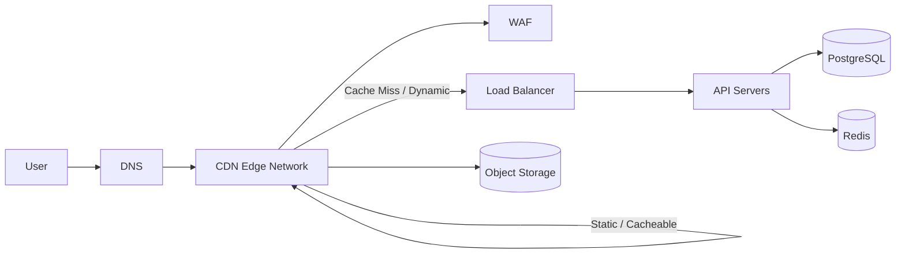
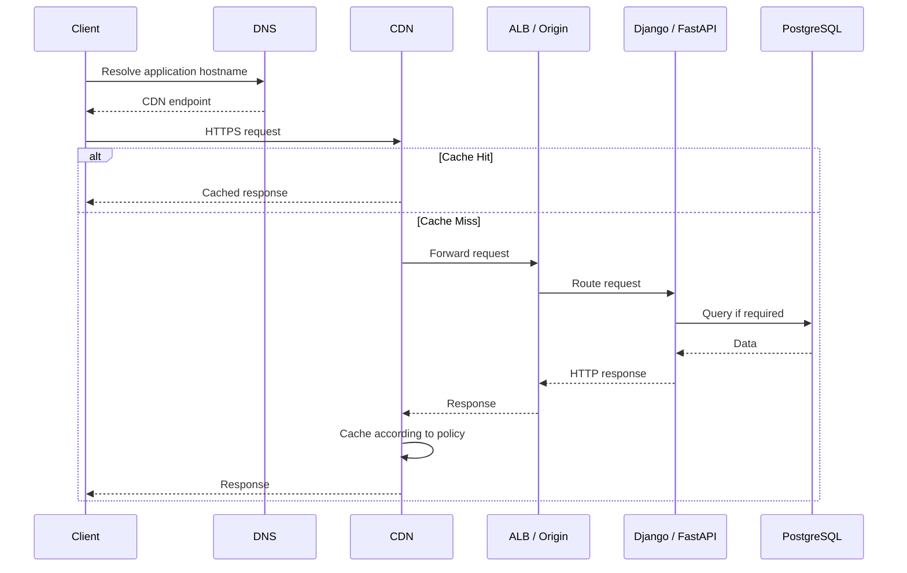
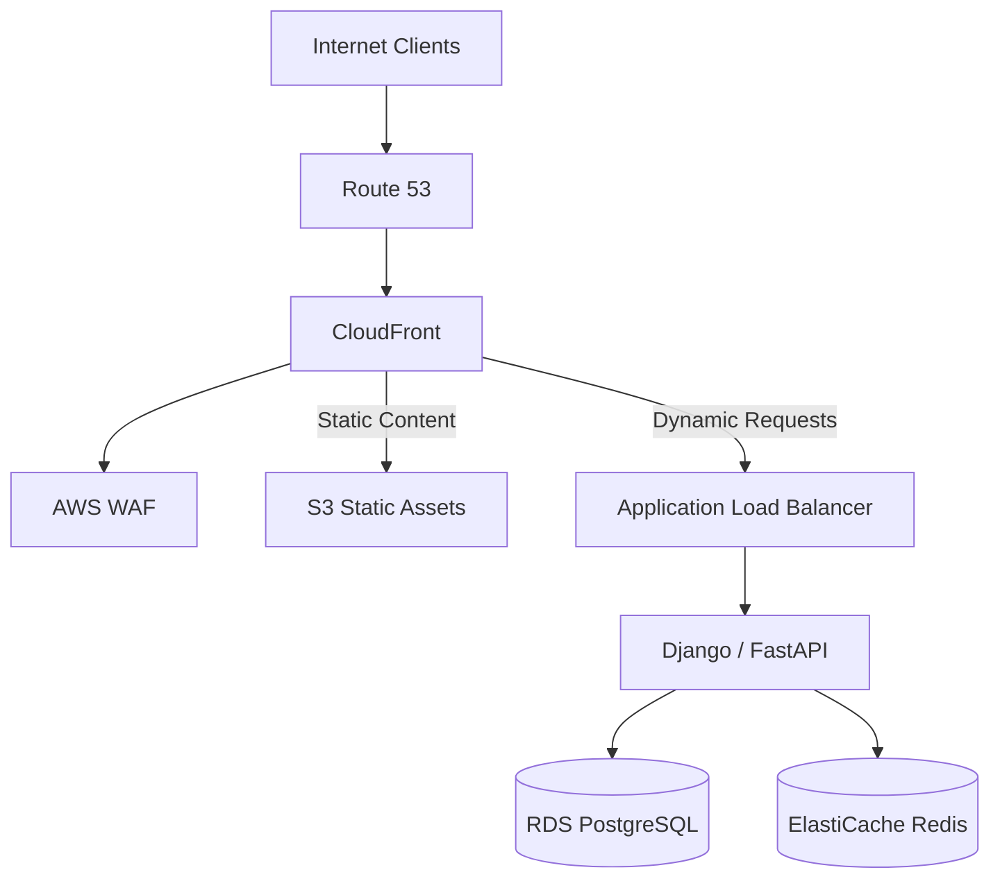

# 06- CDN

## Overview

A Content Delivery Network (CDN) is a globally distributed network of edge locations that caches and serves content closer to users than the application's origin infrastructure.

For a backend system, a CDN sits between clients and the origin:

```text
Client
   |
   v
CDN Edge
   |
   |-- Cache Hit ------> Response
   |
   |-- Cache Miss
   |       |
   |       v
   |     Origin
   |       |
   |       v
   |     Response
   |       |
   |       v
   |     CDN Cache
   |
   v
Client
```

The primary objectives are:

- Reduce latency.
- Reduce origin traffic.
- Improve global performance.
- Absorb traffic spikes.
- Reduce bandwidth and compute costs.
- Improve availability for cacheable content.
- Provide an edge layer for security controls.

Typical CDN-backed workloads include:

- Static JavaScript, CSS, and HTML.
- Images and videos.
- Downloadable files.
- API responses that are safe to cache.
- Public product/catalog data.
- Documentation.
- Software packages.
- Streaming content.

AWS CloudFront is a common CDN choice for AWS architectures, but the underlying design principles apply to other CDNs.

## Why CDNs Exist

Without a CDN, every request may travel to the origin:

```text
User in India
     |
     |  Long network path
     v
Internet
     |
     v
Origin in us-east-1
     |
     v
Application
```

The request can experience:

- Higher network latency.
- More origin bandwidth usage.
- Higher application CPU usage.
- More database queries.
- Greater exposure to traffic spikes.

With a CDN:

```text
User in India
     |
     v
Nearest CDN Edge
     |
     +---- Cache Hit ----> Response
     |
     +---- Cache Miss ----> Origin
```

A cached response can often be served without contacting the application.

The key architectural principle is:

> Push frequently accessed, cacheable data closer to consumers and keep expensive origin infrastructure away from unnecessary requests.

## CDN Architecture

A production architecture commonly looks like:



The exact architecture depends on whether the CDN serves:

- Static assets.
- Object storage content.
- Dynamic pages.
- API responses.
- Media.
- A combination of these.

## Core CDN Components

| Component | Responsibility |
|---|---|
| Client | Requests content |
| DNS | Directs users toward the CDN |
| Edge Location | Serves cached content |
| Distribution | Defines CDN behavior |
| Origin | Source of uncached content |
| Cache Policy | Determines caching behavior |
| Origin Request Policy | Determines what reaches the origin |
| TTL | Controls cache lifetime |
| Invalidation | Removes cached objects |
| WAF | Filters malicious traffic |
| TLS | Encrypts client connections |
| Access Controls | Protect protected content |

## Edge Locations

An edge location is a geographically distributed CDN point of presence.

The objective is to reduce the network distance between the user and cached content.

For example:

```text
                Origin
                  |
        +---------+---------+
        |         |         |
        v         v         v
      Edge      Edge      Edge
       US       Europe     Asia
        ^         ^         ^
        |         |         |
      Users     Users     Users
```

The user generally connects to an appropriate nearby edge location based on the CDN's routing infrastructure.

The edge does not necessarily contain every object.

It stores content based on:

- Request frequency.
- Cache configuration.
- Object lifetime.
- Cache capacity.
- Distribution behavior.

## Origin

The origin is the authoritative source from which the CDN obtains content when it does not have a usable cached response.

Common origins include:

- Amazon S3.
- Application Load Balancer.
- EC2.
- ECS.
- Kubernetes ingress.
- API Gateway.
- Another HTTP server.

For example:

```text
CloudFront
   |
   +----> S3
   |
   +----> ALB
```

Static assets commonly use object storage:

```text
CloudFront -> S3
```

Dynamic APIs commonly use:

```text
CloudFront -> ALB -> Django/FastAPI
```

## Cache Hit

A cache hit occurs when the CDN already has a valid cached representation for a request.

```text
Client
  |
  v
CDN
  |
  +-- Object exists and is fresh
          |
          v
       Response
```

The origin is not contacted.

This provides:

- Lower latency.
- Lower origin load.
- Lower bandwidth usage.
- Better scalability.

## Cache Miss

A cache miss occurs when the CDN cannot serve the request from its cache.

```text
Client
  |
  v
CDN
  |
  +-- Cache Miss
          |
          v
        Origin
          |
          v
       Response
          |
          v
      CDN Cache
          |
          v
        Client
```

The CDN retrieves the content from the origin and may store it according to its caching policy.

## Cache Hit Ratio

A useful CDN metric is the cache hit ratio.

```text
Cache Hit Ratio =
Cache Hits / Total Cache Requests
```

For example:

```text
900 cache hits
100 origin requests

Hit Ratio = 900 / 1000 = 90%
```

A high hit ratio usually means the CDN is successfully offloading origin traffic.

However, a high hit ratio is not automatically the goal for every endpoint.

Private or highly dynamic data may be inappropriate to cache.

## TTL

TTL, or Time To Live, determines how long a cached object can remain fresh.

For example:

```text
Cache-Control: public, max-age=3600
```

means the response can be considered fresh for approximately one hour under normal HTTP caching semantics.

Conceptually:

```text
Object Cached
     |
     v
Fresh for 1 hour
     |
     v
TTL Expires
     |
     v
Revalidation / New Origin Request
```

TTL represents a consistency trade-off:

```text
Long TTL
  |
  +-- Better cache efficiency
  +-- Lower origin load
  +-- Higher risk of stale content

Short TTL
  |
  +-- Fresher content
  +-- More origin traffic
  +-- Lower cache efficiency
```

## Cache-Control

HTTP caching headers are central to CDN behavior.

Common directives include:

| Directive | Meaning |
|---|---|
| `public` | Response may be cached by shared caches |
| `private` | Response is intended for a private cache |
| `no-cache` | Response can be stored but must be revalidated |
| `no-store` | Do not store the response |
| `max-age` | Freshness lifetime in seconds |
| `s-maxage` | Shared-cache freshness lifetime |
| `must-revalidate` | Revalidation is required after freshness expires |

Example:

```http
Cache-Control: public, max-age=86400
```

For immutable versioned assets:

```http
Cache-Control: public, max-age=31536000, immutable
```

For sensitive responses:

```http
Cache-Control: private, no-store
```

## Browser Cache vs CDN Cache

These are different caching layers.

```text
Client
 |
 +--> Browser Cache
 |
 v
CDN
 |
 +--> CDN Cache
 |
 v
Origin
```

A browser may serve content without contacting the CDN.

If the browser does not have the object, the CDN may serve it without contacting the origin.

This creates a multi-layer caching architecture:

```text
Browser
   |
   v
CDN
   |
   v
Origin
```

Each layer has its own behavior and cache-control rules.

## Cache Key

The cache key determines whether two requests map to the same cached object.

A simplified cache key might be:

```text
scheme + host + path + query parameters
```

depending on CDN configuration.

For example:

```text
GET /products?page=1
GET /products?page=2
```

should generally produce different cache entries.

However:

```text
GET /products
Authorization: Bearer user-A
```

and:

```text
GET /products
Authorization: Bearer user-B
```

should not automatically share a cache entry if the response is user-specific.

Poor cache-key design can create either:

- Extremely low cache hit ratios.
- Incorrect responses being served to users.

## Query String Caching

Suppose an API receives:

```text
/products?category=books
/products?category=electronics
```

If the category affects the response, it belongs in the cache key.

If irrelevant query parameters are included:

```text
/products?tracking_id=abc
/products?tracking_id=xyz
```

the CDN may create separate cache entries for equivalent content.

This can significantly reduce cache efficiency.

A production cache policy should distinguish:

```text
Response-affecting parameters
```

from:

```text
Tracking / irrelevant parameters
```

## Headers and Cache Keys

Headers can also influence cache behavior.

For example:

```http
Accept-Encoding: gzip
```

may affect representation selection.

Other headers such as:

```http
Authorization
Accept-Language
Cookie
```

can create large cache-key cardinality or security problems.

Do not forward every request header to the cache key by default.

Instead:

> Include only request attributes that genuinely affect the response.

## Cookies and CDN Caching

Cookies are particularly dangerous for caching.

Suppose:

```http
Cookie: session_id=user-123
```

changes the response.

If the CDN ignores that distinction, it could serve one user's response to another user.

For authenticated responses, the default safe behavior is generally:

```text
Do not publicly cache user-specific responses.
```

If authenticated caching is required, the cache key and access controls must be explicitly designed.

## Static Asset Caching

Static assets are ideal CDN candidates.

Examples:

```text
app.js
styles.css
logo.webp
product-image.jpg
font.woff2
```

A strong production strategy is content hashing:

```text
app.91a83f.js
styles.7f31d2.css
```

When the file changes, the filename changes.

Then the CDN can safely cache it for a long period:

```http
Cache-Control: public, max-age=31536000, immutable
```

This avoids frequent cache invalidations.

## Cache Busting

Without versioning:

```text
app.js
```

a long TTL can cause users to receive an older version after deployment.

With versioning:

```text
app.v1.js
app.v2.js
```

or content hashes:

```text
app.91a83f.js
app.4a71d9.js
```

the application can deploy new content without deleting the old object immediately.

This is usually preferable to relying heavily on invalidations.

## CDN for Django and FastAPI

A common architecture is:

```text
                 CDN
                  |
        +---------+---------+
        |                   |
        v                   v
    Static Assets        API
        |                   |
        v                   v
        S3                 ALB
                            |
                            v
                     Django/FastAPI
                            |
                    +-------+-------+
                    |               |
                    v               v
                PostgreSQL        Redis
```

The CDN can handle:

- JavaScript.
- CSS.
- Images.
- Public media.
- Documentation.
- Public API responses where appropriate.

The application should continue handling:

- Authentication.
- Authorization.
- Business logic.
- Transactions.
- User-specific operations.

## CDN for APIs

CDNs can cache APIs, but this requires more careful design.

Good candidates include:

```text
GET /countries
GET /public/products
GET /categories
GET /exchange-rates
```

Potentially poor candidates include:

```text
GET /me
GET /account
GET /orders
GET /notifications
```

because these are usually user-specific or rapidly changing.

The key question is:

> Can multiple users safely receive the same representation for a defined period?

If the answer is no, public CDN caching is generally inappropriate.

## GET, POST, PUT, DELETE and CDN Caching

HTTP method semantics matter.

Typically:

| Method | Typical CDN Caching |
|---|---|
| GET | Common |
| HEAD | Common |
| POST | Usually not cached by default |
| PUT | Not cached |
| PATCH | Not cached |
| DELETE | Not cached |

CDNs primarily accelerate safe, cacheable reads rather than state-changing operations.

## Request Lifecycle

A production request may follow this flow:



The main scalability benefit is that the application is removed from the request path for cache hits.

## CDN and Origin Offloading

Suppose an application receives:

```text
1,000,000 requests
```

and the CDN achieves:

```text
95% cache hit ratio
```

Then approximately:

```text
950,000 requests
```

can potentially be served at the edge.

Only approximately:

```text
50,000 requests
```

need to reach the origin, subject to the actual caching configuration.

This can dramatically reduce:

- Application CPU.
- Database load.
- Network traffic.
- Infrastructure cost.

## Cache Stampede

A cache stampede occurs when many requests simultaneously discover that an object is unavailable or expired.

For example:

```text
Cache expires
     |
     +---- Request 1 ----> Origin
     +---- Request 2 ----> Origin
     +---- Request 3 ----> Origin
     +---- Request 4 ----> Origin
     +---- ...
```

Thousands of requests may hit the origin at once.

Mitigation strategies include:

- Staggered expiration.
- Request collapsing.
- Origin shielding.
- Application-level locking.
- Background refresh.
- Graceful stale serving.
- Appropriate TTL selection.

## Origin Shielding

Some CDN architectures support an additional caching layer between edge locations and the origin.

Conceptually:

```text
Users
  |
  v
Edge Locations
  |
  v
Origin Shield
  |
  v
Origin
```

Without shielding, multiple edge locations may independently request the same object from the origin.

With shielding:

```text
Edge A ----\
Edge B -----+--> Shield --> Origin
Edge C ----/
```

This can reduce origin request volume for globally popular objects.

## Cache Invalidation

Sometimes cached content must be removed before TTL expiration.

For example:

```text
Cached:
config.json
```

but the origin now contains an incorrect configuration.

An invalidation can force the CDN to stop serving the cached object.

Conceptually:

```text
Origin Updated
      |
      v
Invalidate
      |
      v
CDN Removes Cached Object
      |
      v
Next Request -> Origin
```

Invalidation is useful for emergency corrections, but should not become the primary deployment strategy for every asset.

Versioned assets are usually easier to operate.

## Stale Content

Caching introduces a consistency trade-off.

If:

```text
TTL = 1 hour
```

the CDN may serve the old representation for up to the configured freshness period, depending on revalidation behavior.

This is acceptable for:

- Images.
- Static assets.
- Documentation.
- Public catalogs with bounded staleness.

It may be unacceptable for:

- Account balances.
- Authorization state.
- Security configuration.
- Order status.
- Financial transactions.

Caching strategy must therefore match business consistency requirements.

## CDN and Authentication

Authentication introduces a fundamental question:

```text
Is the response identical for every authorized user?
```

If yes, a carefully designed cache may be possible.

If no:

```text
User A -> Response A
User B -> Response B
```

the CDN must not treat the two responses as equivalent.

Common approaches include:

- Bypass caching for authenticated requests.
- Cache only public content.
- Use carefully designed cache keys.
- Use signed URLs or signed cookies for protected objects.
- Separate public and private distributions or behaviors.

## Signed URLs

Signed URLs provide controlled access to protected resources.

Conceptually:

```text
Client
  |
  | Signed URL
  v
CDN
  |
  | Validate Signature
  v
Protected Object
```

A signed URL can contain:

```text
resource
expiration
signature
```

The CDN validates the signature before serving the object.

This is useful for:

- Private downloads.
- Media.
- Reports.
- Temporary access.
- Premium content.

## CDN and Object Storage

A common architecture for user-uploaded media is:

```text
Client
   |
   | Upload
   v
S3
   |
   v
CDN
   |
   v
Other Users
```

The Django or FastAPI application can generate a pre-signed upload URL:

```text
Client
   |
   | Request upload authorization
   v
API
   |
   v
Pre-signed S3 URL
   |
   v
Client
   |
   v
S3
```

The API does not need to proxy the entire file.

This reduces application bandwidth and compute requirements.

## CDN and Large Files

CDNs are particularly valuable for large assets.

Examples:

- Videos.
- ISO images.
- Software installers.
- Data exports.
- Large documents.

Without a CDN:

```text
1,000 users
   |
   v
Origin
   |
   v
Large files
```

With a CDN:

```text
Origin
  |
  v
CDN Edge
  |
  +--> User 1
  +--> User 2
  +--> User 3
  +--> ...
```

Repeated downloads can be served from the edge.

## Range Requests

Large media files often use HTTP range requests.

For example:

```http
Range: bytes=1000000-1999999
```

This allows clients to request only a portion of a file.

CDN behavior for range requests should be validated for the chosen workload and distribution configuration.

This matters for:

- Video playback.
- Large downloads.
- Resumable downloads.

## CDN and Compression

CDNs can compress responses using mechanisms such as:

```text
gzip
Brotli
```

Compression is particularly useful for:

- JavaScript.
- CSS.
- HTML.
- JSON.
- Text assets.

A simplified flow is:

```text
Origin
  |
  | Uncompressed
  v
CDN
  |
  | Compress
  v
Client
```

The exact behavior depends on content type, configuration, and client capabilities.

Avoid compressing already compressed formats such as:

```text
JPEG
PNG
MP4
ZIP
GZIP
```

unless there is a specific reason.

## CDN and HTTP/2 / HTTP/3

Modern CDNs commonly support newer HTTP versions.

Benefits can include:

- Multiplexed requests.
- Reduced connection overhead.
- Better utilization of a single connection.
- Improved performance on high-latency networks.

HTTP/3 uses QUIC over UDP and can improve connection establishment and resilience to packet loss in some network conditions.

The CDN becomes a protocol termination point:

```text
Client
  |
  | HTTP/3
  v
CDN
  |
  | HTTP/2 / HTTP/1.1 / other origin protocol
  v
Origin
```

The client-facing protocol and origin-facing protocol do not have to be identical.

## CDN and TLS

HTTPS should generally terminate at the CDN edge.

```text
Client
  |
  | HTTPS
  v
CDN
  |
  | HTTPS
  v
Origin
```

TLS termination at the edge provides:

- Encrypted client traffic.
- Global certificate handling.
- Reduced origin TLS workload.
- Centralized security configuration.

For sensitive applications, use encryption between the CDN and origin as well.

## Origin Access Control

When object storage is used behind a CDN, the storage bucket should not necessarily be publicly accessible.

A stronger architecture is:

```text
Client
   |
   v
CDN
   |
   v
Private S3
```

The CDN is authorized to access the bucket.

This prevents users from bypassing the CDN and accessing the origin directly.

## CDN Security

A CDN can be part of the security perimeter.

Common controls include:

- AWS WAF.
- Rate limiting.
- Bot controls.
- DDoS protection.
- TLS.
- Geographic restrictions.
- Signed URLs.
- Origin access controls.
- Request filtering.

However:

> A CDN does not replace application-level authorization.

The backend must still enforce:

```text
Who is this user?
What are they allowed to access?
Can they perform this operation?
```

## DDoS Considerations

A CDN can absorb significant volumes of cacheable traffic at the edge.

For example:

```text
Internet
   |
   v
CDN / WAF
   |
   +---- Malicious Traffic -> Filter
   |
   +---- Cacheable Traffic -> Edge
   |
   +---- Legitimate Dynamic Traffic -> Origin
```

This protects the origin from some forms of traffic amplification.

However, cache misses and dynamic endpoints can still reach the origin.

Therefore, combine CDN capabilities with:

- WAF.
- Rate limiting.
- Application controls.
- Origin protection.
- Network security.
- Proper capacity planning.

## CDN Monitoring

Important metrics include:

| Metric | Why It Matters |
|---|---|
| Requests | Overall traffic |
| Cache Hit Ratio | Cache effectiveness |
| Origin Requests | Origin load |
| Bytes Downloaded | Bandwidth |
| Error Rate | Availability |
| 4xx Responses | Client/access issues |
| 5xx Responses | Origin/server issues |
| Latency | User experience |
| Cache Misses | Potential optimization |
| WAF Blocks | Security activity |

A useful investigation pattern is:

```text
Latency Increased
      |
      +--> Cache Hit Ratio?
      |
      +--> Origin Latency?
      |
      +--> Origin 5xx?
      |
      +--> WAF?
      |
      +--> Network?
```

## CDN Logging

Access logs should make it possible to answer:

- Which URLs are receiving traffic?
- Which requests are cache hits?
- Which requests reach the origin?
- Which status codes are returned?
- Which geographic regions are affected?
- Which user agents are generating traffic?
- Which objects have unusually high miss rates?

For production systems, centralized logs should be retained according to operational and compliance requirements.

## Cost Considerations

CDN pricing typically depends on factors such as:

- Data transfer.
- Number of requests.
- Geographic region.
- Security services.
- Invalidation volume.
- Origin traffic.
- Logging.

A CDN can reduce origin infrastructure costs while increasing CDN-related costs.

The right question is not:

> Does a CDN cost money?

It is:

> Does the reduction in origin compute, bandwidth, database load, and latency justify the CDN cost?

For high-volume public content, the answer is often favorable.

## Common CDN Mistakes

### Caching Private Data

Incorrect:

```http
Cache-Control: public
```

for user-specific account information.

This can create a severe data exposure vulnerability.

### Forwarding Every Header

Forwarding all headers can create enormous cache-key variation.

Forward only headers required by the origin or response semantics.

### Using Cookies in Cache Keys Without Need

Session cookies can effectively make every request unique.

This destroys cache efficiency.

### Using Very Short TTLs Everywhere

A TTL of:

```text
5 seconds
```

may appear safe, but it can generate substantial origin traffic.

Use business requirements to determine freshness.

### Using Very Long TTLs for Dynamic Data

A long TTL may create unacceptable stale-data behavior.

### Relying Only on Invalidation

Frequent invalidations create operational complexity.

Prefer versioned assets where possible.

### Exposing the Origin Directly

If users can bypass the CDN and access the origin directly, CDN-based protection can be weakened.

Protect the origin where architecture permits.

### Assuming a CDN Fixes Slow APIs

A CDN cannot solve:

```text
Slow POST requests
Slow transactions
Database locks
Expensive writes
Bad SQL
```

It primarily accelerates cacheable traffic.

### Ignoring Cache-Key Cardinality

A cache key that varies by many values can create millions of distinct objects.

This produces poor cache efficiency and increased origin traffic.

## Production Design Recommendations

### Static Assets

Use:

```text
Content hashing
+
Long TTL
+
Immutable caching
+
CDN
```

Example:

```http
Cache-Control: public, max-age=31536000, immutable
```

### Public APIs

Use:

```text
Explicit cache policy
+
Short/medium TTL
+
Controlled query parameters
+
No user-specific data
```

### Private APIs

Default toward:

```text
No shared CDN caching
```

unless there is a deliberate authenticated caching strategy.

### Media

Use:

```text
Object Storage
+
CDN
+
Signed URLs
```

### Origin Protection

Prefer:

```text
Client
  |
  v
CDN / WAF
  |
  v
Private or protected Origin
```

rather than allowing unrestricted direct origin access.

## CDN Design Decision Matrix

| Workload | CDN Recommended? | Typical Strategy |
|---|---|---|
| JS/CSS | Yes | Long TTL + versioning |
| Images | Yes | Long TTL |
| Public documentation | Yes | Long TTL |
| Public videos | Yes | Edge caching + range support |
| Software downloads | Yes | Long TTL |
| Public catalog | Usually | Controlled TTL |
| Public API | Sometimes | Explicit cache policy |
| User profile API | Usually no | Private/no-store |
| Banking transaction | No shared cache | Dynamic origin |
| POST API | Usually no | Direct origin |
| Real-time data | Usually no | WebSocket/streaming |
| Private files | Yes, with controls | Signed URL/cookie |

## CDN with AWS

A common AWS architecture is:



This architecture separates:

```text
Static delivery
```

from:

```text
Dynamic application processing
```

The CDN absorbs repeated requests for static and explicitly cacheable resources while the application handles dynamic operations.

## CDN Configuration Principles

A production CDN configuration should explicitly define:

- Allowed HTTP methods.
- Cacheable methods.
- Cache key.
- Query-string behavior.
- Header behavior.
- Cookie behavior.
- Compression.
- HTTPS enforcement.
- TLS version.
- Origin protocol.
- TTL.
- Error caching.
- Access controls.
- WAF integration.
- Logging.

Avoid treating CDN configuration as a collection of defaults.

The cache policy is part of the application's data-consistency model.

## CDN and Error Responses

CDNs can cache error responses depending on configuration.

For example:

```text
Origin returns 404
```

If cached:

```text
Subsequent requests
       |
       v
CDN returns 404
```

This can reduce repeated origin traffic.

However, excessively long error caching can make a newly created resource appear unavailable.

Similarly, caching certain `5xx` responses can prolong an outage.

Error caching TTLs should therefore be intentionally configured.

## CDN as an Architectural Boundary

A senior-level design treats the CDN as more than a performance optimization.

It can become an architectural boundary for:

```text
Client
  |
  v
CDN
  |
  +-- TLS termination
  +-- WAF
  +-- Rate limiting
  +-- Bot controls
  +-- Caching
  +-- Compression
  +-- Geographic routing
  |
  v
Origin
```

This allows expensive application infrastructure to receive fewer requests and provides a centralized edge layer for globally distributed clients.

## Production Checklist

### Architecture

- [ ] CDN is placed in front of appropriate workloads.
- [ ] Origins are clearly defined.
- [ ] Static and dynamic traffic have appropriate behaviors.
- [ ] Origin access is protected where required.
- [ ] Multi-region requirements are evaluated.

### Caching

- [ ] Cache keys are intentionally designed.
- [ ] TTLs match freshness requirements.
- [ ] Private data is not publicly cached.
- [ ] Query parameters are controlled.
- [ ] Cookie behavior is explicit.
- [ ] Header forwarding is minimized.
- [ ] Versioned assets are used where practical.

### Security

- [ ] HTTPS is enforced.
- [ ] TLS configuration is current.
- [ ] WAF is configured where appropriate.
- [ ] Protected objects use signed access mechanisms.
- [ ] Origin bypass is restricted where possible.
- [ ] Authentication and authorization remain enforced by the application.

### Performance

- [ ] Cache hit ratio is monitored.
- [ ] Origin request volume is measured.
- [ ] Compression is enabled where beneficial.
- [ ] Large files use appropriate delivery strategies.
- [ ] Cache stampede risks are considered.

### Operations

- [ ] CDN logs are available.
- [ ] 4xx and 5xx metrics are monitored.
- [ ] Invalidation procedures are documented.
- [ ] Cache policies are version-controlled where possible.
- [ ] Load testing includes CDN behavior.
- [ ] Failure scenarios are tested.

## Interview Questions

### What problem does a CDN solve?

A CDN reduces latency and origin load by serving cacheable content from geographically distributed edge locations closer to users.

### What is a cache hit?

A cache hit occurs when the CDN can satisfy a request using an existing valid cached representation without contacting the origin.

### What is a cache miss?

A cache miss occurs when the CDN cannot serve the requested representation from cache and must retrieve it from the origin.

### What is a cache key?

A cache key identifies which requests should share the same cached representation. Poor cache-key design can cause low hit ratios or incorrect content sharing.

### Why should user-specific responses generally not be publicly cached?

Because different users may receive different representations. Incorrect cache-key configuration could cause one user's private response to be served to another user.

### What is TTL?

TTL determines how long a cached representation can remain fresh before it needs revalidation or retrieval according to the configured caching rules.

### Why are CDNs useful for static assets?

Static assets are usually highly cacheable and requested repeatedly, making them ideal candidates for edge caching.

### Why are content-hashed filenames useful?

They allow assets to be cached for long periods while ensuring that a changed asset receives a new URL.

### Can a CDN cache API responses?

Yes, if the response is safe to share and the cache policy correctly handles all request attributes that affect the response.

### Can a CDN solve a slow database query?

No. A CDN can prevent some requests from reaching the application, but uncached dynamic requests still execute the application's database queries.

### What is cache stampede?

It occurs when many requests simultaneously cause an expired or missing cache object to be regenerated at the origin, potentially overwhelming the origin.

### Why is origin protection important?

If users can bypass the CDN and directly reach the origin, they can circumvent edge caching, WAF controls, and other protections.

### What is the difference between browser caching and CDN caching?

Browser caching occurs on the client, while CDN caching occurs in shared edge infrastructure between clients and the origin.

### Why should query parameters be carefully considered in a cache key?

Different query parameters can either represent different resources or be irrelevant tracking values. Including irrelevant parameters can unnecessarily fragment the cache.

### Does a CDN guarantee high availability?

No. A CDN improves resilience and reduces origin dependency for cached content, but overall availability still depends on the origin, DNS, authentication, databases, dependencies, and application architecture.

## Key Takeaways

- **A CDN reduces latency and origin load by serving cacheable content from distributed edge locations, making it a fundamental component of globally distributed systems.**
- **Cache-key design, TTLs, headers, cookies, and query parameters determine both CDN efficiency and data correctness; private data must never be accidentally shared through a public cache.**
- **Static assets are ideal CDN workloads when combined with content hashing and long immutable TTLs, while dynamic and user-specific APIs require explicit caching decisions.**
- **A production CDN should integrate with TLS, WAF, origin protection, observability, compression, signed access, and carefully designed failure and invalidation strategies.**
- **CDNs improve scalability but do not replace good backend architecture: databases, Redis, queues, authentication, application logic, and origin capacity must still be designed independently.**