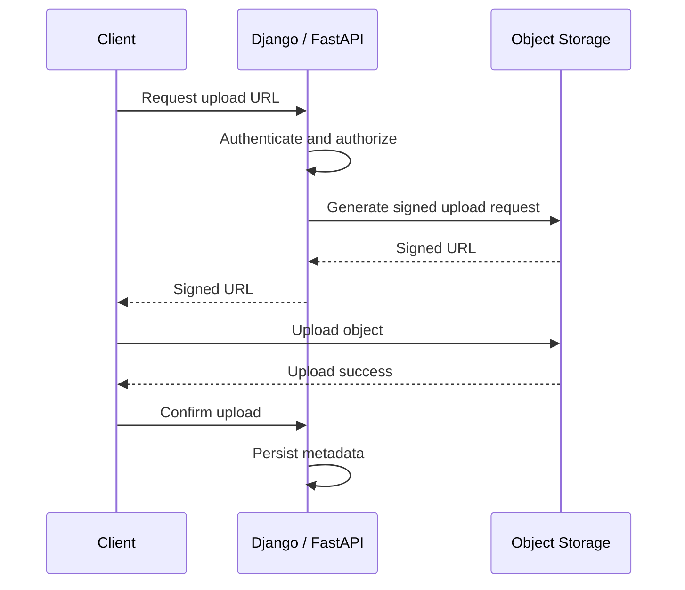
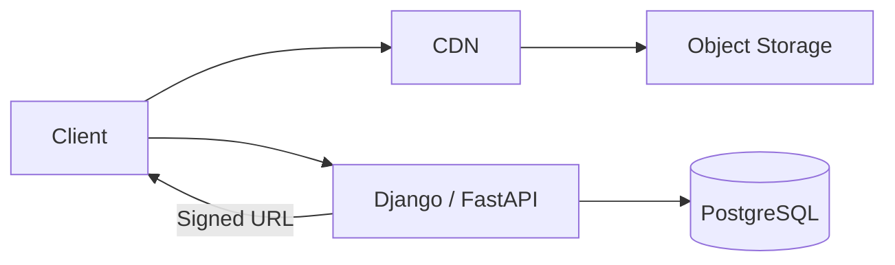
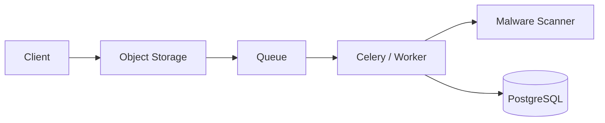
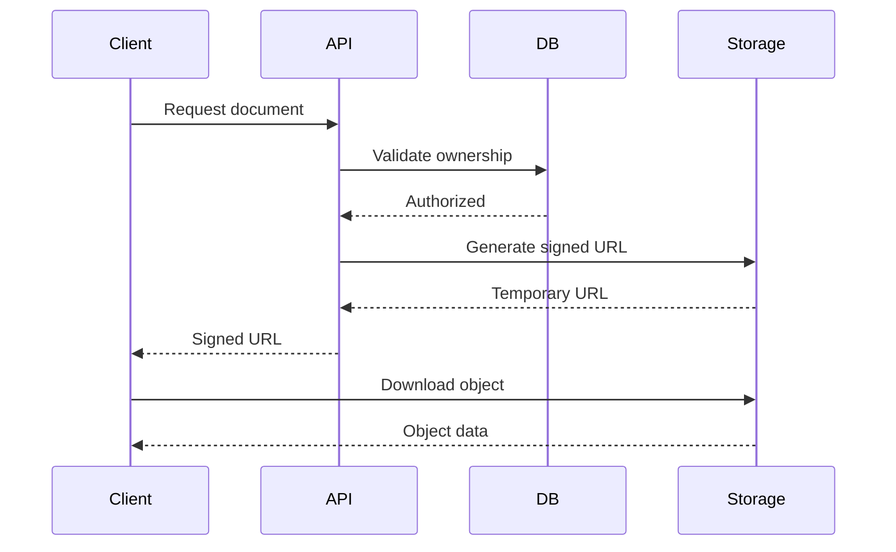
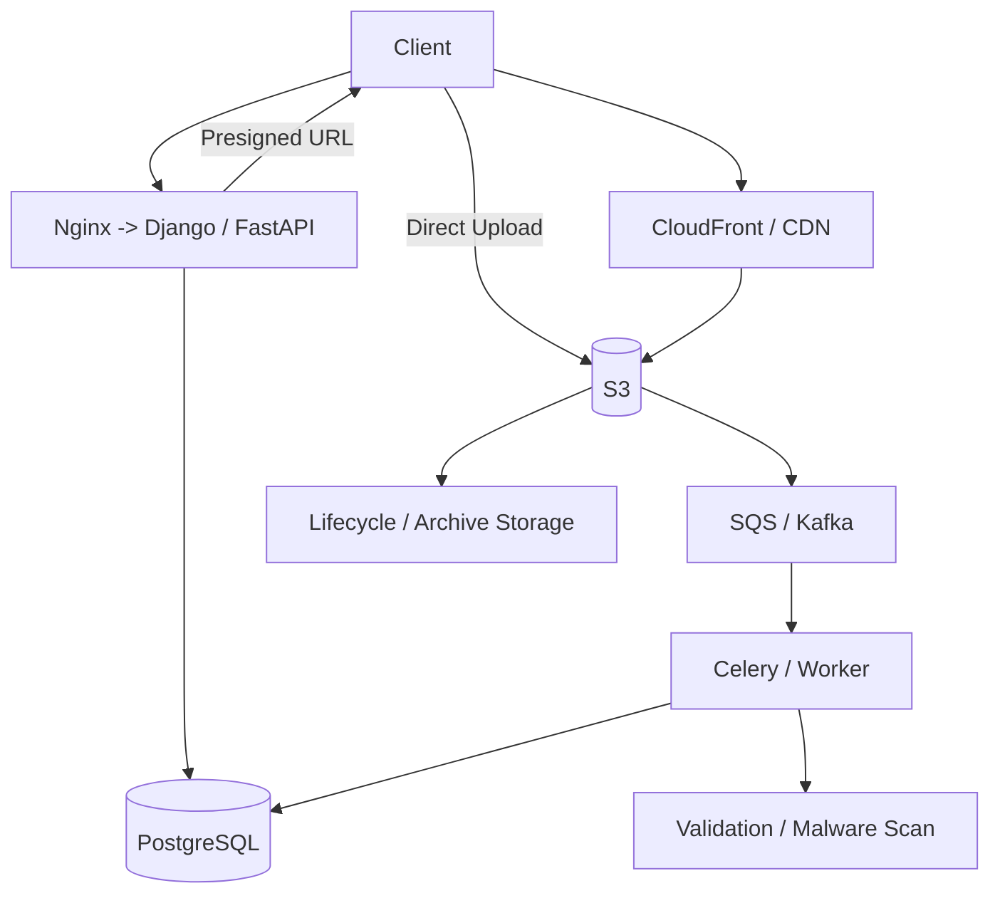

# 07- Object Storage

## Overview

Object storage is a distributed storage model designed for storing and retrieving large amounts of unstructured data as objects rather than rows, blocks, or traditional filesystem files.

An object typically contains:

- Object data.
- Object key or identifier.
- Metadata.
- Optional tags.
- Version information.
- Access-control information.

A common AWS implementation is Amazon S3.

Object storage is fundamental to modern backend architectures because application servers should generally not be responsible for storing large files directly on local disks. Instead, applications store durable objects in object storage and persist only the metadata required to locate and manage those objects.

A typical architecture is:

```text
Client
   |
   v
Django / FastAPI
   |
   | Generate upload authorization
   v
Object Storage
   |
   +--> Images
   +--> Videos
   +--> Documents
   +--> Backups
   +--> Data exports
   +--> Logs
```

The application stores metadata such as:

```text
user_id
object_key
content_type
file_size
created_at
status
```

while the actual file remains in object storage.

This separation provides durable storage, horizontal scalability, independent file delivery, and lower application-server resource consumption.

## Why Object Storage Exists

Traditional application servers often start with local filesystem storage:

```text
Django
  |
  v
Local Disk
  |
  +-- uploads/
  +-- images/
  +-- reports/
```

This becomes problematic when the application scales horizontally:

```text
                Load Balancer
                     |
          +----------+----------+
          |          |          |
          v          v          v
       Server A   Server B   Server C
          |          |          |
       Disk A     Disk B     Disk C
```

A file uploaded to Server A may not exist on Server B.

This creates problems with:

- Horizontal scaling.
- Instance replacement.
- Container restarts.
- Kubernetes scheduling.
- Disaster recovery.
- Multi-region deployments.
- File sharing between services.

Object storage solves this by providing a shared durable storage layer:

```text
                Load Balancer
                     |
          +----------+----------+
          |          |          |
          v          v          v
       Server A   Server B   Server C
          |          |          |
          +----------+----------+
                     |
                     v
              Object Storage
```

The application instances become disposable while the data remains durable.

## Object Storage vs Block Storage vs File Storage

The three major storage models solve different problems.

| Characteristic | Object Storage | Block Storage | File Storage |
|---|---|---|---|
| Data model | Objects | Blocks | Files/directories |
| Access | HTTP/API | Block device | Filesystem protocol |
| Scaling | Extremely high | Typically bounded by volume | High |
| Typical use | Media, backups, documents | Databases, OS disks | Shared filesystem |
| Mountable | No | Yes | Yes |
| Metadata | Rich object metadata | Limited | Filesystem metadata |
| Random block updates | Poor fit | Excellent | Good |
| Versioning | Common | Usually application-managed | Filesystem-dependent |
| CDN integration | Excellent | Indirect | Possible |
| Typical AWS service | S3 | EBS | EFS |

The important design decision is to choose storage based on access semantics rather than simply choosing the cheapest storage service.

## Core Object Storage Concepts

### Bucket

A bucket is a logical container for objects.

Conceptually:

```text
Bucket
 |
 +-- users/123/profile.jpg
 +-- users/123/resume.pdf
 +-- users/456/profile.jpg
 +-- reports/2026/08/report.csv
```

In AWS S3, bucket names are globally unique within the AWS commercial partition.

A bucket should generally represent a meaningful security, lifecycle, or operational boundary rather than simply being created for every application object type.

### Object

An object is the actual stored data plus associated metadata.

For example:

```text
Key:
users/123/profile/avatar.jpg

Data:
<binary image>

Metadata:
Content-Type: image/jpeg
```

The object key is not necessarily a filesystem path. It is an identifier interpreted by the object-storage service.

### Object Key

A key identifies an object within a bucket.

Example:

```text
users/123/documents/resume.pdf
```

The `/` characters create a useful naming convention but do not imply that traditional directories exist underneath the object-storage abstraction.

A good key structure should support:

- Logical organization.
- Access patterns.
- Lifecycle policies.
- Debugging.
- Operational searches.
- Avoiding pathological hot prefixes where relevant to the storage system.

Example:

```text
tenant/{tenant_id}/user/{user_id}/documents/{object_id}.pdf
```

Using a generated object ID instead of the original filename reduces collision risks.

## Object Metadata

Metadata describes an object.

Common metadata includes:

```text
Content-Type
Content-Length
ETag
Last-Modified
Cache-Control
Content-Encoding
Content-Disposition
```

Application-specific metadata can also be attached where supported.

For example:

```text
document_type = invoice
tenant_id = 123
```

Do not use object metadata as the primary relational data store for business entities. Important application state should normally be persisted in a database.

## Object Storage Request Flow

A backend application commonly uses object storage in one of two ways.

### Application-Proxied Upload

```text
Client
   |
   | multipart upload
   v
Django / FastAPI
   |
   | upload
   v
Object Storage
```

The application receives the file and then uploads it.

Advantages:

- Centralized validation.
- Simple initial implementation.
- Easy authorization control.

Limitations:

- Application bandwidth is consumed.
- Application memory and connection resources may be consumed.
- Large files can create expensive request lifecycles.
- Horizontal scaling becomes more expensive.

### Direct Client Upload

A more scalable architecture is:

```text
Client
   |
   | 1. Request upload authorization
   v
Django / FastAPI
   |
   | 2. Generate pre-signed URL
   v
Client
   |
   | 3. Upload directly
   v
Object Storage
```

The application handles authorization but does not proxy the file.

This is generally preferred for large uploads and high-volume applications.

## Pre-Signed URLs

A pre-signed URL grants temporary access to an object-storage operation without exposing long-lived credentials.

A typical flow is:



The URL should generally have:

- Short expiration.
- Restricted object key.
- Restricted HTTP method.
- Expected content type where appropriate.
- Appropriate size constraints where supported.

A pre-signed URL is not a replacement for authorization. The application must decide whether the requesting user is allowed to upload the requested object.

## Upload Validation

Never assume that a file is safe simply because the client supplied:

```http
Content-Type: image/jpeg
```

Clients can send arbitrary metadata.

Production validation may include:

- File size.
- MIME type.
- File signature/magic bytes.
- Filename restrictions.
- Extension restrictions.
- Malware scanning.
- Image decoding validation.
- Archive inspection.
- Content-specific validation.

A robust upload flow can be:

```text
Client
  |
  v
API authorization
  |
  v
Signed upload
  |
  v
Object Storage
  |
  v
Event
  |
  v
Validation / Malware Scan
  |
  +--> Valid ------> Available
  |
  +--> Invalid ----> Quarantine / Delete
```

## Multipart Upload

Large objects should often use multipart upload.

Instead of:

```text
Client --------------------------> Object Storage
             10 GB
```

the file is split into parts:

```text
Part 1 ----\
Part 2 -----\
Part 3 ------> Object Storage
Part 4 -----/
Part N ----/
```

The service can then assemble the object after all required parts have been uploaded.

Advantages include:

- Parallel uploads.
- Better throughput.
- Retry of individual parts.
- Resumability.
- Better handling of large objects.

Multipart upload is particularly useful for:

- Large videos.
- Large backups.
- Data exports.
- Machine-learning datasets.
- Large software artifacts.

A production system should also handle abandoned multipart uploads because incomplete uploads can consume storage and incur costs.

## Download Architecture

For public content:

```text
Client
  |
  v
CDN
  |
  v
Object Storage
```

For private content:

```text
Client
  |
  v
API
  |
  | Authorization
  v
Signed URL
  |
  v
CDN / Object Storage
```

The application should not necessarily proxy large downloads.

This allows object storage and the CDN to handle bandwidth-heavy workloads.

## Object Storage + CDN

Object storage integrates naturally with CDNs.



Static assets can use:

```text
S3 -> CDN -> Client
```

while the API handles metadata and authorization.

Common CDN-backed objects include:

- Images.
- JavaScript.
- CSS.
- Videos.
- Public documents.
- Software packages.

## Public vs Private Objects

Objects should be classified according to access requirements.

| Object Type | Recommended Access |
|---|---|
| Public website image | Public through CDN |
| User profile image | Depends on privacy requirements |
| Invoice | Private |
| Resume | Private |
| Backup | Private |
| Software package | Public or authenticated |
| Internal report | Private |
| Temporary export | Private + signed access |

Avoid making an entire bucket public simply because some objects need public access.

Prefer explicit access policies.

## Object Storage Security

A secure architecture generally follows:

```text
Default
   |
   v
Private Bucket
   |
   +-- Public content -> Explicit controlled access
   |
   +-- Private content -> IAM / signed access
```

Important controls include:

- Least-privilege IAM.
- Bucket policies.
- Block public access where appropriate.
- Encryption.
- TLS.
- Versioning.
- Access logging where required.
- Object ownership controls.
- Lifecycle policies.
- Malware scanning for untrusted uploads.

## Encryption

Object storage commonly supports encryption at rest.

There are two broad architectural categories:

- Service-managed encryption keys.
- Customer-managed keys.

For sensitive workloads, customer-managed keys may be appropriate when stronger control over key lifecycle and access is required.

Encryption in transit should use HTTPS:

```text
Client
  |
  | HTTPS
  v
Object Storage
```

Do not send credentials or sensitive object data over plaintext HTTP.

## IAM and Least Privilege

The application should receive only the permissions it requires.

Avoid:

```json
{
  "Action": "s3:*",
  "Resource": "*"
}
```

Prefer narrowly scoped permissions such as:

```text
PutObject
GetObject
DeleteObject
ListBucket
```

with resources restricted to the required bucket and key prefixes.

For example:

```text
arn:aws:s3:::application-bucket/uploads/*
```

should generally be preferred over unrestricted access.

## Object Storage Data Model

A relational database should normally store business metadata separately from the object.

Example:

```text
documents
---------
id
user_id
object_key
original_filename
content_type
size_bytes
status
created_at
```

Object storage:

```text
s3://application-bucket/documents/8f1c...pdf
```

The database provides:

- Referential integrity.
- Search.
- Transactions.
- Business state.
- Authorization relationships.

Object storage provides:

- Durable binary storage.
- Large-scale data storage.
- Cheap bulk storage.
- Independent delivery.

## Database and Object Consistency

A common problem is:

```text
Database transaction
        +
Object upload
```

These are separate systems and do not share a single ACID transaction.

For example:

```text
1. Upload object
2. Insert database row
3. Database insert fails
```

Now an orphaned object exists.

The reverse can also happen:

```text
1. Insert database row
2. Object upload fails
```

Now a database record references an object that does not exist.

A robust design should model object state explicitly.

Example:

```text
PENDING
   |
   v
UPLOADED
   |
   v
VALIDATED
   |
   v
AVAILABLE
```

Failures can transition to:

```text
FAILED
QUARANTINED
DELETED
```

## Event-Driven Object Processing

Object storage can integrate with event-driven processing.

Example:



A file upload can trigger asynchronous processing such as:

- Thumbnail generation.
- Video transcoding.
- OCR.
- Virus scanning.
- PDF extraction.
- Metadata extraction.
- Image optimization.
- Search indexing.

Do not perform expensive processing synchronously inside the upload request unless there is a strong reason.

## Object Storage with Kafka

For high-scale event-driven architectures, object creation can publish an event.

```text
Object Storage
      |
      v
Event
      |
      v
Kafka
      |
 +----+---------+---------+
 |              |         |
 v              v         v
Thumbnail     OCR       Indexer
Worker        Worker     Worker
```

Kafka is useful when multiple independent consumers need the same object-created event and the organization already operates Kafka as an event backbone.

For simpler workloads, managed queues are often operationally cheaper and easier.

## Object Storage with Celery

For Django or FastAPI applications using Celery:

```text
Upload
  |
  v
Object Storage
  |
  v
Celery Task
  |
  +--> Resize image
  +--> Generate thumbnail
  +--> Extract metadata
  +--> Scan content
```

The web request should usually return quickly:

```text
202 Accepted
```

when processing is asynchronous.

The application can expose processing status through an API.

## Object Lifecycle

Objects often have different storage requirements throughout their lifetime.

For example:

```text
Hot
 |
 | 30 days
 v
Infrequent Access
 |
 | 90 days
 v
Archive
 |
 | Retention expires
 v
Delete
```

Lifecycle policies automate these transitions.

This is important for:

- Backups.
- Audit logs.
- Historical reports.
- Data exports.
- Compliance data.

Lifecycle policies reduce manual operations and can significantly reduce storage costs.

## Storage Classes

Object-storage providers generally offer multiple storage classes with different cost and access characteristics.

A simplified AWS-oriented model is:

| Storage Type | Typical Use |
|---|---|
| Standard | Frequently accessed data |
| Intelligent-Tiering | Unknown or changing access patterns |
| Standard-IA | Infrequently accessed data |
| One Zone-IA | Non-critical reproducible data |
| Glacier Instant Retrieval | Archive requiring fast retrieval |
| Glacier Flexible Retrieval | Long-term archive |
| Glacier Deep Archive | Very infrequent long-term retention |

The correct choice depends on:

- Access frequency.
- Retrieval latency requirements.
- Minimum storage duration.
- Retrieval costs.
- Durability requirements.
- Compliance requirements.

Do not choose an archive class solely because its storage price is lower.

## Versioning

Object versioning allows multiple versions of an object to coexist.

Conceptually:

```text
report.pdf
   |
   +-- Version A
   +-- Version B
   +-- Version C
```

Versioning is useful for:

- Accidental deletion recovery.
- Overwrite protection.
- Auditability.
- Data recovery.

However, versioning can increase storage costs because deleted or overwritten objects may remain as noncurrent versions.

Lifecycle policies should therefore be considered alongside versioning.

## Delete Semantics

Deleting an object may not always mean that every historical version disappears.

In versioned storage:

```text
Current Version
      |
      v
Delete
      |
      v
Delete Marker
      |
      v
Previous Versions Remain
```

Therefore, a production cleanup strategy should account for:

- Current versions.
- Noncurrent versions.
- Delete markers.
- Incomplete multipart uploads.

## Durability vs Availability

These concepts are different.

**Durability** asks:

> Will the stored data remain intact?

**Availability** asks:

> Can I retrieve the data when I need it?

A storage service can provide extremely high durability while still having temporary availability issues.

System design discussions should not treat these properties as interchangeable.

## Replication

Object storage can replicate objects between locations.

Possible architectures include:

```text
Region A
  |
  | Replication
  v
Region B
```

This can support:

- Disaster recovery.
- Compliance requirements.
- Geographic access.
- Business continuity.
- Cross-region migration.

Replication introduces its own considerations:

- Replication lag.
- Cost.
- Conflict handling.
- Delete semantics.
- Encryption-key permissions.
- Failover procedures.

Replication should be designed around an explicit recovery objective rather than enabled without a reason.

## Disaster Recovery

Object storage is often a core component of disaster recovery.

A production architecture may be:

```text
Primary Region
   |
   +--> Application
   +--> PostgreSQL
   +--> Object Storage
            |
            | Replication / Backup
            v
       Secondary Region
```

Object storage can hold:

- Database backups.
- Application artifacts.
- User documents.
- Infrastructure state.
- Exported datasets.

However, having a backup does not mean disaster recovery is complete.

The organization must also know:

- How to restore.
- How long restoration takes.
- Who executes the recovery.
- Which dependencies are required.
- How DNS changes.
- How applications reconnect.
- How credentials and encryption keys are restored.

## RPO and RTO

Two important disaster-recovery metrics are:

### Recovery Point Objective

RPO defines the maximum acceptable amount of data loss.

Example:

```text
RPO = 15 minutes
```

means losing up to approximately 15 minutes of recent data may be acceptable.

### Recovery Time Objective

RTO defines the maximum acceptable recovery time.

Example:

```text
RTO = 1 hour
```

means the service should be restored within approximately one hour.

Object-storage replication and backup strategy should be selected based on these requirements.

## Object Naming Strategy

A production key might look like:

```text
tenant/123/users/456/documents/550e8400-e29b-41d4-a716-446655440000.pdf
```

Advantages:

- Avoids filename collisions.
- Supports multi-tenant isolation patterns.
- Provides predictable organization.
- Avoids exposing user-controlled filenames as unique identifiers.

Avoid directly using:

```text
uploads/{original_filename}
```

because filenames may:

- Collide.
- Contain unsafe characters.
- Contain path-like strings.
- Be extremely long.
- Expose sensitive information.

Store the original filename separately as metadata.

## Tenant Isolation

For multi-tenant applications, object keys can encode tenant boundaries:

```text
tenant/{tenant_id}/...
```

However, key naming alone is not security.

Authorization must still ensure:

```text
User -> Tenant
Tenant -> Object
```

is valid.

A malicious user should not be able to access:

```text
tenant/other-customer/private.pdf
```

simply by modifying a URL.

Use authorization policies and signed access rather than relying only on naming conventions.

## Presigned Download Flow

A private download can use:



This prevents the application server from becoming a bandwidth proxy.

## Object Storage and Nginx

Nginx is useful for application traffic, but it should not automatically become the file-storage layer.

A poor architecture is:

```text
Client
  |
  v
Nginx
  |
  v
Django
  |
  v
Local Filesystem
```

A more scalable architecture is:

```text
Client
  |
  +----> CDN ----> Object Storage
  |
  +----> Nginx -> Django / FastAPI
```

Nginx handles HTTP routing while object storage handles durable file storage.

## Application Integration

A Django or FastAPI application commonly stores only object metadata.

Example Python model:

```python
from django.db import models


class Document(models.Model):
    user_id = models.BigIntegerField()
    object_key = models.CharField(max_length=1024, unique=True)
    original_filename = models.CharField(max_length=255)
    content_type = models.CharField(max_length=255)
    size_bytes = models.BigIntegerField()
    status = models.CharField(max_length=32, default="PENDING")
    created_at = models.DateTimeField(auto_now_add=True)
```

The binary content remains in object storage.

This keeps the relational database focused on transactional application state.

## Direct Upload API Design

A production API can expose an endpoint such as:

```http
POST /api/v1/uploads
```

Request:

```json
{
  "filename": "invoice.pdf",
  "content_type": "application/pdf",
  "size_bytes": 524288
}
```

Response:

```json
{
  "upload_id": "8f1c4c7b-1b3c-4d4d-8a3a-5a8c7f0f1c11",
  "object_key": "users/123/documents/8f1c4c7b.pdf",
  "upload_url": "https://object-storage.example/...",
  "expires_in": 900
}
```

The API should validate:

- Authentication.
- Authorization.
- File size.
- Allowed content types.
- Tenant quota.
- Object naming.
- Upload purpose.

## Idempotency

Upload workflows can be retried because of:

- Network failures.
- Client timeouts.
- Mobile connectivity.
- Load balancer retries.
- Worker retries.

Use idempotency keys where appropriate.

Example:

```http
Idempotency-Key: 2d3c6f9e-...
```

The application can associate the request with an upload record so that retrying the request does not create duplicate logical documents.

Object keys should also be generated deterministically or uniquely enough to prevent accidental overwrites.

## Storage Quotas

Multi-tenant systems should enforce quotas.

Example:

```text
Tenant quota = 100 GB

Current usage = 97 GB

New upload = 5 GB
```

The upload should be rejected before granting the upload authorization if the quota would be exceeded.

However, quota enforcement becomes more complex with direct uploads because the application does not receive the file itself.

A robust workflow can use:

```text
Reserve quota
     |
     v
Generate signed upload
     |
     v
Upload
     |
     v
Verify actual object size
     |
     v
Commit usage
```

Failed or abandoned uploads must release reservations.

## Object Integrity

For important uploads, integrity should be verified.

Possible mechanisms include:

- Checksums.
- ETags where their semantics are understood.
- Content hashes.
- Provider-supported checksum mechanisms.

Do not assume that an ETag always represents a simple MD5 checksum, particularly for multipart uploads or provider-specific behaviors.

For critical content, use explicit checksum mechanisms rather than inferring integrity from an identifier.

## Object Storage Monitoring

Monitor:

| Metric / Signal | Purpose |
|---|---|
| Storage volume | Capacity and cost |
| Object count | Growth tracking |
| Request count | Workload |
| 4xx | Authorization/client issues |
| 5xx | Service/integration issues |
| Upload failures | Reliability |
| Download volume | Bandwidth |
| Replication lag | DR readiness |
| Lifecycle transitions | Cost optimization |
| Incomplete multipart uploads | Waste detection |
| Access anomalies | Security |

Application-level metrics should also track:

```text
uploads_started
uploads_completed
uploads_failed
downloads_authorized
downloads_failed
processing_completed
processing_failed
```

## Cost Optimization

Object-storage cost is not just the storage price.

Total cost may include:

- Storage.
- Requests.
- Data transfer.
- Retrieval.
- Replication.
- Lifecycle transitions.
- CDN.
- Monitoring.
- Backup copies.

Common optimization strategies include:

- Lifecycle policies.
- Intelligent tiering for uncertain access patterns.
- Compression where appropriate.
- Deduplication for suitable workloads.
- CDN caching for frequently downloaded content.
- Deleting abandoned multipart uploads.
- Removing unnecessary old versions.
- Separating hot and archival data.

Do not archive data solely to reduce storage cost without considering retrieval requirements.

## Common Mistakes

### Storing Large Files in PostgreSQL

Binary data can be stored in databases, but using PostgreSQL as the primary store for large media often creates unnecessary database growth, backup complexity, and I/O pressure.

Use object storage for large unstructured files unless there is a strong transactional reason to keep the data in the database.

### Storing Files on Container Filesystems

Containers are disposable.

```text
Container restart
      |
      v
Local file disappears
```

Persistent user content should not depend on container-local storage.

### Proxying Every Upload Through Django

This wastes application resources for large files.

Prefer direct uploads using temporary authorization for large or high-volume workloads.

### Making the Bucket Public

A public bucket can expose:

- Private documents.
- User uploads.
- Backups.
- Internal reports.

Default to private access and explicitly expose only content that is intended to be public.

### Trusting Client-Supplied Content Type

A malicious client can claim:

```text
Content-Type: image/png
```

while uploading something else.

Validate content independently.

### Using Original Filenames as Object Keys

This can cause collisions and security problems.

Use generated object identifiers and store the original filename separately.

### Forgetting Lifecycle Policies

Old backups, versions, temporary objects, and incomplete uploads can accumulate indefinitely.

### Treating Replication as Backup

Replication can replicate corruption or accidental deletion depending on the configuration.

A disaster-recovery architecture may require independent backups and recovery procedures.

### Storing Business State Only in Object Metadata

Object metadata is not a replacement for PostgreSQL or another transactional database.

### Assuming Upload Success Means Processing Success

An uploaded file may still need:

- Validation.
- Malware scanning.
- Transformation.
- Indexing.
- Metadata extraction.

Model these states explicitly.

## Production Pitfalls

### Orphaned Objects

```text
Object uploaded
      |
Database transaction fails
      |
      v
Orphaned object
```

Use reconciliation jobs to detect objects without corresponding database records.

### Orphaned Database Records

```text
Database record exists
      |
Object deleted or upload failed
      |
      v
Broken reference
```

Use state transitions and periodic reconciliation.

### Unbounded Upload Size

An attacker can consume storage and bandwidth if upload limits are not enforced.

Set:

- Maximum file size.
- Maximum request size.
- Tenant quotas.
- Rate limits.
- Allowed content types.

### Public URL Permanence

Do not assume that exposing an object URL is equivalent to enforcing application authorization.

For private resources, use temporary signed access or another explicit authorization mechanism.

## Security Checklist

- [ ] Buckets are private by default.
- [ ] Least-privilege IAM is configured.
- [ ] Public access is explicitly controlled.
- [ ] HTTPS is enforced.
- [ ] Sensitive objects are encrypted.
- [ ] Upload sizes are limited.
- [ ] Content types are validated.
- [ ] Untrusted uploads are scanned where required.
- [ ] Object keys are not based directly on untrusted filenames.
- [ ] Signed URLs have short expiration periods.
- [ ] Tenant authorization is enforced.
- [ ] Access logs and security events are monitored.
- [ ] Old object versions have lifecycle policies.
- [ ] Abandoned multipart uploads are cleaned up.

## High Availability and Reliability

Object storage is usually designed as a highly durable distributed service, but application reliability still depends on how it is integrated.

Production applications should handle:

- Upload retries.
- Download retries.
- Temporary service failures.
- Timeouts.
- Partial multipart uploads.
- Duplicate events.
- Duplicate requests.
- Replication lag.
- Processing failures.

Use exponential backoff with jitter for transient failures.

For asynchronous event processing, assume at-least-once delivery unless the platform explicitly guarantees another delivery model.

Therefore, consumers should be idempotent.

## Disaster Recovery Considerations

For critical object data, define:

| Requirement | Design Question |
|---|---|
| RPO | How much recent data can be lost? |
| RTO | How quickly must data be restored? |
| Retention | How long must data remain available? |
| Replication | Is another region required? |
| Backup | Are independent backups required? |
| Restore | Has recovery actually been tested? |
| Encryption | Can keys be recovered during DR? |
| Access | Can the recovery environment access the data? |

A mature DR strategy periodically performs restore exercises rather than assuming backups are usable.

## Practical AWS CLI Examples

Create a bucket:

```bash
aws s3 mb s3://my-application-assets
```

Upload an object:

```bash
aws s3 cp ./report.pdf s3://my-application-assets/reports/report.pdf
```

Download an object:

```bash
aws s3 cp s3://my-application-assets/reports/report.pdf ./report.pdf
```

List objects:

```bash
aws s3 ls s3://my-application-assets/reports/
```

Synchronize a directory:

```bash
aws s3 sync ./static s3://my-application-assets/static/
```

Remove an object:

```bash
aws s3 rm s3://my-application-assets/reports/report.pdf
```

These commands are useful for operational work, but production applications should generally use IAM-controlled SDK access rather than shelling out to the AWS CLI.

## Python SDK Example

A backend service can use the AWS SDK for Python.

```python
import boto3
from botocore.exceptions import ClientError


s3 = boto3.client("s3")


def generate_upload_url(
    bucket: str,
    object_key: str,
    content_type: str,
    expires_in: int = 900,
) -> str:
    try:
        return s3.generate_presigned_url(
            ClientMethod="put_object",
            Params={
                "Bucket": bucket,
                "Key": object_key,
                "ContentType": content_type,
            },
            ExpiresIn=expires_in,
        )
    except ClientError as exc:
        raise RuntimeError("Unable to generate upload URL") from exc
```

Production implementations should additionally enforce:

- Authorization.
- Allowed content types.
- Maximum size.
- Tenant boundaries.
- Object-key generation.
- Audit logging.
- Rate limiting.
- Idempotency.

## Object Storage Architecture for a Production Backend

A mature Django or FastAPI architecture can look like:



This architecture separates responsibilities:

```text
PostgreSQL
    -> transactional metadata

Object Storage
    -> durable binary content

CDN
    -> global content delivery

Queue
    -> asynchronous event delivery

Celery / Workers
    -> background processing

Django / FastAPI
    -> authentication, authorization, business logic
```

This separation is a key property of scalable backend systems.

## Design Decision Matrix

| Requirement | Recommended Approach |
|---|---|
| Large user uploads | Direct upload + signed URL |
| Large downloads | Object Storage + CDN |
| Private documents | Private bucket + signed access |
| Public static assets | Object Storage + CDN |
| Image processing | Async worker |
| Malware scanning | Async validation pipeline |
| Long-term archives | Lifecycle + archival tier |
| Database metadata | PostgreSQL |
| High-volume events | Queue or Kafka |
| Temporary access | Short-lived signed URL |
| Multi-region DR | Cross-region replication + tested recovery |
| Containerized application | External object storage |
| Large video | Multipart upload + CDN |
| Unknown access pattern | Intelligent tiering |

## Interview Questions

### Why should applications use object storage instead of local disk?

Local disk does not scale cleanly across multiple application instances and may disappear when instances or containers are replaced. Object storage provides a shared, durable storage layer independent of application compute.

### Why not store images directly in PostgreSQL?

It is possible, but large binary objects can increase database size, I/O, backup duration, and operational complexity. Object storage is generally better suited to large unstructured data.

### Why are pre-signed URLs useful?

They allow clients to interact directly with object storage for a limited period without exposing long-lived cloud credentials or forcing the application to proxy large files.

### How do you prevent a user from accessing another user's object?

The backend must authorize access before issuing a signed URL. Object-key naming alone is not a security boundary.

### What happens if the database transaction succeeds but the upload fails?

The database may contain a reference to an unavailable object. Model upload state explicitly and use reconciliation or retry workflows.

### What happens if the upload succeeds but the database transaction fails?

An orphaned object can remain in storage. Periodic reconciliation and lifecycle policies can identify and clean up unreferenced objects.

### Why use multipart uploads?

Multipart uploads improve reliability and throughput for large files because individual parts can be uploaded and retried independently.

### What is the difference between durability and availability?

Durability concerns preservation of data over time; availability concerns the ability to retrieve the data when requested.

### Does replication replace backups?

Not necessarily. Replication can reproduce unwanted changes, corruption, or deletion depending on the design. Independent backups and recovery testing may still be required.

### Why use a CDN in front of object storage?

The CDN caches objects close to users, reducing latency and repeated requests to the storage origin.

### Why should object keys not directly use user-provided filenames?

User-provided filenames can collide, contain unsafe characters, expose sensitive information, or create unpredictable identifiers. Generated object IDs are safer.

### How would you process an uploaded image without blocking the API request?

Store the object, publish an event or queue message, and let a background worker perform resizing, scanning, or transformation asynchronously.

### How do you handle large file uploads from mobile clients?

Use multipart or resumable uploads, short-lived signed upload authorization, retries, checksums, and explicit upload state tracking.

### How would you design object storage for a multi-tenant SaaS?

Use private buckets, tenant-aware object keys, strict authorization, least-privilege IAM, tenant quotas, encryption, lifecycle policies, and audit logging. The tenant ID in an object key must never be treated as the authorization mechanism by itself.

### What should be stored in PostgreSQL versus object storage?

PostgreSQL should store transactional metadata and business relationships. Object storage should contain the actual large binary content.

## Key Takeaways

- **Object storage separates durable binary data from application compute, making horizontal scaling, containers, Kubernetes, and multi-instance deployments significantly easier to operate.**
- **For large or high-volume files, prefer direct client uploads and downloads through short-lived signed URLs rather than proxying binary data through Django or FastAPI.**
- **Keep business metadata and authorization relationships in PostgreSQL while storing the actual file in object storage; treat the two systems as independently consistent.**
- **Production object-storage architectures require private-by-default access, least-privilege IAM, encryption, lifecycle policies, validation, quotas, observability, and tested disaster recovery.**
- **Scalable file architectures commonly combine object storage with a CDN for delivery and queues/workers such as Celery or Kafka consumers for asynchronous processing.**