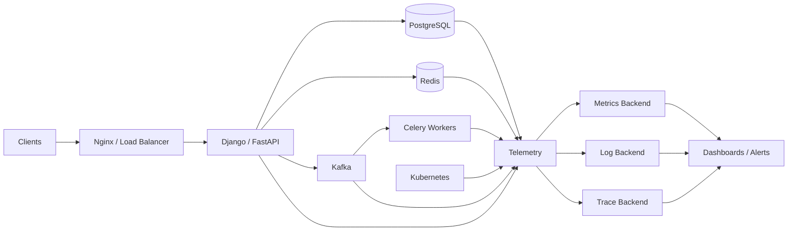
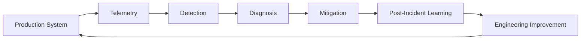

# 08- Monitoring

## Overview

Monitoring is the continuous collection, analysis, and interpretation of signals produced by a distributed system so engineers can determine whether the system is healthy, performant, reliable, and meeting its business objectives.

In a production backend, monitoring is not simply "checking whether servers are up." A system can have healthy CPU and memory while users experience elevated latency, failed payments, stale data, or missing events.

A mature monitoring strategy therefore observes multiple layers:

```text
                    Production System
                          |
          +---------------+---------------+
          |               |               |
          v               v               v
       Metrics           Logs           Traces
          |               |               |
          +---------------+---------------+
                          |
                          v
                    Observability
                          |
          +---------------+---------------+
          |               |               |
          v               v               v
       Dashboards       Alerts        Incident Response
```

For a backend platform built with Django, FastAPI, PostgreSQL, Redis, Kafka, Celery, Nginx, Docker, Kubernetes, and AWS, monitoring should provide visibility from the user's HTTP request all the way through downstream dependencies and asynchronous workers.

The core objective is not to collect every possible metric. The objective is to collect the right signals that allow engineers to answer:

- Is the system available?
- Is it fast enough?
- Is it behaving correctly?
- Where is it failing?
- Why is it failing?
- Which users or operations are affected?
- Is the system approaching a capacity limit?
- Did a recent deployment cause the problem?
- Can the system recover automatically?

## Monitoring vs Observability

Monitoring and observability are related but not identical.

**Monitoring** focuses on predefined signals and known failure conditions.

Examples:

```text
CPU > 80%
HTTP 5xx rate > 2%
p95 latency > 500 ms
Kafka consumer lag > threshold
Database connections > 90%
```

**Observability** focuses on understanding unknown or complex system behavior by examining telemetry from multiple dimensions.

A useful model is:

```text
Observability
├── Metrics
├── Logs
├── Traces
└── Events / Profiles
```

Monitoring answers:

> "Something is wrong."

Observability helps answer:

> "What is wrong, where is it happening, and why?"

A production system needs both.

## The Three Primary Signals

### Metrics

Metrics are numerical measurements recorded over time.

Examples:

```text
http_requests_total
http_request_duration_seconds
http_requests_failed_total
db_connections_active
redis_cache_hits_total
celery_tasks_failed_total
kafka_consumer_lag
```

Metrics are efficient for:

- Alerting.
- Dashboards.
- Capacity planning.
- Trend analysis.
- SLO calculations.

### Logs

Logs contain detailed event information.

Example:

```text
2026-08-23T14:20:12Z
level=ERROR
service=payments
request_id=7f4c...
operation=create_payment
error=DatabaseTimeout
duration_ms=3200
```

Logs are useful for:

- Debugging.
- Exception analysis.
- Security investigation.
- Auditing.
- Understanding individual requests.

### Traces

Distributed traces follow a request through multiple services.

For example:

```text
Client
  |
  v
Nginx
  |
  v
API
  |
  +--> PostgreSQL
  |
  +--> Redis
  |
  +--> Payment Service
           |
           v
        Kafka
```

A trace can show which component consumed the majority of the request's latency.

## Metrics, Logs, and Traces Compared

| Signal | Best For | Example |
|---|---|---|
| Metrics | Trends and alerting | p95 latency |
| Logs | Detailed debugging | Exception stack trace |
| Traces | Distributed request flow | API → DB → service |
| Events | State changes | Deployment completed |
| Profiles | CPU/memory hotspots | Python function consuming CPU |

No single signal is sufficient for complex distributed systems.

## Monitoring Architecture

A typical production architecture can be:



AWS environments may use services such as CloudWatch for infrastructure metrics, logs, and alarms, while organizations may additionally use Prometheus, Grafana, OpenTelemetry, or commercial observability platforms.

The exact tooling can vary. The monitoring principles remain the same.

## What Should Be Monitored?

A useful monitoring strategy covers several layers.

| Layer | Important Signals |
|---|---|
| User | Error rate, latency, availability |
| API | Request rate, status codes, latency |
| Application | Exceptions, queue depth, worker health |
| Database | Connections, latency, locks, replication |
| Cache | Hit rate, memory, evictions |
| Messaging | Lag, throughput, failures |
| Infrastructure | CPU, memory, disk, network |
| Kubernetes | Pod health, restarts, resource usage |
| AWS | Load balancers, EC2/ECS/EKS, RDS, S3 |
| Business | Payments, signups, orders, transactions |

Monitoring should be driven by system behavior and business impact rather than by infrastructure metrics alone.

## The Four Golden Signals

A widely useful starting point for service monitoring is the four golden signals:

- Latency
- Traffic
- Errors
- Saturation

### Latency

Latency measures how long an operation takes.

Common measurements include:

```text
p50
p90
p95
p99
```

For example:

```text
p50 = 80 ms
p95 = 250 ms
p99 = 900 ms
```

The median looks healthy, but the p99 indicates that a meaningful tail of requests is significantly slower.

### Traffic

Traffic measures demand.

Examples:

```text
requests/second
messages/second
bytes/second
jobs/second
```

Without traffic metrics, it is difficult to distinguish increased load from an application regression.

### Errors

Errors measure failed operations.

For an HTTP API:

```text
5xx responses / total responses
```

But not all application failures are HTTP 5xx responses.

Also monitor:

- Database errors.
- Timeout errors.
- Kafka publishing failures.
- Celery task failures.
- Authentication failures.
- External API failures.

### Saturation

Saturation indicates how close a resource is to its capacity.

Examples:

```text
CPU utilization
Memory utilization
Database connection pool usage
Kafka consumer lag
Redis memory usage
Thread pool utilization
Worker concurrency
```

Saturation is especially useful for predicting future failures.

## The RED Method

For request-driven services, the RED method focuses on:

- Rate.
- Errors.
- Duration.

Example:

```text
Rate:
  HTTP requests/sec

Errors:
  HTTP 5xx/sec

Duration:
  p50/p95/p99 request latency
```

This is particularly useful for:

- Django APIs.
- FastAPI services.
- gRPC services.
- Microservices.

## The USE Method

The USE method is useful for infrastructure resources:

- Utilization.
- Saturation.
- Errors.

Example for a database:

```text
Utilization:
  CPU = 65%

Saturation:
  Connection pool = 92%

Errors:
  Connection failures = 17/min
```

RED and USE complement each other.

```text
Application Layer
       |
      RED
       |
       v
Infrastructure Layer
       |
      USE
```

## Request Lifecycle Monitoring

A production HTTP request might follow:

```text
Client
  |
  v
Route53 / DNS
  |
  v
CloudFront / CDN
  |
  v
Load Balancer
  |
  v
Nginx
  |
  v
Django / FastAPI
  |
  +--> Redis
  |
  +--> PostgreSQL
  |
  +--> External API
  |
  v
Response
```

Monitoring should allow an engineer to identify latency at each important boundary.

For example:

```text
Total latency = 750 ms

Nginx       = 5 ms
Application = 100 ms
Redis       = 5 ms
PostgreSQL  = 600 ms
Network     = 40 ms
```

The problem is clearly different from an application CPU issue.

## Latency Percentiles

Do not rely only on averages.

Suppose 100 requests produce:

```text
95 requests = 50 ms
5 requests  = 2 seconds
```

The average may look acceptable while users in the slow tail experience poor performance.

Percentiles expose tail behavior.

| Percentile | Interpretation |
|---|---|
| p50 | Typical request |
| p90 | Slower portion |
| p95 | Common SLO boundary |
| p99 | Tail latency |
| p99.9 | Extreme tail |

For user-facing APIs, p95 and p99 are often more useful than average latency.

## Application Metrics

A Django or FastAPI service should expose metrics such as:

```text
http_requests_total
http_request_duration_seconds
http_requests_in_flight
http_response_errors_total
application_exceptions_total
database_query_duration_seconds
external_request_duration_seconds
```

Business-specific metrics are also valuable:

```text
orders_created_total
payments_completed_total
payments_failed_total
documents_uploaded_total
emails_sent_total
```

Business metrics can reveal failures that infrastructure metrics miss.

## Metric Labels

Metrics often include dimensions.

Example:

```text
http_requests_total{
    method="GET",
    route="/api/orders/{id}",
    status="200"
}
```

Labels are useful because they allow filtering and grouping.

However, high-cardinality labels can become expensive.

Avoid labels such as:

```text
user_id
request_id
email
full_url
session_id
```

for high-volume metrics.

These values should generally belong in logs or traces instead.

## Cardinality

Cardinality is the number of unique combinations of metric labels.

Consider:

```text
service = payments
endpoint = /payments
status = 500
```

This is low cardinality.

But:

```text
user_id = 983472983
```

may create millions of unique time series.

High-cardinality metrics can cause:

- Increased memory usage.
- Higher telemetry costs.
- Slower queries.
- Increased storage requirements.
- Monitoring-system instability.

Use metrics for aggregated dimensions and traces/logs for highly unique identifiers.

## Structured Logging

Production logs should be structured rather than plain strings.

Example:

```json
{
  "timestamp": "2026-08-23T14:20:12.123Z",
  "level": "ERROR",
  "service": "orders-api",
  "environment": "production",
  "request_id": "7f4c9d",
  "trace_id": "2c8a1f",
  "route": "/api/orders",
  "method": "POST",
  "status_code": 500,
  "duration_ms": 342,
  "error_type": "DatabaseTimeout"
}
```

Structured logs make machine-based filtering and aggregation significantly easier.

## Log Levels

A practical logging hierarchy is:

| Level | Purpose |
|---|---|
| DEBUG | Detailed diagnostic information |
| INFO | Normal important events |
| WARNING | Unexpected but recoverable condition |
| ERROR | Operation failed |
| CRITICAL | Severe system failure |

Production systems should avoid excessive DEBUG logging because it can generate significant volume and cost.

## Logging Sensitive Data

Never blindly log:

```text
passwords
access tokens
refresh tokens
API keys
credit card numbers
session cookies
private documents
```

Sensitive values should be:

- Omitted.
- Masked.
- Hashed where appropriate.
- Redacted at the logging boundary.

Logs themselves should be treated as sensitive production data.

## Request IDs

A request ID provides correlation across application logs.

Example:

```text
Client
  |
  | X-Request-ID: abc123
  v
API
  |
  +--> PostgreSQL
  +--> Redis
  +--> External Service
```

Every relevant log entry can include:

```text
request_id=abc123
```

This makes debugging a single request significantly easier.

Do not blindly trust arbitrary client-provided request IDs. Validate their format and generate one when absent.

## Distributed Tracing

Distributed tracing adds a trace context to requests.

Example:

```text
Trace ID: abc123

Span 1: API
  |
  +-- Span 2: PostgreSQL query
  |
  +-- Span 3: Redis GET
  |
  +-- Span 4: Payment Service
          |
          +-- Span 5: PostgreSQL
```

The resulting trace provides a causal view of the request.

OpenTelemetry is a common standard for instrumenting applications.

A trace context can propagate through:

- HTTP.
- gRPC.
- Messaging systems.
- Background jobs.

## Trace Context Propagation

For synchronous service-to-service calls:

```text
Service A
   |
   | trace context
   v
Service B
   |
   | trace context
   v
Service C
```

For asynchronous messaging:

```text
Producer
   |
   | trace context in message
   v
Kafka
   |
   v
Consumer
```

Propagation allows engineers to connect asynchronous work back to the originating operation.

## Monitoring PostgreSQL

Important PostgreSQL signals include:

```text
CPU
Memory
Connections
Connection pool utilization
Query latency
Transactions/sec
Locks
Deadlocks
Replication lag
Cache hit ratio
Disk usage
I/O latency
```

Application monitoring should additionally track:

```text
slow query count
query duration
database timeout count
connection acquisition time
```

A database can become the bottleneck even when application CPU remains low.

## Database Connection Pool Monitoring

Consider:

```text
Maximum connections = 500

Active connections = 470
```

This indicates the system is close to saturation.

For a horizontally scaled backend:

```text
100 pods × 10 DB connections
= 1,000 potential connections
```

Adding more application instances can therefore make a database failure worse.

Monitor connection usage at both the application and database layers.

## Monitoring Redis

Important Redis signals include:

- Memory usage.
- Memory fragmentation.
- Evictions.
- Hit/miss ratio.
- Command latency.
- Connected clients.
- Blocked clients.
- CPU usage.
- Replication health.
- Persistence status where applicable.

A declining cache hit ratio may increase database load even when Redis itself appears healthy.

## Monitoring Kafka

Kafka monitoring should include:

```text
Producer throughput
Consumer throughput
Consumer lag
Partition health
Broker health
Under-replicated partitions
Request latency
Error rates
Disk usage
Network throughput
```

Consumer lag is particularly important.

```text
Produced:
100,000 messages/min

Consumed:
80,000 messages/min

Lag:
20,000 messages/min growth
```

The consumer is falling behind.

Lag should be monitored as a trend rather than only as a static threshold.

## Monitoring Celery

For Celery-based systems, monitor:

- Queue depth.
- Task execution time.
- Task failure rate.
- Retry rate.
- Worker count.
- Worker CPU.
- Worker memory.
- Task age.
- Dead-lettered or permanently failed jobs.

A queue can remain operational while silently growing indefinitely.

That is a capacity problem.

## Kubernetes Monitoring

Important Kubernetes signals include:

```text
Pod restarts
Container crashes
CPU usage
Memory usage
CPU throttling
OOMKilled events
Pending pods
Scheduling failures
Node capacity
Replica availability
Deployment health
```

For workloads using Horizontal Pod Autoscaling, monitor:

```text
desired replicas
current replicas
available replicas
scaling events
resource utilization
```

Do not rely exclusively on Kubernetes resource metrics. Application-level latency and errors remain more important.

## AWS Monitoring

A typical AWS architecture may use:

```text
CloudWatch
├── Metrics
├── Logs
├── Alarms
├── Dashboards
└── Events
```

Services such as:

- Application Load Balancer.
- EC2.
- ECS.
- EKS.
- RDS.
- ElastiCache.
- SQS.
- Lambda.
- S3.

can expose service-specific monitoring signals.

CloudWatch alarms can trigger operational actions or notifications.

For deeper application observability, AWS infrastructure monitoring can be combined with application telemetry and OpenTelemetry-based instrumentation.

## Health Checks

Health checks determine whether a service is functioning.

A useful distinction is:

### Liveness

Answers:

> Is the process alive?

Example:

```http
GET /health/live
```

A liveness check should be lightweight.

### Readiness

Answers:

> Can this instance safely receive traffic?

Example:

```http
GET /health/ready
```

Readiness may validate critical dependencies.

```text
Application
   |
   +--> Database reachable
   +--> Required configuration loaded
   +--> Required dependency available
```

Do not make liveness checks depend on every external dependency. Otherwise a temporary database failure can cause Kubernetes to restart healthy application processes unnecessarily.

## Health Check Design

Bad:

```text
/liveness
  -> PostgreSQL
  -> Redis
  -> Kafka
  -> External API
```

A temporary database outage can cause:

```text
Database failure
      |
      v
Liveness fails
      |
      v
Pods restart
      |
      v
More load on dependencies
      |
      v
Larger outage
```

This is a cascading failure.

Prefer:

```text
Liveness
  -> Process is alive

Readiness
  -> Can serve traffic
```

## Alerting

Alerts should represent conditions that require action.

A bad alert:

```text
CPU > 70%
```

This may generate noise even when the service is healthy.

A better alert might combine resource saturation with user impact:

```text
HTTP 5xx > 2%
AND
p95 latency > 500 ms
FOR
5 minutes
```

The exact threshold depends on the workload and SLO.

## Alert Quality

A good alert should answer:

- What is broken?
- Which service?
- Which environment?
- How severe is it?
- What is the likely impact?
- Where should the engineer investigate?
- What runbook applies?

Example:

```text
CRITICAL: Orders API availability degraded

Environment: production
Service: orders-api
5xx rate: 8.2%
Duration: 7 minutes
Affected route: POST /api/orders
Deployment: release-2026.08.23.4
Runbook: Orders API incident procedure
```

## Alert Fatigue

If engineers receive hundreds of alerts, they will eventually stop treating alerts as meaningful signals.

Avoid:

- Alerting on every warning.
- Alerting on normal traffic variation.
- Duplicate alerts.
- Alerts without actionable remediation.
- Extremely sensitive thresholds.
- Alerts for metrics nobody owns.

Alerts should be:

- Actionable.
- Specific.
- Prioritized.
- Routed to the correct team.
- Suppressed or deduplicated when appropriate.

## Alert Severity

A practical model is:

| Severity | Meaning | Example |
|---|---|---|
| Critical | Major user/business impact | API unavailable |
| High | Significant degradation | Error rate > SLO |
| Medium | Potential developing problem | Queue growing |
| Low | Informational | Capacity trend |

Severity should be based on impact, not simply on how large a metric value looks.

## SLI, SLO, and SLA

### Service Level Indicator

An SLI is the measured reliability or performance signal.

Example:

```text
Successful requests / total valid requests
```

### Service Level Objective

An SLO defines the target.

Example:

```text
99.9% successful requests over 30 days
```

### Service Level Agreement

An SLA is an external contractual commitment.

These concepts should not be confused.

```text
SLI
 |
 | measured value
 v
SLO
 |
 | contractual commitment may be based on it
 v
SLA
```

## Availability Calculation

Suppose:

```text
Total requests = 1,000,000
Successful requests = 999,500
```

Availability:

```text
999,500 / 1,000,000 = 99.95%
```

The remaining 0.05% are failures.

Monitoring should calculate reliability using the same definition used by the SLO.

## Error Budget

For a 99.9% availability SLO:

```text
Allowed failure = 0.1%
```

For a 30-day period:

```text
30 days × 24 hours × 60 minutes
= 43,200 minutes

Error budget:
43,200 × 0.001
= 43.2 minutes
```

The error budget represents the amount of unreliability the service can tolerate while meeting its objective.

This can influence engineering decisions:

```text
Healthy error budget
    |
    +--> Faster feature delivery
    +--> More deployment flexibility
    +--> Controlled experimentation

Exhausted error budget
    |
    +--> Prioritize reliability
    +--> Reduce risky releases
    +--> Investigate systemic failures
```

## Monitoring SLOs

For an API, useful SLOs may include:

```text
Availability:
99.9%

Latency:
99% of requests < 500 ms

Async processing:
99% of jobs completed within 2 minutes
```

The SLO must define:

- Measurement window.
- Eligible requests.
- Exclusions.
- Target.
- Data source.

Ambiguous SLOs produce ambiguous alerts.

## Burn Rate

Error-budget burn rate measures how quickly the service is consuming its allowed error budget.

If the system is consuming failures significantly faster than expected, an alert should trigger before the entire monthly budget is exhausted.

This is more useful than simply saying:

```text
5xx > 1%
```

because the alert relates directly to the service reliability objective.

## Monitoring Asynchronous Systems

Asynchronous systems require different signals.

Consider:

```text
API
 |
 v
Kafka
 |
 v
Worker
 |
 v
Database
```

Monitoring should measure:

```text
Producer rate
Queue depth
Consumer lag
Processing rate
Task duration
Failure rate
Retry rate
Age of oldest message
```

The most useful signal may be:

```text
Oldest unprocessed message age
```

rather than raw queue length.

For example:

```text
Queue:
100,000 messages

If workers process:
50,000/sec

100,000 may be harmless.

If workers process:
10/sec

100,000 may indicate severe degradation.
```

## Capacity Monitoring

Monitoring should help predict when the system will run out of capacity.

Track:

```text
CPU growth
Memory growth
DB connection growth
Storage growth
Queue growth
Traffic growth
```

A useful capacity dashboard may show:

```text
Current capacity
Current utilization
Peak utilization
Growth rate
Estimated exhaustion date
```

Capacity planning is a proactive use of monitoring rather than merely incident response.

## Monitoring Deployments

Every deployment should be correlated with system behavior.

Track:

```text
deployment_id
commit_sha
version
environment
deployment_time
```

Then correlate:

```text
Deployment
    |
    +--> Error rate increased
    +--> p95 latency increased
    +--> Memory increased
```

This significantly reduces mean time to detection and diagnosis.

A deployment marker on a dashboard is often more valuable than another infrastructure graph.

## Canary Monitoring

Canary deployments expose a new version to a small percentage of traffic.

```text
                    Load Balancer
                         |
              +----------+----------+
              |                     |
              v                     v
          Stable 95%             Canary 5%
              |                     |
              v                     v
          Version A             Version B
```

Compare:

```text
error rate
latency
resource usage
business metrics
```

If the canary performs worse, stop or roll back the deployment.

## Monitoring Background Workers

For workers, monitor both worker health and workload health.

A process can be alive while making no progress.

For example:

```text
Celery worker = RUNNING
Queue depth   = increasing
Tasks/min     = decreasing
```

The worker is technically alive but operationally unhealthy.

This is why progress metrics are often more valuable than process-state metrics.

## Synthetic Monitoring

Synthetic monitoring executes known transactions periodically.

Example:

```text
Every minute:

1. Open login endpoint
2. Authenticate test user
3. Request dashboard
4. Verify expected response
```

This detects problems before users report them.

Synthetic tests are particularly useful for:

- Public APIs.
- Login flows.
- Payment workflows.
- Critical customer journeys.
- DNS and CDN validation.

Do not use production synthetic tests that perform irreversible business actions.

## Real User Monitoring

Real User Monitoring captures actual client-side behavior.

Useful signals include:

- Page load time.
- API latency.
- Browser errors.
- Mobile performance.
- Geographic latency.

Backend engineers can correlate these signals with API traces to understand end-to-end user experience.

## Security Monitoring

Monitoring should also detect suspicious behavior.

Examples:

```text
Authentication failures
Unusual login locations
Excessive API requests
Permission failures
Credential misuse
Unexpected administrative actions
Large data exports
Unusual object-storage access
```

Security events should be separated from normal application logs where necessary and protected with appropriate retention and access controls.

## Monitoring Data Retention

Not all telemetry requires the same retention.

| Data | Typical Retention Strategy |
|---|---|
| High-resolution metrics | Shorter |
| Aggregated metrics | Longer |
| Application logs | Medium |
| Audit logs | Long |
| Security logs | Compliance-dependent |
| Traces | Shorter |
| Incident data | Long-term |

Retention should balance:

```text
Debugging value
+
Compliance
+
Storage cost
+
Privacy
```

## Monitoring Cost

Observability can become expensive at scale.

Cost drivers include:

- Metric cardinality.
- Log volume.
- Trace volume.
- High-resolution metrics.
- Long retention.
- Cross-region transfer.
- Full request-body logging.
- Excessive debug logs.

Optimization strategies include:

- Sampling traces.
- Aggregating metrics.
- Filtering noisy logs.
- Reducing unnecessary labels.
- Tiering storage.
- Adjusting retention.
- Collecting detailed telemetry only where it provides operational value.

Never solve monitoring cost by removing critical signals without evaluating the operational consequences.

## Sampling

Tracing every request may be expensive at high traffic volumes.

A service receiving:

```text
100,000 requests/sec
```

could generate enormous trace volume.

Sampling strategies include:

- Head-based sampling.
- Tail-based sampling.
- Adaptive sampling.

A useful production approach may retain:

- All errors.
- Slow requests.
- Selected critical business flows.
- A representative sample of successful requests.

The exact strategy depends on the observability platform and workload.

## Disaster Recovery for Monitoring

Monitoring systems themselves are dependencies.

Consider what happens if:

```text
Application healthy
       |
Monitoring system unavailable
       |
       v
No alerts
No dashboards
No incident visibility
```

For critical platforms:

- Monitor monitoring infrastructure.
- Maintain access to essential dashboards.
- Protect observability credentials.
- Retain critical audit/security data appropriately.
- Avoid making application availability depend synchronously on telemetry infrastructure.

Telemetry export should generally fail gracefully rather than causing user requests to fail.

## Monitoring Failure Isolation

Observability should not become a single point of failure.

Bad:

```text
API Request
    |
    v
Telemetry Service
    |
    v
Business Logic
```

If telemetry fails, the API fails.

Better:

```text
API Request
    |
    v
Business Logic
    |
    +-----------------> Telemetry
                         |
                    Async / buffered
```

Monitoring failures should degrade observability, not application availability.

## Production Dashboard Design

A useful service dashboard should show the most important signals first.

Example:

```text
Orders API
------------------------------------------------
Availability       99.96%
p95 latency        210 ms
p99 latency        680 ms
Requests/sec       2,400
5xx rate           0.08%
Active instances   24
DB connections     310 / 500
Redis hit ratio    94%
Queue age          12 sec
------------------------------------------------
Recent deployments
Recent incidents
Dependency health
```

Do not create dashboards containing dozens of unrelated graphs with no operational purpose.

## Dependency Monitoring

An application can fail because of dependencies even when its own process is healthy.

Monitor:

```text
PostgreSQL
Redis
Kafka
External REST APIs
gRPC services
DNS
Cloud provider services
```

For each critical dependency, track:

- Availability.
- Latency.
- Error rate.
- Saturation.
- Timeout rate.

## Timeouts and Monitoring

Timeouts should be monitored explicitly.

Example:

```text
External payment API timeout rate = 3%
```

A timeout is not always represented as an HTTP 5xx from the dependency.

Track timeout exceptions separately:

```text
external_request_timeout_total
```

Timeouts are particularly important because they can consume:

- Worker threads.
- Async tasks.
- Connection pools.
- Database connections.
- Request slots.

A dependency slowdown can therefore become application saturation.

## Cascading Failure Detection

A mature monitoring system should detect failure propagation.

Example:

```text
External API slows down
        |
        v
Request duration increases
        |
        v
Worker concurrency increases
        |
        v
Connection pool saturates
        |
        v
Requests timeout
        |
        v
5xx increases
```

Monitoring each stage independently helps identify the original bottleneck.

## Common Monitoring Mistakes

### Monitoring Only CPU and Memory

CPU and memory do not directly tell you whether users can successfully use the system.

Always include service-level signals such as:

```text
rate
errors
latency
availability
```

### Using Only Average Latency

Average latency hides tail behavior.

Use percentiles.

### Alerting on Everything

More alerts do not mean better monitoring.

Alert only when human action is required.

### High-Cardinality Metrics

Do not put user IDs, request IDs, or arbitrary URLs into high-volume metric labels.

Use logs and traces instead.

### Logging Everything

Logging every request body can create enormous costs and security risks.

Log only information that provides operational value.

### Ignoring Business Metrics

An API can return HTTP 200 while a business operation fails.

Example:

```text
Payment endpoint:
HTTP 200

Payment status:
FAILED
```

Monitor critical business outcomes directly.

### Health Checks That Are Too Deep

If liveness depends on every dependency, temporary dependency failures can cause unnecessary restarts.

### No Correlation IDs

Without request or trace identifiers, distributed debugging becomes significantly harder.

### No Deployment Correlation

A graph showing increased errors is less useful if engineers cannot determine which deployment occurred immediately before the regression.

### Monitoring Process Health Instead of Progress

A worker can be alive but unable to process messages.

Monitor throughput, queue age, and lag.

### Ignoring Alert Ownership

An alert without a responsible team creates operational ambiguity.

Every production alert should have ownership and an associated runbook.

## Interview Traps

### "CPU is 90%, so the application is unhealthy."

Not necessarily. CPU may be intentionally utilized and the service may still meet its SLO.

### "The service returns HTTP 200, so it is healthy."

Not necessarily. Business-level failures can occur inside successful HTTP responses.

### "More logs mean better observability."

Not necessarily. Excessive logs can increase cost, noise, security risk, and make important signals harder to find.

### "A database has low CPU, so it is healthy."

Not necessarily. It may be saturated on:

- Connections.
- Locks.
- I/O.
- Storage.
- Replication.
- Network.

### "Monitoring means dashboards."

Dashboards are only one part of monitoring. Alerting, telemetry, SLOs, incident response, and operational ownership are equally important.

### "If the worker process is running, the queue is healthy."

Not necessarily. A running worker may be stuck, slow, starved, or repeatedly failing tasks.

## Production Monitoring Checklist

### Application

- [ ] Request rate monitored.
- [ ] Error rate monitored.
- [ ] p50/p95/p99 latency monitored.
- [ ] Exceptions collected.
- [ ] Dependency latency monitored.
- [ ] Request correlation IDs available.
- [ ] Deployment versions exposed.

### Database

- [ ] Connection utilization monitored.
- [ ] Query latency monitored.
- [ ] Lock/deadlock metrics monitored.
- [ ] Replication lag monitored where applicable.
- [ ] Storage capacity monitored.
- [ ] I/O performance monitored.

### Cache

- [ ] Hit/miss ratio monitored.
- [ ] Memory usage monitored.
- [ ] Evictions monitored.
- [ ] Command latency monitored.

### Messaging

- [ ] Queue depth monitored.
- [ ] Consumer lag monitored.
- [ ] Oldest message age monitored.
- [ ] Retry/failure rates monitored.
- [ ] Dead-letter queues monitored.

### Infrastructure

- [ ] CPU monitored.
- [ ] Memory monitored.
- [ ] Disk monitored.
- [ ] Network monitored.
- [ ] Container restarts monitored.
- [ ] Kubernetes scheduling failures monitored.

### Reliability

- [ ] SLOs defined.
- [ ] Error budgets calculated.
- [ ] Burn-rate alerts configured.
- [ ] Critical dependencies monitored.
- [ ] Synthetic checks configured where appropriate.
- [ ] Disaster-recovery monitoring exists.

### Security

- [ ] Authentication failures monitored.
- [ ] Authorization failures monitored.
- [ ] Sensitive data excluded from logs.
- [ ] Administrative actions audited.
- [ ] Anomalous traffic monitored.

## Practical Monitoring Strategy

For a Django or FastAPI microservice, start with a small set of high-value signals.

### Service Metrics

```text
request_rate
error_rate
p95_latency
p99_latency
in_flight_requests
```

### Dependency Metrics

```text
postgres_latency
postgres_connection_usage
redis_hit_ratio
redis_latency
external_api_latency
external_api_error_rate
```

### Async Metrics

```text
queue_depth
oldest_message_age
consumer_lag
task_duration
task_failure_rate
```

### Infrastructure Metrics

```text
cpu
memory
disk
network
pod_restarts
```

### Business Metrics

```text
orders_created
payments_completed
payments_failed
documents_processed
```

This provides enough visibility to answer most first-level production questions without creating unnecessary telemetry.

## Example Alert Set

A practical initial alert set might include:

| Alert | Why It Matters |
|---|---|
| Availability below SLO | Direct user impact |
| High 5xx rate | Application failure |
| High p95/p99 latency | User degradation |
| Database connection saturation | Capacity risk |
| Database replication lag | Data consistency/DR risk |
| Kafka consumer lag | Async processing degradation |
| Queue age increasing | Worker capacity issue |
| High worker failure rate | Background processing failure |
| Disk nearly full | Imminent infrastructure failure |
| Pod crash loop | Deployment/application issue |
| Certificate expiry approaching | Availability/security risk |

Thresholds should be derived from workload behavior and SLOs rather than copied blindly from another system.

## Example OpenTelemetry Instrumentation

A Python application can use OpenTelemetry to instrument request traces.

A simplified setup can look like:

```python
from opentelemetry import trace
from opentelemetry.sdk.resources import Resource
from opentelemetry.sdk.trace import TracerProvider
from opentelemetry.sdk.trace.export import BatchSpanProcessor
from opentelemetry.exporter.otlp.proto.http.trace_exporter import OTLPSpanExporter


resource = Resource.create(
    {
        "service.name": "orders-api",
        "deployment.environment": "production",
    }
)

provider = TracerProvider(resource=resource)

exporter = OTLPSpanExporter(
    endpoint="https://otel-collector.example.com/v1/traces",
)

provider.add_span_processor(
    BatchSpanProcessor(exporter)
)

trace.set_tracer_provider(provider)

tracer = trace.get_tracer(__name__)


def process_order(order_id: str) -> None:
    with tracer.start_as_current_span("process_order") as span:
        span.set_attribute("order.id", order_id)

        # Business logic executes here.
        ...
```

In production, avoid placing sensitive information such as payment credentials, access tokens, or full personal data into span attributes.

Automatic instrumentation should be preferred where it provides sufficient coverage, with manual spans added for important business operations.

## Monitoring as an Engineering Feedback Loop

Monitoring should not stop at dashboards.

A mature feedback loop is:



Incidents should result in improvements such as:

- Better instrumentation.
- Better alerts.
- Better capacity planning.
- Safer deployments.
- Better automation.
- Better runbooks.
- Better architecture.

Monitoring is most valuable when it continuously improves the reliability of the system it observes.

## Key Takeaways

- **Monitor user-visible behavior first: rate, errors, latency, availability, and business outcomes are more meaningful than infrastructure metrics alone.**
- **Use metrics for aggregation and alerting, structured logs for detailed events, and distributed traces for understanding request flow across services and dependencies.**
- **Design alerts around SLOs and actionable failure conditions; avoid high-cardinality metrics, noisy alerts, and health checks that create cascading failures.**
- **Monitor asynchronous systems through queue depth, consumer lag, processing rate, task age, and failure rate rather than relying only on worker process health.**
- **Treat monitoring as part of system reliability engineering: correlate deployments and dependencies, control telemetry cost, protect sensitive data, and continuously improve instrumentation through incident feedback.**