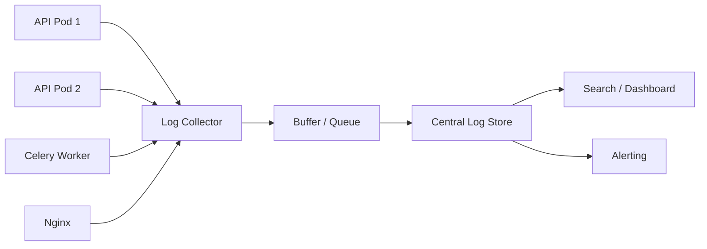
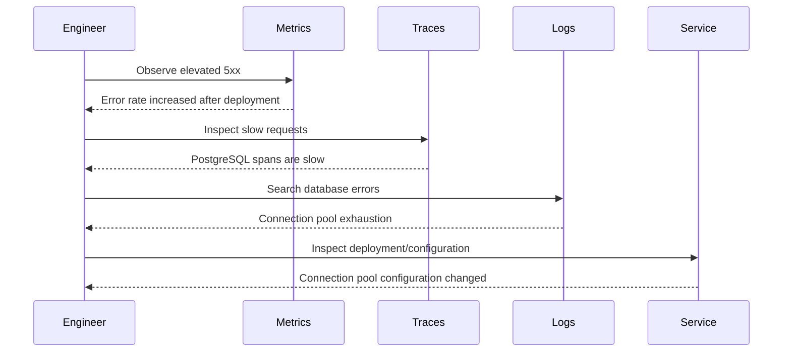
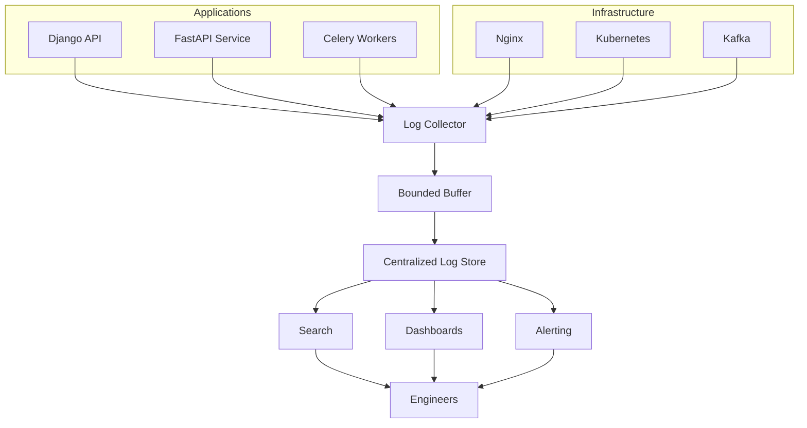

# 09- Logging

## Overview

Logging is the structured recording of application, infrastructure, security, and operational events so engineers can understand what a system did, diagnose failures, investigate incidents, and reconstruct important execution flows.

In production backend systems, logs are one of the primary sources of operational evidence. Metrics can tell you that error rates increased, and traces can show where latency occurred, but logs often provide the detailed context required to understand the actual failure.

A production logging architecture should therefore be designed rather than implemented as scattered `print()` statements.

A typical flow is:

```text
Application
    |
    v
Structured Log Event
    |
    v
Log Collector / Agent
    |
    v
Centralized Log Platform
    |
    +--> Search
    +--> Dashboards
    +--> Alerts
    +--> Security Investigation
    +--> Incident Response
```

For systems built with Django, FastAPI, PostgreSQL, Redis, Kafka, Celery, Nginx, Docker, Kubernetes, and AWS, centralized logging becomes essential once multiple instances, services, containers, or asynchronous workers are involved.

The key engineering goal is not to log everything. It is to capture enough high-quality context to answer:

- What happened?
- When did it happen?
- Which service produced it?
- Which request or operation was involved?
- Which user or tenant was affected, without exposing sensitive data?
- Which dependency failed?
- Which deployment was running?
- How severe was the event?
- Can the event be correlated with metrics and traces?

## Why Logging Matters

A backend service without useful logs becomes increasingly difficult to operate as it scales.

Consider a single application instance:

```text
Client
  |
  v
Django
  |
  v
PostgreSQL
```

An engineer may inspect the local process output.

At scale:

```text
                 Load Balancer
                      |
       +--------------+--------------+
       |              |              |
       v              v              v
    API-01         API-02         API-03
       |              |              |
       +--------------+--------------+
                      |
                      v
                 PostgreSQL
```

Now the relevant event may have occurred on any instance.

With centralized logging:

```text
API-01 --\
API-02 ----> Log Collector --> Central Log Store
API-03 --/                         |
                                   +--> Search
                                   +--> Alert
                                   +--> Investigation
```

Centralized logs provide a consistent operational view across the fleet.

## Logging vs Metrics vs Traces

Logging is only one part of observability.

| Signal | Primary Question | Example |
|---|---|---|
| Metrics | How much / how often? | 5xx rate = 2% |
| Logs | What happened? | Database timeout |
| Traces | Where did time go? | 500 ms spent in PostgreSQL |
| Profiles | Which code consumed resources? | Python function using CPU |
| Events | What changed? | Deployment started |

A practical incident may use all three primary signals:

```text
Metric:
  5xx rate increased

Trace:
  Requests spend 3 seconds in database calls

Log:
  PostgreSQL connection timeout
  pool=default
  active_connections=95
```

The signals complement each other rather than compete with each other.

## What a Log Event Should Contain

A production log event should answer the basic questions surrounding an operation.

A useful structured event may contain:

```json
{
  "timestamp": "2026-08-23T14:20:12.123Z",
  "level": "ERROR",
  "service": "orders-api",
  "environment": "production",
  "version": "2026.08.23.4",
  "request_id": "7f4c9d",
  "trace_id": "2c8a1f",
  "method": "POST",
  "route": "/api/orders",
  "status_code": 500,
  "duration_ms": 342,
  "event": "database_query_failed",
  "error_type": "DatabaseTimeout"
}
```

The exact schema can vary, but consistency matters more than the specific field names.

## Structured Logging

Structured logging represents events as machine-readable fields rather than arbitrary text.

Unstructured:

```text
Failed to create order for customer 123 because database timed out
```

Structured:

```json
{
  "level": "ERROR",
  "event": "order_creation_failed",
  "customer_id": "123",
  "error_type": "DatabaseTimeout"
}
```

Structured logging allows queries such as:

```text
service = "orders-api"
AND
level = "ERROR"
AND
error_type = "DatabaseTimeout"
```

instead of relying on fragile string matching.

### Advantages

- Easier machine processing.
- Better searchability.
- Consistent dashboards.
- Easier aggregation.
- Better correlation with traces and metrics.
- Easier ingestion into centralized logging platforms.

### Limitations

- Requires a defined schema.
- Poorly designed schemas can still become difficult to query.
- High-volume structured logs can become expensive.
- Developers may accidentally log sensitive fields.

## Logging Levels

A typical logging hierarchy is:

| Level | Purpose | Example |
|---|---|---|
| `DEBUG` | Detailed diagnostic information | SQL execution metadata |
| `INFO` | Normal operational events | Server started |
| `WARNING` | Unexpected but recoverable condition | Retry scheduled |
| `ERROR` | Operation failed | Database query failed |
| `CRITICAL` | Severe system failure | Service cannot initialize |

The meaning of each level should be standardized within the organization.

### DEBUG

Use for detailed diagnostic information that is generally unnecessary during normal production operation.

Example:

```text
cache lookup started
cache key generated
query execution metadata
```

Avoid permanently enabling extremely verbose debug logging in high-volume production systems.

### INFO

Use for important normal events.

Examples:

```text
service_started
deployment_version_loaded
consumer_started
configuration_loaded
```

Do not log every trivial internal operation at `INFO` if the service handles very high request volume.

### WARNING

Use when something unexpected happened but the system can continue.

Examples:

```text
cache miss
retry triggered
deprecated client version
approaching capacity threshold
```

Not every warning requires immediate human intervention.

### ERROR

Use when an operation failed.

Examples:

```text
database_timeout
payment_provider_failed
kafka_publish_failed
task_execution_failed
```

Errors should contain enough context to investigate the failure.

### CRITICAL

Use sparingly for severe failures that threaten service operation.

Examples:

```text
database configuration missing
application cannot initialize
critical encryption key unavailable
```

If everything is `CRITICAL`, nothing is.

## Log Schema Design

A useful logging schema normally contains several categories of fields.

### Identity

```text
timestamp
service
environment
region
instance_id
container_id
pod_name
version
```

### Request Context

```text
request_id
trace_id
span_id
method
route
status_code
duration_ms
```

### Operation Context

```text
event
operation
resource_type
resource_id
dependency
```

### Error Context

```text
error_type
error_message
exception
stack_trace
```

### Business Context

Use carefully:

```text
order_id
tenant_id
workflow_id
```

Only include business identifiers when they provide operational value and comply with privacy and security requirements.

## Timestamp Standards

Use a consistent timestamp format.

UTC is generally preferred for distributed backend systems.

Example:

```text
2026-08-23T14:20:12.123Z
```

UTC avoids ambiguity caused by:

- Time zones.
- Daylight-saving transitions.
- Servers running in different regions.

Local timezone conversion should generally happen at the presentation layer rather than being mixed into stored logs.

## Request IDs

A request ID identifies an individual request.

Example:

```text
X-Request-ID: 7f4c9d
```

The flow can be:

```text
Client
  |
  | X-Request-ID
  v
Nginx
  |
  v
Django / FastAPI
  |
  +--> PostgreSQL
  +--> Redis
  +--> External API
```

Application logs can include:

```json
{
  "request_id": "7f4c9d",
  "event": "order_created"
}
```

This allows engineers to search for all events associated with a request.

### Request ID vs Trace ID

They serve related but different purposes.

| Identifier | Purpose |
|---|---|
| Request ID | Correlates an application request |
| Trace ID | Correlates distributed spans |
| Span ID | Identifies one operation within a trace |
| User ID | Identifies a user |
| Order ID | Identifies a business entity |

Do not use user IDs or business IDs as replacements for request or trace identifiers.

## Trace Correlation

Logs become significantly more useful when they include trace information.

Example:

```json
{
  "timestamp": "2026-08-23T14:20:12Z",
  "service": "orders-api",
  "trace_id": "abc123",
  "span_id": "def456",
  "event": "database_query_failed",
  "error_type": "TimeoutError"
}
```

An engineer can then move from:

```text
Metric
  |
  v
Trace
  |
  v
Log
```

This creates a much faster debugging workflow.

## Logging in Django

Django uses Python's standard `logging` framework.

A production configuration should route application logs to an appropriate output stream rather than relying on application-specific files inside ephemeral containers.

Example:

```python
LOGGING = {
    "version": 1,
    "disable_existing_loggers": False,
    "formatters": {
        "json": {
            "format": (
                '{"level":"%(levelname)s",'
                '"logger":"%(name)s",'
                '"message":"%(message)s"}'
            ),
        },
    },
    "handlers": {
        "console": {
            "class": "logging.StreamHandler",
            "formatter": "json",
        },
    },
    "loggers": {
        "django": {
            "handlers": ["console"],
            "level": "INFO",
            "propagate": False,
        },
        "orders": {
            "handlers": ["console"],
            "level": "INFO",
            "propagate": False,
        },
    },
}
```

In containerized environments, emitting logs to `stdout` and `stderr` is generally preferable to writing application logs into local container files.

The container runtime or logging agent can then collect them centrally.

## Logging in FastAPI

FastAPI applications can use Python's standard logging infrastructure.

Example:

```python
import logging

logger = logging.getLogger("orders-api")


def create_order(order_id: str) -> None:
    logger.info(
        "Creating order",
        extra={
            "order_id": order_id,
        },
    )
```

For production systems, a structured logging library or a standardized JSON logging formatter is usually preferable to manually constructing JSON strings.

The important design principle is to establish one consistent logging approach across the service rather than mixing:

```python
print(...)
logger.info(...)
custom_json_logger(...)
```

without a defined strategy.

## Logging Exceptions Correctly

When handling exceptions, preserve the stack trace.

Prefer:

```python
try:
    process_order()
except Exception:
    logger.exception("Order processing failed")
    raise
```

over:

```python
try:
    process_order()
except Exception as exc:
    logger.error(str(exc))
    raise
```

`logger.exception()` records the exception context and traceback when called from an exception handler.

The traceback is often the most valuable part of the event during incident investigation.

## What Not to Log

Never log sensitive secrets casually.

Avoid:

```text
password
access_token
refresh_token
session_cookie
API key
private key
credit card number
CVV
database password
encryption key
```

Also be careful with personal information:

```text
email address
phone number
home address
government identifiers
private documents
```

Whether a particular field may be logged depends on the application's privacy, regulatory, and security requirements.

## Data Redaction

Sensitive fields should ideally be removed or masked before they reach the logging backend.

Example:

```json
{
  "user": "ar***@example.com",
  "token": "[REDACTED]"
}
```

Do not depend entirely on engineers remembering which fields are sensitive.

Implement redaction centrally where practical.

```text
Application
    |
    v
Logging Middleware
    |
    +--> Remove secrets
    +--> Mask PII
    +--> Normalize fields
    |
    v
Log Collector
```

Redaction at the collection layer can provide an additional safety boundary, but sensitive data should ideally never be emitted by the application in the first place.

## SQL Logging

SQL logging can be useful during development and troubleshooting but can be dangerous at high volume in production.

Potential problems include:

- Excessive log volume.
- Performance overhead.
- Sensitive query parameters.
- Large query payloads.
- Increased observability costs.

Instead of logging every SQL statement, prefer:

```text
slow query detection
query duration metrics
database-level monitoring
targeted diagnostic logging
```

When query logging is temporarily enabled in production, define a controlled scope and duration.

## HTTP Request Logging

A useful HTTP access log may contain:

```json
{
  "method": "GET",
  "route": "/api/orders/{id}",
  "status_code": 200,
  "duration_ms": 42,
  "request_id": "7f4c9d",
  "user_agent": "mobile-client/3.4"
}
```

Avoid logging:

```text
Authorization header
Cookie header
request body containing credentials
full query parameters containing secrets
```

Also prefer normalized routes:

```text
/api/orders/{id}
```

instead of:

```text
/api/orders/893472
```

for aggregation and privacy reasons.

## Nginx Logging

Nginx access logs are useful for observing traffic before it reaches the application.

A useful access log can include:

```text
timestamp
remote address
request method
request path
status
request duration
upstream response time
request ID
```

For example:

```text
GET /api/orders/123 200
request_time=0.145
upstream_response_time=0.141
request_id=7f4c9d
```

The distinction between:

```text
request_time
```

and:

```text
upstream_response_time
```

can help identify whether latency was introduced by Nginx/network handling or the upstream application.

## Container Logging

In Docker environments, applications should generally write logs to:

```text
stdout
stderr
```

rather than relying on files inside the container.

Example:

```text
Application
   |
   +--> stdout
   +--> stderr
          |
          v
     Docker Runtime
          |
          v
    Logging Driver / Agent
          |
          v
    Centralized Logging
```

Containers are ephemeral. Local files may disappear when the container is replaced.

## Kubernetes Logging

A common Kubernetes logging architecture is:

```text
Pod
 |
 +--> stdout/stderr
          |
          v
Node-level log collector
          |
          v
Centralized log platform
```

Common collector approaches include agents such as Fluent Bit or OpenTelemetry Collector.

The application should generally remain unaware of where logs are ultimately stored.

This separation provides:

```text
Application
    |
    v
Standard output
    |
    v
Collection infrastructure
    |
    v
Storage / Search
```

## Centralized Logging

Centralized logging is essential once a system has multiple instances.

Without centralized logging:

```text
API-01 -> local logs
API-02 -> local logs
API-03 -> local logs
```

An engineer has to inspect each instance.

With centralized logging:

```text
API-01 --\
API-02 ----> Collector --> Central Store
API-03 --/
```

Engineers can search across the entire service fleet.

## Log Collection Architecture

A production architecture may look like:



A buffer can protect against temporary downstream ingestion failures.

However, buffering introduces its own capacity and durability considerations.

## Log Delivery Models

### Synchronous Logging

```text
Application
    |
    v
Log Backend
    |
    v
Continue Request
```

This can make logging failures affect request latency or availability.

### Asynchronous Logging

```text
Application
    |
    v
Local Buffer
    |
    v
Log Collector
    |
    v
Log Backend
```

Asynchronous logging is generally preferable for high-throughput applications because the business request should not wait for a remote logging system.

However, asynchronous logging introduces a trade-off:

```text
Higher application performance
        vs
Potential log loss during failures
```

Critical audit events may require stronger delivery guarantees than ordinary diagnostic logs.

## Logging Backpressure

Suppose:

```text
Application log rate = 100 MB/s
Collector capacity   = 50 MB/s
```

The backlog grows.

A robust system should define what happens under pressure.

Possible strategies:

- Bounded buffers.
- Sampling.
- Dropping low-priority logs.
- Backpressure.
- Rate limiting.
- Durable queues.
- Prioritizing security/audit events.

Never allow unlimited in-memory logging buffers. A logging storm can otherwise become an application memory failure.

## Logging Volume

A service handling:

```text
10,000 requests/sec
```

that emits 5 KB per request produces approximately:

```text
10,000 × 5 KB
= 50 MB/sec
```

That is approximately:

```text
50 MB × 3,600
≈ 180 GB/hour
```

before compression and storage optimizations.

This demonstrates why "log everything" is not a production strategy.

## Log Sampling

Sampling can reduce volume.

For example:

```text
Successful requests:
  sample 1%

Errors:
  retain 100%

Slow requests:
  retain 100%

Security events:
  retain 100%
```

The exact policy depends on the workload and compliance requirements.

Sampling should never silently remove telemetry required for security, auditing, or contractual obligations.

## Log Retention

Different logs often require different retention periods.

| Log Type | Retention Consideration |
|---|---|
| Debug logs | Short |
| Application logs | Medium |
| Security logs | Longer |
| Audit logs | Compliance-dependent |
| Access logs | Workload-dependent |
| Incident evidence | As required |

Retention decisions should consider:

- Debugging requirements.
- Security requirements.
- Regulatory requirements.
- Storage cost.
- Privacy.
- Legal requirements.

## Log Rotation

When logs are stored locally, rotation prevents unbounded disk usage.

Typical controls include:

```text
Maximum file size
Maximum number of files
Maximum retention period
Compression
```

In containerized environments, centralized collection is usually preferable to maintaining large application-managed log files.

## Logging Performance

Logging is not free.

Costs include:

```text
String formatting
Serialization
I/O
CPU
Memory
Network
Storage
Indexing
Querying
```

High-frequency logging inside a hot path can significantly affect application performance.

Avoid:

```python
for item in millions_of_items:
    logger.info("Processing item %s", item)
```

Prefer aggregated progress information where appropriate:

```text
processed_items=100000
duration_ms=4200
```

## Logging and Concurrency

In asynchronous and concurrent applications, logs from multiple operations can interleave.

Correlation fields solve this problem.

Instead of:

```text
Processing order
Database query failed
Retrying
Processing order
Database query succeeded
```

use:

```text
request_id=abc123 event=processing_order
request_id=abc123 event=database_query_failed
request_id=abc123 event=retrying
```

This makes concurrent execution much easier to understand.

## Celery Logging

Background workers require special logging considerations because there may be no direct HTTP request.

Useful fields include:

```text
task_id
task_name
queue
worker
retry_count
duration_ms
trace_id
```

Example:

```json
{
  "level": "ERROR",
  "service": "order-worker",
  "event": "task_failed",
  "task_name": "send_order_confirmation",
  "task_id": "6a9d...",
  "retry_count": 2,
  "error_type": "SMTPTimeout"
}
```

A background task should be traceable even though it does not have an HTTP request ID.

## Kafka Logging

Kafka producers and consumers should log meaningful lifecycle and failure events.

Producer events:

```text
message_publish_failed
message_publish_retried
serialization_failed
```

Consumer events:

```text
message_processing_failed
consumer_rebalanced
offset_commit_failed
dead_letter_published
```

Do not log the full payload of every Kafka message by default.

Large or sensitive payloads can create significant cost and security risk.

Prefer identifiers and metadata:

```json
{
  "event": "message_processing_failed",
  "topic": "orders",
  "partition": 12,
  "offset": 9384732,
  "message_id": "abc123",
  "error_type": "ValidationError"
}
```

## Audit Logging

Audit logs are different from ordinary application logs.

An audit log records security- or business-significant actions.

Examples:

```text
user_permissions_changed
admin_created
payment_refunded
document_deleted
API_key_created
production_configuration_changed
```

An audit event should answer:

```text
Who?
What?
When?
Where?
Against which resource?
What changed?
Was it successful?
```

Example:

```json
{
  "timestamp": "2026-08-23T15:00:00Z",
  "event": "permission_changed",
  "actor_id": "user-123",
  "target_id": "user-456",
  "resource": "project-789",
  "old_role": "viewer",
  "new_role": "admin",
  "source_ip": "203.0.113.10",
  "result": "success"
}
```

Audit logging often requires stronger retention, access control, and integrity guarantees than ordinary application logs.

## Audit Logs vs Application Logs

| Property | Application Log | Audit Log |
|---|---|---|
| Primary purpose | Debugging | Accountability |
| Typical retention | Short/medium | Often longer |
| Security sensitivity | High | Very high |
| Mutation | Often acceptable | Prefer controlled/immutable |
| Access | Engineering teams | Restricted |
| Examples | Timeout, exception | Permission changed |

Do not assume that normal application logs automatically satisfy audit requirements.

## Security of Logs

Logs frequently contain operational secrets and therefore require strong security controls.

Protect logs through:

- Encryption in transit.
- Encryption at rest.
- IAM/RBAC.
- Least-privilege access.
- Restricted production access.
- Retention policies.
- Redaction.
- Audit trails for log access.

A compromised log platform can expose:

```text
customer information
internal architecture
request metadata
authentication events
security events
operational credentials
```

## Multi-Tenant Systems

For multi-tenant systems, tenant context can be useful:

```json
{
  "tenant_id": "tenant-123",
  "event": "document_processing_failed"
}
```

But tenant IDs can create sensitive information exposure if logs are broadly accessible.

Tenant identifiers should therefore be handled according to the application's security model.

Do not expose unrestricted tenant data through shared engineering dashboards.

## Logging and Privacy

Logging should follow data minimization.

Before adding a field, ask:

> Does this information materially improve diagnosis, security, or operations?

If not, do not log it.

Particularly sensitive information should be excluded by design rather than relying on downstream deletion.

A useful rule is:

```text
Collect only what is operationally necessary.
```

## Log Search Patterns

A centralized logging platform should support filtering by:

```text
service
environment
timestamp
level
event
request_id
trace_id
status_code
route
error_type
deployment_version
```

A typical incident query might be:

```text
service="orders-api"
environment="production"
level="ERROR"
timestamp >= incident_start
```

Then narrow it using:

```text
error_type="DatabaseTimeout"
```

and correlate using:

```text
trace_id
```

## Correlation During an Incident

A practical investigation flow is:



This is significantly more effective than searching millions of log lines without context.

## Deployment Correlation

Every application log should ideally expose a deployment version.

Example:

```json
{
  "service": "orders-api",
  "version": "2026.08.23.4",
  "event": "database_timeout"
}
```

This allows queries such as:

```text
version = "2026.08.23.4"
AND
level = "ERROR"
```

Deployment metadata is particularly valuable for identifying regressions.

## Logging in Serverless Systems

Serverless applications such as AWS Lambda typically emit logs to a centralized service rather than maintaining local files.

Useful fields include:

```text
function_name
request_id
duration
memory_used
cold_start
status
error_type
```

The same principles still apply:

- Structured logs.
- Correlation.
- Sensitive-data protection.
- Appropriate retention.
- Useful event names.
- Controlled volume.

Serverless does not eliminate logging design; it changes the execution environment.

## Logging Across Regions

In multi-region systems, logs should include region information.

Example:

```json
{
  "region": "ap-south-1",
  "service": "orders-api",
  "event": "request_failed"
}
```

This allows engineers to distinguish:

```text
Global failure
```

from:

```text
Single-region failure
```

Centralized aggregation can provide a global view while preserving regional context.

## Logging During Disaster Recovery

Logging should remain useful during infrastructure failures.

Consider:

```text
Primary region
     |
     v
Central log destination
```

If the log destination exists only in the failed region, incident visibility may be lost exactly when it is most needed.

For critical systems, evaluate:

- Cross-region log durability.
- Independent access to security logs.
- Retention.
- Backup requirements.
- Disaster recovery procedures for the logging platform itself.

Do not automatically replicate every log across regions without considering cost and compliance requirements.

## Common Logging Mistakes

### Using `print()` Everywhere

`print()` lacks:

- Consistent levels.
- Structured fields.
- Correlation.
- Centralized configuration.
- Standard exception handling.

Use a proper logging framework.

### Logging Secrets

This is one of the most dangerous mistakes.

Never assume the log platform is sufficiently protected to make plaintext credentials acceptable.

### Logging Full Request Bodies

Request bodies may contain:

```text
passwords
tokens
PII
financial data
large payloads
```

Log selected metadata instead.

### Logging User IDs as Metric Labels

User IDs create high-cardinality telemetry.

Keep them in logs or traces when necessary.

### Logging Every SQL Query

This can create massive volume and expose sensitive data.

Use targeted diagnostics and database-level monitoring.

### Logging Only Errors

Normal operational events provide essential context.

Without them, it may be difficult to reconstruct the sequence leading to a failure.

### Logging Everything at INFO

If every internal event is `INFO`, production logs become noisy and expensive.

### No Correlation IDs

Distributed systems become extremely difficult to debug without request or trace correlation.

### Writing Logs Only to Local Files

Local files disappear when containers or instances are replaced.

### Unbounded Logging Buffers

A logging storm can consume application memory and cause an outage.

### Logging Stack Traces Without Context

A traceback without:

```text
service
request_id
operation
deployment version
```

may still be difficult to investigate.

### Inconsistent Field Names

Using:

```text
requestId
request_id
req_id
correlation_id
```

across different services makes centralized querying unnecessarily difficult.

Standardize the schema.

## Interview Traps

### "Logs are enough for observability."

They are not. Metrics and traces provide complementary information.

### "Logging every request gives complete visibility."

Not necessarily. It may create enormous cost and noise while still failing to capture the most useful business and dependency context.

### "Structured logging means JSON logs."

JSON is a common implementation, but structured logging fundamentally means that log information has machine-readable fields and consistent semantics.

### "Errors should always be logged as ERROR."

Not necessarily. An expected business rejection may not represent an operational failure.

For example:

```text
Invalid password
```

may be a normal authentication event rather than an application `ERROR`.

### "Audit logs are the same as application logs."

They have different requirements for retention, integrity, access, and accountability.

### "Async logging guarantees no log loss."

No. Buffered or asynchronous logging improves application performance but introduces potential loss during process or infrastructure failure unless durable delivery is explicitly implemented.

## Production Logging Checklist

### Application

- [ ] Structured logging is standardized.
- [ ] Log levels have defined semantics.
- [ ] UTC timestamps are used.
- [ ] Request IDs are available.
- [ ] Trace IDs are propagated where applicable.
- [ ] Deployment version is included.
- [ ] Exceptions preserve stack traces.
- [ ] Business events are logged selectively.

### Security

- [ ] Passwords are never logged.
- [ ] Tokens and API keys are redacted.
- [ ] Sensitive request bodies are excluded.
- [ ] PII handling is defined.
- [ ] Log access is restricted.
- [ ] Logs are encrypted.
- [ ] Audit events are separated where necessary.

### Infrastructure

- [ ] Container logs use stdout/stderr where appropriate.
- [ ] Centralized collection is configured.
- [ ] Log ingestion failures are monitored.
- [ ] Buffers are bounded.
- [ ] Log retention is defined.
- [ ] Log storage capacity is monitored.

### Distributed Systems

- [ ] Request correlation is implemented.
- [ ] Trace context is propagated.
- [ ] Kafka events contain useful metadata.
- [ ] Celery tasks include task identifiers.
- [ ] Region and service metadata are available.
- [ ] Dependency failures are distinguishable.

### Operations

- [ ] Critical logs have appropriate alerts.
- [ ] Logs can be searched by request ID.
- [ ] Logs can be correlated with deployments.
- [ ] Runbooks reference useful log queries.
- [ ] Logging cost is monitored.
- [ ] High-volume events are sampled where appropriate.

## Practical Logging Strategy

A production backend does not need thousands of different event types.

A small, consistent event vocabulary is usually more valuable.

Examples:

```text
request_started
request_completed
request_failed

database_query_failed
cache_lookup_failed
external_request_failed

task_started
task_completed
task_failed
task_retried

message_published
message_processing_failed
message_dead_lettered

authentication_failed
authorization_denied

configuration_loaded
deployment_started
deployment_completed
```

Each event should have consistent contextual fields.

For example:

```json
{
  "timestamp": "2026-08-23T15:20:12Z",
  "level": "ERROR",
  "service": "orders-api",
  "environment": "production",
  "version": "2026.08.23.4",
  "event": "external_request_failed",
  "dependency": "payment-service",
  "operation": "authorize_payment",
  "request_id": "7f4c9d",
  "trace_id": "2c8a1f",
  "duration_ms": 3100,
  "error_type": "TimeoutError"
}
```

This is far more useful than:

```text
Something went wrong.
```

## Logging Architecture for a Production Backend

A practical architecture is:



The application should primarily be responsible for producing useful structured events.

Collection, storage, indexing, retention, and querying should generally be handled by dedicated observability infrastructure.

## Key Takeaways

- **Treat logs as structured operational data: standardize fields, timestamps, event names, request IDs, trace IDs, service metadata, and deployment versions.**
- **Never log secrets or unnecessary sensitive data; apply data minimization and centralized redaction while protecting log storage with strong access controls.**
- **Use centralized, preferably asynchronous log collection for distributed systems, with bounded buffers and explicit strategies for backpressure, sampling, retention, and ingestion failures.**
- **Correlate logs with metrics, traces, deployments, and asynchronous task/message identifiers so engineers can move quickly from detecting a problem to identifying its root cause.**
- **Design logging around operational value rather than volume: high-quality, searchable events are more useful than logging every internal operation.**