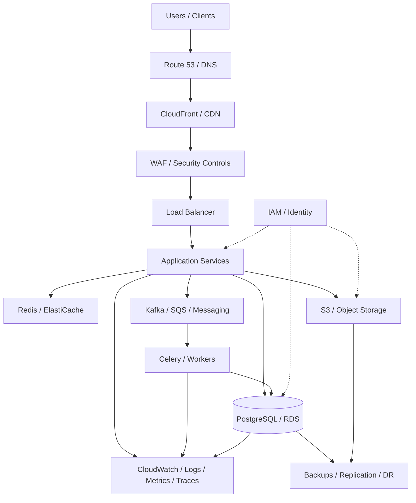
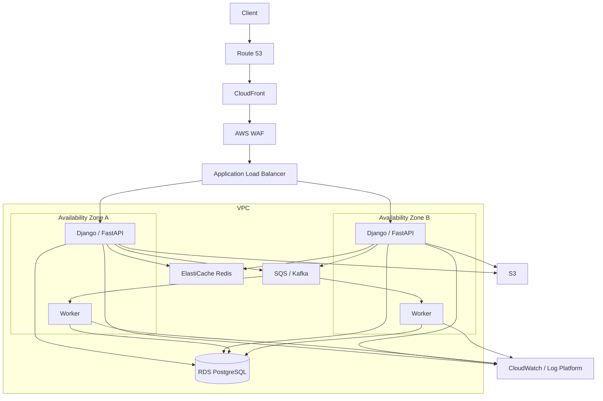

# 10- Summary

## Overview

Cloud architecture is the discipline of designing backend systems to operate reliably, securely, and efficiently on cloud infrastructure while balancing scalability, availability, performance, operational complexity, and cost.

For AWS-based systems, architecture decisions should not be driven by individual services in isolation. A production system is a collection of interacting layers:

```text
Users
  |
  v
DNS
  |
  v
CDN
  |
  v
Load Balancer
  |
  v
Application Layer
  |
  +------------------+
  |                  |
  v                  v
Cache             Database
  |
  v
Async Processing
  |
  v
Object Storage / External Services
```

The most important architectural skill is understanding the trade-offs between these components and selecting the simplest architecture that satisfies the system's requirements.

A senior engineer should be able to reason about:

- Availability
- Scalability
- Fault tolerance
- Disaster recovery
- Security
- Performance
- Observability
- Cost
- Operational complexity
- Data durability
- Deployment strategy

Cloud architecture is therefore closely connected to system design rather than being simply an exercise in selecting AWS services.

## Architectural Principles

A production cloud architecture should generally follow these principles.

| Principle | Engineering Goal |
|---|---|
| Design for failure | Assume individual components will fail |
| Horizontal scalability | Add capacity by adding instances |
| Loose coupling | Prevent failures from cascading unnecessarily |
| Stateless application layer | Allow instances to be replaced or scaled freely |
| Defense in depth | Do not rely on a single security control |
| Automation | Reduce manual operational work |
| Observability | Make system behavior measurable and diagnosable |
| Least privilege | Minimize permissions and blast radius |
| Managed services | Avoid operating infrastructure unnecessarily |
| Cost awareness | Treat infrastructure cost as an architectural constraint |

The objective is not maximum complexity or maximum availability at any cost.

The objective is an architecture whose reliability and operational characteristics are appropriate for the business requirement.

## Core Cloud Architecture Model

A useful mental model is to divide a backend architecture into layers.



Each layer solves a different problem.

| Layer | Primary Responsibility |
|---|---|
| DNS | Service discovery and routing |
| CDN | Edge caching and content delivery |
| WAF | Application-layer protection |
| Load Balancer | Traffic distribution |
| Application | Business logic |
| Cache | Reduce latency and database load |
| Database | Durable transactional state |
| Queue | Decouple asynchronous workloads |
| Workers | Background processing |
| Object Storage | Durable file/object storage |
| Observability | Monitoring and diagnosis |
| IAM | Identity and authorization |
| Backup/DR | Recovery from failures |

## AWS Architecture Decision Process

A strong architecture starts with requirements rather than AWS services.

A practical decision process is:

```text
Business Requirements
        |
        v
Functional Requirements
        |
        v
Non-Functional Requirements
        |
        +--> Availability
        +--> Latency
        +--> Throughput
        +--> Durability
        +--> Security
        +--> Compliance
        +--> Recovery
        +--> Cost
        |
        v
Architecture
        |
        v
AWS Services
        |
        v
Capacity + Failure Analysis
        |
        v
Operational Design
```

For example, before choosing Multi-Region deployment, determine:

```text
Required availability?
Required RTO?
Required RPO?
Acceptable data loss?
Expected traffic?
Geographic distribution?
Compliance requirements?
Budget?
```

Only then should the architecture be selected.

## Availability

Availability describes whether a service is operational and accessible when users need it.

A system with a single application server has a simple failure mode:

```text
Client
  |
  v
Application Server
  X
Failure
```

There is no redundant capacity.

A highly available architecture introduces redundancy:

```text
                 Load Balancer
                  /        \
                 /          \
                v            v
             AZ-A          AZ-B
             App-1         App-2
                \            /
                 \          /
                  Database
```

The important principle is:

> A component cannot provide high availability if all of its capacity exists in one failure domain.

## Multi-AZ Architecture

Availability Zones provide physically separated infrastructure within an AWS Region.

A common production architecture is:

```text
                 Application Load Balancer
                    /              \
                   /                \
                  v                  v
             Availability Zone A   Availability Zone B
                  |                    |
               App-1                App-2
                  |                    |
                  +--------+-----------+
                           |
                           v
                    Multi-AZ Database
```

Multi-AZ improves resilience against failures affecting a single Availability Zone.

It is generally appropriate for:

- Production APIs
- Transactional applications
- Databases
- Critical background workers
- Load-balanced application fleets

Multi-AZ does not automatically protect against:

- Region-wide outages
- Application-level bugs
- Data corruption
- Incorrect deployments
- Credential compromise
- Logical deletion

Those require additional controls.

## Multi-Region Architecture

Multi-Region extends resilience across AWS Regions.

A simplified architecture is:

```text
                     Global DNS / Routing
                       /             \
                      v               v
                 Region A          Region B
                    |                 |
                 App Fleet         App Fleet
                    |                 |
                 Database          Database
                    \                 /
                     \               /
                      Replication
```

Multi-Region can protect against a regional failure but introduces significantly more complexity.

Typical challenges include:

- Cross-region replication
- Data consistency
- Conflict resolution
- Traffic failover
- DNS propagation
- Deployment coordination
- Region-specific configuration
- Increased cost

Multi-Region should therefore be justified by business requirements rather than used automatically.

## Multi-AZ vs Multi-Region

| Property | Multi-AZ | Multi-Region |
|---|---|---|
| Failure protection | AZ-level | Region-level |
| Latency | Usually low | Higher for cross-region communication |
| Complexity | Moderate | High |
| Cost | Moderate | High |
| Data replication | Often managed | Usually more complex |
| Operational burden | Lower | Higher |
| Typical use | Production HA | Disaster recovery / global systems |

A common progression is:

```text
Single AZ
   |
   v
Multi-AZ
   |
   v
Multi-Region DR
   |
   v
Active-Active Multi-Region
```

Not every system needs the final stage.

## Reliability

Reliability is broader than availability.

A service may be available but still unreliable if it:

- Loses data
- Produces incorrect results
- Frequently times out
- Processes messages multiple times incorrectly
- Corrupts state
- Fails unpredictably

A reliable architecture considers:

```text
Availability
+
Durability
+
Consistency
+
Fault Isolation
+
Recovery
+
Correctness
```

## Failure Domains

Cloud systems should explicitly reason about failure domains.

Common failure domains include:

```text
Process
Container
Instance
Rack
Availability Zone
Region
Service
Account
Organization
```

The more failure domains an architecture can tolerate, the more resilient it becomes.

However, resilience generally increases cost and complexity.

A useful design question is:

> What is the largest failure this system must survive without unacceptable business impact?

## Disaster Recovery

Disaster recovery addresses recovery after a major failure.

Important metrics include:

### RTO

Recovery Time Objective defines how quickly the system must be restored.

Example:

```text
RTO = 30 minutes
```

The system must be operational again within approximately 30 minutes after a qualifying disaster.

### RPO

Recovery Point Objective defines how much data loss is acceptable.

Example:

```text
RPO = 5 minutes
```

The recovery strategy should limit data loss to approximately five minutes or less.

| Strategy | Typical Characteristics |
|---|---|
| Backup and restore | Low cost, slower recovery |
| Pilot light | Minimal critical infrastructure running |
| Warm standby | Reduced-capacity production environment |
| Active-passive | Secondary environment ready for failover |
| Active-active | Multiple regions actively serving traffic |

The correct choice depends on RTO, RPO, cost, and business criticality.

## Auto Scaling

Auto scaling allows application capacity to adapt to workload.

Without scaling:

```text
Traffic
  |
  v
Fixed Capacity
```

A traffic spike can exhaust resources.

With horizontal scaling:

```text
Traffic increases
       |
       v
Scaling Policy
       |
       +--> Instance 1
       +--> Instance 2
       +--> Instance 3
       +--> Instance 4
```

Typical scaling signals include:

- CPU utilization
- Request count
- Request latency
- Queue depth
- Application-specific metrics
- Concurrent connections

CPU alone is often insufficient.

For a Celery-based system, queue depth may be a better scaling signal than CPU:

```text
Queue depth increases
        |
        v
Add workers
        |
        v
Queue drains
        |
        v
Scale workers down
```

## Stateless Application Design

Auto scaling works best when application instances are disposable.

Avoid storing important session or business state locally:

```text
User
  |
  v
App-01
  |
  +--> Local session
```

If App-01 disappears, the state disappears.

Prefer:

```text
App-01 ----\
App-02 -----+--> Redis / Database
App-03 ----/
```

The application layer can then scale horizontally.

Common external state stores include:

- PostgreSQL
- Redis
- S3
- Managed queues

## CDN

A Content Delivery Network places cacheable content closer to users.

Without a CDN:

```text
User in Asia
    |
    v
Origin in US
```

With a CDN:

```text
User
  |
  v
Nearest Edge Location
  |
  +--> Cache HIT -> Response
  |
  +--> Cache MISS
          |
          v
        Origin
```

CDNs are especially useful for:

- Static assets
- Images
- JavaScript
- CSS
- Video
- Public API responses where caching is safe

A CDN can reduce:

- Origin traffic
- Latency
- Bandwidth consumption
- Application load

But caching introduces correctness concerns.

The most important question is:

> Can this response safely be reused by another request?

Private or user-specific data should not be accidentally cached as public content.

## Cache Design

Redis or another caching layer can reduce database load.

Typical flow:

```text
Request
  |
  v
Redis
  |
  +--> HIT --> Response
  |
  +--> MISS
         |
         v
      Database
         |
         v
      Redis SET
         |
         v
      Response
```

Caching requires explicit decisions about:

- TTL
- Cache keys
- Invalidation
- Consistency
- Memory limits
- Eviction policy
- Failure behavior

A cache should normally be treated as an optimization rather than the only copy of critical data.

## Object Storage

Object storage is appropriate for large unstructured data.

Typical examples:

- Images
- Documents
- Backups
- Videos
- Static assets
- Data exports

A common AWS architecture uses S3:

```text
Application
    |
    +--> Metadata --> PostgreSQL
    |
    +--> Object --> S3
```

The database stores metadata:

```text
file_id
owner_id
object_key
content_type
size
created_at
```

S3 stores the actual object.

This prevents large binary payloads from unnecessarily consuming database storage.

## Object Storage Security

Object storage should generally use:

- Private buckets
- IAM policies
- Encryption
- Controlled access
- Presigned URLs where appropriate
- Versioning for important data
- Lifecycle policies
- Logging and monitoring

Avoid making buckets public merely to simplify application development.

## Monitoring

A production system needs visibility into both infrastructure and application behavior.

Monitor at least:

```text
Traffic
Errors
Latency
Saturation
Availability
Dependencies
Capacity
Security events
```

The four golden signals are:

| Signal | Example |
|---|---|
| Latency | p95 = 180 ms |
| Traffic | 5,000 requests/sec |
| Errors | 1.2% HTTP 5xx |
| Saturation | CPU = 78% |

Application-specific signals are also important.

For asynchronous systems:

```text
Queue depth
Consumer lag
Task retry rate
Dead-letter count
```

For databases:

```text
Connection usage
Query latency
Replication lag
Storage utilization
Lock contention
```

## Logging

Logs provide detailed operational context.

A useful structured event may look like:

```json
{
  "timestamp": "2026-08-23T15:20:12Z",
  "level": "ERROR",
  "service": "orders-api",
  "environment": "production",
  "version": "2026.08.23.4",
  "event": "database_timeout",
  "request_id": "7f4c9d",
  "trace_id": "2c8a1f"
}
```

Good production logging requires:

- Structured fields
- Consistent event names
- Request correlation
- Trace correlation
- Secret redaction
- Appropriate retention
- Centralized collection

Logging everything is not the same as observability.

## Security Architecture

Security should be applied at multiple layers.

A practical AWS architecture may look like:

```text
Internet
   |
   v
Route 53
   |
   v
CloudFront
   |
   v
WAF
   |
   v
Load Balancer
   |
   v
Private Application Subnets
   |
   +--> Private Database
   +--> Private Redis
   +--> Private Workers
   |
   +--> S3 through controlled access
```

Important controls include:

- IAM least privilege
- Private subnets
- Security groups
- Network segmentation
- Encryption in transit
- Encryption at rest
- Secret management
- WAF protections
- Authentication
- Authorization
- Audit logging

Security should not be treated as a single firewall rule.

## Cost Architecture

Every architecture has an economic dimension.

Common cost drivers include:

```text
Compute
Storage
Database
Data transfer
NAT Gateway
Load Balancers
CDN
Logging
Monitoring
Cross-region replication
Managed services
```

A technically elegant architecture can still be a poor engineering decision if it creates unnecessary cost.

For example:

```text
Active-Active Multi-Region
```

may provide excellent resilience but can be inappropriate for a low-value internal application.

Cost optimization should consider:

```text
Cost per request
Cost per user
Cost per GB
Cost per transaction
Cost of downtime
Cost of engineering complexity
```

The cheapest infrastructure is not always the cheapest system.

## Operational Simplicity

A senior architecture decision considers operational burden.

Compare:

| Architecture | Reliability | Complexity | Cost |
|---|---:|---:|---:|
| Single instance | Low | Low | Low |
| Multi-AZ | High | Moderate | Moderate |
| Multi-Region active-passive | Very high | High | High |
| Multi-Region active-active | Very high | Very high | Very high |

The correct architecture depends on requirements.

A common mistake is optimizing for theoretical maximum availability before establishing the business requirement.

## Deployment Strategy

Cloud architecture should support safe deployment.

Common strategies include:

- Rolling deployments
- Blue-green deployments
- Canary deployments
- Feature flags

A simple rolling deployment:

```text
Version A
Version A
Version A
Version A

        |
        v

Version B
Version A
Version A
Version A

        |
        v

Version B
Version B
Version B
Version B
```

Canary deployment sends a small percentage of traffic to the new version:

```text
             Load Balancer
              /         \
             /           \
          95%             5%
           |               |
       Version A       Version B
```

Monitor:

```text
Error rate
Latency
Throughput
Business metrics
Resource usage
```

before increasing traffic.

## Infrastructure as Code

Production cloud infrastructure should be reproducible.

Instead of manually creating resources:

```text
Console
  |
  +--> Create VPC
  +--> Create subnet
  +--> Create database
  +--> Create load balancer
```

use Infrastructure as Code such as Terraform or AWS CloudFormation.

The desired model becomes:

```text
Source Control
      |
      v
Infrastructure Code
      |
      v
CI/CD
      |
      v
AWS
```

Benefits include:

- Repeatability
- Version control
- Reviewability
- Environment consistency
- Disaster recovery
- Automation

Infrastructure changes should be treated like application changes.

## Networking Architecture

A typical production VPC separates public and private resources.

```text
VPC
|
+-- Public Subnets
|     |
|     +-- Load Balancer
|     +-- NAT Gateway
|
+-- Private Application Subnets
|     |
|     +-- Django / FastAPI
|     +-- Workers
|
+-- Private Data Subnets
      |
      +-- PostgreSQL
      +-- Redis
```

Public exposure should be minimized.

A database normally should not be directly reachable from the public internet.

Traffic should follow controlled paths:

```text
Internet
   |
   v
Public Load Balancer
   |
   v
Private Application
   |
   v
Private Database
```

## Asynchronous Processing

Long-running operations should not unnecessarily block synchronous API requests.

Instead of:

```text
HTTP Request
   |
   v
Django
   |
   v
Generate large report
   |
   v
Response
```

use:

```text
HTTP Request
   |
   v
Django
   |
   v
Queue
   |
   v
Worker
   |
   v
S3
```

The API can return:

```json
{
  "job_id": "job-123",
  "status": "accepted"
}
```

The worker processes the operation asynchronously.

This improves:

- API latency
- Resilience
- Throughput
- Resource isolation

It introduces new concerns such as:

- Retries
- Idempotency
- Dead-letter queues
- Duplicate processing
- Monitoring
- Eventual consistency

## Reliability Patterns

Several patterns repeatedly appear in production systems.

### Timeout

Never allow a dependency call to wait indefinitely.

```text
Service A
   |
   | timeout=2s
   v
Service B
```

### Retry

Retries can recover from transient failures.

However, retries should use:

- Exponential backoff
- Jitter
- Maximum attempts
- Error classification

Do not retry permanent failures indefinitely.

### Circuit Breaker

A circuit breaker prevents repeated requests to an unhealthy dependency.

```text
Healthy
   |
   v
Open after failures
   |
   v
Fail fast
   |
   v
Half-open
   |
   +--> Healthy
   |
   +--> Open
```

### Idempotency

Distributed systems can deliver duplicate operations.

For payment-like operations:

```text
POST /payments
Idempotency-Key: abc123
```

The server can ensure that retrying the same operation does not create multiple payments.

### Bulkheads

Isolate resources so one workload does not exhaust everything.

For example:

```text
Critical API pool
Background worker pool
Reporting worker pool
```

A large report job should not consume every available worker required by critical transactions.

## Data Architecture

The database is usually the source of truth for transactional state.

A common architecture is:

```text
API
 |
 +--> PostgreSQL
 |
 +--> Redis
 |
 +--> Kafka / Queue
 |
 +--> S3
```

These systems have different responsibilities.

| Component | Best Used For |
|---|---|
| PostgreSQL | Transactional relational data |
| Redis | Cache / ephemeral state |
| Kafka | Durable event streaming |
| SQS | Asynchronous work queues |
| S3 | Objects and large files |

Avoid forcing every workload into the same storage technology.

## Consistency

Distributed architectures require explicit consistency decisions.

For example:

```text
PostgreSQL
    |
    v
Kafka Event
    |
    v
Search Index
```

The search index may temporarily lag behind PostgreSQL.

This is eventual consistency.

The application must determine whether that delay is acceptable.

Strong consistency is useful when incorrect or stale state is unacceptable.

Eventual consistency can provide better scalability and decoupling when temporary staleness is acceptable.

## Disaster Recovery Architecture

A robust disaster recovery design separates:

```text
Primary Environment
       |
       +--> Backups
       +--> Replication
       +--> Configuration
       +--> Infrastructure Code
       |
       v
Recovery Environment
```

Do not rely exclusively on backups that exist in the same failure domain as the primary system.

A backup is useful only if:

1. It exists.
2. It is recoverable.
3. The recovery process is understood.
4. Recovery has been tested.

Regular restore testing is more valuable than simply checking whether backups completed successfully.

## Common Architecture Mistakes

### Choosing Services Before Requirements

Starting with:

```text
"We should use Lambda, Kafka, Kubernetes, and Multi-Region."
```

without requirements often produces unnecessary complexity.

Start with:

```text
Traffic
Latency
Availability
Data
Security
RTO
RPO
Cost
```

### Treating Multi-AZ as Disaster Recovery

Multi-AZ protects primarily against Availability Zone failures.

It is not equivalent to a complete regional disaster recovery strategy.

### Making Everything Public

Putting databases, Redis, or internal services on public networks increases the attack surface.

Prefer private networking and controlled ingress.

### Using Redis as the Primary Database

Redis is excellent for caching and ephemeral state, but replacing durable transactional storage without strong justification can create durability and consistency problems.

### Ignoring Data Transfer Costs

Cross-region and cross-service data transfer can become a significant cost at scale.

Architecture diagrams should include important data flows, not only components.

### Scaling Only on CPU

A system may be CPU-light but queue-heavy.

Select scaling metrics that represent actual workload pressure.

### No Backpressure

When downstream systems slow down, upstream services can overwhelm them.

Use:

- Bounded queues
- Rate limits
- Concurrency limits
- Circuit breakers
- Load shedding

### No Failure Testing

An architecture is not proven resilient because the diagram contains redundant components.

Test:

```text
Instance failure
AZ failure
Dependency timeout
Database failover
Queue backlog
Deployment rollback
Credential failure
Region failure
```

### No Capacity Planning

Auto scaling does not eliminate capacity planning.

You still need to understand:

```text
Maximum instance count
Database limits
Connection limits
Queue throughput
Network limits
Storage growth
Cost limits
```

### Overengineering

A small application rarely needs:

```text
Active-active Multi-Region
Kubernetes
Kafka
Service mesh
Multiple caches
Complex event sourcing
```

unless its requirements justify them.

## Production Review Checklist

### Architecture

- [ ] Requirements are documented.
- [ ] Traffic and capacity assumptions are known.
- [ ] Failure domains are identified.
- [ ] Critical dependencies are mapped.
- [ ] Single points of failure are understood.
- [ ] Data flows are documented.

### Availability

- [ ] Production workloads span multiple AZs where appropriate.
- [ ] Application instances are horizontally scalable.
- [ ] Load balancing is configured.
- [ ] Database availability requirements are satisfied.
- [ ] Health checks are meaningful.

### Disaster Recovery

- [ ] RTO is defined.
- [ ] RPO is defined.
- [ ] Backups are automated.
- [ ] Backups are appropriately isolated.
- [ ] Restore procedures are documented.
- [ ] Recovery is tested.
- [ ] Multi-Region strategy is justified where required.

### Security

- [ ] IAM follows least privilege.
- [ ] Databases are private.
- [ ] Secrets are not hard-coded.
- [ ] Encryption is enabled.
- [ ] Security groups are restrictive.
- [ ] Application-layer protection is configured.
- [ ] Audit logging exists where required.

### Scalability

- [ ] Stateless services can scale horizontally.
- [ ] Auto scaling policies are defined.
- [ ] Database capacity is monitored.
- [ ] Cache capacity is monitored.
- [ ] Queue depth is monitored.
- [ ] Rate limits exist where required.

### Observability

- [ ] Metrics are collected.
- [ ] Structured logs are centralized.
- [ ] Distributed tracing is available where useful.
- [ ] Request correlation exists.
- [ ] Alerts are actionable.
- [ ] Dashboards represent user-impacting signals.

### Operations

- [ ] Infrastructure is managed as code.
- [ ] Deployments are automated.
- [ ] Rollbacks are tested.
- [ ] Runbooks exist for critical failures.
- [ ] Cost is monitored.
- [ ] Capacity limits are known.

## Architecture Decision Matrix

The following matrix provides a practical way to reason about common architectural choices.

| Requirement | Typical Choice |
|---|---|
| Static global content | CDN |
| Public API entry point | Load Balancer / API Gateway |
| High application availability | Multi-AZ |
| Regional disaster tolerance | Multi-Region DR |
| Variable traffic | Auto Scaling |
| Session/cache acceleration | Redis |
| Relational transactions | PostgreSQL / RDS |
| Large binary files | S3 |
| Background processing | Queue + Workers |
| Event streaming | Kafka |
| Infrastructure automation | Terraform / CloudFormation |
| Centralized diagnostics | CloudWatch / centralized logging |
| Global DNS routing | Route 53 |
| Application-layer filtering | WAF |

These are starting points rather than universal rules.

## A Practical AWS Backend Architecture

For a production Django or FastAPI backend, a reasonable baseline architecture could be:



This architecture provides a useful baseline for many production APIs while preserving the ability to evolve individual components independently.

## Interview-Level Architecture Reasoning

When designing a cloud system during an interview, avoid immediately listing AWS services.

Start by establishing:

```text
1. Functional requirements
2. Traffic assumptions
3. Latency requirements
4. Availability requirements
5. Data requirements
6. Security requirements
7. RTO / RPO
8. Cost constraints
```

Then derive the architecture.

For example:

```text
High traffic
    |
    v
Load Balancing + Auto Scaling

Low latency
    |
    v
Caching + CDN

High availability
    |
    v
Multi-AZ

Long-running workloads
    |
    v
Queue + Workers

Large files
    |
    v
Object Storage

Regional disaster requirement
    |
    v
Multi-Region DR
```

This demonstrates engineering reasoning rather than service memorization.

## Final Architecture Checklist

Before considering a cloud architecture production-ready, ask:

```text
Can it survive an instance failure?
Can it survive an AZ failure?
What happens if the database becomes unavailable?
What happens if Redis fails?
What happens if the queue grows indefinitely?
What happens if an external dependency times out?
Can the application scale horizontally?
Can deployments be rolled back?
Can data be recovered?
Can engineers diagnose incidents?
Can credentials be rotated?
Can infrastructure be recreated?
Can the system survive the defined disaster scenario?
Is the architecture economically justified?
```

If these questions cannot be answered, the architecture is not yet fully designed.

## Key Takeaways

- **Start cloud architecture from workload, availability, security, data, recovery, and cost requirements rather than from AWS service selection.**
- **Use redundancy deliberately: Multi-AZ is a common high-availability baseline, while Multi-Region should be justified by regional failure, latency, or disaster-recovery requirements.**
- **Design application services to be stateless and horizontally scalable, while assigning durable state to appropriate systems such as PostgreSQL, S3, queues, and managed data services.**
- **Treat observability, security, disaster recovery, infrastructure automation, and operational procedures as first-class architecture components rather than afterthoughts.**
- **Prefer the simplest architecture that satisfies the required reliability and scalability targets; additional infrastructure is valuable only when its operational and business benefits justify its complexity and cost.**