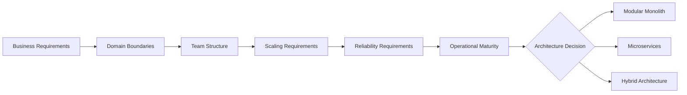
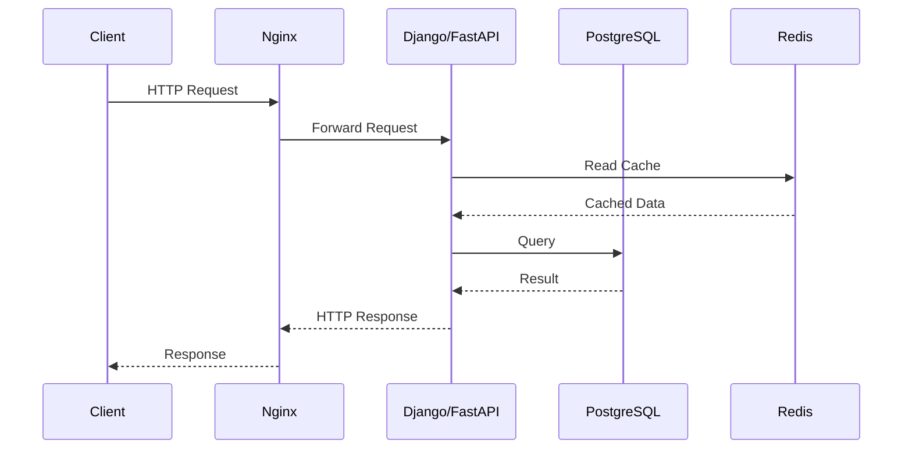
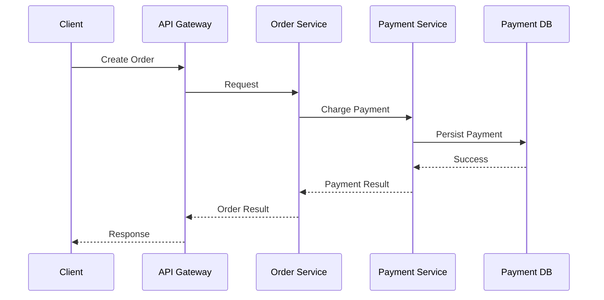
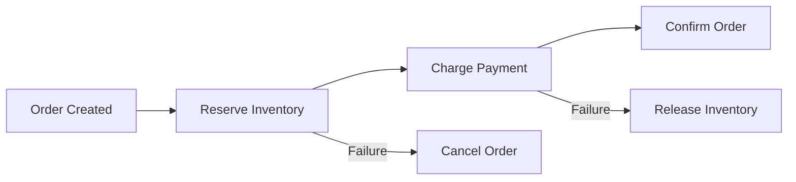

# 01- Monolith vs Microservices

## Overview

Choosing between a monolith and microservices is an architectural decision about **deployment boundaries, ownership, scaling, failure isolation, and operational complexity**.

A monolith packages multiple business capabilities into a single deployable application. Microservices split those capabilities into independently deployable services that communicate over explicit network boundaries.

Neither architecture is inherently superior. The correct choice depends on team structure, domain boundaries, scaling requirements, reliability requirements, deployment independence, and organizational maturity.

A common production mistake is treating microservices as the default destination for every backend system. For many teams, a well-structured modular monolith provides better development velocity, lower operational overhead, and simpler data consistency while preserving a clean path toward future service extraction.

---

## The Architectural Decision

At a high level:



The decision should answer:

- Does the system require independent deployment of business capabilities?
- Do different components have substantially different scaling characteristics?
- Can teams own services independently?
- Are domain boundaries well understood?
- Can the organization operate distributed systems reliably?
- Is network-level failure isolation worth the additional complexity?
- Does the business justify the operational and infrastructure cost?

Architecture should follow these requirements rather than organizational fashion.

---

## Monolith

### What It Is

A monolith is an application where multiple business capabilities are packaged and deployed as a single application unit.

A typical Django monolith might contain:

```text
Django Application
├── users
├── authentication
├── products
├── orders
├── payments
├── notifications
└── reporting
```

The application can still be internally modular. A monolith does **not** have to mean poorly structured code.

A production-quality monolith should establish clear internal boundaries even though the components share a process, deployment unit, and often a database.

### Why It Exists

A monolith minimizes distributed-system overhead.

Communication between modules can happen through:

- Python function calls
- service classes
- domain events
- database transactions
- internal application interfaces

There is no network hop between modules.

This makes monoliths particularly effective when:

- the product is early-stage
- the domain is still changing
- the team is small
- transactional consistency is important
- independent scaling is not yet necessary
- operational simplicity is a priority

### Modular Monolith

A modular monolith is substantially different from an unstructured monolith.

A useful structure for Django might look like:

```text
src/
├── users/
│   ├── domain/
│   ├── application/
│   ├── infrastructure/
│   └── api/
├── orders/
│   ├── domain/
│   ├── application/
│   ├── infrastructure/
│   └── api/
├── payments/
│   ├── domain/
│   ├── application/
│   ├── infrastructure/
│   └── api/
└── notifications/
    ├── domain/
    ├── application/
    ├── infrastructure/
    └── api/
```

The deployment unit remains one application, but the internal architecture enforces boundaries.

This provides an important migration advantage: a well-designed module can later become a service without first untangling a large amount of shared business logic.

---

## Microservices

### What It Is

Microservices architecture decomposes a system into independently deployable services organized around business capabilities.

For example:

```text
                         ┌───────────────┐
                         │ API Gateway   │
                         └───────┬───────┘
                                 |
          ┌──────────────────────┼──────────────────────┐
          |                      |                      |
          v                      v                      v
   ┌────────────┐         ┌────────────┐         ┌────────────┐
   │ User       │         │ Order      │         │ Payment    │
   │ Service    │         │ Service    │         │ Service    │
   └─────┬──────┘         └─────┬──────┘         └─────┬──────┘
         |                      |                      |
         v                      v                      v
   PostgreSQL             PostgreSQL             PostgreSQL
```

Each service typically owns:

- its application code
- its deployment lifecycle
- its runtime
- its API
- its operational responsibility
- its data ownership

The services communicate using mechanisms such as:

- REST
- gRPC
- Kafka
- other asynchronous messaging systems

### Why It Exists

Microservices solve problems that become difficult to handle with a single deployment unit.

Typical drivers include:

- independent scaling
- independent deployment
- organizational team boundaries
- failure isolation
- technology isolation
- independently evolving business domains
- workload-specific infrastructure requirements

For example, an image-processing service may require CPU-intensive workers while an API service primarily requires network capacity. Separating them allows each workload to scale independently.

---

## Monolith vs Microservices

| Dimension | Monolith | Microservices |
|---|---|---|
| Deployment | Single deployment unit | Multiple independent deployments |
| Network communication | Usually internal calls | REST/gRPC/events |
| Database | Often shared | Prefer service-owned data |
| Operational complexity | Lower | Higher |
| Development complexity | Lower initially | Higher |
| Scaling | Usually application-wide | Per service |
| Failure isolation | Lower | Potentially higher |
| Transaction management | Easier | Distributed transactions are difficult |
| Debugging | Simpler | Distributed tracing required |
| Infrastructure | Simpler | More infrastructure |
| Team autonomy | Lower at large scale | Higher |
| Technology diversity | Limited | Easier |
| Deployment independence | Limited | Strong |
| Local development | Usually easier | More difficult |
| Network failures | Less relevant internally | Fundamental concern |
| Observability requirements | Moderate | High |
| Cost | Usually lower | Usually higher |

---

## The Most Important Trade-Off

The fundamental trade-off is:

```text
Monolith
    |
    | Less operational complexity
    | Less network overhead
    | Easier transactions
    | Easier debugging
    v
Development simplicity

Microservices
    |
    | Independent deployment
    | Independent scaling
    | Failure isolation
    | Team autonomy
    v
Operational flexibility
```

Microservices do not remove complexity.

They **move complexity from inside the application into the distributed system**.

A function call:

```python
payment_service.charge(order)
```

can become:

```text
HTTP/gRPC request
      |
      v
Service discovery
      |
      v
Network
      |
      v
Load balancer
      |
      v
Payment service
      |
      v
Database
      |
      v
Response
```

Now additional failure modes exist:

- connection timeout
- DNS failure
- service unavailable
- retry storms
- partial failure
- serialization errors
- network latency
- duplicate requests
- inconsistent state
- distributed tracing requirements

This is one of the most important architectural distinctions to understand.

---

## Request Lifecycle

### Monolith



Communication between application components occurs within the same process.

### Microservices



The second architecture introduces network boundaries and therefore distributed failure modes.

---

## Data Ownership

Data ownership is one of the most important differences between a monolith and microservices.

### Monolith

A monolith commonly uses one PostgreSQL database:

```text
Application
    |
    v
PostgreSQL
├── users
├── orders
├── payments
└── products
```

Cross-table transactions are straightforward:

```sql
BEGIN;

INSERT INTO orders (...);
INSERT INTO order_items (...);
UPDATE inventory SET quantity = quantity - 1;

COMMIT;
```

### Microservices

A stronger microservice architecture typically uses service-owned data:

```text
User Service  ──> User DB
Order Service ──> Order DB
Payment Service ──> Payment DB
Inventory Service ──> Inventory DB
```

Services should not directly query another service's database.

Instead:

```text
Order Service
      |
      | API / Event
      v
Payment Service
      |
      v
Payment Database
```

This creates ownership boundaries but makes cross-service consistency more difficult.

---

## Shared Database vs Database per Service

| Approach | Advantages | Problems |
|---|---|---|
| Shared database | Easy joins and transactions | Strong coupling |
| Schema per service | Some logical isolation | Still shares infrastructure |
| Database per service | Strong ownership | Operational complexity |
| Database cluster per service | Strong isolation | Higher cost and administration |

Database-per-service should not be adopted mechanically.

A small organization may gain little from operating many independent database clusters.

The architectural goal is **data ownership**, not maximizing the number of databases.

---

## Distributed Transactions

A monolith can often perform:

```text
Create Order
    |
    +-- Create Order Record
    +-- Reserve Inventory
    +-- Create Payment Record
    |
    v
COMMIT
```

Microservices cannot normally wrap independent databases in one ordinary ACID transaction.

Instead, distributed workflows may use:

- Saga patterns
- transactional outbox
- idempotent consumers
- compensating actions
- asynchronous events

For example:



The system becomes eventually consistent.

That is not automatically bad, but it must be explicitly designed and understood by the business.

---

## Synchronous vs Asynchronous Communication

### REST

REST is appropriate when the caller requires an immediate response.

```text
Order Service
     |
     | POST /payments
     v
Payment Service
     |
     v
Immediate response
```

Advantages:

- simple mental model
- easy debugging
- widely supported
- suitable for request/response workflows

Limitations:

- temporal coupling
- network dependency
- request latency
- cascading failures

### gRPC

gRPC is useful for internal service-to-service communication where strongly typed contracts and efficient binary serialization are valuable.

```text
Order Service
      |
      | gRPC
      v
Payment Service
```

It is particularly useful for:

- internal APIs
- low-latency communication
- strongly typed contracts
- high-throughput service communication

### Kafka

Kafka is useful when producers and consumers should be decoupled.

```text
Order Service
      |
      v
Kafka Topic
      |
      +----> Inventory Service
      |
      +----> Notification Service
      |
      +----> Analytics Service
```

The producer does not need every consumer to be available at request time.

However, asynchronous communication introduces:

- eventual consistency
- duplicate delivery handling
- consumer lag
- ordering considerations
- replay semantics
- schema evolution

---

## Service Boundaries

A poor microservice architecture may produce:

```text
User Service
Order Service
Product Service
Payment Service
Notification Service
Inventory Service
```

simply because the database contains six major tables.

That is not sufficient reasoning.

Service boundaries should generally follow **business capabilities and ownership boundaries**, not arbitrary CRUD entities.

A useful question is:

> "Can this capability evolve, scale, deploy, and be owned independently?"

If the answer is consistently no, splitting it may create unnecessary distributed complexity.

---

## When a Monolith Is the Better Choice

Prefer a monolith when:

- the product is early-stage
- domain boundaries are still evolving
- the team is small
- deployment independence is not required
- operational expertise is limited
- traffic does not require independent scaling
- strong transactional consistency is important
- infrastructure cost must remain low

A modular Django application is often an excellent choice:

```text
Django
├── Users
├── Orders
├── Payments
├── Inventory
└── Notifications
        |
        v
   PostgreSQL
        |
        +---- Redis
        |
        +---- Celery
```

This architecture can handle substantial production traffic when properly designed.

---

## When Microservices Become Justified

Microservices become more compelling when several of these conditions exist:

| Driver | Example |
|---|---|
| Independent scaling | Search requires 10x compute compared with the API |
| Independent deployment | Payment changes must deploy separately |
| Team autonomy | Multiple teams own separate domains |
| Failure isolation | Recommendation failures must not affect checkout |
| Different workloads | Video processing vs API requests |
| Different technology requirements | Python API plus specialized processing service |
| Organizational scale | Many teams require independent ownership |
| Compliance boundaries | Payment processing requires stronger isolation |

The key is that **multiple drivers should normally exist** before introducing substantial service decomposition.

---

## Migration Strategy

Moving directly from a monolith to dozens of microservices is usually risky.

A safer approach is incremental extraction.


### Step 1: Modularize the Monolith

Establish explicit internal boundaries first.

```text
orders/
payments/
inventory/
users/
```

Prevent arbitrary cross-module access.

### Step 2: Identify Extraction Candidates

Good candidates often have:

- clear ownership
- stable interfaces
- independent scaling requirements
- independent deployment requirements
- minimal transactional coupling

### Step 3: Extract the Service

Move the capability behind an API or event interface.

```text
Before:

Order Module -> Payment Module

After:

Order Service -> Payment API
```

### Step 4: Establish Data Ownership

Move data ownership gradually rather than immediately attempting a complete database migration.

### Step 5: Introduce Observability

Before increasing service count, establish:

- centralized logging
- metrics
- distributed tracing
- request IDs
- service-level dashboards
- alerting

Without observability, microservice failures become significantly harder to diagnose.

---

## Strangler Pattern

The Strangler Fig pattern allows a new service to gradually replace functionality in a monolith.

```text
                    ┌───────────────┐
                    │ API Gateway   │
                    └───────┬───────┘
                            |
                  ┌─────────┴─────────┐
                  |                   |
                  v                   v
          New Payment Service      Monolith
                  |                   |
                  v                   v
            Payment DB          Legacy Modules
```

Traffic can gradually move:

```text
100% Monolith
      |
      v
90% Monolith / 10% Service
      |
      v
50% Monolith / 50% Service
      |
      v
10% Monolith / 90% Service
      |
      v
100% Service
```

This reduces migration risk and allows production validation at each stage.

---

## Operational Complexity

A monolith might require:

```text
Load Balancer
      |
      v
Django
      |
      +--> PostgreSQL
      +--> Redis
```

A microservice system might require:

```text
Load Balancer
      |
      v
API Gateway
      |
      +--> User Service
      +--> Order Service
      +--> Payment Service
      +--> Inventory Service
      +--> Notification Service
               |
               +--> Kafka
               +--> Redis
               +--> Multiple Databases
               +--> Observability Stack
```

The number of operational concerns increases substantially.

You may now need:

- service discovery
- API gateways
- container orchestration
- Kubernetes
- centralized logging
- distributed tracing
- metrics
- secret management
- service-to-service authentication
- certificate management
- deployment orchestration
- schema management
- event management
- retry policies
- circuit breakers
- dead-letter queues

Microservices therefore require a corresponding increase in engineering maturity.

---

## Scalability

### Monolith Scaling

The simplest scaling model is horizontal scaling:

```text
                  Load Balancer
                 /      |      \
                v       v       v
             App-1   App-2   App-3
                \       |       /
                 \      |      /
                    PostgreSQL
```

Every application instance receives the same code and typically scales together.

This is often sufficient.

### Microservice Scaling

Different services can scale independently:

```text
                   Load Balancer
                        |
          ┌─────────────┼─────────────┐
          v             v             v
      API Service   Search Service   Worker
       3 pods          20 pods        50 pods
```

This is valuable when workloads have very different resource profiles.

For example:

- API: CPU-light, network-heavy
- Search: memory-heavy
- Image processing: CPU-heavy
- Kafka consumers: throughput-sensitive

---

## Failure Isolation

Microservices can improve failure isolation, but only if dependencies are designed correctly.

Bad architecture:

```text
Order
  |
  v
Payment
  |
  v
Inventory
  |
  v
Notification
```

A failure in one dependency can cascade through the entire request path.

Better:

```text
Order
  |
  +----> Payment
  |
  +----> Inventory
  |
  +----> Kafka
             |
             +----> Notification
```

Asynchronous processing can remove unnecessary synchronous dependencies.

Use:

- timeouts
- bounded retries
- exponential backoff
- circuit breakers where appropriate
- bulkheads
- idempotency
- queues
- graceful degradation

Do not use retries as a substitute for reliability engineering.

---

## Database Considerations

### Monolith

Advantages:

- ACID transactions
- joins
- foreign keys
- simple migrations
- simpler reporting

Risks:

- schema becomes highly coupled
- one database can become a bottleneck
- scaling is often more difficult

### Microservices

Advantages:

- independent ownership
- independent scaling
- service-specific schema design
- reduced coupling

Risks:

- eventual consistency
- duplicated data
- distributed transactions
- more migrations
- more databases to operate
- cross-service reporting complexity

A common production pattern is:

```text
Service Database
      |
      v
Outbox
      |
      v
Kafka
      |
      +----> Analytics
      +----> Search Index
      +----> Reporting
```

This avoids allowing analytics workloads to directly couple to transactional databases.

---

## Deployment

### Monolith

A typical CI/CD pipeline:

```text
Git Push
   |
   v
CI Tests
   |
   v
Build Docker Image
   |
   v
Deploy
   |
   v
Application Fleet
```

### Microservices

```text
Git Push
   |
   v
Service CI
   |
   v
Service Image
   |
   v
Container Registry
   |
   v
Kubernetes
   |
   +--> User
   +--> Order
   +--> Payment
   +--> Inventory
```

Microservices increase deployment independence but also increase release-management complexity.

Each service should ideally have:

- automated tests
- independent CI/CD
- versioned contracts
- health checks
- rollback capability
- deployment metrics
- ownership information

---

## Security

A monolith has fewer network boundaries:

```text
Client -> Application -> Database
```

Microservices create many internal trust boundaries:

```text
Client
  |
  v
Gateway
  |
  +--> Service A
  |      |
  |      v
  |     DB
  |
  +--> Service B
         |
         v
        DB
```

Do not assume that internal traffic is automatically trusted.

Production systems should consider:

- TLS for service-to-service communication where appropriate
- workload identity
- IAM roles
- short-lived credentials
- network policies
- least-privilege database access
- API authentication
- authorization
- secret management
- audit logging

On AWS, service identities should generally use IAM roles rather than embedding long-lived access keys in containers.

---

## Observability

Microservices make observability a first-class requirement.

At minimum, collect:

### Metrics

- request rate
- error rate
- latency
- saturation
- CPU
- memory
- database connections
- queue depth
- Kafka consumer lag

### Logs

Use structured JSON logs:

```json
{
  "timestamp": "2026-08-23T12:30:45Z",
  "level": "INFO",
  "service": "order-service",
  "request_id": "req-7f9a",
  "trace_id": "trace-19ab",
  "event": "order_created",
  "order_id": "ord-12345"
}
```

### Traces

A distributed request should be traceable across services:

```text
API Gateway
    |
    +-- Order Service
            |
            +-- Payment Service
            |
            +-- Inventory Service
```

Without correlation IDs and distributed tracing, debugging this workflow becomes unnecessarily difficult.

---

## Cost Considerations

Microservices typically increase infrastructure cost because they introduce:

- more compute workloads
- more load balancers
- more databases
- more network traffic
- more observability infrastructure
- more storage
- more CI/CD pipelines
- potentially higher Kubernetes overhead

A small application running as:

```text
ALB
 |
ECS/Django
 |
RDS PostgreSQL
```

may be substantially cheaper and easier to operate than a Kubernetes-based microservice platform.

Cost should therefore be evaluated as part of the architecture decision rather than after implementation.

---

## Common Mistakes

### Splitting Every Domain Into a Service

Creating a service for every database table produces excessive network communication and operational overhead.

**Better:** identify meaningful business capabilities and ownership boundaries.

### Sharing One Database Across All Services

This creates distributed services with centralized data coupling.

```text
Service A ─┐
Service B ─┼──> Same Database
Service C ─┘
```

Service A can now break Service B's assumptions by changing the schema.

**Better:** establish clear data ownership.

### Introducing Microservices Too Early

A small team may spend more time operating infrastructure than building the product.

**Better:** start with a modular monolith unless strong requirements justify decomposition.

### Synchronous Calls Everywhere

This creates long dependency chains:

```text
A -> B -> C -> D -> E
```

A failure or latency spike in E can affect A.

**Better:** use asynchronous events where immediate responses are not required.

### Ignoring Distributed Transactions

Assuming database transactions work across services is incorrect.

**Better:** design explicit Saga, outbox, idempotency, and compensation mechanisms where required.

### No Observability

If every service has independent logs and metrics but there is no correlation mechanism, debugging becomes difficult.

**Better:** establish centralized logs, metrics, traces, and correlation IDs before the service count becomes large.

### Treating Kubernetes as a Requirement

Kubernetes can solve important orchestration problems, but it also adds substantial operational complexity.

**Better:** select the orchestration platform based on actual operational requirements.

---

## Production Decision Matrix

| Requirement | Recommended Direction |
|---|---|
| Small team | Monolith |
| Early-stage product | Modular monolith |
| Rapidly changing domain | Monolith |
| Strong transactional consistency | Monolith |
| Limited DevOps maturity | Monolith |
| Independent scaling required | Microservices |
| Multiple autonomous teams | Microservices |
| Strong failure isolation required | Microservices |
| Highly different workloads | Microservices |
| Independent release cadence | Microservices |
| Mature platform engineering | Microservices becomes more viable |
| Existing well-structured monolith | Extract selectively |
| Unclear domain boundaries | Do not rush into microservices |

---

## Interview Traps

### "Microservices are More Scalable"

Not necessarily.

A monolith can horizontally scale across many instances. Microservices primarily provide **independent scaling**, allowing different components to scale differently.

### "Microservices Improve Availability"

They can improve fault isolation, but they can also introduce additional failure modes.

A badly designed microservice system can be less reliable than a well-designed monolith.

### "Every Service Needs Its Own Database"

The important principle is **data ownership**, not an arbitrary database-per-service rule.

### "Microservices Mean One Service Per Team"

Teams and services should align where practical, but organizational structure alone does not determine good service boundaries.

### "You Cannot Build a Large System as a Monolith"

Large systems can remain monolithic for a long time if the architecture is modular, horizontally scalable, and operationally well designed.

---

## Practical Architecture Recommendation

For a typical Python backend team, a pragmatic progression is:

```text
Stage 1
Django / FastAPI
      |
      v
PostgreSQL
      |
      +--> Redis
      +--> Celery

Stage 2
Modular Monolith
      |
      +--> Clear domain boundaries
      +--> Internal service interfaces
      +--> Domain events

Stage 3
Selective Extraction
      |
      +--> High-scale capability
      +--> Independent deployment
      +--> Independent failure domain

Stage 4
Microservices
      |
      +--> REST / gRPC
      +--> Kafka
      +--> Service-owned data
      +--> Container orchestration
      +--> Distributed observability
```

This approach preserves simplicity until complexity is justified.

---

## Architecture Review Checklist

Before choosing microservices, verify:

- [ ] Business domains have meaningful boundaries.
- [ ] Service ownership can be assigned to teams.
- [ ] Independent deployment provides real business value.
- [ ] At least some workloads require independent scaling.
- [ ] Data ownership can be established.
- [ ] Cross-service consistency requirements are understood.
- [ ] REST/gRPC/event contracts can be versioned.
- [ ] Idempotency is designed for retryable operations.
- [ ] Timeouts and retry policies are defined.
- [ ] Centralized logging exists.
- [ ] Metrics and alerting exist.
- [ ] Distributed tracing is available.
- [ ] CI/CD can independently deploy services.
- [ ] Security boundaries are explicitly defined.
- [ ] Infrastructure and operational costs are understood.
- [ ] The team can operate the resulting distributed system.

If most answers are "no", a modular monolith is usually the safer architectural choice.

## Key Takeaways

- **Choose monoliths or microservices based on business, scaling, ownership, reliability, and operational requirements—not architectural fashion.**
- **A modular monolith is often the best starting point because it preserves development simplicity while establishing boundaries for future extraction.**
- **Microservices provide independent deployment, scaling, and failure isolation at the cost of distributed-system complexity.**
- **Service-owned data, explicit contracts, idempotency, observability, and failure handling are essential for production microservices.**
- **Extract services incrementally when a concrete business or technical requirement justifies the additional operational complexity.**