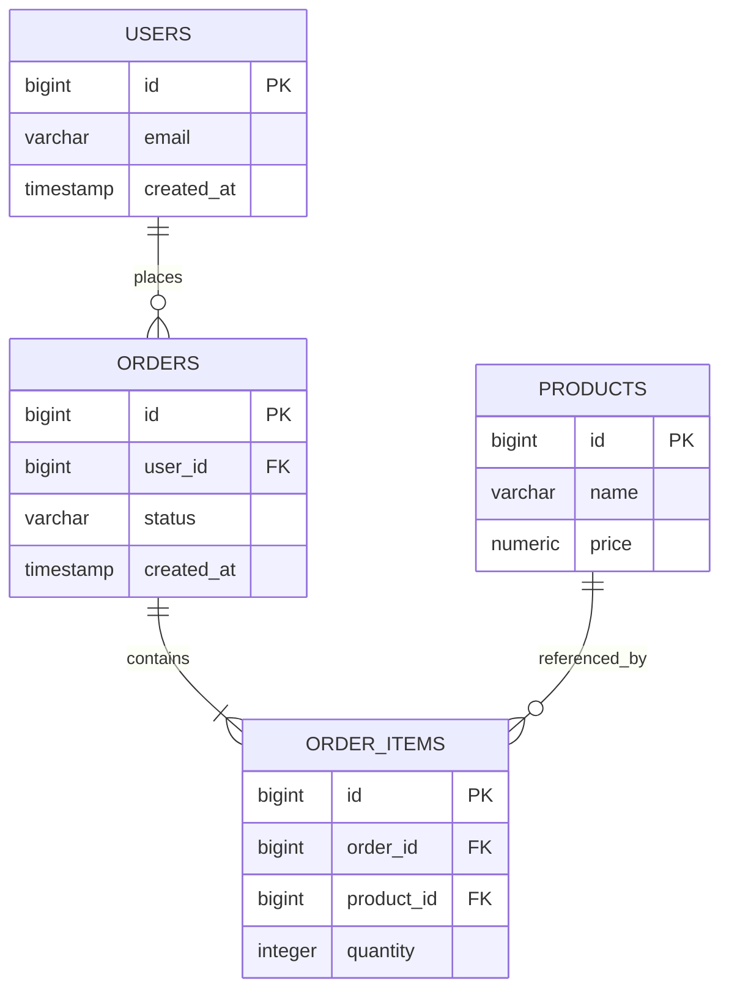
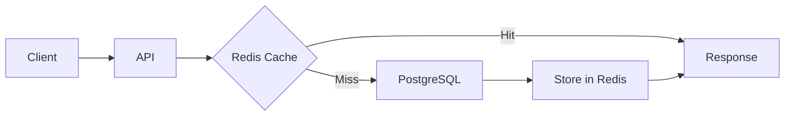
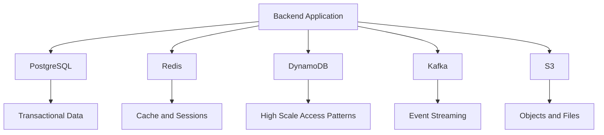
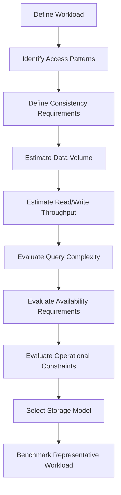
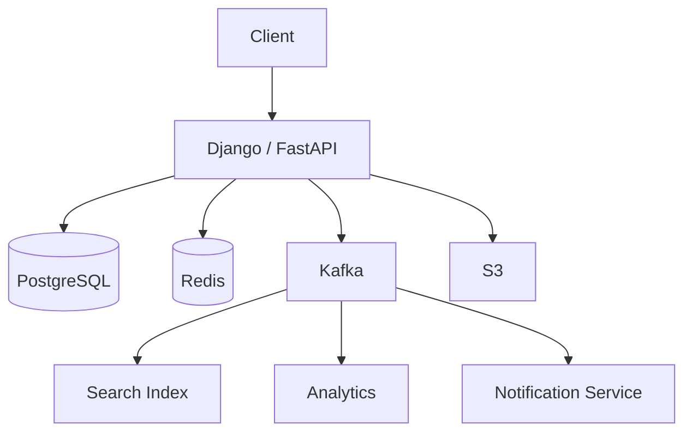

# 02- SQL vs NoSQL

## Overview

Choosing between SQL and NoSQL is fundamentally a decision about **data model, consistency requirements, access patterns, scalability, operational complexity, and failure behavior**.

SQL databases are relational systems built around structured schemas, relationships, transactions, and declarative queries. PostgreSQL and MySQL are common examples.

NoSQL is a broader category covering several non-relational models, including:

- Key-value stores
- Document databases
- Wide-column databases
- Graph databases

Examples include Redis, DynamoDB, MongoDB, and Cassandra.

The architectural mistake is treating the decision as:

```text
SQL = small systems
NoSQL = large systems
```

That is incorrect.

Large-scale systems frequently use SQL databases, while NoSQL systems can be the wrong choice for workloads that require strong relational integrity or complex transactional queries.

The correct question is:

> **Which data model and consistency model best match the application's access patterns and business requirements?**

---

## SQL Databases

### What It Is

SQL databases store data using relational structures such as:

- tables
- rows
- columns
- primary keys
- foreign keys
- indexes
- constraints

A simplified e-commerce model might look like:

```text
users
├── id
├── email
└── created_at

orders
├── id
├── user_id
├── status
└── created_at

order_items
├── id
├── order_id
├── product_id
└── quantity
```

Relationships are explicitly represented:

```text
users
  |
  | 1:N
  v
orders
  |
  | 1:N
  v
order_items
```

PostgreSQL and MySQL are common choices for transactional backend systems.

### Why SQL Exists

SQL databases are particularly strong when the system requires:

- structured data
- relationships
- transactions
- constraints
- referential integrity
- complex queries
- aggregations
- joins
- predictable consistency

A Django application using PostgreSQL is a strong default architecture for many business applications.

---

## Relational Data Model

Consider an order system:



The relational model prevents invalid relationships through constraints.

For example:

```sql
CREATE TABLE orders (
    id BIGSERIAL PRIMARY KEY,
    user_id BIGINT NOT NULL REFERENCES users(id),
    status VARCHAR(32) NOT NULL,
    created_at TIMESTAMPTZ NOT NULL DEFAULT now()
);
```

The foreign key ensures that an order cannot reference a nonexistent user.

---

## Transactions and ACID

SQL databases are particularly useful when operations must behave as one logical unit.

ACID represents:

| Property | Meaning |
|---|---|
| Atomicity | All operations in a transaction succeed or the transaction rolls back |
| Consistency | Database constraints remain valid |
| Isolation | Concurrent transactions are isolated according to the isolation level |
| Durability | Committed data survives appropriate failures |

For example:

```sql
BEGIN;

UPDATE inventory
SET quantity = quantity - 1
WHERE product_id = 100
  AND quantity > 0;

INSERT INTO orders (user_id, status)
VALUES (42, 'confirmed');

COMMIT;
```

If the transaction fails before commit, the database can roll back the changes.

This behavior is critical for workloads such as:

- payments
- inventory
- financial records
- order processing
- account balances
- booking systems

---

## SQL Strengths

SQL databases provide several important advantages.

### Strong Consistency

Transactions and constraints make it easier to maintain correct state.

### Rich Query Capabilities

SQL supports:

- joins
- grouping
- aggregation
- window functions
- subqueries
- CTEs
- sorting
- filtering

For example:

```sql
SELECT
    u.id,
    u.email,
    COUNT(o.id) AS order_count
FROM users u
LEFT JOIN orders o
    ON o.user_id = u.id
GROUP BY u.id, u.email
ORDER BY order_count DESC;
```

### Data Integrity

Constraints can enforce business invariants:

```sql
UNIQUE
NOT NULL
CHECK
PRIMARY KEY
FOREIGN KEY
```

### Mature Tooling

SQL ecosystems provide mature:

- backup tools
- migration frameworks
- monitoring
- replication
- query analyzers
- ORMs
- operational practices

---

## SQL Limitations

SQL is not universally optimal.

Potential limitations include:

- horizontal scaling can be complex
- schema changes require planning
- joins can become expensive at large scale
- relational models can be awkward for highly variable data
- distributed transactions become difficult across multiple database instances

These limitations do not mean SQL cannot scale.

PostgreSQL can support very large production workloads when combined with:

- indexing
- partitioning
- read replicas
- connection pooling
- caching
- query optimization
- horizontal application scaling

---

## NoSQL Databases

### What It Is

NoSQL describes multiple non-relational database models.

The major categories are:

| Model | Typical Database | Common Use |
|---|---|---|
| Key-value | Redis | Cache, sessions, counters |
| Document | MongoDB | Flexible application documents |
| Wide-column | Cassandra | Massive distributed workloads |
| Key-value/document | DynamoDB | High-scale AWS applications |
| Graph | Neo4j | Relationship-heavy graph workloads |

"NoSQL" therefore does not describe one specific architecture.

---

## Key-Value Databases

A key-value database maps a key directly to a value.

```text
user:42:profile
        |
        v
{"name": "Alice", "plan": "pro"}
```

Redis is commonly used this way.

Example:

```python
import redis

client = redis.Redis(
    host="redis",
    port=6379,
    decode_responses=True,
)

client.setex(
    "user:42:profile",
    300,
    '{"name":"Alice","plan":"pro"}',
)

profile = client.get("user:42:profile")
```

Key-value databases are excellent for:

- caching
- sessions
- rate limiting
- counters
- ephemeral state
- distributed locks where appropriate

They are generally not a replacement for PostgreSQL simply because they are fast.

---

## Document Databases

Document databases store records as documents.

A document might look like:

```json
{
  "id": "order-123",
  "customer_id": "user-42",
  "status": "confirmed",
  "items": [
    {
      "product_id": "product-10",
      "quantity": 2,
      "price": 49.99
    },
    {
      "product_id": "product-20",
      "quantity": 1,
      "price": 19.99
    }
  ]
}
```

This can be convenient when an application's access patterns naturally retrieve the entire document.

Advantages include:

- flexible schema
- natural hierarchical representation
- fewer joins for certain access patterns
- easy serialization to application objects

Limitations include:

- duplicated data
- more complicated consistency across documents
- potentially inefficient cross-document queries
- weaker relational guarantees depending on the database

---

## DynamoDB

Amazon DynamoDB is a managed NoSQL database designed around predictable access patterns and horizontal scalability.

A typical design starts from queries rather than tables.

For example:

```text
Access Pattern:

Get all orders for a customer
    |
    v
PK = CUSTOMER#42
SK begins_with ORDER#
```

A DynamoDB table might use:

```text
PK                  SK
-------------------------------------
CUSTOMER#42         ORDER#1001
CUSTOMER#42         ORDER#1002
CUSTOMER#99         ORDER#2001
```

This differs substantially from relational database design.

With PostgreSQL, engineers might begin with normalized entities and derive queries.

With DynamoDB, engineers should generally begin with:

1. access patterns
2. partition key design
3. sort key design
4. secondary indexes
5. capacity requirements

This is one of the most important conceptual differences between relational and access-pattern-oriented NoSQL design.

---

## Cassandra

Cassandra is a distributed wide-column database designed for high availability and horizontal scalability across multiple nodes and potentially multiple regions.

It is useful for workloads involving:

- very high write throughput
- predictable access patterns
- large datasets
- distributed deployments
- high availability requirements

Cassandra data models are generally designed around queries rather than normalized relational entities.

A common mistake is attempting to model Cassandra exactly like PostgreSQL.

---

## SQL vs NoSQL Data Modeling

### SQL Modeling

SQL typically starts from entities and relationships:

```text
User
 |
 +-- Order
      |
      +-- OrderItem
```

Normalization reduces duplication and protects data integrity.

### NoSQL Modeling

NoSQL often starts from access patterns:

```text
Query:
"Get customer profile and recent orders"

        |
        v

Design document/key structure
        |
        v

Optimize for this access pattern
```

The data may be intentionally duplicated.

For example:

```json
{
  "order_id": "1001",
  "customer": {
    "id": "42",
    "name": "Alice",
    "email": "alice@example.com"
  },
  "items": [...]
}
```

The customer information may already exist elsewhere.

This duplication is a trade-off:

```text
Less runtime joining
        +
Faster reads
        -
More duplicated data
        -
More complicated updates
```

---

## Normalization vs Denormalization

### Normalization

Normalization minimizes redundant data.

```text
users
orders
products
order_items
```

Advantages:

- strong consistency
- reduced duplication
- easier updates
- clear ownership

Limitations:

- more joins
- potentially more database work

### Denormalization

Denormalization duplicates data to optimize reads.

```text
orders
├── order_id
├── customer_name
├── customer_email
├── items
└── totals
```

Advantages:

- fewer joins
- simpler read paths
- lower read latency for known access patterns

Limitations:

- duplicated data
- update complexity
- stale copies
- larger storage requirements

Denormalization is not inherently a NoSQL technique. It is also common in PostgreSQL when justified by workload characteristics.

---

## Query Patterns

The database should be selected based on how the application actually accesses data.

| Requirement | Strong Candidate |
|---|---|
| Complex joins | PostgreSQL/MySQL |
| Financial transactions | PostgreSQL/MySQL |
| Strong referential integrity | SQL |
| Ad-hoc analytical queries | SQL |
| Highly relational data | SQL |
| Flexible document structure | Document DB |
| Simple key lookup | Key-value |
| Distributed high-throughput writes | Cassandra/DynamoDB |
| Cache | Redis |
| Session storage | Redis |
| Graph traversal | Graph DB |
| Predictable massive-scale key access | DynamoDB/Cassandra |

---

## SQL Performance at Scale

A common misconception is:

> "SQL cannot scale horizontally."

A more accurate statement is that **scaling relational workloads horizontally can require more architectural effort**.

A production PostgreSQL architecture might look like:

```text
                    Load Balancer
                         |
              ┌──────────┴──────────┐
              v                     v
          API Server            API Server
              |                     |
              └──────────┬──────────┘
                         |
                    PgBouncer
                         |
                ┌────────┴────────┐
                v                 v
           Primary DB        Read Replica
                |
                v
          Object Storage
```

Additional techniques include:

- read replicas
- partitioning
- sharding
- caching
- connection pooling
- query optimization
- materialized views
- asynchronous processing

---

## Read Replicas

Read replicas allow read traffic to be distributed.

```text
                PostgreSQL Primary
                       |
                 Replication
                       |
            ┌──────────┴──────────┐
            v                     v
       Read Replica 1        Read Replica 2
```

However, replicas may have replication lag.

This means:

```text
Write -> Primary
Read  -> Replica
```

may temporarily return stale data.

Applications must therefore understand when stale reads are acceptable.

---

## Caching

Redis can reduce database load without replacing the primary database.



A typical architecture is:

```text
Django/FastAPI
      |
      +----> Redis
      |
      +----> PostgreSQL
```

The database remains the source of truth.

This hybrid architecture is extremely common:

```text
PostgreSQL = durable transactional state
Redis      = cache / ephemeral state
Kafka      = asynchronous event transport
S3         = object storage
```

Choosing NoSQL does not mean abandoning SQL.

Modern systems frequently use multiple data stores according to workload.

---

## Polyglot Persistence

Polyglot persistence means using different databases for different workloads.

For example:



A realistic system might use:

| Technology | Responsibility |
|---|---|
| PostgreSQL | Orders, users, payments |
| Redis | Cache, rate limiting, sessions |
| DynamoDB | High-scale metadata/access-pattern workloads |
| Kafka | Domain events |
| S3 | Images, documents, backups |
| OpenSearch | Search and indexing |

The architectural objective is not to minimize the number of databases.

It is to assign each workload to an appropriate storage technology while controlling operational complexity.

---

## Consistency

Consistency requirements should influence the decision.

### Strong Consistency

After a successful write, subsequent reads observe the updated state according to the database's consistency guarantees.

Useful for:

- account balances
- inventory
- financial transactions
- critical authorization state

### Eventual Consistency

Different replicas or projections may temporarily contain different states before converging.

Useful for:

- analytics
- search indexes
- recommendation systems
- notifications
- activity feeds

A common architecture is:

```text
PostgreSQL
    |
    | Transactional Outbox
    v
Kafka
    |
    +----> Search Index
    |
    +----> Analytics
    |
    +----> Notifications
```

The transactional database remains authoritative while derived systems eventually converge.

---

## CAP Considerations

CAP is frequently oversimplified.

The useful engineering interpretation is that in the presence of a **network partition**, a distributed system must make a trade-off between:

- consistency
- availability

Partition tolerance is effectively required for distributed systems that must continue operating despite network failures.

CAP should not be used as:

```text
SQL = CP
NoSQL = AP
```

That classification is too simplistic.

Different databases and configurations provide different consistency and availability characteristics.

The real design question is:

> What behavior should the system provide when parts of the distributed system cannot communicate?

---

## Latency Considerations

Database choice affects latency, but database type alone does not determine performance.

Factors include:

- network latency
- query complexity
- indexes
- data size
- serialization
- connection pooling
- cache hit rate
- replication
- partition distribution
- disk behavior
- contention

For example:

```text
API
 |
 | 1 ms
 v
Redis
 |
 v
Response
```

may be much faster than:

```text
API
 |
 | network
 v
PostgreSQL
 |
 | complex query
 v
Join + disk/cache access
 |
 v
Response
```

But a properly indexed PostgreSQL query can still be extremely fast.

Benchmark the actual workload rather than selecting technology based on generic latency claims.

---

## Scalability Considerations

### Vertical Scaling

Increase resources on one database:

```text
8 CPU / 32 GB
       |
       v
32 CPU / 128 GB
```

Simple, but eventually constrained by hardware and cost.

### Horizontal Scaling

Add more nodes:

```text
        ┌── Node 1
Traffic ├── Node 2
        └── Node 3
```

This provides more capacity but introduces:

- partitioning
- replication
- consistency
- coordination
- operational complexity

NoSQL databases often make horizontal distribution a first-class design assumption.

SQL databases can also be distributed, but the architecture may require more deliberate engineering.

---

## Partition Keys

Partitioning is critical for distributed NoSQL systems.

Suppose a DynamoDB table uses:

```text
PK = customer_id
```

If one customer receives a disproportionate amount of traffic, that customer may create a hot partition.

A poor design might be:

```text
CUSTOMER#42 -> millions of requests
```

A more sophisticated design may distribute access using an appropriate partitioning strategy, depending on the workload.

The lesson is:

> A distributed database does not automatically distribute workload evenly.

Partition-key design must be driven by traffic distribution and access patterns.

---

## Indexing

Indexes are essential for both SQL and many NoSQL databases.

For PostgreSQL:

```sql
CREATE INDEX idx_orders_user_created_at
ON orders (user_id, created_at DESC);
```

This can support queries such as:

```sql
SELECT id, status, created_at
FROM orders
WHERE user_id = 42
ORDER BY created_at DESC
LIMIT 20;
```

Indexes improve reads but introduce costs:

- additional storage
- slower writes
- maintenance overhead
- memory consumption

Do not create indexes blindly.

Use query plans and production workload measurements.

---

## Security

Database security should be designed independently of whether the database is SQL or NoSQL.

Important controls include:

- encryption at rest
- encryption in transit
- least-privilege credentials
- network isolation
- secret management
- audit logging
- backup protection
- access monitoring
- credential rotation

For AWS systems:

```text
Application
     |
     v
IAM Role
     |
     v
Managed Database
```

Avoid embedding database credentials directly in source code or container images.

Use managed secret stores where appropriate.

---

## Reliability and High Availability

### SQL

A production PostgreSQL deployment may use:

```text
Application
    |
    v
Database Endpoint
    |
    +----> Primary
    |
    +----> Standby
```

High availability can be achieved through managed database services, replication, automated failover, backups, and tested recovery procedures.

### NoSQL

Distributed NoSQL systems often replicate data across multiple nodes or availability zones.

The exact consistency and failure behavior depends on the database.

Never assume:

```text
Distributed = automatically highly available
```

The deployment topology and application access patterns still matter.

---

## Disaster Recovery

Database selection does not replace disaster recovery planning.

Define:

- RPO
- RTO
- backup frequency
- retention period
- cross-region replication
- restore procedures
- failover procedures
- data validation

Example:

```text
Primary Region
      |
      | Replication / Backup
      v
Secondary Region
      |
      v
Recovery Environment
```

A backup that has never been restored should not be considered a proven recovery strategy.

---

## Operational Considerations

| Concern | SQL | NoSQL |
|---|---|---|
| Schema migrations | Important | Still important, depending on model |
| Query tuning | Very important | Access-pattern/index tuning |
| Backups | Mature tooling | Database-specific |
| Replication | Common | Often fundamental |
| Monitoring | Query + system metrics | Partition + throughput + latency metrics |
| Capacity planning | CPU, memory, storage, connections | Throughput, partitions, nodes |
| Transactions | Strong support | Database-specific |
| Ad-hoc queries | Strong | Often limited |
| Operational complexity | Moderate | Varies significantly |
| Managed cloud options | Extensive | Extensive |

---

## Monitoring

Monitor the characteristics that matter for the selected database.

### PostgreSQL

Track:

- query latency
- slow queries
- active connections
- connection pool saturation
- lock waits
- deadlocks
- replication lag
- CPU
- memory
- disk usage
- IOPS
- transaction rate

### DynamoDB

Track:

- consumed read capacity
- consumed write capacity
- throttling
- latency
- hot partitions
- item size
- conditional-check failures

### Redis

Track:

- memory usage
- hit rate
- evictions
- command latency
- connected clients
- blocked clients
- replication status

Metrics should be tied to application-level SLOs rather than monitored in isolation.

---

## Cost Considerations

Cost depends on the workload rather than the database category.

Consider:

- storage
- compute
- provisioned capacity
- request volume
- network transfer
- replication
- backups
- cross-region traffic
- operational staffing
- monitoring
- engineering complexity

A database that appears inexpensive at low traffic may become expensive at high request volume.

Likewise, a more operationally expensive database may be justified if it eliminates significant application complexity.

Total cost of ownership should include engineering time.

---

## Decision Framework

Use this sequence when selecting a database.



### Start With Access Patterns

Document:

```text
Create user
Get user by ID
Get user by email
List recent orders
Search products
Update inventory
Get account balance
Generate daily reports
```

Then map those operations to storage requirements.

### Evaluate Consistency

Ask:

- Can reads be stale?
- Can writes be eventually consistent?
- Do multiple records need atomic updates?
- Are financial invariants involved?
- What happens during network partitions?

### Evaluate Scale

Estimate:

- records
- read requests per second
- write requests per second
- peak traffic
- storage growth
- geographic distribution

Do not design for hypothetical billions of users without a business reason.

### Benchmark

Benchmark representative workloads rather than synthetic single-query tests.

Measure:

- p50 latency
- p95 latency
- p99 latency
- throughput
- error rate
- CPU
- memory
- storage
- connection utilization

---

## Practical Backend Architecture

For a typical Django or FastAPI application, a strong starting architecture is:

```text
                   Client
                     |
                     v
                   Nginx
                     |
                     v
              Django / FastAPI
                /         \
               /           \
              v             v
           Redis        PostgreSQL
              |
              v
            Celery
              |
              v
         Background Jobs
```

Add other databases only when the workload justifies them:

```text
PostgreSQL
    |
    +--> Transactional state

Redis
    |
    +--> Cache / sessions / rate limits

Kafka
    |
    +--> Events

DynamoDB
    |
    +--> Specific high-scale access pattern

S3
    |
    +--> Files and objects
```

This is generally safer than introducing multiple databases at the beginning.

---

## Example: E-Commerce System

Consider an e-commerce platform.

### PostgreSQL

Use PostgreSQL for:

```text
Users
Orders
Payments
Inventory
Products
```

because these domains require relationships, constraints, and transactional behavior.

### Redis

Use Redis for:

```text
Product cache
Session data
Rate limiting
Short-lived locks
```

### Kafka

Use Kafka for:

```text
OrderCreated
PaymentCompleted
InventoryReserved
ShipmentCreated
```

### S3

Use S3 for:

```text
Product images
Invoices
Reports
Exports
```

### Search Engine

Use a search-oriented system for:

```text
Product search
Autocomplete
Filtering
Ranking
```

The architecture becomes:



This demonstrates an important principle:

> SQL vs NoSQL is often not a binary system-wide decision.

Different workloads can use different storage technologies.

---

## Common Mistakes

### Choosing NoSQL Because It Is "More Scalable"

NoSQL does not automatically make an application scalable.

Poor partition keys, hot partitions, inefficient access patterns, and excessive traffic can still cause serious problems.

### Choosing SQL for Every Workload

PostgreSQL is an excellent default but may not be the right primary technology for:

- massive key-value workloads
- specialized graph traversal
- extremely high-throughput distributed ingestion
- specific globally distributed access patterns

Use engineering requirements rather than loyalty to a technology.

### Replacing PostgreSQL With Redis

Redis is primarily an in-memory data store and is commonly used for caching and ephemeral state.

It should not automatically replace a durable transactional database.

### Using MongoDB as a "Schema-Free" Database

Document databases still require data modeling.

A flexible schema does not mean:

```text
Anything can be stored anywhere.
```

Poor document design can create:

- inconsistent structures
- difficult migrations
- duplicated stale data
- expensive queries

### Ignoring Access Patterns in DynamoDB

DynamoDB requires careful partition-key and index design.

Starting with:

```text
"What tables should I create?"
```

is often less useful than starting with:

```text
"What queries must the application support?"
```

### Ignoring Replication Lag

Read replicas and distributed databases may return stale data depending on the architecture.

The application must explicitly determine where stale reads are acceptable.

### Overusing Polyglot Persistence

Adding:

```text
PostgreSQL
MongoDB
DynamoDB
Cassandra
Redis
Kafka
OpenSearch
```

without strong requirements creates operational complexity.

Every additional datastore introduces:

- backups
- monitoring
- credentials
- upgrades
- failure modes
- operational knowledge

Use multiple datastores when the workload justifies them.

---

## Interview Traps

### "SQL Is ACID, NoSQL Is Not"

This is too broad.

Many NoSQL databases provide transactional or conditional-write capabilities, while SQL systems can also be deployed in distributed configurations with different consistency characteristics.

Discuss the specific database and required guarantees.

### "NoSQL Means No Schema"

NoSQL systems still have data models and implicit or application-enforced schemas.

The difference is generally how rigidly the database enforces the relational schema.

### "NoSQL Is Faster Than SQL"

Performance depends on:

- workload
- query pattern
- indexing
- data distribution
- hardware
- network
- caching
- consistency requirements

A simple indexed PostgreSQL query can outperform a poorly designed NoSQL access pattern.

### "Use SQL for Transactions and NoSQL for Scale"

This is directionally useful but incomplete.

SQL databases can scale significantly, and NoSQL databases also have transactional capabilities.

The actual decision requires workload analysis.

### "CAP Says NoSQL Is Eventually Consistent"

CAP describes trade-offs under network partition, not a blanket classification of every SQL or NoSQL database.

### "Database Per Service Means NoSQL"

Database-per-service is a microservice data-ownership strategy, not a NoSQL requirement.

A service can own a PostgreSQL database.

---

## Production Checklist

Before selecting a database, verify:

- [ ] Access patterns are documented.
- [ ] Read/write throughput is estimated.
- [ ] Peak traffic is understood.
- [ ] Data growth is estimated.
- [ ] Consistency requirements are explicit.
- [ ] Transaction boundaries are defined.
- [ ] Query complexity is understood.
- [ ] Indexing strategy is defined.
- [ ] Partitioning requirements are evaluated.
- [ ] Backup and restore requirements are defined.
- [ ] RPO and RTO are defined.
- [ ] High-availability requirements are understood.
- [ ] Replication behavior is understood.
- [ ] Security controls are defined.
- [ ] Monitoring and alerting are defined.
- [ ] Operational cost is understood.
- [ ] Representative workloads have been benchmarked.

## Key Takeaways

- **Choose SQL or NoSQL based on data relationships, access patterns, consistency, scale, and operational requirements—not generic scalability claims.**
- **PostgreSQL is an excellent default for transactional backend systems because of its strong consistency, relational model, constraints, and query capabilities.**
- **NoSQL databases are valuable when their specific data model and distribution characteristics match the workload, especially for predictable high-scale access patterns.**
- **Modern production architectures commonly use polyglot persistence: PostgreSQL for transactions, Redis for caching, Kafka for events, and specialized stores for specialized workloads.**
- **The best database decision starts with access patterns and failure/consistency requirements, followed by capacity modeling and representative workload benchmarking.**