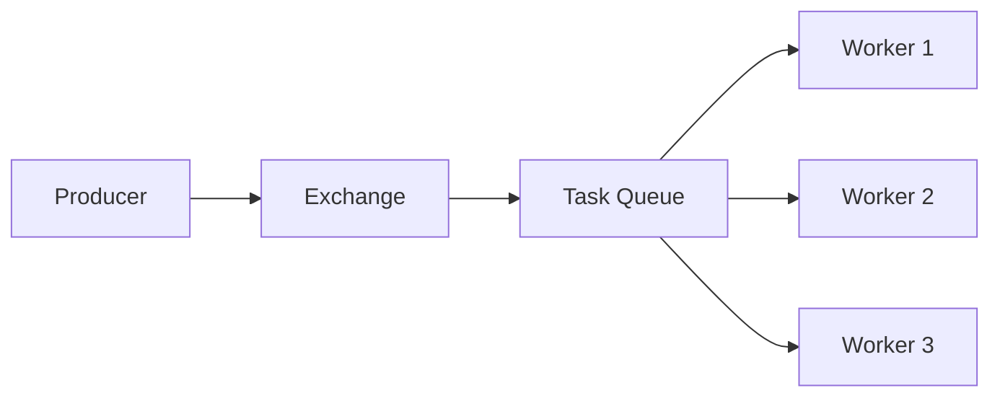
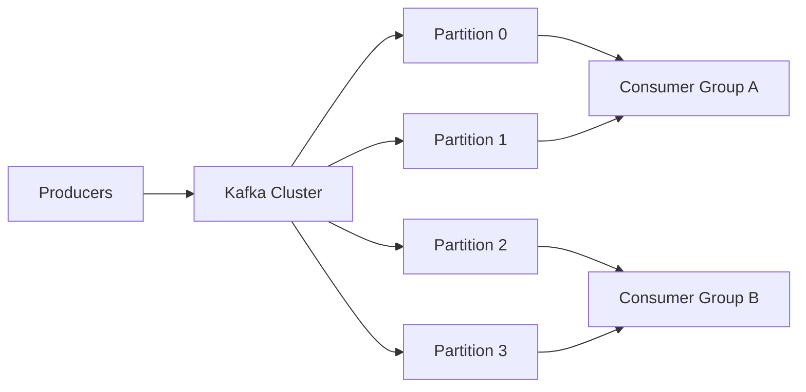
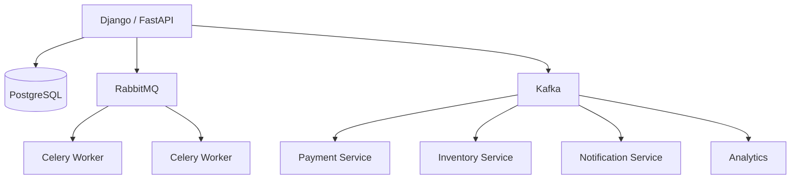

# 03- Kafka vs RabbitMQ

## Overview

Kafka and RabbitMQ are both messaging technologies, but they solve different classes of distributed-systems problems.

The common mistake is to treat them as interchangeable message brokers:

```text
Kafka = RabbitMQ, but faster
```

That model is incorrect.

RabbitMQ is primarily a **message broker** optimized around routing messages to consumers through queues, acknowledgements, delivery semantics, and flexible routing patterns.

Kafka is primarily a **distributed event streaming platform** built around durable, partitioned, append-only logs, consumer offsets, replay, and high-throughput sequential processing.

The architectural decision should therefore be based on:

- message lifecycle
- delivery requirements
- ordering requirements
- replay requirements
- throughput
- latency
- consumer patterns
- retention requirements
- routing complexity
- operational requirements

A simplified comparison is:

| Requirement | Kafka | RabbitMQ |
|---|---|---|
| Event streaming | Excellent | Possible, but not primary strength |
| Traditional task queues | Possible | Excellent |
| Message routing | Good | Excellent |
| Message replay | Excellent | Limited compared with Kafka |
| Long-term retention | Excellent | Not primary design goal |
| Very high throughput | Excellent | Good |
| Consumer groups | Native | Queue/consumer model |
| Multiple independent consumers | Excellent | Good |
| Complex routing | Moderate | Excellent |
| Background jobs | Good | Excellent |
| Event sourcing | Excellent | Possible |
| Celery integration | Possible | Excellent/common |
| Ordered processing | Partition-based | Queue-based with constraints |
| Operational simplicity | Higher complexity | Generally simpler |

---

## Messaging Models

Before comparing the technologies, distinguish the major messaging models.

### Work Queue

A producer creates a task and one worker processes it.

```text
Producer
   |
   v
Queue
   |
   +----> Worker A
   |
   +----> Worker B
   |
   +----> Worker C
```

Each message is normally processed by one consumer.

Typical examples:

- send email
- resize image
- generate PDF
- execute background job
- process payment task
- run asynchronous Django/Celery work

RabbitMQ is particularly well suited to this model.

### Publish/Subscribe

A producer publishes an event and multiple independent consumers receive it.

```text
                +----> Consumer A
                |
Producer ---> Event Stream
                |
                +----> Consumer B
                |
                +----> Consumer C
```

Typical consumers might include:

- analytics
- notifications
- search indexing
- fraud detection
- audit processing

Kafka is particularly strong for this model.

### Event Streaming

Events are persisted in an ordered log.

```text
Partition

Offset
  0    Event A
  1    Event B
  2    Event C
  3    Event D
  4    Event E
```

Consumers maintain their own position.

This means a consumer can process events and later return to an earlier offset.

That replay model is one of Kafka's most important architectural differences from traditional queues.

---

## RabbitMQ

### What It Is

RabbitMQ is a message broker implementing AMQP and supporting multiple messaging patterns.

Its architecture commonly involves:

```text
Producer
   |
   v
Exchange
   |
   | Routing
   v
Queue
   |
   v
Consumer
```

The producer typically publishes to an exchange rather than directly targeting a queue.

The exchange determines where messages should be routed.

---

## RabbitMQ Core Components

### Producer

The producer publishes a message.

For example:

```text
Order Service
      |
      v
order.created
```

### Exchange

The exchange receives messages and routes them to queues.

Common exchange types include:

| Exchange | Routing Behavior |
|---|---|
| Direct | Exact routing-key match |
| Topic | Pattern-based routing |
| Fanout | Broadcast to bound queues |
| Headers | Header-based routing |

### Queue

A queue stores messages until consumers process them.

```text
Exchange
   |
   +---- Queue A
   |
   +---- Queue B
```

### Consumer

A consumer receives messages from a queue and processes them.

### Acknowledgement

Consumers can explicitly acknowledge successful processing.

```text
RabbitMQ -> Consumer
             |
             | process
             v
          success
             |
             v
           ACK
```

If processing fails and the message is rejected or remains unacknowledged according to the configuration, RabbitMQ can make it available for redelivery.

---

## RabbitMQ Routing

RabbitMQ provides sophisticated routing capabilities.

For example:

```text
Exchange: events

order.created
order.updated
payment.completed
payment.failed
```

Queues can bind to routing patterns.

A topic exchange might route:

```text
order.*
```

to one queue and:

```text
payment.*
```

to another.

This makes RabbitMQ useful when message routing itself is an important part of the architecture.

---

## RabbitMQ Work Queue

A typical worker architecture is:



The queue distributes work among consumers.

For example:

```text
100 PDF generation jobs
        |
        v
    RabbitMQ
        |
   +----+----+
   |         |
Worker 1  Worker 2
```

Each worker can process a different task.

This is a natural fit for Celery.

---

## RabbitMQ With Celery

A common Python architecture is:

```text
Django / FastAPI
       |
       v
    Celery
       |
       v
  RabbitMQ
       |
       +----> Worker 1
       |
       +----> Worker 2
```

Example task:

```python
from celery import Celery

app = Celery(
    "tasks",
    broker="amqp://rabbitmq:5672//",
)

@app.task
def generate_invoice(order_id: int) -> None:
    # Generate the invoice asynchronously.
    ...
```

The application submits work while workers consume tasks asynchronously.

RabbitMQ is therefore a common choice when the primary requirement is:

> "Give this job to one available worker."

---

## RabbitMQ Advantages

### Flexible Routing

Exchanges provide sophisticated routing semantics.

### Strong Queue Semantics

RabbitMQ is designed around:

- queues
- acknowledgements
- consumer delivery
- redelivery
- routing

### Good Fit for Task Processing

RabbitMQ works well for:

- Celery
- background jobs
- task queues
- asynchronous commands
- RPC-style messaging where appropriate

### Lower Conceptual Barrier

A basic RabbitMQ architecture is relatively straightforward:

```text
Producer -> Queue -> Consumer
```

Kafka requires understanding:

- topics
- partitions
- offsets
- consumer groups
- retention
- replication

---

## RabbitMQ Limitations

RabbitMQ is not primarily designed as a massive long-term event history.

Potential limitations for streaming workloads include:

- replay is not its central consumption model
- long-term retention is not its primary architectural purpose
- very large streaming workloads may favor Kafka
- scaling large message histories requires careful design
- queue-based consumption differs fundamentally from Kafka's log model

RabbitMQ can support sophisticated workloads, but using it as a Kafka replacement can create architectural friction.

---

## Kafka

### What It Is

Kafka is a distributed event streaming platform based on append-only logs.

A simplified model is:

```text
Producer
   |
   v
Topic
   |
   +---- Partition 0
   |
   +---- Partition 1
   |
   +---- Partition 2
```

Each partition is an ordered sequence of records.

For example:

```text
Partition 0

Offset 0 -> OrderCreated
Offset 1 -> PaymentStarted
Offset 2 -> PaymentCompleted
Offset 3 -> OrderShipped
```

Records remain available according to the configured retention policy.

---

## Kafka Core Components

### Producer

Applications publish records to Kafka topics.

```text
Order Service
     |
     v
Kafka Producer
     |
     v
orders topic
```

### Topic

A topic represents a logical stream of records.

Examples:

```text
orders
payments
inventory
user-events
audit-events
```

### Partition

Topics are divided into partitions.

```text
orders
├── partition-0
├── partition-1
├── partition-2
└── partition-3
```

Partitions provide:

- parallelism
- ordering within a partition
- horizontal distribution

### Offset

Every record has an offset within its partition.

```text
Partition 0

100 -> Event A
101 -> Event B
102 -> Event C
```

A consumer can track its current position.

### Consumer

A consumer reads records from Kafka.

### Consumer Group

Consumers can form a consumer group.

```text
Topic
 |
 +---- Partition 0 ---> Consumer A
 |
 +---- Partition 1 ---> Consumer B
 |
 +---- Partition 2 ---> Consumer C
```

A partition is assigned to one consumer within a consumer group at a given time.

---

## Kafka Consumer Groups

Consumer groups are fundamental to Kafka.

Suppose a topic contains four partitions:

```text
Topic: orders

P0
P1
P2
P3
```

A consumer group with two consumers might receive:

```text
Consumer A -> P0, P1
Consumer B -> P2, P3
```

Another independent consumer group can independently process the same events:

```text
orders
   |
   +----> payment-service group
   |
   +----> analytics-service group
   |
   +----> notification-service group
```

This is fundamentally different from a traditional work queue.

---

## Kafka Replay

One of Kafka's most important capabilities is replay.

Suppose:

```text
Offset 1000 -> OrderCreated
Offset 1001 -> PaymentCompleted
Offset 1002 -> OrderShipped
```

A consumer has processed through offset `1002`.

Later, a bug is discovered.

The consumer can reset its position and reprocess earlier records, subject to retention and the consumer's processing design.

This is extremely useful for:

- rebuilding projections
- recovering from application bugs
- analytics reprocessing
- search index reconstruction
- event-driven architectures
- audit processing

A traditional queue is generally designed around:

```text
consume -> acknowledge -> remove/complete
```

Kafka is designed around:

```text
append -> retain -> consume -> track offset
```

---

## Kafka Ordering

Kafka guarantees ordering **within a partition**, not globally across a topic.

For example:

```text
Partition 0:
Order 1
Order 2
Order 3

Partition 1:
Order 4
Order 5
Order 6
```

There is no global ordering guarantee between the partitions.

If events for a customer must be ordered, the producer can use the customer identifier as the partition key:

```text
key = customer_id
```

This causes events with the same key to be routed to the same partition, preserving their relative order within that partition.

---

## Kafka Throughput

Kafka is optimized for high-throughput sequential data processing.

Its architecture benefits from:

- sequential writes
- partitioning
- batching
- compression
- append-only storage
- sequential reads
- distributed replication

A high-throughput architecture might look like:



The actual throughput depends on:

- partition count
- message size
- batching
- compression
- replication
- network
- disk
- producer configuration
- consumer processing speed

Do not select Kafka solely because someone claims a specific messages-per-second number.

---

## Kafka Advantages

### Durable Event History

Kafka can retain events for a configured period or based on storage policy.

### Replay

Consumers can reprocess historical events.

### High Throughput

Partitioning and sequential I/O make Kafka suitable for large event streams.

### Independent Consumers

Multiple consumer groups can independently process the same event stream.

### Horizontal Scaling

Partitions distribute data and workload across brokers and consumers.

### Event-Driven Architecture

Kafka is well suited to architectures where services react to domain events.

---

## Kafka Limitations

Kafka introduces significant operational and conceptual complexity.

Engineers must understand:

- partitions
- replication
- consumer groups
- offsets
- retention
- rebalancing
- producer delivery semantics
- consumer delivery semantics
- lag
- partition distribution

Kafka can also be a poor choice when the requirement is simply:

```text
Put task in queue.
Process it once.
Acknowledge it.
```

A simpler queue can be more appropriate.

---

## Core Architectural Difference

The most important difference can be summarized as:

```text
RabbitMQ:

Producer
   |
   v
Queue
   |
   v
Consumer
   |
  ACK
```

versus:

```text
Kafka:

Producer
   |
   v
Partitioned Log
   |
   +---- Consumer Group A
   |
   +---- Consumer Group B
   |
   +---- Consumer Group C
```

RabbitMQ focuses heavily on **message delivery and routing**.

Kafka focuses heavily on **durable event streams and distributed consumption**.

---

## Message Lifecycle

### RabbitMQ

A simplified lifecycle:

```text
Publish
   |
   v
Exchange
   |
   v
Queue
   |
   v
Consumer
   |
   v
Process
   |
   v
ACK
```

Depending on configuration and failure behavior, messages may be:

- acknowledged
- rejected
- requeued
- dead-lettered

### Kafka

A simplified lifecycle:

```text
Producer
   |
   v
Topic Partition
   |
   v
Persisted Record
   |
   +---- Consumer Group A
   |
   +---- Consumer Group B
   |
   +---- Consumer Group C
```

The record remains according to retention policy regardless of whether a particular consumer has already processed it.

---

## Delivery Semantics

Both systems require careful consideration of failure and duplicate processing.

Common concepts include:

- at-most-once
- at-least-once
- effectively-once
- exactly-once

### At-Most-Once

A message is processed zero or one time.

Potential downside:

```text
message lost
```

### At-Least-Once

A message is guaranteed to be retried under the appropriate failure model, but may be processed more than once.

```text
Event
  |
  +---- process
  |
  +---- failure
  |
  +---- retry
```

The application must therefore be idempotent.

### Exactly-Once

Exactly-once behavior is more complicated than simply enabling a configuration option.

It requires reasoning about:

- producer semantics
- broker semantics
- consumer behavior
- database transactions
- external side effects

For example:

```text
Kafka
  |
  v
Consumer
  |
  +---- PostgreSQL
  |
  +---- External Payment API
```

Kafka's transactional guarantees cannot automatically make an external HTTP API exactly-once.

---

## Idempotency

Regardless of the broker, production consumers should generally be designed to tolerate duplicate delivery.

A common pattern is an idempotency key:

```text
event_id = 8d4e...
```

The consumer records processed events:

```text
processed_events
----------------
event_id
processed_at
```

Before processing:

```text
if event_id already processed:
    ignore duplicate
else:
    process event
    record event_id
```

Database constraints can enforce uniqueness.

For example:

```sql
CREATE TABLE processed_events (
    event_id UUID PRIMARY KEY,
    processed_at TIMESTAMPTZ NOT NULL DEFAULT now()
);
```

Idempotency is often more valuable than attempting to eliminate every possible duplicate at the infrastructure layer.

---

## Retry Handling

Retries should not create infinite failure loops.

A production architecture commonly uses:

```text
Message
   |
   v
Consumer
   |
   +---- Success
   |
   +---- Temporary Failure
   |          |
   |          v
   |       Retry
   |
   +---- Permanent Failure
              |
              v
           DLQ
```

A dead-letter queue or dead-letter topic provides a place to isolate messages that repeatedly fail.

The retry strategy should include:

- maximum retry count
- exponential backoff
- jitter
- permanent failure classification
- dead-letter handling
- alerting

---

## RabbitMQ vs Kafka Routing

RabbitMQ has richer built-in routing concepts.

```text
Producer
   |
   v
Exchange
   |
   +---- Queue A
   |
   +---- Queue B
   |
   +---- Queue C
```

Kafka routing is generally driven by:

- topic
- partition
- record key
- consumer groups

Kafka's model is simpler conceptually but shifts more responsibility toward topic and event design.

---

## Scaling Comparison

### RabbitMQ

RabbitMQ can scale through:

- multiple nodes
- queues
- consumers
- clustering
- replication strategies

However, queue topology and workload characteristics matter significantly.

### Kafka

Kafka scales primarily through partitions and brokers.

```text
Kafka Cluster

Broker 1 -> P0, P3
Broker 2 -> P1, P4
Broker 3 -> P2, P5
```

More partitions can increase parallelism, but partition count is not free.

It affects:

- metadata
- consumer assignments
- file handles
- storage
- replication
- rebalancing
- operational complexity

More partitions should therefore be treated as an architectural decision rather than simply maximizing the number.

---

## Consumer Backpressure

Backpressure occurs when consumers cannot process messages as quickly as producers generate them.

### RabbitMQ

Queue depth can increase:

```text
Producer rate > Consumer rate

Queue:
████████████████████
```

Monitor:

- queue depth
- consumer count
- unacknowledged messages
- processing latency

### Kafka

Kafka consumers can fall behind producers.

The important metric is consumer lag:

```text
Latest offset: 100000
Consumer offset: 97000

Lag = 3000
```

A growing lag indicates that the consumer group is not keeping up.

Kafka lag should be monitored per:

- topic
- partition
- consumer group

---

## Failure Handling

### RabbitMQ Failure Modes

Important failure scenarios include:

- broker failure
- queue failure
- consumer failure
- network partition
- unacknowledged message accumulation
- poison messages
- queue overload

### Kafka Failure Modes

Important failure scenarios include:

- broker failure
- partition replica failure
- under-replicated partitions
- consumer failure
- consumer group rebalance
- producer failure
- disk exhaustion
- consumer lag
- partition skew

The operational response differs substantially between the systems.

---

## Kafka Rebalancing

When consumers join or leave a consumer group, partition assignments may change.

For example:

```text
Before:

Consumer A -> P0, P1, P2
Consumer B -> P3, P4, P5

Consumer B fails.

After:

Consumer A -> P0, P1, P2, P3, P4, P5
```

Rebalancing can temporarily affect processing.

Poor consumer design can make rebalances expensive.

Consumer applications should therefore:

- process efficiently
- commit offsets carefully
- avoid unnecessarily long blocking operations
- configure polling and session behavior appropriately
- handle partition assignment changes correctly

---

## Ordering Trade-Offs

Ordering requirements often reduce scalability.

Suppose all events must be globally ordered:

```text
Event A
Event B
Event C
Event D
```

A single partition is the simplest model.

But then parallelism is limited.

If events can be ordered per customer:

```text
Customer A -> Partition 0
Customer B -> Partition 1
Customer C -> Partition 2
```

the system can process different customers in parallel while preserving ordering per customer.

This is an important system-design principle:

> Relax global ordering into domain-level ordering whenever the business requirement allows it.

---

## Kafka vs RabbitMQ Decision Matrix

| Requirement | Preferred |
|---|---|
| Celery task queue | RabbitMQ |
| Background jobs | RabbitMQ |
| Complex message routing | RabbitMQ |
| Request-to-worker task delivery | RabbitMQ |
| Durable event history | Kafka |
| Event replay | Kafka |
| Large event streams | Kafka |
| Multiple independent consumers | Kafka |
| Event sourcing | Kafka |
| Analytics pipelines | Kafka |
| High-throughput event ingestion | Kafka |
| Long-lived event retention | Kafka |
| Simple asynchronous command processing | RabbitMQ |
| Per-event consumer offsets | Kafka |
| Flexible exchange-based routing | RabbitMQ |
| Stream processing | Kafka |

---

## Example: Django Background Jobs

Suppose a Django application needs to generate reports asynchronously.

```text
Django
  |
  v
Celery
  |
  v
RabbitMQ
  |
  +---- Worker A
  |
  +---- Worker B
```

This is a natural RabbitMQ use case.

The requirement is:

```text
Submit task
    |
    v
Process task
    |
    v
Complete
```

There is usually no need to retain every task indefinitely for independent consumers.

---

## Example: Order Event Platform

Consider an e-commerce system.

When an order is created:

```text
Order Service
     |
     v
Kafka
     |
     +---- Payment Service
     |
     +---- Inventory Service
     |
     +---- Notification Service
     |
     +---- Analytics Service
```

Each service can consume the event independently.

Later, a new analytics service can process historical events according to the retention policy.

This is a strong Kafka use case.

---

## Example: Microservices Architecture

A production architecture might intentionally use both technologies:



RabbitMQ handles:

```text
commands / jobs / work distribution
```

Kafka handles:

```text
events / streams / durable event history
```

This can be a valid architecture when both workload types exist.

However, operating two messaging systems should be justified by real requirements.

---

## When to Choose RabbitMQ

Choose RabbitMQ when the primary requirement is:

- task distribution
- background jobs
- work queues
- sophisticated routing
- acknowledgement-driven processing
- Celery integration
- relatively straightforward asynchronous communication

Typical example:

```text
Django
  |
  v
Celery
  |
  v
RabbitMQ
  |
  v
Workers
```

RabbitMQ is especially attractive when the system needs a broker rather than an event history.

---

## When to Choose Kafka

Choose Kafka when the primary requirement is:

- event streaming
- durable event history
- replay
- multiple independent consumer groups
- very high throughput
- stream processing
- event-driven architecture
- analytics pipelines
- event sourcing

Typical example:

```text
Order Service
      |
      v
Kafka
      |
      +---- Payment
      +---- Inventory
      +---- Analytics
      +---- Notifications
```

---

## When Not to Choose Either

A senior engineer should also consider whether a message broker is necessary.

For a simple synchronous operation:

```text
Client
  |
  v
API
  |
  v
PostgreSQL
```

adding Kafka or RabbitMQ can introduce unnecessary complexity.

Likewise, if the requirement is simply to execute a local background task, a simpler mechanism may be sufficient depending on reliability requirements.

Messaging infrastructure should solve a concrete problem such as:

- decoupling
- asynchronous execution
- buffering
- event distribution
- workload smoothing
- independent scaling
- durable event transport

---

## Security Considerations

Both systems should be treated as production infrastructure.

Important controls include:

- TLS encryption
- authentication
- authorization
- network isolation
- credential rotation
- least-privilege access
- secret management
- audit logging
- monitoring

Do not expose brokers directly to the public internet.

A typical AWS architecture is:

```text
Internet
   |
   v
Load Balancer
   |
   v
Private Application Subnets
   |
   +----> RabbitMQ / Kafka
   |
   +----> PostgreSQL
```

Messaging infrastructure should normally remain inside private network boundaries.

---

## Monitoring

### RabbitMQ

Monitor:

- queue depth
- message rates
- publish rate
- delivery rate
- acknowledgement rate
- unacknowledged messages
- consumer count
- connection count
- channel count
- memory usage
- disk usage
- node health

Critical alerts often include:

```text
Queue depth continuously increasing
Consumers unavailable
Unacknowledged messages growing
Disk usage critical
Memory pressure
```

### Kafka

Monitor:

- consumer lag
- broker health
- partition health
- under-replicated partitions
- offline partitions
- request latency
- throughput
- disk usage
- network throughput
- controller health
- producer errors
- consumer errors

Consumer lag is one of the most important Kafka operational metrics.

---

## Cost Considerations

Do not compare only infrastructure prices.

Consider:

```text
Infrastructure cost
+
Storage
+
Network
+
Replication
+
Monitoring
+
Operations
+
Engineering complexity
+
Incident response
```

RabbitMQ may be more appropriate for a moderate background-job workload because the operational model can be simpler.

Kafka may justify greater infrastructure and operational cost when:

- throughput is high
- events need to be retained
- multiple consumers need the same events
- replay is valuable
- stream processing is required

---

## Production Pitfalls

### Treating Kafka Like a Queue

Kafka can implement queue-like consumption using consumer groups, but its underlying model is a retained log.

Do not ignore:

- offsets
- retention
- partitions
- consumer groups
- replay

### Treating RabbitMQ Like Kafka

Using RabbitMQ as a long-term event platform can create problems around retention, replay, and large event histories.

### Ignoring Consumer Idempotency

At-least-once processing can produce duplicates.

Consumers should be designed accordingly.

### Using Too Many Kafka Partitions

More partitions can improve parallelism but also increase operational complexity.

Choose partition counts based on:

- throughput
- consumer parallelism
- expected growth
- key distribution
- operational limits

### Blocking Kafka Consumers

A consumer that spends excessive time processing one record can fall behind and trigger rebalancing or lag.

Long-running work should often be separated into appropriate worker systems or designed carefully around consumer configuration.

### Creating Infinite RabbitMQ Retries

A poison message can repeatedly fail:

```text
Queue
  |
  v
Consumer
  |
  X
  |
  v
Requeue
  |
  v
Consumer
  |
  X
```

This can create a retry storm.

Use bounded retries, backoff, and dead-letter handling.

### Assuming Exactly-Once Solves Business Duplicates

Infrastructure-level exactly-once semantics do not automatically make an external business operation exactly once.

Idempotency remains essential.

---

## Interview Comparison

| Question | Kafka | RabbitMQ |
|---|---|---|
| What is the core abstraction? | Distributed log / event stream | Broker / queue |
| How is data consumed? | Offset-based | Delivery + acknowledgement |
| Can data be replayed? | Yes, within retention | Not the primary model |
| How is parallelism achieved? | Partitions + consumer groups | Multiple consumers/queues |
| Where is ordering guaranteed? | Within a partition | Queue/order constraints depend on configuration and consumers |
| Best for events? | Yes | Possible |
| Best for tasks? | Possible | Yes |
| Long-term event retention? | Strong fit | Less natural |
| Complex routing? | Moderate | Strong |
| Consumer state? | Offsets | Broker delivery/ack state |
| Typical Python use | Event-driven services, streaming | Celery/background tasks |

---

## Production Design Checklist

Before choosing between Kafka and RabbitMQ, answer:

- [ ] Is this a task or an event?
- [ ] Does the message need long-term retention?
- [ ] Must consumers replay historical messages?
- [ ] How many independent consumer groups are required?
- [ ] What throughput is expected?
- [ ] What latency is required?
- [ ] Is complex routing required?
- [ ] What ordering guarantees are required?
- [ ] What happens when consumers fail?
- [ ] What happens when producers outpace consumers?
- [ ] How are retries handled?
- [ ] Is a dead-letter mechanism required?
- [ ] Are consumers idempotent?
- [ ] What delivery semantics are required?
- [ ] What are the RPO and RTO requirements?
- [ ] How will lag or queue depth be monitored?
- [ ] How will the broker be secured?
- [ ] Who will operate the infrastructure?
- [ ] Is operating two messaging systems justified?

## Key Takeaways

- **RabbitMQ is primarily a message broker optimized for queues, acknowledgements, task distribution, and flexible routing; Kafka is primarily a distributed event-streaming platform built around partitioned logs and offsets.**
- **Choose RabbitMQ for work queues, Celery tasks, background jobs, and routing-heavy asynchronous commands; choose Kafka for durable event streams, replay, multiple independent consumers, and high-throughput streaming workloads.**
- **Kafka ordering is guaranteed within a partition, while RabbitMQ's delivery ordering depends on queue topology, consumers, acknowledgements, and configuration.**
- **At-least-once processing means production consumers should be idempotent, and retries should be bounded with backoff and dead-letter handling.**
- **Do not introduce Kafka or RabbitMQ by default; select the simplest messaging architecture that satisfies the required throughput, reliability, ordering, retention, replay, and operational requirements.**