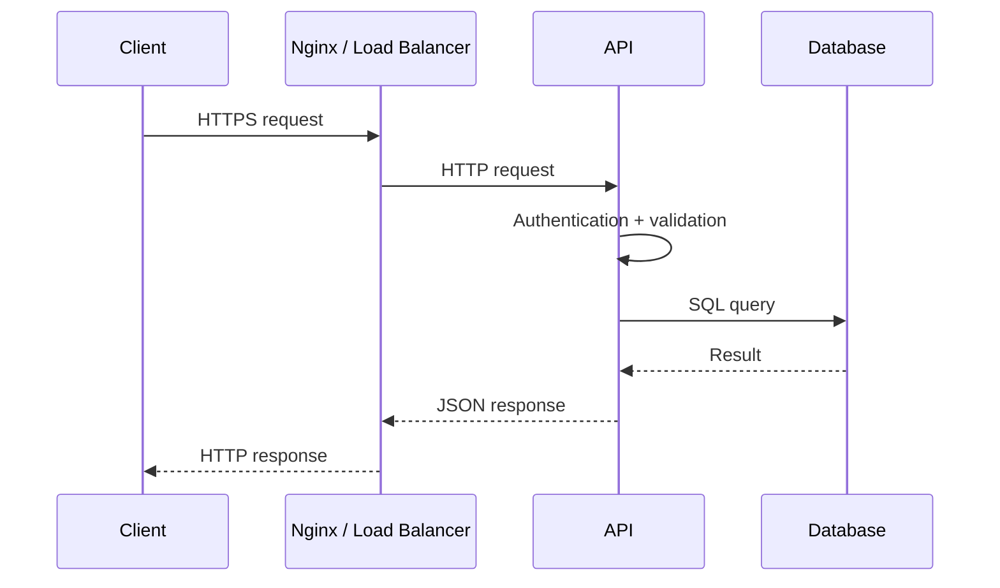
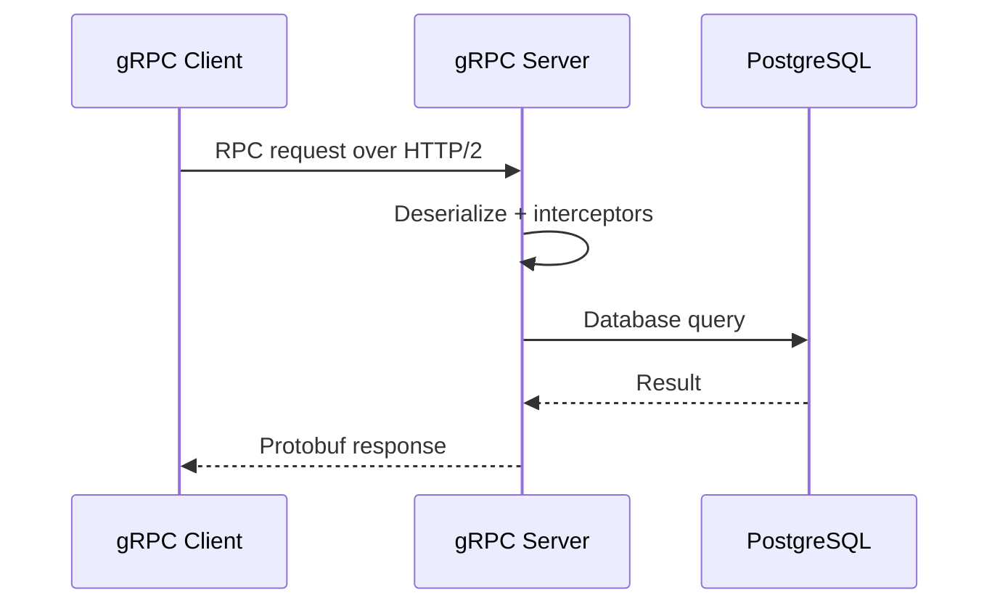
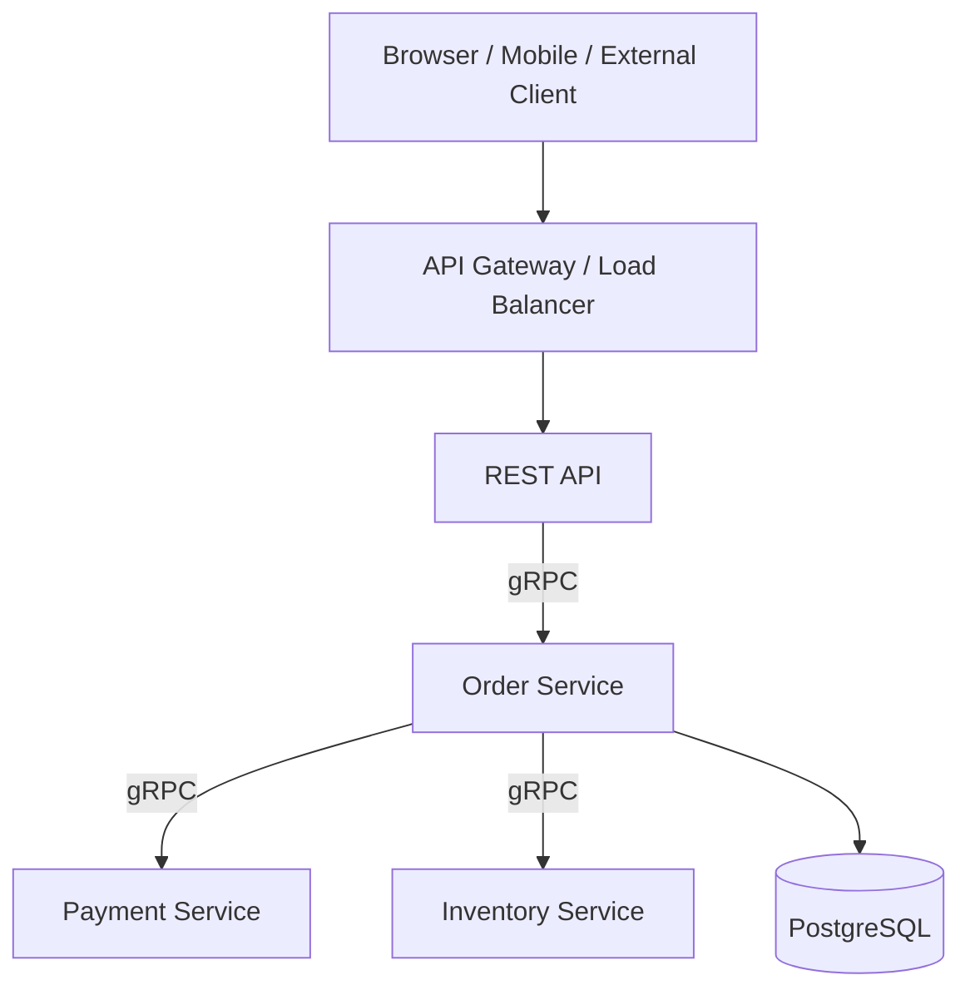

# 04- REST vs gRPC

## Overview

REST and gRPC are two widely used approaches for communication between backend services. Both can expose APIs, transfer structured data, support authentication, and operate across distributed systems, but they optimize for different communication patterns.

REST is an architectural style commonly implemented over HTTP using resource-oriented URLs and representations such as JSON. It is broadly interoperable and particularly effective for public APIs, browser-facing applications, external integrations, and systems where simplicity and HTTP tooling are important.

gRPC is an RPC framework built around Protocol Buffers and HTTP/2. It is particularly effective for service-to-service communication where strongly typed contracts, efficient binary serialization, streaming, and low communication overhead are important.

The decision should not be reduced to:

```text
REST = simple
gRPC = fast
```

A production decision should consider:

- client compatibility
- communication pattern
- payload size
- serialization overhead
- latency
- throughput
- streaming requirements
- API evolution
- observability
- debugging
- security
- infrastructure support
- team expertise
- operational complexity

A common architecture uses both:

```text
                    +----------------+
Internet ---------->| REST API       |
                    | Gateway        |
                    +-------+--------+
                            |
                            | gRPC
                            v
                    +---------------+
                    | Internal      |
                    | Services      |
                    +---------------+
```

REST and gRPC are therefore complementary rather than mutually exclusive.

---

## REST

### What It Is

REST, or Representational State Transfer, is an architectural style for distributed systems.

A REST API commonly exposes resources through HTTP:

```text
GET    /users/123
POST   /users
PATCH  /users/123
DELETE /users/123
```

JSON is frequently used as the representation:

```json
{
  "id": 123,
  "name": "Aranya",
  "email": "user@example.com"
}
```

REST itself does not require JSON, HTTP, or CRUD. In modern backend systems, however, REST APIs are commonly implemented using HTTP and JSON.

---

## REST Resource Model

A REST-oriented API models business entities as resources.

For example:

```text
/users
/orders
/products
/payments
```

An individual resource can be identified by a URI:

```text
/users/123
/orders/987
```

HTTP methods express the intended operation.

| HTTP Method | Typical Meaning |
|---|---|
| GET | Retrieve |
| POST | Create or trigger a non-idempotent operation |
| PUT | Replace |
| PATCH | Partially update |
| DELETE | Delete |

The API should model business semantics rather than mechanically mapping every database operation to an endpoint.

For example:

```text
POST /orders/123/cancel
```

may be more expressive than:

```text
PATCH /orders/123
{
  "status": "cancelled"
}
```

when cancellation represents a business operation with validation and side effects.

---

## REST Request Lifecycle

A typical REST request might look like:



For a Django or FastAPI application:

```text
Client
  |
  | HTTPS
  v
Nginx / ALB
  |
  v
Django / FastAPI
  |
  +---- PostgreSQL
  |
  +---- Redis
  |
  +---- Other services
```

REST benefits heavily from the existing HTTP ecosystem:

- browsers
- proxies
- load balancers
- API gateways
- caching infrastructure
- observability tools
- authentication mechanisms
- debugging tools

---

## REST Advantages

### Broad Compatibility

Almost every programming language, browser, proxy, API gateway, and HTTP client understands HTTP.

A REST endpoint can be consumed by:

- browsers
- mobile applications
- Python
- Java
- Go
- JavaScript
- third-party integrations
- command-line tools

For example:

```bash
curl https://api.example.com/users/123
```

requires no specialized client runtime.

### Human-Readable Payloads

JSON is easy to inspect:

```json
{
  "id": 123,
  "status": "paid"
}
```

This simplifies:

- debugging
- manual testing
- support investigations
- API exploration

### Strong HTTP Ecosystem

REST works naturally with:

- HTTP caching
- CDNs
- TLS
- reverse proxies
- load balancers
- API gateways
- standard HTTP status codes

### Excellent External API Choice

Public APIs generally benefit from REST because external consumers may use many languages and platforms.

---

## REST Limitations

### JSON Overhead

JSON is text-based and often larger than binary formats.

For high-volume internal service communication, serialization and network transfer can become relevant.

### Weaker Contract Enforcement

OpenAPI can provide strong API contracts, but REST does not inherently require generated strongly typed contracts.

Poorly designed APIs can drift into inconsistent request and response structures.

### Streaming Is Less Natural

HTTP streaming is possible, but bidirectional streaming is not as straightforward as gRPC's native streaming model.

### Overfetching and Underfetching

A fixed REST representation can sometimes cause clients to receive more data than required or require multiple requests.

For example:

```text
GET /users/123
GET /users/123/orders
GET /users/123/preferences
```

may require several network round trips.

---

## gRPC

### What It Is

gRPC is a high-performance RPC framework originally developed at Google and based on Protocol Buffers.

The service contract is defined in a `.proto` file.

For example:

```protobuf
syntax = "proto3";

package users;

service UserService {
  rpc GetUser(GetUserRequest) returns (User);
}

message GetUserRequest {
  int64 user_id = 1;
}

message User {
  int64 id = 1;
  string name = 2;
  string email = 3;
}
```

From this contract, client and server code can be generated for supported languages.

The conceptual model is:

```text
Client
  |
  | RPC call
  v
Generated Stub
  |
  | HTTP/2
  v
gRPC Server
  |
  v
Service Method
```

Instead of designing URLs around resources, the API is expressed as methods:

```text
GetUser()
CreateOrder()
CancelOrder()
ProcessPayment()
```

---

## Protocol Buffers

Protocol Buffers, or Protobuf, define the message schema.

Example:

```protobuf
message Order {
  int64 id = 1;
  string customer_id = 2;
  double total = 3;
  string status = 4;
}
```

Fields have stable numeric identifiers:

```text
id          = 1
customer_id = 2
total       = 3
status      = 4
```

Those field numbers are part of the wire contract.

They should not be casually reused after a field is removed.

A safer evolution pattern is:

```protobuf
message Order {
  int64 id = 1;
  string customer_id = 2;
  double total = 3;

  reserved 4;
  string payment_reference = 5;
}
```

---

## Why Protobuf Matters

Protobuf provides:

- compact binary serialization
- explicit schemas
- code generation
- language interoperability
- efficient parsing
- controlled schema evolution

Compared with JSON:

```text
JSON

{
  "user_id": 123,
  "active": true
}
```

Protobuf transmits a compact binary representation rather than field names and textual values.

This can reduce payload size and serialization overhead, although the actual benefit depends heavily on message size, network conditions, compression, and workload characteristics.

---

## gRPC Request Lifecycle

A typical gRPC request:



In a Python environment:

```text
FastAPI / Django Service
        |
        v
gRPC Client Stub
        |
        | HTTP/2
        v
gRPC Server
        |
        v
Business Logic
```

The client generally interacts with a generated stub instead of manually constructing HTTP requests.

---

## gRPC Service Contract

A `.proto` file becomes a central API contract.

For example:

```protobuf
service PaymentService {
  rpc AuthorizePayment(AuthorizePaymentRequest)
      returns (AuthorizePaymentResponse);

  rpc CapturePayment(CapturePaymentRequest)
      returns (CapturePaymentResponse);
}
```

Generated clients expose typed methods corresponding to these RPCs.

This provides an explicit boundary between services.

The contract can be version-controlled alongside application code.

---

## gRPC Communication Patterns

gRPC supports four major RPC patterns.

### Unary RPC

One request and one response.

```text
Client ---- Request ----> Server
Client <--- Response ---- Server
```

Example:

```protobuf
rpc GetUser(GetUserRequest) returns (User);
```

This is the closest gRPC equivalent to a conventional REST request.

### Server Streaming

One request produces multiple responses.

```text
Client ---- Request ----> Server

Client <--- Event 1 ----- Server
Client <--- Event 2 ----- Server
Client <--- Event 3 ----- Server
```

Example:

```protobuf
rpc ListOrders(ListOrdersRequest) returns (stream Order);
```

### Client Streaming

The client sends multiple messages and receives one response.

```text
Client ---- Event 1 ----> Server
Client ---- Event 2 ----> Server
Client ---- Event 3 ----> Server
Client <--- Response ---- Server
```

### Bidirectional Streaming

Both sides independently send streams.

```text
Client ---- Message 1 ---> Server
Client <--- Message 1 ---- Server
Client ---- Message 2 ---> Server
Client <--- Message 2 ---- Server
```

This is one of gRPC's strongest capabilities for service-to-service communication.

---

## HTTP/2 and gRPC

gRPC commonly uses HTTP/2.

HTTP/2 provides capabilities such as:

- multiplexed streams
- binary framing
- header compression
- persistent connections
- concurrent requests over a connection

Conceptually:

```text
TCP/TLS Connection
       |
       +---- HTTP/2 Stream 1
       |
       +---- HTTP/2 Stream 2
       |
       +---- HTTP/2 Stream 3
```

This can reduce connection overhead and improve utilization for many concurrent RPCs.

However, HTTP/2 alone does not guarantee lower application latency. Database queries, application processing, network distance, serialization, and service dependencies can dominate latency.

---

## REST vs gRPC Architecture

A common production architecture is:



REST serves the external boundary.

gRPC handles internal service communication.

This pattern is common because the external and internal communication problems are different.

---

## REST vs gRPC Comparison

| Dimension | REST | gRPC |
|---|---|---|
| Primary abstraction | Resources / HTTP operations | RPC methods |
| Typical encoding | JSON | Protobuf |
| Transport | Usually HTTP/1.1 or HTTP/2 | HTTP/2 |
| Contract | OpenAPI commonly used | `.proto` contract |
| Code generation | Optional | Core workflow |
| Payload size | Usually larger | Usually smaller |
| Serialization | Text-based | Binary |
| Browser support | Excellent | Requires additional browser considerations |
| Streaming | Possible | First-class |
| Debugging | Very easy | Requires gRPC tooling |
| Public APIs | Excellent | Possible, but less universal |
| Internal microservices | Good | Excellent fit |
| Strong typing | Optional | Strong |
| API evolution | Convention/tooling dependent | Schema-driven |
| Human readability | Excellent | Poor at wire level |
| HTTP ecosystem | Excellent | Good |
| Bidirectional streaming | Less natural | Excellent |
| Simple integrations | Excellent | More setup |
| Cross-language service communication | Excellent | Excellent |
| Operational complexity | Lower | Higher |

---

## Performance Considerations

A common claim is:

> gRPC is faster than REST.

This can be directionally true for many internal service workloads, but it is not a universal rule.

Performance depends on:

- payload size
- serialization format
- request frequency
- connection reuse
- HTTP version
- network latency
- CPU availability
- server implementation
- database latency
- compression
- batching
- concurrency

A realistic request latency might look like:

```text
Total latency

Network
  +
TLS
  +
Serialization
  +
Application processing
  +
Database
  +
External dependencies
```

If PostgreSQL takes 80 ms and Protobuf saves 1 ms of serialization, changing REST to gRPC will not solve the actual bottleneck.

Senior engineers benchmark the workload rather than assuming protocol selection determines performance.

---

## Payload Efficiency

Suppose an API returns a large response:

```json
{
  "id": 123,
  "customer_id": "customer-123",
  "status": "completed",
  "amount": 999.99
}
```

JSON includes field names and textual encoding.

Protobuf uses a binary wire format based on field numbers and encoded values.

For large, frequent service-to-service messages, this can reduce:

- bandwidth
- serialization CPU
- deserialization CPU
- payload size

The actual benefit should be measured under realistic traffic.

---

## API Contract and Schema Evolution

API evolution is one of the most important differences.

### REST

A REST API might evolve:

```text
GET /users/123
```

Response version:

```json
{
  "id": 123,
  "name": "Aranya"
}
```

Later:

```json
{
  "id": 123,
  "name": "Aranya",
  "timezone": "Asia/Kolkata"
}
```

Adding fields is generally safe for clients that ignore unknown fields.

Breaking changes require more care.

### gRPC

Protobuf is designed around schema evolution.

Generally safe changes include:

- adding new fields
- adding new RPC methods
- adding optional data
- maintaining existing field numbers

Dangerous changes include:

- reusing field numbers
- changing incompatible field types
- removing fields without reserving numbers
- changing semantics while keeping the same field

A robust workflow treats `.proto` files as compatibility-sensitive contracts.

---

## Error Handling

### REST

REST commonly communicates errors using HTTP status codes.

Example:

```http
HTTP/1.1 404 Not Found
Content-Type: application/json
```

```json
{
  "error": "user_not_found",
  "message": "User does not exist"
}
```

Common status codes include:

| Status | Meaning |
|---|---|
| 200 | Successful request |
| 201 | Resource created |
| 400 | Invalid request |
| 401 | Authentication required/failed |
| 403 | Forbidden |
| 404 | Resource not found |
| 409 | Conflict |
| 422 | Validation failure |
| 429 | Rate limited |
| 500 | Server error |
| 503 | Service unavailable |

### gRPC

gRPC uses standardized status codes.

Examples include:

```text
OK
INVALID_ARGUMENT
UNAUTHENTICATED
PERMISSION_DENIED
NOT_FOUND
ALREADY_EXISTS
RESOURCE_EXHAUSTED
FAILED_PRECONDITION
DEADLINE_EXCEEDED
UNAVAILABLE
INTERNAL
```

For example:

```python
import grpc

context.abort(
    grpc.StatusCode.NOT_FOUND,
    "user not found",
)
```

The important architectural principle is to distinguish:

```text
Business error
vs
Infrastructure failure
```

A missing user is not the same as a database outage.

---

## Deadlines and Timeouts

Timeouts are critical in distributed systems.

Without deadlines:

```text
Service A
   |
   v
Service B
   |
   v
Service C
   |
   v
Service D
```

A slow dependency can consume resources throughout the entire request chain.

A better design propagates deadlines:

```text
Client deadline: 2 seconds

Service A: remaining 2.0s
Service B: remaining 1.7s
Service C: remaining 1.2s
```

gRPC provides first-class deadline support.

REST applications should implement explicit client and server timeouts as well.

Never rely on infinite network timeouts in production.

---

## Retries

Retries are useful for transient failures but dangerous when implemented blindly.

For example:

```text
Service A
   |
   +---- Service B
           |
           X timeout
           |
           +---- retry
           |
           +---- retry
           |
           +---- retry
```

If many clients do this simultaneously, a dependency outage can become a retry storm.

Retries should generally include:

- bounded attempts
- exponential backoff
- jitter
- timeout/deadline propagation
- retryable error classification
- idempotency

Do not automatically retry every `500` or every gRPC failure.

---

## Authentication and Authorization

Both REST and gRPC can support strong authentication.

Common mechanisms include:

- OAuth 2.0
- JWT
- API keys
- mutual TLS
- service identity
- IAM-based authentication

For internal service communication, mutual TLS can provide strong service identity:

```text
Service A
   |
   | mTLS
   v
Service B
```

Authentication answers:

> Who are you?

Authorization answers:

> What are you allowed to do?

Both layers are required.

---

## Security Considerations

### REST

Use:

- HTTPS
- authentication
- authorization
- input validation
- rate limiting
- request size limits
- secure headers
- schema validation
- audit logging

### gRPC

Use:

- TLS
- mTLS where appropriate
- authentication metadata
- authorization interceptors
- message size limits
- deadline enforcement
- input validation
- certificate rotation

Neither REST nor gRPC is secure simply because the protocol is standardized.

Security must be designed at the application and infrastructure layers.

---

## Observability

Distributed RPC systems require request correlation.

A request might travel:

```text
Client
  |
  v
API
  |
  v
Order Service
  |
  v
Payment Service
  |
  v
Inventory Service
```

Every hop should preserve useful context such as:

- trace ID
- span ID
- request ID
- authenticated identity
- service metadata

OpenTelemetry is commonly used to instrument both REST and gRPC services.

A trace should allow engineers to answer:

```text
Why did this request take 2.4 seconds?
```

rather than simply:

```text
HTTP 500 occurred.
```

---

## Load Balancing

REST commonly works naturally with:

```text
Client
   |
   v
ALB / Nginx
   |
   +---- API 1
   +---- API 2
   +---- API 3
```

gRPC uses long-lived HTTP/2 connections, so load balancing requires additional consideration.

A naive TCP load balancer can create uneven connection distribution because many RPCs may share a small number of persistent connections.

gRPC-aware or client-side load balancing can provide more appropriate distribution depending on the environment.

In Kubernetes, service discovery and gRPC-aware traffic management may be used where required.

---

## Streaming

Streaming is a major reason to choose gRPC.

Consider a service that continuously sends updates:

```text
Client
  |
  | subscribe
  v
Server
  |
  +---- Update 1
  +---- Update 2
  +---- Update 3
  +---- Update 4
```

With gRPC:

```protobuf
rpc StreamOrders(StreamOrdersRequest)
    returns (stream OrderEvent);
```

This is a natural API model.

REST can implement streaming using mechanisms such as:

- Server-Sent Events
- chunked responses
- WebSockets
- HTTP streaming

But these are separate mechanisms rather than a unified RPC abstraction.

---

## Browser Compatibility

This is an important practical distinction.

Standard gRPC clients are not universally usable directly from browsers.

For browser-facing applications, alternatives include:

- REST
- GraphQL
- WebSockets
- gRPC-Web

gRPC-Web provides browser-compatible communication through supported infrastructure and has different capabilities from native gRPC.

Therefore:

```text
Browser
   |
   +---- REST
   |
   +---- gRPC-Web
```

is generally more practical than assuming browsers can directly consume arbitrary native gRPC services.

---

## Python Example: REST With FastAPI

A simple production-style REST endpoint:

```python
from fastapi import FastAPI, HTTPException
from pydantic import BaseModel

app = FastAPI()


class UserResponse(BaseModel):
    id: int
    name: str
    email: str


@app.get("/users/{user_id}", response_model=UserResponse)
async def get_user(user_id: int) -> UserResponse:
    user = await find_user(user_id)

    if user is None:
        raise HTTPException(
            status_code=404,
            detail="User not found",
        )

    return UserResponse(
        id=user.id,
        name=user.name,
        email=user.email,
    )
```

The important architectural properties are:

- HTTP semantics
- explicit response schema
- validation
- predictable status codes
- client interoperability

---

## Python Example: gRPC Service

A `.proto` definition:

```protobuf
syntax = "proto3";

package users;

service UserService {
  rpc GetUser(GetUserRequest) returns (User);
}

message GetUserRequest {
  int64 user_id = 1;
}

message User {
  int64 id = 1;
  string name = 2;
  string email = 3;
}
```

A generated Python server implementation can then expose the service method:

```python
import grpc

from generated import users_pb2
from generated import users_pb2_grpc


class UserService(users_pb2_grpc.UserServiceServicer):
    async def GetUser(self, request, context):
        user = await find_user(request.user_id)

        if user is None:
            await context.abort(
                grpc.StatusCode.NOT_FOUND,
                "User not found",
            )

        return users_pb2.User(
            id=user.id,
            name=user.name,
            email=user.email,
        )
```

The generated code is intentionally kept outside business logic.

The `.proto` contract remains the source of truth for the wire interface.

---

## REST and gRPC in Microservices

A mature architecture frequently uses different protocols for different boundaries.

For example:

```text
                    Internet
                       |
                       v
                API Gateway / ALB
                       |
                       v
                  REST API
                       |
             +---------+---------+
             |                   |
           gRPC                gRPC
             |                   |
             v                   v
       Order Service       User Service
             |
             | gRPC
             v
       Payment Service
```

The reasoning is:

```text
External clients
    -> REST

Internal service-to-service
    -> gRPC
```

This avoids forcing external clients to understand internal service contracts.

---

## REST vs gRPC for Django

Django and Django REST Framework are excellent choices for REST APIs.

A common architecture is:

```text
Internet
   |
   v
Nginx / ALB
   |
   v
Django + DRF
   |
   +---- PostgreSQL
   +---- Redis
   +---- Celery
```

If the Django application needs to communicate with another internal service at high frequency, gRPC can be introduced for that internal boundary.

```text
Django / DRF
      |
      | gRPC
      v
Pricing Service
```

There is no requirement for the entire Django application to become a gRPC application.

Protocol selection can happen per service boundary.

---

## REST vs gRPC for FastAPI

FastAPI is particularly well suited to REST APIs because it provides:

- OpenAPI generation
- request validation
- response validation
- async support
- automatic documentation

FastAPI can also coexist with gRPC:

```text
FastAPI
   |
   +---- REST endpoint
   |
   +---- gRPC client
```

A FastAPI API can act as the external HTTP boundary while using gRPC internally.

---

## API Gateway Considerations

REST integrates naturally with API gateways.

Typical flow:

```text
Client
  |
  v
CloudFront
  |
  v
API Gateway / ALB
  |
  v
REST Service
```

For gRPC, the infrastructure must support HTTP/2 and gRPC correctly.

AWS and Kubernetes environments can support gRPC, but configuration must account for:

- HTTP/2
- TLS
- health checks
- idle timeouts
- connection behavior
- load balancing
- observability

Do not assume that an infrastructure component supporting HTTP automatically supports every gRPC feature correctly.

---

## Caching

REST has a major advantage for conventional HTTP caching.

Responses can use:

```http
Cache-Control: max-age=60
ETag: "abc123"
```

CDNs and HTTP caches understand these semantics.

For example:

```text
Client
  |
  v
CloudFront
  |
  +---- Cache Hit
  |
  +---- Origin API
```

gRPC generally does not benefit from the same conventional browser/CDN caching model.

This is another reason REST is often preferred for public read-heavy APIs.

---

## API Versioning

### REST

Common approaches include:

```text
/api/v1/users
/api/v2/users
```

or header-based/content-negotiation strategies.

Avoid creating versions unnecessarily.

Prefer backward-compatible evolution where possible.

### gRPC

Protobuf schema evolution is often preferred over frequent major API versions.

For example:

```protobuf
message User {
  int64 id = 1;
  string name = 2;
  string email = 3;
  string timezone = 4;
}
```

Adding a field can often be backward compatible if existing clients safely ignore it.

The protocol's schema evolution model should be treated as part of the architecture.

---

## Reliability Considerations

Both protocols operate over unreliable networks.

A service call can fail because of:

- timeout
- DNS failure
- connection failure
- TLS failure
- server overload
- dependency failure
- network partition
- process crash

Therefore both REST and gRPC clients should implement:

```text
Timeout
Retry policy
Circuit breaking where appropriate
Idempotency
Deadline propagation
Connection management
Observability
```

Protocol choice does not remove distributed-systems failure modes.

---

## Common Mistakes

### Choosing gRPC Because It Is Faster

This is incomplete reasoning.

If the application is dominated by:

```text
PostgreSQL = 150 ms
```

and protocol serialization is:

```text
REST = 2 ms
gRPC = 1 ms
```

switching protocols will not materially improve end-to-end latency.

Measure the actual bottleneck.

### Using REST for Every Internal Call

REST is perfectly valid internally, but large microservice systems can eventually experience:

- excessive JSON serialization
- repetitive schema definitions
- inconsistent contracts
- high request volume
- inefficient payloads

gRPC can be valuable when those problems become significant.

### Using gRPC for Public APIs Without Considering Clients

Public API consumers may expect:

- browsers
- curl
- JavaScript
- mobile SDKs
- third-party integrations

REST often provides a lower integration barrier.

### Ignoring HTTP/2 Infrastructure

gRPC depends heavily on HTTP/2 behavior.

Incorrect load balancer or proxy configuration can cause:

- connection failures
- poor load distribution
- unexpected timeouts
- streaming failures

### Ignoring Schema Evolution

Never casually change or reuse Protobuf field numbers.

Treat `.proto` definitions as compatibility-sensitive contracts.

### Creating Excessive RPC Granularity

An architecture such as:

```text
Service A
   |
   +---- getUser()
   +---- getAddress()
   +---- getPreferences()
   +---- getOrders()
   +---- getPayments()
```

can create excessive network chatter.

Service boundaries and RPC granularity should reflect business operations and data ownership.

### Forgetting Deadlines

An internal call without a deadline can consume resources indefinitely.

Every distributed call should have an explicit timeout or propagated deadline.

### Retrying Non-Idempotent Operations

Retrying:

```text
CreatePayment()
```

without idempotency protection can create duplicate side effects.

---

## Decision Framework

Use REST when most of the following are true:

- clients include browsers or third parties
- interoperability is a priority
- human-readable requests are valuable
- HTTP caching is useful
- simple integrations matter
- conventional HTTP infrastructure is preferred
- streaming is not central

Use gRPC when most of the following are true:

- communication is primarily service-to-service
- strong contracts are important
- multiple languages are involved
- high request volume exists
- payload efficiency matters
- streaming is required
- generated clients are valuable
- low communication overhead matters

---

## REST vs gRPC Decision Matrix

| Question | REST | gRPC |
|---|---:|---:|
| Public API? | Strong choice | Usually not first choice |
| Browser client? | Strong choice | gRPC-Web may be required |
| Internal microservices? | Good | Strong choice |
| High-throughput RPC? | Good | Strong choice |
| Binary payload efficiency? | Moderate | Strong |
| Human-readable debugging? | Strong | Moderate |
| HTTP caching? | Strong | Limited |
| Bidirectional streaming? | Possible through other technologies | Strong |
| Strong generated contracts? | Via tooling | Native workflow |
| Simple curl testing? | Excellent | Requires tooling |
| API gateway simplicity? | Excellent | Requires HTTP/2/gRPC support |
| Long-lived connections? | Possible | Strong |
| Third-party integration? | Excellent | More difficult |
| Contract-first development? | Optional | Strong |

---

## Production Checklist

Before selecting REST or gRPC, evaluate:

- [ ] Who are the clients?
- [ ] Is the API public or internal?
- [ ] Are browser clients required?
- [ ] Is high throughput required?
- [ ] Are payloads large or frequent?
- [ ] Is streaming required?
- [ ] Is bidirectional communication required?
- [ ] Is HTTP caching valuable?
- [ ] Is strong schema enforcement required?
- [ ] What API evolution strategy will be used?
- [ ] How are deadlines propagated?
- [ ] How are retries controlled?
- [ ] Are operations idempotent?
- [ ] How will authentication work?
- [ ] How will authorization work?
- [ ] How will tracing work?
- [ ] Does the load balancer support the required protocol behavior?
- [ ] Does Kubernetes or AWS infrastructure support the intended deployment?
- [ ] Can the team operate and debug the chosen protocol?
- [ ] Has the actual performance requirement been measured?

## Interview Traps

### "gRPC Is Always Faster Than REST"

Incorrect.

gRPC often provides efficiency advantages through Protobuf and HTTP/2, but end-to-end performance depends on the entire system.

### "REST Cannot Stream"

Incorrect.

HTTP supports streaming patterns, and technologies such as SSE and WebSockets can provide streaming behavior.

The distinction is that gRPC makes streaming a first-class RPC capability.

### "gRPC Replaces REST"

Incorrect.

The protocols serve different boundaries well.

A system can expose REST externally and use gRPC internally.

### "HTTP/2 Makes REST the Same as gRPC"

Incorrect.

gRPC uses HTTP/2, but the differences also include:

- RPC abstraction
- Protobuf encoding
- generated clients
- service contracts
- streaming semantics
- gRPC status model

### "Exactly-Once Comes From gRPC"

Incorrect.

gRPC does not automatically provide exactly-once business execution.

Distributed operations still require idempotency and careful failure handling.

## Key Takeaways

- **REST is generally strongest for public, browser-facing, and integration-heavy APIs, while gRPC is particularly strong for typed, high-throughput, service-to-service communication.**
- **gRPC's main architectural advantages come from Protocol Buffers, generated contracts, HTTP/2, efficient serialization, and first-class streaming—not simply from being "faster."**
- **Protocol choice should follow system boundaries: a production architecture can expose REST externally while using gRPC internally without forcing one protocol everywhere.**
- **Both REST and gRPC require production-grade timeout/deadline propagation, controlled retries, idempotency, authentication, authorization, tracing, and failure handling.**
- **Choose based on client compatibility, communication patterns, performance requirements, caching, streaming, API evolution, infrastructure support, and operational complexity rather than protocol popularity.**