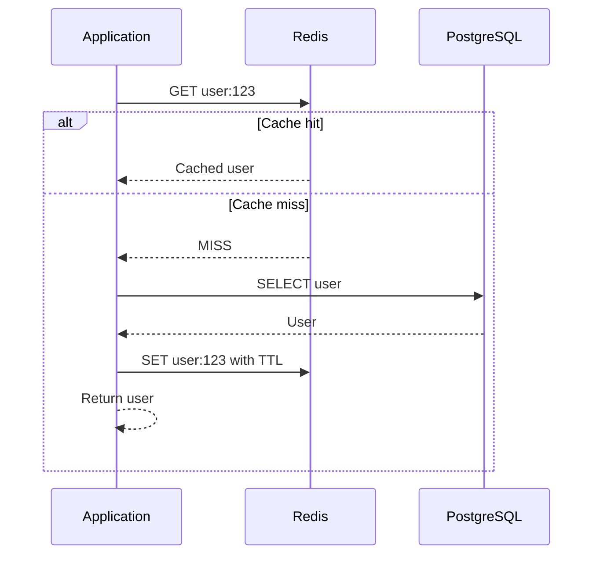
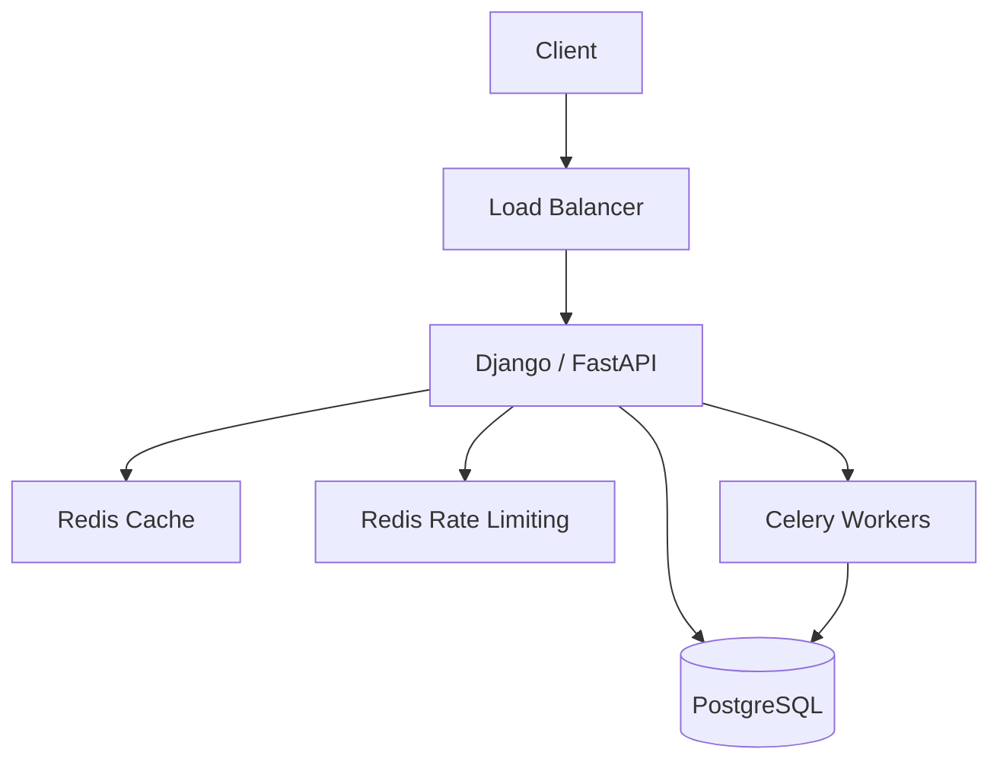

# 05- Redis vs Memcached

## Overview

Redis and Memcached are in-memory data stores commonly used to reduce database load, improve application latency, and support high-throughput backend workloads.

They overlap significantly as distributed caches, but their design goals are different.

Memcached is intentionally simple: an in-memory key-value cache optimized for straightforward, ephemeral caching.

Redis is a broader in-memory data platform supporting strings, hashes, lists, sets, sorted sets, streams, transactions, scripting, persistence, replication, and more.

For most modern backend systems, Redis is the more capable general-purpose choice. Memcached remains useful when the requirement is specifically a simple, horizontally scalable cache with minimal data-structure and operational requirements.

The decision should be based on the workload rather than the assumption that Redis is always better.

A typical application architecture looks like:

```text
                    +----------------+
                    | Django/FastAPI |
                    +-------+--------+
                            |
                  +---------+---------+
                  |                   |
                  v                   v
             Redis/Memcached       PostgreSQL
                  |
                  |
            Cache Hit / Miss
```

The fundamental cache pattern is:

```text
Application
    |
    v
Cache
    |
    +---- HIT ----> Return cached value
    |
    +---- MISS ---> Database
                      |
                      v
                   Store in cache
                      |
                      v
                 Return result
```

The primary objective is not merely "make the application faster." A cache should reduce expensive work while maintaining acceptable correctness, consistency, availability, and operational complexity.

---

## What Is Caching?

A cache stores data closer to the application so that repeated requests do not have to perform the original expensive operation.

For example, without caching:

```text
Request
  |
  v
Django
  |
  v
PostgreSQL
  |
  v
Query
  |
  v
Response
```

With caching:

```text
Request
  |
  v
Django
  |
  v
Redis
  |
  +---- HIT ---> Response
  |
  +---- MISS
         |
         v
     PostgreSQL
         |
         v
       Redis
         |
         v
      Response
```

A database query might take several milliseconds or significantly longer under contention. An in-memory cache lookup can often be much faster.

The actual performance improvement depends on:

- network distance
- serialization
- payload size
- cache hit ratio
- database latency
- connection pooling
- CPU usage
- workload characteristics

---

## Why Caches Exist

Caching primarily addresses four problems.

### Latency

Memory access and simple key lookups can be much faster than executing database queries.

### Database Load

If thousands of requests repeatedly retrieve the same data, caching can prevent thousands of database reads.

### Throughput

A cache can serve many repeated reads without increasing database capacity proportionally.

### Expensive Computation

Caching can also avoid repeated application work:

```text
Report generation
Permission calculation
API response generation
Expensive aggregation
Configuration lookup
```

---

## Cache Hit and Cache Miss

A **cache hit** occurs when the requested key exists.

```text
GET user:123

Redis
  |
  +---- EXISTS
          |
          v
       Return
```

A **cache miss** occurs when the key does not exist or is no longer valid.

```text
GET user:123

Redis
  |
  +---- NOT FOUND
          |
          v
      PostgreSQL
          |
          v
        Redis
```

The cache hit ratio is an important production metric.

```text
Hit Ratio = Cache Hits / Total Cache Requests
```

For example:

```text
900 hits
100 misses

Hit ratio = 90%
```

A low hit ratio may indicate:

- poor key design
- TTL too short
- highly unique requests
- insufficient cache capacity
- frequent invalidation
- inappropriate data being cached

---

## Redis

### What It Is

Redis is an in-memory data store that supports multiple data structures and operational capabilities.

Common Redis data types include:

| Type | Typical Use |
|---|---|
| String | Cache values, counters, tokens |
| Hash | Object-like records |
| List | Queues and ordered collections |
| Set | Unique membership |
| Sorted Set | Rankings and priority queues |
| Stream | Event streams |
| Bitmap | Compact boolean state |
| HyperLogLog | Approximate cardinality |

Redis can be used as:

- cache
- session store
- distributed lock mechanism
- rate limiter
- counter store
- queue
- stream processor
- temporary state store

However, not every Redis capability should automatically become part of an application's architecture.

---

## Memcached

### What It Is

Memcached is a simple distributed memory caching system designed primarily for ephemeral key-value caching.

Its conceptual model is intentionally straightforward:

```text
SET key value
GET key
DELETE key
```

The application generally treats Memcached as a disposable cache.

If the entire Memcached cluster disappears, the application should be able to reconstruct the data from its source of truth.

This simplicity is one of its primary architectural strengths.

---

## Redis vs Memcached Architecture

### Redis

A Redis deployment can provide:

```text
Application
    |
    v
Redis
    |
    +---- Primary
    |
    +---- Replicas
    |
    +---- Persistence
```

Depending on the deployment model, Redis can support replication, failover, clustering, and persistence.

### Memcached

Memcached is commonly deployed as multiple independent cache nodes:

```text
Application
    |
    +---- Node A
    +---- Node B
    +---- Node C
    +---- Node D
```

The application or client library distributes keys across nodes.

The cache does not need to coordinate persistent state between nodes.

---

## Core Comparison

| Dimension | Redis | Memcached |
|---|---|---|
| Primary purpose | In-memory data platform + cache | Distributed cache |
| Data model | Rich data structures | Simple key-value |
| Persistence | Supported | No durable persistence |
| Replication | Supported | Not a core feature |
| High availability | Supported through deployment architecture | Primarily achieved through redundancy/client distribution |
| Clustering | Supported | Client-side distribution is common |
| Pub/Sub | Supported | No equivalent built-in model |
| Streams | Supported | No |
| Lua/scripts | Supported | No |
| Transactions | Supported in Redis semantics | No equivalent |
| Counters | Strong support | Supported |
| Sorted sets | Supported | No |
| Maximum simplicity | Moderate | Strong |
| Operational flexibility | High | Low |
| Memory efficiency | Good, with data-structure overhead | Often very efficient for simple values |
| Best general-purpose choice | Often Redis | Specialized cache workloads |

---

## Redis Data Structures

Redis becomes particularly useful when the application needs more than:

```text
key -> value
```

### Strings

Useful for simple cached values.

```text
user:123:name -> "Aranya"
```

Counters are also commonly implemented using strings:

```text
INCR api:requests:2026-08-23
```

### Hashes

Useful for object-like data:

```text
user:123
    name -> Aranya
    email -> user@example.com
    status -> active
```

Example:

```bash
HSET user:123 name "Aranya" status "active"
HGET user:123 name
```

### Sets

Useful for unique membership.

```text
online_users
    101
    203
    309
```

Example:

```bash
SADD online_users 101
SISMEMBER online_users 101
```

### Sorted Sets

Useful when every member has a score.

Examples:

- leaderboards
- ranking systems
- priority queues
- scheduled work

```text
leaderboard
    user:101 -> 950
    user:203 -> 920
    user:309 -> 875
```

### Streams

Redis Streams can model append-oriented event streams.

They can be useful for:

- lightweight event processing
- consumer groups
- application-level event pipelines

They should not automatically replace Kafka in systems requiring Kafka's durability, partitioning model, ecosystem, and large-scale event streaming characteristics.

---

## Memcached Data Model

Memcached deliberately keeps the model simple:

```text
key -> bytes/value
```

For example:

```text
user:123 -> serialized user JSON
```

The application handles serialization and deserialization.

This simplicity reduces the number of behaviors the cache layer must understand.

Memcached is therefore a good fit when the requirement is:

> Store this value temporarily and retrieve it quickly by key.

---

## Eviction

Memory is finite.

When a cache reaches its configured capacity, entries must be evicted.

### Redis

Redis supports multiple eviction policies, including policies based on:

- least recently used behavior
- least frequently used behavior
- random eviction
- TTL-based selection

The correct policy depends on workload characteristics.

### Memcached

Memcached uses an LRU-oriented eviction model and manages memory through slabs and slab classes.

The important production principle is:

> Cache eviction is normal behavior, not an exceptional failure.

Application code must tolerate cache entries disappearing at any time.

---

## TTL

TTL means **Time To Live**.

A cache entry can expire automatically:

```text
SET user:123 <value> EX 300
```

This stores the value for approximately five minutes.

TTL is useful for:

- stale data control
- reducing memory usage
- temporary state
- session-like data
- expensive but periodically changing data

A TTL should represent a correctness or freshness requirement rather than an arbitrary number.

---

## TTL Design

Consider a product catalog.

If product information may remain unchanged for five minutes, a TTL of:

```text
300 seconds
```

may be reasonable.

For highly volatile data:

```text
10-30 seconds
```

may be more appropriate.

For effectively immutable data:

```text
hours
days
```

may be acceptable.

The correct TTL depends on:

```text
Data volatility
+
Business tolerance for staleness
+
Cache capacity
+
Database load
```

---

## Cache-Aside Pattern

The cache-aside pattern is one of the most common production patterns.



Application code:

```python
async def get_user(user_id: int):
    key = f"user:{user_id}"

    cached = await redis.get(key)

    if cached is not None:
        return deserialize_user(cached)

    user = await repository.get_user(user_id)

    if user is None:
        return None

    await redis.set(
        key,
        serialize_user(user),
        ex=300,
    )

    return user
```

The database remains the source of truth.

This is usually the safest default for application caching.

---

## Write-Through Cache

In write-through caching, writes update the cache as part of the write path.

```text
Application
    |
    v
Cache
    |
    v
Database
```

Advantages:

- cache is updated immediately
- subsequent reads are likely to hit current data

Limitations:

- more coupling between cache and write path
- higher write complexity
- cache availability can affect writes

Use it when maintaining a warm and relatively consistent cache is important.

---

## Write-Behind Cache

The application writes to the cache first, and persistence occurs asynchronously.

```text
Application
    |
    v
Cache
    |
    | asynchronous
    v
Database
```

This can reduce write latency but introduces significant durability and consistency risks.

A cache failure before persistence can cause data loss.

It should only be used when the business semantics explicitly tolerate asynchronous persistence and the durability mechanism is well designed.

---

## Read-Through Cache

The application asks the cache for data, and the caching layer retrieves missing data from the source.

Conceptually:

```text
Application
    |
    v
Cache
    |
    +---- HIT ---> Value
    |
    +---- MISS --> Source
```

This can simplify application code, but the implementation depends on the caching infrastructure.

Cache-aside is generally more common in application architectures because it keeps cache behavior explicit.

---

## Cache Invalidation

The difficult part of caching is often not reading data.

It is invalidating stale data.

Suppose:

```text
PostgreSQL
    |
    | user.name = "Alice"
    v
Redis
    |
    | user:123 = "Alice"
```

The user changes their name:

```text
UPDATE users
SET name = 'Bob'
WHERE id = 123;
```

If Redis is not updated or invalidated:

```text
PostgreSQL -> Bob
Redis      -> Alice
```

The application can return stale data.

A common approach is:

```text
Write database
      |
      v
Delete cache key
```

For example:

```python
async def update_user(user_id: int, name: str):
    user = await repository.update_user(
        user_id=user_id,
        name=name,
    )

    await redis.delete(f"user:{user_id}")

    return user
```

---

## Cache Invalidation Strategies

| Strategy | Freshness | Complexity | Typical Use |
|---|---|---:|---|
| TTL only | Eventual | Low | Non-critical cached data |
| Delete on write | Stronger | Low | User/product objects |
| Update cache on write | High | Medium | Frequently read objects |
| Versioned keys | Controlled | Medium | Large cache structures |
| Event-driven invalidation | High | High | Distributed systems |

A mature system often combines TTL with explicit invalidation.

For example:

```text
Update DB
   |
   +---- Delete cache
   |
   +---- TTL remains as safety mechanism
```

TTL protects against forgotten invalidation.

---

## Cache Stampede

A cache stampede occurs when many requests encounter an expired key simultaneously.

```text
             +---- Request 1 ----+
             |
             +---- Request 2 ----+
             |
Cache MISS --+---- Request 3 ----+---- PostgreSQL
             |
             +---- Request 4 ----+
             |
             +---- Request 5 ----+
```

Instead of one database query, hundreds may execute simultaneously.

This can overload the database.

Mitigation techniques include:

- distributed locking
- request coalescing
- stale-while-revalidate
- probabilistic early refresh
- TTL jitter
- background warming

Redis can implement distributed coordination mechanisms, although locks must be designed carefully.

---

## Cache Penetration

Cache penetration occurs when requests repeatedly query keys that do not exist.

Example:

```text
GET user:999999999
```

If the user does not exist:

```text
Redis -> MISS
PostgreSQL -> MISS
```

Repeated requests can overload the database.

A common mitigation is negative caching:

```text
user:999999999 -> NOT_FOUND
```

with a short TTL.

For example:

```text
NOT_FOUND TTL = 30 seconds
```

This prevents repeatedly querying the database for the same nonexistent object.

---

## Cache Avalanche

A cache avalanche occurs when many cache entries expire around the same time.

For example:

```text
10:00:00
  |
  +---- 1 million keys expire
```

The application suddenly sends a huge number of requests to the database.

A common mitigation is TTL jitter.

Instead of:

```text
TTL = 300 seconds
```

use something like:

```text
TTL = 300 + random(0, 60)
```

This spreads expiration over time.

---

## Hot Keys

A hot key is a key accessed disproportionately frequently.

Example:

```text
product:123
```

receives:

```text
100,000 requests/sec
```

Even though Redis can handle high throughput, one extremely hot key can become a bottleneck depending on deployment topology.

Mitigation strategies include:

- local in-process caching
- key replication
- request coalescing
- sharding
- caching at the CDN layer
- reducing request frequency

Do not assume horizontally scaling the application automatically solves hot-key problems.

---

## Redis Persistence

One important difference is that Redis can support persistence.

Depending on configuration, Redis can use mechanisms such as:

- snapshots
- append-only persistence

Persistence changes the architectural role of Redis.

There is a major distinction between:

```text
Redis as disposable cache
```

and:

```text
Redis as stateful data store
```

If Redis contains critical business state, persistence, replication, backup, restore testing, failover, and data-loss objectives become part of the architecture.

For a simple application cache, PostgreSQL should usually remain the source of truth.

---

## Redis High Availability

A production Redis deployment may use:

```text
Application
     |
     v
Redis primary
   /     \
  v       v
Replica  Replica
```

With automatic failover:

```text
Primary
   |
   X
   |
Replica promoted
```

Depending on the deployment, Redis Sentinel, Redis Cluster, or managed Redis services can provide different availability and scaling characteristics.

High availability does not mean zero downtime or zero data loss.

You must define:

- RTO
- RPO
- failover behavior
- replication lag
- persistence strategy

---

## Memcached Availability

Memcached is generally treated as disposable cache infrastructure.

If one node fails:

```text
Node A -> unavailable
```

the application should continue operating by fetching data from the source of truth.

This can be attractive for simple caching architectures because cache loss does not imply permanent data loss.

However, losing a large portion of the cache can create a sudden database load spike.

Therefore cache failure handling still matters.

---

## Distributed Caching

In a horizontally scaled application:

```text
             Load Balancer
             /     |     \
            v      v      v
          App 1  App 2  App 3
             \      |      /
              \     |     /
               v    v    v
                  Redis
```

Using a shared cache ensures that:

```text
App 1
App 2
App 3
```

see the same cached state.

Without a shared cache, each application instance may have its own independent cache:

```text
App 1 -> Local Cache 1
App 2 -> Local Cache 2
App 3 -> Local Cache 3
```

This can improve latency but introduces consistency and memory trade-offs.

A hybrid approach can be useful:

```text
Request
  |
  v
Local L1 Cache
  |
  +---- HIT
  |
  +---- MISS
         |
         v
      Redis L2
         |
         +---- MISS
                |
                v
             PostgreSQL
```

---

## Redis vs Memcached for Django

Django supports cache backends that can use Redis or Memcached.

A Redis-backed Django cache might conceptually look like:

```python
CACHES = {
    "default": {
        "BACKEND": "django.core.cache.backends.redis.RedisCache",
        "LOCATION": "redis://redis:6379/1",
    }
}
```

Application code remains simple:

```python
from django.core.cache import cache


def get_product(product_id: int):
    key = f"product:{product_id}"

    product = cache.get(key)

    if product is not None:
        return product

    product = load_product_from_database(product_id)

    if product is not None:
        cache.set(key, product, timeout=300)

    return product
```

The application should not assume that cached data always exists.

---

## Redis With FastAPI

A FastAPI service can use an async Redis client.

Conceptually:

```python
from redis.asyncio import Redis

redis = Redis.from_url(
    "redis://redis:6379/0",
    decode_responses=True,
)


async def get_product(product_id: int):
    key = f"product:{product_id}"

    cached = await redis.get(key)

    if cached is not None:
        return cached

    product = await repository.get_product(product_id)

    if product is None:
        return None

    await redis.set(key, serialize(product), ex=300)

    return product
```

Production applications should additionally consider:

- connection pooling
- timeouts
- serialization format
- maximum response sizes
- cache failure behavior
- observability
- graceful degradation

---

## When to Choose Redis

Redis is generally the stronger choice when you need:

- multiple data structures
- distributed counters
- rate limiting
- sorted sets
- streams
- pub/sub
- distributed coordination
- persistence
- replication
- richer cache semantics
- future flexibility

Redis is particularly useful when the cache is also part of the application's broader distributed-systems architecture.

For example:

```text
Django
 |
 +---- Redis cache
 |
 +---- Redis rate limiter
 |
 +---- Redis Celery broker/result backend
 |
 +---- Redis distributed state
```

This can reduce infrastructure diversity, although it also creates a larger blast radius if one Redis deployment is shared across unrelated workloads.

---

## When to Choose Memcached

Memcached is a good choice when:

- the requirement is purely key-value caching
- persistence is unnecessary
- advanced data structures are unnecessary
- simplicity is preferred
- the application already has mature Memcached infrastructure
- cache entries are disposable
- the workload benefits from straightforward horizontal distribution

A strong Memcached use case is:

```text
Application
    |
    v
Memcached
    |
    +---- Cached database result
```

with PostgreSQL remaining the authoritative data store.

---

## When Redis Is the Wrong Choice

Redis can be overused.

Do not introduce Redis simply because:

> "Redis is fast."

If the application only needs:

```text
key -> value
```

and an existing Memcached infrastructure already satisfies the requirements, adding Redis may create unnecessary operational complexity.

Likewise, Redis should not replace PostgreSQL merely because it provides lower latency.

The data model, durability requirements, consistency guarantees, and query requirements must match the system's needs.

---

## When Memcached Is the Wrong Choice

Memcached becomes a poor fit when the application requires:

- persistence
- complex data structures
- atomic counters with richer semantics
- sorted collections
- streams
- pub/sub
- distributed coordination
- server-side scripting
- sophisticated state management

In these situations, Redis usually provides a better architectural fit.

---

## Performance Considerations

Benchmarking should measure the complete path.

Important metrics include:

| Metric | Why It Matters |
|---|---|
| Cache hit ratio | Measures cache effectiveness |
| GET latency | Measures read performance |
| SET latency | Measures write performance |
| Throughput | Measures capacity |
| Memory usage | Determines eviction pressure |
| Eviction rate | Indicates cache pressure |
| Network latency | Measures application-to-cache distance |
| Serialization time | Measures application overhead |
| Connection count | Detects connection-management problems |
| Database load | Measures cache impact on source of truth |

A cache that responds in 0.5 ms but has a 10% hit ratio may be less useful than one responding in 1 ms with a 95% hit ratio.

---

## Network Placement

Cache placement matters.

Avoid:

```text
Application
    |
    | high-latency cross-region network
    v
Redis
```

for latency-sensitive request paths.

Prefer:

```text
AWS Region
|
+---- Availability Zone A
|      |
|      +---- Application
|      +---- Cache
|
+---- Availability Zone B
       |
       +---- Application
       +---- Cache
```

The exact placement depends on the managed service architecture and availability requirements.

Cross-region cache access can introduce:

- higher latency
- network costs
- failure dependencies
- replication complexity

---

## Memory Management

Both systems operate primarily around memory capacity.

Production planning should consider:

```text
Available memory
-
System overhead
-
Metadata overhead
-
Replication overhead
-
Reserved capacity
=
Usable cache capacity
```

Do not size the cache based solely on the raw sum of serialized application objects.

Redis data structures and internal metadata consume memory beyond the raw payload.

Memcached also has allocator and slab overhead.

Load testing with production-like object sizes is more reliable than theoretical calculations.

---

## Security Considerations

A cache often contains sensitive information.

Potential cached data includes:

- session information
- user profiles
- authorization state
- API responses
- tokens
- temporary credentials

Production controls should include:

- private networking
- TLS where appropriate
- authentication
- least-privilege access
- security groups/firewall rules
- secret management
- key namespace isolation
- careful logging

Never expose Redis or Memcached directly to the public internet.

Avoid logging:

```text
Authorization tokens
Session identifiers
Personal information
Secrets
```

Cache keys themselves can also contain sensitive information and should be designed accordingly.

---

## Cache Key Design

A good key should be:

- deterministic
- unique
- namespaced
- understandable
- versionable

Example:

```text
user:v2:123
product:v1:987
permissions:v3:user:123
```

Avoid ambiguous keys:

```text
123
user
data
```

Namespaces make invalidation and debugging safer.

For example:

```text
user:123
order:123
```

are clearly different resources.

---

## Key Versioning

Versioned keys can simplify schema changes.

Suppose cached user data changes from:

```text
user:v1:123
```

to:

```text
user:v2:123
```

The application can begin writing and reading the new representation without trying to interpret incompatible cached values.

Old keys can expire naturally.

This can be particularly useful during deployments involving serialization changes.

---

## Serialization

Cached objects should use a deliberate serialization format.

Common choices include:

- JSON
- MessagePack
- Protobuf
- framework-specific serialization

JSON is easy to debug but can be larger.

Binary formats can reduce size but increase tooling complexity.

Never deserialize untrusted serialized objects using unsafe mechanisms.

Security-sensitive serialization bugs can become remote code execution vulnerabilities.

---

## Cache Failure Strategy

A cache should generally be treated as a dependency that can fail.

For a non-critical cache:

```text
Redis unavailable
       |
       v
Log / metric
       |
       v
Database fallback
```

This is graceful degradation.

However, fallback can overload PostgreSQL.

Therefore the system should consider:

- database connection limits
- fallback rate limiting
- circuit breakers
- request shedding
- degraded responses

A cache outage can become a database outage if every request falls through simultaneously.

---

## Monitoring

Monitor both the cache and the effect of the cache on the application.

Important Redis metrics include:

- memory usage
- memory fragmentation
- evictions
- expired keys
- command latency
- operations/sec
- connected clients
- replication lag
- CPU usage
- blocked clients
- cache hit/miss ratio

For Memcached, monitor:

- memory usage
- evictions
- hit ratio
- connections
- get/set rates
- item counts
- slab utilization
- network throughput

Application-level metrics are equally important:

```text
cache_hit_total
cache_miss_total
cache_error_total
cache_get_latency
cache_set_latency
database_fallback_total
```

A healthy cache should be evaluated by business and application impact, not only infrastructure metrics.

---

## Cost Considerations

Caching introduces infrastructure cost.

Potential costs include:

- memory instances
- replicas
- cross-AZ traffic
- cross-region traffic
- backups
- monitoring
- managed service overhead
- operational complexity

The right question is not:

> Is Redis expensive?

It is:

> Does the cache reduce enough database load and latency to justify its infrastructure and operational cost?

A cache that saves one database query but introduces substantial infrastructure complexity may not be worthwhile.

---

## Operational Best Practices

### Keep the Source of Truth Explicit

For ordinary application caching:

```text
PostgreSQL = source of truth
Redis = acceleration layer
```

Do not let developers accidentally treat cached values as authoritative business state.

### Set Explicit TTLs

Avoid immortal cache entries unless there is a deliberate invalidation strategy.

### Design for Cache Loss

The application should survive:

```text
Cache restart
Cache eviction
Cache node failure
Cache flush
Network failure
```

### Use Connection Pools

Do not create a new Redis connection for every request.

Use a properly configured client pool.

### Bound Payload Size

Do not use the cache as an unrestricted object store.

Very large values increase:

- network latency
- memory consumption
- serialization cost
- eviction pressure

### Separate Workloads When Necessary

If Redis is simultaneously used for:

```text
Cache
Celery broker
Rate limiting
Sessions
Distributed locks
Streams
```

a failure can affect every workload.

Separate Redis deployments or logical isolation may be appropriate for critical workloads.

---

## Common Mistakes

### Treating Cache as the Database

Incorrect:

```text
Redis = only copy of business data
```

unless Redis is deliberately designed and operated as a durable datastore for that specific workload.

For conventional caching:

```text
PostgreSQL = source of truth
```

### No TTL

A cache without expiration can accumulate stale or unnecessary data indefinitely.

### Extremely Short TTLs

A TTL of a few seconds can produce constant cache misses and increase database load.

### Extremely Long TTLs

Long TTLs can create stale data and make invalidation failures harder to detect.

### Caching Everything

Not every query benefits from caching.

Caching highly unique or rarely accessed data can waste memory without reducing database load.

### Ignoring Cache Failure

A cache outage should not automatically bring down the application.

### No Stampede Protection

Large traffic spikes after expiration can overwhelm the database.

### Sharing One Redis Instance for Everything

Using one Redis deployment for all workloads can create a large blast radius.

### Unbounded Key Growth

Dynamic keys such as:

```text
search:<arbitrary-user-input>
```

can generate enormous numbers of cache entries.

Normalize, bound, and expire dynamic keys.

---

## Interview Traps

### "Redis and Memcached Are Basically the Same"

They overlap as caches, but Redis provides a significantly richer data model and operational feature set.

### "Memcached Is Faster Because It Is Simpler"

Simplicity can reduce overhead for certain workloads, but there is no universal performance winner.

Benchmark the actual workload.

### "Redis Is Always Better"

Not necessarily.

If all that is required is a simple ephemeral key-value cache, Memcached may be sufficient and operationally appropriate.

### "Redis Guarantees Data Persistence"

Redis can provide persistence, but persistence is configurable and does not automatically make every Redis deployment equivalent to a durable relational database.

### "Cache Makes the Database Unnecessary"

A cache generally reduces database load; it does not eliminate the need for a source of truth.

### "Higher TTL Means Better Cache Performance"

Higher TTL can improve hit ratio but increases stale-data risk and memory occupancy.

TTL is a correctness and capacity decision, not merely a performance setting.

---

## Decision Framework

Choose Redis when the system needs:

```text
Rich data structures
+
Distributed coordination
+
Counters / rate limiting
+
Streams / pub-sub
+
Persistence or replication
+
Future flexibility
```

Choose Memcached when the requirement is:

```text
Simple key-value caching
+
Ephemeral data
+
High simplicity
+
No persistence requirement
+
No advanced data structures
```

A practical decision matrix:

| Requirement | Redis | Memcached |
|---|:---:|:---:|
| Simple application cache | Excellent | Excellent |
| Rich data structures | Excellent | Poor |
| Persistence | Excellent | Poor |
| Distributed counters | Excellent | Good |
| Sorted sets | Excellent | No |
| Streams | Excellent | No |
| Pub/Sub | Excellent | No |
| Distributed coordination | Good | Poor |
| Minimal operational model | Good | Excellent |
| Disposable cache | Excellent | Excellent |
| Session storage | Excellent | Good |
| Rate limiting | Excellent | Good |
| Django/FastAPI cache | Excellent | Excellent |
| Long-term flexibility | Excellent | Moderate |

---

## Example Architecture

A production Django system might use Redis for several independent concerns:



For a larger system, these Redis workloads may need to be separated:

```text
Redis Cluster A
    |
    +---- Application Cache

Redis Cluster B
    |
    +---- Celery / Task Infrastructure

Redis Cluster C
    |
    +---- Critical Distributed State
```

The purpose is to reduce correlated failures.

---

## Practical Selection Checklist

Before selecting Redis or Memcached, answer:

- [ ] Is the data disposable?
- [ ] What is the source of truth?
- [ ] What cache hit ratio is expected?
- [ ] What is the acceptable stale-data window?
- [ ] What TTL is appropriate?
- [ ] How will invalidation work?
- [ ] What happens if the cache is unavailable?
- [ ] Could cache misses overload the database?
- [ ] Are hot keys expected?
- [ ] Could a cache stampede occur?
- [ ] How much memory is required?
- [ ] Are advanced Redis data structures required?
- [ ] Is persistence required?
- [ ] Is replication required?
- [ ] What is the required RTO/RPO?
- [ ] Should workloads share the same cache cluster?
- [ ] How will cache metrics be monitored?
- [ ] How will secrets and sensitive values be protected?
- [ ] Does the chosen service support the expected network topology?
- [ ] Has the workload been benchmarked?

## Key Takeaways

- **Redis is a general-purpose in-memory data platform with rich data structures, persistence, replication, and distributed-systems capabilities; Memcached is intentionally focused on simple ephemeral key-value caching.**
- **For conventional Django or FastAPI caching, both can work well; Redis is usually preferred when the application also needs rate limiting, counters, distributed coordination, streams, or richer state management.**
- **Cache design is primarily about correctness and failure behavior: define TTLs, invalidation, stampede protection, cache-loss behavior, and database fallback before optimizing lookup latency.**
- **A cache should normally accelerate the source of truth rather than replace it, and a cache outage must not automatically become a database outage through uncontrolled fallback traffic.**
- **Choose Redis or Memcached according to workload requirements, operational complexity, durability needs, data structures, scalability, and failure characteristics rather than assuming one technology is universally superior.**