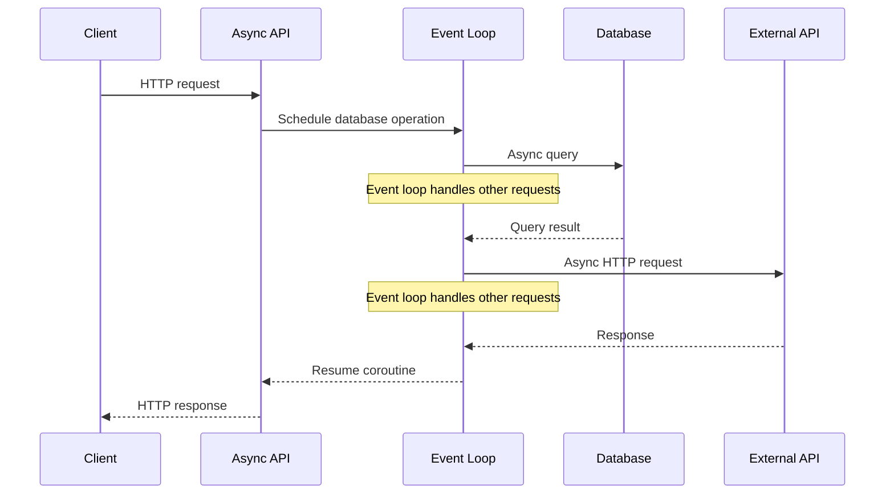
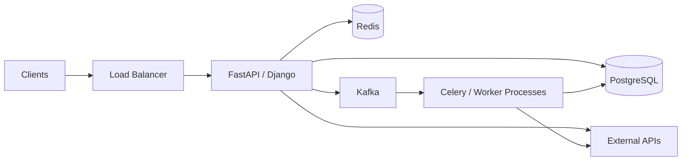

# 06- Sync vs Async

## Overview

Synchronous and asynchronous execution are architectural choices that determine how a backend service spends time waiting for I/O, executes work, manages concurrency, and handles client requests.

The distinction is often oversimplified as:

```text
Sync  = slow
Async = fast
```

That is incorrect.

Synchronous execution can be highly effective for CPU-bound work or simple request flows. Asynchronous execution is particularly valuable when a service spends significant time waiting for I/O such as databases, HTTP services, object storage, message brokers, or network operations.

The important system-design question is not:

> "Should this application use async?"

It is:

> "Where does concurrency improve throughput or latency, and what execution model best matches the workload?"

A production backend commonly contains both models:

```text
                         Client
                           |
                           v
                    Load Balancer
                           |
                           v
                 +-------------------+
                 | Django / FastAPI  |
                 +---------+---------+
                           |
              +------------+-------------+
              |                          |
              v                          v
        Synchronous Work           Asynchronous Work
              |                          |
              v                          v
        PostgreSQL                  Celery / Kafka
              |                          |
              |                          v
              |                     Background Workers
              |                          |
              +------------+-------------+
                           |
                           v
                    External Services
```

Async is therefore not a replacement for synchronous programming. It is one tool for controlling concurrency and resource utilization.

---

## Synchronous Execution

### What It Is

In synchronous execution, an operation generally completes before the execution flow proceeds to the next operation.

For example:

```python
def process_order(order_id: int) -> dict:
    order = load_order(order_id)
    payment = charge_payment(order)
    send_confirmation(payment)

    return {
        "order_id": order_id,
        "status": "completed",
    }
```

The execution flow is:

```text
load order
    |
    v
charge payment
    |
    v
send confirmation
    |
    v
return response
```

Each operation blocks the current execution flow until it completes.

### Why It Exists

Synchronous execution is simple to reason about.

It is often the right choice when:

- operations are naturally sequential
- dependencies must execute in order
- concurrency provides little benefit
- the workload is CPU-bound
- simplicity is more valuable than maximum concurrency
- the framework or library ecosystem is primarily synchronous

---

## Asynchronous Execution

### What It Is

Asynchronous execution allows an execution context to suspend while waiting for an operation and perform other work during that waiting period.

For example:

```python
async def process_order(order_id: int) -> dict:
    order = await load_order(order_id)
    payment = await charge_payment(order)
    await send_confirmation(payment)

    return {
        "order_id": order_id,
        "status": "completed",
    }
```

The important point is that `await` does not mean:

> "Run this operation in another thread."

It means the coroutine can suspend while waiting for an awaitable operation to complete, allowing the event loop to run other eligible tasks.

---

## Blocking vs Non-Blocking I/O

This distinction is more important than the words "sync" and "async."

### Blocking I/O

Consider:

```python
response = requests.get(url)
```

While the operation waits for the network response, the current thread is blocked.

Conceptually:

```text
Thread
 |
 +---- HTTP request
 |
 |    WAITING
 |
 +---- response received
 |
 +---- continue
```

### Non-Blocking I/O

An asynchronous HTTP client can instead allow the event loop to perform other work while the network operation is pending.

```python
response = await client.get(url)
```

Conceptually:

```text
Event Loop
 |
 +---- Task A -> HTTP request -> WAIT
 |
 +---- Task B -> execute
 |
 +---- Task C -> execute
 |
 +---- Task A -> response ready -> continue
```

This is why async systems can efficiently handle large numbers of concurrent I/O-bound operations.

---

## CPU-Bound vs I/O-Bound Work

The workload determines whether async is useful.

| Workload | Typical Characteristics | Async Benefit |
|---|---|---|
| Database queries | I/O-bound | High |
| HTTP API calls | I/O-bound | High |
| S3/object storage | I/O-bound | High |
| Redis operations | I/O-bound | High |
| Kafka/network operations | I/O-bound | High |
| File/network operations | I/O-bound | High |
| JSON serialization | CPU-bound | Limited |
| Image processing | CPU-bound | Low |
| ML inference on CPU | CPU-bound | Low |
| Compression | CPU-bound | Low |
| Complex calculations | CPU-bound | Low |

Async primarily improves concurrency during waiting.

It does not make CPU instructions execute faster.

---

## Why Async Helps With I/O

Consider a service receiving 1,000 concurrent requests.

Each request performs:

```text
Database query
    |
    | 50 ms waiting
    v
External API
    |
    | 100 ms waiting
    v
Response
```

A synchronous worker may spend significant time blocked.

An asynchronous server can use the waiting periods more efficiently:

```text
Request 1 -> DB -> WAIT
Request 2 -> DB -> WAIT
Request 3 -> External API -> WAIT
Request 4 -> DB -> WAIT
Request 5 -> Process
...
```

The event loop schedules work that is ready to execute instead of requiring one blocked thread per waiting operation.

---

## Event Loop

The event loop is central to many asynchronous Python applications.

A simplified model is:

```text
                    +----------------+
                    |   Event Loop   |
                    +-------+--------+
                            |
             +--------------+--------------+
             |              |              |
             v              v              v
          Task A          Task B          Task C
             |              |              |
             v              v              v
          Network        Database        Redis
           wait            wait           wait
             |              |              |
             +--------------+--------------+
                            |
                            v
                    Ready callbacks
                            |
                            v
                      Resume tasks
```

The event loop repeatedly:

1. checks which asynchronous operations are ready
2. resumes eligible coroutines
3. schedules new asynchronous work
4. waits for I/O events
5. resumes suspended tasks when their operations complete

Python's `asyncio` provides the core asynchronous execution model used by frameworks such as FastAPI.

---

## Coroutine

A coroutine is a function that can suspend and resume execution.

Example:

```python
import asyncio


async def fetch_data():
    await asyncio.sleep(1)
    return "data"
```

Calling the function does not immediately execute the complete function:

```python
coroutine = fetch_data()
```

It produces a coroutine object that must be scheduled or awaited.

```python
result = await fetch_data()
```

The `await` expression allows the coroutine to suspend until the awaited operation completes.

---

## Sequential Async vs Concurrent Async

This distinction is critical.

Consider:

```python
async def process():
    a = await fetch_a()
    b = await fetch_b()

    return a, b
```

Although this code is asynchronous, `fetch_a()` and `fetch_b()` execute sequentially.

The flow is:

```text
fetch_a
   |
   v
wait
   |
   v
fetch_b
   |
   v
wait
```

If the operations are independent, they can often execute concurrently.

```python
import asyncio


async def process():
    a, b = await asyncio.gather(
        fetch_a(),
        fetch_b(),
    )

    return a, b
```

Now the conceptual flow becomes:

```text
fetch_a ----\
             +---- wait for both ----> result
fetch_b ----/
```

This can significantly reduce total latency.

If:

```text
fetch_a = 100 ms
fetch_b = 150 ms
```

Sequential execution is approximately:

```text
100 + 150 = 250 ms
```

Concurrent execution can approach:

```text
max(100, 150) = 150 ms
```

excluding scheduling and network overhead.

---

## Concurrency vs Parallelism

These concepts should not be confused.

### Concurrency

Concurrency means multiple tasks can make progress during overlapping periods.

```text
Task A: |----wait----|--work--|
Task B: |--work--|---wait----|
```

### Parallelism

Parallelism means multiple computations execute simultaneously on multiple execution resources.

```text
CPU Core 1: |---- Task A ----|
CPU Core 2: |---- Task B ----|
```

Async programming primarily provides concurrency.

It does not automatically provide CPU parallelism.

---

## Python's GIL and Async

In standard CPython, the Global Interpreter Lock (GIL) historically prevents multiple threads from executing Python bytecode simultaneously within the same interpreter.

Async programming does not remove this constraint.

Instead, async works well because I/O operations release control while waiting.

Therefore:

```text
Async + I/O-bound workload
        |
        v
Excellent fit
```

while:

```text
Async + CPU-heavy Python workload
        |
        v
Not a substitute for multiprocessing or distributed workers
```

For CPU-heavy work, consider:

- multiprocessing
- process pools
- Celery workers
- distributed task processing
- specialized compute services

---

## Django and Synchronous Execution

Traditional Django applications commonly use synchronous views.

```python
from django.http import JsonResponse


def health_check(request):
    return JsonResponse({"status": "ok"})
```

A synchronous view is perfectly valid for many applications.

If the view performs synchronous database operations:

```python
def get_user(request, user_id):
    user = User.objects.get(id=user_id)

    return JsonResponse({
        "id": user.id,
        "name": user.name,
    })
```

the request executes synchronously.

This is often appropriate when the Django application and its dependencies are synchronous.

---

## Django Async Views

Modern Django supports asynchronous views.

```python
from django.http import JsonResponse


async def health_check(request):
    return JsonResponse({"status": "ok"})
```

However, making a view `async` does not automatically make every operation inside it asynchronous.

This is a common mistake.

For example:

```python
async def view(request):
    result = some_blocking_library()
    return JsonResponse(result)
```

If `some_blocking_library()` blocks the event loop, the async endpoint can still suffer from poor concurrency.

The entire dependency chain matters.

---

## FastAPI and Async

FastAPI is designed to work well with asynchronous Python.

```python
from fastapi import FastAPI

app = FastAPI()


@app.get("/users/{user_id}")
async def get_user(user_id: int):
    user = await repository.get_user(user_id)
    return user
```

The benefit is strongest when the dependencies are also asynchronous:

```text
FastAPI
   |
   v
async repository
   |
   v
async database driver
   |
   v
PostgreSQL
```

Using synchronous dependencies incorrectly inside an async path can negate the benefits.

---

## Async Dependency Chain

A common production architecture is:

```text
HTTP Request
     |
     v
FastAPI
     |
     v
Service Layer
     |
     v
Async Repository
     |
     v
Async PostgreSQL Driver
     |
     v
PostgreSQL
```

If one layer performs blocking work:

```text
FastAPI
   |
   v
async service
   |
   v
blocking library
   |
   X
Event loop blocked
```

the system can lose much of the concurrency benefit.

---

## Sync-over-Async and Async-over-Sync

### Sync-over-Async

A synchronous application may execute async work by creating or interacting with an event loop.

This can be useful at controlled boundaries, but repeatedly creating event loops or mixing execution models carelessly adds complexity.

### Async-over-Sync

An async endpoint calling blocking code is often more dangerous.

Example:

```python
@app.get("/data")
async def get_data():
    return requests.get("https://example.com").json()
```

The `requests` call is synchronous.

While it waits, it can block the event loop.

Prefer an async-compatible client:

```python
import httpx


@app.get("/data")
async def get_data():
    async with httpx.AsyncClient() as client:
        response = await client.get("https://example.com")
        response.raise_for_status()
        return response.json()
```

In production, the HTTP client should generally be managed with appropriate connection pooling rather than recreated for every request.

---

## Threading vs Asyncio

Both approaches can provide concurrency for I/O-bound work, but they operate differently.

| Dimension | Threading | Asyncio |
|---|---|---|
| Concurrency model | OS/runtime threads | Cooperative coroutines |
| Context switching | Thread scheduling | Coroutine scheduling |
| Memory overhead | Higher | Usually lower |
| Blocking code | Naturally supported | Must be isolated |
| Programming model | Often simpler for blocking libraries | Requires async-compatible stack |
| CPU parallelism in CPython | Limited by GIL for Python bytecode | No |
| Large I/O concurrency | Good | Excellent |
| Ecosystem compatibility | Very broad | Requires async-aware libraries |

Threads remain useful when:

- libraries are synchronous
- blocking operations cannot easily be replaced
- concurrency requirements are moderate
- integrating legacy code

Async is attractive when:

- many connections are concurrent
- operations are I/O-heavy
- libraries support async
- predictable resource usage matters

---

## Async Does Not Mean Faster

Suppose an endpoint performs:

```text
CPU calculation = 500 ms
```

Changing:

```python
def calculate():
    ...
```

to:

```python
async def calculate():
    ...
```

does not make the calculation faster.

If the event loop executes a CPU-heavy operation for 500 ms without yielding:

```text
Event Loop
 |
 +---- CPU-heavy task
 |
 | 500 ms blocked
 |
 +---- Other requests wait
```

This can actually hurt system-wide latency.

CPU-heavy operations should be moved to:

- worker processes
- Celery
- dedicated compute services
- multiprocessing
- specialized infrastructure

---

## Background Processing

One of the most important architectural distinctions is:

```text
Async request handling
```

versus:

```text
Asynchronous background processing
```

They are not the same.

An async HTTP handler might allow concurrent I/O:

```text
HTTP Request
   |
   v
FastAPI async handler
   |
   v
await external API
```

A background job means the request does not wait for the work:

```text
HTTP Request
   |
   v
API
   |
   +---- enqueue job ----> Celery/Kafka
   |
   v
HTTP 202 Accepted

Worker
   |
   v
Perform work
```

For long-running operations, background processing is often more appropriate than keeping an HTTP request open.

---

## Celery for Background Work

A Django application might handle report generation using Celery:

```python
from celery import shared_task


@shared_task
def generate_report(report_id: int) -> None:
    generate_large_report(report_id)
```

The HTTP endpoint can enqueue the job:

```python
def request_report(request, report_id: int):
    generate_report.delay(report_id)

    return JsonResponse(
        {"status": "accepted"},
        status=202,
    )
```

This changes the request lifecycle:

```text
Client
  |
  v
Django
  |
  +---- Queue Job ----> Redis/RabbitMQ
  |
  v
202 Accepted

Worker
  |
  v
Generate Report
  |
  v
Store Result
```

The client can later query job status or receive an event when the operation completes.

---

## Async HTTP Request Lifecycle

Consider an API that calls three independent services:

```text
Client
  |
  v
API
  |
  +---- Service A
  |
  +---- Service B
  |
  +---- Service C
  |
  v
Response
```

A sequential implementation may produce:

```text
A: 100 ms
B: 150 ms
C: 200 ms

Total ≈ 450 ms
```

Concurrent asynchronous execution can approach:

```text
max(100, 150, 200)
≈ 200 ms
```

assuming the services are independent and the system has enough connection capacity.

---

## Request Lifecycle With Async



The important architectural property is that the event loop does not need to remain idle while the network operation is pending.

---

## Timeouts

Async systems require explicit timeouts.

Do not allow an external dependency to block indefinitely.

Example:

```python
import httpx


async def fetch_customer(customer_id: str):
    timeout = httpx.Timeout(
        connect=2.0,
        read=5.0,
        write=5.0,
        pool=2.0,
    )

    async with httpx.AsyncClient(timeout=timeout) as client:
        response = await client.get(
            f"https://customer-service.internal/customers/{customer_id}"
        )
        response.raise_for_status()
        return response.json()
```

Timeouts protect:

- event-loop capacity
- connection pools
- request latency
- worker capacity
- downstream services

A timeout should be based on the service-level latency budget rather than an arbitrary large value.

---

## Connection Pooling

Async applications can create very high concurrency.

That does not mean they should create unlimited connections.

For example:

```text
10,000 concurrent requests
        |
        X
10,000 PostgreSQL connections
```

This can destroy the database.

Instead:

```text
10,000 HTTP requests
        |
        v
Application
        |
        v
Bounded DB connection pool
        |
        v
PostgreSQL
```

The application may have thousands of concurrent requests while maintaining a controlled number of database connections.

Concurrency and downstream connection capacity must be designed independently.

---

## Backpressure

Backpressure prevents a fast producer from overwhelming a slower consumer.

Example:

```text
10,000 incoming requests/sec
          |
          v
       API layer
          |
          v
     500 DB connections
          |
          X
      Saturation
```

Async systems can make this problem worse if concurrency is allowed to grow without bounds.

Use:

- bounded queues
- connection pool limits
- semaphores
- rate limits
- request shedding
- circuit breakers
- worker limits

Example:

```python
import asyncio

semaphore = asyncio.Semaphore(100)


async def call_downstream():
    async with semaphore:
        return await perform_request()
```

This limits concurrent downstream operations.

---

## Structured Concurrency

Production async applications should avoid uncontrolled task creation.

Bad:

```python
for item in items:
    asyncio.create_task(process(item))
```

If `items` contains millions of entries, this can create excessive memory and scheduling pressure.

Prefer bounded concurrency.

Conceptually:

```text
Input
 |
 v
Bounded worker pool
 |
 +---- Worker 1
 +---- Worker 2
 +---- Worker 3
 +---- Worker N
 |
 v
Results
```

Modern Python provides structured concurrency primitives such as `asyncio.TaskGroup` for managing related tasks.

```python
import asyncio


async def process_all(items):
    async with asyncio.TaskGroup() as group:
        for item in items:
            group.create_task(process(item))
```

Task creation should still be bounded when the input size can be large.

---

## Error Handling With Concurrent Tasks

Concurrent operations introduce partial failure.

Suppose:

```text
Service A -> success
Service B -> timeout
Service C -> success
```

The application must decide whether to:

- fail the entire request
- return partial results
- retry B
- use cached data
- return a degraded response

This is a system-design decision, not merely an async-programming decision.

For example:

```text
Product API
 |
 +---- Catalog Service -> required
 |
 +---- Recommendation Service -> optional
 |
 +---- Analytics Service -> optional
```

A recommendation timeout should not necessarily cause the entire product page to fail.

---

## Cancellation

Cancellation is important in asynchronous systems.

If a client disconnects or a request deadline is exceeded, continuing unnecessary downstream work wastes resources.

Conceptually:

```text
Client
  |
  X disconnect
  |
  v
API cancellation
  |
  +---- Cancel downstream work
  |
  +---- Release connections
  |
  +---- Stop unnecessary computation
```

Production code should propagate cancellation correctly rather than swallowing cancellation exceptions or converting every cancellation into a generic error.

---

## Retries

Async execution can create large retry storms.

Consider:

```text
1000 requests
    |
    v
Downstream failure
    |
    v
1000 retries
    |
    v
More downstream overload
    |
    v
More failures
```

Use:

- bounded retry counts
- exponential backoff
- jitter
- timeout budgets
- circuit breakers

Retries must fit inside the original request's latency budget.

---

## Async and Kafka

Async application code and Kafka solve different problems.

Async:

```text
How can one process handle concurrent I/O efficiently?
```

Kafka:

```text
How can systems exchange durable, scalable event streams?
```

They can be used together:

```text
FastAPI
   |
   v
Async Kafka Producer
   |
   v
Kafka
   |
   v
Consumer Group
   |
   v
Workers
```

An async Kafka producer can prevent the API process from unnecessarily blocking while communicating with Kafka, but Kafka itself provides the durability and event-streaming architecture.

---

## Async and gRPC

gRPC also supports asynchronous communication patterns.

A service might use:

```text
FastAPI
   |
   v
Async gRPC Client
   |
   v
Inventory Service
```

This is useful when a request depends on multiple internal services.

For example:

```text
API
 |
 +---- gRPC -> Inventory
 |
 +---- gRPC -> Pricing
 |
 +---- gRPC -> Customer
 |
 v
Aggregate Response
```

Independent calls can potentially execute concurrently.

---

## Sync vs Async Comparison

| Dimension | Synchronous | Asynchronous |
|---|---|---|
| Programming model | Sequential/blocking | Cooperative concurrency |
| I/O concurrency | Moderate | High |
| CPU-bound work | Good fit | Poor fit without offloading |
| Complexity | Lower | Higher |
| Debugging | Usually simpler | More complex |
| Blocking libraries | Natural | Must be isolated |
| Resource efficiency for high I/O concurrency | Lower | Higher |
| Cancellation | Simpler | Important and explicit |
| Backpressure | Important | Critical |
| Connection management | Important | Critical |
| Best use case | Simple/CPU-bound/sequential workflows | High-concurrency I/O workloads |

---

## Choosing Sync or Async

A practical decision process is:

```text
                 Workload
                    |
          +---------+---------+
          |                   |
       CPU-bound           I/O-bound
          |                   |
          v                   v
    Sync / Workers       High concurrency?
                              |
                    +---------+---------+
                    |                   |
                   No                  Yes
                    |                   |
                    v                   v
                  Sync              Async
```

Choose synchronous execution when:

- the application has modest concurrency
- dependencies are synchronous
- operations are mostly sequential
- simplicity is valuable
- CPU-heavy work dominates

Choose asynchronous execution when:

- requests spend substantial time waiting for I/O
- many concurrent connections are expected
- dependencies support async APIs
- latency can be reduced through concurrent I/O
- the team can operate and debug async systems effectively

---

## Production Architecture

A realistic backend can combine all execution models:



The architecture does not need to be entirely synchronous or entirely asynchronous.

A mature system uses the appropriate execution model at each boundary.

---

## Migration From Sync to Async

Do not rewrite an entire application as async simply because async is available.

A safer migration strategy is:

1. Identify I/O-bound bottlenecks.
2. Measure current latency and throughput.
3. Identify blocking dependencies.
4. Replace or isolate blocking libraries.
5. Introduce async endpoints selectively.
6. Measure event-loop utilization and downstream connection usage.
7. Add concurrency limits and timeouts.
8. Load test under realistic traffic.
9. Roll out incrementally.

Migration should be driven by measurable bottlenecks.

---

## Production Considerations

### Observability

Track:

- request latency
- event-loop lag
- downstream latency
- timeout rates
- cancellation rates
- connection pool utilization
- queue depth
- task counts
- retry rates
- error rates

An async service can appear healthy while its event loop is blocked by a synchronous dependency.

### Resource Limits

Define limits for:

- concurrent requests
- database connections
- HTTP connections
- background tasks
- queue depth
- message consumption
- memory

Unlimited concurrency is usually a failure mode.

### Graceful Shutdown

When deploying an async service:

```text
SIGTERM
   |
   v
Stop accepting new requests
   |
   v
Allow active requests to finish
   |
   v
Cancel/finish background tasks
   |
   v
Close connection pools
   |
   v
Process exits
```

Kubernetes deployments especially benefit from correct readiness, termination, and graceful shutdown behavior.

---

## Common Mistakes

### Making Everything Async

Changing every function to `async def` does not automatically improve performance.

Async should follow workload characteristics.

### Blocking the Event Loop

Calling synchronous network libraries from async code can block every other coroutine sharing the event loop.

### Creating Unlimited Tasks

Large numbers of `asyncio.create_task()` calls can exhaust memory and downstream resources.

### Ignoring Connection Limits

Thousands of concurrent coroutines do not justify thousands of database connections.

### Assuming Async Means Parallel

Async provides concurrency, not automatic CPU parallelism.

### Ignoring Cancellation

Continuing expensive work after the client has disconnected wastes resources.

### Retrying Without Limits

Retries can amplify outages and create retry storms.

### Using Async for CPU-Bound Work

CPU-heavy operations can block the event loop.

Offload them to worker processes or dedicated compute infrastructure.

---

## Interview Traps

### "Async Makes APIs Faster"

Not inherently.

Async primarily improves resource utilization and concurrency for I/O-bound workloads.

### "Asyncio Uses Multiple Threads"

Not by default.

An asyncio event loop generally executes coroutines cooperatively within a thread. Additional threads or processes can be introduced separately.

### "Async Means Parallel Execution"

No.

Concurrency and parallelism are different concepts.

### "FastAPI Is Always Faster Than Django"

Framework performance depends on the workload, implementation, dependencies, database behavior, deployment model, and concurrency characteristics.

### "A Database Query Is Async Because the API Is Async"

Not necessarily.

The database driver and ORM execution path must support asynchronous operation or the blocking work must be isolated appropriately.

### "More Concurrency Is Always Better"

No.

Unlimited concurrency can overwhelm:

- PostgreSQL
- Redis
- external APIs
- network connections
- CPU
- memory

The correct target is controlled concurrency.

---

## Practical Checklist

Before introducing async into a backend service, verify:

- [ ] Is the workload primarily I/O-bound?
- [ ] Are concurrent requests high enough to justify additional complexity?
- [ ] Do database drivers support the required async model?
- [ ] Do HTTP clients support async?
- [ ] Are Redis operations non-blocking?
- [ ] Are synchronous dependencies isolated?
- [ ] Are connection pools bounded?
- [ ] Are request and downstream timeouts configured?
- [ ] Is concurrency bounded?
- [ ] Is cancellation handled correctly?
- [ ] Are retries bounded and jittered?
- [ ] Is backpressure implemented?
- [ ] Are CPU-heavy operations offloaded?
- [ ] Is graceful shutdown implemented?
- [ ] Are event-loop blocking and latency observable?
- [ ] Has the service been load tested?
- [ ] Does the architecture actually benefit from async?

## Key Takeaways

- **Async is primarily a concurrency model for efficiently handling I/O-bound workloads; it does not automatically make code faster or provide CPU parallelism.**
- **The entire dependency chain matters: an async FastAPI or Django endpoint can still behave poorly if it calls blocking database, HTTP, filesystem, or CPU-bound operations.**
- **Production async systems require bounded concurrency, connection pools, timeouts, cancellation, backpressure, and controlled retries to prevent downstream resource exhaustion.**
- **Synchronous request handling, asynchronous I/O, and asynchronous background processing are different architectural concepts and can coexist in the same backend system.**
- **Choose sync or async based on measurable workload characteristics, concurrency requirements, dependency support, operational complexity, and system-level resource constraints.**