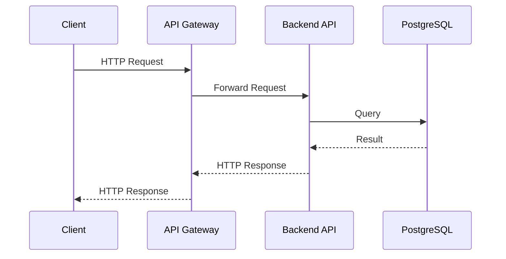
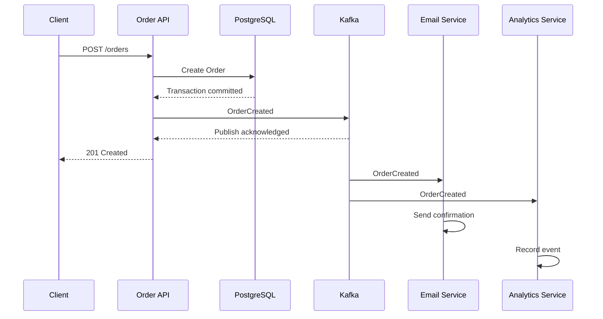
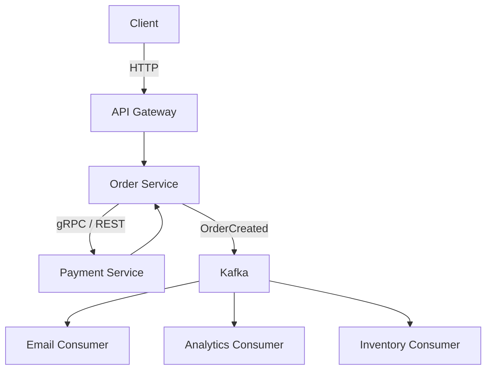
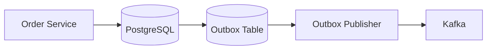

# 08- Event Driven vs Request Response

## Overview

Request-response and event-driven architectures are two fundamental ways services communicate in distributed systems.

In a **request-response architecture**, one component explicitly sends a request to another component and waits for a response.

```text
Client
  |
  | HTTP request
  v
API Service
  |
  | request
  v
Order Service
  |
  | response
  v
API Service
  |
  | HTTP response
  v
Client
```

In an **event-driven architecture**, a producer publishes an event describing something that happened. Consumers independently receive and process that event.

```text
Order Service
      |
      | OrderCreated
      v
   Kafka
    / \
   /   \
  v     v
Email  Analytics
Service Service
```

The architectural distinction is primarily about **coupling, timing, ownership, and failure handling**.

Request-response is generally appropriate when the caller needs an immediate answer. Event-driven communication is valuable when work can be decoupled from the initiating request, when multiple consumers need the same information, or when asynchronous processing improves scalability and resilience.

Modern systems commonly use both:

```text
                    +----------------+
                    |    Client      |
                    +-------+--------+
                            |
                         REST/gRPC
                            |
                            v
                    +---------------+
                    |  API Service  |
                    +-------+-------+
                            |
                  +---------+---------+
                  |                   |
             Request/Response       Event
                  |                   |
                  v                   v
             User Service          Kafka
                                      |
                           +----------+----------+
                           |          |          |
                           v          v          v
                        Email     Analytics   Search
```

The goal is not to choose one architecture globally. The goal is to choose the communication model appropriate for each interaction.

---

## Request-Response Architecture

### What It Is

Request-response is a synchronous interaction pattern in which a caller invokes another component and expects a response.

Typical technologies include:

- HTTP/REST
- gRPC
- GraphQL
- database queries
- synchronous RPC mechanisms

A simplified HTTP interaction is:

```text
Client
  |
  | POST /orders
  v
Order API
  |
  | INSERT order
  v
PostgreSQL
  |
  | result
  v
Order API
  |
  | HTTP 201
  v
Client
```

The caller controls the interaction and usually remains blocked or logically waiting until the operation completes or times out.

---

## Why Request-Response Exists

Many operations inherently require an immediate answer.

Examples:

- authenticate a user
- retrieve account information
- validate a payment
- fetch an order
- calculate a price
- submit a synchronous command
- check authorization
- retrieve inventory availability

If a client asks:

```http
GET /orders/123
```

it normally expects:

```json
{
  "id": 123,
  "status": "shipped"
}
```

An event is not a natural replacement for this interaction because the client needs a direct answer.

---

## Request-Response Lifecycle

A typical REST request:



The request lifecycle introduces dependencies between components.

If:

```text
API -> User Service -> Database
```

then the API's response time may depend on the User Service and its database.

---

## Advantages of Request-Response

### Immediate Feedback

The caller receives a result immediately.

This is important for:

- interactive APIs
- validation
- authentication
- reads
- synchronous commands

### Simpler Mental Model

The control flow is straightforward:

```text
call()
  -> process()
  -> return result
```

### Easier Debugging

A request can often be traced through a relatively direct call chain.

### Stronger Immediate Consistency

When a request updates a database and returns only after the transaction succeeds, the caller has a clear indication of the operation's result.

This does not automatically guarantee global consistency across distributed services.

---

## Limitations of Request-Response

### Temporal Coupling

Both systems need to be available at the same time.

```text
Service A
   |
   | request
   X
Service B unavailable
```

The caller cannot complete the operation if the dependency is unavailable.

### Latency Propagation

Consider:

```text
API
 |
 +--> User Service: 100 ms
 |
 +--> Payment Service: 300 ms
 |
 +--> Inventory Service: 200 ms
```

Sequential dependencies can result in:

```text
Total latency ≈ 100 + 300 + 200 = 600 ms
```

Parallel calls can reduce latency, but increase concurrency and failure-management complexity.

### Cascading Failures

If a dependency becomes slow:

```text
Database slow
    |
    v
Service B slow
    |
    v
Service A threads/connections occupied
    |
    v
Service A becomes overloaded
    |
    v
Upstream failures
```

This is a classic distributed-system failure mode.

---

## Synchronous Communication Does Not Mean "No Queue"

A request-response system may still use internal queues, connection pools, caching, or asynchronous processing.

The important characteristic is that the **caller expects a response as part of the interaction**.

For example:

```text
HTTP request
   |
   v
API
   |
   +---- Redis
   |
   +---- PostgreSQL
   |
   v
HTTP response
```

The architecture remains request-response even though internal infrastructure may be asynchronous.

---

## Event-Driven Architecture

### What It Is

An event-driven architecture communicates through events representing facts that have occurred.

Examples:

```text
UserRegistered
OrderCreated
PaymentCaptured
ShipmentDispatched
InvoiceGenerated
```

A producer publishes an event:

```text
Order Service
      |
      | OrderCreated
      v
   Message Broker
```

Consumers process the event independently:

```text
                  OrderCreated
                       |
                       v
                    Kafka
                  /   |   \
                 /    |    \
                v     v     v
             Email  Search  Analytics
```

The producer does not necessarily know which consumers exist.

---

## Why Event-Driven Architecture Exists

Events reduce direct coupling between producers and consumers.

Without events:

```text
Order Service
   |
   +--> Email Service
   |
   +--> Analytics Service
   |
   +--> Search Service
   |
   +--> Notification Service
```

The Order Service becomes responsible for coordinating many dependencies.

With events:

```text
Order Service
      |
      v
 OrderCreated
      |
      v
    Kafka
   / | | \
  v  v v  v
Email Search Analytics Notification
```

The Order Service only publishes the fact that the order was created.

Consumers independently decide what that event means to them.

---

## Event Anatomy

A production event should contain enough information for consumers to process it reliably.

Example:

```json
{
  "event_id": "01J8Y2T7M5B6FJ6V8Q4K2X9D3A",
  "event_type": "OrderCreated",
  "event_version": 1,
  "occurred_at": "2026-08-23T14:32:10Z",
  "producer": "order-service",
  "aggregate_id": "order-12345",
  "data": {
    "order_id": "order-12345",
    "customer_id": "customer-456",
    "total_amount": 2499.00,
    "currency": "INR"
  }
}
```

Useful metadata includes:

- event ID
- event type
- schema version
- timestamp
- producer
- aggregate/entity ID
- correlation ID
- trace ID
- payload

Avoid placing unnecessary mutable state into events.

---

## Event Types

### Domain Events

Describe something that happened in the business domain.

Examples:

```text
OrderCreated
PaymentCaptured
SubscriptionCancelled
UserRegistered
```

### Integration Events

Events intended to communicate information between services.

They should generally be treated as public contracts between producers and consumers.

### Commands vs Events

A command expresses intent:

```text
CreateOrder
```

An event expresses a fact:

```text
OrderCreated
```

This distinction matters.

```text
Command:
"Please do this."

Event:
"This already happened."
```

Commands can have one intended handler.

Events can have zero, one, or many consumers.

---

## Event-Driven Request Lifecycle

Consider an order creation workflow:



The API does not need to wait for email or analytics processing.

This can dramatically reduce user-facing latency.

---

## Asynchronous Processing

A common backend architecture is:

```text
HTTP Request
     |
     v
API Service
     |
     | enqueue
     v
Kafka / Queue
     |
     +---- Worker 1
     +---- Worker 2
     +---- Worker 3
```

Examples include:

- Celery with Redis/RabbitMQ
- Kafka consumers
- AWS SQS consumers
- background worker systems

The client receives a response before the asynchronous work necessarily finishes.

---

## Advantages of Event-Driven Architecture

### Loose Coupling

The producer does not need direct dependencies on every consumer.

### Independent Scaling

Consumers can scale independently.

```text
Kafka
 |
 +---- Email Consumer x 2
 |
 +---- Analytics Consumer x 20
 |
 +---- Search Consumer x 5
```

### Resilience

A consumer can temporarily fail while events remain available for later processing, depending on the broker and retention configuration.

### Fan-Out

One event can trigger many independent workflows.

```text
OrderCreated
   |
   +--> Email
   +--> Fraud Detection
   +--> Analytics
   +--> Search
   +--> Notification
```

### Temporal Decoupling

The producer and consumer do not necessarily need to be available simultaneously.

---

## Limitations of Event-Driven Architecture

### Eventual Consistency

Consumers may process events later.

```text
Order Created
     |
     v
Order DB updated
     |
     | milliseconds/seconds later
     v
Search index updated
```

The order may exist in PostgreSQL while not yet appearing in the search index.

### Operational Complexity

You must reason about:

- retries
- duplicates
- ordering
- partitioning
- consumer lag
- dead-letter handling
- schema evolution
- replay
- observability

### Harder Debugging

A single user action can trigger many asynchronous workflows.

Tracing:

```text
Request
  |
  v
Event
  |
  +--> Consumer A
  |
  +--> Consumer B
  |
  +--> Consumer C
```

requires correlation IDs and distributed tracing.

### Duplicate Processing

Most production messaging systems should be designed with the assumption that messages may be delivered more than once.

Consumers therefore need idempotency.

---

## Request-Response vs Event-Driven

| Dimension | Request-Response | Event-Driven |
|---|---|---|
| Communication | Direct | Broker-mediated |
| Timing | Usually synchronous | Usually asynchronous |
| Coupling | Higher | Lower |
| Immediate response | Strong | Not inherent |
| Availability dependency | Caller and dependency often both needed | Producer can often continue after publication |
| Consistency | Easier to provide immediate result | Often eventual |
| Fan-out | More explicit | Natural |
| Scaling consumers | More coupled | Independent |
| Retry handling | Caller/service responsibility | Broker/consumer patterns |
| Debugging | Generally simpler | More distributed |
| Ordering | Request sequence | Broker-dependent |
| Replay | Usually not native | Often possible |
| Failure model | Timeouts/cascading failures | Retries/duplicates/lag |
| Best for | Queries and immediate commands | Events and background workflows |

---

## When to Use Request-Response

Use request-response when the caller needs an immediate answer.

Typical examples:

| Use Case | Preferred Pattern |
|---|---|
| Get user profile | REST/gRPC |
| Authenticate request | Request-response |
| Validate authorization | Request-response |
| Retrieve order | REST/gRPC |
| Calculate price | Request-response |
| Synchronous inventory check | Request-response |
| Submit simple CRUD operation | Request-response |
| Internal service query | gRPC/REST |

For example:

```text
GET /users/123
```

should not normally be modeled as:

```text
Publish GetUserRequested
Wait for event
Listen for UserResponse
```

That would add unnecessary distributed-system complexity.

---

## When to Use Event-Driven Architecture

Use events when the work can happen independently from the initiating request.

Typical examples:

| Use Case | Preferred Pattern |
|---|---|
| Send email after registration | Event |
| Update analytics | Event |
| Generate thumbnails | Event |
| Update search index | Event |
| Process audit events | Event |
| Trigger downstream workflows | Event |
| Data pipeline processing | Event |
| Long-running background jobs | Event/queue |
| Fan-out notifications | Event |

A user registration request might become:

```text
POST /users
     |
     v
User Service
     |
     v
UserCreated
     |
     v
Kafka
  /  |  \
 v   v   v
Email Audit Analytics
```

---

## Hybrid Architecture

Most production systems should combine both approaches.

Consider an e-commerce platform:



The interaction boundaries are different:

```text
Client -> Order Service
    Request-response

Order Service -> Payment Service
    Request-response

Order Service -> Kafka
    Event publication

Kafka -> Email Service
    Asynchronous event consumption
```

This is generally more realistic than attempting to make an entire system purely synchronous or purely event-driven.

---

## Choosing the Boundary

A useful architectural question is:

> Does the caller need the result before it can continue?

If yes:

```text
Request -> Service -> Response
```

If no:

```text
Request -> Service -> Event -> Consumers
```

Another useful question is:

> Is this interaction a query, a command, or a fact?

```text
Query
  |
  v
Request-response

Command requiring immediate result
  |
  v
Request-response

Fact that occurred
  |
  v
Event
```

This is not absolute, but it is a useful starting point.

---

## Eventual Consistency

Event-driven systems often introduce eventual consistency.

Suppose:

```text
Order Service
    |
    v
PostgreSQL
```

is the source of truth.

The search index receives:

```text
OrderCreated
```

later.

Therefore:

```text
PostgreSQL:
Order exists

Search:
Order not yet indexed
```

This is acceptable when the search index is a derived representation.

It is dangerous when a downstream system is incorrectly treated as the authoritative source.

---

## Idempotency

Consumers must often handle duplicate events safely.

Suppose Kafka delivers:

```text
PaymentCaptured
PaymentCaptured
```

The consumer must avoid charging the customer twice.

A common pattern is an inbox/idempotency table:

```text
processed_events
-------------------------
event_id       processed_at
evt-123        timestamp
```

Processing logic:

```text
Receive event
    |
    v
Check event_id
    |
    +---- Already processed -> Ignore
    |
    +---- New -> Process
                  |
                  v
             Record event_id
```

Idempotency is one of the most important concepts in production event-driven systems.

---

## Transactional Outbox

A common failure occurs when a service performs a database update and publishes an event separately.

Naive implementation:

```text
BEGIN
  INSERT order
COMMIT

Publish OrderCreated
```

If the service crashes between `COMMIT` and `Publish`:

```text
Database:
Order exists

Kafka:
OrderCreated missing
```

The system is inconsistent.

A transactional outbox addresses this:



The order and event record are committed in the same database transaction:

```text
BEGIN

INSERT INTO orders ...

INSERT INTO outbox_events ...

COMMIT
```

A separate publisher reads the outbox and publishes events.

This provides a much stronger reliability model than dual-writing independently.

---

## Event Ordering

Ordering is often misunderstood.

A broker may guarantee ordering only within a particular scope.

For Kafka, ordering is guaranteed within a partition.

If all events for an order use:

```text
key = order_id
```

they can be routed to the same partition.

```text
order-123
   |
   +--> OrderCreated
   +--> PaymentCaptured
   +--> OrderShipped
```

This helps preserve ordering for that key.

Do not assume global ordering across an entire distributed event system.

---

## Backpressure

Asynchronous systems can absorb bursts, but they do not eliminate work.

Suppose:

```text
Producer:
10,000 events/sec

Consumer:
2,000 events/sec
```

Then consumer lag increases:

```text
Kafka
 |
 +--> Consumer
        |
        v
     Lag grows
```

Backpressure should be monitored.

Possible responses include:

- increase consumer instances
- increase partitions where appropriate
- optimize processing
- batch operations
- reduce event payload size
- introduce rate limits
- prioritize workloads
- scale downstream dependencies

A queue hides load temporarily; it does not remove capacity requirements.

---

## Kafka vs Task Queues

Kafka and task queues overlap but have different architectural strengths.

### Kafka

Strong for:

- event streaming
- durable event history
- high-throughput pipelines
- replay
- multiple independent consumer groups
- event-driven integration

### Task Queues

Celery, SQS, and similar systems are often better suited to:

- background jobs
- task execution
- retries
- delayed processing
- worker-oriented workloads

Example:

```text
User uploads image
       |
       v
API
       |
       v
Task Queue
       |
       v
Image Worker
```

versus:

```text
OrderCreated
      |
      v
Kafka
 /    |    \
v     v     v
Email Search Analytics
```

Choose based on workload semantics rather than simply throughput.

---

## REST/gRPC vs Events

REST and gRPC are commonly used for synchronous service communication.

| Requirement | REST | gRPC | Events |
|---|---|---|---|
| Human/client-facing APIs | Excellent | Possible | Poor fit |
| Internal synchronous calls | Good | Excellent | Not applicable |
| Strong request/response contract | Good | Excellent | Different model |
| Streaming | Limited compared with gRPC | Strong | Native event streaming |
| Immediate response | Yes | Yes | No |
| Loose temporal coupling | No | No | Yes |
| Fan-out | Manual | Manual | Natural |
| Replay | No | No | Often yes |
| Event history | No | No | Often yes |

A common backend architecture is:

```text
External Clients
       |
      REST
       |
       v
API Services
       |
      gRPC
       |
       v
Internal Services
       |
     Events
       |
       v
Kafka
```

---

## Failure Handling

### Request-Response Failures

Common mechanisms:

- timeouts
- retries
- exponential backoff
- circuit breakers
- bulkheads
- fallback responses
- connection pooling

Never retry blindly.

For example:

```text
POST /payments
```

may not be safe to retry unless the operation is idempotent.

### Event-Driven Failures

Common mechanisms:

- consumer retries
- retry topics/queues
- dead-letter queues
- idempotent consumers
- poison-message handling
- consumer lag monitoring
- replay

The failure model is different:

```text
Request-response:
Request -> Timeout -> Retry

Event-driven:
Event -> Consumer failure -> Retry -> Success
```

---

## Retry Storms

A production system can become less reliable if retries are uncontrolled.

Example:

```text
Service B fails
     |
     v
Service A retries
     |
     v
Service B receives more traffic
     |
     v
Service B remains overloaded
```

Use:

- exponential backoff
- jitter
- bounded retries
- circuit breakers
- dead-letter handling
- rate limits

The same principle applies to event consumers.

---

## Security Considerations

Request-response systems should protect:

- authentication
- authorization
- TLS
- input validation
- rate limiting
- request size
- service identity

Event-driven systems additionally need to secure:

- broker authentication
- topic authorization
- encryption
- consumer identity
- schema validation
- sensitive event payloads
- retention policies

Do not publish sensitive information to a broad event topic simply because consumers currently need it.

Events can have long retention periods and many downstream consumers.

---

## Observability

Distributed event-driven architectures require strong correlation.

A useful metadata model includes:

```json
{
  "event_id": "evt-123",
  "correlation_id": "req-456",
  "trace_id": "trace-789"
}
```

Then:

```text
HTTP Request
   |
   | trace_id
   v
Order Service
   |
   | event_id
   v
Kafka
   |
   +--> Email Consumer
   |
   +--> Analytics Consumer
```

Monitor:

### Request-Response

- request rate
- latency
- error rate
- timeout rate
- dependency latency
- connection pool saturation

### Event-Driven

- consumer lag
- throughput
- processing latency
- retry rate
- dead-letter volume
- partition utilization
- consumer errors
- event age

---

## Data Ownership

Event-driven systems become difficult when multiple services mutate the same database.

Prefer:

```text
Order Service
    |
    v
Order Database
```

rather than:

```text
Order Service ----+
                  |
Payment Service --+--> Shared Database
                  |
Inventory Service-+
```

Each service should ideally own its data and publish events describing relevant state changes.

This does not mean every system must immediately adopt a separate database per service. The architectural principle is **clear ownership and controlled access**.

---

## Event Schema Evolution

Events become long-lived contracts.

Suppose version 1 publishes:

```json
{
  "order_id": "123",
  "amount": 100
}
```

Later version 2 needs:

```json
{
  "order_id": "123",
  "amount": 100,
  "currency": "INR"
}
```

Prefer backward-compatible evolution where possible.

Common strategies include:

- adding optional fields
- versioning schemas
- schema registries
- compatibility validation
- consumer migration periods

Avoid breaking existing consumers without an explicit migration strategy.

---

## Cost Considerations

Event-driven systems can introduce infrastructure costs through:

- brokers
- storage
- retained events
- replication
- network traffic
- consumer compute
- observability
- schema management

Request-response systems can incur cost through:

- larger always-on service fleets
- synchronous dependency capacity
- connection pools
- higher compute during traffic spikes
- cascading capacity requirements

Architecture should optimize for total operational cost rather than the cost of one component.

---

## Common Mistakes

### Making Everything Asynchronous

Not every operation benefits from events.

A simple:

```text
GET /users/123
```

does not need Kafka.

### Making Everything Synchronous

Long-running or independent work should not block an interactive request unnecessarily.

For example:

```text
POST /signup
   |
   +--> Create user
   +--> Send email
   +--> Generate analytics
   +--> Update search
   +--> Notify CRM
```

can become fragile.

Instead:

```text
POST /signup
      |
      v
Create User
      |
      v
UserCreated
      |
      +--> Email
      +--> Analytics
      +--> Search
      +--> CRM
```

### Assuming Exactly-Once Delivery

Design consumers for duplicate delivery unless the complete processing system provides and correctly uses stronger guarantees.

### Publishing Events Without Idempotency

Consumers should safely handle retries and duplicates.

### Dual-Writing Without an Outbox

Updating a database and publishing an event independently can create lost events.

### Ignoring Consumer Lag

A successful producer does not mean the downstream system is keeping up.

### Using Events for Queries

Events are generally not a replacement for a query API.

### Overloading Event Payloads

Large events increase:

- network usage
- storage
- processing cost
- schema coupling

Publish the information consumers actually need.

### Treating Eventual Consistency as an Implementation Detail

It is a user-visible architectural property.

If a user expects immediate visibility, the system must explicitly handle the delay.

---

## Interview Traps

### "Asynchronous Means Faster"

Not necessarily.

Asynchronous processing can reduce **request latency** by moving work outside the critical path, but total processing time may remain the same or increase.

### "Events Remove Coupling"

Events reduce certain forms of coupling, especially direct temporal coupling, but introduce:

- schema coupling
- semantic coupling
- operational coupling
- eventual consistency

### "Kafka Guarantees Message Ordering"

Kafka guarantees ordering within a partition, not arbitrary global ordering across all partitions.

### "Events Are Always Better for Microservices"

No.

Synchronous communication is often appropriate for request-time queries and operations requiring immediate responses.

### "Retries Guarantee Reliability"

Retries can make outages worse when they are uncontrolled.

Timeouts, backoff, jitter, idempotency, and bounded retry policies are necessary.

### "Event-Driven Systems Are Eventually Consistent Everywhere"

No.

A system can combine transactional operations and asynchronous workflows. Consistency depends on the specific data and boundary.

---

## Production Decision Framework

Use request-response when:

- the caller needs an immediate result
- the operation is naturally query-oriented
- validation must happen before responding
- authorization must be evaluated immediately
- synchronous consistency is important
- the dependency latency is acceptable

Use event-driven communication when:

- work can happen after the request
- multiple consumers need the same event
- consumers need independent scaling
- temporary consumer outages should not block producers
- replay or durable event history is valuable
- workloads are bursty
- eventual consistency is acceptable

Use a hybrid approach when:

```text
User-facing path
        |
    REST/gRPC
        |
        v
Synchronous core operation
        |
        v
      Event
        |
   +----+----+----+
   |    |    |    |
   v    v    v    v
Email Search Audit Analytics
```

This is one of the most common patterns in production distributed systems.

---

## Practical Architecture Example

Consider an order platform.

The user submits:

```http
POST /orders
```

The synchronous path should perform only the work required to establish the order's authoritative state:

```text
Client
  |
  v
API
  |
  v
Order Service
  |
  +--> Validate request
  +--> Validate user
  +--> Create order
  +--> Commit transaction
  |
  v
201 Created
```

After committing the order:

```text
OrderCreated
     |
     v
   Kafka
  / | | \
 v  v v  v
Email Inventory Analytics Fraud
```

The architectural boundary is deliberate:

```text
Critical request-time state
        |
        v
Request-response

Independent downstream effects
        |
        v
Event-driven
```

This minimizes user-facing latency while allowing downstream processing to scale independently.

---

## Practical Design Checklist

Before introducing an event-driven boundary, ask:

- [ ] Does the caller actually need the downstream result immediately?
- [ ] Is eventual consistency acceptable?
- [ ] What happens if the consumer is unavailable?
- [ ] Can events be delivered more than once?
- [ ] Is the consumer idempotent?
- [ ] How are failed events retried?
- [ ] Is there a dead-letter strategy?
- [ ] Do events require ordering?
- [ ] What is the ordering scope?
- [ ] Can consumer lag be measured?
- [ ] How will event schemas evolve?
- [ ] Is the event payload appropriately sized?
- [ ] Does the producer need a transactional outbox?
- [ ] Can events contain sensitive data?
- [ ] How will distributed traces correlate requests and events?
- [ ] Can the system replay historical events safely?
- [ ] What is the authoritative source of truth?
- [ ] What happens during partial failure?
- [ ] Does asynchronous processing actually reduce complexity?

For request-response boundaries, ask:

- [ ] What is the timeout?
- [ ] Is the operation idempotent?
- [ ] What failures are retryable?
- [ ] Is exponential backoff used?
- [ ] Can retries create a retry storm?
- [ ] Is a circuit breaker required?
- [ ] Can downstream latency cause thread or connection exhaustion?
- [ ] Is the dependency a critical-path bottleneck?
- [ ] Can the call be parallelized safely?
- [ ] Is graceful degradation possible?

## Key Takeaways

- **Request-response is best when the caller needs an immediate result; event-driven communication is best when work can be decoupled from the initiating request.**
- **Production systems commonly combine both patterns: REST/gRPC for synchronous interactions and Kafka, queues, or similar infrastructure for asynchronous workflows.**
- **Event-driven architecture improves temporal decoupling and independent scaling but introduces eventual consistency, duplicate delivery, ordering, replay, schema evolution, and observability concerns.**
- **Reliable event publishing requires careful transaction boundaries, commonly using patterns such as the transactional outbox, while consumers should be designed for idempotent processing.**
- **The correct architecture is determined by business semantics, consistency requirements, failure behavior, latency requirements, and operational cost—not by whether synchronous or asynchronous technology is more fashionable.**