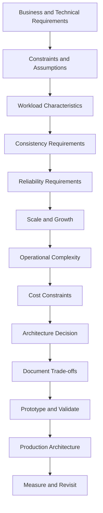

# 09- Choosing the Right Architecture

## Overview

Architecture selection is the process of choosing the structural and operational characteristics of a system based on its requirements, constraints, failure modes, and expected evolution.

The correct architecture is rarely the one with the most components. A production architecture should solve the actual business problem while keeping complexity proportional to the system's requirements.

Common architectural choices include:

- Monolith vs microservices
- Synchronous vs asynchronous communication
- REST vs gRPC
- SQL vs NoSQL
- Redis vs persistent storage
- Request-response vs event-driven communication
- Single-region vs multi-region deployment
- Containers vs managed compute
- Kubernetes vs simpler container orchestration
- Strong consistency vs eventual consistency
- Centralized vs distributed data ownership

A useful architectural decision process is:



Architecture is therefore not primarily a technology-selection exercise. It is a **trade-off analysis problem**.

---

## Architecture Starts With Requirements

Before selecting technologies, identify what the system must actually do.

Requirements should be separated into functional and non-functional requirements.

### Functional Requirements

Functional requirements describe system behavior.

Examples:

- Users can create orders.
- Customers can search products.
- Payments can be processed.
- Administrators can generate reports.
- Users receive notifications.
- Services can exchange data.

### Non-Functional Requirements

Non-functional requirements determine architectural constraints.

Examples:

- 99.99% availability
- p95 latency below 200 ms
- 10,000 requests per second
- support for 10 million users
- recovery point objective of 5 minutes
- recovery time objective of 30 minutes
- encryption at rest and in transit
- auditability
- horizontal scalability

A system processing 100 requests per day has very different architectural requirements from one processing 100,000 requests per second.

---

## Architecture Decision Inputs

Before choosing an architecture, establish the major decision variables.

| Dimension | Questions |
|---|---|
| Traffic | How many requests per second? |
| Traffic pattern | Constant, bursty, seasonal? |
| Data | Structured, semi-structured, relational, document-oriented? |
| Consistency | Strong, read-after-write, eventual? |
| Latency | What are p50, p95, and p99 targets? |
| Availability | What availability target is required? |
| Durability | How much data loss is acceptable? |
| Growth | What scale is expected in 1–3 years? |
| Team | How many engineers operate the system? |
| Deployment | How frequently will components change? |
| Failure | What failures are acceptable? |
| Compliance | Are there regulatory or data-residency requirements? |
| Cost | What infrastructure budget exists? |
| Operations | Who will operate the platform? |

Architecture should follow these constraints rather than precede them.

---

## Workload Characteristics

Workload analysis is one of the most important architectural inputs.

Consider:

- read/write ratio
- request size
- response size
- concurrency
- burst rate
- data growth
- query patterns
- geographic distribution
- workload duration
- batch vs real-time processing

For example:

```text
API workload:
10,000 requests/sec
95% reads
5% writes
p95 < 100 ms
```

may benefit significantly from:

```text
Load Balancer
     |
     v
API Servers
     |
     +--> Redis
     |
     +--> Read Replicas
             |
             v
         PostgreSQL
```

A workload dominated by long-running background processing may instead require:

```text
API
 |
 v
Queue
 |
 +--> Worker 1
 +--> Worker 2
 +--> Worker 3
```

The workload determines the architecture.

---

## Start With the Simplest Architecture That Meets Requirements

A strong default is:

> Choose the simplest architecture that satisfies current requirements and leaves a reasonable migration path for future growth.

For many backend applications:

```text
Internet
   |
   v
Nginx / Load Balancer
   |
   v
Django / FastAPI
   |
   +---- PostgreSQL
   |
   +---- Redis
```

This architecture may be sufficient for substantial workloads.

Do not introduce:

```text
Kubernetes
Kafka
Service Mesh
Microservices
Multiple Databases
Multi-Region Replication
Event Sourcing
CQRS
```

simply because they are common in large organizations.

Every additional subsystem creates:

- operational cost
- failure modes
- monitoring requirements
- deployment complexity
- security boundaries
- debugging complexity
- infrastructure cost

Complexity should have a measurable reason to exist.

---

## Monolith vs Microservices

### Monolith

A monolith packages the application into a single deployable unit.

```text
                  +----------------------+
                  |      Monolith        |
                  |                      |
                  | Users                |
                  | Orders               |
                  | Payments             |
                  | Notifications        |
                  +----------+-----------+
                             |
                             v
                         PostgreSQL
```

A monolith is often the best starting architecture because it provides:

- simple deployment
- simple local development
- straightforward transactions
- easier debugging
- lower infrastructure overhead
- fewer network failures

### Microservices

Microservices split business capabilities into independently deployable services.

```text
                 API Gateway
                      |
        +-------------+-------------+
        |             |             |
        v             v             v
      Users         Orders       Payments
        |             |             |
        v             v             v
       DB            DB            DB
```

Microservices become valuable when independent scaling, deployment, ownership, or failure isolation justify the complexity.

### Decision Criteria

| Requirement | Monolith | Microservices |
|---|---|---|
| Small team | Excellent | Often excessive |
| Simple deployment | Excellent | More complex |
| Independent deployment | Limited | Excellent |
| Independent scaling | Limited | Excellent |
| Strong local transactions | Excellent | More difficult |
| Team autonomy | Lower | Higher |
| Operational complexity | Lower | Higher |
| Network failures | Lower | Higher |
| Debugging | Simpler | Distributed |
| Technology diversity | Limited | Strong |
| Large organization | Can work | Often useful |

A common mistake is treating microservices as the natural endpoint of application growth. A modular monolith can often scale much further than teams initially expect.

---

## Modular Monolith as an Architectural Option

A modular monolith keeps one deployable application while enforcing strong internal boundaries.

```text
+------------------------------------------------+
|                Backend Application             |
|                                                |
|  Users | Orders | Payments | Notifications    |
|                                                |
|  Explicit module boundaries                    |
+----------------------+-------------------------+
                       |
                    PostgreSQL
```

For Django, this can mean separate applications with controlled dependencies:

```text
project/
├── users/
├── orders/
├── payments/
├── notifications/
└── shared/
```

The important part is not the directory structure. It is enforcing ownership and dependency boundaries.

A modular monolith can later extract a module into a service if there is a genuine reason.

---

## Choosing Communication Patterns

The communication model should match the business interaction.

| Requirement | Recommended Pattern |
|---|---|
| User-facing API | REST |
| Internal synchronous RPC | gRPC |
| Background job | Queue |
| Fan-out integration | Events |
| Event history | Kafka |
| Simple task execution | Celery/SQS |
| Long-running workflow | Async workflow/event architecture |
| Immediate validation | Request-response |

A useful decision rule:

```text
Does the caller need the result immediately?
            |
       +----+----+
       |         |
      Yes        No
       |         |
 REST/gRPC     Async
                  |
             +----+----+
             |         |
           Task      Event
           Queue     Stream
```

---

## REST vs gRPC

REST is generally well suited for:

- public APIs
- browser clients
- external integrations
- resource-oriented APIs
- broadly interoperable systems

gRPC is often well suited for:

- internal service-to-service communication
- strongly typed contracts
- low-latency RPC
- streaming
- high-throughput internal communication

A common architecture is:

```text
Browser / Mobile
       |
      REST
       |
       v
API Gateway
       |
      gRPC
       |
       v
Internal Services
```

Do not use gRPC simply because it is technically faster. Public API compatibility, client support, operational tooling, and organizational constraints may make REST the better choice.

---

## SQL vs NoSQL

The database decision should begin with access patterns rather than popularity.

### SQL

PostgreSQL is a strong default when the system requires:

- relational data
- transactions
- constraints
- joins
- complex queries
- strong consistency
- reporting

Example:

```text
Customer
   |
   +---- Orders
            |
            +---- Order Items
```

### NoSQL

NoSQL databases can be useful when the workload requires:

- high horizontal scalability
- specific access patterns
- flexible document structures
- very high write throughput
- distributed data models

The key question is:

> What queries and consistency guarantees does the application require?

Not:

> Which database is more scalable?

PostgreSQL can scale very effectively when correctly designed.

---

## Redis vs Persistent Database

Redis should generally complement rather than replace PostgreSQL for ordinary application data.

A common architecture:

```text
Application
    |
    +---- Redis
    |       |
    |       +--> Cache hit
    |
    +---- PostgreSQL
            |
            +--> Source of truth
```

Use Redis for:

- caching
- sessions
- rate limiting
- distributed locks where appropriate
- short-lived state
- queues in suitable workloads

Do not use Redis as the authoritative database merely because it is fast.

---

## Caching Decisions

Caching is useful when:

```text
Expensive operation
        +
Repeated access
        +
Data can tolerate bounded staleness
```

Example:

```text
Request
   |
   v
Redis
   |
   +---- hit ----> Response
   |
   +---- miss
          |
          v
      PostgreSQL
          |
          v
       Redis
          |
          v
       Response
```

Caching introduces its own problems:

- invalidation
- stale data
- cache stampedes
- memory pressure
- eviction behavior
- consistency concerns

A cache should have a clear ownership and invalidation strategy.

---

## Strong Consistency vs Eventual Consistency

Strong consistency means reads reflect the required committed state according to the database's consistency model.

Eventual consistency allows replicas or derived systems to converge later.

Example:

```text
Order DB
   |
   | OrderCreated
   v
Search Index
```

If search indexing takes two seconds:

```text
t=0  Order created
t=0  PostgreSQL updated
t=2  Search index updated
```

This is acceptable if search is a derived capability.

It may not be acceptable for:

- account balances
- authorization state
- financial transactions
- inventory reservations

Consistency requirements should be derived from business correctness.

---

## Synchronous vs Asynchronous Processing

A synchronous operation keeps work in the request's critical path.

```text
Request
   |
   v
API
   |
   +--> Validate
   +--> Save
   +--> Respond
```

Asynchronous processing moves non-critical work outside the request path.

```text
Request
   |
   v
API
   |
   +--> Save
   |
   +--> Publish event
   |
   v
Response

Kafka
 |
 +--> Email
 +--> Analytics
 +--> Search
```

Asynchronous architecture is useful when work:

- is long-running
- is retryable
- does not need to block the user
- can be independently scaled
- naturally represents a business event

Do not make every operation asynchronous. Async systems add operational complexity.

---

## Event-Driven vs Request-Response

Use request-response when:

- immediate results are required
- the operation is query-oriented
- validation must happen synchronously
- the caller must know success/failure immediately

Use event-driven communication when:

- downstream work is independent
- multiple consumers need the same event
- replay is valuable
- consumers require independent scaling
- eventual consistency is acceptable

A hybrid architecture is common:

```text
Client
  |
  | REST
  v
Order Service
  |
  +---- PostgreSQL
  |
  +---- Kafka
          |
          +---- Email
          +---- Analytics
          +---- Search
```

---

## Synchronous Dependency Chains

A dangerous architecture is a long synchronous dependency chain:

```text
API
 |
 v
Order
 |
 v
Payment
 |
 v
Fraud
 |
 v
Inventory
 |
 v
Shipping
```

If each service has 99.9% availability, the overall dependency path can have significantly lower availability because every dependency can fail.

Latency also accumulates.

Prefer reducing the critical path:

```text
API
 |
 v
Order
 |
 +---- Payment
 |
 +---- Event -> Fraud
 |
 +---- Event -> Analytics
 |
 +---- Event -> Notification
```

Critical-path work should be deliberately minimized.

---

## Reliability and Failure Isolation

Architecture should explicitly answer:

> What happens when a dependency fails?

For synchronous dependencies, use:

- timeouts
- bounded retries
- exponential backoff
- jitter
- circuit breakers
- bulkheads
- graceful degradation

For asynchronous systems, use:

- retries
- dead-letter queues/topics
- idempotent consumers
- consumer lag monitoring
- replay strategies
- poison-message handling

Never assume that network calls are reliable.

---

## Availability Requirements

Architecture should be driven by the required availability.

| Availability | Approximate Annual Downtime |
|---|---:|
| 99% | 3.65 days |
| 99.9% | 8.76 hours |
| 99.99% | 52.6 minutes |
| 99.999% | 5.26 minutes |

Higher availability generally requires additional mechanisms such as:

- multiple instances
- load balancing
- health checks
- multi-AZ deployment
- database replication
- automated failover
- backups
- disaster recovery procedures

Do not design for five nines when the business only requires three.

---

## Scaling Strategy

Before introducing distributed services, identify the actual bottleneck.

Typical progression:

```text
Single Application
       |
       v
Vertical Scaling
       |
       v
Database Optimization
       |
       v
Caching
       |
       v
Horizontal Application Scaling
       |
       v
Read Replicas
       |
       v
Async Processing
       |
       v
Service Extraction
       |
       v
Distributed Architecture
```

This is not a mandatory sequence, but it illustrates an important principle:

> Scale the bottleneck, not the architecture.

---

## Stateless Application Design

Stateless API instances are easier to scale horizontally.

```text
                 Load Balancer
                 /     |     \
                v      v      v
              API-1  API-2  API-3
                \      |      /
                 +-----+-----+
                       |
                 Shared State
                /       |      \
            Redis   PostgreSQL   S3
```

Avoid storing critical session state only in process memory.

Instead use:

- Redis
- database-backed sessions
- signed tokens
- external object storage
- durable databases

This makes instances interchangeable.

---

## Storage Architecture

Choose storage based on data semantics.

| Data | Typical Technology |
|---|---|
| Transactional relational data | PostgreSQL |
| Cache | Redis |
| Object/blob data | S3 |
| Search | OpenSearch/Elasticsearch |
| Event stream | Kafka |
| Background task queue | SQS/Celery/RabbitMQ |
| Analytics warehouse | Data warehouse |
| Time-series workload | Time-series database |

Avoid using one database for every workload simply for convenience.

At the same time, avoid introducing six databases without a concrete workload requirement.

---

## Object Storage vs Database Storage

Large files should generally not be stored directly in relational database rows.

A common architecture is:

```text
Client
  |
  | Request upload URL
  v
API
  |
  | Presigned URL
  v
S3
  |
  | ObjectCreated
  v
Event Processing
```

Metadata can remain in PostgreSQL:

```text
PostgreSQL
----------------------
file_id
owner_id
bucket
object_key
content_type
size
created_at
```

while the actual object lives in S3.

This separates metadata management from large binary storage.

---

## Compute Architecture

For Python applications, deployment options include:

- virtual machines
- managed application platforms
- containers
- serverless functions
- Kubernetes

Choose based on operational requirements.

### Containers

Docker provides:

- reproducible packaging
- process isolation
- consistent environments
- deployment portability

### Kubernetes

Kubernetes becomes valuable when the organization needs capabilities such as:

- container orchestration
- automated scheduling
- service discovery
- rolling deployments
- autoscaling
- workload management

Kubernetes is not simply a better Docker runtime. It is a substantial operational platform.

For a small Django API, Kubernetes may add more complexity than value.

---

## AWS Architecture Selection

A typical production backend might use:

```text
                     Route 53
                         |
                         v
                 Load Balancer
                         |
                 +-------+-------+
                 |               |
                 v               v
              API-1           API-2
                 |               |
                 +-------+-------+
                         |
               +---------+---------+
               |                   |
               v                   v
           PostgreSQL            Redis
          Multi-AZ/RDS
               |
               v
               S3
```

For higher event-driven workloads:

```text
API
 |
 +---- PostgreSQL
 |
 +---- Redis
 |
 +---- Kafka / MSK
          |
          +---- Workers
          +---- Analytics
          +---- Notifications
```

AWS service selection should follow requirements rather than familiarity.

---

## Single Region vs Multi-Region

Single-region architectures are simpler and often sufficient.

A highly available single-region design can use multiple Availability Zones:

```text
Region
 |
 +---- AZ-A
 |      |
 |     API
 |
 +---- AZ-B
 |      |
 |     API
 |
 +---- AZ-C
        |
       API
```

Multi-region introduces substantially more complexity:

```text
Region A                    Region B
   |                           |
   v                           v
API Cluster                 API Cluster
   |                           |
   +-------- Replication ------+
```

Consider multi-region only when requirements justify:

- geographic latency reduction
- regional disaster recovery
- regulatory requirements
- extreme availability requirements

Cross-region consistency, failover, routing, data replication, and operational procedures must be designed explicitly.

---

## Disaster Recovery

Architecture must define what happens after a major failure.

Two important parameters are:

### Recovery Point Objective

RPO answers:

> How much data can we afford to lose?

Example:

```text
RPO = 5 minutes
```

means the organization accepts up to approximately five minutes of data loss under the defined disaster scenario.

### Recovery Time Objective

RTO answers:

> How long can the system remain unavailable?

Example:

```text
RTO = 30 minutes
```

means the recovery process should restore service within approximately 30 minutes.

Architecture choices include:

| Strategy | Recovery | Cost | Complexity |
|---|---|---|---|
| Backup and restore | Slower | Low | Low |
| Warm standby | Faster | Medium | Medium |
| Multi-region active/passive | Fast | High | High |
| Multi-region active/active | Very fast | Very high | Very high |

Backups without tested restoration procedures are not a complete disaster recovery strategy.

---

## Security Architecture

Security should be part of architecture rather than added later.

Important concerns include:

- identity
- authentication
- authorization
- encryption
- secret management
- network segmentation
- least privilege
- audit logging
- dependency security
- data classification

A typical AWS design may separate:

```text
Public Subnet
    |
Load Balancer
    |
Private Subnets
    |
+---+----------------+
|                    |
API                Workers
|                    |
+---------+----------+
          |
       Database
```

Databases generally should not be directly exposed to the public internet.

Use security groups, IAM, private networking, encryption, and managed secret storage appropriately.

---

## Observability Requirements

Architecture decisions affect observability.

A distributed system should provide:

### Metrics

Measure:

- request rate
- latency
- error rate
- saturation
- CPU
- memory
- database connections
- queue depth
- consumer lag

### Logs

Logs should be structured and include fields such as:

```json
{
  "timestamp": "2026-08-23T15:20:10Z",
  "level": "ERROR",
  "service": "order-service",
  "request_id": "req-123",
  "trace_id": "trace-456",
  "message": "payment dependency timeout"
}
```

### Traces

Distributed tracing should connect:

```text
HTTP Request
    |
    v
API
    |
    v
gRPC
    |
    v
Database
    |
    v
Kafka
    |
    v
Consumer
```

Without correlation IDs and traces, diagnosing distributed failures becomes significantly harder.

---

## Cost as an Architectural Constraint

Architecture should consider total cost of ownership.

Costs include:

- compute
- storage
- network transfer
- databases
- brokers
- observability
- backups
- engineering time
- operational staffing
- incident response
- migration effort

For example:

```text
Kubernetes
+ Kafka
+ Service Mesh
+ Multiple Databases
+ Multi-Region
```

may technically support enormous scale, but can be economically irrational for a small application.

Engineering time is an infrastructure cost.

---

## Team Structure and Architecture

Architecture should reflect organizational capability.

A team of four engineers may struggle to operate:

```text
15 Microservices
3 Databases
Kafka
Kubernetes
Service Mesh
Multi-Region
```

A large organization with independent teams may benefit from service boundaries because teams need:

- independent deployments
- ownership boundaries
- independent scaling
- fault isolation

A useful rule is:

> Do not create operational boundaries that the organization cannot effectively own.

---

## Architecture Evolution

Architecture should be treated as an evolutionary process.

A realistic evolution might be:

```text
Phase 1
Django + PostgreSQL
        |
        v
Phase 2
Django + PostgreSQL + Redis
        |
        v
Phase 3
Django + PostgreSQL + Redis + Workers
        |
        v
Phase 4
Modular Monolith + Events
        |
        v
Phase 5
Extract High-Value Services
        |
        v
Phase 6
Distributed Architecture
```

Extraction should be driven by real problems such as:

- independent scaling requirements
- deployment isolation
- team ownership
- failure isolation
- significantly different workload characteristics

Do not split a service merely because a module has many files.

---

## Architecture Decision Records

Significant architectural choices should be documented using Architecture Decision Records.

An ADR should capture:

```text
Context
Decision
Alternatives
Trade-offs
Consequences
```

Example:

```markdown
# Use PostgreSQL as the Primary Transactional Database

## Context

The application requires relational data, transactions,
foreign-key constraints, and complex reporting queries.

## Decision

Use PostgreSQL as the primary transactional database.

## Alternatives

- MySQL
- DynamoDB
- MongoDB

## Trade-offs

PostgreSQL provides strong relational semantics and flexible
query capabilities at the cost of requiring relational schema
management.

## Consequences

The application will use PostgreSQL for transactional data.
Redis may be introduced independently for caching.
```

ADRs prevent teams from repeatedly revisiting decisions without understanding the original constraints.

---

## Architecture Decision Matrix

A weighted decision matrix can make trade-offs explicit.

Example:

| Criterion | Weight | Monolith | Microservices |
|---|---:|---:|---:|
| Deployment simplicity | 5 | 5 | 2 |
| Independent scaling | 4 | 2 | 5 |
| Operational complexity | 5 | 5 | 2 |
| Team autonomy | 3 | 2 | 5 |
| Failure isolation | 4 | 2 | 5 |
| Development speed | 5 | 5 | 3 |

The numbers should not be treated as mathematical truth.

The value of the matrix is that it exposes assumptions and makes disagreements concrete.

---

## Architecture Review Questions

Before approving an architecture, ask:

### Requirements

- What business problem does this architecture solve?
- Which requirements are mandatory?
- Which requirements are assumptions?
- What are the latency targets?
- What availability is actually required?

### Scale

- What is the expected request rate?
- What is peak traffic?
- How much data will exist?
- What is the expected growth rate?
- Which component is likely to become the bottleneck?

### Data

- Who owns each piece of data?
- What consistency level is required?
- What are the access patterns?
- What is the source of truth?
- How will data be backed up and restored?

### Communication

- Which calls must be synchronous?
- Which operations can be asynchronous?
- What happens when dependencies fail?
- Are retries safe?
- Are consumers idempotent?

### Reliability

- What happens when a node fails?
- What happens when a database fails?
- What happens when a region fails?
- What is the RPO?
- What is the RTO?

### Security

- Where are trust boundaries?
- Which components are publicly accessible?
- How are secrets stored?
- How is service identity managed?
- What data is sensitive?

### Operations

- Who operates the system?
- How are deployments performed?
- How are incidents diagnosed?
- What metrics and alerts exist?
- How are schema changes handled?

### Cost

- What infrastructure is required?
- What is the expected monthly cost?
- What operational overhead is introduced?
- Is the complexity justified by the business value?

---

## Common Architecture Mistakes

### Choosing Technology Before Requirements

Bad:

```text
We need Kafka because Kafka is scalable.
```

Better:

```text
We have multiple independent consumers,
high event volume, replay requirements,
and asynchronous processing needs.
```

Then evaluate Kafka against alternatives.

### Premature Microservices

Splitting a small application into many services creates distributed-system problems before the business actually needs distributed architecture.

### Ignoring Operational Complexity

A design can be technically correct and operationally unsuitable.

Always consider:

- deployment
- monitoring
- backups
- upgrades
- incident response
- security
- staffing

### Optimizing for Peak Scale Too Early

Designing for hypothetical traffic can produce unnecessary complexity.

Estimate realistic growth and establish a migration path.

### Ignoring Failure Modes

Every distributed dependency creates failure scenarios.

Ask:

```text
What happens if this component is:
- slow?
- unavailable?
- returning invalid data?
- overloaded?
- partially degraded?
```

### Overusing Caches

Caching can improve performance but creates invalidation and consistency problems.

### Treating Kubernetes as an Architecture

Kubernetes is an infrastructure orchestration platform, not a system architecture by itself.

### Confusing High Availability With Scalability

Multiple instances improve availability and can improve horizontal capacity, but the concepts are different.

### Ignoring Human Factors

An architecture that requires expertise the team does not possess may be less reliable than a simpler architecture.

---

## Production Architecture Heuristics

Useful heuristics include:

| Situation | Starting Point |
|---|---|
| Small CRUD backend | Django/FastAPI + PostgreSQL |
| Read-heavy API | PostgreSQL + Redis |
| Background processing | API + Queue + Workers |
| Large event pipeline | Kafka + Consumer Groups |
| Internal low-latency RPC | gRPC |
| Public API | REST |
| Large binary files | S3/Object Storage |
| Multiple independent teams | Modular boundaries / services |
| Independent scaling requirement | Service extraction |
| Strict transactional workflows | Relational database |
| Search-heavy workloads | Dedicated search engine |
| High availability | Multi-AZ |
| Regional disaster recovery | Multi-region strategy |

These are starting points, not universal rules.

---

## A Practical Architecture Selection Process

Use the following process for a new system.

### Define the Workload

Document:

```text
Users:
10 million

Average traffic:
2,000 RPS

Peak traffic:
15,000 RPS

Read/write:
90/10

p95 latency:
200 ms

Availability:
99.99%

RPO:
5 minutes

RTO:
30 minutes
```

### Identify Critical Paths

Separate:

```text
Must happen before response
```

from:

```text
Can happen later
```

This determines synchronous and asynchronous boundaries.

### Identify Data Ownership

Determine:

```text
Who owns:
- users
- orders
- payments
- inventory
```

Avoid accidental shared ownership.

### Select the Simplest Suitable Components

A possible initial design:

```text
Route 53
    |
Load Balancer
    |
Django/FastAPI
    |
+---+---------+---------+
|             |         |
v             v         v
PostgreSQL   Redis      S3
    |
    v
Outbox
    |
    v
Kafka
 /  |  \
v   v   v
Email Analytics Search
```

### Validate the Architecture

Validate assumptions through:

- load tests
- benchmarks
- prototypes
- failure testing
- database query analysis
- capacity planning
- cost estimation

Do not rely exclusively on theoretical calculations.

### Document the Decision

Record:

- context
- requirements
- alternatives
- selected architecture
- trade-offs
- consequences
- rejected alternatives

---

## Production Readiness Checklist

Before production, verify:

### Reliability

- [ ] Health checks exist.
- [ ] Timeouts are configured.
- [ ] Retries are bounded.
- [ ] Retryable operations are idempotent.
- [ ] Failure isolation exists where required.
- [ ] Backups are automated.
- [ ] Restore procedures are tested.
- [ ] Disaster recovery requirements are defined.

### Scalability

- [ ] Application instances can scale horizontally where appropriate.
- [ ] Database capacity has been evaluated.
- [ ] Connection pools are sized correctly.
- [ ] Cache capacity has been evaluated.
- [ ] Queue/broker throughput has been tested.
- [ ] Consumer lag is monitored.
- [ ] Peak traffic has been load-tested.

### Security

- [ ] TLS is enforced.
- [ ] Authentication is implemented.
- [ ] Authorization boundaries are explicit.
- [ ] Secrets are not stored in source control.
- [ ] Least-privilege IAM is used.
- [ ] Databases are not unnecessarily public.
- [ ] Sensitive event data is controlled.
- [ ] Audit requirements are addressed.

### Observability

- [ ] Structured logs exist.
- [ ] Metrics cover RED/USE-style signals.
- [ ] Distributed tracing is available where needed.
- [ ] Request IDs are propagated.
- [ ] Alerts have actionable thresholds.
- [ ] Queue and consumer lag are monitored.
- [ ] Database performance is monitored.

### Operations

- [ ] CI/CD is automated.
- [ ] Rollbacks are possible.
- [ ] Database migrations are controlled.
- [ ] Configuration is externalized.
- [ ] Capacity planning exists.
- [ ] Ownership is documented.
- [ ] Incident procedures exist.

---

## Interview Framework

When asked:

> "How would you choose an architecture?"

A strong answer should not immediately name technologies.

Start with:

```text
1. Clarify functional requirements.
2. Establish scale and workload.
3. Define latency and availability requirements.
4. Identify consistency requirements.
5. Identify data ownership and access patterns.
6. Define synchronous vs asynchronous workflows.
7. Identify bottlenecks and failure modes.
8. Choose the simplest architecture that satisfies requirements.
9. Evaluate scalability and operational complexity.
10. Explain trade-offs and migration paths.
```

For example:

> "I would not start by deciding between microservices and a monolith. I would first understand traffic, consistency, availability, team boundaries, deployment requirements, and failure tolerance. If those requirements can be satisfied with a modular monolith, I would start there and preserve clear boundaries so high-value components can later be extracted."

This demonstrates architectural reasoning rather than technology preference.

---

## Architecture Trade-Off Mindset

There is rarely a universally correct architecture.

Every decision exchanges one property for another.

```text
Simplicity
    <------------------------>
Scalability

Consistency
    <------------------------>
Availability

Latency
    <------------------------>
Durability

Operational Control
    <------------------------>
Managed Services

Independence
    <------------------------>
Coordination

Flexibility
    <------------------------>
Complexity
```

The senior-engineering skill is understanding where the system needs to sit on these trade-off curves.

The objective is not to maximize every desirable property. That is generally impossible.

The objective is to choose the combination that best satisfies the business requirements within technical and organizational constraints.

---

## Key Takeaways

- **Architecture selection is a requirements and trade-off problem, not a technology popularity contest; start with workload, consistency, reliability, scale, cost, and team constraints.**
- **Prefer the simplest architecture that satisfies current requirements, while preserving clear boundaries and migration paths for future growth.**
- **Use synchronous communication for operations that require immediate results and asynchronous/event-driven patterns for independent, retryable, or fan-out workloads.**
- **Every architectural decision introduces operational consequences; evaluate failure modes, observability, security, deployment, disaster recovery, and total cost alongside functional behavior.**
- **Strong architecture decisions are explicit, measurable, documented in ADRs, validated with real workloads, and revisited when system requirements or constraints materially change.**