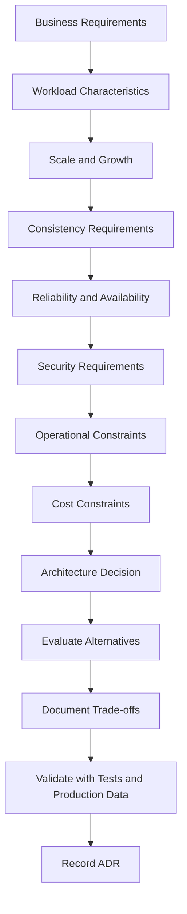

# README

## Overview

This section contains Architecture Decision Records (ADRs) for evaluating and documenting major system design choices.

The purpose of an ADR is not to prescribe a universally correct technology. It records the **context, constraints, alternatives, decision, trade-offs, and consequences** behind an architectural choice so that the decision remains understandable as the system evolves.

The topics in this section focus on common backend architecture decisions involving application structure, communication, data stores, execution models, infrastructure, and overall architecture selection.

---

## Architecture Decision Records

| File | Decision Area | Primary Focus |
|---|---|---|
| [01- Monolith vs Microservices](./01-%20Monolith%20vs%20Microservices.md) | Application Architecture | When to use a monolith, modular monolith, or microservices |
| [02- SQL vs NoSQL](./02-%20SQL%20vs%20NoSQL.md) | Data Architecture | Relational vs non-relational data models and workload requirements |
| [03- Kafka vs RabbitMQ](./03-%20Kafka%20vs%20RabbitMQ.md) | Messaging | Event streaming vs message brokering and task-oriented messaging |
| [04- REST vs gRPC](./04-%20REST%20vs%20gRPC.md) | Service Communication | External APIs vs internal RPC communication |
| [05- Redis vs Memcached](./05-%20Redis%20vs%20Memcached.md) | Caching | Feature-rich distributed cache vs lightweight caching |
| [06- Sync vs Async](./06-%20Sync%20vs%20Async.md) | Execution Model | Immediate request processing vs background/asynchronous execution |
| [07- Docker vs Kubernetes](./07-%20Docker%20vs%20Kubernetes.md) | Container Infrastructure | Container packaging vs container orchestration |
| [08- Event Driven vs Request Response](./08-%20Event%20Driven%20vs%20Request%20Response.md) | Communication Architecture | Events and asynchronous workflows vs synchronous interactions |
| [09- Choosing the Right Architecture](./09-%20Choosing%20the%20Right%20Architecture.md) | Architecture Strategy | A systematic framework for selecting architecture based on requirements and trade-offs |

---

## Decision Framework

Architectural decisions should begin with requirements rather than technology preferences.



A practical decision process is:

1. Define the business and functional requirements.
2. Establish workload characteristics and expected scale.
3. Define latency, availability, durability, and consistency requirements.
4. Identify data ownership and access patterns.
5. Determine synchronous and asynchronous boundaries.
6. Identify likely bottlenecks and failure modes.
7. Evaluate candidate architectures and technologies.
8. Compare operational complexity and total cost.
9. Validate important assumptions with benchmarks or prototypes.
10. Document the decision and its consequences.

---

## Architecture Principles

### Prefer Simplicity

Choose the simplest architecture that satisfies the requirements.

A Django or FastAPI application backed by PostgreSQL may be preferable to a distributed microservices platform when the workload and organization do not require distributed architecture.

Complexity should have a measurable reason to exist.

### Design for the Actual Bottleneck

Do not scale every component preemptively.

Typical bottlenecks include:

- database CPU
- database connections
- slow queries
- network bandwidth
- external APIs
- cache capacity
- queue throughput
- CPU-intensive application code
- storage I/O

Optimize the limiting resource before introducing additional architectural boundaries.

### Make Trade-offs Explicit

Most architecture decisions exchange one desirable property for another.

Examples:

- simplicity vs independent scaling
- consistency vs availability
- latency vs durability
- operational control vs managed infrastructure
- flexibility vs complexity
- synchronous behavior vs loose coupling

A good ADR makes these trade-offs explicit.

### Treat Failure as a Design Input

Distributed systems should assume that dependencies can:

- fail
- become slow
- return errors
- become overloaded
- partially fail
- lose connectivity

Production designs should therefore define:

- timeouts
- retries
- backoff
- idempotency
- circuit breaking
- dead-letter handling
- graceful degradation
- recovery procedures

### Consider the Team

Architecture must be operable by the organization implementing it.

A technically sophisticated architecture can be a poor decision if the team cannot effectively:

- deploy it
- monitor it
- debug it
- secure it
- upgrade it
- recover it
- operate it during incidents

Operational complexity is an architectural constraint.

---

## ADR Structure

Each decision record should generally contain:

| Section | Purpose |
|---|---|
| Context | Problem, requirements, constraints, and assumptions |
| Decision | Chosen architectural approach |
| Alternatives | Reasonable options that were evaluated |
| Trade-offs | Advantages and limitations of the decision |
| Consequences | Expected operational and engineering impact |
| Production Considerations | Reliability, security, scalability, monitoring, and cost implications |

A useful ADR should answer:

> Why did we make this decision?

> What alternatives did we reject?

> Which assumptions influenced the decision?

> What consequences should future engineers understand?

---

## Technology Selection Matrix

| Decision | Primary Question |
|---|---|
| Monolith vs Microservices | Do independent deployment, scaling, ownership, or failure isolation justify distributed services? |
| SQL vs NoSQL | What data model, query patterns, consistency, and transaction requirements exist? |
| Kafka vs RabbitMQ | Do we need durable event streams and replay or primarily message/task delivery? |
| REST vs gRPC | Is the interface public/resource-oriented or internal/typed RPC? |
| Redis vs Memcached | Do we need capabilities beyond basic key-value caching? |
| Sync vs Async | Does the caller require the result before the request completes? |
| Docker vs Kubernetes | Do we need container packaging or full orchestration capabilities? |
| Event Driven vs Request Response | Should components communicate through explicit responses or independently consumed events? |
| Architecture Selection | Which architecture best satisfies the complete set of system constraints? |

---

## Recommended Architecture Progression

Avoid assuming that every system must begin as a distributed system.

A practical evolution can look like:

```text
Simple Application
       |
       v
Django / FastAPI + PostgreSQL
       |
       v
Add Redis for measurable caching needs
       |
       v
Add Celery / Queue for background workloads
       |
       v
Introduce modular boundaries
       |
       v
Introduce events where asynchronous decoupling is valuable
       |
       v
Extract services where independent ownership,
scaling, deployment, or failure isolation is justified
```

This approach allows architecture to evolve in response to actual constraints rather than hypothetical future scale.

---

## Production Review Checklist

Before accepting a major architectural decision, verify:

### Requirements

- [ ] Functional requirements are documented.
- [ ] Traffic and workload assumptions are documented.
- [ ] Latency requirements are defined.
- [ ] Availability requirements are defined.
- [ ] Data consistency requirements are understood.
- [ ] Growth assumptions are explicit.

### Reliability

- [ ] Dependency failures have defined behavior.
- [ ] Timeouts are configured.
- [ ] Retries are bounded.
- [ ] Retryable operations are idempotent.
- [ ] Backups and recovery procedures exist.
- [ ] RPO and RTO requirements are defined.

### Scalability

- [ ] Application scaling strategy is understood.
- [ ] Database capacity has been evaluated.
- [ ] Cache capacity has been evaluated where applicable.
- [ ] Queue or event-stream throughput has been evaluated.
- [ ] Peak workload has been considered.

### Security

- [ ] Trust boundaries are explicit.
- [ ] Authentication and authorization are defined.
- [ ] Secrets are managed securely.
- [ ] Least-privilege access is applied.
- [ ] Sensitive data exposure is controlled.
- [ ] Network exposure is minimized.

### Operations

- [ ] Deployment strategy is defined.
- [ ] Rollback strategy exists.
- [ ] Logs and metrics are available.
- [ ] Distributed tracing is considered where appropriate.
- [ ] Alerts are actionable.
- [ ] Component ownership is documented.
- [ ] Operational complexity is understood.

### Cost

- [ ] Infrastructure costs are estimated.
- [ ] Managed-service costs are understood.
- [ ] Network and storage costs are considered.
- [ ] Engineering and operational overhead is considered.
- [ ] The additional complexity is justified by the requirements.

---

## Navigation

### Application Architecture

- [01- Monolith vs Microservices](./01-%20Monolith%20vs%20Microservices.md)
- [09- Choosing the Right Architecture](./09-%20Choosing%20the%20Right%20Architecture.md)

### Data and Caching

- [02- SQL vs NoSQL](./02-%20SQL%20vs%20NoSQL.md)
- [05- Redis vs Memcached](./05-%20Redis%20vs%20Memcached.md)

### Communication and Messaging

- [03- Kafka vs RabbitMQ](./03-%20Kafka%20vs%20RabbitMQ.md)
- [04- REST vs gRPC](./04-%20REST%20vs%20gRPC.md)
- [06- Sync vs Async](./06-%20Sync%20vs%20Async.md)
- [08- Event Driven vs Request Response](./08-%20Event%20Driven%20vs%20Request%20Response.md)

### Infrastructure

- [07- Docker vs Kubernetes](./07-%20Docker%20vs%20Kubernetes.md)

---

## Key Takeaways

- **Architecture decisions should start with requirements, workload, constraints, and failure modes rather than technology preferences.**
- **Prefer the simplest architecture that satisfies current requirements while preserving clear migration paths for future growth.**
- **Every distributed component introduces operational complexity, network failure modes, observability requirements, and additional cost.**
- **ADR documents should make context, alternatives, trade-offs, consequences, and operational implications explicit.**
- **Architecture should evolve as measurable system requirements, workload characteristics, team boundaries, and business constraints change.**