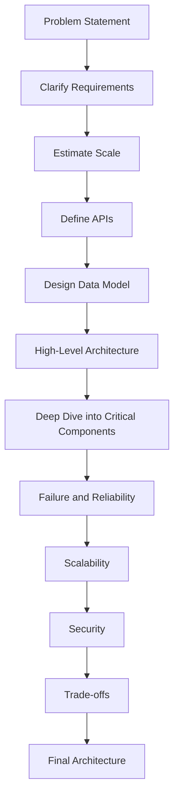
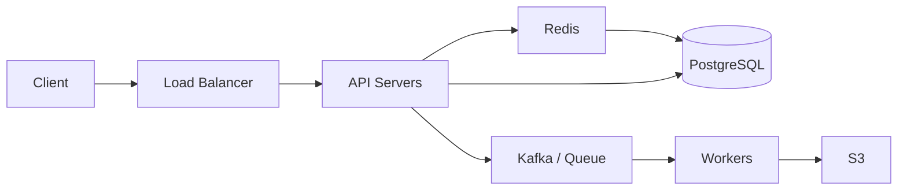
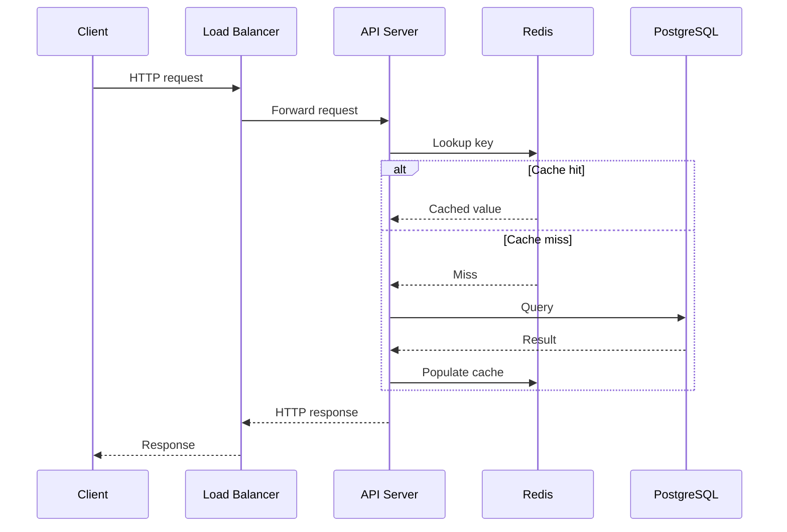
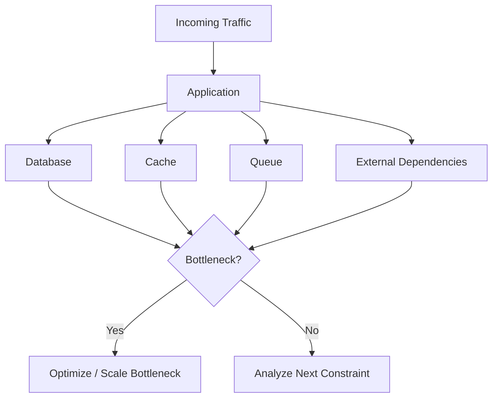
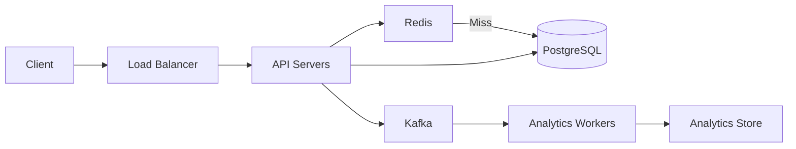

# 01- System Design Interview Framework

## Overview

A system design interview evaluates how effectively you can translate ambiguous product requirements into a scalable, reliable, maintainable architecture.

The interviewer is generally not looking for a single "correct" architecture. They are evaluating whether you can:

- clarify requirements before designing
- estimate scale instead of guessing
- identify the important constraints
- model APIs and data correctly
- reason about bottlenecks
- choose appropriate storage and communication patterns
- design for failure
- explain scalability and reliability
- communicate trade-offs clearly
- evolve the design as requirements change

A strong system design interview is therefore a **structured engineering conversation**, not a race to draw the largest architecture.

A useful high-level framework is:



The exact sequence can vary, but the reasoning should remain structured.

---

## Interview Mindset

The interviewer typically has more information about the problem than is explicitly stated in the initial prompt.

For example:

> "Design a URL shortener."

This statement does not tell you:

- how many users exist
- how many URLs are created
- how frequently URLs are resolved
- whether URLs expire
- whether analytics are required
- whether the system is global
- what availability is required
- what latency is acceptable

Do not immediately start drawing databases and load balancers.

Instead, expose the hidden requirements through questions.

The goal is to turn:

```text
Ambiguous Problem
```

into:

```text
Explicit Requirements
        +
Quantified Workload
        +
Known Constraints
        =
Designable System
```

---

## The Interview Flow

A practical 45–60 minute interview can be structured approximately as follows.

| Phase | Approximate Time | Objective |
|---|---:|---|
| Requirements | 5–8 min | Understand the problem |
| Capacity estimation | 3–5 min | Quantify workload |
| API and data model | 5–8 min | Establish contracts and storage |
| High-level architecture | 8–10 min | Build the main system |
| Deep dive | 10–15 min | Explore critical bottlenecks |
| Reliability and scaling | 5–8 min | Explain production behavior |
| Trade-offs | 3–5 min | Defend decisions |
| Final review | 2–3 min | Summarize architecture |

Do not treat these times as strict rules. A simple system may require less detail; a complex system may require deeper exploration.

---

## Clarify Requirements

Start by separating functional and non-functional requirements.

### Functional Requirements

Functional requirements describe what the system does.

For a URL shortener:

- create a short URL
- redirect users to the original URL
- optionally track clicks

### Non-Functional Requirements

Non-functional requirements describe how the system should behave.

Examples:

- high availability
- low redirect latency
- horizontal scalability
- durability
- geographic distribution
- security
- eventual consistency for analytics

A useful question is:

> "Which requirements are mandatory for the interview, and which can be treated as optional?"

This prevents spending time designing features that do not matter.

---

## Requirement Questions

Use targeted questions instead of asking generic questions such as "What are the requirements?"

### Functional Questions

Ask:

- What operations must the system support?
- Who are the primary users?
- Is authentication required?
- Are users allowed to modify existing resources?
- Is deletion required?
- Are analytics required?
- Are notifications required?

### Scale Questions

Ask:

- How many users?
- How many requests per second?
- What is peak traffic?
- What is the read/write ratio?
- How much data is stored?
- How quickly does the data grow?

### Reliability Questions

Ask:

- What availability target is expected?
- Is downtime acceptable?
- What happens if a dependency fails?
- Is data loss acceptable?
- What are the RPO and RTO requirements?

### Consistency Questions

Ask:

- Does the user need to immediately see a write?
- Can derived data be eventually consistent?
- Are transactions required?
- Can stale reads be tolerated?

### Geographic Questions

Ask:

- Is the system global?
- Are users concentrated in a particular region?
- Are there data residency requirements?
- Is multi-region deployment necessary?

---

## State Assumptions Explicitly

Interview assumptions should be visible.

For example:

```text
Assumptions:

- 10 million daily active users
- 100 million URL redirects/day
- 10 million URL creations/day
- Redirects are much more frequent than writes
- Short URLs must be highly available
- Analytics can be eventually consistent
- URLs are durable
```

This prevents the architecture from appearing arbitrary.

If the interviewer changes an assumption, you can adjust the design systematically.

---

## Capacity Estimation

Capacity estimation demonstrates whether you understand the scale implied by the requirements.

You generally need to estimate:

- requests per second
- peak requests per second
- storage
- bandwidth
- memory
- cache requirements
- database throughput

The calculations do not need to be exact.

The objective is to identify orders of magnitude.

---

## Requests Per Second

Suppose the system handles:

```text
100 million requests/day
```

Average RPS:

```text
100,000,000 / 86,400
≈ 1,157 RPS
```

If peak traffic is approximately 5× average:

```text
Peak RPS
≈ 5 × 1,157
≈ 5,785 RPS
```

You can therefore design around approximately:

```text
6,000 RPS peak
```

rather than blindly saying "high traffic."

---

## Storage Estimation

Suppose:

```text
10 million records/year
500 bytes/record
```

Raw annual storage:

```text
10,000,000 × 500 bytes
= 5 GB
```

Real systems require additional space for:

- indexes
- replication
- metadata
- WAL
- backups
- fragmentation
- future growth

Therefore the practical storage requirement will be larger than the raw calculation.

---

## Bandwidth Estimation

Suppose:

```text
10,000 RPS
Average response = 20 KB
```

Approximate outbound bandwidth:

```text
10,000 × 20 KB
= 200,000 KB/s
≈ 200 MB/s
```

This is approximately:

```text
200 MB/s × 86,400
≈ 17.3 TB/day
```

Large response sizes can therefore become a major architectural constraint even when CPU usage is low.

---

## Estimation Rules

Use rough powers of ten.

| Quantity | Approximation |
|---|---:|
| 1 million | 10⁶ |
| 1 billion | 10⁹ |
| 1 KB | 10³ bytes |
| 1 MB | 10⁶ bytes |
| 1 GB | 10⁹ bytes |
| 1 day | 86,400 seconds |
| 1 month | ~2.6 million seconds |
| 1 year | ~31.5 million seconds |

The important part is explaining your assumptions.

---

## API Design

After requirements and capacity, define the major API operations.

For a URL shortener:

```http
POST /v1/urls
GET /{short_code}
GET /v1/urls/{id}/analytics
DELETE /v1/urls/{id}
```

Example request:

```http
POST /v1/urls
Content-Type: application/json

{
  "url": "https://example.com/products/123"
}
```

Example response:

```json
{
  "id": "url_01J...",
  "short_code": "aZ81k",
  "short_url": "https://sho.rt/aZ81k"
}
```

API design should communicate:

- resource ownership
- request semantics
- response semantics
- idempotency
- authentication
- pagination
- error behavior

Do not spend excessive interview time designing every field.

Focus on APIs that influence architecture.

---

## Idempotency

Idempotency is important for operations that may be retried.

For example:

```http
POST /v1/payments
Idempotency-Key: 8c8b8d...
```

The server can associate the key with the resulting operation.

If the client retries because of a timeout, the system should not accidentally create a second payment.

Idempotency is especially important for:

- payments
- order creation
- provisioning
- job submission
- external API calls

Retries without idempotency can turn transient network failures into duplicate side effects.

---

## Data Modeling

Identify the source of truth.

For a URL shortener:

```text
URL
--------------------------------
id
short_code
original_url
owner_id
created_at
expires_at
```

Potential relational schema:

```sql
CREATE TABLE urls (
    id BIGSERIAL PRIMARY KEY,
    short_code VARCHAR(16) NOT NULL UNIQUE,
    original_url TEXT NOT NULL,
    owner_id BIGINT,
    created_at TIMESTAMPTZ NOT NULL DEFAULT NOW(),
    expires_at TIMESTAMPTZ
);

CREATE INDEX idx_urls_owner_id
    ON urls(owner_id);
```

The interview discussion should focus on:

- access patterns
- indexes
- uniqueness
- transactions
- data growth
- partitioning
- replication
- consistency

---

## Access Patterns Before Database Choice

Do not say:

> "I will use PostgreSQL because PostgreSQL is good."

Instead explain:

```text
Required queries:
- lookup URL by short_code
- list URLs by owner
- create URL
- optionally delete URL
```

Then choose the database based on those access patterns.

For example:

```text
short_code -> original_url
```

is a highly selective lookup and can be efficiently indexed.

---

## High-Level Architecture

Once requirements, APIs, and data are established, draw the minimum architecture that explains the system.

Example:



Each component should have a reason for existing.

Do not add:

```text
Kafka
Redis
Elasticsearch
Kubernetes
Service Mesh
CDN
```

unless the requirements justify them.

---

## Request Lifecycle

Be able to explain the request path.

For a read-heavy API:



When explaining a system, trace:

```text
Request
  ↓
Load Balancer
  ↓
Application
  ↓
Cache / Database / Queue
  ↓
Response
```

Then identify where latency and failure can occur.

---

## Database Scaling

When PostgreSQL becomes a bottleneck, consider the workload before selecting a solution.

Potential strategies include:

```text
Query optimization
       ↓
Indexes
       ↓
Connection pooling
       ↓
Caching
       ↓
Read replicas
       ↓
Partitioning
       ↓
Sharding
```

Do not immediately jump to sharding.

Sharding introduces:

- routing complexity
- cross-shard queries
- resharding complexity
- transaction limitations
- operational overhead

A well-designed PostgreSQL deployment can handle substantial workloads without sharding.

---

## Caching

Caching is appropriate when data is:

- frequently read
- expensive to compute or retrieve
- relatively stable
- acceptable to serve with bounded staleness

Typical flow:

```text
Request
   |
   v
Redis
   |
   +---- Hit ----> Response
   |
   +---- Miss
          |
          v
      PostgreSQL
          |
          v
        Redis
          |
          v
       Response
```

Discuss:

- TTL
- invalidation
- cache key design
- eviction
- cache stampede
- hot keys
- memory limits

A common interview trap is saying:

> "We'll cache everything."

Caching is a consistency and operational decision, not just a performance optimization.

---

## Load Balancing

Load balancers distribute requests across application instances.

```text
                 Load Balancer
                /      |      \
               v       v       v
             API-1   API-2   API-3
```

They provide:

- distribution
- health checks
- failure isolation
- horizontal scaling
- connection management

Application instances should generally be stateless.

Shared state should live in appropriate external systems such as:

- PostgreSQL
- Redis
- S3
- managed queues

---

## Horizontal Scaling

Horizontal scaling adds instances.

```text
Before:

Load Balancer
      |
    API-1


After:

Load Balancer
   /     |     \
API-1  API-2  API-3
```

This works best when:

- instances are stateless
- dependencies can handle increased load
- database connections are controlled
- load balancing is effective

A common mistake is assuming:

> "Three API servers means three times the capacity."

The database, cache, network, external APIs, and connection pools may become bottlenecks first.

---

## Asynchronous Processing

Move non-critical work outside the request path.

Instead of:

```text
HTTP Request
   |
   +--> Save
   +--> Send email
   +--> Generate report
   +--> Resize image
   +--> Update analytics
   |
Response
```

Use:

```text
HTTP Request
   |
   +--> Save
   +--> Publish event
   |
Response

Queue / Kafka
   |
   +--> Email Worker
   +--> Image Worker
   +--> Analytics Worker
   +--> Report Worker
```

This reduces request latency and allows independent scaling.

However, async systems introduce:

- eventual consistency
- retries
- duplicate processing
- ordering concerns
- dead-letter handling
- observability challenges

---

## Kafka vs Queue

Kafka is useful when the system needs durable event streams, multiple independent consumers, replay, and high-throughput event processing.

A traditional task queue is often better for:

- background jobs
- work distribution
- task execution
- retryable processing

The important interview question is not:

> "Which technology is faster?"

It is:

> "What delivery and consumption semantics does the workload require?"

---

## Event-Driven Architecture

Event-driven systems allow producers and consumers to evolve independently.

```text
Order Service
     |
     | OrderCreated
     v
   Kafka
   / | \
  /  |  \
 v   v   v
Email Search Analytics
```

Benefits:

- loose coupling
- independent consumers
- asynchronous processing
- fan-out
- replay capability

Costs:

- eventual consistency
- operational complexity
- schema evolution
- duplicate events
- ordering issues
- debugging complexity

Use events when those properties are valuable.

---

## Reliability

A production design should explicitly discuss failure.

For every important dependency, ask:

```text
What happens if it is:
- unavailable?
- slow?
- overloaded?
- returning errors?
- partially failing?
```

Useful mechanisms include:

### Timeouts

Never allow an upstream request to wait indefinitely for a dependency.

### Retries

Retries should be:

- bounded
- selective
- delayed
- jittered
- safe for the operation

### Circuit Breakers

A circuit breaker can stop sending requests to a failing dependency.

### Bulkheads

Separate resource pools so that one workload cannot consume all available capacity.

### Graceful Degradation

If recommendations fail:

```text
Primary API -> still works
Recommendations -> unavailable
```

Do not allow an optional dependency to take down the entire request path.

---

## Availability

Be able to translate availability percentages into downtime.

| Availability | Approximate Downtime / Year |
|---|---:|
| 99% | 3.65 days |
| 99.9% | 8.76 hours |
| 99.99% | 52.6 minutes |
| 99.999% | 5.26 minutes |

If an interviewer asks for high availability, clarify the target.

"Highly available" is not a precise engineering requirement.

---

## Disaster Recovery

Discuss disaster recovery when the system stores important data.

### RPO

Recovery Point Objective answers:

> How much data can we lose?

### RTO

Recovery Time Objective answers:

> How long can the system remain unavailable?

Typical strategies include:

| Strategy | RTO | Cost | Complexity |
|---|---|---|---|
| Backup and restore | High | Low | Low |
| Warm standby | Medium | Medium | Medium |
| Active/passive multi-region | Low | High | High |
| Active/active multi-region | Very low | Very high | Very high |

Backups are not sufficient unless restoration has been tested.

---

## Consistency

When discussing distributed systems, distinguish between:

- strong consistency
- eventual consistency
- read-after-write consistency
- monotonic reads
- causal relationships

A useful architectural distinction is:

```text
Authoritative transactional state
            |
            v
        PostgreSQL
            |
            v
       Event / CDC
        /       \
       v         v
    Search    Analytics
```

The transactional database may require strong correctness while derived systems can be eventually consistent.

Do not force strong consistency everywhere.

---

## Partitioning and Sharding

Partitioning divides data into manageable subsets.

For example:

```text
orders_2026_01
orders_2026_02
orders_2026_03
```

This can improve manageability and query performance for suitable workloads.

Sharding distributes data across separate database nodes:

```text
Shard 1 -> Users 0-999999
Shard 2 -> Users 1M-1.99M
Shard 3 -> Users 2M-2.99M
```

Sharding should generally be considered only after simpler scaling strategies are insufficient.

---

## CDN

A CDN is useful for content that can be served from geographically distributed edge locations.

Typical candidates:

- images
- JavaScript
- CSS
- videos
- downloadable assets
- cacheable API responses

Architecture:

```text
Client
   |
   v
CDN
   |
   +---- Cache hit ----> Response
   |
   +---- Cache miss
          |
          v
       Origin
```

A CDN can reduce:

- origin load
- network latency
- bandwidth usage

But cache invalidation and cache-control policies must be designed carefully.

---

## Object Storage

Large binary objects should usually be stored in object storage rather than directly inside the application database.

Example:

```text
Client
  |
  v
API
  |
  | Presigned URL
  v
S3
```

Metadata can remain in PostgreSQL:

```text
file_id
owner_id
object_key
content_type
size
created_at
```

This keeps transactional metadata separate from large binary data.

---

## Security

Security should be part of the architecture discussion.

Consider:

- authentication
- authorization
- encryption
- secrets
- network boundaries
- rate limiting
- input validation
- abuse prevention
- audit logging
- data protection

A useful baseline architecture is:

```text
Internet
   |
   v
WAF / Load Balancer
   |
   v
Application
   |
   +---- Redis
   |
   +---- PostgreSQL
```

Sensitive infrastructure should not be unnecessarily exposed to the public internet.

---

## Observability

A distributed architecture is difficult to operate without observability.

### Metrics

Track:

- request rate
- error rate
- latency
- saturation
- CPU
- memory
- database connections
- queue depth
- Kafka consumer lag
- cache hit ratio

### Logs

Prefer structured logs:

```json
{
  "timestamp": "2026-08-23T14:30:00Z",
  "level": "ERROR",
  "service": "orders",
  "request_id": "req-123",
  "trace_id": "trace-456",
  "message": "payment dependency timeout"
}
```

### Traces

Trace distributed requests across:

```text
Client
  ↓
API Gateway
  ↓
Order Service
  ↓
Payment Service
  ↓
PostgreSQL
```

Use correlation IDs and distributed tracing to explain latency and failures.

---

## Deep Dive Strategy

After the high-level design, do not attempt to explain every component equally.

Identify the most important engineering challenge.

Examples:

| System | Likely Deep Dive |
|---|---|
| URL Shortener | ID generation and read scalability |
| Chat System | WebSocket connections and message delivery |
| Instagram-like Feed | Fan-out and feed generation |
| Ride Sharing | Location updates and matching |
| Payment System | Idempotency and consistency |
| File Storage | Object storage and metadata |
| Video Platform | Storage, CDN, transcoding |
| Notification System | Queues, fan-out, retries |
| Search System | Indexing and query latency |
| E-commerce | Inventory consistency |

A strong candidate says:

> "The most important scaling challenge here is X, so I would like to deep dive into that component."

This demonstrates prioritization.

---

## Bottleneck Analysis

Use a bottleneck-first mindset.



Ask:

- What saturates first?
- CPU?
- memory?
- database connections?
- disk I/O?
- network?
- queue throughput?
- external API limits?

The architecture should address actual bottlenecks.

---

## Back-of-the-Envelope Reasoning

You do not need perfect calculations.

Suppose:

```text
Peak traffic = 10,000 RPS
```

and each API server safely handles:

```text
500 RPS
```

Then:

```text
10,000 / 500
= 20 servers
```

Add operational headroom:

```text
20 × 1.5
= 30 servers
```

The purpose is to establish a capacity model.

Real capacity should ultimately be validated with load testing.

---

## Latency Budget

For latency-sensitive systems, decompose the request.

Example:

```text
Target p95 = 200 ms

Load Balancer     10 ms
Application       40 ms
Redis             5 ms
PostgreSQL        50 ms
External API      60 ms
Network overhead  20 ms
-----------------------
Total            185 ms
```

This leaves little margin.

If an external API suddenly takes 150 ms, the target is exceeded.

Latency budgets help identify which dependencies are allowed in the critical path.

---

## Tail Latency

Average latency can hide serious problems.

Suppose:

```text
p50 = 40 ms
p95 = 100 ms
p99 = 800 ms
```

Most users may see acceptable performance while a significant tail experiences poor latency.

For distributed systems, tail latency can become worse because multiple dependencies contribute to the request.

This is one reason to minimize unnecessary synchronous dependency chains.

---

## Database Connection Management

A common backend mistake is assuming that increasing application instances automatically improves database capacity.

Suppose:

```text
20 API instances
20 DB connections each
```

Potential database connections:

```text
20 × 20 = 400
```

If PostgreSQL can safely support only a much smaller active workload, the application may overwhelm the database even though CPU usage on API servers looks healthy.

Use:

- connection pooling
- sensible pool sizes
- PgBouncer where appropriate
- query optimization
- bounded concurrency

Database connections are a finite resource.

---

## API Rate Limiting

Rate limiting protects services from:

- abuse
- accidental overload
- noisy clients
- brute-force attacks

A common architecture is:

```text
Client
  |
  v
API Gateway
  |
  v
Redis
  |
  | rate-limit state
  v
Application
```

Possible algorithms include:

- fixed window
- sliding window
- token bucket
- leaky bucket

The appropriate choice depends on traffic characteristics and fairness requirements.

---

## Pagination

For large collections, avoid unbounded responses.

Bad:

```http
GET /users
```

returning millions of records.

Prefer:

```http
GET /users?limit=50&cursor=eyJpZCI6...
```

Cursor pagination is often preferable for large or frequently changing datasets because it avoids some of the performance and consistency problems associated with large offset values.

---

## Database Indexing

Explain indexing in terms of access patterns.

If the application frequently executes:

```sql
SELECT *
FROM orders
WHERE customer_id = 123
ORDER BY created_at DESC
LIMIT 50;
```

a suitable composite index may be:

```sql
CREATE INDEX idx_orders_customer_created
ON orders(customer_id, created_at DESC);
```

Do not add indexes blindly.

Indexes improve reads but increase:

- storage
- write cost
- maintenance cost
- memory pressure

---

## Interview Communication

System design interviews evaluate communication as well as architecture.

A useful communication pattern is:

```text
State assumption
      ↓
Explain decision
      ↓
Explain reason
      ↓
Mention trade-off
      ↓
Continue
```

Example:

> "I'll use PostgreSQL because the order workflow requires transactional updates and relational constraints. Redis can be added for read-heavy derived data, but PostgreSQL remains the source of truth. This keeps correctness in the transactional path while allowing us to scale frequent reads independently."

This is much stronger than:

> "We'll use PostgreSQL and Redis."

---

## Avoid Over-Engineering

Do not introduce technologies merely to demonstrate knowledge.

Weak design:

```text
Client
 |
API Gateway
 |
Service Mesh
 |
Kubernetes
 |
12 Microservices
 |
Kafka
 |
Redis
 |
Multiple databases
 |
Data Warehouse
```

when the requirements are:

```text
10,000 users
100 RPS
Simple CRUD
One engineering team
```

A better architecture may simply be:

```text
Client
  |
Load Balancer
  |
Django
  |
PostgreSQL
```

The sophistication of an architecture should be proportional to the problem.

---

## Common Interview Mistakes

### Starting With Technology

Bad:

> "I'll use Kafka, Kubernetes, Redis, and PostgreSQL."

Better:

> "The system requires asynchronous fan-out, durable event retention, low-latency reads, and relational transactions. Based on those requirements, I would evaluate Kafka, Redis, and PostgreSQL."

### Skipping Requirements

Drawing architecture before understanding the problem often leads to irrelevant components.

### No Capacity Estimates

Statements such as:

> "It needs to support millions of users."

are insufficient.

Translate users into:

- requests
- writes
- reads
- storage
- bandwidth

### Ignoring Failure

Always explain:

```text
What happens when the database fails?
What happens when Redis fails?
What happens when Kafka is unavailable?
What happens when an external API is slow?
```

### Treating Cache as Source of Truth

Redis should not automatically become the authoritative store.

### Ignoring Data Consistency

Distributed systems require explicit consistency decisions.

### Overusing Microservices

Microservices solve organizational and scaling problems but introduce distributed-system complexity.

### Ignoring Operational Costs

Architecture includes:

- infrastructure
- monitoring
- deployment
- maintenance
- debugging
- incident response

### Over-Optimizing for Scale

Designing for 1 billion users without evidence can distract from the actual problem.

### Not Revisiting the Design

A good interview candidate adjusts the architecture when assumptions change.

---

## Interview Traps

| Trap | Better Approach |
|---|---|
| "Use microservices for scalability" | Identify the actual scaling boundary |
| "Use Redis for performance" | Define what data is cached and why |
| "Use Kafka because it's reliable" | Explain event durability, replay, and consumer requirements |
| "Use NoSQL because SQL doesn't scale" | Analyze workload and consistency requirements |
| "Use Kubernetes for production" | Explain why orchestration is needed |
| "Add replicas for availability" | Explain replication mode and failure scenario |
| "Add retries for reliability" | Discuss idempotency, backoff, and retry limits |
| "Use a CDN everywhere" | Identify cacheable content and invalidation requirements |
| "Shard the database" | Exhaust simpler scaling options first |
| "Make everything asynchronous" | Preserve synchronous processing where immediate consistency is required |

---

## Architecture Evolution During the Interview

Requirements may change during the interview.

For example:

```text
Initial requirement:
1,000 RPS
```

Later:

```text
New requirement:
100,000 RPS
```

Do not throw away the entire design.

Explain what changes.

Example:

```text
Initial:

API
 |
PostgreSQL


At higher scale:

Load Balancer
   |
API Cluster
   |
Redis
   |
PostgreSQL Primary
   |
Read Replicas
```

At even larger scale:

```text
Global Traffic Manager
        |
   Regional APIs
    /        \
 Redis      Databases
              |
         Partitioning /
         Sharding
```

Architecture should evolve incrementally.

---

## Handling Requirement Changes

When a requirement changes, use:

```text
New Requirement
      ↓
Affected Component
      ↓
New Constraint
      ↓
Architecture Change
      ↓
New Trade-off
```

Example:

> "The system must now support global users."

Potential consequences:

- CDN
- regional application deployments
- geo-routing
- replicated data
- regional failover
- cross-region consistency

Do not add all of these automatically. Explain which requirement creates each need.

---

## Architecture Diagram Standards

A good interview diagram should show:

- clients
- entry points
- application services
- primary data stores
- caches
- queues/events
- important external dependencies
- major data flows

Avoid clutter.

Prefer:

```text
Client
  |
Load Balancer
  |
API
  |
+------+------+
|             |
Redis       PostgreSQL
  |
Queue
  |
Workers
```

over an architecture containing every infrastructure detail.

---

## Senior-Level Design Signals

Senior candidates demonstrate several additional behaviors.

### They Clarify Ambiguity

They do not assume hidden requirements.

### They Quantify

They estimate workload and capacity.

### They Identify Trade-offs

They explain why one approach is preferable under specific constraints.

### They Design for Failure

They discuss timeouts, retries, idempotency, failover, and recovery.

### They Understand Data

They reason about:

- ownership
- consistency
- transactions
- indexes
- replication
- partitioning
- lifecycle

### They Think Operationally

They discuss:

- monitoring
- deployments
- rollbacks
- incident response
- capacity
- backups

### They Avoid Unnecessary Complexity

They understand that distributed systems have real costs.

### They Provide Evolution Paths

They explain how the system can grow without requiring everything to be built immediately.

---

## A Reusable Answer Template

Use the following structure when answering most system design questions:

```text
1. Clarify requirements

2. Define functional requirements

3. Define non-functional requirements

4. State assumptions

5. Estimate:
   - RPS
   - storage
   - bandwidth
   - peak traffic

6. Define APIs

7. Define data model

8. Draw high-level architecture

9. Explain request/data flow

10. Identify bottlenecks

11. Deep dive into the hardest component

12. Explain:
    - caching
    - database scaling
    - async processing
    - consistency

13. Discuss reliability:
    - timeouts
    - retries
    - idempotency
    - failover

14. Discuss observability

15. Discuss security

16. Discuss disaster recovery

17. Explain trade-offs

18. Explain future scaling path
```

Do not mechanically recite this checklist. Use it as a mental framework.

---

## Example: Designing a URL Shortener

### Requirements

```text
Create short URLs
Redirect short URLs
Track optional analytics

10 million creations/day
100 million redirects/day
Redirects are read-heavy
Low redirect latency
High availability
```

### Capacity

```text
Creates:
10M / 86,400 ≈ 116 RPS

Redirects:
100M / 86,400 ≈ 1,157 RPS

Assume 5× peak:
≈ 5,785 RPS
```

### Architecture



### Reasoning

Redis is appropriate for frequently accessed short-code mappings.

PostgreSQL remains the durable source of truth.

Kafka can decouple analytics from redirects so analytics processing does not increase redirect latency.

The redirect path should remain short:

```text
Client
  |
Load Balancer
  |
API
  |
Redis
  |
Redirect
```

Analytics should not block it.

---

## Final Review Questions

Before finishing an interview design, ask yourself:

### Requirements

- Did I understand what the system actually needs to do?
- Did I identify the important non-functional requirements?
- Did I state assumptions?

### Scale

- Did I estimate traffic?
- Did I estimate storage?
- Did I consider peak traffic?
- Did I identify the likely bottleneck?

### Data

- What is the source of truth?
- What are the main access patterns?
- What consistency is required?
- What indexes are needed?

### Architecture

- Why does every major component exist?
- Can the application scale horizontally?
- What should be synchronous?
- What should be asynchronous?

### Reliability

- What happens when dependencies fail?
- Are timeouts configured?
- Are retries safe?
- Is idempotency required?
- What happens during partial failure?

### Operations

- How will the system be monitored?
- How will it be deployed?
- How will it be rolled back?
- How will backups be restored?
- How will incidents be diagnosed?

### Security

- Where are trust boundaries?
- What data is sensitive?
- How are credentials managed?
- What should be publicly accessible?

### Trade-offs

- Why did I choose this architecture?
- What did I reject?
- What does the chosen design make harder?
- How can the system evolve?

---

## Key Takeaways

- **A system design interview is primarily an exercise in structured reasoning: clarify requirements, quantify scale, identify constraints, design the system, and explain trade-offs.**
- **Always translate vague requirements into measurable workload characteristics such as RPS, peak traffic, storage growth, latency, availability, consistency, RPO, and RTO.**
- **Design the simplest architecture that satisfies the requirements, then scale the actual bottlenecks instead of introducing distributed infrastructure prematurely.**
- **Senior-level answers explicitly address data ownership, failure modes, idempotency, consistency, observability, security, operational complexity, and architecture evolution.**
- **Communicate every major technology choice as a consequence of a requirement, including why it exists, what trade-off it introduces, and how the system behaves when it fails.**