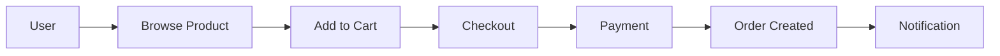
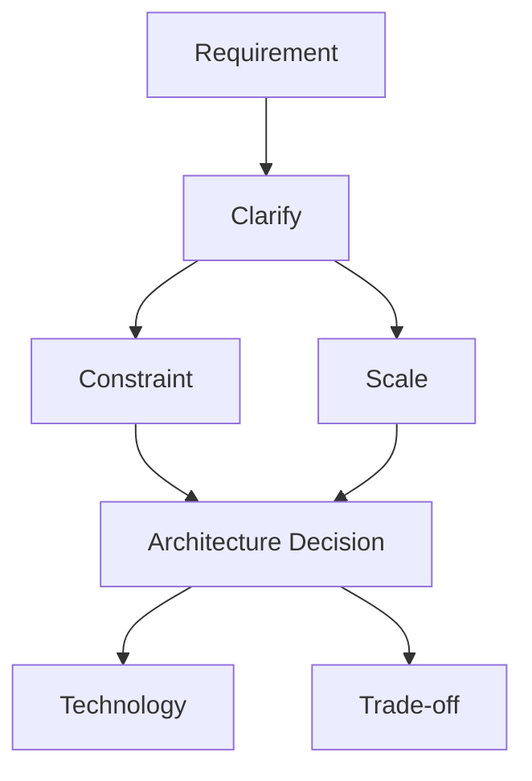
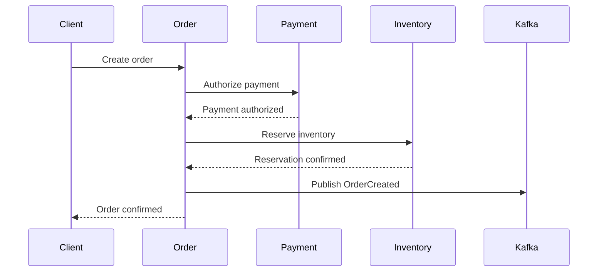

# 02- Requirement Gathering

## Overview

Requirement gathering is the first engineering activity in system design. Before choosing PostgreSQL, Redis, Kafka, Kubernetes, microservices, or any other technology, establish what the system must do and under what constraints it must operate.

In a system design interview, the initial problem statement is intentionally incomplete. A prompt such as:

> "Design a notification system."

does not tell you:

- who sends notifications
- who receives them
- which channels are supported
- notification volume
- latency requirements
- delivery guarantees
- retry behavior
- ordering requirements
- whether notifications can be duplicated
- whether users can configure preferences
- retention requirements
- geographic scope

The quality of the architecture depends heavily on the quality of these requirements.

A useful mental model is:

```text
Problem Statement
       |
       v
Clarify Ambiguity
       |
       v
Functional Requirements
       |
       v
Non-Functional Requirements
       |
       v
Constraints + Assumptions
       |
       v
Capacity Estimates
       |
       v
Architecture
```

Requirement gathering is not a preliminary formality. It determines the architecture, data model, communication patterns, scalability strategy, reliability model, and operational complexity.

---

## Why Requirement Gathering Matters

Different requirements can produce completely different architectures for the same product.

Consider a file-upload system.

If the requirement is:

```text
1,000 uploads/day
Maximum file size = 10 MB
Single region
```

a simple Django or FastAPI application with PostgreSQL and object storage may be sufficient.

Now change the requirements:

```text
10 million uploads/day
Maximum file size = 10 GB
Global users
Resumable uploads
Automatic transcoding
Multi-region availability
```

The architecture may now require:

- object storage
- multipart uploads
- CDN
- asynchronous processing
- queues or Kafka
- distributed workers
- metadata databases
- regional deployment
- observability
- lifecycle policies

The product did not fundamentally change. The constraints did.

---

## Requirement Categories

A practical requirement-gathering framework separates requirements into several categories.

| Category | Questions |
|---|---|
| Functional | What must the system do? |
| Users | Who uses the system and how? |
| Traffic | How much traffic exists? |
| Data | What data is created and accessed? |
| Latency | How quickly must requests complete? |
| Availability | How much downtime is acceptable? |
| Consistency | How fresh and correct must reads be? |
| Durability | Can data be lost? |
| Security | What must be protected? |
| Compliance | Are there regulatory constraints? |
| Geography | Is the system regional or global? |
| Cost | What infrastructure constraints exist? |
| Operations | How must the system be deployed and operated? |

The exact categories depend on the system.

---

## Start With the Problem, Not the Solution

A common mistake is jumping from the problem statement directly to technologies.

Weak approach:

```text
"Design a payment system."

I'll use:
- Kafka
- Redis
- PostgreSQL
- Kubernetes
- microservices
```

Better approach:

```text
What operations are required?
        |
How many transactions?
        |
What consistency is required?
        |
What happens when payment processing fails?
        |
Can requests be retried?
        |
What must be strongly consistent?
        |
What are the availability and durability requirements?
        |
Then select architecture and technologies.
```

Technology choices should emerge from requirements.

---

## Functional Requirements

Functional requirements describe the capabilities the system must provide.

For an e-commerce system, they might include:

- users can browse products
- users can search products
- users can add products to carts
- users can place orders
- users can make payments
- users can view order status
- users can receive notifications

Avoid unnecessarily expanding the feature set.

If the interviewer asks:

> "Design an order management system."

you do not automatically need:

- recommendation engines
- social features
- machine learning
- advanced analytics
- loyalty programs

unless those features affect the requested design.

---

## Identifying Core Operations

Convert the product requirements into system operations.

For a URL shortener:

```text
Create short URL
Resolve short URL
Delete short URL
View analytics
```

For a messaging system:

```text
Create conversation
Send message
Receive message
Read message
List conversations
Search messages
```

For a payment system:

```text
Create payment
Authorize payment
Capture payment
Refund payment
Query payment status
```

This makes the architecture easier to reason about because each operation eventually maps to:

- APIs
- data access
- storage
- communication
- consistency requirements

---

## Primary User Journeys

Identify the most important user journeys rather than listing every feature.

For an e-commerce application:



The primary journey helps identify the critical request path.

For example:

```text
Checkout
   |
   +--> Inventory
   |
   +--> Payment
   |
   +--> Order
```

This path deserves more architectural attention than an infrequently used administrative endpoint.

---

## Functional vs Non-Functional Requirements

The distinction is fundamental.

| Functional Requirement | Non-Functional Requirement |
|---|---|
| Create an order | p95 latency < 200 ms |
| Send a notification | 99.99% availability |
| Upload a file | Support 10 GB files |
| Search products | Search results within 100 ms |
| Process payment | No duplicate charges |
| Store messages | Durable for 7 years |

Functional requirements tell you **what** the system does.

Non-functional requirements tell you **how well** it must do it.

---

## Non-Functional Requirements

Non-functional requirements often determine the architecture more strongly than functional requirements.

Important dimensions include:

```text
Latency
Availability
Scalability
Consistency
Durability
Throughput
Security
Reliability
Cost
Observability
Disaster Recovery
```

Do not treat every dimension as equally important.

For example:

### Payment System

```text
Correctness > Availability > Latency
```

A payment system should not sacrifice transactional correctness merely to reduce latency.

### Social Feed

```text
Availability > Strong Consistency
```

A slightly stale feed may be acceptable if the system remains responsive.

### Trading System

```text
Latency + Correctness
```

may both be extremely important.

Requirements establish these priorities.

---

## Clarifying Questions

Good system designers ask questions that change the architecture.

Bad question:

> "Can you tell me more?"

Better:

> "Should the system guarantee that a message is delivered exactly once, or is at-least-once delivery with idempotent consumers acceptable?"

The second question directly affects the messaging architecture.

---

## Functional Clarification Questions

Ask questions such as:

- What are the core operations?
- Who are the primary users?
- Are users authenticated?
- Can users modify existing resources?
- Is deletion supported?
- Are notifications required?
- Is search required?
- Are analytics required?
- Is real-time behavior required?
- Are there administrative workflows?

Do not ask every possible question.

Ask questions that materially influence the architecture.

---

## Scale Clarification Questions

Traffic requirements are among the most important questions.

Ask:

- How many users?
- How many daily active users?
- How many requests per second?
- What is peak traffic?
- What is the read/write ratio?
- How large are requests and responses?
- How much data is stored?
- How quickly does data grow?

Example:

> "What is the expected order creation rate, and how much higher can traffic become during peak events?"

This is more useful than simply asking:

> "Is it high traffic?"

---

## Latency Requirements

Latency should be expressed quantitatively whenever possible.

Ask:

> "What latency target should we design for?"

For example:

```text
p50 < 50 ms
p95 < 200 ms
p99 < 500 ms
```

The percentile matters.

Average latency can hide severe tail latency.

For a user-facing API, a useful requirement might be:

```text
p95 < 200 ms
```

For an asynchronous report generation system:

```text
Completion within 30 seconds
```

may be more appropriate than a request latency target.

---

## Throughput Requirements

Latency and throughput are different.

### Latency

How long one operation takes.

```text
Request -> Response
       100 ms
```

### Throughput

How many operations the system can process over time.

```text
10,000 requests/second
```

A system can have:

```text
Low latency + low throughput
```

or:

```text
High throughput + high individual latency
```

depending on the workload.

---

## Read/Write Ratio

Always identify whether the workload is read-heavy or write-heavy.

Example:

```text
Reads: 95%
Writes: 5%
```

This strongly influences architecture.

A read-heavy system may benefit from:

- Redis
- CDN
- read replicas
- denormalized read models

A write-heavy system may require:

- partitioning
- batching
- append-oriented storage
- asynchronous processing
- carefully designed indexes

---

## Peak Traffic

Average traffic is insufficient.

Suppose:

```text
Average = 2,000 RPS
Peak = 20,000 RPS
```

Designing only for 2,000 RPS creates a predictable production failure.

Ask:

- What causes peak traffic?
- Is it predictable?
- How long does it last?
- Is the peak global or regional?
- Can traffic be queued?

For predictable events, capacity can be provisioned ahead of time.

For unpredictable bursts, autoscaling and buffering may be more important.

---

## Traffic Shape

Two systems can have identical daily traffic but very different architectural requirements.

### Smooth Traffic

```text
RPS
 ^
 |       ___________
 |      /           \
 |_____/             \____
 +------------------------> time
```

### Burst Traffic

```text
RPS
 ^
 |          |
 |          |
 |          |       |
 |          |       |
 |__________|_______|______> time
```

Burst traffic may require:

- queues
- rate limiting
- autoscaling
- caching
- pre-warming
- load shedding

---

## Data Requirements

Determine:

- what data exists
- who owns it
- how long it must be retained
- how frequently it changes
- how it is queried
- whether relationships matter
- whether transactions are required

For example:

```text
User
Order
OrderItem
Payment
Shipment
```

These relationships strongly suggest a relational model for the transactional core.

---

## Data Access Patterns

Before choosing SQL or NoSQL, determine how data is accessed.

Ask:

```text
How is data written?
How is it queried?
What fields are filtered?
What fields are sorted?
Are joins required?
Are aggregations required?
Are transactions required?
```

For example:

```sql
SELECT *
FROM orders
WHERE customer_id = ?
ORDER BY created_at DESC
LIMIT 50;
```

This access pattern suggests an index such as:

```sql
CREATE INDEX idx_orders_customer_created
ON orders(customer_id, created_at DESC);
```

The architecture should follow the access patterns rather than technology preferences.

---

## Data Retention

Ask:

> "How long must the data be retained?"

Possible requirements:

```text
Logs: 30 days
Analytics: 2 years
Financial transactions: 7+ years
Temporary cache: minutes
Session data: hours
```

Retention affects:

- storage cost
- database size
- partitioning
- archival
- backup strategy
- compliance

---

## Data Growth

Estimate growth rather than considering only current size.

Example:

```text
100 million events/day
500 bytes/event

Daily raw data:
100M × 500 bytes
≈ 50 GB/day

Annual raw data:
≈ 18 TB/year
```

Replication, indexes, metadata, backups, and overhead increase the actual storage requirement.

---

## Consistency Requirements

Ask:

> "How stale can the data be?"

Potential answers:

```text
Must be immediately consistent
        |
Read-after-write consistency
        |
Seconds of staleness acceptable
        |
Minutes of staleness acceptable
```

This determines whether you can use:

- asynchronous replication
- caches
- event-driven pipelines
- materialized views
- search indexes
- analytics pipelines

---

## Strong Consistency

Use strong consistency when stale data can cause unacceptable behavior.

Examples:

- bank balances
- inventory allocation
- payment state
- unique resource ownership

For example:

```text
Inventory = 1

Two users attempt purchase
        |
        v
Transactional database
        |
        v
Only one succeeds
```

---

## Eventual Consistency

Eventual consistency is appropriate when temporary staleness is acceptable.

Example:

```text
Order Created
     |
     v
PostgreSQL
     |
     v
Event
     |
     +--> Search Index
     |
     +--> Analytics
     |
     +--> Recommendation
```

The search index may update shortly after the order is created.

This is often preferable to making every subsystem part of one synchronous transaction.

---

## Availability Requirements

Ask:

> "What availability target is required?"

Examples:

```text
99%
99.9%
99.99%
99.999%
```

Approximate annual downtime:

| Availability | Downtime / Year |
|---|---:|
| 99% | 3.65 days |
| 99.9% | 8.76 hours |
| 99.99% | 52.6 minutes |
| 99.999% | 5.26 minutes |

The target should be tied to business requirements.

Not every system needs five nines.

---

## Durability Requirements

Availability and durability are different.

### Availability

Can users access the system?

### Durability

Will committed data survive failures?

A system can be:

```text
Highly available
+
Poorly durable
```

or:

```text
Highly durable
+
Temporarily unavailable
```

For financial systems, durability may be more important than immediate availability.

---

## Reliability Requirements

Clarify how the system should behave under failure.

Ask:

- What happens if a dependency fails?
- Can requests be retried?
- Can duplicate requests occur?
- Can operations be reordered?
- Can partial results be returned?
- Is graceful degradation acceptable?

This determines whether you need:

- retries
- timeouts
- circuit breakers
- queues
- dead-letter queues
- idempotency keys
- compensation workflows

---

## Delivery Semantics

For asynchronous systems, determine the acceptable delivery model.

| Model | Meaning | Typical Use |
|---|---|---|
| At-most-once | May lose messages, no duplicates from retries | Non-critical telemetry |
| At-least-once | Messages may be delivered multiple times | Most reliable event processing |
| Effectively-once | At-least-once transport plus idempotent processing | Payments, orders, critical workflows |
| Exactly-once | Strong processing semantics under defined scope | Specialized workloads |

Do not casually promise "exactly once."

In distributed systems, the practical design is often:

```text
At-least-once delivery
        +
Idempotent consumer
        =
Effectively-once business effect
```

---

## Ordering Requirements

Ask:

> "Does order matter?"

Examples where ordering can matter:

```text
PaymentCreated
PaymentCaptured
PaymentRefunded
```

Processing these out of order can produce invalid state.

Other workloads may not require ordering.

If ordering is required, determine:

- global ordering
- per-user ordering
- per-account ordering
- per-entity ordering

Per-entity ordering is often much easier to scale than global ordering.

---

## Real-Time Requirements

Clarify what "real-time" actually means.

It can mean:

```text
< 100 ms
< 1 second
< 5 seconds
< 30 seconds
```

Possible technologies include:

- WebSockets
- Server-Sent Events
- long polling
- Kafka
- Redis Streams
- message queues

Do not select WebSockets simply because the product description contains the word "real-time."

---

## Geographic Requirements

Ask:

- Is the system regional?
- Is it global?
- Where are users located?
- Are data residency requirements present?
- How much cross-region latency is acceptable?
- Is regional failover required?

A global system may require:

```text
Global DNS / Traffic Manager
          |
    +-----+-----+
    |           |
 Region A    Region B
    |           |
   API         API
    |           |
  Data        Data
```

But multi-region systems introduce:

- replication complexity
- conflict resolution
- higher cost
- operational complexity
- consistency challenges

Do not use multi-region deployment without a requirement that justifies it.

---

## Security Requirements

Security requirements should be gathered explicitly.

Ask:

- Is authentication required?
- What authorization model is required?
- What data is sensitive?
- Is encryption required?
- Are secrets subject to rotation?
- Is audit logging required?
- Are there compliance requirements?
- What abuse scenarios matter?

Examples:

```text
Authentication:
OAuth 2.0 / OIDC

Authorization:
RBAC / ABAC

Transport:
TLS

Secrets:
AWS Secrets Manager / Parameter Store

Audit:
Immutable audit events
```

---

## Compliance Requirements

Compliance can fundamentally change architecture.

Potential requirements include:

- GDPR
- PCI DSS
- HIPAA
- SOC 2
- regional data residency
- financial retention requirements

For example, payment card data may require stricter controls than ordinary application metadata.

Ask:

> "Are there regulatory, contractual, or data residency requirements?"

Do not assume compliance requirements from the product category.

---

## Cost Requirements

Cost is an architectural constraint.

Ask:

> "Is there a target infrastructure budget or cost-per-operation constraint?"

Cost may influence:

- storage selection
- retention
- replication
- multi-region deployment
- managed services
- caching
- compute strategy

A five-region active/active architecture may technically satisfy an availability requirement while being financially unjustified.

---

## Operational Requirements

Ask how the system is expected to operate after deployment.

Important questions include:

- How frequently is the system deployed?
- Is zero-downtime deployment required?
- How quickly must incidents be detected?
- What is the recovery process?
- Are on-call engineers available 24/7?
- What monitoring is required?
- Are backups tested?

Architecture is incomplete if the team cannot safely operate it.

---

## Deployment Requirements

Deployment strategy can affect architecture.

Possible approaches:

```text
Rolling deployment
Blue/green deployment
Canary deployment
Feature flags
```

For example, if a system requires zero downtime:

```text
Load Balancer
    |
    +--> Version A
    |
    +--> Version B
```

Traffic can gradually move between versions.

---

## Disaster Recovery Requirements

Ask:

> "What happens if an entire availability zone or region becomes unavailable?"

Clarify:

- RPO
- RTO
- backup frequency
- restore requirements
- regional failover
- data replication

Example:

```text
RPO = 5 minutes
RTO = 15 minutes
```

This is a much stronger requirement than:

> "The system should be highly reliable."

---

## Requirement Prioritization

Requirements often conflict.

For example:

```text
Strong consistency
        vs
Low latency
        vs
High availability
        vs
Low cost
```

You cannot always maximize all dimensions simultaneously.

Prioritize requirements.

A practical classification is:

| Priority | Meaning |
|---|---|
| Must | System cannot satisfy the problem without it |
| Should | Important but negotiable |
| Could | Useful if resources permit |
| Out of scope | Explicitly excluded |

For example:

```text
Must:
- create orders
- process payments
- prevent duplicate charges

Should:
- real-time notifications

Could:
- advanced analytics

Out of scope:
- recommendation engine
```

This prevents scope explosion.

---

## Identifying Constraints

Constraints are conditions that limit possible designs.

Examples:

```text
Must use PostgreSQL
Must run on AWS
Existing Django platform
Existing Kafka infrastructure
Budget limit
Regulatory requirements
Legacy database
Team expertise
Deployment frequency
```

Technical constraints are not necessarily requirements, but they can significantly influence architecture.

---

## Existing-System Constraints

In real engineering environments, you rarely design from a blank page.

You may inherit:

```text
Django monolith
PostgreSQL
Redis
Nginx
Celery
AWS
GitHub Actions
```

A requirement might therefore be:

> "The new service must integrate with the existing authentication system."

That changes the design.

System design should account for:

- existing APIs
- legacy databases
- authentication systems
- deployment pipelines
- observability platforms
- operational capabilities

---

## Assumptions

When the interviewer does not provide information, make explicit assumptions.

Example:

```text
Assumptions:

- 10 million daily active users
- 100 million reads/day
- 10 million writes/day
- Peak traffic is 5× average
- Requests are authenticated
- Search can be eventually consistent
- Primary transactional data requires strong consistency
- Single-region deployment initially
```

Assumptions make your reasoning auditable.

If an interviewer changes one assumption, you can explain which part of the architecture changes.

---

## Capacity Estimation From Requirements

Requirement gathering should eventually produce numbers.

Suppose:

```text
100 million requests/day
```

Average RPS:

```text
100,000,000 / 86,400
≈ 1,157 RPS
```

Assume 5× peak:

```text
≈ 5,785 peak RPS
```

Round it:

```text
≈ 6,000 peak RPS
```

This becomes an architectural input.

---

## Storage Estimation

Suppose:

```text
10 million writes/day
Average record = 1 KB
```

Daily raw storage:

```text
10M × 1 KB
= 10 GB/day
```

Annual raw storage:

```text
10 GB × 365
≈ 3.65 TB/year
```

Real storage will be larger due to:

- indexes
- replication
- metadata
- WAL
- backups
- overhead

Capacity planning should include growth and operational headroom.

---

## Bandwidth Estimation

Suppose:

```text
6,000 RPS peak
Average response = 25 KB
```

Approximate outbound bandwidth:

```text
6,000 × 25 KB
= 150 MB/s
```

This becomes:

```text
150 MB/s × 86,400
≈ 12.96 TB/day
```

This may justify:

- compression
- CDN
- pagination
- smaller response payloads
- caching

---

## Turning Requirements Into Architecture

A useful mapping is:

| Requirement | Likely Architectural Concern |
|---|---|
| High read volume | Cache / read replicas |
| High write volume | Partitioning / batching / async processing |
| Low latency | Caching / fewer network hops |
| High availability | Replication / failover |
| Global users | CDN / multi-region |
| Large files | Object storage |
| Async processing | Queue / Kafka |
| Search | Search index |
| Strong transactions | Relational database |
| Massive event stream | Kafka |
| Temporary cache | Redis |
| Long-running jobs | Celery / queue |
| Zero downtime | Rolling / blue-green deployment |

These are not automatic technology selections. They are starting points for architectural reasoning.

---

## Requirement-to-Architecture Flow



For example:

```text
Requirement:
100 million reads/day

        ↓

Constraint:
Low latency

        ↓

Architecture:
Cache hot data

        ↓

Technology:
Redis

        ↓

Trade-off:
Additional cache invalidation complexity
```

This is the reasoning interviewers want to see.

---

## Requirement Gathering for a REST API

For a REST API, clarify:

- resources
- operations
- authentication
- authorization
- pagination
- filtering
- sorting
- idempotency
- rate limits
- error handling
- versioning

Example:

```http
GET /v1/orders?limit=50&cursor=abc123
```

Questions include:

```text
Can clients request arbitrary page sizes?
Can clients filter by status?
Is cursor pagination required?
What happens when an order is deleted?
Can clients retry POST requests?
```

These decisions affect API and database design.

---

## Requirement Gathering for gRPC

For internal gRPC communication, ask:

- Is communication service-to-service?
- Is low latency important?
- Is streaming required?
- What are timeout requirements?
- What are compatibility requirements?
- How are retries handled?
- Is service discovery required?

Example:

```text
Order Service
     |
     | gRPC
     v
Inventory Service
```

The requirements may justify gRPC for internal communication while REST remains the public API.

---

## Requirement Gathering for Event-Driven Systems

Ask:

- What events exist?
- Who consumes them?
- Is ordering required?
- Is replay required?
- What delivery semantics are acceptable?
- How long should events be retained?
- What happens when consumers are unavailable?
- How are schemas versioned?

Example:

```text
Order Service
     |
     | OrderCreated
     v
Kafka
  / | \
 v  v  v
Email Search Analytics
```

The architecture depends heavily on the answers.

---

## Requirement Gathering for Caching

Ask:

- What data is cacheable?
- How frequently is it read?
- How frequently does it change?
- How stale can it be?
- What happens on cache failure?
- What is the expected cache size?
- Are there hot keys?

Example:

```text
Product Catalog
    |
    +--> Frequently read
    +--> Changes infrequently
    +--> Small objects
    +--> Seconds of staleness acceptable
```

This is a strong candidate for caching.

---

## Requirement Gathering for Background Jobs

For asynchronous jobs, ask:

- How long can a job take?
- How many jobs are generated?
- Can jobs be retried?
- Are jobs idempotent?
- Does ordering matter?
- What happens after repeated failure?
- Is a dead-letter queue required?
- Can users poll job status?

Example:

```text
POST /reports
        |
        v
202 Accepted
        |
        v
Queue
        |
        v
Worker
        |
        v
Report Storage
```

The HTTP request should not remain open while a long-running job executes.

---

## Requirement Gathering for Microservices

Do not begin with:

> "How many microservices should we create?"

Begin with:

- What are the business capabilities?
- Which components need independent scaling?
- Which components have independent ownership?
- Which components have different reliability requirements?
- Where are transaction boundaries?
- Where are team boundaries?
- Which components need independent deployment?

A service boundary should have an engineering reason.

---

## Requirement Gathering for Databases

Before selecting a database, determine:

```text
Data model
Access patterns
Transaction requirements
Consistency
Scale
Read/write ratio
Retention
Query complexity
Availability
Durability
Operational constraints
```

Example decision:

```text
Relational data
+
Complex joins
+
Transactions
+
Strong consistency
        |
        v
PostgreSQL
```

Another workload:

```text
Massive event ingestion
+
Simple key-based access
+
Horizontal scaling
+
Flexible schema
        |
        v
Potential NoSQL / event-store design
```

The database should follow the workload.

---

## Requirement Gathering for Search

Search requirements should be explicit.

Ask:

- Exact lookup or full-text search?
- Prefix matching?
- Fuzzy matching?
- Ranking?
- Filtering?
- Faceting?
- Typo tolerance?
- How fresh must results be?
- How large is the index?

A simple:

```sql
WHERE name ILIKE '%phone%'
```

may be enough for a small dataset.

Large-scale full-text search may justify a dedicated search engine.

---

## Requirement Gathering for Notifications

Ask:

- Which channels?
- Email?
- SMS?
- Push?
- In-app?
- How quickly must delivery occur?
- Can notifications be delayed?
- Are duplicates acceptable?
- What happens if a provider fails?
- Are user preferences required?
- What are provider rate limits?

A production architecture may eventually become:

```text
Application
    |
Event
    |
Queue
    |
Notification Service
   / | \
  /  |  \
Email SMS Push
```

But only after requirements justify the complexity.

---

## Requirement Gathering for File Systems

Ask:

- Maximum file size?
- Number of files?
- Upload frequency?
- Download frequency?
- Public or private?
- Retention?
- Versioning?
- Resumable uploads?
- Virus scanning?
- Processing required?
- Geographic distribution?

Large files usually should not flow through application servers unnecessarily.

A possible architecture is:

```text
Client
  |
  | Presigned URL
  v
S3
  |
  | Event
  v
Queue
  |
  v
Worker
```

---

## Requirement Gathering for Real-Time Systems

Ask:

- What does real-time mean?
- How many concurrent connections?
- How often are updates generated?
- Are updates broadcast or targeted?
- Is message ordering required?
- Can updates be dropped?
- Must clients reconnect automatically?
- Is historical replay required?

A chat system with:

```text
10,000 concurrent connections
```

has very different requirements from:

```text
10 million concurrent connections
```

Connection count can be more important than request-per-second measurements.

---

## Requirement Gathering for Distributed Systems

For distributed workflows, identify:

```text
Ownership
Consistency
Ordering
Retries
Idempotency
Timeouts
Failure handling
Observability
```

A distributed workflow should be represented explicitly.

Example:



Then ask:

> What happens if inventory succeeds but publishing the event fails?

This question exposes the need for reliable event publication patterns such as transactional outbox, depending on the architecture.

---

## Requirement Conflicts

Requirements frequently conflict.

Examples:

```text
Strong consistency
vs
Low latency

High availability
vs
Strict consistency

Global availability
vs
Simple operations

Unlimited retention
vs
Low cost

High throughput
vs
Complex validation
```

Do not hide these conflicts.

Make them explicit.

For example:

> "We can provide strong consistency for the transactional order state, while allowing search and analytics to be eventually consistent. This keeps the critical path correct without forcing every subsystem into a synchronous transaction."

That is a stronger architectural statement than simply saying:

> "We'll use microservices."

---

## Requirement Prioritization Under Conflict

When requirements conflict, establish priority.

Example:

```text
Payment System

1. Prevent duplicate charges
2. Preserve transaction correctness
3. Ensure durable payment state
4. Maintain high availability
5. Minimize latency
```

This tells you what to sacrifice when constraints collide.

For example, temporarily rejecting payment requests may be preferable to accepting a request that could create duplicate charges.

---

## Scope Control

Requirement gathering should prevent unnecessary system expansion.

Use explicit boundaries:

```text
In Scope:
- create order
- update order
- cancel order
- view order

Out of Scope:
- recommendations
- loyalty
- social sharing
- advanced analytics
```

Scope control is especially important in interviews because time is limited.

---

## Interview Technique: Ask High-Value Questions

Not all questions have equal value.

A high-value question changes the architecture.

### Low-Value

> "What color should the UI be?"

### High-Value

> "Can the user tolerate a few seconds of stale data?"

### Low-Value

> "Should the response have another optional field?"

### High-Value

> "Can the operation be retried without creating a duplicate?"

Prioritize questions that affect:

- storage
- communication
- consistency
- scalability
- reliability
- security
- availability

---

## The Architecture Impact Test

Before asking a question, mentally ask:

> "Would a different answer change my architecture?"

If yes, ask it.

If no, defer it.

For example:

```text
Question:
"Do users need email notifications?"

Potential impact:
Queue + notification service

Ask it.
```

Another:

```text
Question:
"Should the field be named displayName or name?"

Architecture impact:
None

Defer it.
```

This keeps requirement gathering efficient.

---

## Requirement Matrix

For larger systems, maintain a compact requirement matrix.

| Requirement | Type | Priority | Target | Architectural Impact |
|---|---|---|---|---|
| Create order | Functional | Must | < 500 ms | Transactional API |
| Prevent duplicate payment | Reliability | Must | 100% | Idempotency |
| Read order | Functional | Must | p95 < 200 ms | Index/cache |
| Notifications | Functional | Should | < 10 sec | Async queue |
| Availability | NFR | Must | 99.99% | HA deployment |
| Analytics | Functional | Could | < 5 min stale | Async pipeline |
| Data retention | Compliance | Must | 7 years | Storage lifecycle |

This approach makes the transition from requirements to architecture explicit.

---

## Requirement Traceability

Each major architectural decision should trace back to a requirement.

Example:

```text
Requirement:
Low-latency product reads

        ↓

Decision:
Redis cache

        ↓

Trade-off:
Cache invalidation complexity
```

Another:

```text
Requirement:
Long-running report generation

        ↓

Decision:
Asynchronous worker

        ↓

Trade-off:
Eventual completion + job tracking
```

Another:

```text
Requirement:
Prevent duplicate payments

        ↓

Decision:
Idempotency key + transactional state

        ↓

Trade-off:
Additional state management
```

This is the foundation of good architecture decision records.

---

## Common Requirement Gathering Mistakes

### Asking Too Many Questions

Do not turn the interview into a questionnaire.

Ask only questions that influence architecture.

### Asking Too Few Questions

Jumping directly into architecture leads to unsupported assumptions.

### Not Quantifying Scale

"Millions of users" is not enough.

Translate it into:

```text
DAU
RPS
peak RPS
read/write ratio
storage
bandwidth
concurrent connections
```

### Confusing Users With Traffic

10 million registered users does not necessarily mean 10 million concurrent users.

### Ignoring Peak Load

Average traffic can hide major scaling requirements.

### Ignoring Data Growth

Current storage is not enough.

Estimate future growth.

### Ignoring Consistency

Ask how stale data can be.

### Ignoring Failure

Requirements should include expected behavior when dependencies fail.

### Assuming Global Deployment

Global infrastructure should be justified by geographic or availability requirements.

### Treating Every Requirement as Mandatory

Prioritize requirements to avoid unnecessary complexity.

---

## Production Pitfalls

### Requirement Drift

Requirements can change after implementation begins.

Maintain:

- architecture decision records
- API contracts
- capacity assumptions
- service ownership
- operational documentation

### Hidden Requirements

Requirements often exist outside the original product specification:

- compliance
- security
- data residency
- retention
- operational support
- disaster recovery

### Unbounded Requirements

Statements such as:

> "The system should support unlimited users."

are not actionable.

Convert them into measurable targets.

### Unclear Ownership

Determine who owns:

- data
- APIs
- services
- events
- operational alerts

Ownership affects service boundaries and incident response.

---

## Interview Traps

| Trap | Better Question |
|---|---|
| "Use microservices" | What requires independent scaling or ownership? |
| "Use Redis" | What data is cacheable and how stale can it be? |
| "Use Kafka" | What event semantics and consumer behavior are required? |
| "Use NoSQL" | What are the access patterns and consistency requirements? |
| "Use Kubernetes" | What orchestration and availability requirements justify it? |
| "Make it real-time" | What latency target and concurrency are required? |
| "Make it highly available" | What availability percentage is required? |
| "Make it globally scalable" | Which regions and traffic patterns must be supported? |
| "Exactly-once delivery" | Can the business operation be made idempotent instead? |
| "Infinite scalability" | What concrete capacity target must be supported? |

---

## A Reusable Requirement Gathering Framework

Use this sequence during system design interviews:

```text
Problem
  |
  v
Who are the users?
  |
  v
What are the core operations?
  |
  v
What is explicitly out of scope?
  |
  v
How much traffic?
  |
  v
What is the read/write ratio?
  |
  v
What is peak traffic?
  |
  v
How much data?
  |
  v
How fast does data grow?
  |
  v
What latency is required?
  |
  v
What availability is required?
  |
  v
What consistency is required?
  |
  v
What durability is required?
  |
  v
What failure behavior is required?
  |
  v
What security/compliance constraints exist?
  |
  v
What geographic requirements exist?
  |
  v
What operational/cost constraints exist?
  |
  v
State assumptions
```

You should be able to complete this process in a few minutes for a typical interview problem.

---

## Requirement Checklist

### Functional

- [ ] Who are the users?
- [ ] What are the core use cases?
- [ ] What operations must be supported?
- [ ] What is explicitly out of scope?
- [ ] Are real-time features required?
- [ ] Are asynchronous workflows required?

### Scale

- [ ] Number of users
- [ ] DAU / MAU
- [ ] Requests per second
- [ ] Peak RPS
- [ ] Read/write ratio
- [ ] Concurrent connections
- [ ] Request size
- [ ] Response size
- [ ] Storage growth

### Performance

- [ ] p50 latency
- [ ] p95 latency
- [ ] p99 latency
- [ ] Throughput
- [ ] Peak traffic duration

### Data

- [ ] Data model
- [ ] Access patterns
- [ ] Transactions
- [ ] Consistency
- [ ] Retention
- [ ] Archival
- [ ] Backup requirements

### Reliability

- [ ] Availability target
- [ ] Durability
- [ ] Failure behavior
- [ ] Retry requirements
- [ ] Idempotency
- [ ] Ordering
- [ ] RPO
- [ ] RTO

### Security

- [ ] Authentication
- [ ] Authorization
- [ ] Encryption
- [ ] Secrets
- [ ] Audit logging
- [ ] Abuse prevention
- [ ] Compliance

### Geography

- [ ] Single region or multi-region
- [ ] User distribution
- [ ] Data residency
- [ ] Regional failover
- [ ] Cross-region consistency

### Operations

- [ ] Deployment strategy
- [ ] Monitoring
- [ ] Alerting
- [ ] Logging
- [ ] Tracing
- [ ] Backups
- [ ] Disaster recovery
- [ ] Cost constraints

---

## From Requirements to Architecture

A strong system design answer should make the following chain obvious:

```text
Requirement
    ↓
Constraint
    ↓
Engineering Decision
    ↓
Technology
    ↓
Trade-off
```

Example:

```text
Requirement:
95% of product reads must complete under 100 ms

        ↓

Constraint:
Database cannot be queried for every request

        ↓

Decision:
Cache frequently accessed product data

        ↓

Technology:
Redis

        ↓

Trade-off:
Cache invalidation and stale-data handling
```

Another:

```text
Requirement:
Report generation may take several minutes

        ↓

Constraint:
HTTP request cannot remain open indefinitely

        ↓

Decision:
Asynchronous job processing

        ↓

Technology:
Celery + Redis / queue

        ↓

Trade-off:
Client must track job status
```

Another:

```text
Requirement:
Multiple downstream systems consume order events

        ↓

Constraint:
Producer should not synchronously call every consumer

        ↓

Decision:
Event-driven fan-out

        ↓

Technology:
Kafka

        ↓

Trade-off:
Eventual consistency and operational complexity
```

This reasoning pattern should become automatic.

---

## Senior-Level Requirement Thinking

At senior level, requirement gathering extends beyond product behavior.

You should consider:

### Business Constraints

- revenue impact
- operational cost
- customer impact
- critical workflows

### Organizational Constraints

- team ownership
- existing expertise
- deployment capabilities
- on-call maturity

### Technical Constraints

- existing databases
- legacy services
- APIs
- cloud environment
- infrastructure

### Operational Constraints

- incident response
- observability
- backup recovery
- deployment frequency

### Evolution Constraints

- expected traffic growth
- new regions
- future product capabilities
- migration requirements

A technically elegant architecture that the organization cannot operate is not a good architecture.

---

## Practical Interview Script

A concise opening can be:

> "Before designing the architecture, I'd like to clarify the core use cases and the most important non-functional requirements. Then I'll estimate the workload, define the main APIs and data model, and build the high-level architecture. After that I'll deep dive into the components most likely to become bottlenecks or reliability risks."

Then ask focused questions:

```text
1. What are the core user operations?

2. How many users and requests should we support?

3. What is the expected peak traffic?

4. What is the read/write ratio?

5. What latency target should we meet?

6. What availability target is expected?

7. What consistency guarantees are required?

8. How much data is generated and how long is it retained?

9. Is the system regional or global?

10. What security, compliance, and disaster-recovery constraints exist?
```

You do not need to ask every question if the interviewer has already answered it.

---

## Key Takeaways

- **Requirement gathering converts an ambiguous product problem into explicit functional, non-functional, scale, reliability, security, and operational constraints.**
- **Ask questions that can change the architecture; prioritize traffic, latency, consistency, availability, data growth, failure behavior, geography, and compliance over low-impact details.**
- **Quantify vague requirements using RPS, peak RPS, read/write ratio, storage growth, bandwidth, concurrent connections, latency percentiles, RPO, and RTO.**
- **Every major architectural decision should trace back to a requirement and include its engineering trade-off; technologies should follow requirements rather than personal preference.**
- **Senior-level requirement gathering considers not only product behavior but also failure modes, operational maturity, organizational constraints, cost, security, and how the architecture must evolve over time.**