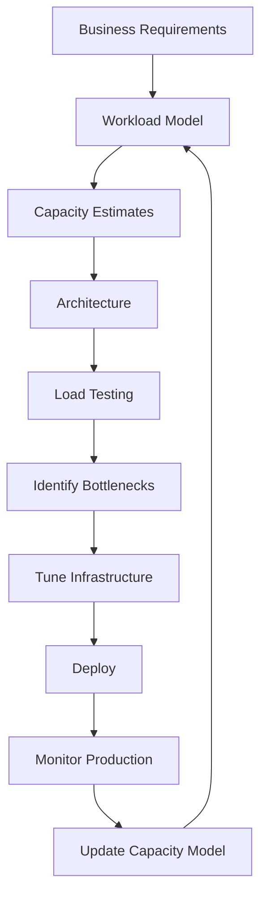

# 03- Capacity Estimation

## Overview

Capacity estimation translates product requirements into approximate infrastructure requirements. It answers questions such as:

- How many requests per second must the system handle?
- What is the expected peak traffic?
- How much data will be stored?
- How much bandwidth is required?
- How many database operations are generated?
- How many servers or containers might be required?
- Which component is likely to become the bottleneck?

The goal is not mathematical precision. In system design, capacity estimates are usually approximate because the initial requirements are incomplete and production behavior is uncertain.

The objective is to establish the **order of magnitude** of the workload and use that information to make architectural decisions.

A typical estimation flow is:

```text
Product Requirements
        |
        v
Users / Traffic
        |
        v
Requests Per Second
        |
        +----> Read / Write Distribution
        |
        +----> Peak Traffic
        |
        v
Data Volume
        |
        +----> Storage
        +----> Bandwidth
        +----> Database Operations
        |
        v
Infrastructure Capacity
        |
        v
Architecture Decisions
```

A good estimate should be:

- fast enough to perform during an interview
- explicit about assumptions
- easy to validate
- accurate enough to distinguish between architectural options
- expressed using practical engineering units

---

## Why Capacity Estimation Matters

Architecture decisions should be driven by workload characteristics.

Consider two APIs:

```text
API A:
100 requests/second
5 KB response
5 GB database

API B:
100,000 requests/second
500 KB response
100 TB database
```

Both are technically REST APIs, but their architectures are fundamentally different.

API A may work with:

```text
Django/FastAPI
+
PostgreSQL
+
Redis
```

API B may require:

```text
Load Balancers
+
Autoscaling
+
CDN
+
Caching
+
Database partitioning
+
Read replicas
+
Object storage
+
Asynchronous processing
+
Distributed observability
```

Capacity estimation exposes these differences before implementation.

---

## Estimation Principles

Capacity estimation should follow a few principles.

### Use Orders of Magnitude

Do not spend interview time calculating:

```text
1,157.407 requests/second
```

Use:

```text
≈ 1,200 RPS
```

or:

```text
≈ 1K RPS
```

The architecture rarely changes because the result is 1,157 instead of 1,200.

### State Assumptions

For example:

```text
Assumptions:
- 10 million DAU
- 20 requests/user/day
- 10% peak-hour traffic
- 5 KB average response
- 1 KB average write
```

The assumptions matter more than false numerical precision.

### Round Aggressively

Useful approximations:

```text
1 day ≈ 100,000 seconds
1 month ≈ 30 days
1 year ≈ 365 days
1 million ≈ 10^6
1 billion ≈ 10^9
```

For interview estimation, these approximations make mental arithmetic much easier.

---

## Core Units

| Quantity | Typical Unit |
|---|---|
| Users | users |
| Daily active users | DAU |
| Monthly active users | MAU |
| Requests | requests/day |
| Traffic | RPS/QPS |
| Storage | GB/TB/PB |
| Data transfer | MB/s or GB/s |
| Record size | bytes/KB/MB |
| Latency | ms |
| Throughput | operations/sec |
| Concurrent connections | connections |
| Events | events/sec |
| Database operations | queries/sec |
| Compute | CPU cores / instances |

Understand the unit before calculating.

---

## The Most Important Numbers

During a system design interview, prioritize:

```text
1. DAU / MAU
2. Requests per user
3. Average RPS
4. Peak RPS
5. Read/write ratio
6. Request and response size
7. Storage growth
8. Bandwidth
9. Concurrent connections
10. Retention period
```

You usually do not need to estimate every possible metric.

Focus on numbers that influence architecture.

---

## Users to Requests

Suppose:

```text
10 million DAU
20 API requests/user/day
```

Daily requests:

```text
10M × 20
= 200M requests/day
```

Average RPS:

```text
200M / 86,400
≈ 2,315 RPS
```

Round:

```text
≈ 2.3K RPS
```

This is the baseline workload.

---

## Average RPS

The basic formula is:

```text
Average RPS =
Daily Requests / Seconds Per Day
```

Since:

```text
Seconds Per Day = 24 × 60 × 60
               = 86,400
```

A useful approximation is:

```text
1 day ≈ 100K seconds
```

Therefore:

```text
100M requests/day
≈ 1K RPS
```

This shortcut is extremely useful during interviews.

---

## Peak RPS

Average traffic is not sufficient.

If:

```text
Average RPS = 2,000
Peak multiplier = 5×
```

then:

```text
Peak RPS = 2,000 × 5
         = 10,000 RPS
```

Design around the expected peak rather than the average.

A reasonable peak multiplier depends on the workload.

| Workload | Potential Peak Pattern |
|---|---|
| Internal business application | 2–3× |
| Consumer API | 3–5× |
| Social media | 5–10× |
| Flash sale | 10×+ |
| Scheduled batch system | Extremely bursty |

These are estimation assumptions, not universal constants.

---

## Peak Traffic Distribution

Traffic is often concentrated in specific periods.

Suppose:

```text
100M requests/day
```

If 30% occur during a 6-hour period:

```text
30M requests / 21,600 seconds
≈ 1,389 RPS
```

The average daily RPS would be only:

```text
100M / 86,400
≈ 1,157 RPS
```

The difference is significant.

If traffic is concentrated further into a one-hour period:

```text
30M / 3,600
≈ 8,333 RPS
```

The traffic profile matters as much as the daily total.

---

## Read/Write Ratio

Suppose peak traffic is:

```text
10,000 RPS
```

with:

```text
90% reads
10% writes
```

Then:

```text
Read RPS  = 10,000 × 0.90
          = 9,000 RPS

Write RPS = 10,000 × 0.10
          = 1,000 RPS
```

This distinction is important because reads and writes often scale differently.

A read-heavy system may use:

```text
Redis
+
CDN
+
Read Replicas
```

A write-heavy system may require:

```text
Partitioning
+
Batching
+
Asynchronous Processing
+
Append-Oriented Storage
```

---

## Read Amplification

One API request does not necessarily equal one database query.

For example:

```text
GET /orders/123
```

may execute:

```text
1 query -> order
1 query -> customer
1 query -> shipping
3 queries total
```

At:

```text
10,000 API RPS
```

that could produce:

```text
30,000 database queries/second
```

Capacity estimation must account for downstream amplification.

A useful model is:

```text
Downstream QPS =
API RPS × Operations Per Request
```

---

## Write Amplification

A single logical write may generate multiple physical writes.

For example:

```text
Create Order
    |
    +--> orders table
    +--> order_items table
    +--> inventory update
    +--> audit record
    +--> outbox event
```

One API request could result in several database writes.

Therefore:

```text
Database Write QPS
≠
API Write RPS
```

Estimate the actual work performed by the system.

---

## API Capacity Model

A useful general model is:

```text
External Traffic
        |
        v
Load Balancer
        |
        v
Application Servers
        |
        +--> PostgreSQL
        +--> Redis
        +--> Kafka
        +--> External APIs
```

Estimate capacity at each layer.

For example:

```text
10K API RPS
    |
    +--> 8K Redis operations/s
    |
    +--> 3K DB queries/s
    |
    +--> 2K Kafka events/s
```

The total downstream work can exceed incoming API traffic.

---

## Storage Estimation

Storage estimation determines:

- database size
- object storage requirements
- backup size
- replication requirements
- partitioning strategy
- archival strategy
- storage cost

The basic formula is:

```text
Storage =
Records × Average Record Size
```

For continuous growth:

```text
Annual Storage =
Daily Storage × 365
```

---

## Example: Database Storage

Suppose:

```text
10M new records/day
Average record size = 2 KB
```

Daily raw storage:

```text
10M × 2 KB
= 20 GB/day
```

Annual raw storage:

```text
20 GB × 365
≈ 7.3 TB/year
```

This is only the logical record size.

Actual PostgreSQL storage can be substantially larger because of:

- indexes
- tuple headers
- page overhead
- WAL
- dead tuples
- replication
- backups
- metadata

Do not treat raw payload size as final disk capacity.

---

## Index Overhead

Suppose a table stores:

```text
10 TB of logical data
```

If indexes consume an additional 30%:

```text
Index storage
≈ 3 TB
```

Then:

```text
Logical data = 10 TB
Indexes      = 3 TB
--------------------
Approx       = 13 TB
```

Additional capacity may be needed for:

- free space
- maintenance operations
- vacuum
- temporary files
- replication
- backups

Production storage planning should include headroom.

---

## Storage Growth

Storage requirements should be projected over time.

Example:

```text
Daily growth = 50 GB
```

Then approximately:

```text
Monthly:
50 × 30
≈ 1.5 TB

Annual:
50 × 365
≈ 18.25 TB
```

Now consider:

```text
3-year retention
```

Raw storage:

```text
18.25 × 3
≈ 54.75 TB
```

This may change the database architecture.

---

## Retention

Retention directly affects storage.

Suppose:

```text
100 GB/day
```

and:

```text
Retention = 30 days
```

Then:

```text
100 × 30
= 3 TB
```

With:

```text
Retention = 7 years
```

the requirement becomes:

```text
100 × 365 × 7
≈ 255.5 TB
```

Long retention often justifies:

```text
Hot Storage
     |
     v
Warm Storage
     |
     v
Cold / Archive Storage
```

For AWS workloads, object storage and lifecycle policies are often more appropriate for historical data than keeping everything in a primary relational database.

---

## Data Size Estimation

Estimate realistic record sizes.

Example:

```text
User record

user_id        = 8 bytes
email          = 100 bytes
name           = 100 bytes
metadata       = 500 bytes
timestamps     = 32 bytes
--------------------------------
Logical size   ≈ 740 bytes
```

Round to:

```text
≈ 1 KB/user
```

Avoid estimating only from the visible business fields. Production records may include:

- IDs
- timestamps
- status fields
- metadata
- version numbers
- audit fields

---

## Bandwidth Estimation

Bandwidth is:

```text
Requests/sec × Bytes/request
```

Suppose:

```text
10,000 RPS
Average response = 50 KB
```

Then:

```text
10,000 × 50 KB
= 500,000 KB/s
≈ 500 MB/s
```

Approximate daily transfer:

```text
500 MB/s × 86,400
≈ 43.2 TB/day
```

This is substantial.

It may justify:

- CDN
- compression
- pagination
- smaller responses
- caching
- binary protocols for internal traffic

---

## Upload Bandwidth

For uploads:

```text
Upload RPS × Average Upload Size
```

Suppose:

```text
100 uploads/sec
10 MB/upload
```

Then:

```text
100 × 10 MB
= 1,000 MB/s
≈ 1 GB/s
```

Routing this through application servers may be unnecessary.

A better architecture may use:

```text
Client
   |
   | Presigned URL
   v
Object Storage
```

The application server handles metadata and authorization rather than transferring the entire file.

---

## Request Size vs Response Size

Estimate both.

Example:

```text
POST /events

Request = 2 KB
Response = 200 bytes
```

versus:

```text
GET /feed

Request = 500 bytes
Response = 100 KB
```

Read-heavy APIs often create much more outbound bandwidth than inbound bandwidth.

---

## Compression

Compression can reduce network bandwidth significantly.

For example:

```text
100 KB JSON response
        |
     gzip/zstd
        |
     20 KB
```

The exact compression ratio depends on payload characteristics.

However, compression introduces:

- CPU overhead
- latency
- configuration complexity

For high-volume APIs, estimate bandwidth both before and after compression where appropriate.

---

## Concurrent Connections

RPS is not the same as concurrent connections.

Suppose:

```text
RPS = 10,000
Average request duration = 100 ms
```

Using Little's Law:

```text
Concurrency ≈ Throughput × Latency
```

Therefore:

```text
10,000 × 0.1
= 1,000 concurrent requests
```

This is useful for estimating:

- worker capacity
- connection pools
- memory usage
- WebSocket infrastructure

---

## Little's Law

Little's Law is:

```text
L = λW
```

Where:

- `L` = average number of items in the system
- `λ` = arrival rate
- `W` = average time spent in the system

For backend systems:

```text
Concurrency = RPS × Average Latency
```

Example:

```text
5,000 RPS
200 ms latency

Concurrency:
5,000 × 0.2
= 1,000
```

This is particularly useful when estimating concurrent work.

---

## Queue Capacity

For asynchronous systems, estimate:

```text
Incoming Event Rate
vs
Processing Rate
```

Suppose:

```text
Incoming = 10,000 events/sec
Workers process = 8,000 events/sec
```

Backlog growth:

```text
10,000 - 8,000
= 2,000 events/sec
```

After one minute:

```text
2,000 × 60
= 120,000 queued events
```

If the workload remains unchanged, the queue continues growing.

A queue does not solve insufficient processing capacity by itself. It **buffers** the mismatch.

---

## Queue Drain Time

Suppose:

```text
Backlog = 1,000,000 messages

Processing capacity = 20,000/sec
Incoming traffic = 10,000/sec
```

Net drain rate:

```text
20,000 - 10,000
= 10,000/sec
```

Drain time:

```text
1,000,000 / 10,000
= 100 seconds
```

This is useful for determining recovery time after traffic spikes.

---

## Kafka Capacity Estimation

For Kafka, estimate:

```text
Events/sec
×
Average event size
```

Suppose:

```text
50,000 events/sec
2 KB/event
```

Ingress:

```text
50,000 × 2 KB
= 100 MB/s
```

If replication factor is 3:

```text
Approximate broker write volume
≈ 100 MB/s × 3
= 300 MB/s
```

Actual resource requirements depend on:

- compression
- batching
- partitions
- replication
- consumer behavior
- broker configuration
- disk throughput
- network throughput

Retention also matters.

If:

```text
100 MB/s
```

is retained for one day:

```text
100 × 86,400
≈ 8.64 TB/day
```

With replication factor 3:

```text
≈ 25.9 TB/day
```

This is an approximate storage-volume estimate before additional Kafka overhead and compression effects.

---

## Database Capacity Estimation

Database capacity should consider:

```text
Queries/sec
+
Query complexity
+
Rows scanned
+
Indexes
+
Transactions
+
Connection count
+
Working set
+
Storage I/O
```

Do not estimate PostgreSQL capacity solely from QPS.

For example:

```text
10,000 simple indexed reads
```

may be easier than:

```text
1,000 complex aggregation queries
```

Database capacity depends heavily on query shape.

---

## Database Connection Estimation

Suppose:

```text
100 application containers
```

and each can open:

```text
20 PostgreSQL connections
```

Maximum possible connections:

```text
100 × 20
= 2,000 connections
```

This may exceed what PostgreSQL can efficiently handle.

A production architecture should consider:

```text
Application
     |
     v
Connection Pooler
     |
     v
PostgreSQL
```

Connection count is a shared infrastructure constraint, not something each application instance can scale independently.

---

## Redis Capacity Estimation

For Redis, estimate:

```text
Operations/sec
+
Memory
+
Key/value size
+
Eviction behavior
+
Replication
+
Persistence requirements
```

Suppose:

```text
5,000 cache reads/sec
1,000 cache writes/sec
```

Redis handles:

```text
≈ 6,000 operations/sec
```

But memory may be the more important constraint.

Suppose:

```text
10M cached objects
Average object = 2 KB
```

Raw payload:

```text
10M × 2 KB
= 20 GB
```

Actual memory usage is higher because Redis stores object and key metadata.

Always include headroom.

---

## Cache Working Set

Not all application data needs to be cached.

Estimate the working set.

Suppose:

```text
100M total products
10M frequently accessed products
Average cached object = 4 KB
```

Then:

```text
10M × 4 KB
= 40 GB raw payload
```

A Redis deployment must account for:

- key overhead
- object overhead
- replication
- fragmentation
- failover headroom

Caching the entire database may be unnecessary and expensive.

---

## CDN Capacity

For content-heavy systems, estimate CDN bandwidth.

Suppose:

```text
100,000 requests/sec
Average asset = 200 KB
Cache hit ratio = 95%
```

Origin traffic is approximately:

```text
100,000 × 5%
= 5,000 requests/sec
```

Without the CDN:

```text
100,000 × 200 KB
= 20 GB/s
```

With a 95% hit ratio:

```text
5,000 × 200 KB
= 1 GB/s
```

A high cache hit ratio can dramatically reduce origin load.

---

## Cache Hit Ratio

Cache effectiveness is often expressed as:

```text
Hit Ratio =
Cache Hits / Total Cache Requests
```

Suppose:

```text
Cache hits = 9.5M
Cache requests = 10M
```

Then:

```text
Hit ratio = 95%
```

Origin requests:

```text
10M × 5%
= 500K
```

Cache hit ratio is therefore an architectural capacity variable.

---

## Server Capacity

Suppose benchmarking shows:

```text
One application instance:
800 RPS
```

Required peak:

```text
8,000 RPS
```

Minimum instances:

```text
8,000 / 800
= 10
```

Do not deploy exactly 10.

If the target utilization is 70%:

```text
Required capacity:
8,000 / 0.70
≈ 11,429 RPS
```

Required instances:

```text
11,429 / 800
≈ 14.3
```

Round up:

```text
15 instances
```

Production capacity should include:

- headroom
- failure tolerance
- deployment capacity
- autoscaling delay
- traffic spikes

---

## Headroom

Running infrastructure at 100% capacity is unsafe.

If:

```text
Peak demand = 10,000 RPS
```

and:

```text
Available capacity = 10,000 RPS
```

there is no room for:

- traffic spikes
- instance failures
- noisy neighbors
- deployments
- cache misses
- slow dependencies

A better target might be:

```text
Peak demand = 10,000 RPS
Provisioned capacity = 14,000–16,000 RPS
```

The correct margin depends on workload and operational requirements.

---

## Availability and Capacity

Capacity planning must account for failures.

Suppose:

```text
Required capacity = 10,000 RPS
```

and the system has:

```text
10 instances
1,000 RPS each
```

If one instance fails:

```text
Remaining capacity = 9,000 RPS
```

The system can no longer sustain peak traffic.

Instead, provision enough capacity to survive expected failures.

For example:

```text
12 instances × 1,000 RPS
= 12,000 RPS
```

After one failure:

```text
11,000 RPS
```

The exact design depends on the availability-zone and failure model.

---

## Availability Zone Capacity

If a workload is deployed across three availability zones:

```text
AZ-A: 4 instances
AZ-B: 4 instances
AZ-C: 4 instances
```

Total:

```text
12 instances
```

If one AZ fails:

```text
8 instances remain
```

If each instance handles:

```text
1,000 RPS
```

remaining capacity:

```text
8,000 RPS
```

Therefore, if peak demand is:

```text
8,000 RPS
```

the system has no additional headroom after the AZ failure.

Capacity planning should explicitly model the expected failure scenario.

---

## Capacity Estimation for Auto Scaling

Autoscaling requires more than average traffic.

Consider:

```text
Target CPU = 60%
Minimum instances = 6
Maximum instances = 50
```

You should understand:

- how quickly traffic increases
- how quickly instances start
- how long warm-up takes
- whether traffic spikes faster than autoscaling
- whether load can be buffered
- whether scale-in causes instability

A sudden spike may require:

```text
CDN
+
Cache
+
Queue
+
Rate limiting
+
Pre-scaling
```

rather than relying solely on reactive autoscaling.

---

## AWS Capacity Planning

AWS provides multiple scaling layers.

A typical backend may look like:

```text
Route 53
    |
    v
CloudFront
    |
    v
Application Load Balancer
    |
    v
ECS / EKS / EC2
    |
    +----> ElastiCache Redis
    |
    +----> RDS PostgreSQL
    |
    +----> S3
    |
    +----> MSK / Kafka
```

Capacity estimation should be performed at each layer.

For example:

```text
CloudFront:
requests + bandwidth

ALB:
requests + connections

ECS:
CPU + memory + requests

Redis:
operations + memory

RDS:
queries + CPU + IOPS + storage

S3:
objects + storage + request volume

Kafka:
events/sec + event size + retention
```

---

## Capacity Estimation and Bottleneck Identification

The slowest or least scalable component often determines system capacity.

Example:

```text
API Layer
20K RPS
    |
    v
Redis
50K ops/sec
    |
    v
PostgreSQL
5K queries/sec
```

Even though the API and Redis can handle more traffic, PostgreSQL may become the bottleneck.

Therefore:

```text
System Capacity
≈ Capacity of Critical Bottleneck
```

This is a simplification, but it is a useful first-order model.

---

## Bottleneck Analysis

For each component ask:

```text
What resource limits it?

CPU?
Memory?
Network?
Disk I/O?
Connections?
Locks?
Partitions?
External provider quota?
```

Example:

| Component | Potential Bottleneck |
|---|---|
| FastAPI | CPU / worker concurrency |
| Django | CPU / DB latency |
| PostgreSQL | CPU / IOPS / locks / connections |
| Redis | Memory / CPU / network |
| Kafka | Disk / network / partitions |
| Nginx | Connections / network |
| Kubernetes | Cluster CPU / memory |
| External API | Provider rate limit |

This is more useful than simply asking how many servers are required.

---

## External Dependency Capacity

External services can become hard limits.

Suppose:

```text
Your API:
10,000 requests/sec
```

but the payment provider supports:

```text
2,000 requests/sec
```

Your system cannot synchronously process all 10,000 requests through that dependency.

Possible solutions include:

- queueing
- batching
- rate limiting
- asynchronous processing
- multiple providers
- graceful degradation

Capacity planning must include external systems.

---

## Rate Limits

Suppose an external API allows:

```text
100 requests/sec
```

and your system receives:

```text
500 requests/sec
```

The system needs to absorb the difference:

```text
Incoming:
500/sec

External capacity:
100/sec

Excess:
400/sec
```

A queue can buffer work, but if the incoming rate permanently exceeds processing capacity, the backlog will grow without bound.

---

## Queue Stability

A queue is stable only when long-term processing capacity is greater than or equal to incoming traffic.

Conceptually:

```text
Average Arrival Rate < Average Processing Rate
```

For sustained traffic:

```text
λ < μ
```

Where:

- `λ` = arrival rate
- `μ` = processing rate

If:

```text
λ > μ
```

the backlog grows continuously.

This is a fundamental distributed-system capacity constraint.

---

## Burst Capacity

A system may have:

```text
Average:
1,000 RPS

Peak:
20,000 RPS for 30 seconds
```

You do not necessarily need infrastructure capable of permanently handling 20,000 RPS.

Possible strategies:

```text
Cache
+
Queue
+
Autoscaling
+
Load shedding
+
Pre-scaling
```

The right approach depends on whether the request can be delayed.

Synchronous workloads require immediate capacity.

Asynchronous workloads can often absorb bursts through queues.

---

## Synchronous vs Asynchronous Capacity

### Synchronous

```text
Client
  |
  v
API
  |
  v
Database
  |
  v
Response
```

The backend must have capacity at request time.

### Asynchronous

```text
Client
  |
  v
API
  |
  v
Queue
  |
  v
Workers
```

The API can acknowledge the request while workers process the workload later.

This changes the capacity problem from:

```text
Immediate processing capacity
```

to:

```text
Sustained processing capacity
+
Acceptable queueing delay
```

---

## Capacity Estimation Example: URL Shortener

Assume:

```text
100M daily active users
5 URL creations/user/day
20 URL redirects/user/day
```

Daily writes:

```text
100M × 5
= 500M writes/day
```

Daily reads:

```text
100M × 20
= 2B reads/day
```

Average write RPS:

```text
500M / 86,400
≈ 5,800 RPS
```

Average read RPS:

```text
2B / 86,400
≈ 23,100 RPS
```

Assume a 5× peak:

```text
Peak writes ≈ 29K RPS
Peak reads  ≈ 116K RPS
```

This immediately tells us:

```text
Read-heavy workload
+
Very high request volume
```

Potential architectural requirements include:

- aggressive caching
- horizontally scaled application servers
- distributed storage
- read optimization
- rate limiting
- partitioning

---

## Capacity Estimation Example: File Upload Service

Assume:

```text
1M uploads/day
Average file size = 10 MB
```

Daily storage:

```text
1M × 10 MB
= 10 TB/day
```

Annual storage:

```text
10 TB × 365
≈ 3.65 PB/year
```

This strongly suggests object storage rather than a relational database.

If uploads are evenly distributed:

```text
1M / 86,400
≈ 11.6 uploads/sec
```

Average upload bandwidth:

```text
11.6 × 10 MB
≈ 116 MB/s
```

Peak traffic could be significantly higher.

A likely architecture:

```text
Client
   |
   | Request upload authorization
   v
API
   |
   | Presigned URL
   v
S3
   |
   | Event
   v
Queue
   |
   v
Workers
```

---

## Capacity Estimation Example: Notification System

Assume:

```text
10M users
Average 5 notifications/user/day
```

Daily notifications:

```text
10M × 5
= 50M/day
```

Average notification rate:

```text
50M / 86,400
≈ 579/sec
```

Assume:

```text
Peak = 10×
```

Peak:

```text
≈ 5,800 notifications/sec
```

If each notification creates:

```text
Email
+
Push
+
Audit event
```

the downstream workload could be:

```text
5,800 × 3
≈ 17,400 operations/sec
```

This may justify:

```text
Kafka / queue
+
worker fleet
+
provider-specific rate limiting
+
retry queues
+
dead-letter queue
```

---

## Capacity Estimation Example: Social Feed

Suppose:

```text
20M DAU
10 feed views/user/day
```

Daily feed requests:

```text
20M × 10
= 200M/day
```

Average RPS:

```text
200M / 86,400
≈ 2,315 RPS
```

At a 10× peak:

```text
≈ 23K RPS
```

If each response is:

```text
100 KB
```

peak bandwidth:

```text
23,000 × 100 KB
≈ 2.3 GB/s
```

This suggests the system may require:

- caching
- CDN for media
- pagination
- compact responses
- feed precomputation
- fan-out strategies

The capacity numbers influence the architecture.

---

## Capacity Estimation Example: Chat System

Suppose:

```text
5M DAU
50 messages/user/day
```

Daily messages:

```text
5M × 50
= 250M messages/day
```

Average message rate:

```text
250M / 86,400
≈ 2,894 messages/sec
```

At 10× peak:

```text
≈ 29K messages/sec
```

If:

```text
Average message = 1 KB
```

Raw message data:

```text
29K × 1 KB
≈ 29 MB/s
```

If there are:

```text
1M concurrent connections
```

connection management may become a larger problem than message throughput.

This demonstrates why capacity estimation must include both:

```text
Throughput
+
Concurrency
```

---

## Capacity Estimation Example: Kafka Event Pipeline

Suppose:

```text
20M users
10 events/user/day
```

Daily events:

```text
200M events/day
```

Average event rate:

```text
200M / 86,400
≈ 2,315 events/sec
```

Peak:

```text
≈ 12K events/sec
```

Average event size:

```text
2 KB
```

Peak ingress:

```text
12K × 2 KB
≈ 24 MB/s
```

One-hour peak retention:

```text
24 MB/s × 3,600
≈ 86.4 GB
```

For longer retention, replication and multiple topics, storage requirements increase substantially.

---

## Capacity Estimation for Search

Suppose:

```text
5M searches/day
```

Average:

```text
5M / 86,400
≈ 58 searches/sec
```

If peak multiplier is:

```text
10×
```

peak:

```text
≈ 580 searches/sec
```

Now suppose every search generates:

```text
1 primary search query
+
2 filter queries
```

The search backend may process approximately:

```text
580 × 3
≈ 1,740 operations/sec
```

Search capacity depends heavily on:

- query complexity
- index size
- shard count
- result size
- filtering
- aggregations

---

## Capacity Estimation for Background Workers

Suppose:

```text
100,000 jobs/hour
```

Average jobs/sec:

```text
100,000 / 3,600
≈ 28 jobs/sec
```

Suppose peak is:

```text
5×
```

Peak:

```text
≈ 140 jobs/sec
```

Average processing time:

```text
2 seconds/job
```

Using Little's Law:

```text
Required concurrent workers
≈ 140 × 2
= 280
```

If one worker executes one job concurrently:

```text
≈ 280 worker slots
```

Actual worker count depends on:

- CPU
- memory
- I/O
- concurrency model
- task distribution
- external dependencies

---

## Capacity Estimation for Python Services

For Django or FastAPI services, benchmark the actual application.

A useful model is:

```text
Required Instances =
Peak RPS / Sustainable RPS per Instance
```

Suppose:

```text
Peak = 8,000 RPS
One instance = 500 sustainable RPS
```

Then:

```text
8,000 / 500
= 16 instances
```

If you need 30% headroom:

```text
8,000 / 0.70
≈ 11,429 RPS capacity
```

Therefore:

```text
11,429 / 500
≈ 23 instances
```

The 500 RPS figure should come from realistic load testing rather than documentation or assumptions.

---

## Benchmarking vs Estimation

Capacity estimation gives a first approximation.

Benchmarking validates it.

A practical process is:

```text
Requirement
    |
    v
Estimate
    |
    v
Prototype
    |
    v
Load Test
    |
    v
Observe Bottleneck
    |
    v
Tune
    |
    v
Repeat
```

For example, use:

- Locust
- k6
- JMeter
- Gatling

for application-level load testing.

Do not claim:

> "A FastAPI server can handle 10,000 RPS."

The actual number depends on:

- endpoint logic
- database access
- payload size
- CPU
- memory
- concurrency
- deployment configuration
- network
- dependencies

---

## Capacity Planning With Percentiles

Capacity planning should account for tail latency.

Suppose:

```text
p50 = 30 ms
p95 = 80 ms
p99 = 500 ms
```

The p99 indicates that a subset of requests experiences much higher latency.

Those slow requests consume resources longer and can increase concurrency.

For example:

```text
10,000 RPS × 0.03 sec
= 300 concurrent requests
```

at p50-like latency.

At 500 ms:

```text
10,000 × 0.5
= 5,000 concurrent requests
```

Tail latency can therefore materially affect capacity.

---

## Capacity and Backpressure

When downstream systems cannot keep up, the system needs backpressure.

Possible mechanisms:

- bounded queues
- rate limiting
- connection limits
- circuit breakers
- load shedding
- request rejection
- priority queues

Example:

```text
10K incoming RPS
        |
        v
API
        |
        v
Queue
        |
        v
Workers
        |
        v
5K/sec processing capacity
```

If traffic remains at 10K RPS, the queue grows.

The system must eventually:

```text
reject
+
throttle
+
degrade
+
scale
```

Capacity planning should explicitly model this.

---

## Load Shedding

When capacity is exhausted, accepting unlimited work can make the entire system fail.

Load shedding may involve:

```text
429 Too Many Requests
503 Service Unavailable
Drop non-critical events
Disable expensive features
Serve cached data
Reduce response detail
```

This is often better than allowing resource exhaustion to cascade through the system.

---

## Capacity and Rate Limiting

Rate limiting protects capacity.

Example:

```text
Public API:
10K RPS capacity

Client A:
15K RPS

Client B:
100 RPS
```

Without rate limiting, Client A may consume the available capacity.

A token bucket or similar mechanism can enforce:

```text
100 requests/sec/client
```

Capacity planning and rate limiting should be designed together.

---

## Capacity and Caching

Caching can dramatically reduce expensive backend operations.

Suppose:

```text
Peak API traffic = 20K RPS
Cache hit ratio = 90%
```

Origin traffic:

```text
20K × 10%
= 2K RPS
```

A 90% cache hit ratio reduces origin workload by approximately 10×.

However, cache capacity planning must include:

- working-set size
- TTL
- eviction policy
- hot keys
- replication
- failover
- cache stampede protection

---

## Cache Stampede

Suppose a popular cache key expires:

```text
10,000 requests
        |
        v
Cache MISS
        |
        v
10,000 database queries
```

This can overload the database.

Mitigation techniques include:

- request coalescing
- distributed locks
- stale-while-revalidate
- randomized TTLs
- proactive refresh

Capacity estimation should consider cache-miss scenarios, not only normal cache-hit traffic.

---

## Capacity and Database Replicas

For read-heavy systems:

```text
Application
    |
    +--> Primary
    |
    +--> Read Replica
    |
    +--> Read Replica
```

Suppose:

```text
Peak read traffic = 30K queries/sec
One replica safely handles = 8K queries/sec
```

Minimum replicas:

```text
30K / 8K
≈ 3.75
```

Round up:

```text
4 replicas
```

But also consider:

- replication lag
- failover
- connection limits
- query distribution
- uneven workloads

---

## Capacity and Database Partitioning

Partitioning becomes relevant when:

- tables become very large
- queries can be partition-pruned
- data naturally separates by time or tenant
- maintenance becomes difficult

Example:

```text
events_2026_01
events_2026_02
events_2026_03
```

If the workload is:

```text
100M events/day
```

and retention is:

```text
2 years
```

partitioning by time can make lifecycle management much easier.

Partitioning is not a substitute for good indexing or query design.

---

## Capacity and Kafka Partitions

Kafka parallelism depends heavily on partition count.

Suppose:

```text
Peak = 100K events/sec
```

and one consumer partition can process:

```text
5K events/sec
```

Approximate partition requirement:

```text
100K / 5K
= 20 partitions
```

Production planning should add headroom and account for:

- consumer groups
- ordering requirements
- broker capacity
- replication
- rebalancing
- future growth

Partition count is an architectural decision because increasing it later can have consequences for ordering and distribution.

---

## Capacity and Kubernetes

Kubernetes capacity planning should consider:

```text
Pod CPU
Pod memory
Node capacity
Requests
Limits
Replica count
Autoscaling
Availability zones
```

Suppose:

```text
Each pod:
500m CPU
512 MiB memory
```

and:

```text
100 pods
```

Requested capacity:

```text
CPU:
100 × 0.5
= 50 CPU cores

Memory:
100 × 512 MiB
≈ 50 GiB
```

Nodes require additional capacity for:

- system workloads
- DaemonSets
- kubelet
- networking
- autoscaling headroom

Never treat requested application resources as the entire cluster requirement.

---

## Capacity and Docker

Docker itself does not provide capacity planning.

The container is a packaging and isolation mechanism.

Capacity must be estimated at the runtime level:

```text
Container
    |
    v
CPU / Memory
    |
    v
Host / VM / Kubernetes Node
```

For a Python API:

```text
Container CPU
Container memory
Worker count
Connections
```

all influence capacity.

---

## Capacity and Nginx

Nginx can become a bottleneck through:

- active connections
- TLS termination
- network throughput
- request buffering
- worker limits

For high concurrency systems, estimate:

```text
Concurrent connections
+
Requests/sec
+
Response size
+
TLS overhead
```

This is especially important for:

- WebSockets
- streaming
- large downloads
- high-bandwidth APIs

---

## Capacity and Celery

Celery capacity depends on:

```text
Task arrival rate
Task processing time
Worker concurrency
CPU / memory
Broker throughput
Result backend load
```

Suppose:

```text
Arrival = 500 tasks/sec
Worker capacity = 100 tasks/sec
```

Required workers:

```text
500 / 100
= 5 worker groups
```

But if each task is CPU-intensive, increasing worker concurrency may increase contention rather than improve throughput.

Benchmark the actual task.

---

## Capacity and Redis

Redis is commonly used as:

- cache
- rate limiter
- session store
- Celery broker
- distributed lock
- temporary state store

Each use case produces a different workload.

For example:

```text
Cache:
High read/write operations

Rate limiter:
Small keys + frequent atomic updates

Session:
Moderate operations + memory sensitivity

Celery broker:
Queue depth + message throughput
```

Do not estimate Redis capacity only by total API RPS.

---

## Capacity Estimation Worksheet

A compact interview worksheet can look like this:

| Metric | Estimate |
|---|---:|
| DAU | 10M |
| Requests/user/day | 20 |
| Daily requests | 200M |
| Average RPS | 2.3K |
| Peak multiplier | 5× |
| Peak RPS | 11.5K |
| Read ratio | 90% |
| Write ratio | 10% |
| Peak reads | 10.4K |
| Peak writes | 1.15K |
| Avg request | 2 KB |
| Avg response | 20 KB |
| Peak outbound bandwidth | ~230 MB/s |
| Data created/day | 20 GB |
| Annual raw data | ~7.3 TB |

The exact numbers are less important than making the workload explicit.

---

## Useful Estimation Formulas

| Metric | Formula |
|---|---|
| Daily Requests | Users × Requests/User/Day |
| Average RPS | Daily Requests / 86,400 |
| Peak RPS | Average RPS × Peak Multiplier |
| Read RPS | Total RPS × Read % |
| Write RPS | Total RPS × Write % |
| Storage | Records × Record Size |
| Daily Storage | Daily Records × Record Size |
| Annual Storage | Daily Storage × 365 |
| Bandwidth | RPS × Payload Size |
| Concurrent Work | RPS × Latency |
| Worker Capacity | Workers × Throughput/Worker |
| Required Instances | Peak Load / Capacity per Instance |
| Queue Backlog Growth | Arrival Rate − Processing Rate |
| Cache Hit Ratio | Hits / Total Requests |
| Origin Load | Total Requests × (1 − Hit Ratio) |

---

## Unit Conversion Cheat Sheet

Useful approximations:

```text
1 KB  ≈ 1,000 bytes
1 MB  ≈ 1,000 KB
1 GB  ≈ 1,000 MB
1 TB  ≈ 1,000 GB

1 minute ≈ 60 seconds
1 hour   ≈ 3,600 seconds
1 day    ≈ 86,400 seconds
1 month  ≈ 2.6M seconds
1 year   ≈ 31.5M seconds
```

For interview calculations, decimal units are usually easier.

For actual infrastructure sizing, use the exact units required by the platform and storage system.

---

## Powers of Ten

Memorize:

```text
1 thousand  = 10^3
1 million   = 10^6
1 billion   = 10^9
1 trillion  = 10^12
```

Examples:

```text
100M requests/day
≈ 10^8 / 10^5
≈ 10^3 RPS
```

```text
1B requests/day
≈ 10^9 / 10^5
≈ 10^4 RPS
```

This makes mental estimation much faster.

---

## Common Capacity Estimation Mistakes

### Using Average Traffic Only

Average traffic hides peak load.

Always estimate peak traffic.

### Ignoring Downstream Amplification

One API request may generate many database queries or events.

### Treating Record Size as Database Size

Indexes, replication, WAL, and overhead matter.

### Ignoring Retention

Storage grows continuously.

### Ignoring Cache Misses

A cache-heavy system must survive cache failure and cold-cache scenarios.

### Ignoring Failure Capacity

Capacity should account for expected infrastructure failures.

### Assuming Linear Scaling

Adding twice as many servers does not necessarily provide exactly twice the capacity.

Shared resources can become bottlenecks.

### Ignoring External Dependencies

External APIs often have strict rate limits.

### Confusing RPS With Concurrency

A high-RPS system does not necessarily have high concurrency, and long-lived connections can create high concurrency with relatively low RPS.

### Overengineering Estimates

Do not calculate values to six decimal places.

System design requires useful approximations, not accounting-level precision.

---

## Production Pitfalls

### Capacity Without Headroom

Running at 90–100% utilization leaves little room for failures or bursts.

### Capacity Without Load Testing

Estimates should eventually be validated with real benchmarks.

### Capacity Without Observability

Production capacity must be measurable.

Monitor:

- RPS
- latency
- CPU
- memory
- database connections
- database IOPS
- cache hit ratio
- queue depth
- Kafka lag
- error rate

### Capacity Without Growth Planning

Today's capacity may be insufficient six months later.

Model:

```text
Current
+
Growth Rate
+
Peak Multiplier
+
Failure Scenario
```

### Capacity Without Cost Analysis

Capacity is not free.

Increasing:

```text
replicas
+
storage
+
replication
+
multi-region infrastructure
```

increases cost.

---

## Monitoring Capacity in Production

Capacity estimates become useful only when validated continuously.

A production dashboard should track:

```text
Traffic
├── RPS
├── Requests/minute
└── Peak traffic

Latency
├── p50
├── p95
└── p99

Compute
├── CPU
├── Memory
└── Pod/instance count

Database
├── Query rate
├── Connections
├── CPU
├── IOPS
└── Replication lag

Cache
├── Hit ratio
├── Memory
├── Evictions
└── Operations/sec

Messaging
├── Queue depth
├── Consumer lag
├── Throughput
└── Retry rate
```

Capacity planning should use actual production metrics to refine future estimates.

---

## Capacity Planning Process

A practical production process is:



Capacity planning is an iterative process rather than a one-time calculation.

---

## Capacity Planning and SLOs

Capacity should be connected to service-level objectives.

For example:

```text
SLO:
99.9% of requests complete under 300 ms

Peak:
20K RPS

Failure requirement:
Survive one availability-zone failure
```

Capacity planning must therefore determine:

```text
How many instances?
How much CPU?
How many database replicas?
How much cache?
How much network bandwidth?
What happens after one AZ fails?
```

The SLO turns capacity planning into an engineering requirement.

---

## Capacity Planning for Disaster Recovery

Disaster recovery can change capacity requirements.

Suppose:

```text
Primary region:
10K RPS capacity
```

If the secondary region must support full traffic during regional failure:

```text
Secondary:
10K+ RPS capacity
```

If it only needs to support degraded service:

```text
Secondary:
5K RPS capacity
```

The DR requirement must be explicit.

RPO and RTO determine whether infrastructure must be:

- fully provisioned
- partially provisioned
- dynamically scalable
- restored from backups

---

## Capacity Planning and Cost

A useful engineering model is:

```text
Required Capacity
        |
        v
Provisioned Capacity
        |
        v
Cost
```

But optimizing purely for cost can reduce reliability.

A better objective is:

```text
Minimum Cost
subject to:
- SLO requirements
- availability requirements
- expected growth
- failure tolerance
- operational constraints
```

Examples:

```text
Cache:
Reduce database cost

Object storage:
Reduce primary database storage cost

Autoscaling:
Reduce idle compute

Reserved capacity:
Reduce predictable long-term compute cost

Tiered storage:
Reduce long-term retention cost
```

---

## Interview Workflow

A practical capacity estimation sequence is:

```text
1. Estimate users

2. Estimate requests per user

3. Calculate daily requests

4. Convert to average RPS

5. Apply peak multiplier

6. Estimate read/write ratio

7. Estimate request/response sizes

8. Calculate bandwidth

9. Estimate data generated per day

10. Estimate annual storage

11. Estimate concurrency if relevant

12. Estimate downstream operations

13. Identify bottlenecks

14. Add operational headroom

15. Validate assumptions
```

Do not spend equal time on every step.

Spend more time on the numbers that influence the architecture.

---

## A Practical Interview Example

Suppose the interviewer asks:

> "Design a URL-shortening service."

Start with assumptions:

```text
100M registered users
10M DAU
Each user creates 2 URLs/day
Each user opens 20 shortened URLs/day
Peak multiplier = 5×
Average stored URL metadata = 1 KB
```

Daily writes:

```text
10M × 2
= 20M writes/day
```

Daily reads:

```text
10M × 20
= 200M reads/day
```

Average write RPS:

```text
20M / 86,400
≈ 231 RPS
```

Average read RPS:

```text
200M / 86,400
≈ 2,315 RPS
```

Peak:

```text
Writes:
231 × 5
≈ 1.2K RPS

Reads:
2,315 × 5
≈ 11.6K RPS
```

Storage:

```text
20M × 1 KB/day
= 20 GB/day

Annual:
20 × 365
≈ 7.3 TB/year
```

Now the architecture begins to emerge:

```text
Read-heavy workload
        |
        +--> Redis/cache
        |
        +--> Read-scalable storage
        |
        +--> Horizontally scaled API
```

The numbers did not dictate one exact architecture, but they eliminated many inappropriate designs.

---

## Senior-Level Capacity Reasoning

At senior level, capacity estimation should go beyond:

> "We need 10 servers."

Instead, reason about:

### Capacity Envelope

Define:

```text
Normal load
Peak load
Failure load
Recovery load
Growth load
```

For example:

| Scenario | Traffic |
|---|---:|
| Normal | 5K RPS |
| Peak | 20K RPS |
| One AZ failure | 20K RPS |
| Traffic spike | 30K RPS |
| DR region | 20K RPS |

Each scenario may require different capacity.

### Bottleneck Movement

Scaling one layer can move the bottleneck.

```text
Before:
API -> Database

Database bottleneck

After adding replicas:

API -> Redis -> Database
              |
              v
           Network
```

The bottleneck can move from:

```text
Database
```

to:

```text
Network
```

or:

```text
Cache
```

or:

```text
External dependency
```

Capacity planning is therefore iterative.

### Failure-Aware Capacity

Do not only ask:

> "Can the system handle peak traffic?"

Ask:

> "Can the system handle peak traffic while one expected failure occurs?"

This is a much stronger production-level question.

---

## Capacity Estimation Checklist

### Traffic

- [ ] DAU / MAU estimated
- [ ] Requests/user estimated
- [ ] Daily requests calculated
- [ ] Average RPS calculated
- [ ] Peak multiplier defined
- [ ] Peak RPS calculated
- [ ] Read/write ratio defined

### Data

- [ ] Record size estimated
- [ ] Daily data growth calculated
- [ ] Annual growth calculated
- [ ] Retention defined
- [ ] Index overhead considered
- [ ] Replication considered
- [ ] Backup storage considered

### Network

- [ ] Request size estimated
- [ ] Response size estimated
- [ ] Inbound bandwidth calculated
- [ ] Outbound bandwidth calculated
- [ ] Compression considered
- [ ] CDN considered where appropriate

### Compute

- [ ] Capacity per instance benchmarked
- [ ] Required instance count calculated
- [ ] Headroom added
- [ ] Failure scenario modeled
- [ ] Autoscaling considered

### Database

- [ ] Query rate estimated
- [ ] Query complexity considered
- [ ] Connection count considered
- [ ] Read replicas considered
- [ ] Storage I/O considered
- [ ] Partitioning considered

### Cache

- [ ] Working set estimated
- [ ] Operations/sec estimated
- [ ] Hit ratio estimated
- [ ] Memory overhead considered
- [ ] Cache failure scenario considered

### Messaging

- [ ] Event rate estimated
- [ ] Event size estimated
- [ ] Consumer throughput estimated
- [ ] Queue backlog modeled
- [ ] Kafka partitions considered where relevant
- [ ] Retention estimated

### Reliability

- [ ] Peak load modeled
- [ ] AZ failure modeled
- [ ] Regional failure modeled where required
- [ ] Backpressure considered
- [ ] External rate limits considered
- [ ] Recovery capacity considered

---

## Key Takeaways

- **Capacity estimation converts product requirements into approximate workload numbers such as RPS, peak RPS, storage, bandwidth, concurrency, database operations, and event throughput.**
- **Always estimate peak and failure scenarios, not just average traffic; production capacity requires headroom for bursts, deployments, and infrastructure failures.**
- **Trace workload through the entire system because one API request can produce multiple database queries, cache operations, events, external API calls, or background jobs.**
- **Use order-of-magnitude estimates during interviews, then validate critical assumptions with load testing and production telemetry rather than treating estimates as exact capacity guarantees.**
- **Capacity planning is an iterative bottleneck-management process: estimate the workload, size the architecture, identify the limiting resource, add appropriate headroom, validate under load, and continuously revise the model using production metrics.**