# 04- Architecture Templates

## Overview

Architecture templates are reusable system-design starting points for solving recurring backend engineering problems. They are not rigid blueprints. A template provides a known arrangement of components, communication patterns, data stores, scaling mechanisms, and operational controls that can be adapted to a specific workload.

The value of an architecture template is speed and consistency. During system design, engineers rarely need to invent every component from first principles. The important skill is recognizing the workload characteristics, selecting an appropriate baseline architecture, identifying its limitations, and evolving it as requirements change.

A production architecture should be derived from requirements rather than technology preferences.

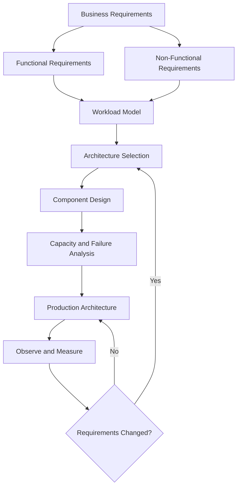

A useful architecture template should make the following explicit:

- Request and data flow
- Component responsibilities
- Data ownership
- Communication mechanisms
- Storage strategy
- Scaling strategy
- Failure boundaries
- Security boundaries
- Observability
- Deployment model
- Disaster recovery strategy
- Operational complexity
- Cost characteristics

The most important architectural principle is:

> Choose the simplest architecture that satisfies the current requirements while preserving a practical path for future evolution.

---

## Architecture Selection Principles

Architecture selection should begin with constraints, not components.

Before deciding between a monolith, microservices, Kafka, PostgreSQL, Redis, Kubernetes, or another technology, establish:

| Dimension | Questions |
|---|---|
| Traffic | Requests per second? Peak traffic? Burst behavior? |
| Data | Volume? Growth rate? Access patterns? |
| Consistency | Strong consistency or eventual consistency? |
| Latency | Average and tail-latency requirements? |
| Availability | Required uptime and acceptable downtime? |
| Durability | Can data be lost? If so, how much? |
| Workload | Read-heavy, write-heavy, compute-heavy, or mixed? |
| Processing | Synchronous or asynchronous? |
| Failure | What happens when dependencies fail? |
| Security | Authentication, authorization, encryption, isolation? |
| Deployment | Single region, multi-AZ, or multi-region? |
| Team | Number of teams and ownership boundaries? |
| Operations | What infrastructure can the organization realistically operate? |
| Cost | Infrastructure and operational budget? |

Architecture decisions should then be validated against measurable targets.

For example:

```text
Expected traffic:
    2,000 RPS average
    10,000 RPS peak

Latency:
    p95 < 200 ms
    p99 < 500 ms

Availability:
    99.9%

Data:
    PostgreSQL
    500 GB initially
    20 GB/month growth

Processing:
    User-facing request must return within 200 ms
    Reporting can be asynchronous

Recovery:
    RPO <= 5 minutes
    RTO <= 30 minutes
```

These requirements provide much stronger architectural guidance than statements such as "the system must be highly scalable."

---

## Core Architecture Templates

Common backend architecture templates include:

| Template | Typical Use Case | Primary Strength | Main Risk |
|---|---|---|---|
| Modular Monolith | Small to medium systems | Simplicity | Coupling can grow |
| Layered Architecture | CRUD/business applications | Clear organization | Excess abstraction |
| Modular Monolith + Cache | Read-heavy systems | Low latency | Cache invalidation |
| Async Worker Architecture | Background processing | Request isolation | Queue complexity |
| Event-Driven Architecture | Distributed workflows | Loose coupling | Eventual consistency |
| Microservices | Large independently owned domains | Team autonomy | Operational complexity |
| CQRS | Different read/write requirements | Specialized paths | Data synchronization |
| Read Replica Architecture | Read-heavy databases | Read scaling | Replication lag |
| Search-Backed Architecture | Text/search workloads | Efficient search | Index consistency |
| Object Storage Architecture | Large files/media | Cheap durable storage | Metadata coordination |
| Multi-Region Architecture | Global/high-availability systems | Regional resilience | Complexity and cost |

These templates can be combined. A real production system often uses several simultaneously.

---

## Modular Monolith

### What It Is

A modular monolith is a single deployable application containing multiple well-defined business modules.

For a Django backend, modules might be:

```text
orders
payments
inventory
users
notifications
reporting
```

The application may be deployed as one service while maintaining strict internal boundaries.

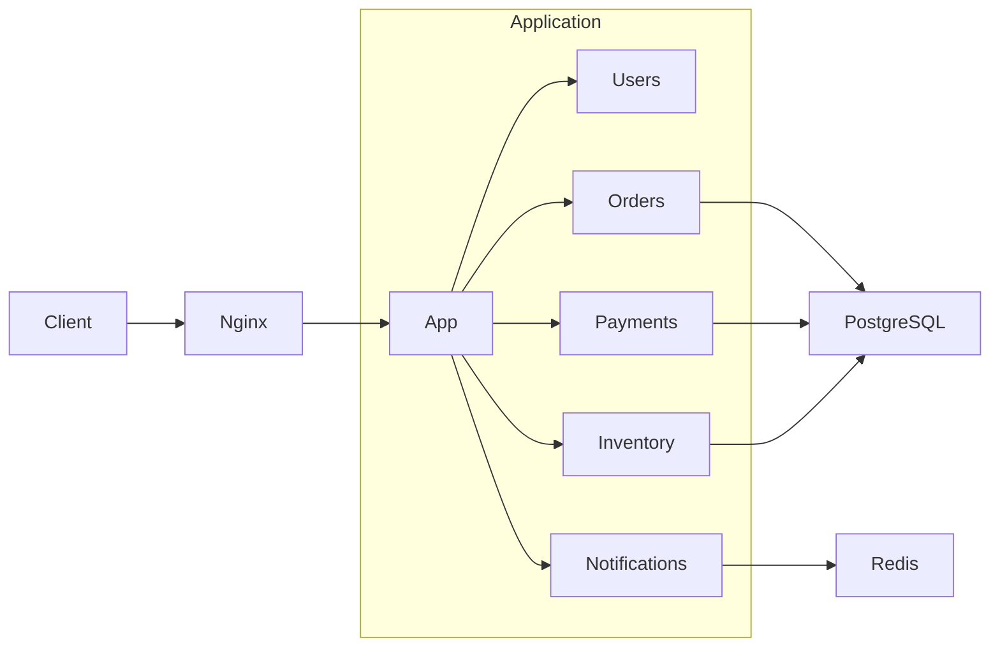

### Why It Exists

A monolith minimizes distributed-system overhead:

- One deployment unit
- One primary process boundary
- Simple local development
- Simple debugging
- Straightforward transactions
- Low network overhead
- Centralized observability
- Easier schema changes

A modular monolith attempts to preserve these benefits while preventing the codebase from becoming an unstructured monolith.

### When to Use It

Prefer a modular monolith when:

- The product is still evolving rapidly.
- The engineering team is small.
- Domain boundaries are not fully understood.
- Strong transactional consistency is important.
- Traffic can be handled by horizontal application scaling.
- Independent service deployment is not yet necessary.

### Production Structure

A Django application can enforce boundaries through module organization:

```text
project/
├── config/
├── users/
│   ├── api/
│   ├── services/
│   ├── models/
│   └── repositories/
├── orders/
│   ├── api/
│   ├── services/
│   ├── models/
│   └── repositories/
├── payments/
│   ├── api/
│   ├── services/
│   ├── models/
│   └── repositories/
└── shared/
```

The important boundary is conceptual, not merely directory-based.

A payment module should not freely manipulate internal inventory state simply because both modules access the same PostgreSQL database.

### Advantages

- Low operational complexity
- Simple deployment
- Easy debugging
- Strong transactional guarantees
- Low communication latency
- Lower infrastructure cost
- Easy local development

### Limitations

- Application deployment is coupled.
- Scaling is generally coarse-grained.
- One codebase can become difficult to maintain.
- A failure in one process can affect multiple modules.
- Teams may interfere with one another as the organization grows.

### Common Mistake

A common mistake is treating a monolith as inherently bad architecture.

A well-structured modular monolith can be significantly easier to operate and more reliable than an unnecessarily distributed system.

---

## Layered Architecture

Layered architecture organizes an application around technical responsibilities.

A common backend structure is:

```text
HTTP/API
    ↓
Application/Service Layer
    ↓
Domain Logic
    ↓
Repository/Data Access
    ↓
Database
```

For a FastAPI service:

```text
app/
├── api/
├── services/
├── domain/
├── repositories/
├── models/
└── infrastructure/
```

### Responsibility Boundaries

| Layer | Responsibility |
|---|---|
| API | HTTP/gRPC request handling |
| Service | Application orchestration |
| Domain | Business rules |
| Repository | Persistence abstraction |
| Infrastructure | External systems |
| Database | Durable state |

The architecture should avoid turning layers into meaningless wrappers.

For example, creating a service class that only calls a repository method without adding business behavior provides little value.

### Advantages

- Clear responsibilities
- Testability
- Easier code navigation
- Separation of infrastructure concerns
- Suitable for Django and FastAPI

### Limitations

- Excessive layering can increase complexity.
- Developers may create abstractions without meaningful boundaries.
- Business logic can become fragmented across layers.

### Production Recommendation

Use layers to protect business boundaries, not merely to satisfy a folder convention.

---

## Cache-Aside Architecture

Cache-aside is one of the most common production patterns for read-heavy systems.

The application checks the cache first. If the value is missing, it reads from the database and populates the cache.

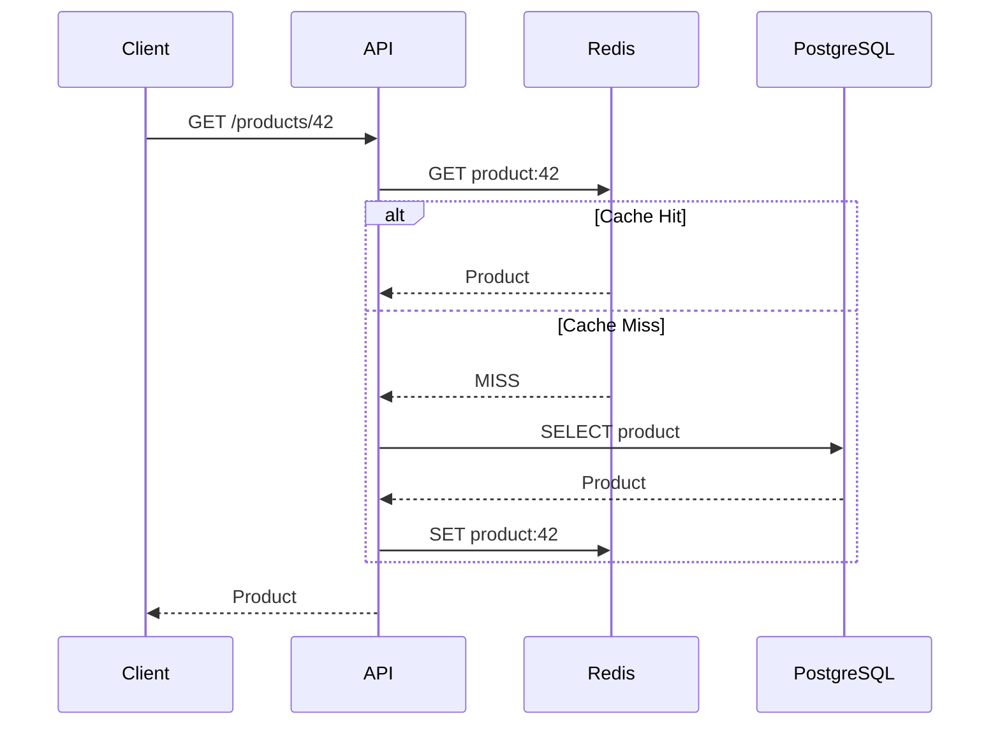

### When to Use It

Use cache-aside when:

- Reads significantly exceed writes.
- Data can tolerate short periods of staleness.
- Database queries are expensive.
- Frequently requested objects have predictable cache keys.

Typical examples:

- Product catalog
- User profile
- Configuration
- Permissions
- Frequently accessed reference data

### Advantages

- Reduces database load
- Improves latency
- Easy to introduce incrementally
- Works well with Redis

### Limitations

- Cache invalidation complexity
- Stale data
- Cache stampedes
- Additional operational dependency

### Production Considerations

Use:

- Explicit TTLs
- Bounded cache values
- Namespaced keys
- Monitoring for hit ratio
- Protection against cache stampedes
- Appropriate eviction policies

A common Python pattern is:

```python
import json

from django.core.cache import cache

CACHE_TTL = 300


def get_product(product_id: int):
    key = f"product:{product_id}"
    cached = cache.get(key)

    if cached is not None:
        return json.loads(cached)

    product = load_product_from_database(product_id)

    cache.set(
        key,
        json.dumps(product),
        timeout=CACHE_TTL,
    )

    return product
```

The exact serialization strategy should be selected according to the framework and cache client being used.

### Common Mistakes

- Caching every query without measuring database pressure.
- Using extremely long TTLs.
- Creating unbounded keys.
- Assuming Redis is the source of truth.
- Ignoring cache failure behavior.

Redis should normally be treated as an optimization unless the architecture explicitly uses it as durable state.

---

## Asynchronous Worker Architecture

Background processing moves expensive work away from the user-facing request path.

Typical components include:

- API service
- Queue or broker
- Worker processes
- Database
- External services

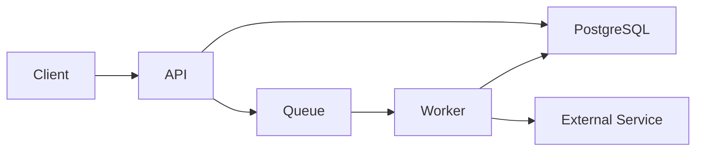

Examples:

- Sending email
- Generating reports
- Processing uploaded files
- Image processing
- Large exports
- Third-party API synchronization
- Scheduled jobs

Celery with Redis or another supported broker is a common Python implementation.

### Request Flow

```text
POST /reports
       |
       v
Create report job
       |
       v
Persist job state
       |
       v
Publish task
       |
       v
Return 202 Accepted
       |
       v
Worker processes task
       |
       v
Update job state
```

### Advantages

- Shorter API response times
- Better isolation of expensive work
- Independent worker scaling
- Retry support
- Better control over concurrency

### Limitations

- Eventual completion
- Queue management
- Retry complexity
- Duplicate execution
- Dead-letter handling
- More infrastructure

### Production Requirements

Background jobs should generally be:

- Idempotent
- Observable
- Retryable
- Time-bounded
- Rate-limited where necessary
- Safe against duplicate execution

A worker should not assume that a message is delivered exactly once.

---

## Event-Driven Architecture

Event-driven architecture uses events to communicate state changes between components.

For example:

```text
OrderCreated
PaymentAuthorized
InventoryReserved
ShipmentCreated
```

A Kafka-based architecture might look like:

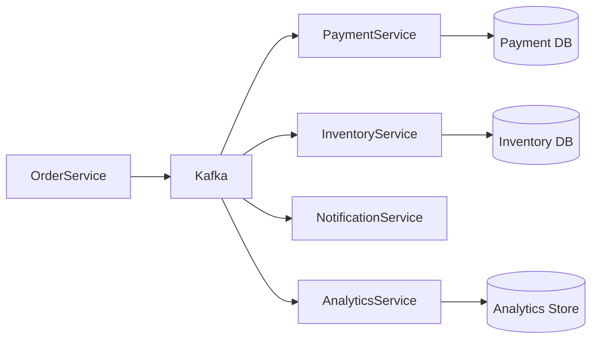

### Why It Exists

Events reduce direct coupling between producers and consumers.

The order service does not need to synchronously call every downstream service.

### When to Use It

Use event-driven architecture when:

- Multiple consumers need the same business event.
- Consumers should evolve independently.
- Processing can be asynchronous.
- High-throughput event streams are required.
- Temporal decoupling is valuable.

### Advantages

- Loose coupling
- Independent consumers
- High throughput
- Replay capabilities with appropriate platforms
- Natural integration with analytics pipelines

### Limitations

- Eventual consistency
- More complex debugging
- Schema evolution
- Duplicate events
- Ordering concerns
- Consumer lag
- Operational complexity

### Senior-Level Considerations

Events should represent meaningful domain facts rather than implementation details.

Prefer:

```text
OrderCreated
```

over:

```text
OrderTableRowInserted
```

The first describes a business event. The second exposes an implementation detail.

---

## Microservices Architecture

Microservices split a system into independently deployable services organized around business capabilities.

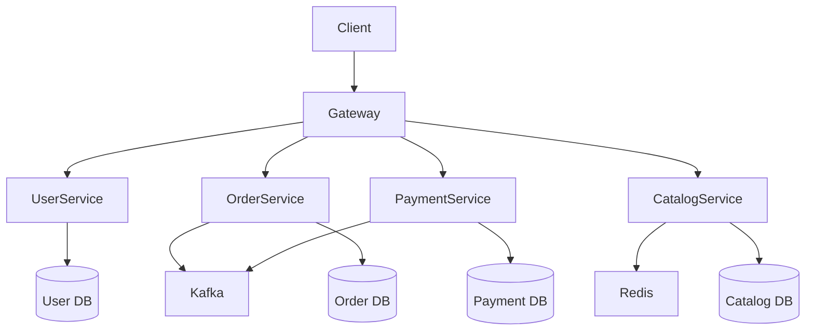

### Why It Exists

Microservices are useful when organizational and domain boundaries justify independent deployment and scaling.

They can allow:

- Independent release cycles
- Independent scaling
- Team ownership
- Technology isolation
- Failure isolation
- Domain-specific data ownership

### When to Use It

Consider microservices when:

- Domains are well understood.
- Multiple teams need independent ownership.
- Components have substantially different scaling requirements.
- Independent deployment provides measurable value.
- The organization can operate distributed systems.

### Advantages

- Independent deployments
- Service-level scaling
- Strong team ownership
- Fault isolation
- Technology flexibility

### Limitations

- Network failures
- Distributed tracing
- Service discovery
- Configuration management
- Distributed transactions
- Data consistency
- Higher infrastructure cost
- More difficult local development

### Critical Rule

Do not split a system into microservices merely because the application has many modules.

A modular monolith can provide strong domain separation without introducing network boundaries.

---

## Read Replica Architecture

Read replicas allow read-heavy workloads to scale beyond a single primary database.

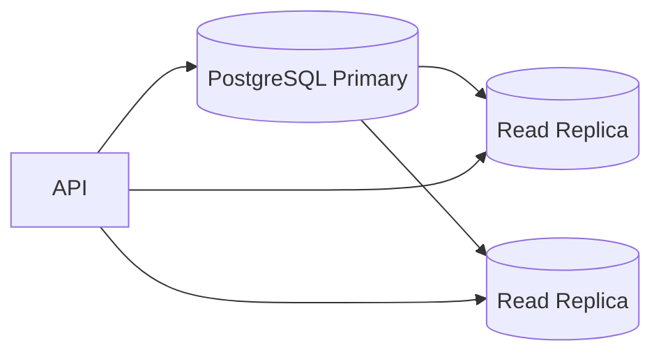

Writes go to the primary while eligible reads are distributed across replicas.

### When to Use It

Use read replicas when:

- Read traffic is much larger than write traffic.
- Queries are suitable for replicas.
- Replication lag is acceptable.
- Database CPU or I/O is the bottleneck.

### Limitation

Replication is typically asynchronous, meaning a newly written record may not immediately exist on a replica.

This creates a common problem:

```text
POST /orders
    ↓
Write primary
    ↓
GET /orders/123
    ↓
Read replica
    ↓
Order not visible yet
```

The client may observe stale state immediately after a successful write.

### Production Strategies

Possible approaches include:

- Route read-after-write requests to the primary.
- Use sticky routing temporarily.
- Track replication position where supported.
- Accept eventual consistency explicitly.
- Separate strongly consistent and eventually consistent endpoints.

Never assume that "read replica" automatically means transparent scaling without consistency implications.

---

## Search-Backed Architecture

Relational databases are often excellent for transactional workloads but are not always ideal for sophisticated text search.

A search-backed architecture can use a search engine alongside PostgreSQL.

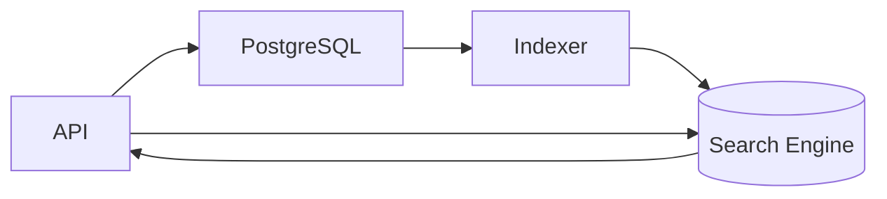

PostgreSQL remains the system of record while the search index is a derived representation.

### Suitable Workloads

- Full-text search
- Fuzzy matching
- Relevance ranking
- Faceted search
- Autocomplete
- Large-scale filtering

### Important Principle

The search index should generally be treated as rebuildable state.

If the search index is lost:

```text
PostgreSQL
    ↓
Reindexing pipeline
    ↓
Search index
```

The architecture should have a way to reconstruct the index.

### Common Mistake

Using the search engine as the primary transactional database simply because it provides fast search.

Transactional correctness and search performance are different concerns.

---

## Object Storage Architecture

Large binary objects should generally not pass through application servers unnecessarily.

A common architecture is:

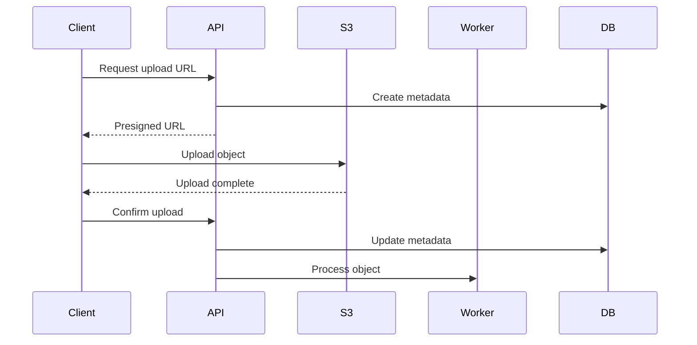

### Why It Exists

Object storage is designed for durable, scalable storage of large files.

Examples:

- Images
- Videos
- Documents
- Backups
- Data exports
- Logs
- Machine-learning artifacts

### Advantages

- High durability
- Large capacity
- Reduced application-server bandwidth
- Cost-effective storage
- Native lifecycle management

### Production Considerations

Use:

- Private buckets
- Least-privilege IAM
- Presigned URLs
- Encryption
- Lifecycle policies
- Versioning where appropriate
- Object retention policies
- Malware scanning for untrusted uploads

Do not expose permanent public write permissions to clients.

---

## CQRS Architecture

Command Query Responsibility Segregation separates write operations from read operations.

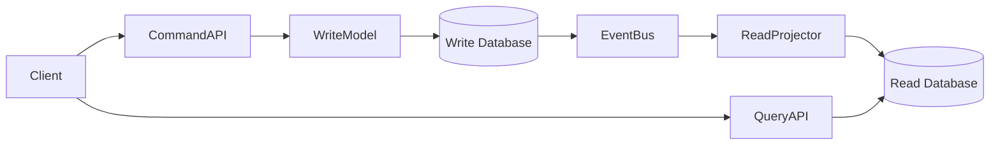

### Why It Exists

Write and read workloads can have fundamentally different requirements.

For example:

```text
Write path:
    Validate business rules
    Enforce transactions
    Maintain domain invariants

Read path:
    Precomputed views
    Denormalized data
    Fast filtering
    Search-oriented access
```

### When to Use It

CQRS is appropriate when:

- Read and write models are substantially different.
- Read performance requires denormalized projections.
- Complex workflows generate useful domain events.
- Independent scaling of read and write paths is valuable.

### Limitations

- Multiple data models
- Synchronization complexity
- Eventual consistency
- More infrastructure
- Harder debugging

CQRS should not be introduced for ordinary CRUD applications simply because it is architecturally sophisticated.

---

## CDN and Edge Architecture

Content-heavy or globally distributed applications can place a CDN in front of origin infrastructure.

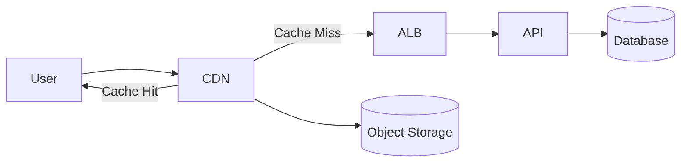

### Suitable Content

- Static assets
- Images
- Videos
- Downloadable files
- Public API responses with safe caching semantics

### Benefits

- Reduced origin traffic
- Lower latency
- Geographic distribution
- Better handling of traffic spikes

### Risks

- Cache invalidation
- Incorrect cache headers
- Sensitive content leakage
- Stale content

Never cache personalized responses without carefully defining the cache key and authorization model.

---

## Multi-Region Architecture

Multi-region architecture distributes infrastructure across geographic AWS regions.

A simplified active-active model:

```mermaid
flowchart TB
    DNS[Global DNS / Routing] --> RegionA
    DNS --> RegionB

    subgraph RegionA
        RegionA[Region A]
        RegionA --> AppA[Application]
        AppA --> DBA[(Regional Data)]
    end

    subgraph RegionB
        RegionB[Region B]
        RegionB --> AppB[Application]
        AppB --> DBB[(Regional Data)]
    end

    DBA <-->|Replication| DBB
```

### Why It Exists

Multi-region deployments can improve:

- Regional failure tolerance
- Global latency
- Disaster recovery
- Regulatory placement
- Business continuity

### Complexity

Multi-region systems introduce difficult questions:

- Where is authoritative data stored?
- How are writes coordinated?
- What happens during a partition?
- How is conflict resolution performed?
- How is traffic shifted?
- How is replication monitored?
- What is the RPO?
- What is the RTO?

### Important Principle

Multi-region is not automatically more highly available.

If the application cannot correctly handle data divergence, a second region can increase failure complexity rather than reduce it.

---

## Hybrid Architecture

Production systems commonly combine multiple templates.

Consider an e-commerce backend:

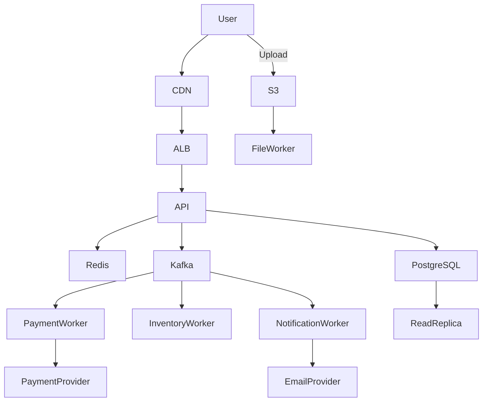

This system combines:

- CDN
- Load balancing
- Modular application services
- Redis caching
- PostgreSQL
- Read replicas
- Kafka
- Background workers
- Object storage
- External integrations

The architecture is not "Kafka architecture" or "microservices architecture." It is a composition of patterns selected for different workloads.

---

## Choosing Between Architecture Templates

A practical decision matrix:

| Requirement | Good Starting Point |
|---|---|
| Small team and evolving domain | Modular monolith |
| Conventional CRUD application | Layered/modular monolith |
| Heavy repeated reads | Cache-aside |
| Expensive background operations | Async workers |
| Multiple independent event consumers | Event-driven |
| Independent domain ownership | Microservices |
| Read-heavy PostgreSQL workload | Read replicas |
| Advanced search | Search-backed architecture |
| Large file handling | Object storage |
| Different read/write models | CQRS |
| Global static content | CDN |
| Regional disaster requirements | Multi-region |

These are starting points, not automatic decisions.

---

## Combining Templates

A mature system usually has several architectural characteristics simultaneously.

For example:

```text
Modular monolith
    +
Redis cache
    +
Celery workers
    +
PostgreSQL read replicas
    +
S3 object storage
    +
CDN
```

Later, a high-growth domain might evolve:

```text
Modular monolith
        ↓
Extract high-load domain
        ↓
Independent service
        ↓
Kafka integration
        ↓
Independent database
```

This incremental approach is generally safer than starting with maximum distribution.

---

## Architecture Evolution

Architecture should evolve when measurable constraints change.

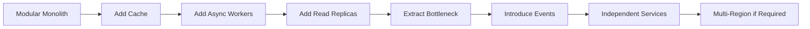

### Evolution Triggers

Consider architectural changes when:

- Database CPU is consistently saturated.
- Request latency violates SLOs.
- One workload requires independent scaling.
- Deployments become organizational bottlenecks.
- A domain requires separate ownership.
- Background processing affects request latency.
- A dependency causes cascading failures.
- Regional availability requirements change.

Avoid architecture changes based solely on anticipated future scale.

---

## Capacity Characteristics of Common Templates

| Architecture | Main Scaling Dimension | Typical Bottleneck |
|---|---|---|
| Monolith | Application instances | Database |
| Cache-aside | Cache capacity + application nodes | Cache misses |
| Async workers | Worker concurrency | Queue/backlog |
| Event-driven | Consumer throughput | Consumer lag |
| Read replicas | Replica count/capacity | Primary writes |
| Microservices | Individual service | Network/dependency |
| CQRS | Read/write independently | Projection lag |
| Search-backed | Search cluster | Indexing/search workload |
| Object storage | Storage/object operations | Application metadata |
| Multi-region | Regions | Data consistency |

Capacity planning should always identify the bottleneck rather than assuming that horizontal scaling solves everything.

---

## Reliability Patterns

Architecture templates should include failure handling explicitly.

### Timeout

Every network call should have a bounded timeout.

```text
API
 |
 +-- Payment Service
       timeout = 2s
```

An absent timeout can turn a dependency failure into exhausted application threads or worker processes.

### Retry

Retries should be selective.

Good retry candidates:

- Transient network failures
- Temporary throttling
- Temporary service unavailability

Bad retry candidates:

- Validation failures
- Authentication failures
- Permanent business errors

Use exponential backoff and jitter where appropriate.

### Circuit Breaker

A circuit breaker prevents repeated calls to an unhealthy dependency.

```text
CLOSED
  |
  | repeated failures
  v
OPEN
  |
  | recovery interval
  v
HALF-OPEN
  |
  +--> success --> CLOSED
  |
  +--> failure --> OPEN
```

### Bulkhead

Bulkheads isolate resources so one workload cannot consume everything.

Examples:

- Separate worker pools
- Separate connection pools
- Per-service concurrency limits
- Per-tenant rate limits

### Idempotency

Distributed systems frequently retry operations. Critical writes should support idempotency.

For an API:

```http
POST /payments
Idempotency-Key: 7b1f4d6e-...
```

The server stores the result associated with the key and returns the existing result when the same operation is retried.

---

## Security Architecture

Security should be represented as part of the architecture rather than added after implementation.

A production backend should consider:

```text
Internet
   |
WAF / CDN
   |
Load Balancer
   |
Private Application Subnets
   |
Private Database / Cache / Queue
```

### Important Controls

- TLS for external and internal communication where appropriate
- Authentication
- Authorization
- Network segmentation
- Least-privilege IAM
- Secrets management
- Encryption at rest
- Encryption in transit
- Audit logging
- Input validation
- Rate limiting
- Dependency security
- Secure CI/CD pipelines

### Common Mistake

Putting every service into a private network does not automatically make the architecture secure.

Application-level authorization remains necessary.

A request reaching a private service should still be authenticated and authorized.

---

## Observability Architecture

Every production template should have an observability strategy.

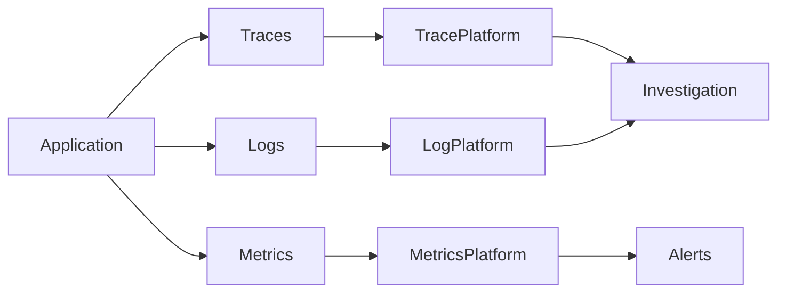

### Metrics

Track:

- Request rate
- Error rate
- Latency
- Saturation
- CPU
- Memory
- Database connections
- Queue depth
- Consumer lag
- Cache hit ratio
- Replication lag

### Logs

Logs should be structured and include correlation information.

```json
{
  "level": "ERROR",
  "service": "order-service",
  "request_id": "req-123",
  "trace_id": "trace-456",
  "operation": "create_order",
  "error": "payment_timeout"
}
```

Avoid logging:

- Passwords
- Access tokens
- Session secrets
- Payment credentials
- Sensitive personal information unless explicitly required and protected

### Distributed Tracing

Tracing becomes especially important when requests cross:

```text
Nginx
  ↓
API
  ↓
Service A
  ↓
Kafka
  ↓
Worker
  ↓
Service B
  ↓
Database
```

Without correlation and tracing, diagnosing latency and failures becomes significantly harder.

---

## Deployment Templates

### Single Application Deployment

Suitable for modular monoliths:

```text
ALB
 |
 +-- EC2 / ECS / Kubernetes Pod
 +-- EC2 / ECS / Kubernetes Pod
 |
PostgreSQL
Redis
```

### Containerized Deployment

```text
Docker Image
    ↓
Container Registry
    ↓
Deployment Platform
    ↓
Multiple Application Instances
```

CI/CD should generally include:

```text
Commit
  ↓
Tests
  ↓
Security Checks
  ↓
Build Image
  ↓
Push Image
  ↓
Deploy
  ↓
Health Checks
  ↓
Progressive Rollout
```

### Kubernetes Deployment

Kubernetes becomes valuable when the organization needs its orchestration capabilities, such as:

- Automated scheduling
- Service discovery
- Rolling deployments
- Horizontal scaling
- Self-healing
- Resource isolation

It also introduces substantial operational complexity.

Do not introduce Kubernetes merely because applications are packaged as containers. Docker containers and Kubernetes solve different problems.

---

## Data Architecture Considerations

Architecture templates must define where authoritative data lives.

For each datastore, answer:

| Question | Example |
|---|---|
| Source of truth? | PostgreSQL |
| Derived state? | Redis cache |
| Search projection? | Search index |
| Event history? | Kafka |
| Large binary data? | S3 |
| Analytics? | Data warehouse |
| Temporary state? | Redis |

A useful rule is:

> Derived data must have a recovery path from authoritative data.

For example:

```text
PostgreSQL
   |
   +--> Search Index
   |
   +--> Redis
   |
   +--> Analytics Pipeline
```

If PostgreSQL remains authoritative, Redis and the search index can be rebuilt.

---

## Consistency Model Selection

Different architecture templates imply different consistency models.

| Requirement | Preferred Approach |
|---|---|
| Financial balance | Strong transactional consistency |
| Inventory reservation | Strong consistency within reservation boundary |
| User profile cache | Eventual consistency often acceptable |
| Analytics dashboard | Eventual consistency |
| Search index | Eventual consistency |
| Notifications | Asynchronous/eventual |
| Audit log | Durable append-oriented storage |
| Session/cache state | Short-lived consistency |

Do not make the entire system strongly consistent merely because some operations require it.

Define consistency boundaries around business invariants.

---

## Architecture Decision Template

For any significant architectural choice, document:

```markdown
# Decision: Use PostgreSQL as the system of record

## Context

The application requires transactional consistency for orders and payments.

## Decision

Use PostgreSQL as the authoritative transactional datastore.

## Alternatives Considered

- DynamoDB
- MongoDB
- PostgreSQL

## Why

- Strong transactions
- Mature indexing
- Familiar operational model
- Rich relational constraints
- Existing team expertise

## Consequences

Positive:
- Strong consistency
- Mature tooling
- Relational integrity

Negative:
- Vertical scaling has limits
- Requires careful query optimization
- Read scaling may require replicas

## Operational Requirements

- Automated backups
- Point-in-time recovery
- Monitoring
- Connection pooling
- Migration discipline
```

This format makes architectural reasoning reviewable rather than dependent on tribal knowledge.

---

## Common Architecture Mistakes

### Choosing Technology Before Requirements

Bad:

```text
"We need Kafka because the system must scale."
```

Better:

```text
"We need durable asynchronous fan-out to seven independent
consumers at approximately 50,000 events per second."
```

The second statement gives an engineering reason for evaluating Kafka.

### Premature Microservices

Splitting a poorly understood domain into services creates distributed coupling rather than eliminating coupling.

Symptoms include:

- Excessive synchronous calls
- Shared databases
- Coordinated deployments
- Circular dependencies
- Difficult local development

### Treating Redis as a Database by Accident

Caching mutable business state without a clear durability model can create data-loss scenarios.

### Ignoring Failure Modes

An architecture diagram showing only healthy request flow is incomplete.

For every dependency, ask:

- What if it is slow?
- What if it returns errors?
- What if it is unavailable?
- What if the response is duplicated?
- What if messages arrive out of order?
- What if the database is read-only?
- What if the network partitions?

### Overusing Asynchronous Processing

Async processing improves decoupling but creates:

- Eventual consistency
- Delayed feedback
- Retry complexity
- Monitoring requirements
- Duplicate-processing concerns

Use it where asynchronous behavior provides a real benefit.

### Ignoring Operational Complexity

A technically sophisticated design can still be a poor architecture if the organization cannot operate it.

---

## Interview Usage

Architecture templates are particularly useful during system design interviews because they provide a structured starting point.

A strong interview progression is:

```text
Requirements
    ↓
Workload estimation
    ↓
Simple baseline architecture
    ↓
Identify bottlenecks
    ↓
Introduce targeted scaling patterns
    ↓
Analyze failure modes
    ↓
Address security and observability
    ↓
Discuss trade-offs
```

For example, for a URL-shortening service:

```text
Initial:
Client → API → PostgreSQL

Scale:
Client → Load Balancer → API fleet → PostgreSQL

Read-heavy:
                         → Redis
                        /
Client → LB → API ------> PostgreSQL

Global:
Client → CDN / Global Routing → Regional API
```

The important part is not drawing every possible component. The important part is explaining why each component exists.

---

## Architecture Review Checklist

Before approving an architecture, verify:

### Requirements

- [ ] Functional requirements are explicit.
- [ ] Traffic and capacity assumptions are documented.
- [ ] Latency targets are measurable.
- [ ] Availability requirements are defined.
- [ ] Data durability requirements are defined.
- [ ] RPO and RTO are defined.

### Architecture

- [ ] Component responsibilities are clear.
- [ ] Data ownership is explicit.
- [ ] Communication protocols are appropriate.
- [ ] Synchronous paths are bounded.
- [ ] Asynchronous paths are observable.
- [ ] Bottlenecks are identified.

### Reliability

- [ ] Timeouts exist.
- [ ] Retries are bounded.
- [ ] Backoff and jitter are considered.
- [ ] Idempotency is defined.
- [ ] Failure isolation exists.
- [ ] Dependency failures are handled.

### Data

- [ ] Source of truth is defined.
- [ ] Consistency requirements are explicit.
- [ ] Replication strategy is defined.
- [ ] Backup and restore are tested.
- [ ] Data migration strategy exists.

### Security

- [ ] Authentication is defined.
- [ ] Authorization boundaries are defined.
- [ ] Secrets are managed securely.
- [ ] Network access is restricted.
- [ ] Encryption is enabled where appropriate.
- [ ] Sensitive data is protected.

### Operations

- [ ] Logs are structured.
- [ ] Metrics are defined.
- [ ] Distributed tracing is available where required.
- [ ] Alerts correspond to user-impacting failures.
- [ ] Deployment rollback exists.
- [ ] Capacity monitoring exists.

### Cost

- [ ] Infrastructure cost is estimated.
- [ ] Data transfer costs are considered.
- [ ] Storage growth is considered.
- [ ] Operational ownership is understood.
- [ ] Expensive components have measurable justification.

---

## Key Takeaways

- **Architecture templates are starting points, not rigid blueprints; select them from workload characteristics, consistency requirements, scalability needs, failure modes, and operational constraints.**
- **Prefer the simplest architecture that satisfies the requirements, typically evolving from a modular monolith toward caching, asynchronous processing, specialized stores, microservices, and multi-region designs only when justified.**
- **Production architectures are compositions of patterns: a single system may combine request-response APIs, Redis caching, PostgreSQL, Kafka, Celery workers, object storage, search, and CDN infrastructure.**
- **Every architecture must explicitly address scalability, security, observability, failure handling, data ownership, consistency, disaster recovery, and cost—not just the normal request path.**
- **Senior-level system design is primarily trade-off analysis: choose boundaries and technologies based on measurable requirements rather than adopting distributed-system complexity because it is technically popular.**
```