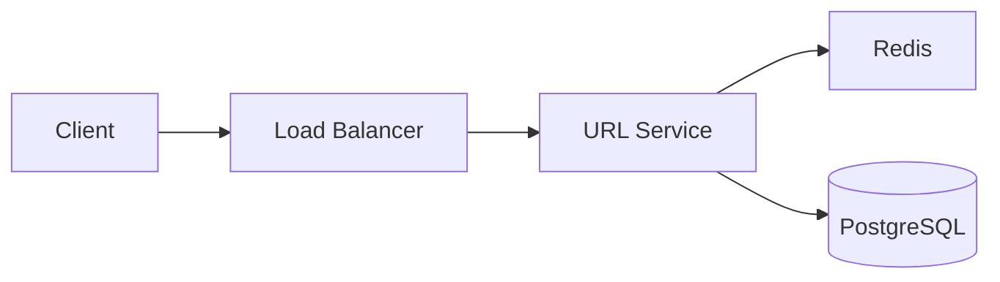
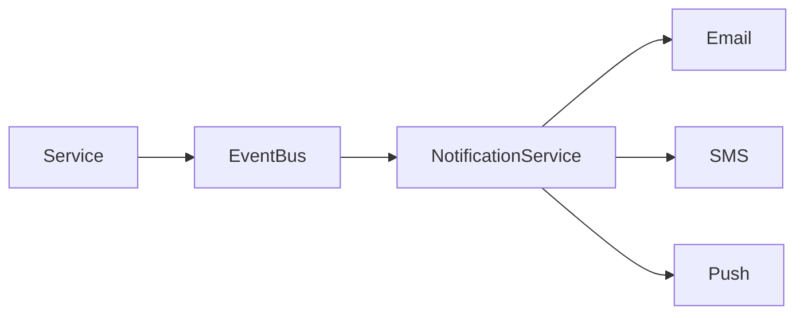
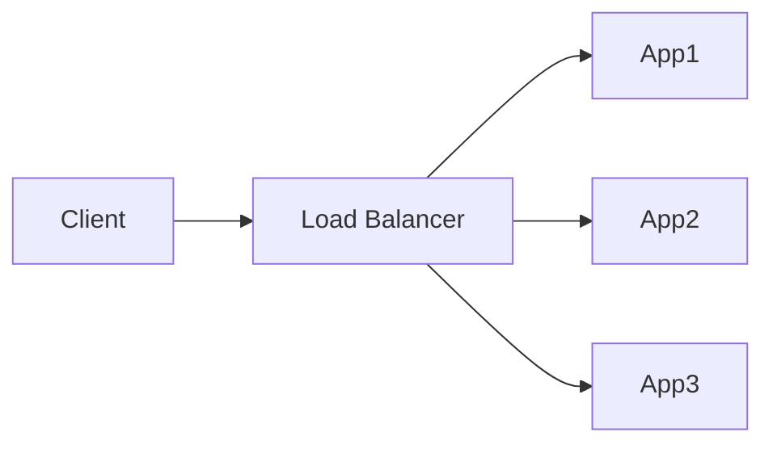
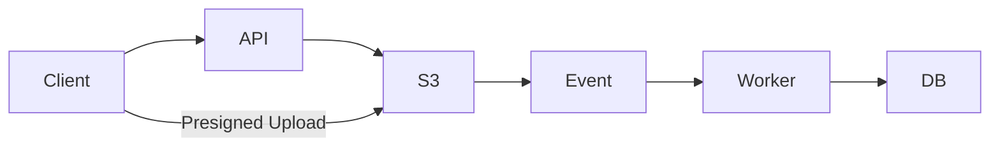
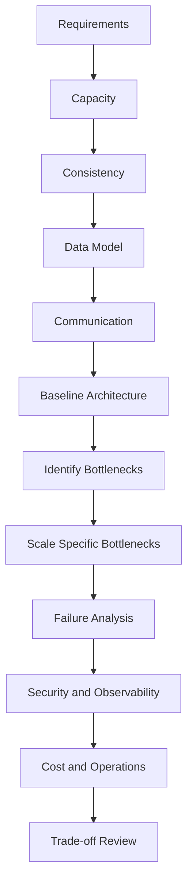

# 05- Top 50 Interview Questions

## Overview

System design interviews evaluate more than the ability to draw boxes and arrows. A strong candidate can translate ambiguous requirements into measurable constraints, estimate capacity, choose appropriate storage and communication models, identify bottlenecks, reason about failure modes, and defend architectural trade-offs.

The questions below cover the areas most frequently tested in backend system design interviews:

- Requirements and scope
- Capacity estimation
- API and protocol design
- Database selection
- Caching
- Distributed systems
- Messaging and event-driven architecture
- Scalability
- Reliability and availability
- Security
- Observability
- Deployment
- Architecture trade-offs

The expected answer at senior level is rarely a single technology choice. The interviewer is usually evaluating the reasoning behind the choice.

A useful mental model is:

```text
Requirements
    ↓
Capacity estimation
    ↓
High-level architecture
    ↓
Data model
    ↓
API / communication
    ↓
Scaling strategy
    ↓
Consistency
    ↓
Reliability
    ↓
Security
    ↓
Observability
    ↓
Trade-offs
```

---

## How to Approach System Design Questions

For almost every system design problem, establish the following before selecting technologies:

| Area | Questions to Answer |
|---|---|
| Functional requirements | What must the system do? |
| Non-functional requirements | What latency, availability, durability, and scalability are required? |
| Users | How many users and tenants exist? |
| Traffic | Average RPS? Peak RPS? Read/write ratio? |
| Data | How much data is created and how quickly does it grow? |
| Consistency | What must be immediately consistent? |
| Availability | What downtime is acceptable? |
| Reliability | What happens when components fail? |
| Security | Who can access what? |
| Operations | How will the system be deployed, monitored, and recovered? |
| Cost | Which design decisions materially affect infrastructure cost? |

Do not begin with:

> "I would use Kafka, Redis, Kubernetes, and microservices."

Begin with:

> "The workload is read-heavy, latency-sensitive, and can tolerate a few seconds of staleness, so I would start with PostgreSQL as the source of truth and add Redis for frequently accessed data."

The second answer demonstrates engineering judgment.

---

## Question 1 — How Do You Approach a System Design Interview?

### What the interviewer is evaluating

The interviewer wants to know whether you have a repeatable design process rather than relying on memorized architectures.

### Strong answer structure

1. Clarify requirements.
2. Define functional requirements.
3. Define non-functional requirements.
4. Estimate traffic and storage.
5. Identify major entities and APIs.
6. Design the high-level architecture.
7. Choose storage based on access patterns.
8. Explain scaling strategy.
9. Analyze consistency.
10. Analyze failure modes.
11. Address security and observability.
12. Explain trade-offs and future evolution.

### Senior-level insight

Do not spend most of the interview drawing infrastructure components. Spend time explaining why each component exists.

---

## Question 2 — How Do You Gather Requirements in a System Design Interview?

Separate requirements into functional and non-functional categories.

### Functional

Examples:

- Users can create accounts.
- Users can upload files.
- Users can search products.
- Users can send messages.

### Non-functional

Examples:

- p95 latency < 200 ms
- 99.9% availability
- 10,000 peak RPS
- RPO < 5 minutes
- RTO < 30 minutes

A useful clarification question is:

> "Which requirements are strict business invariants and which can eventually be consistent?"

This question often determines the architecture.

---

## Question 3 — What Is Capacity Estimation and Why Is It Important?

Capacity estimation converts product requirements into infrastructure constraints.

Typical estimates include:

- Requests per second
- Peak requests per second
- Read/write ratio
- Storage growth
- Bandwidth
- Cache size
- Queue throughput
- Database capacity

For example:

```text
10 million users
20% active daily
5 requests/user/day

Daily requests:
10,000,000 × 20% × 5
= 10,000,000 requests/day

Average RPS:
10,000,000 / 86,400
≈ 116 RPS

If peak traffic is 10× average:
≈ 1,160 peak RPS
```

The exact numbers are less important than demonstrating a reasonable estimation method.

---

## Question 4 — How Do You Estimate Peak Traffic?

Average traffic is insufficient for capacity planning.

A simple approach is:

```text
Peak RPS = Average RPS × Peak Factor
```

Typical peak factors depend on workload characteristics.

For example:

```text
Average = 2,000 RPS
Peak factor = 5

Peak = 10,000 RPS
```

For scheduled workloads such as ticket sales or flash sales, the peak factor may be much higher.

### Interview trap

Do not blindly use a standard multiplier. Explain why the chosen multiplier is reasonable.

---

## Question 5 — How Do You Estimate Storage Requirements?

Estimate:

```text
Storage = Objects per period × Average object size × Retention period
```

For structured records:

```text
Daily records = requests × writes per request
Daily storage = records × average record size
Annual storage = daily storage × 365
```

Then account for:

- Indexes
- Replicas
- Backups
- Metadata
- Historical data
- Growth

A senior answer distinguishes logical data size from physical infrastructure storage.

---

## Question 6 — How Would You Design a URL Shortener?

A typical architecture:



### Write path

```text
POST /urls
    ↓
Generate unique identifier
    ↓
Store short_code → long_url
    ↓
Return short URL
```

### Read path

```text
GET /abc123
    ↓
Redis lookup
    ↓
Cache miss → PostgreSQL
    ↓
Redirect
```

### Key considerations

- Collision-free ID generation
- Read-heavy workload
- Cache hit ratio
- Expiration
- Abuse prevention
- Analytics
- Hot keys

The design should optimize the redirect path because reads typically dominate writes.

---

## Question 7 — How Would You Design a Rate Limiter?

A rate limiter controls request frequency per user, API key, IP, or tenant.

Common algorithms include:

| Algorithm | Characteristics |
|---|---|
| Fixed window | Simple but boundary spikes |
| Sliding window | More accurate |
| Token bucket | Supports controlled bursts |
| Leaky bucket | Smooths traffic |

Redis is commonly useful because atomic operations and expiration can support distributed rate limiting.

```text
Request
   ↓
Identify client
   ↓
Redis rate-limit state
   ↓
Allowed? ── No → 429
   |
  Yes
   ↓
Application
```

### Production considerations

- Distributed instances must share rate-limit state.
- Redis failure behavior must be defined.
- Limits may need to differ by endpoint and tenant.
- Administrative or internal traffic may require separate policies.

---

## Question 8 — How Would You Design a Notification System?

Separate notification creation from delivery.



The notification service can:

- Consume events.
- Determine user preferences.
- Apply templates.
- Queue delivery.
- Retry failures.
- Rate-limit providers.
- Track delivery status.

A synchronous API should not wait for an external email provider unless immediate delivery is explicitly required.

---

## Question 9 — When Would You Choose SQL Over NoSQL?

Choose based on data access patterns and consistency requirements.

Use relational databases such as PostgreSQL when you need:

- Transactions
- Foreign keys
- Complex relationships
- Strong consistency
- Ad hoc queries
- Mature relational constraints

NoSQL may be appropriate when you need:

- Very high horizontal scalability
- Predictable key-value access
- Flexible schema
- Massive distributed datasets
- Specialized access patterns

The important interview point is:

> NoSQL is not inherently more scalable, and SQL is not inherently less scalable.

Architecture depends on workload, schema, indexes, partitioning, and access patterns.

---

## Question 10 — How Do You Choose a Database?

Start with the workload.

| Requirement | Candidate |
|---|---|
| Transactions and relationships | PostgreSQL |
| Simple key-value access at large scale | DynamoDB |
| Caching | Redis |
| Search and relevance | Search engine |
| Time-series workloads | Time-series database |
| Analytics | Data warehouse |
| Large files | S3/object storage |

Then evaluate:

- Consistency
- Durability
- Query patterns
- Scale
- Indexing
- Replication
- Operational maturity
- Cost
- Team expertise

Never choose a database based only on popularity.

---

## Question 11 — What Is Database Indexing and How Does It Improve Performance?

An index provides an efficient access path to rows.

Without an appropriate index, a query may require a sequential scan.

```sql
SELECT *
FROM orders
WHERE customer_id = 123;
```

An index on `customer_id` can substantially reduce the amount of data scanned.

```sql
CREATE INDEX idx_orders_customer_id
ON orders(customer_id);
```

### Trade-offs

Indexes:

- Improve reads.
- Consume storage.
- Increase write cost.
- Require maintenance.
- Can become ineffective when poorly selected.

### Interview trap

Do not say "add indexes to every column."

Index selection must follow actual query patterns and execution plans.

---

## Question 12 — What Is Database Sharding?

Sharding horizontally partitions data across multiple database nodes.

For example:

```text
customer_id % 4

0 → Shard A
1 → Shard B
2 → Shard C
3 → Shard D
```

### Why use it?

When a single database cannot handle the required:

- Storage
- CPU
- I/O
- Connection volume
- Write throughput

### Challenges

- Cross-shard queries
- Cross-shard transactions
- Rebalancing
- Hot partitions
- Operational complexity
- Consistent routing

Sharding should usually be considered after optimizing schema, queries, indexes, connection management, replicas, and application behavior.

---

## Question 13 — What Is Database Replication?

Replication maintains copies of database data on multiple nodes.

A common model:

```text
Primary
  |
  +--> Replica 1
  |
  +--> Replica 2
```

The primary handles writes while replicas may serve reads.

### Benefits

- Read scaling
- High availability
- Disaster recovery
- Reduced read pressure

### Challenge

Replication can introduce lag.

Therefore:

```text
Write → Primary
Read  → Replica
```

does not necessarily guarantee read-after-write consistency.

---

## Question 14 — What Is a Read Replica and When Would You Use One?

A read replica is a replicated database instance used primarily for read traffic.

Use it when:

- Read traffic dominates.
- Queries are expensive.
- Primary database resources are saturated by reads.
- Eventual consistency is acceptable for selected queries.

Do not use replicas as a substitute for query optimization.

First inspect:

- Slow queries
- Missing indexes
- N+1 queries
- Excessive joins
- Connection usage
- Query plans

---

## Question 15 — What Is Caching and When Should You Use It?

Caching stores frequently accessed data closer to the application.

Typical architecture:

```text
Client
  ↓
API
  ↓
Redis
  ↓ cache miss
PostgreSQL
```

Use caching when:

- Data is read frequently.
- Data is expensive to calculate or retrieve.
- Slight staleness is acceptable.
- The cache can be rebuilt.

### Important considerations

- TTL
- Eviction
- Invalidation
- Cache key design
- Serialization
- Cache stampede
- Hot keys

Caching should solve a measured performance problem rather than be added automatically.

---

## Question 16 — What Is Cache-Aside?

Cache-aside means the application explicitly manages cache reads and writes.

```text
Read:
Cache → hit → return

Cache → miss → database → populate cache → return
```

It is common with Redis and backend frameworks such as Django and FastAPI.

### Main challenge

Cache invalidation.

When the database changes:

```text
Database updated
      ↓
Invalidate or update cache
```

Incorrect invalidation can cause stale or incorrect application behavior.

---

## Question 17 — How Do You Prevent Cache Stampedes?

A cache stampede occurs when many requests encounter an expired value simultaneously.

```text
Cache expires
     ↓
10,000 requests miss
     ↓
10,000 database queries
     ↓
Database overload
```

Mitigation strategies include:

- Request coalescing
- Distributed locking
- TTL jitter
- Background refresh
- Stale-while-revalidate
- Early refresh

For example, instead of every request rebuilding the same value, one request can become the refresh owner while others use stale data when safe.

---

## Question 18 — What Is a Load Balancer?

A load balancer distributes traffic across multiple backend instances.



Benefits include:

- Horizontal scaling
- Health checking
- Failure isolation
- Traffic distribution
- TLS termination depending on architecture

Common algorithms:

- Round robin
- Least connections
- Weighted routing
- Hash-based routing

The load balancer does not eliminate application-level failures. Health checks must reflect actual service readiness.

---

## Question 19 — What Is Horizontal vs Vertical Scaling?

### Vertical scaling

Increase resources on one machine.

```text
4 CPU → 16 CPU
8 GB → 64 GB
```

### Horizontal scaling

Add more instances.

```text
1 server → 10 servers
```

Horizontal scaling generally provides better fault tolerance and elasticity, but introduces distributed-system concerns.

Vertical scaling remains useful for databases and workloads that benefit from larger machines.

---

## Question 20 — How Do You Scale a Django or FastAPI Application?

A typical architecture:

```text
Internet
   ↓
Nginx / ALB
   ↓
Application instances
   ↓
Redis
   ↓
PostgreSQL
```

Application instances should ideally be stateless.

Store shared state in appropriate external systems rather than local process memory.

Scale independently where useful:

```text
API instances
Worker instances
Scheduler
Database
Cache
```

Do not automatically scale every component equally.

---

## Question 21 — What Does Statelessness Mean?

A stateless application does not require a particular application instance to retain request-specific state between requests.

Instead:

```text
Request 1 → Instance A
Request 2 → Instance C
Request 3 → Instance B
```

can all succeed.

Shared state can live in:

- PostgreSQL
- Redis
- Object storage
- External identity systems

Stateless services are easier to horizontally scale and replace.

---

## Question 22 — When Should You Use Kafka?

Kafka is useful for high-throughput durable event streaming.

Common use cases:

- Event-driven microservices
- Data pipelines
- Audit streams
- Analytics ingestion
- Activity streams
- Asynchronous integration

Kafka provides:

- Topics
- Partitions
- Consumer groups
- Ordered records within partitions
- Durable log retention

Kafka should not be selected merely because asynchronous processing is required. Simpler queues may be more appropriate for task execution.

---

## Question 23 — Kafka vs RabbitMQ: Which Would You Choose?

| Requirement | Kafka | RabbitMQ |
|---|---|---|
| Event streaming | Excellent | Possible |
| High-throughput streams | Excellent | Good |
| Task distribution | Possible | Excellent |
| Message routing | Good | Excellent |
| Replay | Strong | More limited |
| Consumer groups | Native | Different model |
| Operational simplicity | Higher complexity | Often simpler |
| Event history | Core capability | Not primary purpose |

Choose based on workload.

For durable event streams consumed independently by multiple systems, Kafka is often a strong choice.

For task queues and complex routing, RabbitMQ may be more natural.

---

## Question 24 — What Is a Consumer Group in Kafka?

A consumer group allows multiple consumers to divide partitions among themselves.

```text
Topic: orders
Partitions: P0 P1 P2 P3

Consumer Group:
Consumer A → P0, P1
Consumer B → P2
Consumer C → P3
```

A partition is consumed by only one consumer within the same consumer group at a time.

This enables horizontal consumer scaling.

### Important limitation

If a topic has four partitions, adding ten consumers to one group does not provide ten-way parallelism for that topic.

At most four consumers can actively consume partitions simultaneously.

---

## Question 25 — How Do You Guarantee Exactly-Once Processing?

Exactly-once semantics are difficult across distributed systems.

A stronger practical approach is often:

- At-least-once delivery
- Idempotent consumers
- Deduplication
- Transactional state changes where appropriate

For example:

```text
event_id = 123

Consumer receives event
        ↓
Check processed_events
        ↓
Already processed? → Ignore
        ↓
No → Apply operation
        ↓
Record event_id
```

The exact implementation depends on the database and messaging platform.

### Interview trap

Do not claim that a distributed system automatically guarantees exactly-once business effects because the broker provides exactly-once delivery semantics.

---

## Question 26 — What Is Idempotency?

An operation is idempotent when repeating the same operation produces the same intended result.

Example:

```http
POST /payments
Idempotency-Key: payment-abc-123
```

If the client retries because of a timeout, the server can return the existing result instead of charging the customer again.

Idempotency is critical for:

- Payments
- Order creation
- Job processing
- Message consumers
- External API calls

---

## Question 27 — What Is Eventual Consistency?

Eventual consistency means different replicas or components may temporarily observe different states but converge later.

Example:

```text
Order DB updated
     ↓
Event published
     ↓
Search index updated later
```

For a short period:

```text
Database: Order exists
Search:   Order not yet indexed
```

Eventual consistency is often acceptable for:

- Search
- Analytics
- Notifications
- Recommendation systems
- Caches

It is generally unsuitable for business invariants that must be immediately enforced.

---

## Question 28 — Strong Consistency vs Eventual Consistency?

| Property | Strong Consistency | Eventual Consistency |
|---|---|---|
| Read-after-write | Immediate | May be delayed |
| Complexity | Higher | Often lower |
| Availability during partitions | More constrained | Often easier |
| Suitable for | Financial state, invariants | Search, analytics |
| Typical architecture | Transactional DB | Events + projections |

A senior engineer defines consistency per operation rather than declaring the entire system strongly or eventually consistent.

---

## Question 29 — What Is CAP Theorem?

CAP states that a distributed data system cannot simultaneously guarantee all three of:

- Consistency
- Availability
- Partition tolerance

When a network partition occurs, the system must make trade-offs between consistency and availability.

In practical distributed systems, partition tolerance is generally unavoidable, so the architectural question often becomes:

> During a partition, should this operation favor consistency or availability?

CAP does not mean:

> "You can only choose two of three at all times."

It describes behavior under network partitions.

---

## Question 30 — What Is a Distributed Transaction?

A distributed transaction spans multiple independent transactional resources.

Example:

```text
Order Service → Order DB
Payment Service → Payment DB
Inventory Service → Inventory DB
```

A single business operation may need state changes across all three.

Distributed transactions are difficult because failures can occur between steps.

Alternatives include:

- Saga pattern
- Outbox pattern
- Compensating transactions
- Event-driven workflows

---

## Question 31 — What Is the Saga Pattern?

A saga decomposes a distributed transaction into a sequence of local transactions.

Example:

```text
Create Order
    ↓
Reserve Inventory
    ↓
Authorize Payment
    ↓
Create Shipment
```

If payment fails:

```text
Cancel Order
    ↓
Release Inventory
```

The compensation reverses the business effect rather than rolling back a single global database transaction.

### Two common approaches

- Orchestration
- Choreography

Orchestration uses a central coordinator.

Choreography uses events between services.

---

## Question 32 — What Is the Transactional Outbox Pattern?

The outbox pattern solves the problem of updating a database and publishing an event reliably.

Without an outbox:

```text
Update DB
   ↓
Publish Kafka event
```

The application can crash between these operations.

With an outbox:

```text
Transaction
├── Update business data
└── Insert outbox event

Outbox Publisher
        ↓
Kafka
```

The database transaction guarantees that the business state and event record are committed together.

A background process then publishes the event.

---

## Question 33 — How Do You Prevent Duplicate Messages?

Assume at-least-once delivery.

Use:

- Unique event IDs
- Idempotent handlers
- Deduplication tables
- Database uniqueness constraints
- Transactional state updates
- Carefully designed retry behavior

For example:

```sql
CREATE TABLE processed_events (
    event_id UUID PRIMARY KEY,
    processed_at TIMESTAMPTZ NOT NULL
);
```

The unique constraint provides a database-level deduplication mechanism.

---

## Question 34 — What Is Backpressure?

Backpressure occurs when producers generate work faster than consumers can process it.

```text
Producer: 50,000 msg/s
Consumer: 20,000 msg/s

Backlog grows:
+30,000 msg/s
```

Eventually the queue or downstream system can become overloaded.

Solutions include:

- Consumer scaling
- Rate limiting
- Bounded queues
- Load shedding
- Batch processing
- Producer throttling
- Partition scaling

Monitoring queue depth and processing latency is essential.

---

## Question 35 — How Do You Handle Traffic Spikes?

Possible strategies:

- Horizontal scaling
- Autoscaling
- CDN caching
- Redis caching
- Queue-based buffering
- Rate limiting
- Load shedding
- Request prioritization
- Pre-scaling for predictable events

A useful architecture is:

```text
Users
  ↓
CDN / Load Balancer
  ↓
Stateless API
  ↓
Cache
  ↓
Queue
  ↓
Workers
  ↓
Database
```

Queues can absorb bursts, but they do not create infinite capacity. Backlog growth must remain within acceptable limits.

---

## Question 36 — How Do You Design for High Availability?

High availability requires eliminating or containing single points of failure.

Typical design:

```text
                 Load Balancer
                /      |      \
             App A   App B   App C
                \      |      /
                 Multi-AZ DB
                      |
                 Read Replicas
```

Consider redundancy for:

- Application instances
- Availability zones
- Load balancers
- Databases
- Caches
- Message brokers
- Network paths

Availability should be quantified through an SLO rather than described vaguely as "high."

---

## Question 37 — What Is a Single Point of Failure?

A single point of failure is a component whose failure can make the system unavailable.

Examples:

```text
All traffic
    ↓
One application instance
```

or:

```text
All services
    ↓
One database node
```

Remove SPOFs by introducing appropriate redundancy, failover, or graceful degradation.

However, redundancy should be justified by the availability requirement and failure probability.

---

## Question 38 — How Do You Design Disaster Recovery?

Disaster recovery answers:

> What happens when the primary environment is unavailable?

Important concepts:

### RPO

Recovery Point Objective defines acceptable data loss.

```text
RPO = 5 minutes
```

means losing up to approximately five minutes of recent data may be acceptable.

### RTO

Recovery Time Objective defines how quickly service must recover.

```text
RTO = 30 minutes
```

means the system should be restored within approximately thirty minutes.

Possible strategies:

| Strategy | Recovery | Cost |
|---|---|---|
| Backup and restore | Slow | Lower |
| Pilot light | Moderate | Moderate |
| Warm standby | Fast | Higher |
| Active-active | Very fast | Highest |

---

## Question 39 — What Is Graceful Degradation?

Graceful degradation allows the system to continue providing useful functionality when a dependency fails.

Example:

```text
Recommendation service unavailable
        ↓
Return product page without recommendations
```

Instead of:

```text
Recommendation service unavailable
        ↓
Entire product page fails
```

Other examples:

- Serve stale cache data.
- Disable non-critical analytics.
- Queue non-essential work.
- Use default configuration.
- Reduce functionality under extreme load.

---

## Question 40 — How Do Timeouts, Retries, and Circuit Breakers Work Together?

Suppose Service A calls Service B.

A robust architecture might use:

```text
Timeout
   ↓
Retry transient failure
   ↓
Exponential backoff + jitter
   ↓
Circuit breaker after repeated failures
   ↓
Fallback / graceful degradation
```

Without bounded timeouts, threads or workers can remain blocked.

Without retry limits, retries can amplify an outage.

Without circuit breaking, an unhealthy dependency can cause cascading failures.

---

## Question 41 — What Is a Cascading Failure?

A cascading failure occurs when one component's failure causes dependent components to fail.

Example:

```text
Payment Service slows
       ↓
Order Service waits
       ↓
Connections exhausted
       ↓
API latency increases
       ↓
Clients retry
       ↓
Traffic increases
       ↓
Entire system becomes overloaded
```

Preventive techniques include:

- Timeouts
- Circuit breakers
- Bulkheads
- Rate limits
- Load shedding
- Bounded queues
- Retry budgets

---

## Question 42 — How Would You Secure a Distributed Backend?

Use defense in depth.

### Network

- Private subnets
- Security groups
- Restricted ingress
- Restricted egress
- Network segmentation

### Application

- Authentication
- Authorization
- Input validation
- Rate limiting
- Secure session handling

### Infrastructure

- IAM least privilege
- Secrets manager
- Encryption
- Secure CI/CD
- Vulnerability scanning

### Observability

- Audit logs
- Security alerts
- Access monitoring

A private network does not replace authentication and authorization.

---

## Question 43 — Authentication vs Authorization?

Authentication answers:

> Who are you?

Authorization answers:

> What are you allowed to do?

Example:

```text
JWT validates identity
        ↓
User = 123
        ↓
Authorization checks
        ↓
Can User 123 update Order 456?
```

A valid token does not automatically grant permission to access every resource.

---

## Question 44 — How Would You Design Observability for a Distributed System?

Use three major signals:

- Metrics
- Logs
- Traces

### Metrics

Measure:

```text
RPS
Error rate
p50 / p95 / p99 latency
CPU
Memory
DB connections
Queue depth
Kafka consumer lag
Cache hit ratio
```

### Logs

Use structured logs with:

- Request ID
- Trace ID
- Service name
- Operation
- Error code

### Traces

Trace a request across:

```text
Nginx
 → API
 → Service
 → PostgreSQL
 → Kafka
 → Worker
```

Observability should focus on user-impacting symptoms rather than collecting every possible metric.

---

## Question 45 — What Are p50, p95, and p99 Latencies?

Percentiles describe latency distribution.

If p95 is 200 ms:

> 95% of requests completed in 200 ms or less.

The remaining 5% took longer.

p99 focuses on the slowest 1%.

For production APIs, average latency alone is insufficient because a small percentage of extremely slow requests can significantly affect users.

Track:

- p50
- p95
- p99
- Error rate
- Throughput

---

## Question 46 — What Is N+1 Querying and How Do You Prevent It?

N+1 occurs when an application performs one query to fetch a collection and then one query per item.

```text
1 query → users
100 queries → user orders

Total = 101 queries
```

In Django, tools such as:

- `select_related()`
- `prefetch_related()`

can reduce unnecessary database access.

Example:

```python
orders = (
    Order.objects
    .select_related("customer")
    .filter(status="pending")
)
```

Always validate improvements using actual query counts and execution plans.

---

## Question 47 — How Would You Design a File Upload System?

Do not route large files through the application server unless required.

A better architecture:



The API:

1. Authenticates the user.
2. Validates metadata.
3. Creates an upload record.
4. Generates a presigned URL.
5. Returns it to the client.

The client uploads directly to object storage.

Workers can then perform:

- Virus scanning
- Metadata extraction
- Thumbnail generation
- Transcoding
- Validation

---

## Question 48 — How Would You Design a Large-Scale Search System?

Separate transactional storage from search infrastructure.

```text
PostgreSQL
    ↓
Indexing Pipeline
    ↓
Search Engine
    ↑
    |
Search API
```

PostgreSQL remains authoritative.

The search index supports:

- Full-text queries
- Filtering
- Ranking
- Fuzzy matching
- Autocomplete

Consider:

- Index freshness
- Reindexing
- Search relevance
- Query latency
- Index size
- Sharding
- Failure recovery

---

## Question 49 — How Would You Design a System Handling One Million Requests Per Second?

Do not immediately assume one million database operations per second.

First decompose the workload.

```text
1,000,000 RPS
      ↓
CDN / Edge caching
      ↓
Load balancing
      ↓
Stateless application fleet
      ↓
Redis / distributed cache
      ↓
Selective database access
      ↓
Asynchronous processing
```

The key question is:

> How many requests actually reach the database?

If 99% of requests are cacheable:

```text
1,000,000 RPS
    ↓
990,000 cache-served
10,000 database-facing
```

The architecture becomes dramatically more feasible.

At this scale, also consider:

- Hot keys
- Connection limits
- Network bandwidth
- Load balancer capacity
- CPU saturation
- Cache capacity
- Regional distribution
- Rate limiting
- Failure amplification

---

## Question 50 — How Do You Decide Which Architecture Is the Right One?

Start with requirements and constraints.

A practical decision sequence is:



The correct architecture is rarely the most distributed architecture.

A senior engineer should be able to justify:

- Why PostgreSQL instead of another datastore.
- Why Redis is needed.
- Why an operation is synchronous or asynchronous.
- Why Kafka is required instead of a simpler queue.
- Why a service should or should not be extracted.
- Why replicas or sharding are necessary.
- Why Kubernetes is justified or unnecessary.
- Why multi-region deployment is required or excessive.

The strongest answer is not:

> "This architecture scales."

It is:

> "This architecture satisfies the current workload, keeps the critical path bounded, isolates the major failure domains, and provides a measured scaling path when specific bottlenecks emerge."

---

## Rapid-Fire Trade-Off Questions

The following questions are useful for final interview revision.

| Question | Strong Direction |
|---|---|
| SQL or NoSQL? | Access patterns and consistency determine the choice. |
| Redis or Memcached? | Redis when richer data structures and persistence features matter; Memcached for simpler ephemeral caching. |
| Kafka or RabbitMQ? | Event streaming/replay vs task routing/queue semantics. |
| REST or gRPC? | Public interoperability vs efficient internal service communication. |
| Monolith or microservices? | Start with domain and team boundaries; avoid premature distribution. |
| Sync or async? | Keep user-critical operations synchronous; move expensive/non-critical work async. |
| Read replica or sharding? | Replicas for read scaling; sharding for partitioning write/storage workload. |
| Cache or database optimization? | Optimize the database first when query inefficiency is the root cause. |
| Strong or eventual consistency? | Define consistency per business invariant. |
| Docker or Kubernetes? | Docker packages applications; Kubernetes orchestrates them at scale. |
| Vertical or horizontal scaling? | Vertical is simpler; horizontal improves elasticity and fault tolerance. |
| REST or gRPC? | REST is broadly interoperable; gRPC is efficient for controlled service-to-service APIs. |
| Queue or Kafka? | Task execution often favors queues; durable event streams favor Kafka. |
| Single region or multi-region? | Multi-region only when availability, latency, or regulatory requirements justify complexity. |
| Synchronous workflow or events? | Synchronous for immediate decisions; events for decoupling and asynchronous propagation. |

---

## Interview Traps

### "Microservices automatically scale better"

False.

A poorly designed microservice architecture can have:

- Excessive network traffic
- Cascading failures
- Database bottlenecks
- Synchronous dependency chains
- Deployment complexity

Scaling depends on the bottleneck.

### "NoSQL is always faster"

False.

A properly indexed PostgreSQL query can outperform a poorly designed NoSQL access pattern.

### "Kafka guarantees exactly-once business processing"

Not automatically.

Exactly-once delivery and exactly-once business effects are different problems.

### "Caching always improves performance"

Not necessarily.

Caching adds:

- Serialization
- Network calls
- Invalidation
- Memory consumption
- Operational dependencies

A cache miss path can also overload the database.

### "More replicas solve database scaling"

Replicas primarily help reads. They do not automatically increase write capacity.

### "Kubernetes is required for production"

No.

Production workloads can run successfully on managed container platforms, virtual machines, serverless platforms, or other deployment models.

### "CAP means choose any two"

This oversimplifies CAP. The trade-off becomes relevant during network partitions, and real distributed systems have more nuanced consistency and availability models.

### "A load balancer makes the system highly available"

Only if the downstream infrastructure is also redundant and failures are correctly detected and handled.

---

## Senior-Level Interview Evaluation Criteria

A strong system design candidate should demonstrate the ability to:

| Skill | Evidence |
|---|---|
| Requirement analysis | Clarifies ambiguity before designing |
| Capacity estimation | Quantifies traffic and storage |
| Architecture | Builds a simple baseline first |
| Data modeling | Designs around access patterns |
| Scalability | Identifies actual bottlenecks |
| Distributed systems | Understands consistency and failure |
| Reliability | Uses timeouts, retries, isolation, and recovery |
| Security | Includes authentication, authorization, and least privilege |
| Observability | Defines useful metrics, logs, and traces |
| Trade-offs | Explains alternatives and consequences |
| Operations | Considers deployment and incident response |
| Cost | Avoids unnecessary infrastructure |
| Communication | Explains decisions clearly and incrementally |

The interviewer should see a progression from requirements to decisions rather than a preselected architecture.

---

## Final Interview Checklist

Before finalizing a design during an interview, verify:

### Requirements

- [ ] Functional requirements are clear.
- [ ] Non-functional requirements are quantified.
- [ ] Traffic assumptions are explicit.
- [ ] Read/write ratio is estimated.
- [ ] Storage growth is estimated.
- [ ] Latency requirements are defined.
- [ ] Availability target is defined.

### Architecture

- [ ] Client flow is clear.
- [ ] API boundaries are clear.
- [ ] Components have explicit responsibilities.
- [ ] Data ownership is clear.
- [ ] Scaling strategy is explained.
- [ ] Critical path is identified.

### Data

- [ ] Database choice is justified.
- [ ] Indexing strategy is considered.
- [ ] Replication requirements are considered.
- [ ] Consistency model is explicit.
- [ ] Data retention is defined.

### Reliability

- [ ] Timeouts exist.
- [ ] Retries are bounded.
- [ ] Idempotency is considered.
- [ ] Failure isolation exists.
- [ ] Backpressure is considered.
- [ ] Disaster recovery is addressed.

### Security

- [ ] Authentication is defined.
- [ ] Authorization is defined.
- [ ] Sensitive data is protected.
- [ ] Secrets are not hard-coded.
- [ ] Network boundaries are appropriate.

### Operations

- [ ] Metrics are defined.
- [ ] Logs are structured.
- [ ] Tracing is considered.
- [ ] Alerts are actionable.
- [ ] Deployment strategy is addressed.
- [ ] Rollback strategy exists.

### Trade-Offs

- [ ] Alternatives were considered.
- [ ] Complexity is justified.
- [ ] Cost is considered.
- [ ] Bottlenecks are identified.
- [ ] Future evolution is discussed.

---

## Key Takeaways

- **System design interviews reward structured reasoning: clarify requirements, estimate capacity, establish a baseline architecture, then scale specific bottlenecks instead of designing for hypothetical problems.**
- **Database, cache, messaging, and communication choices should be driven by access patterns, consistency requirements, workload characteristics, and failure behavior rather than technology popularity.**
- **Senior-level answers explicitly address distributed-system realities such as retries, idempotency, backpressure, replication lag, eventual consistency, cascading failures, and disaster recovery.**
- **A production architecture is incomplete without security, observability, operational ownership, cost analysis, and measurable reliability targets.**
- **The strongest interview answers explain trade-offs clearly and demonstrate why a simpler design is sufficient before introducing additional distributed-system complexity.**