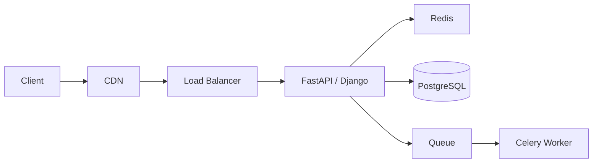
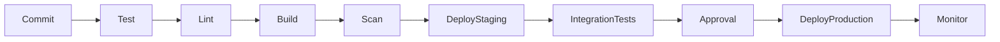

# 06- Senior Backend Interview

## Overview

A senior backend interview evaluates whether an engineer can own backend systems beyond individual features. The focus shifts from syntax and framework knowledge toward architecture, reliability, scalability, operational judgment, debugging, security, and technical leadership.

A strong senior backend engineer should be able to reason across the complete lifecycle of a system:

```text
Requirements
    ↓
API and domain design
    ↓
Data modeling
    ↓
Application implementation
    ↓
Caching / asynchronous processing
    ↓
Infrastructure
    ↓
Deployment
    ↓
Observability
    ↓
Failure handling
    ↓
Incident response
    ↓
Continuous improvement
```

The interview is therefore not only about answering questions correctly. It is about demonstrating how decisions are made under constraints.

A senior candidate should consistently answer five questions:

1. What problem are we solving?
2. What constraints matter?
3. What trade-off does this design introduce?
4. How will it behave under failure and scale?
5. How will we operate and evolve it?

---

## What Senior Means in Backend Engineering

A senior backend engineer is expected to move beyond implementation-level thinking.

| Level | Typical Focus |
|---|---|
| Junior | Implementing features correctly |
| Mid-level | Designing components and solving production issues |
| Senior | Owning systems, architecture, reliability, and technical decisions |
| Staff+ | Cross-system architecture, organizational influence, and long-term technical strategy |

Senior-level thinking includes:

- Understanding business requirements.
- Identifying architectural constraints.
- Designing maintainable APIs.
- Modeling data correctly.
- Predicting bottlenecks.
- Designing for failure.
- Improving performance using evidence.
- Operating systems in production.
- Making technology trade-offs.
- Mentoring engineers.
- Communicating technical decisions clearly.

The goal is not to know every technology. The goal is to know **when and why a technology should be used**.

---

## Senior Interview Answer Framework

For architecture and backend questions, use this structure:

```text
Problem
  ↓
Requirements
  ↓
Constraints
  ↓
Baseline design
  ↓
Trade-offs
  ↓
Failure modes
  ↓
Scaling
  ↓
Observability
  ↓
Security
  ↓
Operational model
```

For implementation questions, use:

```text
Correctness
  ↓
Complexity
  ↓
Concurrency
  ↓
Failure handling
  ↓
Performance
  ↓
Maintainability
  ↓
Testing
```

For behavioral engineering questions:

```text
Context
  ↓
Problem
  ↓
Decision
  ↓
Trade-off
  ↓
Execution
  ↓
Result
  ↓
What changed afterward
```

---

## System Design Questions

### How would you design a production backend from scratch?

Start by clarifying:

- Functional requirements.
- Expected traffic.
- Latency requirements.
- Availability requirements.
- Data consistency.
- Data retention.
- Security requirements.
- Deployment environment.
- Operational constraints.

Then establish a minimal architecture.

For example:



Do not introduce Kafka, Kubernetes, sharding, or microservices without a requirement that justifies them.

A senior engineer starts simple and creates an evolution path.

---

## How Do You Decide Between a Monolith and Microservices?

A modular monolith is often the correct starting point when:

- The domain is still evolving.
- The engineering team is small.
- Deployment independence is not required.
- Shared transactions are important.
- Operational complexity should remain low.

Microservices become more attractive when:

- Domains have clear boundaries.
- Teams need independent ownership.
- Components have significantly different scaling requirements.
- Independent deployment is valuable.
- Failure isolation is important.
- Technology autonomy is justified.

Microservices introduce:

- Network failures
- Distributed tracing
- Service discovery
- Deployment complexity
- Data ownership problems
- Distributed transactions
- Versioning challenges

A senior engineer should be able to explain why **not** to create a microservice.

---

## How Do You Identify Service Boundaries?

Do not create services based only on database tables.

Look at:

- Business capabilities.
- Domain ownership.
- Change frequency.
- Transaction boundaries.
- Team ownership.
- Scaling characteristics.
- Security boundaries.
- Failure isolation.

For example:

```text
E-commerce

Catalog
Orders
Payments
Inventory
Shipping
Notifications
```

These domains may eventually become separate services, but they do not need to be separate services on day one.

A poor boundary creates excessive communication:

```text
Service A
   ↓
B
   ↓
C
   ↓
D
   ↓
E
```

If every request requires five synchronous network calls, the system may be distributed but not resilient.

---

## How Do You Design a REST API?

A production API should define:

- Resource model.
- HTTP methods.
- Status codes.
- Request validation.
- Response schema.
- Authentication.
- Authorization.
- Pagination.
- Filtering.
- Sorting.
- Idempotency.
- Error handling.
- Versioning.

Example:

```http
POST /v1/orders
Authorization: Bearer <token>
Idempotency-Key: 8f5c2c7e-5b4d-4f6c-a5f7-2f6d3b8c2d11
Content-Type: application/json
```

```json
{
  "customer_id": "cus_123",
  "items": [
    {
      "product_id": "prod_456",
      "quantity": 2
    }
  ]
}
```

A production API should use predictable error structures.

```json
{
  "error": {
    "code": "INSUFFICIENT_STOCK",
    "message": "The requested product is unavailable.",
    "request_id": "req_123"
  }
}
```

Avoid exposing internal exceptions, SQL errors, or infrastructure details.

---

## How Should APIs Be Versioned?

Common approaches include:

```text
/v1/orders
/v2/orders
```

or header-based versioning.

URL versioning is often operationally simple and easy to understand.

Versioning should be introduced when compatibility requirements justify it.

Avoid creating a new API version for every small change.

Prefer backward-compatible changes where possible:

```text
Add optional field → usually compatible
Rename field → breaking
Remove field → breaking
Change semantics → potentially breaking
```

---

## How Do You Handle Pagination?

For large datasets, cursor-based pagination is often preferable to large offsets.

### Offset pagination

```http
GET /orders?page=100&limit=50
```

Simple but can become expensive for deep pages.

### Cursor pagination

```http
GET /orders?cursor=eyJpZCI6MTIzfQ==
```

The cursor represents a stable position in the dataset.

Cursor pagination works well for:

- Feeds
- Large datasets
- Frequently changing data
- High-volume APIs

A stable ordering is essential.

---

## How Do You Design Database Transactions?

Transactions should protect business invariants.

For example:

```text
BEGIN
    Create order
    Reserve inventory
    Record payment state
COMMIT
```

The transaction boundary should correspond to the consistency requirement.

Do not keep transactions open while performing:

- HTTP requests
- External API calls
- Long computations
- Slow file operations

Long transactions increase:

- Lock duration
- Contention
- Connection occupancy
- Deadlock probability

---

## How Do You Diagnose a Slow PostgreSQL Query?

Start with evidence.

```sql
EXPLAIN (ANALYZE, BUFFERS)
SELECT *
FROM orders
WHERE customer_id = 123
ORDER BY created_at DESC
LIMIT 50;
```

Investigate:

- Sequential scans.
- Index scans.
- Row estimates.
- Actual row counts.
- Join strategies.
- Sort operations.
- Temporary disk usage.
- Buffer reads.
- Lock waits.

Then consider:

- Appropriate indexes.
- Query restructuring.
- Reducing selected columns.
- Pagination.
- Data partitioning.
- Connection pooling.

Do not blindly add indexes.

---

## What Is Connection Pooling and Why Does It Matter?

Opening a database connection has overhead.

A connection pool keeps reusable connections available.

```text
Application
   ↓
Connection Pool
   ↓
PostgreSQL
```

If an application has hundreds of workers and each opens many database connections, PostgreSQL can become overloaded even when query volume is reasonable.

Capacity must consider:

```text
Total possible application connections
    ≤
Database connection capacity
```

Connection pooling is especially important when using:

- Django
- FastAPI
- Gunicorn
- Uvicorn
- Celery
- Kubernetes

---

## How Do You Prevent N+1 Queries?

N+1 occurs when application code performs one query for a collection and then additional queries for each object.

```text
1 query → fetch 100 users
100 queries → fetch each user's profile
```

In Django:

```python
users = User.objects.select_related("profile")
```

For many-to-many or reverse relationships:

```python
users = User.objects.prefetch_related("orders")
```

Use profiling and query inspection rather than applying eager loading everywhere.

Too much eager loading can produce unnecessarily large joins or result sets.

---

## How Do You Scale a Database?

Use a progression:

```text
Optimize queries
    ↓
Add appropriate indexes
    ↓
Connection pooling
    ↓
Caching
    ↓
Read replicas
    ↓
Partitioning
    ↓
Sharding
```

Not every system needs every layer.

The correct approach is to identify the actual bottleneck.

For example:

```text
CPU saturated
→ optimize queries / scale compute

Read traffic saturated
→ replicas / cache

Storage saturated
→ partitioning / archival / sharding

Write throughput saturated
→ workload redesign / partitioning / sharding
```

---

## How Do You Design Caching?

Start by identifying:

- Cacheable data.
- Read frequency.
- Change frequency.
- Acceptable staleness.
- Cache size.
- Eviction behavior.

A common pattern is cache-aside:

```text
Request
  ↓
Redis
  ├── Hit → Return
  │
  └── Miss
       ↓
   PostgreSQL
       ↓
   Redis
       ↓
    Return
```

Consider:

- TTL.
- Invalidation.
- Serialization.
- Hot keys.
- Stampedes.
- Cache failures.
- Memory limits.

A cache should generally be treated as disposable unless explicitly designed as durable state.

---

## What Happens When Redis Fails?

The answer depends on the cache's role.

If Redis contains only cache data:

```text
Redis unavailable
    ↓
Fallback to database
```

If Redis contains critical state:

```text
Redis unavailable
    ↓
Potential application failure
```

Therefore, the architecture must define Redis's failure semantics.

Do not accidentally turn a cache into a mandatory dependency for every request.

---

## How Do You Design Asynchronous Processing?

Use asynchronous processing when work:

- Takes significant time.
- Does not need to block the request.
- Can tolerate eventual completion.
- Is retryable.
- Benefits from buffering.

Example:

```text
POST /reports
     ↓
Create report job
     ↓
Return 202 Accepted
     ↓
Queue
     ↓
Celery Worker
     ↓
Generate report
     ↓
Object Storage
```

The client can poll:

```http
GET /reports/{id}
```

or receive a notification when processing completes.

---

## Celery vs Kafka

Celery is primarily useful for background task execution.

Kafka is primarily useful for durable event streaming.

| Requirement | Celery | Kafka |
|---|---|---|
| Background jobs | Excellent | Possible |
| Task retries | Excellent | Application-managed |
| Scheduled tasks | Strong | Not primary |
| Event replay | Limited | Strong |
| Event streams | Not primary | Excellent |
| Multiple independent consumers | Possible | Excellent |
| High-throughput event pipelines | Less suitable | Excellent |

Use the simplest mechanism that satisfies the workload.

---

## How Do You Design Reliable Background Jobs?

A production worker should consider:

- Idempotency.
- Retries.
- Backoff.
- Dead-letter handling.
- Timeouts.
- Visibility into failures.
- Job ownership.
- Duplicate execution.

For example:

```text
Receive job
   ↓
Validate
   ↓
Execute
   ↓
Success → ACK
   |
 Failure
   ↓
Retry with backoff
   ↓
Retry limit exceeded
   ↓
Dead-letter / failed-job state
```

Never assume a task executes exactly once.

---

## How Do You Handle Retries?

Retry only failures likely to succeed later.

Usually retry:

- Connection resets.
- Temporary network failures.
- 5xx responses.
- Rate-limit responses where appropriate.

Usually do not blindly retry:

- Authentication failures.
- Validation errors.
- Permanent business errors.

Use exponential backoff and jitter:

```text
1s
2s
4s
8s
16s
```

with randomization to prevent synchronized retry storms.

---

## What Is a Retry Storm?

A retry storm occurs when many clients retry an unhealthy dependency simultaneously.

```text
Dependency fails
     ↓
10,000 requests fail
     ↓
10,000 clients retry
     ↓
Dependency receives even more traffic
     ↓
Recovery becomes harder
```

Mitigate with:

- Exponential backoff.
- Jitter.
- Retry budgets.
- Circuit breakers.
- Rate limiting.
- Load shedding.
- Timeouts.

Retries should reduce transient failure impact, not amplify outages.

---

## What Is a Circuit Breaker?

A circuit breaker prevents repeated calls to an unhealthy dependency.

Typical states:

```text
CLOSED
  ↓ repeated failures
OPEN
  ↓ timeout
HALF-OPEN
  ↓ successful probe
CLOSED
```

When open, requests fail fast or use a fallback.

This protects both the caller and the failing dependency.

---

## How Do You Design for Failure?

Assume every dependency can fail.

Examples:

- PostgreSQL unavailable.
- Redis unavailable.
- Kafka unavailable.
- DNS failure.
- Network timeout.
- External API timeout.
- Disk full.
- CPU saturation.
- Memory exhaustion.
- Kubernetes node failure.

For each dependency ask:

```text
What happens if it fails?
How long do we wait?
Do we retry?
Can we degrade?
Can we queue?
Can we serve stale data?
How do we alert?
How do we recover?
```

This is a strong senior-level design habit.

---

## How Do You Prevent Cascading Failures?

Use isolation.

### Bulkheads

Separate resources for different workloads.

```text
Critical requests → Pool A
Non-critical work → Pool B
```

If Pool B is exhausted, critical traffic can continue.

Other techniques:

- Timeouts.
- Circuit breakers.
- Queue limits.
- Rate limits.
- Load shedding.
- Dependency isolation.
- Separate worker pools.

---

## How Do You Design Idempotent APIs?

Use an idempotency key for operations that can be retried.

```http
POST /payments
Idempotency-Key: payment-123
```

Store:

```text
idempotency_key
request_hash
status
response
created_at
```

On retry:

```text
Same key + same request
        ↓
Return previous result
```

A reused key with a different request body should normally be rejected.

---

## How Do You Handle Concurrent Updates?

Consider:

```text
Stock = 1

Request A reads stock = 1
Request B reads stock = 1

A purchases
B purchases
```

Both may incorrectly succeed.

Solutions include:

- Row-level locking.
- Optimistic concurrency.
- Atomic updates.
- Serializable transactions where justified.
- Version columns.

Example:

```sql
UPDATE inventory
SET quantity = quantity - 1
WHERE product_id = 123
  AND quantity > 0;
```

Then verify the affected row count.

---

## Optimistic vs Pessimistic Locking

| Approach | Behavior | Useful When |
|---|---|---|
| Optimistic | Detect conflict during update | Conflicts are uncommon |
| Pessimistic | Lock resource before update | Conflicts are frequent or correctness requires serialization |

Optimistic locking generally reduces blocking but requires conflict handling.

Pessimistic locking can increase contention.

---

## How Do You Design Authentication?

A production authentication architecture may include:

```text
Client
  ↓
Identity Provider
  ↓
Access Token
  ↓
API Gateway
  ↓
Backend
```

Consider:

- Password hashing.
- Token expiration.
- Refresh tokens.
- MFA.
- Session invalidation.
- Credential rotation.
- Rate limiting.
- Account lockout or abuse controls.

Never store passwords using plain hashing algorithms such as SHA-256.

Use a password hashing algorithm designed for passwords, such as Argon2id or bcrypt, with appropriate configuration.

---

## Authentication vs Authorization

Authentication:

> Who is the caller?

Authorization:

> What can the caller do?

Example:

```text
JWT validates user
      ↓
User = 42
      ↓
Authorization policy
      ↓
Can user 42 modify order 100?
```

Object-level authorization is critical.

Checking only:

```python
if request.user.is_authenticated:
```

does not establish that the user owns the requested resource.

---

## How Do You Secure APIs?

Use multiple layers:

```text
TLS
 ↓
Authentication
 ↓
Authorization
 ↓
Input validation
 ↓
Rate limiting
 ↓
Business validation
 ↓
Database authorization constraints where appropriate
 ↓
Audit logging
```

Important protections include:

- TLS.
- Secure headers.
- Input validation.
- Output encoding where applicable.
- CSRF protection for cookie-based authentication.
- Rate limiting.
- Secret management.
- Least privilege.
- Dependency vulnerability scanning.

---

## How Do You Manage Secrets?

Never commit:

```text
DATABASE_PASSWORD=...
SECRET_KEY=...
AWS_SECRET_ACCESS_KEY=...
```

into source control.

Use:

- AWS Secrets Manager.
- AWS Systems Manager Parameter Store.
- Kubernetes Secrets with appropriate external secret management.
- CI/CD secret stores.

Applications should retrieve secrets through controlled configuration mechanisms.

Secrets should also be rotated.

---

## How Do You Design Observability?

Three primary signals:

```text
Metrics
Logs
Traces
```

Useful metrics include:

```text
Request rate
Error rate
p50 / p95 / p99 latency
CPU
Memory
Database connections
Cache hit ratio
Queue depth
Kafka consumer lag
Worker failure rate
```

Structured logging should include identifiers such as:

```json
{
  "level": "ERROR",
  "service": "orders",
  "request_id": "req_123",
  "trace_id": "trace_456",
  "error_code": "PAYMENT_TIMEOUT"
}
```

Do not log secrets, tokens, passwords, or unnecessary sensitive data.

---

## What Is the Difference Between Monitoring and Observability?

Monitoring generally answers:

> Is the system healthy?

Observability helps answer:

> Why is the system behaving this way?

Monitoring commonly uses predefined metrics and alerts.

Observability combines:

- Metrics.
- Logs.
- Traces.
- Contextual correlation.

A senior engineer should design systems so failures can be diagnosed without manually reproducing every issue.

---

## How Do You Debug a Production Latency Spike?

Start with the user-facing symptom.

```text
Latency increased
    ↓
Which endpoint?
    ↓
Which percentile?
    ↓
Which region?
    ↓
Which deployment?
    ↓
Which dependency?
    ↓
Database / cache / network / CPU?
```

Check:

- Recent deployments.
- Error rate.
- Request volume.
- CPU and memory.
- Database latency.
- Database locks.
- Connection pool usage.
- Cache hit ratio.
- Queue depth.
- External dependency latency.

Use traces to identify where request time is actually spent.

Do not restart services repeatedly without understanding the cause.

---

## How Do You Debug High CPU?

Investigate:

- Request volume.
- Expensive endpoints.
- Infinite loops.
- Serialization cost.
- Regex complexity.
- Database behavior.
- Worker concurrency.
- Garbage collection.
- CPU-bound Python code.

For Python applications, determine whether the workload is:

- I/O-bound.
- CPU-bound.
- Blocking.
- Async-compatible.

Do not assume `async` automatically improves CPU-bound workloads.

---

## How Do You Handle CPU-Bound Work in Python?

Python's standard CPython implementation uses the Global Interpreter Lock for Python bytecode execution in a process.

CPU-heavy work may benefit from:

- Multiprocessing.
- Distributed workers.
- Native libraries.
- Specialized compute services.
- Offloading to batch systems.

Asyncio is primarily useful for I/O concurrency, not automatically for CPU parallelism.

---

## How Do You Handle I/O-Bound Work?

I/O-bound work spends significant time waiting on:

- Databases.
- HTTP services.
- File systems.
- Network operations.

Async frameworks such as FastAPI can efficiently handle many concurrent I/O operations when dependencies are also used appropriately.

However, an async endpoint calling blocking synchronous code can still block the event loop.

---

## Django vs FastAPI in a Senior Interview

Avoid saying one is universally better.

| Concern | Django | FastAPI |
|---|---|---|
| Batteries included | Strong | Lower |
| ORM | Built-in | External choices |
| Admin | Excellent | Not built-in |
| API development | Strong with DRF | Excellent |
| Async support | Supported | Core strength |
| Ecosystem | Mature | Modern and growing |
| Large monolithic applications | Strong | Possible |
| Lightweight services | Possible | Strong |

The correct choice depends on:

- Existing ecosystem.
- Team expertise.
- Application type.
- Async requirements.
- ORM needs.
- Operational constraints.

---

## REST vs gRPC

REST is useful when:

- Public APIs are required.
- Browser interoperability matters.
- Human-readable HTTP APIs are valuable.
- Broad client support is required.

gRPC is useful for:

- Internal service-to-service communication.
- Strong contracts.
- High-throughput RPC.
- Streaming.
- Efficient binary serialization.

A common architecture is:

```text
Browser
  ↓
REST / HTTPS
  ↓
API Gateway
  ↓
Internal Services
  ↓
gRPC
```

Protocol selection should follow system boundaries and client requirements.

---

## Docker vs Kubernetes

Docker packages applications into portable containers.

Kubernetes orchestrates containerized workloads.

```text
Docker
→ Build / package / run container

Kubernetes
→ Schedule / scale / heal / network / manage containers
```

Kubernetes becomes useful when operational requirements justify its complexity:

- Multiple services.
- Automated scheduling.
- Autoscaling.
- Service discovery.
- Rolling deployments.
- Self-healing.
- Declarative infrastructure.

A small application does not automatically require Kubernetes.

---

## How Do You Design CI/CD?

A production pipeline might look like:



Pipeline stages commonly include:

- Unit tests.
- Integration tests.
- Static analysis.
- Dependency scanning.
- Container scanning.
- Build.
- Deployment.
- Smoke tests.
- Rollback.

The pipeline should prevent known classes of defects from reaching production.

---

## How Do You Perform Zero-Downtime Deployment?

Common strategies include:

### Rolling deployment

Replace instances gradually.

### Blue-green deployment

Maintain two environments:

```text
Blue  → Current
Green → New
```

Shift traffic after validation.

### Canary deployment

Send a small percentage of traffic to the new version first.

```text
95% → v1
5%  → v2
```

Increase traffic gradually if metrics remain healthy.

Database migrations must also be backward compatible with both application versions during rolling deployments.

---

## How Do You Handle Database Migrations Safely?

Avoid deployments where application and schema changes must happen simultaneously.

Prefer:

```text
1. Add new nullable column
2. Deploy application supporting old + new schema
3. Backfill data
4. Start writing new field
5. Validate
6. Remove old field later
```

This is safer than:

```text
Drop old column
↓
Deploy application
```

because rollback becomes difficult.

---

## What Is the Difference Between Availability, Reliability, and Durability?

### Availability

How often the system is accessible.

### Reliability

How consistently the system performs correctly over time.

### Durability

How well data survives failures.

For example:

```text
API availability = 99.99%
Database durability = extremely high
```

A system can be highly available while still having poor data correctness or operational reliability.

---

## What Are SLOs, SLIs, and SLAs?

### SLI

A measured indicator.

Example:

```text
Successful requests / total requests
```

### SLO

Internal reliability target.

```text
99.9% successful requests
```

### SLA

A contractual commitment, often including consequences if the commitment is violated.

Senior engineers should design systems around measurable reliability objectives rather than vague terms such as "fast" or "highly available."

---

## How Do You Design Rate Limiting at Scale?

A distributed rate limiter should maintain shared state.

Possible architecture:

```text
Client
  ↓
Load Balancer
  ↓
API Instances
  ↓
Redis
```

Token bucket state can be stored in Redis.

At very high scale, consider:

- Distributed key distribution.
- Hot keys.
- Regional limits.
- Approximate counters where acceptable.
- Gateway-level enforcement.
- Per-user and per-IP policies.

Rate limiting should protect both the application and its dependencies.

---

## How Do You Handle Multi-Tenant Systems?

Define isolation requirements first.

Tenants may share:

- Application infrastructure.
- Database.
- Cache.
- Queues.

But authorization must enforce tenant boundaries.

A common model:

```text
tenant_id
    ↓
Every tenant-owned resource
    ↓
Authorization filter
```

Consider stronger isolation when required:

| Model | Isolation | Operational Cost |
|---|---|---|
| Shared database | Lower | Lower |
| Schema per tenant | Medium | Medium |
| Database per tenant | Higher | Higher |
| Dedicated infrastructure | Highest | Highest |

Tenant size and regulatory requirements may justify different models for different customers.

---

## How Do You Design for Multi-Region Deployment?

Consider multi-region only when requirements justify it.

Drivers include:

- Global latency.
- Regional availability.
- Regulatory requirements.
- Disaster recovery.
- Business continuity.

Challenges include:

- Data replication.
- Conflict resolution.
- Global routing.
- Session management.
- Cache consistency.
- Cross-region latency.
- Operational complexity.

A common model is:

```text
Users
  ↓
Global DNS / Edge Routing
  ↓
Region A     Region B
   ↓            ↓
 Services     Services
   ↓            ↓
 Databases ↔ Replication
```

Multi-region is not simply "deploy everything twice."

---

## Senior-Level Architecture Review

When reviewing an architecture, ask:

### Correctness

- Are invariants enforced?
- Can duplicate operations occur?
- Can stale data cause incorrect decisions?

### Scalability

- What component saturates first?
- What happens at 10× traffic?
- Can components scale independently?

### Reliability

- What happens when dependencies fail?
- Are retries bounded?
- Are operations idempotent?

### Security

- Who can access the system?
- Who can access individual resources?
- Where are secrets stored?

### Operations

- How is the system monitored?
- How is it deployed?
- How is it rolled back?
- How is an incident diagnosed?

### Cost

- What infrastructure dominates cost?
- Is the architecture over-provisioned?
- Can expensive operations be made asynchronous?

---

## Senior Backend Coding Questions

Senior interviews can include implementation questions that test engineering judgment rather than syntax.

### Implement an LRU Cache

Discuss:

- Hash map lookup.
- Doubly linked list.
- O(1) lookup.
- O(1) insertion.
- O(1) eviction.

Expected complexity:

```text
get() → O(1)
put() → O(1)
```

Do not only provide code. Explain memory behavior and concurrency concerns.

---

## Implement a Rate Limiter

Discuss:

- Algorithm.
- State storage.
- Distributed coordination.
- Expiration.
- Atomicity.
- Clock behavior.
- Failure semantics.

A local in-memory limiter is insufficient when the API runs across multiple instances unless limits are intentionally instance-local.

---

## Implement a Worker Pool

Discuss:

- Queue behavior.
- Worker lifecycle.
- Graceful shutdown.
- Retry behavior.
- Bounded concurrency.
- Backpressure.

Unbounded task creation can exhaust memory.

---

## Implement an Idempotent API

Discuss:

- Idempotency key.
- Request hash.
- Persistence.
- Duplicate handling.
- Concurrent requests using the same key.
- Expiration policy.

The implementation should protect against two identical requests arriving simultaneously.

---

## Implement Retry with Exponential Backoff

A conceptual implementation:

```python
import random
import time


def retry_with_backoff(operation, retries=5, base_delay=0.5):
    for attempt in range(retries):
        try:
            return operation()
        except Exception:
            if attempt == retries - 1:
                raise

            delay = base_delay * (2**attempt)
            delay *= random.uniform(0.5, 1.5)
            time.sleep(delay)
```

In production, do not catch every exception indiscriminately. Retry only known transient failures and enforce an overall timeout.

---

## Senior-Level Python Questions

### What Is the Difference Between a Process, Thread, and Coroutine?

| Primitive | Execution Model | Typical Use |
|---|---|---|
| Process | Independent process | CPU parallelism |
| Thread | OS/runtime thread | I/O concurrency |
| Coroutine | Cooperative execution | Async I/O |

The right choice depends on workload characteristics.

---

## What Is the GIL?

The Global Interpreter Lock in CPython limits simultaneous execution of Python bytecode by multiple threads within a process.

It does not mean:

> Python cannot perform concurrent work.

Threads can still be useful for I/O-bound workloads.

For CPU-bound Python code, use multiprocessing or appropriate external/native compute mechanisms when parallelism is required.

---

## What Is Asyncio?

`asyncio` provides cooperative asynchronous execution.

Example:

```python
import asyncio


async def fetch_data():
    await asyncio.sleep(1)
    return "data"


async def main():
    results = await asyncio.gather(
        fetch_data(),
        fetch_data(),
    )
    print(results)


asyncio.run(main())
```

The important concept is that `await` allows other tasks to execute while the current coroutine waits on asynchronous I/O.

Calling blocking operations from the event loop defeats the benefit.

---

## What Is Dependency Injection?

Dependency injection separates object construction from object usage.

In FastAPI:

```python
from fastapi import Depends, FastAPI

app = FastAPI()


def get_service():
    return OrderService()


@app.get("/orders/{order_id}")
def get_order(order_id: int, service=Depends(get_service)):
    return service.get_order(order_id)
```

Benefits:

- Testability.
- Loose coupling.
- Replaceable implementations.
- Explicit dependencies.

Senior engineers should avoid dependency injection becoming an abstraction layer without meaningful value.

---

## How Do You Structure a Large Python Backend?

A practical structure may separate domain, application, infrastructure, and API concerns.

```text
app/
├── api/
├── domain/
├── application/
├── infrastructure/
├── models/
├── repositories/
├── services/
├── tasks/
├── settings/
└── tests/
```

The exact structure depends on team conventions.

The important principle is reducing coupling between:

- HTTP transport.
- Business logic.
- Persistence.
- External integrations.

---

## Senior Behavioral Engineering Questions

Senior backend interviews frequently evaluate ownership and judgment.

### Tell me about a difficult production incident.

Use:

```text
Context
Problem
Impact
Diagnosis
Decision
Mitigation
Root cause
Permanent fix
Preventive changes
```

A strong answer includes measurable impact.

For example:

```text
p95 latency increased from 180 ms to 2.4 s.
Error rate increased from 0.2% to 8%.
```

Then explain what you changed afterward.

---

## Tell Me About a Time You Disagreed With an Architectural Decision

Avoid framing the story as:

> "I was right and everyone else was wrong."

Instead explain:

- What assumptions differed.
- What evidence you gathered.
- What trade-offs existed.
- How you communicated.
- What decision was made.
- What happened afterward.

Senior engineers optimize for the best system and team outcome, not personal victory.

---

## Tell Me About a Technical Debt Decision

Explain:

- Why the debt existed.
- Why it was acceptable initially.
- What risk it created.
- How you prioritized it.
- What business impact justified the work.
- How you prevented recurrence.

Technical debt is not automatically bad.

Intentional, understood debt can be reasonable.

Untracked debt that repeatedly creates incidents is different.

---

## Tell Me About a Performance Optimization You Made

A strong answer follows:

```text
Baseline
  ↓
Measurement
  ↓
Bottleneck
  ↓
Hypothesis
  ↓
Change
  ↓
Measurement
  ↓
Production validation
```

Example:

```text
p95 = 900 ms
↓
Database query = 650 ms
↓
Missing composite index
↓
Add index
↓
p95 = 220 ms
```

Always quantify the improvement when possible.

---

## Tell Me About a Failure You Caused

A mature answer should include:

- What happened.
- Your responsibility.
- How the failure was detected.
- How impact was contained.
- Root cause.
- Corrective action.
- Preventive action.

Avoid blaming another team.

The interviewer is evaluating accountability and learning behavior.

---

## How Do You Prioritize Technical Work?

Consider:

```text
Business impact
+
Reliability risk
+
Security risk
+
Operational cost
+
Engineering effort
+
Urgency
```

For example, a security vulnerability affecting production should generally outrank a low-impact refactoring task.

A useful senior behavior is making trade-offs explicit rather than trying to maximize every dimension simultaneously.

---

## How Do You Mentor Engineers?

Effective mentoring includes:

- Explaining reasoning, not only answers.
- Reviewing designs.
- Giving actionable code-review feedback.
- Delegating ownership.
- Creating safe opportunities for engineers to make decisions.
- Sharing operational knowledge.
- Encouraging documentation.

Do not become the bottleneck for every technical decision.

A senior engineer increases the capability of the team.

---

## How Do You Conduct a Code Review?

Review in this order:

1. Correctness.
2. Security.
3. Reliability.
4. Performance.
5. Maintainability.
6. Testing.
7. Style.

Avoid spending most review time on formatting that automated tools can enforce.

A useful review comment explains:

```text
Problem
Why it matters
Suggested direction
```

rather than simply saying:

> "This is wrong."

---

## How Do You Handle an Engineer Making a Repeated Mistake?

Separate:

- Knowledge gap.
- Process problem.
- Communication issue.
- Lack of ownership.
- Excessive workload.

Then address the root cause.

Possible actions:

- Pair programming.
- Documentation.
- Review checklist.
- Testing improvements.
- Clear ownership.
- Follow-up.

Senior engineers should solve recurring system and process problems rather than repeatedly fixing symptoms.

---

## Production Readiness Checklist

Before considering a backend system production-ready:

### Application

- [ ] Input validation exists.
- [ ] Error handling is consistent.
- [ ] Timeouts are configured.
- [ ] External calls are bounded.
- [ ] Idempotency is implemented where required.
- [ ] Configuration is externalized.

### Database

- [ ] Queries are reviewed.
- [ ] Appropriate indexes exist.
- [ ] Connection limits are understood.
- [ ] Backups are configured.
- [ ] Restore procedures are tested.
- [ ] Migrations are backward compatible.

### Infrastructure

- [ ] Health checks exist.
- [ ] Autoscaling is configured where needed.
- [ ] Secrets are managed securely.
- [ ] Network boundaries are defined.
- [ ] Resource limits are configured.

### Reliability

- [ ] Retries are bounded.
- [ ] Circuit breakers exist where appropriate.
- [ ] Queues have backpressure controls.
- [ ] Failure paths are tested.
- [ ] Disaster recovery is documented.

### Observability

- [ ] Metrics exist.
- [ ] Structured logs exist.
- [ ] Distributed tracing is available where needed.
- [ ] Alerts are actionable.
- [ ] Dashboards exist for critical services.

### Security

- [ ] Authentication exists.
- [ ] Authorization exists.
- [ ] Least privilege is applied.
- [ ] TLS is enabled.
- [ ] Secrets are not committed.
- [ ] Dependencies are scanned.

---

## Senior Backend Interview Red Flags

Avoid these patterns.

### Technology-first answers

```text
"We should use Kafka because it is scalable."
```

Better:

```text
"We need durable event streams consumed independently by several
services, so Kafka provides useful partitioning and replay semantics."
```

### Absolute statements

Avoid:

- "Microservices are always better."
- "NoSQL is faster."
- "Redis is required for scalability."
- "Kubernetes is mandatory."
- "Async is always faster."
- "Kafka guarantees exactly once."

Architecture is contextual.

### Ignoring operations

A design without:

- Monitoring.
- Deployment.
- Rollback.
- Recovery.
- Security.

is incomplete.

### Overengineering

Do not introduce:

```text
Kubernetes
Kafka
Service mesh
Multi-region
Sharding
CQRS
Event sourcing
```

just to make an architecture look senior.

Complexity itself is a production cost.

---

## Senior Interview Mental Model

When facing an unfamiliar question, use this sequence:

```text
What must the system do?
        ↓
How much traffic?
        ↓
What data exists?
        ↓
What must be strongly consistent?
        ↓
What can be asynchronous?
        ↓
What is the critical path?
        ↓
What fails first?
        ↓
How do we scale it?
        ↓
How do we secure it?
        ↓
How do we observe it?
        ↓
How do we recover it?
        ↓
What trade-offs did we make?
```

This framework is more valuable than memorizing individual architectures.

---

## Key Takeaways

- **Senior backend interviews evaluate ownership and engineering judgment: architecture, reliability, security, performance, operations, and trade-offs matter as much as implementation skills.**
- **Strong answers begin with requirements and measurable constraints, then introduce the minimum architecture necessary to satisfy them before discussing scaling and evolution.**
- **Production-level reasoning requires explicit handling of failure, concurrency, retries, idempotency, observability, deployment, database behavior, and disaster recovery.**
- **Technology choices should be justified by workload and constraints rather than popularity; senior engineers explain both why a technology is appropriate and why alternatives were rejected.**
- **The strongest senior engineers demonstrate measurable impact, accountability, clear communication, and the ability to improve both systems and the engineering team operating them.**