# 07- FAANG Style Questions

## Overview

FAANG-style system design interviews evaluate whether a candidate can reason about large-scale distributed systems under incomplete requirements and competing constraints. The emphasis is not on reproducing a memorized architecture. It is on demonstrating a repeatable engineering process:

```text
Clarify requirements
        ↓
Estimate capacity
        ↓
Define APIs and data model
        ↓
Design baseline architecture
        ↓
Identify bottlenecks
        ↓
Scale critical components
        ↓
Design for failure
        ↓
Address consistency and concurrency
        ↓
Add security and observability
        ↓
Explain trade-offs
```

The strongest answers remain internally consistent. If the candidate claims millions of requests per second, the architecture must explain how traffic is distributed. If the design uses asynchronous processing, it must explain delivery semantics, retries, idempotency, and failure recovery. If a database is selected, the answer should explain access patterns, indexes, replication, and scaling strategy.

The objective is to demonstrate **engineering judgment under constraints**, not architectural complexity.

---

## How to Approach FAANG-Style Questions

A reliable interview structure is:

| Phase | Questions to Answer |
|---|---|
| Requirements | What must the system do? |
| Scope | What is explicitly out of scope? |
| Scale | How much traffic and data exist? |
| API | How do clients interact with the system? |
| Data | What entities and relationships exist? |
| Architecture | What are the major components? |
| Bottlenecks | What saturates first? |
| Reliability | What happens when dependencies fail? |
| Consistency | What must be strongly consistent? |
| Security | Who can access what? |
| Observability | How will failures be detected and diagnosed? |
| Trade-offs | Why this design instead of alternatives? |

Do not spend half the interview designing infrastructure before clarifying what the system actually needs to do.

---

## Requirement Clarification

Before drawing architecture, identify functional requirements.

For a URL-shortening service:

```text
Create short URL
Redirect short URL
Optional expiration
Optional analytics
```

Then clarify non-functional requirements:

```text
Expected traffic
Latency target
Availability target
Data retention
Read/write ratio
Geographic distribution
Consistency requirements
Security requirements
Cost constraints
```

A useful distinction is:

### Functional requirements

What the system does.

### Non-functional requirements

How well the system must do it.

Examples:

```text
Functional:
Create and resolve URLs.

Non-functional:
p99 redirect latency < 100 ms
99.99% availability
Support 100M stored URLs
```

---

## Scope Control

Interview questions are intentionally broad.

Do not attempt to design every possible feature.

For example, when asked to design a social media feed, explicitly scope:

```text
In scope:
- Post creation
- Feed generation
- Feed retrieval

Out of scope:
- Messaging
- Advertising
- Video processing
- Recommendation ranking
```

This prevents the interview from turning into an uncontrolled architecture exercise.

---

## Capacity Estimation

Capacity estimation establishes the scale that architecture must support.

Typical calculations include:

```text
Requests per second
Storage
Bandwidth
Memory
Database operations
Cache size
```

### Example

Suppose:

```text
100M daily active users
10 requests/user/day
```

Then:

```text
1B requests/day
```

Average RPS:

```text
1,000,000,000 / 86,400
≈ 11,574 RPS
```

If peak traffic is estimated at 5× average:

```text
Peak ≈ 58,000 RPS
```

The exact number is less important than showing the reasoning.

---

## Read/Write Ratio

Suppose:

```text
100,000 requests/sec
10% writes
90% reads
```

Then:

```text
Writes = 10,000/sec
Reads  = 90,000/sec
```

This immediately affects architecture.

A read-heavy workload may benefit from:

- Redis.
- Read replicas.
- CDN.
- Denormalized read models.
- Search indexes.

A write-heavy workload may require:

- Partitioning.
- Write-optimized storage.
- Batching.
- Asynchronous processing.
- Sharding.

---

## Storage Estimation

Suppose:

```text
10M new records/day
Average record = 2 KB
```

Daily storage:

```text
10,000,000 × 2 KB
≈ 20 GB/day
```

Annual raw storage:

```text
20 GB × 365
≈ 7.3 TB/year
```

Then account for:

- Indexes.
- Replicas.
- Metadata.
- Backups.
- Compression.
- Retention.
- Operational overhead.

A senior candidate should avoid presenting raw storage as the final database capacity.

---

## Latency Budgeting

An API's latency is the sum of multiple components.

```text
Client
 ↓
DNS
 ↓
Load Balancer
 ↓
Application
 ↓
Redis
 ↓
Database
 ↓
External Service
```

For example:

```text
API budget = 200 ms

Application       30 ms
Redis              5 ms
PostgreSQL        50 ms
External API      80 ms
Network overhead  20 ms
-----------------------
Total            185 ms
```

If the external service suddenly takes 500 ms, the API violates its latency target.

Therefore, dependency timeouts are part of API design.

---

## The Baseline Architecture

Start with a simple architecture.

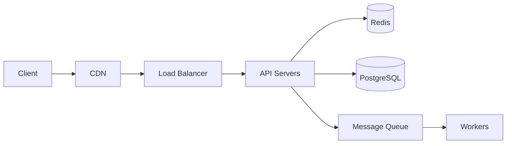

Then identify bottlenecks.

Do not start with:

```text
API Gateway
Service Mesh
Kafka
Kubernetes
Multi-region
Sharding
CQRS
Event Sourcing
```

unless requirements justify them.

---

## Architecture Evolution

A realistic architecture often evolves:

```text
Modular Monolith
      ↓
Load Balancing
      ↓
Caching
      ↓
Asynchronous Processing
      ↓
Read Replicas
      ↓
Service Extraction
      ↓
Partitioning
      ↓
Multi-region
```

The order is not mandatory.

The important principle is:

> Increase architectural complexity only when the current design can no longer satisfy measurable requirements.

---

# System Design Question: URL Shortener

## Requirements

Functional:

- Create a short URL.
- Redirect a short URL.
- Optional expiration.

Non-functional:

- Very high read traffic.
- Low redirect latency.
- High availability.
- Durable mappings.

Assume:

```text
100M URLs/day
Read/write ratio = 100:1
```

This is heavily read-oriented.

---

## API

```http
POST /v1/urls
Content-Type: application/json
```

```json
{
  "url": "https://example.com/products/123",
  "expires_at": "2027-01-01T00:00:00Z"
}
```

Response:

```json
{
  "short_code": "a8K2xP",
  "url": "https://short.example/a8K2xP"
}
```

Redirect:

```http
GET /a8K2xP
```

---

## Data Model

```text
URL
--------------------------------
id
short_code
original_url
created_at
expires_at
```

`short_code` should have a unique index.

---

## Architecture

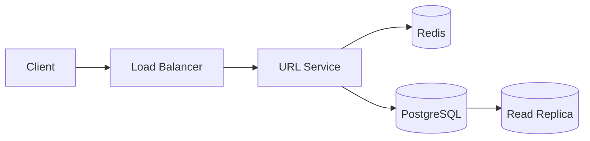

The redirect path is read-heavy.

Possible flow:

```text
GET /a8K2xP
      ↓
Redis
      ↓
Cache Hit
      ↓
HTTP 301/302
```

On cache miss:

```text
Redis miss
    ↓
Database
    ↓
Redis SET
    ↓
Redirect
```

---

## Key Design Decisions

### Short-code generation

Possible strategies:

- Random IDs.
- Database-generated IDs encoded using Base62.
- Snowflake-style identifiers.

Base62 provides compact representations:

```text
0-9
a-z
A-Z
```

A unique integer can be encoded into a shorter string.

### Collision handling

Random codes can collide.

The database must enforce uniqueness.

Application-level uniqueness checks alone are insufficient under concurrency.

---

## System Design Question: Rate Limiter

## Requirements

Design a distributed API rate limiter.

Assume:

```text
10M users
100K requests/sec
Limit = 100 requests/minute/user
```

The limiter must work across multiple application instances.

---

## Architecture

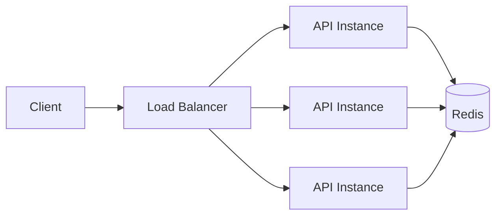

Redis provides shared state.

---

## Token Bucket

The token bucket maintains:

```text
capacity
tokens
refill_rate
last_refill_time
```

A request consumes a token.

If no token exists:

```text
Reject / delay request
```

Advantages:

- Supports bursts.
- Simple conceptual model.
- Efficient implementation.

Limitations:

- Distributed state is required.
- Redis becomes a dependency.
- Hot keys can become problematic.

---

## Atomicity

Two requests can race:

```text
Request A → read tokens = 1
Request B → read tokens = 1

A → consume
B → consume
```

Both may succeed incorrectly.

The token update must be atomic.

Redis Lua scripts or equivalent atomic server-side operations can be used when the algorithm requires multiple state operations to execute as one unit.

---

## System Design Question: News Feed

## Requirements

Design a social-media feed.

Assume:

```text
100M daily users
10M posts/day
Feed reads >> post writes
```

The primary challenge is feed generation.

---

## Pull Model

Generate the feed when the user requests it.

```text
User
 ↓
Feed Service
 ↓
Fetch followed users
 ↓
Fetch recent posts
 ↓
Rank
 ↓
Return
```

Advantages:

- Less write amplification.
- Simple post creation.
- Fresh data.

Limitations:

- Expensive feed reads.
- Complex ranking.
- High fan-out for users following many accounts.

---

## Push Model

Generate feeds when posts are created.

```text
User A creates post
        ↓
Fan-out service
        ↓
Followers
        ↓
Precomputed feeds
```

Feed reads become cheap.

But write amplification can be enormous.

If one user has 10M followers:

```text
1 post
→ 10M feed updates
```

---

## Hybrid Fan-Out

Use push for normal accounts and pull for celebrity accounts.

```text
Normal user
→ Push post to followers

High-fanout user
→ Store post once
→ Merge during feed read
```

This hybrid model avoids extreme write amplification.

---

## System Design Question: Chat System

## Requirements

- One-to-one messaging.
- Group messaging.
- Message ordering.
- Online/offline delivery.
- Message persistence.
- Read receipts.

Architecture:

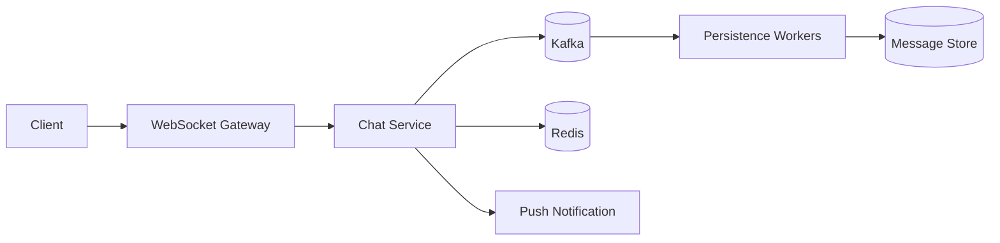

---

## WebSocket vs REST

REST works well for:

```text
Fetch message history
Create conversation
Update conversation metadata
```

WebSocket works well for:

```text
Real-time message delivery
Typing indicators
Presence updates
Read receipts
```

A system can use both.

---

## Message Ordering

Ordering must be defined.

Possible ordering scopes:

```text
Global ordering
Conversation ordering
Partition ordering
Per-user ordering
```

Global ordering is expensive and usually unnecessary.

For chat, conversation-level ordering is generally more useful.

Kafka partitioning can use:

```text
partition_key = conversation_id
```

This keeps messages for the same conversation ordered within a partition.

---

## Duplicate Messages

Network retries can produce duplicate delivery.

Consumers should be idempotent.

For example:

```text
message_id = UUID
```

The persistence layer can enforce uniqueness on `message_id`.

At-least-once delivery plus idempotent consumers is often more practical than attempting true exactly-once end-to-end behavior.

---

## System Design Question: Notification System

## Requirements

Support:

- Email.
- SMS.
- Push notifications.

Architecture:

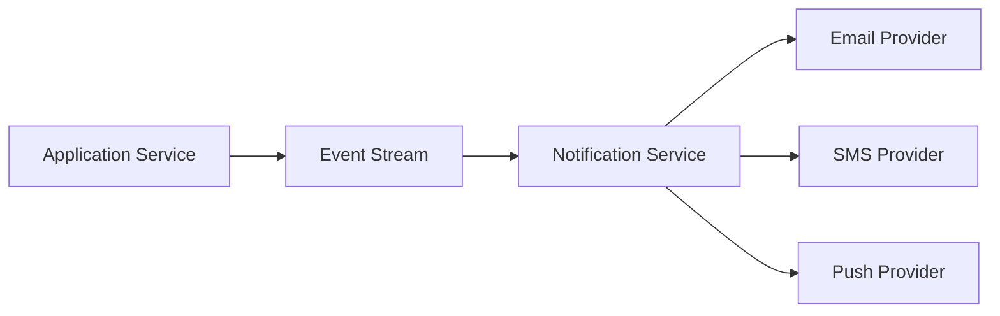

The notification service should be asynchronous.

The originating API should not wait for an external email provider.

---

## Reliability

A notification event might be delivered more than once.

Therefore:

```text
Event ID
   ↓
Deduplication
   ↓
Send
   ↓
Record result
```

External provider calls should have:

- Timeout.
- Retry policy.
- Backoff.
- Rate limiting.
- Dead-letter handling.

---

## System Design Question: File Storage System

## Requirements

Design a service for uploading and downloading large files.

Avoid routing large file bodies through application servers unnecessarily.

Use object storage.

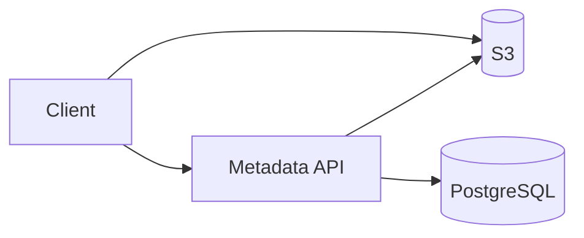

A common pattern is:

```text
Client
 ↓
Request upload authorization
 ↓
API generates pre-signed URL
 ↓
Client uploads directly to S3
 ↓
Object-created event
 ↓
Processing pipeline
```

This reduces application bandwidth and improves scalability.

---

## Large File Processing

For image or video processing:

```text
S3
 ↓
Event
 ↓
Queue
 ↓
Workers
 ↓
Processed object
 ↓
S3
```

Do not make the upload request wait for expensive processing.

---

## System Design Question: Search Autocomplete

## Requirements

Return suggestions with very low latency.

Potential architecture:

```text
Client
 ↓
API
 ↓
Search Index
```

Possible data structures:

- Trie.
- Prefix index.
- Search engine.
- Precomputed top suggestions.

For very high request volume:

```text
Client
 ↓
CDN / Edge Cache
 ↓
Autocomplete Service
 ↓
Redis / Search Index
```

The system should optimize for the actual access pattern.

---

## System Design Question: Distributed Job Scheduler

## Requirements

- Submit jobs.
- Schedule jobs.
- Execute jobs.
- Retry failures.
- Track status.

Architecture:

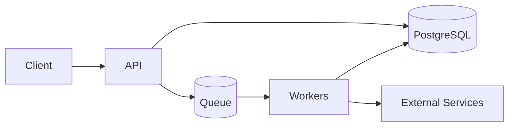

Important concerns:

- Duplicate execution.
- Lease expiration.
- Worker crashes.
- Retry policy.
- Job timeout.
- Scheduling precision.
- Backpressure.

A scheduler should never assume a worker remains alive after accepting a job.

---

## System Design Question: Distributed Cache

A cache system must define:

- Key format.
- Serialization.
- TTL.
- Eviction.
- Consistency.
- Replication.
- Failure behavior.

Common cache patterns:

| Pattern | Description |
|---|---|
| Cache-aside | Application reads/writes cache explicitly |
| Read-through | Cache fetches source data |
| Write-through | Cache and source updated together |
| Write-behind | Cache writes source asynchronously |

Cache-aside is commonly used in backend applications because it keeps cache logic explicit.

---

## System Design Question: Payment System

Payments require stronger correctness guarantees than ordinary APIs.

Important properties:

- Idempotency.
- Transactional state transitions.
- Auditability.
- Authorization.
- Reconciliation.
- Retry safety.

Example state machine:

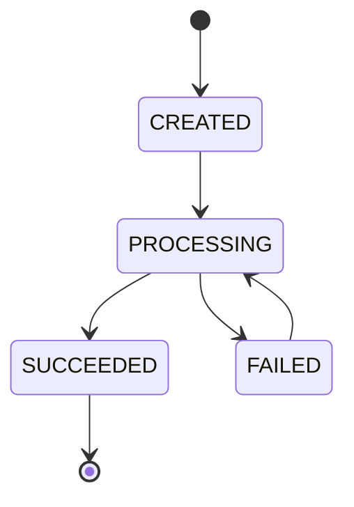

A retry must not accidentally charge the customer twice.

---

## Payment Idempotency

Request:

```http
POST /v1/payments
Idempotency-Key: pay_abc123
```

Persist:

```text
key
request_hash
payment_id
status
response
created_at
```

Concurrent requests using the same key must resolve to one logical operation.

A unique database constraint can provide an important correctness boundary.

---

## System Design Question: Ride-Sharing System

Core components:

```text
Rider Service
Driver Service
Location Service
Matching Service
Trip Service
Payment Service
Notification Service
```

Real-time location updates are high-volume.

Possible flow:

```text
Driver App
   ↓
Location Gateway
   ↓
Location Stream
   ↓
Location Store
   ↓
Matching Service
```

Geospatial indexing is required to efficiently find nearby drivers.

Potential technologies include:

- Redis geospatial capabilities.
- Specialized geospatial databases.
- Search infrastructure.

The correct choice depends on scale, precision, query patterns, and operational constraints.

---

## System Design Question: Video Streaming

Video systems have very different characteristics from ordinary REST APIs.

Typical architecture:

```text
Upload
  ↓
Object Storage
  ↓
Transcoding
  ↓
Multiple Resolutions
  ↓
Object Storage
  ↓
CDN
  ↓
Users
```

Application servers should generally not stream every video byte directly.

CDNs reduce:

- Origin bandwidth.
- Latency.
- Origin load.

---

## System Design Question: Distributed Web Crawler

A crawler requires:

- URL frontier.
- Deduplication.
- Fetch workers.
- Rate limiting.
- Robots policy.
- Content storage.
- Retry handling.

Architecture:

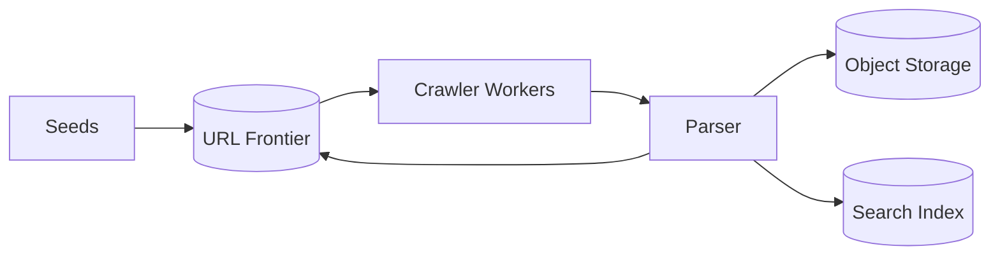

The URL frontier must prevent duplicate work.

Per-domain rate limits are important to avoid overwhelming external sites.

---

## System Design Question: Metrics Platform

A metrics platform has:

```text
Producers
 ↓
Collectors
 ↓
Message Bus
 ↓
Stream Processing
 ↓
Time-Series Storage
 ↓
Query API
 ↓
Dashboards
```

Metrics ingestion is often write-heavy.

Key challenges include:

- High cardinality.
- Retention.
- Compression.
- Aggregation.
- Query performance.
- Backpressure.

A metric label such as:

```text
request_id
```

can create extremely high cardinality and should generally not be treated like a normal metric dimension.

---

## System Design Question: Logging Platform

A production logging system should decouple application logging from log storage.

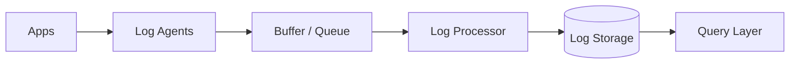

Applications should not synchronously call a central logging database for every log line.

Important considerations:

- Backpressure.
- Sampling.
- Retention.
- PII handling.
- Encryption.
- Search performance.
- Cost.

---

## System Design Question: API Gateway

An API gateway can centralize:

- Authentication.
- Routing.
- Rate limiting.
- TLS termination.
- Request logging.
- Traffic policies.

Example:

```text
Client
 ↓
Nginx / AWS Load Balancer / API Gateway
 ↓
Service
```

Do not place all business logic in the gateway.

The gateway should primarily handle cross-cutting concerns.

---

## System Design Question: E-Commerce Platform

A realistic architecture may contain:

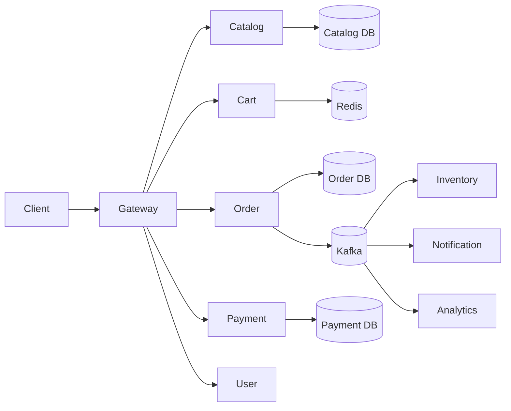

The critical design decision is defining ownership.

For example:

```text
Order Service owns orders.
Inventory Service owns inventory.
Payment Service owns payment state.
```

Do not allow every service to directly modify another service's tables.

---

## Database-per-Service

Microservices often use data ownership boundaries:

```text
Order Service
    ↓
Order DB

Payment Service
    ↓
Payment DB

Inventory Service
    ↓
Inventory DB
```

This provides autonomy but makes cross-service queries harder.

Possible approaches include:

- APIs.
- Events.
- Materialized views.
- Data pipelines.

Do not recreate a distributed relational database accidentally by tightly coupling every service to every other service's data.

---

## System Design Question: Event-Driven Architecture

A typical event flow:

```text
Order Created
    ↓
Kafka
    ├── Inventory Service
    ├── Notification Service
    ├── Analytics Service
    └── Fraud Service
```

Advantages:

- Loose temporal coupling.
- Independent consumers.
- Replay.
- Scalable fan-out.

Costs:

- Eventual consistency.
- Schema evolution.
- Duplicate processing.
- Debugging complexity.
- Ordering constraints.

Events should represent meaningful domain facts rather than arbitrary internal method calls.

---

## Transactional Outbox Pattern

A common problem:

```text
Database transaction succeeds
Event publishing fails
```

Now the database and event stream disagree.

The outbox pattern addresses this:

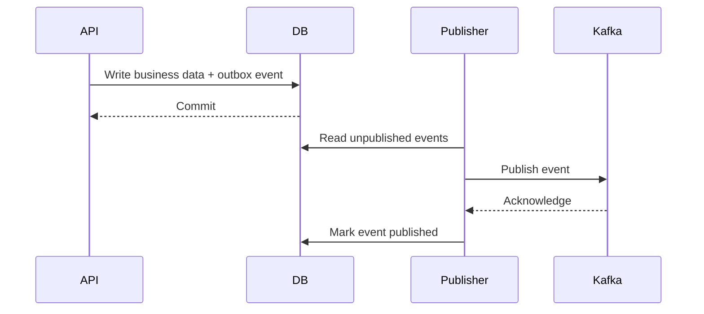

The business data and outbox event are committed atomically.

The publisher can retry event delivery.

Consumers still need idempotency because delivery is commonly at least once.

---

## System Design Question: Distributed Lock

Distributed locks are useful only when the correctness model actually requires them.

Possible implementation:

```text
Redis
 ↓
SET lock_key token NX PX 10000
```

The lock should have:

- Unique ownership token.
- Expiration.
- Safe release.
- Bounded lifetime.

Do not assume a distributed lock automatically provides correctness in every failure scenario.

For critical financial or transactional invariants, database constraints and transactions are often more robust primitives.

---

## System Design Question: Leader Election

Leader election is used when exactly one node should coordinate a task at a time.

Examples:

- Scheduled job coordination.
- Partition management.
- Metadata updates.

Challenges:

- Network partitions.
- Stale leaders.
- Lease expiration.
- Clock assumptions.
- Split brain.

A leader should generally use a lease or fencing mechanism when stale leaders could corrupt state.

---

## System Design Question: Distributed ID Generation

A distributed ID system must provide:

- Uniqueness.
- Scalability.
- Low latency.
- Optional ordering.
- Compact representation where needed.

Options:

| Strategy | Strength | Weakness |
|---|---|---|
| UUID | Simple, globally unique | Larger |
| Database sequence | Simple | Centralized |
| Snowflake-style ID | Distributed and sortable | More operational complexity |
| Random IDs | Simple | Collision handling |

Do not confuse uniqueness with ordering.

---

## System Design Question: Notification Fan-Out

Suppose:

```text
1M users
10 notifications/user/day
```

That creates:

```text
10M notifications/day
```

A synchronous implementation may become expensive.

Use:

```text
Event
 ↓
Queue
 ↓
Workers
 ↓
Provider
```

Workers can scale independently from the API.

Queue depth becomes an important operational metric.

---

## Backpressure

Backpressure prevents producers from overwhelming consumers.

```text
Producer
   ↓
Queue
   ↓
Consumer
```

If consumers process:

```text
5,000 events/sec
```

while producers generate:

```text
20,000 events/sec
```

the backlog grows.

A production design must decide:

- How much backlog is acceptable?
- Should producers slow down?
- Should events be dropped?
- Should lower-priority work be rejected?
- Should more consumers be added?

---

## Load Shedding

When the system is overloaded, serving every request may make the outage worse.

Possible actions:

```text
Reject low-priority requests
 ↓
Preserve critical requests
```

For example:

```text
Payment API → Critical
Analytics API → Degradable
Recommendation API → Optional
```

This allows the system to remain partially functional under severe load.

---

## Graceful Degradation

A system does not always need to be fully functional to remain useful.

Examples:

```text
Recommendation service unavailable
→ Show default content

Analytics unavailable
→ Continue core request

Avatar service unavailable
→ Use placeholder

Search unavailable
→ Return cached results
```

The key is identifying which functionality is essential and which is optional.

---

## Consistency Trade-Offs

Ask what consistency the business actually requires.

### Strong consistency

Useful for:

- Account balances.
- Inventory reservations.
- Payment state.

### Eventual consistency

Useful for:

- Analytics.
- Search indexing.
- Recommendation feeds.
- Counters where slight delay is acceptable.

Do not use eventual consistency merely because it sounds scalable.

---

## CAP Considerations

In the presence of a network partition, distributed systems must trade between consistency and availability.

This does not mean:

> Every distributed database is simply "CP" or "AP" for every operation.

Real systems may expose different consistency models for different operations.

In interviews, explain the actual requirement:

```text
During partition:
Should stale data be served?
Should writes be rejected?
Can conflicting writes occur?
```

Then choose the behavior accordingly.

---

## Common FAANG-Style Follow-Up Questions

Interviewers often change one assumption after the initial design.

Examples:

### "Traffic increased by 100×."

Discuss:

- Horizontal scaling.
- Partitioning.
- Caching.
- Queueing.
- Hotspots.
- Database bottlenecks.

### "The database is unavailable."

Discuss:

- Read behavior.
- Write behavior.
- Retry strategy.
- Cache behavior.
- Degraded mode.
- Recovery.

### "Users are now global."

Discuss:

- CDN.
- Regional deployment.
- Routing.
- Data locality.
- Replication.
- Cross-region consistency.

### "Latency must be below 50 ms."

Discuss:

- Geography.
- Network hops.
- Cache.
- Database access.
- Payload size.
- Serialization.
- Dependency calls.

### "One customer generates 50% of traffic."

Discuss:

- Hot keys.
- Tenant isolation.
- Rate limiting.
- Dedicated capacity.
- Partitioning.

---

## Architecture Trade-Off Matrix

| Decision | Option A | Option B | Senior-Level Question |
|---|---|---|---|
| Application | Monolith | Microservices | Do independent deployment and ownership justify complexity? |
| API | REST | gRPC | Who are the clients and what communication properties matter? |
| Processing | Synchronous | Async | Must the caller wait for completion? |
| Storage | PostgreSQL | NoSQL | What are the access patterns and consistency requirements? |
| Cache | Redis | No cache | Is the database actually the bottleneck? |
| Messaging | Queue | Kafka | Do we need task execution or durable event streaming? |
| Deployment | VMs | Kubernetes | Is orchestration complexity justified? |
| Data | Primary DB | Sharded DB | Is a single database actually the bottleneck? |
| Region | Single | Multi-region | What business requirement justifies global complexity? |

---

## Interviewer Evaluation Criteria

A strong candidate typically demonstrates:

| Area | Strong Signal |
|---|---|
| Requirements | Clarifies ambiguity |
| Capacity | Produces reasonable estimates |
| Architecture | Starts simple and evolves |
| Data | Understands access patterns |
| Scalability | Identifies bottlenecks |
| Reliability | Designs explicit failure handling |
| Consistency | Makes business-driven decisions |
| Security | Considers authentication and authorization |
| Observability | Defines measurable signals |
| Trade-offs | Explains alternatives |
| Communication | Structures reasoning clearly |

A candidate can produce a technically impressive architecture and still perform poorly if the reasoning is unclear.

---

## Common Interview Mistakes

### Starting with technology

Bad:

```text
"We'll use Kafka, Kubernetes, Redis, and Cassandra."
```

Better:

```text
"We need asynchronous durable events consumed independently
by several services, so a streaming platform is justified."
```

### Ignoring requirements

Do not start drawing boxes before understanding:

- Traffic.
- Latency.
- Availability.
- Consistency.
- Data volume.

### Overestimating scale

Do not claim:

```text
10 million requests per second
```

without explaining the assumption.

Capacity estimation should be internally consistent.

### Ignoring the database

Many candidates spend the entire interview on application services.

The database is frequently the actual bottleneck.

Discuss:

- Access patterns.
- Indexes.
- Transactions.
- Replication.
- Partitioning.
- Connection limits.

### Ignoring failures

A normal-path architecture is incomplete.

Ask:

```text
What happens if Redis fails?
What happens if Kafka is unavailable?
What happens if the database becomes read-only?
What happens if a worker crashes?
```

### Treating caches as databases

Cache data can disappear.

Unless explicitly designed otherwise, the source of truth should remain durable.

### Assuming exactly-once processing

End-to-end exactly-once semantics are difficult.

A more practical design is often:

```text
At-least-once delivery
+
Idempotent consumer
+
Deduplication
```

### Using distributed locks everywhere

Distributed locks introduce failure modes and operational complexity.

Prefer:

- Database constraints.
- Atomic operations.
- Transactions.
- Idempotency.

when those primitives solve the problem more directly.

---

## Interview Communication Strategy

Narrate decisions while designing.

Instead of silently drawing:

```text
Kafka → Redis → PostgreSQL
```

explain:

> "The workload is read-heavy, so I will initially use PostgreSQL as the source of truth and Redis for frequently accessed data. If asynchronous consumers become necessary, I would introduce Kafka after establishing the event requirements."

This lets the interviewer evaluate your reasoning.

Use explicit trade-off statements:

> "This improves read latency but introduces cache invalidation complexity."

> "This improves service independence but introduces network failure modes."

> "This improves write scalability but makes cross-partition transactions more difficult."

---

## Whiteboard Architecture Template

Use this structure during an interview:

```text
                    ┌─────────────┐
                    │   Clients   │
                    └──────┬──────┘
                           │
                    ┌──────▼──────┐
                    │ CDN / LB /  │
                    │ API Gateway │
                    └──────┬──────┘
                           │
              ┌────────────▼────────────┐
              │      Application        │
              │       Services          │
              └──────┬───────────┬─────┘
                     │           │
               ┌─────▼────┐ ┌────▼─────┐
               │  Cache   │ │ Database │
               │  Redis   │ │ Postgres │
               └──────────┘ └──────────┘
                     │
               ┌─────▼─────┐
               │ Queue /   │
               │ Kafka     │
               └─────┬─────┘
                     │
               ┌─────▼─────┐
               │ Workers   │
               └───────────┘
```

Then annotate:

```text
Traffic
Latency
Data ownership
Failure modes
Scaling strategy
Security boundary
Observability
```

---

## Final Review Checklist

Before finishing a system design answer, verify:

- [ ] Requirements are explicit.
- [ ] Scope is controlled.
- [ ] Capacity estimates are reasonable.
- [ ] APIs are defined.
- [ ] Data model is clear.
- [ ] Main request path is explained.
- [ ] Database access patterns are understood.
- [ ] Caching is justified.
- [ ] Async processing is justified.
- [ ] Bottlenecks are identified.
- [ ] Horizontal scaling is addressed.
- [ ] Failure scenarios are discussed.
- [ ] Retry behavior is bounded.
- [ ] Idempotency is considered.
- [ ] Consistency requirements are explicit.
- [ ] Authentication is addressed.
- [ ] Authorization is addressed.
- [ ] Observability is defined.
- [ ] Deployment strategy is considered.
- [ ] Disaster recovery is considered where relevant.
- [ ] Major trade-offs are explained.

---

## Key Takeaways

- **FAANG-style system design interviews evaluate structured reasoning under constraints, not memorization of large architectures or specific technologies.**
- **Clarify requirements and estimate capacity before choosing databases, caches, queues, service boundaries, or deployment platforms.**
- **Senior-level answers explicitly address bottlenecks, consistency, concurrency, failure modes, retries, idempotency, security, observability, and operational recovery.**
- **Architecture should evolve from the simplest design that satisfies requirements; distributed-system complexity must have a measurable justification.**
- **The strongest interview performance comes from clearly communicating trade-offs and explaining why each architectural decision follows from the workload and business requirements.**