# 08- Mock Interviews

## Overview

Mock system design interviews are deliberate simulations of the interview environment. Their purpose is not simply to practice drawing architectures, but to evaluate whether you can consistently turn ambiguous requirements into a coherent, scalable, reliable, and explainable design under time pressure.

A useful mock interview reproduces the constraints of a real interview:

- Incomplete requirements.
- Limited time.
- Ambiguous terminology.
- Changing assumptions.
- Follow-up questions.
- Capacity estimation.
- Architecture trade-offs.
- Failure scenarios.
- Communication pressure.

The target skill is **structured engineering reasoning**.

A strong mock interview should expose weaknesses in:

- Requirement gathering.
- Capacity estimation.
- API and data modeling.
- Architecture selection.
- Database design.
- Distributed systems reasoning.
- Scalability.
- Reliability.
- Security.
- Observability.
- Trade-off communication.

The goal is not to produce the most complicated architecture. The goal is to produce the **simplest defensible architecture that satisfies the stated requirements**, then evolve it when the interviewer introduces new constraints.

---

## What a Mock Interview Should Simulate

A realistic session should follow approximately the same lifecycle as a real system design interview.

```mermaid
flowchart LR
    Problem[Ambiguous Problem] --> Requirements[Requirements]
    Requirements --> Scale[Capacity Estimation]
    Scale --> API[API Design]
    API --> Data[Data Model]
    Data --> Architecture[Baseline Architecture]
    Architecture --> Bottlenecks[Bottleneck Analysis]
    Bottlenecks --> ScaleOut[Scaling Strategy]
    ScaleOut --> Reliability[Failure Handling]
    Reliability --> Security[Security]
    Security --> Observability[Observability]
    Observability --> Tradeoffs[Trade-offs]
    Tradeoffs --> Followups[Interviewer Follow-ups]
```



The interviewer should not reveal all requirements upfront.

Instead, the candidate should discover them through targeted questions.

---

## Recommended Mock Interview Format

A practical 60-minute session can be structured as follows:

| Time | Activity | Expected Output |
|---:|---|---|
| 0–5 min | Problem clarification | Functional and non-functional requirements |
| 5–10 min | Capacity estimation | RPS, storage, bandwidth, scale |
| 10–15 min | API and data model | Core interfaces and entities |
| 15–30 min | Baseline architecture | Main components and request flow |
| 30–40 min | Scaling | Bottlenecks and horizontal scaling |
| 40–50 min | Reliability | Failures, retries, consistency, recovery |
| 50–55 min | Security and observability | Security boundaries and operational signals |
| 55–60 min | Follow-ups | Trade-offs and architecture evolution |

Do not spend the entire session drawing the initial architecture.

The later discussion is usually where senior-level system design ability becomes visible.

---

## Interview Setup

Before starting, define the constraints.

### Candidate

The candidate should:

- Think aloud.
- Ask clarifying questions.
- State assumptions.
- Estimate capacity.
- Explain decisions.
- Challenge their own architecture.
- Discuss failure modes.
- Accept changing requirements.
- Avoid prematurely optimizing.

### Interviewer

The interviewer should:

- Provide an intentionally incomplete problem.
- Answer only what is asked.
- Introduce new constraints gradually.
- Challenge architectural decisions.
- Ask failure-oriented questions.
- Test trade-off reasoning.
- Avoid rescuing the candidate too early.

### Observer

If a third person is available, the observer should focus on communication:

- Did the candidate structure the discussion?
- Did they ask useful questions?
- Did they explain why?
- Did they notice bottlenecks?
- Did they handle interruptions?
- Did they recover from mistakes?

---

## Choosing Mock Interview Questions

Questions should progress in complexity.

| Level | Example |
|---|---|
| Intermediate | URL shortener |
| Intermediate | Rate limiter |
| Intermediate | File storage |
| Intermediate | Notification service |
| Intermediate | Pastebin |
| Advanced | News feed |
| Advanced | Chat system |
| Advanced | Ride-sharing |
| Advanced | Video streaming |
| Advanced | Distributed scheduler |
| Senior | Payment platform |
| Senior | Global messaging platform |
| Senior | Multi-region e-commerce |
| Senior | Distributed analytics platform |

The question itself is less important than the constraints imposed during the discussion.

A simple URL shortener can become a difficult interview question if the interviewer adds:

```text
500M writes/day
100:1 read/write ratio
Global users
99.999% availability
Strict redirect latency
Analytics
Custom domains
Multi-region failover
```

---

## The Mock Interview Problem Statement

A good problem statement should be intentionally short.

Example:

> Design a notification platform capable of delivering email, SMS, and push notifications to users.

Do not immediately provide:

```text
10M users
100K notifications/sec
Kafka
Redis
PostgreSQL
AWS
```

Those details should be discovered through questions.

The candidate should ask:

```text
What notification types are required?
What is the expected traffic?
Are notifications synchronous or asynchronous?
What delivery guarantees are required?
Can notifications be delayed?
What happens when a provider fails?
Do users have preferences?
Is ordering important?
What retention is required?
Are there multiple regions?
```

---

## Requirement Gathering During a Mock

The candidate should separate functional and non-functional requirements.

### Functional

```text
Create notification
Schedule notification
Send notification
Track delivery status
Retry failed delivery
Manage user preferences
```

### Non-functional

```text
High availability
Low API latency
High throughput
At-least-once delivery
Durable event storage
Provider failover
Observability
```

The candidate should explicitly state assumptions:

> "I will assume notification creation is synchronous, while actual delivery is asynchronous."

This prevents ambiguity later.

---

## Capacity Estimation Drill

The interviewer should challenge the candidate with changing traffic.

Example:

```text
10M active users
5 notifications/user/day
```

Daily notifications:

```text
10M × 5
= 50M notifications/day
```

Average rate:

```text
50M / 86,400
≈ 579 notifications/sec
```

Assume 10× peak:

```text
≈ 5,790 notifications/sec
```

Then introduce:

> "During major events, traffic can increase another 5×."

Now the candidate should reason about:

```text
≈ 29K notifications/sec
```

The important part is not arithmetic precision.

The important part is showing how the estimate affects architecture.

---

## Architecture Evolution Exercise

A useful mock interview technique is to force the candidate to evolve one architecture repeatedly.

Start:

```text
Client
  ↓
API
  ↓
PostgreSQL
```

Then introduce requirements one at a time.

### Requirement

Read traffic becomes high.

Candidate considers:

```text
Redis
Read replicas
Indexes
Connection pooling
```

### Requirement

Processing becomes expensive.

Candidate considers:

```text
Queue
Workers
Celery
Kafka
```

### Requirement

Multiple independent consumers are needed.

Candidate considers:

```text
Kafka
Event consumers
Consumer groups
```

### Requirement

Traffic becomes globally distributed.

Candidate considers:

```text
CDN
Regional services
Global routing
Data replication
```

### Requirement

One database cannot handle the workload.

Candidate considers:

```text
Partitioning
Sharding
Data ownership
Distributed storage
```

This tests architectural evolution rather than memorization.

---

## Mock Interview Architecture Board

Use a consistent visual layout.

```text
┌─────────────────────────────────────────────────────┐
│                    CLIENTS                          │
└──────────────────────┬──────────────────────────────┘
                       │
┌──────────────────────▼──────────────────────────────┐
│              CDN / LOAD BALANCER                    │
└──────────────────────┬──────────────────────────────┘
                       │
┌──────────────────────▼──────────────────────────────┐
│                  API LAYER                           │
│        Django / FastAPI / REST / gRPC               │
└───────────────┬─────────────────────┬───────────────┘
                │                     │
       ┌────────▼────────┐   ┌────────▼────────┐
       │      Redis      │   │   PostgreSQL    │
       └─────────────────┘   └─────────────────┘
                │
       ┌────────▼────────┐
       │ Queue / Kafka   │
       └────────┬────────┘
                │
       ┌────────▼────────┐
       │     Workers     │
       │ Celery / Jobs   │
       └─────────────────┘
```

The board should contain **flows and relationships**, not implementation details that do not affect the architecture.

---

## Think Aloud Technique

System design interviews evaluate reasoning, so silence can make a good design appear accidental.

Use short statements:

> "This is read-heavy, so I want to optimize the read path first."

> "I will keep PostgreSQL as the source of truth and use Redis as a cache."

> "This operation does not need to block the user request, so I will move it behind a queue."

> "I am avoiding a distributed transaction here because eventual consistency is acceptable for this workflow."

> "The database is likely to become the bottleneck before the application tier, so I want to discuss indexes and read replicas."

Avoid narrating every minor implementation detail.

The goal is to expose architectural reasoning.

---

## Asking Good Clarifying Questions

Not all questions are equally useful.

### Weak question

> "How many users are there?"

### Better question

> "What is the expected peak request rate, and is traffic relatively uniform or bursty?"

The second question directly affects capacity planning.

### Weak question

> "Do we need a database?"

### Better question

> "What data must be durable, what are the primary access patterns, and what consistency guarantees are required?"

The second question helps determine storage architecture.

---

## High-Value Clarifying Questions

### Traffic

- What is the average traffic?
- What is peak traffic?
- Is traffic predictable?
- Are there burst events?
- What is the read/write ratio?

### Users

- How many users?
- Are users geographically distributed?
- Are there high-volume tenants?
- Are there anonymous users?

### Data

- What data must be durable?
- What is the expected data size?
- What is the retention period?
- What are the dominant queries?

### Consistency

- Which operations require strong consistency?
- Is eventual consistency acceptable?
- Is ordering required?

### Availability

- What availability target is required?
- What is the acceptable recovery time?
- What is the acceptable data loss?

### Security

- Is authentication required?
- Are there tenant boundaries?
- Is sensitive or regulated data involved?

---

## API Design Drill

For every mock interview, define the core API surface before implementing internal components.

Example:

```http
POST /v1/orders
GET /v1/orders/{order_id}
POST /v1/orders/{order_id}/cancel
GET /v1/orders/{order_id}/events
```

Discuss:

- Request shape.
- Response shape.
- Authentication.
- Authorization.
- Pagination.
- Idempotency.
- Error semantics.
- Versioning.

For write operations that may be retried, explicitly consider:

```http
Idempotency-Key: 8f7f7d2d-3d2c-4f4f-9d0f-example
```

---

## Data Modeling Drill

Do not simply list tables.

Explain why the model supports the workload.

For an order system:

```text
Customer
    │
    └── Order
          │
          ├── OrderItem
          │
          └── Payment
```

Then discuss:

```text
Primary keys
Foreign keys
Indexes
Uniqueness
Transaction boundaries
Data ownership
Partitioning
Retention
```

A senior candidate should connect schema design to query patterns.

---

## Database Follow-Up Drill

The interviewer can ask:

> "The API is slow. What do you inspect first?"

A strong answer should not immediately be:

> "Add Redis."

Investigate:

```text
Application latency
Database query latency
Query plans
Indexes
Connection pool saturation
Lock contention
CPU
IO
Buffer/cache hit ratio
Replication lag
Network latency
```

Then optimize the actual bottleneck.

---

## Cache Follow-Up Drill

Ask:

> "Redis is now down. What happens?"

Possible answers:

### Hard dependency

Requests fail.

### Soft dependency

Requests fall back to PostgreSQL.

### Degraded mode

Some functionality becomes unavailable while critical operations continue.

The correct choice depends on business requirements.

Also discuss:

```text
TTL
Eviction
Stampede
Hot keys
Invalidation
Serialization
Memory limits
Failover
```

---

## Queue Follow-Up Drill

Ask:

> "The queue is growing continuously. What do you do?"

Investigate:

```text
Producer rate
Consumer rate
Consumer errors
Retry volume
Partition distribution
Worker CPU
Worker IO
External dependency latency
Poison messages
```

Then consider:

```text
Scale consumers
Increase partition count
Reduce producer rate
Apply backpressure
Batch processing
Drop low-priority work
Optimize consumers
```

Do not simply say:

> "Add more workers."

---

## Kafka Follow-Up Drill

For Kafka-based architectures, be prepared to discuss:

- Topics.
- Partitions.
- Consumer groups.
- Ordering.
- Offsets.
- Retention.
- Replication.
- Rebalancing.
- Backpressure.
- Duplicate processing.
- Schema evolution.

Important interview question:

> "How do you guarantee ordering?"

A good answer specifies the ordering scope.

For example:

```text
Partition by order_id
```

can preserve ordering for events associated with one order while allowing unrelated orders to process concurrently.

---

## Celery Follow-Up Drill

For Python/Django systems using Celery, discuss:

```text
Django API
   ↓
Celery broker
   ↓
Worker
   ↓
Task
```

Important concerns:

- Retry policy.
- Task idempotency.
- Visibility timeout.
- Worker crashes.
- Task time limits.
- Queue separation.
- Priority.
- Dead-letter handling.
- Monitoring.

A Celery task should not assume that it will execute exactly once.

---

## Reliability Drill

For every major dependency, ask:

```text
What if it fails?
What if it becomes slow?
What if it returns partial results?
What if requests are duplicated?
What if the network times out?
```

A useful table:

| Dependency | Failure | Mitigation |
|---|---|---|
| Redis | Unavailable | Fallback / degraded mode |
| PostgreSQL | Unavailable | Replica / failover |
| Kafka | Unavailable | Buffer / retry |
| External API | Slow | Timeout / circuit breaker |
| Worker | Crashes | Retry / redelivery |
| Region | Down | Traffic failover |

---

## Retry Strategy Drill

Retries should be bounded.

A reasonable model:

```text
Attempt 1
 ↓
Failure
 ↓
Backoff
 ↓
Attempt 2
 ↓
Failure
 ↓
Backoff
 ↓
Attempt 3
 ↓
Dead-letter / failure state
```

Use exponential backoff with jitter for many distributed dependency calls.

Avoid retry storms.

If 10,000 clients retry at exactly the same interval, the dependency may receive another synchronized traffic spike.

---

## Timeout Drill

Every remote dependency should have a bounded timeout.

For example:

```text
API timeout       = 2 seconds
DB timeout        = 500 ms
Redis timeout     = 50 ms
External provider = 1 second
```

These values are illustrative, not universal.

The important principle is that timeouts must fit within the overall latency budget.

---

## Circuit Breaker Drill

If an external dependency repeatedly fails:

```text
Closed
  ↓
Failures exceed threshold
  ↓
Open
  ↓
Wait
  ↓
Half-open
  ↓
Success → Closed
Failure → Open
```

Circuit breakers can prevent cascading failures, but they must be configured using real dependency behavior.

---

## Idempotency Drill

Ask:

> "What happens if the client retries the same request?"

For a payment:

```text
POST /payments
Idempotency-Key: abc123
```

The service should ensure that:

```text
abc123
```

maps to one logical operation.

This is especially important when the server completed the operation but the client timed out before receiving the response.

---

## Consistency Drill

Ask:

> "Does this operation need to be strongly consistent?"

Classify operations.

| Operation | Typical Requirement |
|---|---|
| Payment authorization | Strong |
| Inventory reservation | Strong |
| Search index | Eventual |
| Analytics | Eventual |
| Recommendation | Eventual |
| Notification status | Usually eventual |

The answer depends on business semantics, not the technology selected.

---

## Security Drill

For every mock, identify:

```text
Authentication
Authorization
Encryption
Secrets
Input validation
Rate limiting
Audit logging
Data isolation
PII handling
```

For multi-tenant systems, explicitly define the tenant boundary.

For example:

```text
Authenticated User
        ↓
Tenant Context
        ↓
Authorization
        ↓
Data Query
```

Do not rely solely on a client-provided tenant ID.

---

## Observability Drill

A production design should expose:

### Metrics

```text
Request rate
Error rate
Latency
Saturation
Queue depth
Database connections
Cache hit ratio
Consumer lag
```

### Logs

Use structured logs containing useful context:

```json
{
  "request_id": "req-123",
  "service": "order-service",
  "operation": "create_order",
  "status": "success",
  "latency_ms": 42
}
```

### Traces

Trace distributed requests across:

```text
API
 ↓
Redis
 ↓
PostgreSQL
 ↓
Kafka
 ↓
Worker
 ↓
External API
```

Observability should help answer:

> "Where did the latency or failure originate?"

---

## Mock Interview Follow-Up Bank

The interviewer can use these questions against almost any architecture.

### Scale

- What happens at 10× traffic?
- What becomes the bottleneck first?
- What happens at 100× traffic?
- Which component scales horizontally?
- Which component cannot scale easily?

### Database

- Why this database?
- What are the indexes?
- What happens when the primary fails?
- How do you handle replication lag?
- When would you partition?
- When would you shard?

### Cache

- What happens when Redis fails?
- How do you invalidate data?
- What prevents cache stampede?
- What happens with a hot key?

### Messaging

- Why Kafka instead of a queue?
- What happens if the consumer crashes?
- How do you handle duplicate events?
- How do you preserve ordering?
- What happens when consumer lag grows?

### Reliability

- What happens if one region fails?
- What happens if the database is unavailable?
- How do retries affect the system?
- How do you prevent cascading failures?

### Consistency

- Where do you require strong consistency?
- Where is eventual consistency acceptable?
- How do you reconcile conflicting data?

### Security

- How do you authenticate clients?
- How do you authorize access?
- How are secrets stored?
- How do you protect internal services?

### Operations

- How do you deploy this?
- How do you roll back?
- How do you monitor it?
- How do you debug a production incident?

---

## Mock Interview Scoring Rubric

Use a 1–5 score for each category.

| Category | 1 | 3 | 5 |
|---|---|---|---|
| Requirements | Starts designing immediately | Identifies major requirements | Systematically clarifies scope and constraints |
| Estimation | No estimates | Basic estimates | Uses estimates to drive architecture |
| API | Vague | Basic APIs | Clear contracts and operational semantics |
| Data | Lists tables | Basic schema | Access-pattern-driven model |
| Architecture | Random components | Functional architecture | Coherent evolving architecture |
| Scalability | "Add servers" | Horizontal scaling | Identifies actual bottlenecks and scaling limits |
| Reliability | Happy path | Basic retries | Explicit failure and recovery model |
| Consistency | Generic claims | Recognizes trade-offs | Maps consistency to business requirements |
| Security | Minimal | Basic authentication | Complete security boundaries |
| Observability | Logs only | Metrics and logs | Metrics, logs, traces, alerts |
| Trade-offs | Technology-driven | Some alternatives | Explicit cost/benefit reasoning |
| Communication | Difficult to follow | Understandable | Structured and concise |

A strong senior-level performance should consistently score high across multiple categories rather than compensate for major weaknesses with an impressive diagram.

---

## Self-Review After Every Mock

Immediately after the session, record:

```text
Question:
Duration:
Estimated difficulty:

What went well:
-

What went poorly:
-

Architecture mistakes:
-

Missed requirements:
-

Weak technical areas:
-

Follow-up questions I could not answer:
-

Trade-offs I failed to explain:
-

Topics to review:
-
```

Do not rely on memory several days later.

The value of mock interviews comes from identifying recurring failure patterns.

---

## Failure Pattern Tracking

Maintain a simple table across multiple sessions.

| Mock | Requirements | Estimation | DB | Scaling | Reliability | Security | Communication |
|---|---:|---:|---:|---:|---:|---:|---:|
| 1 | 3 | 2 | 3 | 2 | 2 | 3 | 4 |
| 2 | 4 | 3 | 3 | 3 | 3 | 3 | 4 |
| 3 | 4 | 4 | 4 | 3 | 4 | 4 | 4 |

The purpose is to identify trends.

For example:

```text
Requirements → strong
Database      → strong
Scalability   → weak
Reliability   → weak
```

This tells you to practice failure analysis rather than repeatedly solving more basic architecture questions.

---

## Beginner Mistakes

### Memorizing architectures

Memorized architectures fail when assumptions change.

Instead, memorize **reasoning frameworks**:

```text
Requirements
→ Scale
→ Access patterns
→ Bottlenecks
→ Trade-offs
```

### Drawing too much

A complicated diagram can hide unclear reasoning.

Draw only components that affect the design.

### Speaking too little

The interviewer cannot evaluate reasoning that is never communicated.

### Speaking too much

Do not narrate every implementation detail.

Focus on decisions.

### Choosing technology too early

Do not start with:

```text
"We need Kafka."
```

Start with:

```text
"We need durable asynchronous fan-out to independent consumers."
```

Then evaluate whether Kafka fits.

---

## Senior-Level Mistakes

Experienced engineers can fail differently.

### Overengineering

Existing production experience can encourage designing a production platform rather than answering the interview question.

The interviewer may want:

```text
Simple architecture
+
Clear evolution path
```

not a complete enterprise platform.

### Excessive caveats

Avoid spending ten minutes discussing obscure failure modes before establishing the core design.

Prioritize:

1. Core requirements.
2. Main architecture.
3. Primary bottlenecks.
4. Important failure modes.
5. Deeper edge cases.

### Technology bias

Knowing Kafka, Kubernetes, Redis, or PostgreSQL deeply does not mean every problem requires them.

Technology should follow requirements.

### Ignoring business semantics

Distributed-system decisions are ultimately driven by business requirements.

For example:

```text
Inventory = 1 item remaining
Two users purchase simultaneously
```

This is a correctness problem, not simply a scaling problem.

---

## Mock Interview Question Progression

A structured progression helps build interview fluency.

### Stage A — Core Architecture

Practice:

- URL shortener.
- Pastebin.
- File storage.
- Rate limiter.
- Notification service.

Focus on:

```text
Requirements
Capacity
API
Database
Caching
Basic scaling
```

### Stage B — Distributed Systems

Practice:

- Chat.
- News feed.
- Distributed scheduler.
- Metrics system.
- Logging platform.

Focus on:

```text
Queues
Kafka
Partitioning
Ordering
Consistency
Failure handling
```

### Stage C — Senior-Level Systems

Practice:

- Payment platform.
- Ride-sharing.
- Global e-commerce.
- Video streaming.
- Multi-region messaging.

Focus on:

```text
Multi-region
Data ownership
Disaster recovery
Consistency
Global routing
Operational complexity
Cost
```

---

## Rapid-Fire Mock Round

A useful advanced exercise is a 15-minute architecture drill.

The interviewer asks:

> Design a URL shortener.

The candidate has:

```text
2 minutes → requirements
2 minutes → capacity
2 minutes → API/data
5 minutes → architecture
2 minutes → failure/scaling
2 minutes → trade-offs
```

The goal is not completeness.

The goal is **architectural compression**: quickly identifying the highest-value decisions.

---

## Constraint Injection Exercise

Start with:

```text
Design a notification service.
```

Then inject constraints:

```text
+ 10M users
+ 100K notifications/sec
+ Global users
+ Provider failures
+ User preferences
+ Scheduled notifications
+ Exactly-once business effect
+ 99.99% availability
+ Audit requirements
```

After every new constraint, ask:

```text
What changes?
What stays the same?
What becomes the new bottleneck?
What new failure mode appears?
```

This is one of the most effective ways to practice senior-level architecture reasoning.

---

## Architecture Recovery Exercise

Take an intentionally flawed architecture:

```text
Client
  ↓
Django
  ↓
PostgreSQL
```

Assume:

```text
500K requests/sec
5 TB database
95% reads
Large asynchronous jobs
Global users
99.99% availability
```

Ask the candidate to identify problems.

Potential issues:

```text
Application scaling
Database read pressure
Cache requirements
Async processing
Global latency
Database failover
Connection limits
Background workload isolation
```

Then evolve the architecture one bottleneck at a time.

---

## Incident-Based Mock Interview

Instead of asking the candidate to design from scratch, start with a production incident.

Example:

> The API normally handles 50K requests/sec. During a traffic spike, latency increases from 80 ms to 4 seconds and database CPU reaches 100%.

Ask:

```text
What do you inspect?
What metrics matter?
What is your immediate mitigation?
What is the likely bottleneck?
How would you prevent recurrence?
```

A strong answer separates:

```text
Immediate mitigation
        ↓
Root cause
        ↓
Permanent fix
        ↓
Preventive controls
```

---

## Production Debugging Mock

Example:

```text
p99 latency increased
Database CPU normal
Redis CPU normal
Kafka lag normal
Application CPU 95%
```

Possible investigation:

```text
CPU profiling
Thread/process saturation
GC behavior
Serialization
Network waits
Unexpected synchronous work
Connection pool behavior
Recent deployment
```

The candidate should avoid assuming that every latency issue is a database issue.

---

## Deployment Mock

Ask:

> "How would you deploy this architecture safely?"

Expected discussion may include:

```text
CI/CD
 ↓
Build
 ↓
Unit tests
 ↓
Integration tests
 ↓
Security scanning
 ↓
Container image
 ↓
Staging
 ↓
Canary / rolling deployment
 ↓
Production
```

For Kubernetes-based systems, discuss:

- Readiness probes.
- Liveness probes.
- Resource requests/limits.
- Rolling deployments.
- Pod disruption budgets.
- Horizontal scaling.
- Secrets management.

For AWS architectures, discuss appropriate managed services only when they simplify the operational model.

---

## Disaster Recovery Mock

Ask:

> "The primary region is unavailable. What happens?"

Discuss:

```text
RTO
RPO
Traffic routing
Database replication
Object storage replication
Message replication
Secrets
Configuration
DNS
Failover process
```

Define:

### RTO

How quickly service must be restored.

### RPO

How much data loss is acceptable.

For example:

```text
RTO = 30 minutes
RPO = 5 minutes
```

These requirements materially influence architecture and cost.

---

## Cost Awareness

Senior system design includes cost.

A design can be technically scalable and economically unreasonable.

Review:

```text
Compute
Database
Storage
Network transfer
Cache
Kafka
Observability
Cross-region replication
Managed services
```

A useful question is:

> "What is the cheapest architecture that satisfies the availability and performance requirements?"

Do not optimize cost at the expense of explicit reliability requirements, but do not ignore it either.

---

## Mock Interview Communication Checklist

During the interview:

- [ ] State assumptions.
- [ ] Ask questions before designing.
- [ ] Separate functional and non-functional requirements.
- [ ] Estimate scale.
- [ ] Explain the dominant workload.
- [ ] Start with a baseline architecture.
- [ ] Explain the primary request flow.
- [ ] Identify bottlenecks.
- [ ] Scale the bottleneck.
- [ ] Discuss failures.
- [ ] Discuss consistency.
- [ ] Discuss security.
- [ ] Discuss observability.
- [ ] Explain trade-offs.
- [ ] Respond to new constraints without restarting unnecessarily.

---

## A Strong Answer Pattern

A compact senior-level response often sounds like:

> "I will first clarify the workload and availability requirements. Based on the expected read/write ratio and peak traffic, I will start with a horizontally scaled API tier backed by PostgreSQL. Redis will be introduced only for high-frequency reads where measurements justify caching. Long-running or retryable operations will move to an asynchronous queue. If we need multiple independent consumers or durable event replay, I would consider Kafka. From there I would address database scaling, failure handling, idempotency, observability, and multi-region requirements based on the constraints."

This demonstrates reasoning rather than technology memorization.

---

## Mock Interview Completion Criteria

A mock should not be considered successful merely because the candidate reached a working architecture.

Evaluate whether the candidate can:

```text
Understand
   ↓
Estimate
   ↓
Model
   ↓
Design
   ↓
Scale
   ↓
Recover
   ↓
Secure
   ↓
Observe
   ↓
Explain
```

The final architecture should be internally consistent with the assumptions established at the beginning.

If assumptions change, the candidate should modify the affected part of the design rather than rebuilding the entire system unnecessarily.

---

## Key Takeaways

- **Mock interviews should simulate ambiguity, time pressure, follow-up questions, changing constraints, and production failure scenarios rather than only testing whether an architecture can be drawn.**
- **A strong interview process follows a repeatable sequence: clarify requirements, estimate capacity, define APIs and data, establish a baseline architecture, identify bottlenecks, and then address reliability and trade-offs.**
- **Practice should deliberately target failure modes such as cache outages, database failures, queue backlogs, duplicate delivery, dependency timeouts, regional outages, and traffic spikes.**
- **Senior candidates distinguish business-critical correctness from optional functionality and use that distinction to drive consistency, availability, degradation, and recovery decisions.**
- **After every mock, record weaknesses and recurring failure patterns; systematic feedback is more valuable than simply completing more system design questions.**