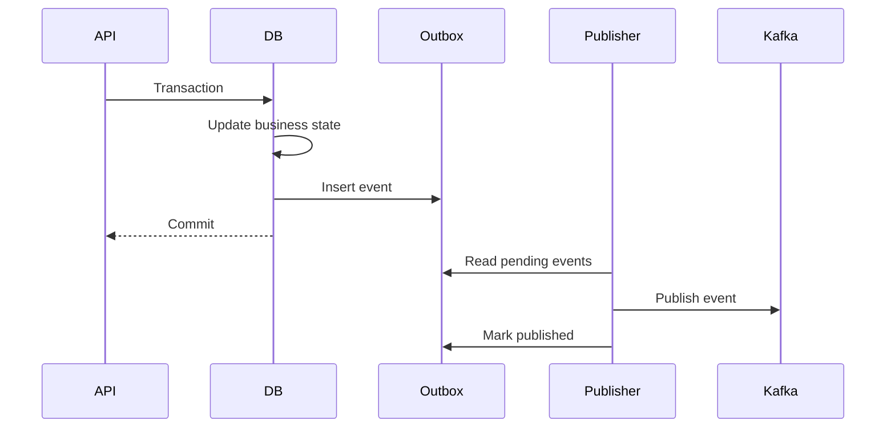

# 09- Interview Cheat Sheet

## Overview

System design interviews evaluate whether you can transform an ambiguous business problem into a technically defensible architecture under time constraints.

Use this cheat sheet as a **rapid-reference framework**, not as a collection of memorized architectures. The most valuable interview skill is knowing which questions to ask, which assumptions matter, which bottleneck is likely to dominate, and which trade-offs are justified.

A strong system design answer should usually move through this sequence:

```text
Requirements
    ↓
Capacity
    ↓
API / Access Patterns
    ↓
Data Model
    ↓
Baseline Architecture
    ↓
Bottlenecks
    ↓
Scaling
    ↓
Reliability
    ↓
Security
    ↓
Observability
    ↓
Trade-offs
```

The architecture should evolve from requirements rather than from a predetermined technology stack.

---

## The 60-Minute Interview Framework

| Time | Focus | Output |
|---:|---|---|
| 0–5 min | Requirements | Functional + non-functional requirements |
| 5–10 min | Capacity | RPS, storage, bandwidth, peak load |
| 10–15 min | API + data | Interfaces, entities, access patterns |
| 15–30 min | Core architecture | Main components + request flow |
| 30–40 min | Scaling | Bottlenecks + horizontal scaling |
| 40–50 min | Reliability | Failures, retries, consistency |
| 50–55 min | Security + observability | Security boundaries + operational signals |
| 55–60 min | Trade-offs | Alternatives + architecture evolution |

Do not spend 40 minutes designing the initial happy path.

The interviewer usually learns more from how you handle scale, failures, consistency, and trade-offs.

---

## Opening the Interview

Start by framing the problem.

A useful opening is:

> "Before designing the architecture, I want to clarify the primary use cases, expected scale, availability and latency requirements, consistency requirements, and any important constraints."

Then ask targeted questions.

Avoid asking every possible question. Ask questions that can materially change the architecture.

---

## Requirement Gathering

### Functional Requirements

Identify what the system must do.

For example, for a URL shortener:

```text
Create short URL
Redirect short URL
Track basic usage
```

For a notification platform:

```text
Create notification
Schedule notification
Deliver notification
Track delivery
Retry failures
Manage preferences
```

### Non-Functional Requirements

Clarify:

```text
Availability
Latency
Throughput
Durability
Consistency
Scalability
Security
Retention
Disaster recovery
```

### Requirement Priority

When requirements conflict, ask which one matters more.

For example:

```text
Strong consistency
        vs
Very high availability
```

or:

```text
Low latency
        vs
Strictly fresh data
```

A senior engineer does not assume every requirement must be maximized simultaneously.

---

## High-Value Questions

### Traffic

- What is the average request rate?
- What is peak traffic?
- Is traffic bursty?
- What is the read/write ratio?
- Are there predictable traffic spikes?

### Users

- How many users?
- How many are active concurrently?
- Are users globally distributed?
- Are there large tenants?

### Data

- How much data exists?
- How fast does it grow?
- What is the retention period?
- What are the primary query patterns?

### Availability

- What availability target is required?
- Is regional failure in scope?
- What are the RTO and RPO?

### Consistency

- Which operations require strong consistency?
- Where is eventual consistency acceptable?
- Is ordering required?

### Security

- Is authentication required?
- Are there multiple tenants?
- Is sensitive or regulated data involved?

---

## Capacity Estimation Cheat Sheet

Capacity estimates do not need to be exact.

They need to be:

- Explicit.
- Internally consistent.
- Easy to revise.
- Useful for architectural decisions.

### Basic Formulas

```text
Requests/sec
= Requests/day ÷ 86,400
```

```text
Peak RPS
= Average RPS × Peak Factor
```

```text
Storage
= Records × Average Record Size
```

```text
Daily Storage
= Writes/day × Average Record Size
```

```text
Bandwidth
= Requests/sec × Average Payload Size
```

### Example

```text
100M requests/day
```

Average RPS:

```text
100M / 86,400
≈ 1,157 RPS
```

Assume a 5× peak:

```text
≈ 5,785 RPS
```

Round for architectural discussion:

```text
≈ 6K peak RPS
```

The purpose is to determine whether a single service, database, cache, queue, or partitioned architecture is sufficient.

---

## Useful Approximation Numbers

For interview estimation, powers of ten are often more useful than false precision.

```text
1 million
≈ 10^6

1 billion
≈ 10^9

1 day
≈ 86,400 seconds
≈ 10^5 seconds
```

Therefore:

```text
1M events/day
≈ 10 events/sec
```

```text
100M events/day
≈ 1,000 events/sec
```

```text
1B events/day
≈ 10,000 events/sec
```

These are useful mental shortcuts.

---

## Latency Thinking

Always distinguish:

```text
Average latency
p50
p95
p99
p99.9
```

A system with:

```text
Average = 50 ms
p99 = 2 seconds
```

can still provide a poor user experience.

For interactive APIs, discuss tail latency when the problem warrants it.

---

## API Design Cheat Sheet

Define only the important endpoints.

Example:

```http
POST /v1/orders
GET /v1/orders/{order_id}
POST /v1/orders/{order_id}/cancel
GET /v1/orders/{order_id}/events
```

Discuss:

- Authentication.
- Authorization.
- Pagination.
- Idempotency.
- Validation.
- Error handling.
- Versioning.
- Rate limiting.

### Pagination

Prefer cursor pagination for large or frequently changing datasets.

```http
GET /v1/orders?limit=50&cursor=eyJpZCI6MTAwMH0=
```

Offset pagination is simpler:

```http
GET /v1/orders?limit=50&offset=1000
```

but can become inefficient or inconsistent for large mutable datasets.

---

## Idempotency

Use idempotency for retryable operations where duplicate execution is dangerous.

Example:

```http
POST /v1/payments
Idempotency-Key: 7d1d4d3e-6d7b-4a45-example
```

The server associates the key with the logical operation.

This protects against:

```text
Client sends request
        ↓
Server processes payment
        ↓
Network timeout
        ↓
Client retries
```

Without idempotency, the payment could be executed twice.

---

## Data Modeling Cheat Sheet

Start from access patterns.

Ask:

```text
What do we read?
What do we write?
How frequently?
By which key?
What must be transactional?
What must be unique?
```

For an order system:

```text
Customer
   │
   └── Order
          │
          ├── OrderItem
          │
          └── Payment
```

Then discuss:

```text
Primary keys
Foreign keys
Indexes
Unique constraints
Transactions
Partitioning
Retention
```

Do not design a schema independently of the workload.

---

## Database Selection

| Requirement | Typical Choice |
|---|---|
| Relational transactions | PostgreSQL |
| Complex relational queries | PostgreSQL |
| Flexible document model | Document database |
| High-throughput key-value access | Key-value database |
| Cache | Redis |
| Full-text/search workload | Search engine |
| Event streaming | Kafka |
| Large binary objects | Object storage |

Do not answer:

> "Use NoSQL because it scales."

Instead explain:

> "The access pattern requires high-throughput key-based reads with predictable partitioning, so a key-value model may be more appropriate than a relational schema."

---

## PostgreSQL Cheat Sheet

When PostgreSQL is the source of truth, discuss:

```text
Indexes
Transactions
Connection pooling
Query plans
Read replicas
Partitioning
Backups
Replication
Failover
```

### Typical Bottlenecks

```text
CPU
IO
Locks
Connections
Slow queries
Missing indexes
Large scans
Replication lag
```

### Important Interview Question

> "Why not just add more application servers?"

Because the database may remain the shared bottleneck.

---

## Indexing

Indexes accelerate reads at the cost of:

- Storage.
- Write overhead.
- Maintenance.
- Memory.

An index should support an actual query pattern.

Example:

```sql
CREATE INDEX CONCURRENTLY idx_orders_customer_created
ON orders (customer_id, created_at DESC);
```

Do not add indexes blindly.

Use query plans and workload measurements.

---

## Transactions

Use transactions when multiple changes must satisfy an atomic business invariant.

Example:

```text
Reserve inventory
+
Create order
```

should be coordinated if both changes belong to one transactional boundary.

Avoid unnecessarily large transactions because they can increase:

```text
Lock duration
Contention
Rollback cost
Database resource usage
```

---

## Caching Cheat Sheet

Use Redis when:

```text
Data is frequently read
Data is expensive to compute
Data can tolerate cache semantics
Latency matters
```

Common patterns:

### Cache-aside

```text
Application
   ↓
Redis
   │
   ├── HIT → Return
   │
   └── MISS
          ↓
      PostgreSQL
          ↓
       Redis
          ↓
       Return
```

### Cache Questions

Always ask:

```text
What is the source of truth?
What is the TTL?
How is invalidation handled?
What happens if Redis fails?
What is the cache hit ratio?
Can one key become hot?
Can a stampede occur?
```

Never assume:

> "Redis makes it scalable."

Caching can introduce consistency and failure-mode complexity.

---

## Cache Stampede

If a popular key expires:

```text
10,000 requests
      ↓
Cache MISS
      ↓
10,000 database queries
```

Mitigations include:

- Request coalescing.
- Locking.
- Early refresh.
- Jittered TTLs.
- Background refresh.
- Stale-while-revalidate patterns.

---

## Hot Keys

A hot key receives disproportionate traffic.

Example:

```text
product:123
```

receives millions of requests.

Possible strategies:

- Replicate the cached value.
- Add local application caching.
- Split the key.
- Use request coalescing.
- Route traffic intelligently.

Do not assume horizontal Redis scaling automatically eliminates hot-key problems.

---

## Asynchronous Processing

Use asynchronous processing when the client does not need the work completed before the response.

Examples:

```text
Send email
Generate report
Resize image
Process video
Publish analytics
Send webhook
```

Typical architecture:

```text
Client
  ↓
API
  ↓
Database
  ↓
Queue
  ↓
Worker
  ↓
External Service
```

Return quickly when business semantics allow it.

---

## Queue vs Kafka

| Requirement | Queue | Kafka |
|---|---|---|
| Background jobs | Excellent | Possible |
| One logical worker per task | Excellent | Possible |
| Durable event stream | Limited | Excellent |
| Multiple independent consumers | Possible | Excellent |
| Replay events | Usually limited | Excellent |
| High-throughput streaming | Good | Excellent |
| Task execution | Natural | Requires application semantics |

Technology selection should follow delivery semantics.

---

## Sync vs Async

### Synchronous

```text
Client → API → Dependency → Response
```

Use when the result is required immediately.

### Asynchronous

```text
Client → API → Queue → Worker
                 ↓
             Processing
```

Use when:

- Work is long-running.
- Retryability matters.
- The client does not need the result immediately.
- Work can be decoupled.

Do not make everything asynchronous.

Asynchronous architectures introduce:

```text
Eventual consistency
Retries
Duplicate processing
Ordering issues
Monitoring complexity
```

---

## REST vs gRPC

| Dimension | REST | gRPC |
|---|---|---|
| Browser compatibility | Excellent | Limited |
| Public APIs | Excellent | Possible |
| Internal service communication | Excellent | Excellent |
| Serialization | Usually JSON | Protobuf |
| Contract | OpenAPI commonly used | Protobuf |
| Streaming | Possible | Strong support |
| Performance | Good | Often better for service-to-service |
| Debugging | Simple | More tooling required |

A common architecture is:

```text
Internet
   ↓
REST/JSON
   ↓
API Gateway
   ↓
Internal Services
   ↓
gRPC
```

---

## Microservices Decision

Do not introduce microservices merely because the system is expected to grow.

Microservices introduce:

```text
Network calls
Distributed tracing
Deployment coordination
Service discovery
Data ownership
Retries
Partial failures
Operational overhead
```

Start with a modular monolith when independent deployment and scaling are not yet justified.

Split services when there is a meaningful boundary such as:

- Independent scaling.
- Independent deployment.
- Strong domain ownership.
- Team ownership.
- Different reliability requirements.
- Different technology requirements.

---

## Load Balancing

Typical flow:

```text
Clients
   ↓
Load Balancer
   ↓
┌──────────┬──────────┬──────────┐
│ API #1   │ API #2   │ API #3   │
└──────────┴──────────┴──────────┘
```

Common strategies:

- Round robin.
- Least connections.
- Weighted routing.
- Consistent hashing.

Prefer stateless application servers where practical.

Store shared session/state outside individual instances when horizontal scaling is required.

---

## Horizontal vs Vertical Scaling

| Scaling | Advantages | Limitations |
|---|---|---|
| Vertical | Simple | Hardware ceiling |
| Horizontal | Elastic | Coordination/distribution complexity |
| Read replicas | Scales reads | Replication lag |
| Partitioning | Limits dataset per node | More operational complexity |
| Sharding | Large-scale horizontal data distribution | High complexity |

A strong answer explains which bottleneck each strategy addresses.

---

## Rate Limiting

Common algorithms:

```text
Fixed Window
Sliding Window
Token Bucket
Leaky Bucket
```

Token bucket is useful when controlled bursts should be allowed.

Example:

```text
Rate = 100 requests/sec
Burst = 200 requests
```

Rate limiting can protect:

- Public APIs.
- Login endpoints.
- Expensive operations.
- External dependencies.

Rate limiting can be implemented at:

```text
CDN
WAF
API Gateway
Nginx
Application
Redis
```

---

## Reliability Cheat Sheet

For every dependency, ask:

```text
What if it fails?
What if it becomes slow?
What if it returns duplicates?
What if it partially succeeds?
```

### Common Techniques

| Problem | Technique |
|---|---|
| Slow dependency | Timeout |
| Transient failure | Retry |
| Repeated failure | Circuit breaker |
| Duplicate request | Idempotency |
| Queue overload | Backpressure |
| Poison message | Dead-letter queue |
| Instance failure | Health checks |
| Region failure | Failover |
| Data loss | Backups + replication |

---

## Timeout and Retry

Timeouts should be bounded.

A service should not wait indefinitely for a dependency.

Use retries selectively.

Good candidates:

```text
Transient network errors
Temporary service unavailability
```

Poor candidates:

```text
Validation errors
Authorization errors
Permanent business failures
```

Use exponential backoff with jitter where appropriate.

```text
delay = base × 2^attempt + jitter
```

Retries consume resources, so retry budgets matter.

---

## Circuit Breaker

Typical state model:

```text
Closed
  ↓
Failure threshold exceeded
  ↓
Open
  ↓
Cooldown
  ↓
Half-open
  ├── Success → Closed
  └── Failure → Open
```

The goal is to prevent one unhealthy dependency from exhausting application resources.

---

## Bulkheads

Separate resources for independent workloads.

Example:

```text
                    API
                     │
          ┌──────────┴──────────┐
          │                     │
      Critical Pool        Analytics Pool
          │                     │
       Database              Warehouse
```

If analytics becomes overloaded, it should not consume all resources required by critical API traffic.

---

## Consistency Cheat Sheet

### Strong Consistency

Reads reflect the latest committed state according to the system's consistency model.

Useful for:

```text
Payments
Inventory
Critical account balances
Authorization decisions
```

### Eventual Consistency

Replicas or derived systems may temporarily differ.

Useful for:

```text
Search indexes
Analytics
Recommendations
Counters
Notifications
```

The important interview question is:

> "What business invariant requires this consistency level?"

---

## CAP Thinking

Under a network partition, a distributed system cannot simultaneously guarantee both:

```text
Strong consistency
+
Full availability
```

in the strongest CAP formulation.

Do not reduce CAP to:

> "Pick two of three."

That oversimplifies the actual engineering trade-off.

In interviews, explain the concrete behavior during partition:

```text
Do requests fail?
Do stale reads occur?
Can writes continue?
How is conflict resolved?
```

---

## Eventual Consistency Pattern

Example:

```text
PostgreSQL
    │
    └── Order Created
            ↓
          Kafka
            ↓
    ┌───────┼────────┐
    ↓       ↓        ↓
 Search  Analytics  Email
```

PostgreSQL remains authoritative while downstream systems maintain derived state.

---

## Messaging Semantics

Know these terms:

```text
At-most-once
At-least-once
Exactly-once
```

### At-most-once

A message may be lost but is not intentionally retried.

### At-least-once

A message can be delivered multiple times.

Consumers therefore need idempotency.

### Exactly-once

Requires careful definition.

Usually discuss **exactly-once business effect**, not casually claiming that an entire distributed system provides exactly-once execution.

---

## Ordering

Ask:

> "Ordering across what scope?"

Possible scopes:

```text
Global ordering
Partition ordering
Per-user ordering
Per-order ordering
Per-account ordering
```

For Kafka, partitioning by:

```text
order_id
```

can preserve ordering for one order while allowing parallel processing across different orders.

---

## Outbox Pattern

Use the transactional outbox pattern when a service must reliably persist database state and publish an event.



This avoids the dangerous sequence:

```text
Commit database
   ↓
Publish event
   ↓
Publisher crashes
```

which can leave database state committed but the event missing.

---

## Distributed Transactions

Avoid distributed transactions unless the business requirement genuinely demands them.

Prefer:

```text
Local transaction
+
Durable event
+
Idempotent consumers
+
Compensation
```

where business semantics permit.

Distributed transactions increase coordination and failure complexity.

---

## Security Cheat Sheet

Always mention:

```text
Authentication
Authorization
Encryption
Secrets management
Input validation
Rate limiting
Audit logging
Data isolation
```

### Authentication

Examples:

```text
OAuth 2.0
OIDC
JWT
Session-based authentication
```

### Authorization

Examples:

```text
RBAC
ABAC
Resource ownership
Tenant isolation
```

Authentication answers:

> Who are you?

Authorization answers:

> What are you allowed to do?

---

## Security Boundaries

A common request flow:

```text
Client
  ↓
TLS
  ↓
WAF / Gateway
  ↓
Authentication
  ↓
Authorization
  ↓
Application
  ↓
Database
```

Do not treat authentication as authorization.

A valid token does not automatically mean the user can access every resource.

---

## Secrets

Never hard-code:

```python
DATABASE_PASSWORD = "production-password"
```

Prefer:

```text
AWS Secrets Manager
AWS Systems Manager Parameter Store
Kubernetes Secrets with appropriate controls
CI/CD secret stores
```

Secrets should be rotated and access should follow least privilege.

---

## Observability Cheat Sheet

Use the three pillars:

```text
Metrics
Logs
Traces
```

### Golden Signals

```text
Latency
Traffic
Errors
Saturation
```

Useful additional signals:

```text
Queue depth
Consumer lag
Database connections
Cache hit ratio
Replication lag
CPU
Memory
Disk IO
```

---

## Structured Logging

Prefer structured logs.

```json
{
  "timestamp": "2026-08-23T12:00:00Z",
  "level": "INFO",
  "service": "order-service",
  "request_id": "req-123",
  "operation": "create_order",
  "status": "success",
  "latency_ms": 42
}
```

Never log:

```text
Passwords
Access tokens
Session secrets
Full payment data
Sensitive personal data
```

unless there is an explicitly justified and protected operational requirement.

---

## Distributed Tracing

For:

```text
Client
 ↓
Nginx
 ↓
API
 ↓
Redis
 ↓
PostgreSQL
 ↓
Kafka
 ↓
Worker
 ↓
External API
```

a trace should help identify where time was spent.

Use consistent:

```text
trace_id
span_id
request_id
```

across services where appropriate.

---

## Deployment Cheat Sheet

A production deployment pipeline commonly looks like:

```text
Commit
  ↓
CI
  ↓
Unit Tests
  ↓
Integration Tests
  ↓
Security Scanning
  ↓
Build Image
  ↓
Push Registry
  ↓
Deploy Staging
  ↓
Smoke Tests
  ↓
Canary / Rolling Deployment
  ↓
Production
```

For Kubernetes, understand:

```text
Deployment
Service
Ingress
ConfigMap
Secret
HPA
Readiness Probe
Liveness Probe
Resource Requests
Resource Limits
```

Do not introduce Kubernetes into the architecture simply because the interview mentions containers.

---

## AWS Architecture Cheat Sheet

Common mappings:

| Requirement | AWS Service |
|---|---|
| Compute | EC2 / ECS / EKS / Lambda |
| Object storage | S3 |
| Relational database | RDS / Aurora |
| Key-value database | DynamoDB |
| Cache | ElastiCache |
| Queue | SQS |
| Pub/sub | SNS |
| Event bus | EventBridge |
| Streaming | MSK / Kinesis |
| CDN | CloudFront |
| DNS | Route 53 |
| Load balancing | ALB / NLB |
| Secrets | Secrets Manager |
| Monitoring | CloudWatch |
| Identity | IAM / Cognito |

Use managed services when they reduce operational burden and satisfy the requirements.

---

## Disaster Recovery Cheat Sheet

Know:

```text
RTO = Recovery Time Objective
RPO = Recovery Point Objective
```

Example:

```text
RTO = 1 hour
RPO = 15 minutes
```

means:

- Service should be restored within approximately one hour.
- Up to approximately 15 minutes of data loss may be acceptable.

Architecture implications include:

```text
Backups
Replication
Multi-AZ
Multi-region
Failover
DNS
Data restoration
Runbooks
```

A backup is not a disaster recovery strategy unless restoration is tested.

---

## Scaling Cheat Sheet

When asked:

> "How do you scale this?"

Do not immediately say:

> "Add more servers."

Ask:

```text
What is the bottleneck?
```

Then classify it:

```text
CPU
Memory
Database
Network
Disk IO
Lock contention
Connection limits
External dependency
Queue throughput
Hot partition
Hot key
```

Then select the appropriate strategy.

---

## Common Scaling Strategies

### Application

```text
Horizontal scaling
Load balancing
Stateless services
Connection pooling
```

### Database

```text
Indexes
Query optimization
Read replicas
Partitioning
Sharding
Caching
```

### Cache

```text
Redis
Local cache
CDN
Request coalescing
```

### Async Work

```text
Queue
Kafka
Celery
Worker pools
Batch processing
```

### Global Systems

```text
CDN
Regional deployment
Global routing
Data replication
```

---

## Architecture Evolution

A common progression:

```text
Modular Monolith
      ↓
Load Balancer
      ↓
Redis
      ↓
Read Replicas
      ↓
Async Workers
      ↓
Kafka / Event Streaming
      ↓
Service Decomposition
      ↓
Partitioning / Sharding
      ↓
Multi-region
```

Do not assume every system needs the final stage.

Complexity should be purchased only when requirements justify it.

---

## Monolith vs Microservices

| Dimension | Modular Monolith | Microservices |
|---|---|---|
| Deployment | Simple | Independent |
| Network complexity | Low | High |
| Data ownership | Centralized | Distributed |
| Scaling | Coarse-grained | Fine-grained |
| Operations | Simpler | More complex |
| Team autonomy | Moderate | High |
| Failure modes | Simpler | Distributed |
| Debugging | Easier | Requires tracing |
| Best starting point | Often | Only when justified |

A modular monolith can still have strong domain boundaries.

---

## Docker vs Kubernetes

| Dimension | Docker | Kubernetes |
|---|---|---|
| Container runtime/build | Excellent | Uses container runtimes |
| Local development | Excellent | More complex |
| Scheduling | Limited | Strong |
| Service discovery | Basic/manual | Built-in primitives |
| Autoscaling | External/manual | Native primitives |
| Self-healing | Limited | Strong |
| Multi-service orchestration | Compose | Kubernetes |
| Operational complexity | Lower | Higher |

A container image and a container orchestration platform solve different problems.

---

## REST vs gRPC

Remember:

```text
REST → broad interoperability
gRPC → efficient service-to-service communication
```

Choose based on:

```text
Consumers
Latency
Payloads
Streaming
Tooling
Contract requirements
```

Do not claim gRPC is automatically better simply because it is binary.

---

## Redis vs Memcached

| Requirement | Redis | Memcached |
|---|---|---|
| Basic caching | Excellent | Excellent |
| Rich data structures | Yes | No |
| Persistence options | Yes | No |
| Pub/sub | Yes | No |
| Lua/scripts | Yes | No |
| Simple distributed cache | Yes | Yes |
| Operational simplicity | Moderate | High |

For a typical Django/FastAPI application cache, Redis is often the more flexible choice.

---

## Sync vs Async

Use synchronous processing when:

```text
Result is immediately required
Operation is short
Consistency is important
```

Use asynchronous processing when:

```text
Operation is long-running
Retries are useful
Work can be decoupled
Immediate completion is unnecessary
```

Always define what the client receives:

```text
202 Accepted
+
job_id
```

can be appropriate for asynchronous workflows.

---

## Event-Driven vs Request-Response

### Request-response

```text
Client → Service → Response
```

Best for:

```text
Interactive queries
Commands requiring immediate response
Simple workflows
```

### Event-driven

```text
Producer → Event Bus → Consumers
```

Best for:

```text
Fan-out
Asynchronous processing
Loose coupling
Event history
Independent consumers
```

Event-driven systems introduce:

```text
Eventual consistency
Duplicate delivery
Ordering
Replay
Schema evolution
Observability complexity
```

---

## Interview Architecture Templates

### CRUD Backend

```text
Client
  ↓
Load Balancer
  ↓
Django / FastAPI
  ↓
PostgreSQL
```

Add:

```text
Redis
```

for measured high-read workloads.

Add:

```text
Celery
```

for asynchronous jobs.

---

### Read-Heavy API

```text
Client
  ↓
CDN / Load Balancer
  ↓
API
  ↓
Redis
  ↓
PostgreSQL Read Replica
  ↓
PostgreSQL Primary
```

Be explicit about cache invalidation and replica lag.

---

### Write-Heavy Event System

```text
Clients
  ↓
API
  ↓
PostgreSQL
  ↓
Outbox
  ↓
Kafka
  ↓
Consumers
```

Use partitioning and consumer groups according to throughput and ordering requirements.

---

### File Upload System

```text
Client
  ↓
API
  ↓
Presigned S3 URL
  ↓
S3
  ↓
Event
  ↓
Workers
  ↓
Processing
```

Avoid sending large files through the application tier unless there is a specific reason.

---

### Notification System

```text
API
  ↓
Queue / Kafka
  ↓
Notification Workers
  ├── Email
  ├── SMS
  └── Push
```

Include:

```text
Retry
Backoff
Dead-letter handling
Provider failover
Idempotency
User preferences
Rate limits
```

---

## Failure Scenarios to Memorize

For every architecture, mentally test:

```text
Database unavailable
Redis unavailable
Kafka unavailable
Worker crashes
Network timeout
External API slow
Duplicate request
Duplicate event
Queue backlog
Traffic spike
Hot key
Hot partition
Region failure
Bad deployment
Data corruption
Credential expiration
```

For each one ask:

```text
Impact?
Detection?
Mitigation?
Recovery?
Prevention?
```

---

## Production Readiness Checklist

Before finishing a system design answer, verify:

### Requirements

- [ ] Functional requirements defined.
- [ ] Non-functional requirements defined.
- [ ] Assumptions stated.

### Scale

- [ ] Average traffic estimated.
- [ ] Peak traffic estimated.
- [ ] Storage estimated.
- [ ] Bandwidth considered.

### API

- [ ] Core endpoints defined.
- [ ] Authentication considered.
- [ ] Idempotency considered.
- [ ] Pagination considered.

### Data

- [ ] Source of truth identified.
- [ ] Access patterns identified.
- [ ] Indexes considered.
- [ ] Transactions considered.

### Architecture

- [ ] Main request flow explained.
- [ ] Components justified.
- [ ] Bottlenecks identified.
- [ ] Scaling strategy defined.

### Reliability

- [ ] Timeouts.
- [ ] Retries.
- [ ] Idempotency.
- [ ] Backpressure.
- [ ] Failover.
- [ ] Disaster recovery.

### Security

- [ ] Authentication.
- [ ] Authorization.
- [ ] Encryption.
- [ ] Secrets.
- [ ] Rate limiting.
- [ ] Data isolation.

### Operations

- [ ] Metrics.
- [ ] Logs.
- [ ] Traces.
- [ ] Alerts.
- [ ] Deployment.
- [ ] Rollback.

---

## Common Interview Traps

### "Use Kafka for everything"

Kafka is not a universal replacement for:

```text
HTTP
Redis
SQS
Celery
PostgreSQL
```

Choose messaging infrastructure according to required semantics.

### "Use Redis for performance"

First determine:

```text
What is slow?
Why is it slow?
How frequently is it accessed?
Can the data be cached safely?
```

### "Use microservices for scalability"

Microservices improve independent scaling and ownership in appropriate cases, but they also introduce distributed-system overhead.

### "Use NoSQL because SQL does not scale"

Relational databases can scale significantly through:

```text
Indexes
Read replicas
Partitioning
Caching
Vertical scaling
Careful schema design
```

### "Exactly once"

Always ask:

> "Exactly once at which layer and what business effect?"

### "Multi-region solves availability"

Multi-region architecture introduces:

```text
Replication
Consistency
Conflict resolution
Routing
Failover
Operational complexity
Cost
```

It is not automatically better.

---

## Interview Trade-Off Language

Use explicit trade-off statements.

### Instead of

> "I will use Redis."

Say:

> "I will use Redis because this workload has frequent reads, the data can tolerate cache semantics, and the latency benefit justifies the additional invalidation and failure complexity."

### Instead of

> "I will use Kafka."

Say:

> "I would introduce Kafka if multiple independent consumers need durable events and replay. If this is only background task execution, a simpler queue may be sufficient."

### Instead of

> "We need microservices."

Say:

> "I would start with a modular monolith unless independent scaling, deployment, ownership, or reliability boundaries justify service decomposition."

---

## Senior-Level Phrases Worth Practicing

Useful statements during an interview:

> "Let me make that assumption explicit."

> "The dominant workload here is read-heavy."

> "I want to identify the bottleneck before introducing another component."

> "This operation can tolerate eventual consistency."

> "This operation cannot tolerate duplicate business effects, so I need idempotency."

> "I would keep PostgreSQL as the source of truth and treat Redis as derived state."

> "The queue provides decoupling, but it also introduces eventual consistency."

> "I would partition by the key that defines the required ordering boundary."

> "The architecture should degrade gracefully if this dependency becomes unavailable."

> "I would measure this before optimizing it."

> "The simplest architecture that satisfies the requirements is preferable."

---

## What Interviewers Usually Look For

| Signal | Strong Candidate |
|---|---|
| Requirements | Asks targeted questions |
| Estimation | Makes reasonable assumptions |
| Architecture | Builds incrementally |
| Database | Understands access patterns |
| Scaling | Identifies bottlenecks |
| Distributed systems | Understands failure modes |
| Reliability | Designs for partial failure |
| Security | Defines boundaries |
| Operations | Thinks about observability |
| Communication | Explains decisions clearly |
| Trade-offs | Understands alternatives |

The interviewer is usually evaluating **engineering judgment**, not the number of technologies you can name.

---

## 30-Second Final Review

If time is almost over, mentally check:

```text
Requirements?
      ↓
Scale?
      ↓
API?
      ↓
Database?
      ↓
Cache?
      ↓
Async?
      ↓
Bottleneck?
      ↓
Failure?
      ↓
Security?
      ↓
Observability?
      ↓
Trade-off?
```

If you can answer all of these clearly, the design is usually in a defensible state.

---

## Key Takeaways

- **Use a repeatable framework: requirements → capacity → APIs/data → architecture → bottlenecks → reliability → security → observability → trade-offs.**
- **Do not memorize technology choices; justify PostgreSQL, Redis, Kafka, Celery, gRPC, microservices, and AWS services from workload and business requirements.**
- **For every important dependency, be prepared to explain timeout, retry, failure, recovery, consistency, and degradation behavior.**
- **Senior-level answers focus on bottlenecks, business invariants, operational complexity, and explicit trade-offs rather than diagram complexity.**
- **When time is limited, prioritize correctness of requirements, capacity, core architecture, dominant bottlenecks, and failure handling over exhaustive component detail.**