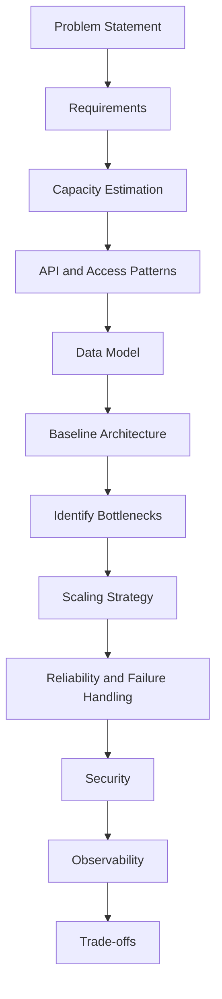

# README

## Overview

This section contains the **System Design Interview Preparation** material required to approach backend and distributed-system design interviews systematically.

The focus is not on memorizing architectures or individual technologies. The material is structured around the reasoning process expected from a senior backend engineer:

```text
Clarify Requirements
        ↓
Estimate Capacity
        ↓
Define APIs and Access Patterns
        ↓
Model Data
        ↓
Design Baseline Architecture
        ↓
Identify Bottlenecks
        ↓
Scale the System
        ↓
Handle Failures
        ↓
Address Security and Observability
        ↓
Explain Trade-offs
```

The documents progress from the interview process itself to practical estimation, architecture construction, advanced interview questions, mock interviews, and rapid revision.

---

## Folder Structure

```text
12- Interview Preparation/
├── 01- System Design Interview Framework.md
├── 02- Requirement Gathering.md
├── 03- Capacity Estimation.md
├── 04- Architecture Templates.md
├── 05- Top 50 Interview Questions.md
├── 06- Senior Backend Interview.md
├── 07- FAANG Style Questions.md
├── 08- Mock Interviews.md
├── 09- Interview Cheat Sheet.md
└── README.md
```

---

## Quick Navigation

| File | Focus |
|---|---|
| [01- System Design Interview Framework](./01-%20System%20Design%20Interview%20Framework.md) | Complete framework for approaching system design interviews |
| [02- Requirement Gathering](./02-%20Requirement%20Gathering.md) | Functional requirements, non-functional requirements, assumptions, constraints, and clarifying questions |
| [03- Capacity Estimation](./03-%20Capacity%20Estimation.md) | Traffic, storage, bandwidth, throughput, latency, peak-load, and back-of-the-envelope calculations |
| [04- Architecture Templates](./04-%20Architecture%20Templates.md) | Reusable production architecture patterns and technology-selection guidance |
| [05- Top 50 Interview Questions](./05-%20Top%2050%20Interview%20Questions.md) | High-value system design questions with the concepts and trade-offs they test |
| [06- Senior Backend Interview](./06-%20Senior%20Backend%20Interview.md) | Senior-level backend architecture, scalability, reliability, and engineering judgment |
| [07- FAANG Style Questions](./07-%20FAANG%20Style%20Questions.md) | Complex system design problems emphasizing distributed systems and trade-offs |
| [08- Mock Interviews](./08-%20Mock%20Interviews.md) | Structured practice scenarios for timed system design interviews |
| [09- Interview Cheat Sheet](./09-%20Interview%20Cheat%20Sheet.md) | Rapid-reference formulas, patterns, trade-offs, failure modes, and interview prompts |

---

## Recommended Reading Order

Follow the files in numerical order.

### Interview Foundation

Start with:

**[01- System Design Interview Framework](./01-%20System%20Design%20Interview%20Framework.md)**

Learn the overall interview workflow, time allocation, communication strategy, and evaluation criteria.

Then study:

**[02- Requirement Gathering](./02-%20Requirement%20Gathering.md)**

Focus on turning ambiguous product requirements into explicit functional and non-functional constraints.

---

### Quantitative Reasoning

Continue with:

**[03- Capacity Estimation](./03-%20Capacity%20Estimation.md)**

Practice estimating:

```text
Users
Requests/sec
Peak RPS
Read/write ratios
Storage
Bandwidth
Database growth
Cache requirements
Queue throughput
```

Capacity estimation should influence architecture decisions rather than being treated as an isolated mathematical exercise.

---

### Architecture Construction

Study:

**[04- Architecture Templates](./04-%20Architecture%20Templates.md)**

Build familiarity with common architectural compositions:

```text
Load Balancer
API Service
PostgreSQL
Redis
Queue
Workers
Kafka
Object Storage
Search
CDN
```

The goal is to understand **when each component is justified**, not to memorize diagrams.

---

### Question-Based Practice

Then move to:

**[05- Top 50 Interview Questions](./05-%20Top%2050%20Interview%20Questions.md)**

Use this to identify recurring system design themes:

- URL shortening
- Rate limiting
- Notification systems
- File storage
- News feeds
- Messaging
- Payments
- Search
- Event processing
- Distributed systems

---

### Senior-Level Reasoning

Continue with:

**[06- Senior Backend Interview](./06-%20Senior%20Backend%20Interview.md)**

Focus on the engineering judgment expected from experienced backend engineers:

```text
Scalability
Reliability
Consistency
Distributed transactions
Data ownership
Observability
Security
Operational complexity
Cost
Disaster recovery
```

At this stage, explain **why** an architecture is appropriate rather than simply describing what it contains.

---

### Advanced Practice

Use:

**[07- FAANG Style Questions](./07-%20FAANG%20Style%20Questions.md)**

These questions should be approached as open-ended architecture problems.

Prioritize:

```text
Requirements
↓
Scale
↓
Core design
↓
Bottleneck
↓
Failure mode
↓
Trade-off
```

Do not optimize prematurely.

---

### Mock Interviews

Practice with:

**[08- Mock Interviews](./08-%20Mock%20Interviews.md)**

Simulate actual interview constraints.

A useful practice format is:

```text
5 min   → Requirements
5 min   → Capacity
10 min  → API + Data Model
15 min  → Architecture
10 min  → Scaling + Reliability
5 min   → Trade-offs
```

Practice explaining the design aloud rather than silently reading solutions.

---

### Final Revision

Use:

**[09- Interview Cheat Sheet](./09-%20Interview%20Cheat%20Sheet.md)**

This is the rapid-review reference for:

- Capacity formulas
- Database selection
- Caching
- Messaging
- Reliability
- Consistency
- Security
- Observability
- AWS architecture
- Scaling strategies
- Interview traps
- Senior-level trade-off language

Use it immediately before interviews or mock sessions.

---

## Core Interview Framework

Every system design problem should eventually converge on a structure similar to:



Do not jump directly from the problem statement to technologies.

For example:

```text
"Design a notification system"
```

should not immediately become:

```text
Kafka + Redis + PostgreSQL + Kubernetes
```

Instead determine:

```text
How many notifications?
Which channels?
What latency?
What delivery guarantees?
What retry behavior?
What ordering?
What retention?
What failure tolerance?
```

Only then should infrastructure choices be introduced.

---

## Technology Decision Mindset

The preparation material should reinforce requirement-driven technology selection.

| Requirement | Possible Technology |
|---|---|
| Relational transactions | PostgreSQL |
| Low-latency cache | Redis |
| Background execution | Celery / queue |
| Durable event streaming | Kafka |
| Service-to-service RPC | gRPC |
| Public HTTP API | REST |
| Large object storage | S3 |
| Global content delivery | CloudFront |
| Reverse proxy | Nginx |
| Container packaging | Docker |
| Container orchestration | Kubernetes |
| Managed relational database | RDS / Aurora |
| Key-value workload | DynamoDB |
| DNS | Route 53 |

The important interview question is not:

> "Which technology should I use?"

It is:

> "Which requirement makes this technology necessary?"

---

## High-Value System Design Areas

The preparation material should build strong understanding across these areas.

### Requirements

```text
Functional requirements
Non-functional requirements
Constraints
Assumptions
Priorities
```

### Capacity

```text
RPS
Peak RPS
Storage
Bandwidth
Read/write ratio
Concurrency
Growth rate
```

### APIs

```text
REST
gRPC
Pagination
Idempotency
Authentication
Authorization
Rate limiting
Versioning
```

### Data

```text
Relational databases
NoSQL
Indexes
Transactions
Replication
Partitioning
Sharding
Data ownership
```

### Distributed Systems

```text
Caching
Queues
Kafka
Eventual consistency
Retries
Timeouts
Circuit breakers
Backpressure
Idempotency
Ordering
```

### Infrastructure

```text
Load balancing
CDN
Docker
Kubernetes
AWS
Multi-AZ
Multi-region
```

### Operations

```text
Metrics
Logs
Tracing
Alerting
Deployment
Rollback
Disaster recovery
```

---

## Architecture Review Checklist

Before considering a system design answer complete, verify:

### Requirements

- [ ] Functional requirements are explicit.
- [ ] Non-functional requirements are explicit.
- [ ] Important assumptions are stated.
- [ ] Requirements are prioritized.

### Capacity

- [ ] Average traffic is estimated.
- [ ] Peak traffic is estimated.
- [ ] Read/write ratio is considered.
- [ ] Storage growth is estimated.
- [ ] Bandwidth is considered where relevant.

### API and Data

- [ ] Core APIs are defined.
- [ ] Access patterns are identified.
- [ ] Primary data store is justified.
- [ ] Indexes are considered.
- [ ] Transactions are considered.
- [ ] Idempotency is considered.

### Architecture

- [ ] Request flow is clear.
- [ ] Data flow is clear.
- [ ] Components have explicit responsibilities.
- [ ] The primary bottleneck is identified.
- [ ] Scaling strategy addresses the actual bottleneck.

### Reliability

- [ ] Timeouts are defined.
- [ ] Retries are bounded.
- [ ] Duplicate processing is considered.
- [ ] Dependency failures are handled.
- [ ] Backpressure is considered.
- [ ] Disaster recovery is considered where relevant.

### Security

- [ ] Authentication is addressed.
- [ ] Authorization is addressed.
- [ ] Encryption is addressed.
- [ ] Secrets are protected.
- [ ] Rate limiting is considered.
- [ ] Tenant/data isolation is addressed where applicable.

### Operations

- [ ] Metrics are defined.
- [ ] Logs are structured.
- [ ] Distributed tracing is considered.
- [ ] Alerts are actionable.
- [ ] Deployment strategy is defined.
- [ ] Rollback strategy is defined.

---

## Common Architecture Patterns to Recognize

You should be able to recognize when a problem naturally maps to one or more of these patterns:

```text
Modular Monolith
Layered Architecture
Load-Balanced Stateless Services
Cache-Aside
Read Replicas
Database Partitioning
Sharding
Asynchronous Workers
Message Queue
Event-Driven Architecture
Publish/Subscribe
Event Sourcing
CQRS
Transactional Outbox
Saga
Circuit Breaker
Bulkhead
Rate Limiter
Distributed Lock
Leader Election
Multi-AZ Deployment
Multi-Region Deployment
CDN-Based Delivery
```

These patterns are composable. A production system rarely uses only one.

---

## Interview Practice Principles

### Think Out Loud

Explain your reasoning:

```text
"I am choosing PostgreSQL because..."
"I am introducing Redis because..."
"I do not need Kafka here because..."
"I would partition by..."
"I am accepting eventual consistency for..."
```

This allows the interviewer to evaluate engineering judgment.

### State Assumptions

Do not hide assumptions.

Prefer:

> "I will assume 10 million daily active users and approximately 100 million requests per day. If that assumption changes significantly, the storage and scaling strategy may change."

### Quantify Whenever Possible

Prefer:

```text
10K RPS
100 GB/day
p99 < 200 ms
99.99% availability
RPO < 15 minutes
```

over vague statements such as:

```text
"High traffic"
"Very scalable"
"Low latency"
"Highly available"
```

---

## Avoid Technology Shopping

A common weak answer looks like:

```text
AWS
Kubernetes
Kafka
Redis
PostgreSQL
Elasticsearch
Cassandra
gRPC
Microservices
```

with little explanation of why each exists.

A stronger answer looks like:

```text
PostgreSQL
→ transactional source of truth

Redis
→ high-frequency read cache

Kafka
→ durable event distribution to multiple consumers

Workers
→ asynchronous processing

S3
→ large object storage

CDN
→ globally distributed static/content delivery
```

Every component should have a reason to exist.

---

## Recommended Practice Progression

```text
Understand Framework
        ↓
Practice Requirements
        ↓
Practice Capacity Estimation
        ↓
Study Architecture Patterns
        ↓
Solve Standard Problems
        ↓
Solve Senior-Level Problems
        ↓
Practice Advanced Problems
        ↓
Run Timed Mock Interviews
        ↓
Use Cheat Sheet for Revision
```

The objective is to move from **recognition** to **reasoning** and finally to **independent architecture design**.

---

## Key Takeaways

- **Follow a consistent interview workflow: requirements → capacity → APIs/data → architecture → bottlenecks → reliability → security → observability → trade-offs.**
- **Treat every technology as a consequence of a requirement; avoid architecture-by-checklist or technology-driven design.**
- **Practice explaining assumptions, quantitative estimates, failure modes, consistency choices, and scaling decisions rather than only drawing architecture diagrams.**
- **Use the documents progressively: framework and requirements first, estimation and templates next, then advanced questions, mock interviews, and final cheat-sheet revision.**
- **A strong system design answer demonstrates engineering judgment: choose the simplest architecture that satisfies the requirements and evolve it when measurable constraints demand additional complexity.**